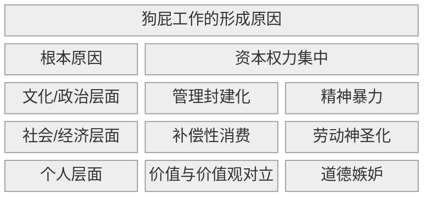

## 1. 核心内容

资本权力通过管理封建制，制造出大量的狗屁工作，并对员工施加精神暴力，导致：

- 用劳动神圣化美化剥削，趋势补偿性消费强化资本循环

- 个人层面：诱发道德嫉妒，进而扭曲价值，产生价值和价值观之间的对立，最终让狗屁工作得以正当运行

## 2. 参考笔记

[[ref-毫无意义的工作]]

[[note-毫无意义的工作]]

## 3. 观点评价

#### a) 认同

- > 人们并不会将个人的职业视作后人对自己的主要评价来源，而是生前共度时光的伴侣和后代

- 揭露了资本主义对劳动异化的一种新形态：心里剥削代替物质剥削

#### b)质疑

作者提出的问题确实直击社会痛点，然而，既然是观点类的书籍，就应该批判地去看待作者的观点。

**1. 未区分情绪宣泄与客观分析**

对于书中给出的一些例子，作者并没有区分，哪些是当事人的情绪宣泄，哪些是认真考量之后的科学分析。换言之，这本书提出的观点，虽然很符合当下社会的情绪，却缺乏客观性的论证。

例如，作者认为，工程师/科研工作者的社会贡献很低。诚然，个体所能突破的知识边界是很小的。根据统计学，只有科研民工的基数足够大，才能在其中出现不世出的天才。但是不积跬步，无以至千里。就是无数人积累起来的一小步，成就了科技进步的一大步。

**2. 静态预判未来，忽视技术奇点可能彻底重构劳动伦理**

再如，作者并没有站在时代的角度对工作进行回顾，却想当然的对未来进行了设想。

作者以火车站为例，对 AI 的冲击进行了反驳：即使现在自动售票很普及，车站还是需要相应的工作人员来解决儿童走失/失物招领等工作。作者认为，在 AI 时代，照料类的工作还是需要人去做，尽管其工作价值很难衡量。以现在的眼光看，似乎很正确，可是随着科技的发展，假如机器解决一切事情的那一天真的到来，我们的社会必定也跟现在大相径庭。以现在的社会去揣测未来有多少意义呢？

**3. 缺乏时代切片比较**

从二战结束到现在的 80 年中，科技飞速发展，劳动与生产的关系，个体与社会的关系，科技与未来的关系...可以说每过大约十年就会有巨大的变化。那么，是否应该分别论述每个时代下的狗屁工作，而不是一棍子打死的说，大部分从事金融业的人干的都是狗屁工作？

## 4. 卡片链接

DeepSeek 说本书的中文版删减了 23 处争议论述，所以英文原版也值得一看。

对比《新教伦理与资本主义》：

| **维度**   | **韦伯《新教伦理》**（1905）     | **格雷伯《狗屁工作》**（2018） | **思想碰撞**       |
| :------- | :--------------------- | :------------------ | :------------- |
| **劳动价值** | 上帝召唤（Calling）→ 劳动即救赎证明 | 人性创造本能 → 劳动即意义实现    | **神圣性 vs 人本性** |
| **批判对象** | 传统主义劳动观（够用即止）          | 金融资本主义劳动异化（为钱丧失意义）  | **惰性 vs 异化**   |
| **历史判断** | 资本主义诞生的文化引擎            | 资本主义晚期的癌变病灶         | **助产士 vs 掘墓人** |
| **解决方案** | 接受“铁笼”（理性化不可避免）        | 打破铁笼（重构意义经济）        | **悲观 vs 激进**   |

关联点：格雷伯痛斥的“劳动神圣化”正是韦伯揭示的**新教伦理幽灵**——当“工作即美德”脱离宗教根基，异化成压迫现代人的道德枷锁。

## 5. 行动

- [ ] task1

## 6. 延伸阅读

- 《倦怠社会》
  - 关联点：精神暴力机制分析
  - 差异点：韩炳哲聚焦功绩社会自我剥削

- 《工作、消费主义和新穷人》
  - 关联点：劳动伦理批判
  - 差异点：鲍曼强调制度性弃民制造

- 《优秀绵羊》
  - 关联点：精英教育制造“高级打手”
  - 差异点：教育系统前段批判

- 《规训与惩罚》by 米歇尔·福柯

- 《新教伦理与资本主义》
