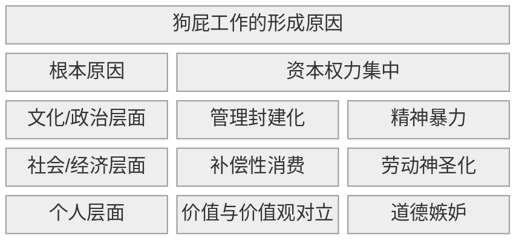

## 1. 核心内容

资本权力通过管理封建制，制造出大量的狗屁工作，并对员工施加精神暴力，导致：

- 用劳动神圣化美化剥削，趋势补偿性消费强化资本循环

- 个人层面：诱发道德嫉妒，进而扭曲价值，产生价值和价值观之间的对立，最终让狗屁工作得以正当运行

## 2. 参考笔记

[note-毫无意义的工作](/docs/note-毫无意义的工作.md)

[ref-毫无意义的工作](/docs/ref-毫无意义的工作.md)

## 3. 相关链接

DeepSeek 说本书的中文版删减了 23 处争议论述，所以英文原版也值得一看

对比《新教伦理与资本主义》：

| **维度**     | **韦伯《新教伦理》**（1905）        | **格雷伯《狗屁工作》**（2018）       | **思想碰撞**         |
| :----------- | :---------------------------------- | :----------------------------------- | :------------------- |
| **劳动价值** | 上帝召唤（Calling）→ 劳动即救赎证明 | 人性创造本能 → 劳动即意义实现        | **神圣性 vs 人本性** |
| **批判对象** | 传统主义劳动观（够用即止）          | 金融资本主义劳动异化（为钱丧失意义） | **惰性 vs 异化**     |
| **历史判断** | 资本主义诞生的文化引擎              | 资本主义晚期的癌变病灶               | **助产士 vs 掘墓人** |
| **解决方案** | 接受“铁笼”（理性化不可避免）        | 打破铁笼（重构意义经济）             | **悲观 vs 激进**     |

关联点：格雷伯痛斥的“劳动神圣化”正是韦伯揭示的**新教伦理幽灵**——当“工作即美德”脱离宗教根基，异化成压迫现代人的道德枷锁。

《规训与惩罚》by 米歇尔·福柯

