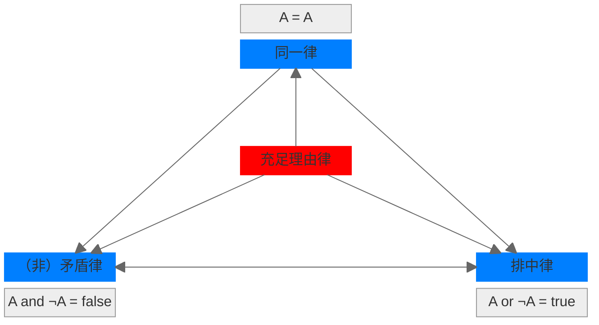
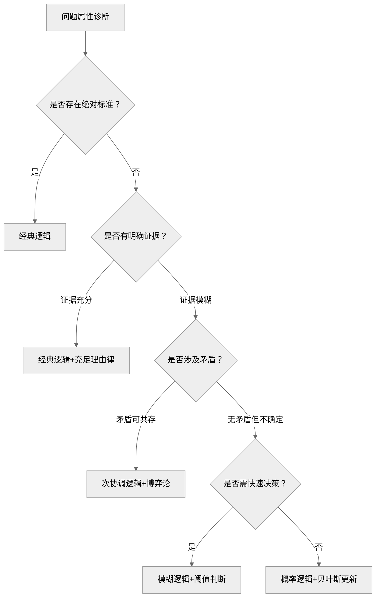

## 1. 核心内容

### a) 逻辑三律

亚里士多德在逻辑学中提出经典逻辑三律：

- 同一律
- （非）矛盾律
- 排中律

其中，同一律是推理的基础，而（非）矛盾律和排中律共同构建的二值体系，保证了逻辑推理的结果是真值（真或者假）。

### b) 充足理由律

莱布尼茨在 17 世纪提出了充足理由律，更多地是在强调逻辑推理的原因/理由/动机。基于此，莱布尼茨提出了理性的宇宙观：

真理分为两种：

- 基于（非）矛盾律的理性真理，具有必然性
- 基于充足理由律的事实真理，具有偶然性

### c) 四大定律之间的关系

- 同一律、矛盾律和排中律是传统逻辑的基石，它们确保推理的内部一致性、确定性和清晰性
- 充足理由律不是纯粹的逻辑定律，而是形而上学或认识论原则，它为逻辑推理提供外部解释和依据，使推理更完整

## 2. 参考笔记

[ref-简单的逻辑学](ref-简单的逻辑学.md)

## 3. 批判性思考

### a) 认同

### b) 质疑

经典逻辑是否存在局限性 ？答案是显然的：四大定律是理想化的模型，适用于确定、静态、离散的领域，而现实世界却是动态、模糊、矛盾、连续（量子）的。Deep Seek 对比了新旧逻辑体系的异同，并给出了建议：

| 四大定律   | 与现实的矛盾点                                       | 现代逻辑学的修正                                             |
| ---------- | ---------------------------------------------------- | ------------------------------------------------------------ |
| 同一律     | 预设概念绝对不变，但现实中的对象可能随时间或语境变化 | 是或者不是                                                   |
| 矛盾律     | 要求绝对无矛盾，但现实中存在辩证矛盾                 | 次协调逻辑，容忍局部可控矛盾的存在                           |
| 排中律     | 强制二值（真/假），但现实存在模糊状态或不可判定命题  | 直觉主义逻辑 + 模糊逻辑，让真值连续化，允许中间态的存在（放弃离散的二值排中） |
| 充足理由律 | 休谟质疑因果必然性，认为理由只是经验的联想           | 理由的充分性用概率度量                                       |

对我而言，最重要的是需要知道自己在什么情况下使用哪种类型的逻辑工具箱，Deep Seek 给出了一套方法论：

正如《宁静祷文》中所说：

> 亲爱的上帝，请赐给我雅量从容的接受不可改变的事，赐给我勇气去改变应该改变的事，并赐给我智慧去分辨什么是可以改变的，什么是不可以改变的。 

这里，接受不可改变之事，即容忍可控的矛盾；改变应该改变的事，则需要分权重逐步处理；而分辨二者的智慧，则是接受逻辑无法闭环的可能性。为此，问自己三个问题：

- 认知层：我的焦虑源于追求不可能的逻辑闭环吗？→ 接受“可证伪性生存”：这个选择在现有证据下最优，但接受未来证伪可能
- 实践层：此刻该用经典工具维稳，还是现代工具纳新？→ 建立逻辑的“脚手架”而非牢笼：接受逻辑缺陷
- 哲学层：如果永远找不到充足理由，我仍愿选择它吗？→ 在不确定中锚定存在性理由：并非凡是都有理由

如爱因斯坦所言：

没有宗教的科学是跛子，没有科学的宗教是瞎子。

发现逻辑缺陷的过程，也是一步一步逼近真理的过程：

## 4. 卡片链接

## 5. 行动

- [ ] 阅读有关现代逻辑学的书籍，先从博弈论开始
- [ ] 总结目前一些有关逻辑学书籍的关联

## 6. 延伸阅读

| 书籍                           | 关联点                     | 差异点                   |
| :----------------------------- | :------------------------- | :----------------------- |
| **《思考，快与慢》**（卡尼曼） | 共探认知偏差（如情感误导） | 从心理学实验补充逻辑盲区 |
| **《批判性思维工具》**（保罗） | 共重论证结构分析           | 更侧重教育场景应用       |
| **《学会提问》**（尼尔·布朗）  | 共击谬误（如稻草人谬误）   | 聚焦提问技巧而非原理推导 |