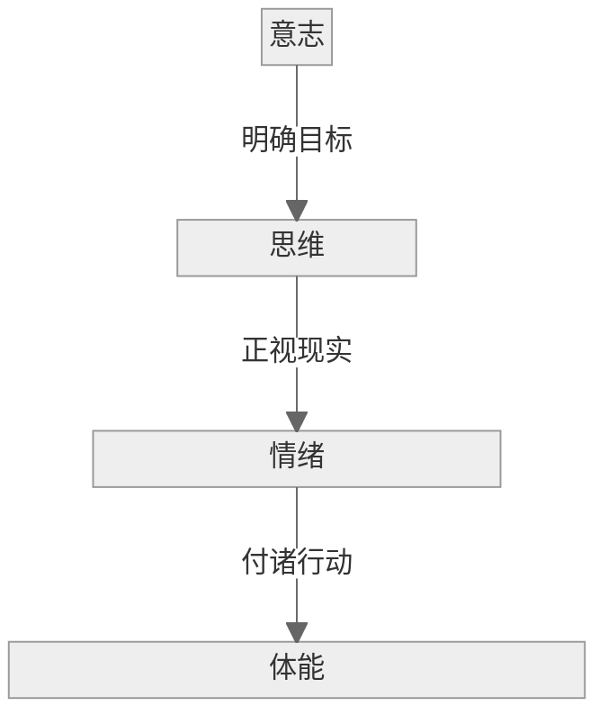
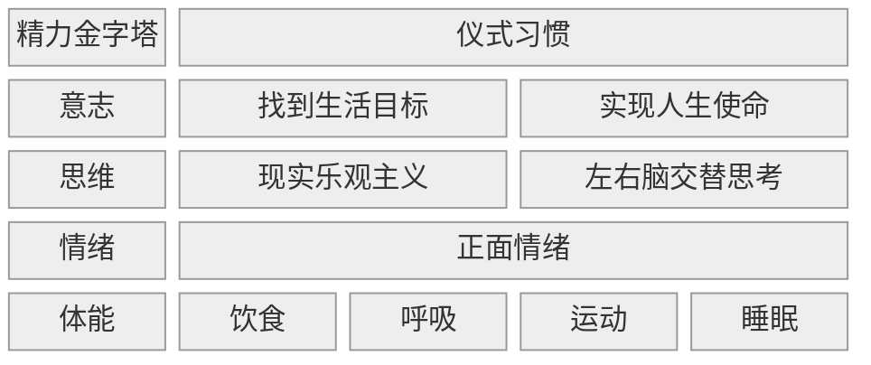

#自我管理

## 1\. 核心内容

精力通过仪式习惯进行管理：

### a) What

精力需要从四个维度进行管理

### b) How

精力管理的方式是不断突破舒适区，形成**仪式习惯**

### c) Why

精力管理的结果/输出是**全情投入**地完成任务

## 2\. 参考笔记

[note-精力管理](note-精力管理.md)

[ref-精力管理](ref-精力管理.md)

## 3. 批判性思考

### a) 认同

- 精力是不断消耗的，同时也可以恢复。我们要做的是实现消耗和恢复的动态平衡
- 要做到动态平衡需要从四个维度管理精力
- 管理精力的手段是形成仪式习惯
- 所谓使命感就是对某件事物本身的渴望，仅仅因为它能带来满足感
- 现实乐观主义：看清事物真相，却依然朝着目标积极努力
- 宁静祷文
- 右脑主导的边缘型思考
- 摄入升糖指数低的食物
- 少食多餐：一天 5-6 餐，每餐 100-150 卡路里
- 不要等感到口渴后再喝水
- 每 90 分钟为一个工作周期

### b) 质疑

- 凡事考虑到 worst case 是一种狭隘思维的视角？
- 意志力可无限扩展（忽略生理限制）

## 4. 卡片链接

[心理表征](card-@刻意练习-刻意练习)

## 5. 行动

- [ ] task1

## 6. 延伸阅读

《心流》米哈里：专注力与幸福感

《为什么精英这样用脑不会累》桦泽紫苑：神经科学视角

《深度工作》卡尔·纽波特：对抗分心