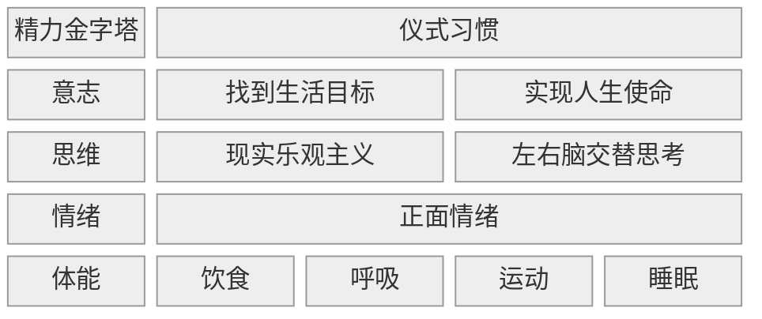

---
{}
---
# 精力金字塔模型

#自我管理

## 1\. 核心内容

### a) What

精力需要从四个维度进行管理

### b) How

精力管理的方式是不断突破舒适区，形成**仪式习惯**

### c) Why

精力管理的结果/输出是**全情投入**地完成任务

## 2\. 参考笔记

[note-精力管理](/docs/note-%E7%B2%BE%E5%8A%9B%E7%AE%A1%E7%90%86.md "note-精力管理")

[ref-精力管理](/docs/ref-%E7%B2%BE%E5%8A%9B%E7%AE%A1%E7%90%86.md "ref-精力管理")

## 3\. 相关链接

[心理表征](/docs/card-@%E5%88%BB%E6%84%8F%E7%BB%83%E4%B9%A0-%E5%88%BB%E6%84%8F%E7%BB%83%E4%B9%A0%E6%A8%A1%E5%9E%8B.md "心理表征")