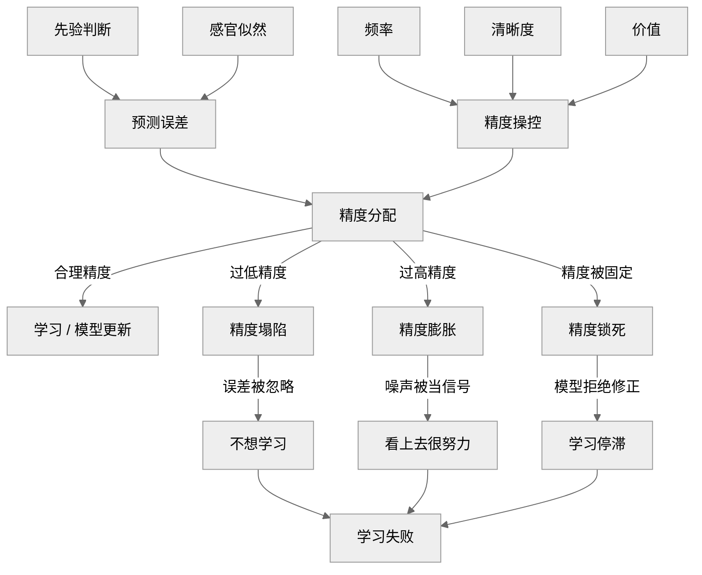

# 核心命题

在自由能 / 预测加工框架下，**学习的本质是对预测误差的精度分配**。三种典型的精度操控偏差导致学习失败：

| 精度类型 | 是什么 | 后果 | 生活实例 |
|---------|--------|------|---------|
| **精度锁死** | 先验精度过高，反证全部被视为噪声 | 学习停止，但主观确定性高 | 应试教育 / 立场先行的自媒体 |
| **精度通胀** | 过多/过快/过强的反馈让低信息量误差被赋予高精度 | 慢变量精度被压低，看似很努力 | KPI / 短视频 / 社交媒体点赞 |
| **精度坍塌** | 误差存在但无法定位/归因/修正 | 多巴胺系统放弃调制，System 2 不再被调用 | 犬儒主义 / 躺平 / 没干劲 |

**评判标准**：误差是否出现（频率）/ 是否清晰（可归因？可修正？）/ 是否有价值（与生存/身份/奖惩绑定？）

---

# 总结模型

---

# 三型详解

## a) 精度锁死

**是什么**：先验精度过高，使得反证全部被视为噪声

**典型机制特征**：

- 标准答案 / 唯一正确路径
- 身份、道德、立场与观点绑定
- 错误被解释为"态度问题"而非模型问题

**认知后果**：

- System 1 先验精度被拉满
- System 2 即使被调用，也只能做"辩护式推理"
- 学习停止，但主观确定性很高

**生活实例**：

- 国内的应试教育
- 战狼自媒体：不谈问题只谈立场

## b) 精度通胀

**是什么**：过多、过快、过强的反馈，使大量低信息量误差被错误地赋予高精度

**典型机制特征**：

- 高频即时反馈
- 强情绪绑定
- 不需要长期建模即可获得刺激

**认知后果**：

- 多巴胺系统被训练去追逐"新奇"而非"结构"
- 慢变量（长期模型）精度被系统性压低
- System 2 变得难以长时间维持

**生活实例**：

- 工作中的 KPI 指标
- 短视频
- 社交媒体点赞

## c) 精度坍塌

**是什么**：误差存在，但无法被定位、归因或修正，导致学习率被主动关闭

**典型机制特征**：

- 延迟反馈
- 结果与行动弱相关
- 成败高度随机或被外部解释

**认知后果**：

- 多巴胺系统放弃调制
- System 2 不再被调用

**生活实例**：

- 犬儒主义
- 躺平主义
- 没干劲

---

# 二阶修正项：情绪 / 生理状态

ChatGPT 提醒：精度并不是纯理性分配的，而是强烈依赖于：

- 疲劳 / 睡眠
- 压力 / 威胁感
- 安全感 / 控制感

在自由能框架下，这些状态会整体性地**抬高或压低精度阈值**——

- 不直接生成预测误差
- 不直接操控精度
- 而是**改变精度分配的默认增益**

不加这个节点，逻辑仍然自洽——这更像是一个"二阶修正项"，而不是结构漏洞。

---

# 个人映射

- 国内教育：标准答案，应试教育 → 精度锁死
- 国外教育：问题导向，贴合世界 → 合理精度
- 少看短视频/电子榨菜：否则一味接受刺激/噪声，不加思考 → 过高精度
- 鼓捣笔记软件和插件：重视工具而忽略了笔记内容本身 → 过高精度赋予工具而非笔记对象
- 定期回顾：追踪反馈，检查结果与行动是否一致 → 预防过低精度
