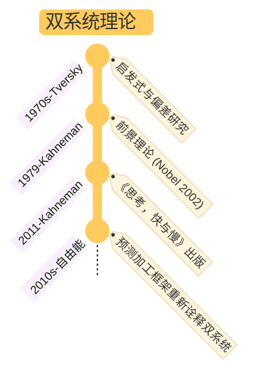

## §1 核心命题

**大脑不是一个理性器官——它是一台双轨的预测机器。**

- **系统 1**：快速、自动、低耗能。直觉、情绪、第一印象由它产出——是被自由能最小化**长期验证过**的先验模型。
- **系统 2**：缓慢、刻意、高耗能。推理、计算、反思由它产出——是在**不确定性下的高精度更新机制**。

不要把二者读成"感性 vs 理性"或"低级 vs 高级"——这是常见误读。准确的版本：**系统 1 是默认，系统 2 是介入**。多数判断由系统 1 主导，系统 2 只在系统 1 出现认知困难时被调用。

## §2 关键区分

| | 系统 1 | 系统 2 |
|---|--------|--------|
| 速度 | 毫秒级 | 秒到分钟级 |
| 耗能 | 极低 | 高 |
| 默认性 | 默认在线 | 被调用才开 |
| 输出 | 直觉 / 情绪 / 模式识别 | 推理 / 计算 / 反思 |
| 准确性 | 在熟悉领域高，在陌生领域系统性偏差 | 慢但相对可靠 |
| 可塑性 | 由系统 2 长期训练塑造 | 通过工具 / Check list 调用 |
| 在贝叶斯框架中 | 提供先验 | 调整后验，更新先验 |

## §3 应用模式

### A. 防偏差 Check List

启动系统 2 的具体动作不是"努力思考"，而是**问几个特定问题**[^1]：

- 锚定效应：我的第一印象是否受到了某个无关数字的过度影响？
- 可得性启发：这个判断是否只因最近看到了类似案例？
- 过度自信：我对这个判断的信心是否远超证据支持？
- 损失厌恶：我是否因害怕失去而拒绝了明显更优的选择？

[^1]: 见 [book-@思考，快与慢](book-@思考，快与慢.md) 关于核心偏差与 [toolkit-@贝叶斯式批判性思维](toolkit-@贝叶斯式批判性思维.md) 的多层检验

### B. 刻意练习 = 系统 2 重塑系统 1

刻意练习的本质是**用系统 2 的高耗能努力，构建出高速、自动、精确的系统 1 模式**——即心理表征。

3F 流程：
- **Focus**：强制调用系统 2，打破系统 1 的自动模式
- **Feedback**：提供外部或自我监控的信息——系统 2 判断的"数据"
- **Fix**：系统 2 根据反馈设计下一步动作，重复后将修正模式刻写进系统 1

更精确的预测加工版本：**刻意练习 = 用高精度误差，重塑低精度但稳定的先验模型**[^2]。

[^2]: 见 [moc-@认知链路](moc-@认知链路.md)

### C. 战略性懒惰 / 环境设计

系统 2 是有限资源——认知负荷会快速削弱它。聪明的做法是**优化环境，让正确选择变得"自动"**：

- 把水果放手边，把零食收柜子（让系统 1 的"顺手"指向健康）
- 用专注模式软件屏蔽干扰网站
- 设计阻力梯度：重要任务减阻力，干扰加阻力

**意志力总是会被环境打败**——不要和系统 1 直接对抗，而是改造它的输入。

### D. 沟通中的双系统

接收方的系统 1 在听你说话时已经做了大量判断（语调 / 表情 / 第一印象 / 标签）。再多的逻辑（系统 2）也很难翻盘已经形成的系统 1 印象。

启示：在沟通中先**激活对方的系统 1 信任**，再传递信息。这是非暴力沟通 / 4P 沟通法的底层机制。

---

## §4 升级版理解：预测加工框架

经典 Kahneman 版本是行为经济学层的描述，更深的版本来自**预测加工 / 自由能框架**：

- 大脑总希望**自由能最小化**（预测误差 + 模型复杂度）
- 在确定性高时，系统 1 用先验模型快速决策
- 在不确定性高时，系统 2 介入，做高精度推理与行动采样
- **多巴胺**调节哪些预测误差值得学习——影响学习率与模型更新幅度

这个框架告诉你：

> 系统 1 与系统 2 不是二元开关，而是**精度阈值**的连续滑动。

详见 [card-@精度操控三型](card-@精度操控三型.md)——精度锁死 / 通胀 / 坍塌都是系统 1↔ 系统 2 切换出错的具体形式。

## §5 边界与反例

- **系统 1 不是低级**：在熟悉领域，专家的系统 1 比新手的系统 2 还准确（消防员的"危险感"、围棋大师的"棋感"）。
- **系统 2 也会犯错**：理论致盲——一旦你接受了某个理论作为思维工具，就很难注意到它的错误。系统 2 会做"辩护式推理"，给系统 1 的偏见找理由。
- **不要把系统 2 当成审判者**：它**不能裁决系统 1 的所有偏差**，因为它本身依赖某个被采纳的模型。两者是相互校正而非上下级。
- **疲劳 / 压力 / 安全感**会整体性地抬高或压低精度阈值——系统 2 的可调用性受生理状态严重影响。Hard work 不能持续。

---

## §6 与其他 card 的关系

- [card-@精度操控三型](card-@精度操控三型.md)：从预测加工角度看，系统 1↔系统 2 的切换是精度分配问题；锁死 / 通胀 / 坍塌都是切换失败
- [card-@二八法则](card-@二八法则.md)：二八思维法本质是**强制系统 2 介入**，对默认的"努力即正义"假设做关键少数审查
- [card-@进化层级模型](card-@进化层级模型.md)：系统 1 是基因 + 长期文化进化（觅母）固化的快速响应；系统 2 是个体经验在神经层的重塑——两者对应进化层级中的"基因→载体→大脑"反馈链
- 未来的 `card-@贝叶斯更新`：系统 2 ≈ 显式的贝叶斯推理；系统 1 ≈ 已编译进神经的隐式先验
- 未来的 `card-@刻意练习`：刻意练习就是系统 2 → 系统 1 的内化机制
- 未来的 `card-@认知偏差清单`：所有认知偏差几乎都是系统 1 在该让出方向盘时没让出

## §7 应用痕迹（被哪些笔记调用）

- [moc-@认知链路](moc-@认知链路.md)：双系统作为整条认知逻辑链中的关键节点，连接贝叶斯、自由能、多巴胺、刻意练习
- [toolkit-@贝叶斯式批判性思维](toolkit-@贝叶斯式批判性思维.md)：把系统 2 的"为什么我的贝叶斯模型失效"作为复盘的核心问题
- [toolkit-@行动三阶段框架](toolkit-@行动三阶段框架.md)：行动前/中/后三层结构本质上是系统 2 介入决策的具体流程
- [card-@精度操控三型](card-@精度操控三型.md)：系统 1 / 2 失效的三种具体形式——精度锁死 / 通胀 / 坍塌
- [ref-人性矩阵系列-06-认知](ref-人性矩阵系列-06-认知.md)：从符号 → 概念 → 命题 → 模型的认知系统构成，与系统 2 的"建模过程"对应
- [book-@粉红色柔软的学习者](book-@粉红色柔软的学习者.md)：神经可塑性给"系统 2 重塑系统 1"提供物质基础

---

## §8 我的视角

> **不要把"理性"等同于"系统 2 全开"。**

很多 self-help 书把"启动系统 2"当作万能解药——多想一会儿就对了。这是误读。

实际上：

- **系统 2 是稀缺资源**——一天能调用的次数有限，过度消耗会导致决策疲劳
- **真正的目标是把系统 2 的成果固化到系统 1**——通过刻意练习 + 环境设计，让正确选择变成默认
- **不要追求"全程理性"**，要追求**"在该理性的时刻能调用得起来"**

可执行的判断标准——
1. **平时**：靠环境设计 / 默认值 / Check list，让系统 1 走在正确的轨道上
2. **关键时刻**：识别"我现在是不是在用系统 1 处理一个该用系统 2 的问题？"——这本身就是元认知
3. **复盘时**：用系统 2 把这次决策的偏差归类（锚定？可得性？过度自信？），下一轮的系统 1 会更稳

**系统 2 不是用来取代系统 1 的——它是用来训练系统 1 的。**

---

## §9 起源（不重要的历史）

