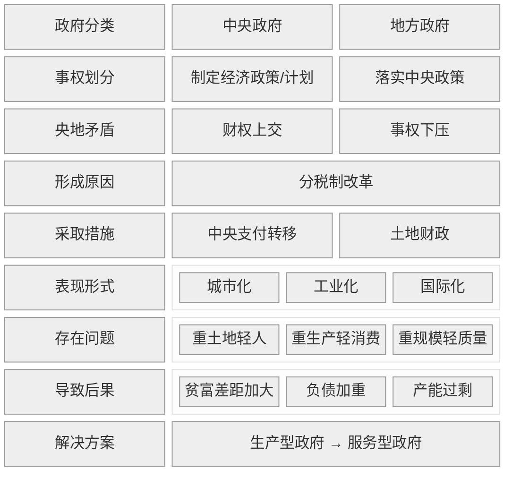
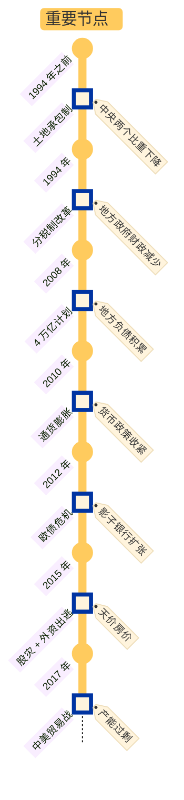

#中国经济 #中国政府

## 1\. 核心内容

中国政府分为中央政府和地方政府。中央政府负责制定宏观经济目标/计划，地方政府负责因地制宜，执行计划。

在计划经济和改革开放初期，我国经济发展失衡。具体体现在两个方面：

- 横向：地区/省份间发发展不平衡
- 纵向：在中央 --> 省--> 市 --> 县的行政划分下，财权层层上收，事权层层下压

为了增加中央财政收入，增强宏观调度能力，政府在 1994 年开始实施分税制改革。分税制改革后，国税和地税互相分立，税收向中央集中，便于中央实施财政转移。地方政府则从两个方面增加税收：

- 城市化：大兴土地财政和土地金融，主要表现为房地产财政
- 工业化：招商引资，发展乡镇企业

城市化和工业化的本质都是让农民的身份发生改变：农民分别变为工人和市民。这样做虽然能让经济快速发展，但也会导致一系列债务问题：

- 过度工业化
    - 国企效率不高，从而导致资源浪费
    - 产能过剩，从而引发国际贸易战
- 过度城市化
    - 重生产、轻消费，忽略了城市建设应该以人为本（即提高公共服务），从而导致人们的贫富差距过大

政府在经济发展中的角色是调控经济发展的速度。随着时代的发展，中国政府的角色也要进行改变：从生产型政府转变为服务型政府。

附中国经济发展过程中的重要节点：

### a) Why

如何解决计划经济遗留的发展失衡问题？

- 横向：地区间发展差距过大
- 纵向：中央财权弱化与地方事权过载

中央政府需重塑财政集权能力，推动全国统一大市场建设

### b) How

如何实现发展再平衡？

- 中央政府
    - 分税制改革
        - 中央强化宏观调控
        - 转移支付平衡地区差异
    - 国际化
        - 加入 WTO
- 地方政府
    - 工业化：招商引资竞赛（税收优惠 + 国企改制）
    - 城市化：土地资本化（土地财政 + 土地金融）
- 个人身份转换：农民 → 工人/市民，支撑工业化与城市化进程

### c) What

成就与代价分别是什么？

- 成就
    - 经济高速增长（2001-2010年均增速10.5%）
    - 城镇化率跃升（1993年28%→2020年64%）
- 代价
    - 国企低效 → 资源错配/产能过剩 → 贸易摩擦
    - 重基建轻服务 → 贫富分化加剧

生产型政府模式下，债务驱动增长不可持续 → 需向服务型政府转型，重构“人本导向”发展逻辑

## 2\. 参考笔记

[note-置身事内：中国政府与经济发展](/docs/note-%E7%BD%AE%E8%BA%AB%E4%BA%8B%E5%86%85%EF%BC%9A%E4%B8%AD%E5%9B%BD%E6%94%BF%E5%BA%9C%E4%B8%8E%E7%BB%8F%E6%B5%8E%E5%8F%91%E5%B1%95.md "note-置身事内：中国政府与经济发展")

[ref-置身事内：中国政府与经济发展](/docs/ref-%E7%BD%AE%E8%BA%AB%E4%BA%8B%E5%86%85%EF%BC%9A%E4%B8%AD%E5%9B%BD%E6%94%BF%E5%BA%9C%E4%B8%8E%E7%BB%8F%E6%B5%8E%E5%8F%91%E5%B1%95.md "ref-置身事内：中国政府与经济发展")

## 3. 批判性思考

### a) 认同

- 中国政府应该从“生产型”向“服务型”过度

### b) 质疑

暂无

## 4\. 卡片链接

## 5. 行动

- [ ] task1

## 6. 延伸阅读

- 《转型中的地方政府》 by 周黎安
  - 关联点：行政发包制、政治锦标赛理论
  - 差异点：更抽象的理论建模
- 《小镇喧嚣》 by 吴毅
  - 关联点：基层政府经济行为田野记录
  - 差异点：微观个案深描
- 《结构性改革》 by 黄奇芬
  - 关联点：政策制定者视角的改革方案
  - 差异点：偏重实操建议
- 《21世纪资本论》
  - 关联点：全球视野下的财富不平等
  - 差异点：中国案例较少
- 《光变》
  - 关联点：京东方崛起中的政府角色
  - 差异点：
- 《芯片战争》
  - 关联点：政府如何在半导体产业中发挥作用
  - 差异点：
- 《大国大城》
  - 关联点：城市化与产业集聚的经济学
  - 差异点：
- 《变革中国》
  - 关联点：市场化转型制度变迁
  - 差异点：