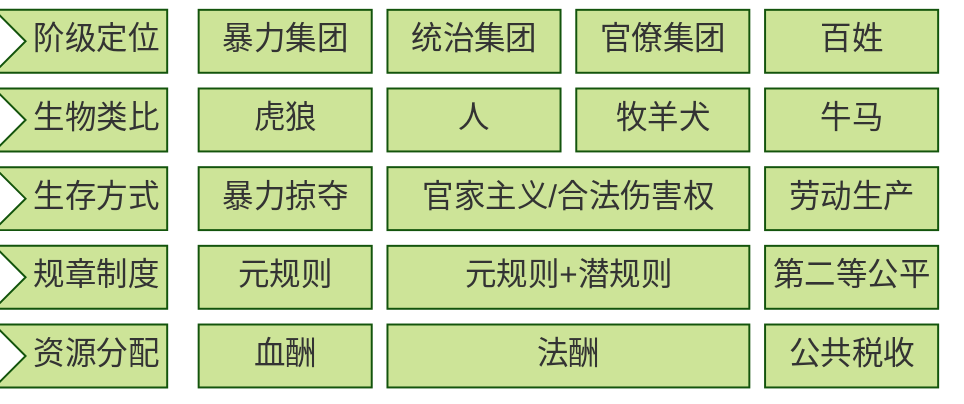

#中国政府

## 1. 核心内容

在一个稳定的大一统社会中，统治集团和官僚集团负责管理，百姓进行经济生产。

不论是统治集团还是官僚集团，都会追求自身利益最大化：

- 上级是暴力最强者，因此他们制定元规则
- 下级在执行元规则时，也会按照潜规则进行利益再分配

元规则和潜规则的执行除了要保证社会正常的运作之外，还拥有合法的掠夺权。

然而，他们也受到血酬定律约束。如果生产-生存平衡被打破，百姓/官员就会放弃生产，转变为暴力集团进行财富掠夺。

当支持暴力集团的基数足够大，便代表了「正义」或者「民意」。于是，原有的统治集团被推翻，新的暴力集团成为统治阶级，循环往复。

血酬定律所描述的核心问题，就是生命与生存资源的交换。

血酬的价值是由拼命争夺的对象的价值决定的。

### a) 血酬

- what
  - 通过暴力掠夺换取的酬劳
- why
  - 生产带来的财富小于暴力掠夺带来的财富
- how：
  - 暴力掠夺的强度/广度与血酬正相关
  - 与成本（道德/机会/财务）负相关

### b) 法酬

- what
  - 法酬 = 全部税收 - 公共税收 （维持社会基本运转 + 百姓基本生存所需要的资金）
  - 暴力集团变为统治集团后，制度化的血酬
- why
  - 统治集团和官僚集团追求利益最大化
- how
  - 皇室利用征税获得的财富
  - 官家利用潜规则/合法伤害权获得的财富

### c) 元规则

- what
  - 暴力最强者说了算
  - 各种规则的规则
- why
  - 追求自身利益的最大化
- how
  - 暴力竞争
  - 谁拥有让对手得不偿失的伤害能力，谁就拥有规则的否决权
- who
  - 暴力竞争的胜利者
  - 接受暴力集团统治的人

### d) 潜规则

- what
  - 潜规则是偏离元规则的、当事人实际遵守并执行的规则
  - 潜规则在明朝被称为「陋规」
- why
  - 元规则产生的收益不足以满足当事人的利益需求
  - 受到血酬定律约束，如果利益（法酬）分配不均，将招致暴力集团报复
- how
  - 当事人将元规则的代表屏蔽于局部互动之外
  - 将元规则的代表拉入私下交易之中
- who
  - 制定潜规则的人
  - 接受潜规则的人
  - 元规则的代表

### e) 官家主义

- what
  - 暴力资源集中在统治者手中
  - 统治者选拔代理人管理
  - 代理人不能世袭，没有武装力量
- why
  - 区别于历史书中所讲的封建帝国主义
  - 皇权专制无法体现潜规则对中国历史的影响
- how
  - 从血酬定律和元规则的角度看，中国历史呈现为一个又一个暴力集团的崛起
  - 他们打天下，坐江山，建立大一统帝国，立法定规，吃法酬，然后被另一个暴力集团推翻，如此循环不已
- when
  - 从秦汉到明清
- who
  - 皇族
  - 官府
  - 官员

### f) 第二等公平

- what
  - 相对于绝对公平，第二等公平是在潜规则框架下实现的相对公平
- why
  - 通过经济生产得到的酬劳高于流血卖命换取的酬劳
- how
  - 拿人钱财，替人消灾
- who
  - 百姓  

## 2. 参考笔记

[ref-潜规则/血酬定律/我想重新解释历史](/docs/ref-潜规则-血酬定律-我想重新解释历史.md)

## 3. 相关链接

[当代政府央地矛盾引发的债务危机](/docs/card-@置身事内-中国政府与经济发展模型.md)
