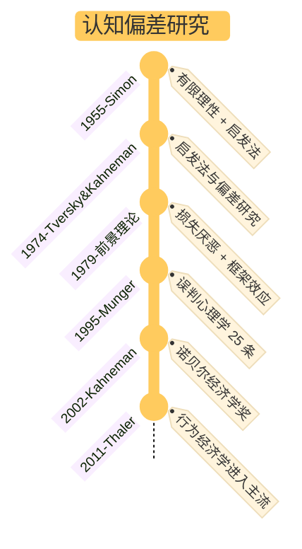

## §1 核心命题

**认知偏差不是大脑的缺陷，是 evolved heuristics（启发法）的副作用——系统 1 在该让出方向盘时没让出。**

启发法是大脑为节能而采取的捷径——在熟悉的环境里高效，在陌生环境里失效。**所有偏差几乎都是贝叶斯更新机制的具体故障**：先验精度过高 / 似然权重偏置 / 学习率失调。

不要追求"消除偏差"——做不到也不该追。目标是**在关键决策时识别它们并主动调用系统 2**[^1]。

[^1]: 见 [card-@系统1系统2](card-@系统1系统2.md) §应用模式 A——防偏差 Check List

## §2 关键区分：三个易混概念

| 概念 | 性质 | 例子 |
|------|------|------|
| **启发法（heuristic）** | 系统 1 的简化判断捷径，**本身中性** | 用相似性快速判断 |
| **认知偏差（cognitive bias）** | 启发法在不当场景的**系统性偏离** | 锚定效应、可得性启发 |
| **逻辑谬误（logical fallacy）** | 论证结构的**形式错误** | 滑坡谬误、人身攻击 |

差别：偏差是**心理机制**层面（系统 1 的快捷动作），谬误是**论证结构**层面（推理过程的逻辑漏洞）。两者常一起出现，但需要不同的工具识别——偏差靠 Check List，谬误靠[批判性思维框架](book-@学会提问.md)。

## §3 主要偏差清单（按机制分组）

### A. 先验锚定类（已有信息绑死后续判断）

- **锚定效应（Anchoring）**：过度依赖最先获得的信息。商业定价"原价 X / 现价 Y" / 谈判中谁先报价。**抵制：刻意换位思考、用多个独立锚点对比。**
- **确认偏差 / 证真偏差（Confirmation Bias）**：只找支持已有观点的证据，不找反例。**抵制：逼自己列出"如果我错了，证据会是什么样"。**
- **现状偏见（Status Quo Bias）**：倾向维持现状，因为改变带来的潜在损失感更突出。
- **理论致盲**：一旦接受某理论，就很难注意到它的错误。会赋予它不受质疑的权利。

### B. 可得性启发类（容易想起的被高估）

- **可得性启发（Availability Heuristic）**：仅凭最近 / 最印象深的案例做判断，忽略统计基率。空难报道后高估飞行风险。**抵制：问"基准率是多少？"**
- **小数定律（Law of Small Numbers）**：把小样本当大样本，过度推论。**抵制：问"样本量是多少？分母是什么？"**
- **近因偏差（Recency Bias）**：过度看重近期数据。
- **频率偏差**：过度看重最常出现的东西。

### C. 损失厌恶类（前景理论的系统性偏离）

- **损失厌恶（Loss Aversion）**：损失带来的痛苦 ≈ 同等收益快乐的 2 倍。
- **禀赋效应（Endowment Effect）**：一旦拥有，估值立刻升高（放弃 = 损失）。
- **沉没成本（Sunk Cost）**：因为已损失这么多，所以继续投入避免"承认损失"的痛苦。**抵制：问"如果今天才开始，我会做这个选择吗？"**
- **框架效应（Framing Effect）**：表述方式改变（"存活率 90%" vs "死亡率 10%"）导致决策不同。**抵制：把同一信息用相反框架重述一遍。**

### D. 自我中心类（高估自己 / 低估他人）

- **过度自信（Overconfidence）**：对自己判断的信心远超证据支持。
- **基本归因错误（Fundamental Attribution Error）**：解释他人行为偏向"性格"，解释自己行为偏向"环境"。
- **后视之明偏差（Hindsight Bias）**：事后觉得"我早就知道"，扭曲对当时不确定性的记忆。
- **达克效应（Dunning-Kruger）**：能力越低越容易高估自己；能力越高越容易低估自己。

### E. 关联与情绪类（情感污染判断）

- **光环效应（Halo Effect）**：一个突出特征影响对整体的判断（"长得帅就觉得能干"）。
- **促发 / 启动效应（Priming）**：先前刺激改变后续反应，且自己没觉察。
- **峰终定律（Peak-End Rule）**：体验只记住峰值和结尾，过程被忽略。**正面利用**：刻意设计结尾。
- **持续时间忽略（Duration Neglect）**：体验时长几乎不影响事后评价。

### F. 社会与激励类（芒格强调的部分）

- **激励机制偏见**：人会自动找理由为有利于自己的行为辩护。"永远不要低估激励的力量。"
- **喜欢 / 热爱倾向**：喜欢一个人 → 自动认同其观点 / 模仿。
- **避免不一致倾向**：维持自我形象的一致性 → 不愿改变观点（即使错了）。
- **从众（Social Proof）**：在不确定时，参照他人行动。

---

## §4 应用模式

### A. 决策前 Check List（短）

[摘自 [book-@思考，快与慢](book-@思考，快与慢.md) 与 [toolkit-@贝叶斯式批判性思维](toolkit-@贝叶斯式批判性思维.md)]

- 锚定：我的第一印象是否受到了某个无关数字的过度影响？
- 可得性：这个判断是否仅因最近看到了类似案例？
- 过度自信：我的信心是否远超证据？
- 损失厌恶：我是否因害怕失去而拒绝了明显更优的选择？
- 基准率：如果我完全不知道这个具体案例，仅基于历史频率，我会给它多大概率？

### B. 决策后复盘 Check List（中）

- 我刚才是用系统 1 还是系统 2 做的决定？
- 如果换一个框架重述这个问题，结论会变吗？
- 这次预测如果错了，最可能错在哪个偏差？
- 我有没有把"事后才看清"误读成"我当时就知道"？

### C. 沟通中识别他人偏差

- 对方是真的在评估证据，还是在维护自我形象一致性？
- 对方是因为"喜欢提议者"而支持，还是因为提议本身？
- 这个共识是真的，还是从众？

### D. 设计反偏差环境

不要靠意志力和单次提醒——**设计制度化的纠偏点**：
- 重要决定**写下来**（让损失厌恶/框架效应暴露）
- 决策前**主动找反例**（让证真偏差失效）
- 重大决定**24 小时冷静期**（让促发效应衰减）
- 引入**第三方视角**（外部顾问会怎么看？）

## §5 升级版理解：偏差是贝叶斯故障

从 [card-@贝叶斯更新](card-@贝叶斯更新.md) 视角看，每种偏差都对应贝叶斯更新机制的具体故障——

| 偏差类型 | 贝叶斯机制故障 |
|---------|---------------|
| 锚定 / 现状偏见 / 理论致盲 | **先验精度过高** → 反证被当噪声 |
| 可得性 / 近因 / 小数定律 | **似然权重偏置** → 易得证据被赋予过高精度 |
| 沉没成本 / 损失厌恶 | **效用扭曲** → 后验决策被损失项放大 |
| 后视之明 / 过度自信 | **元认知失败** → 对自己先验精度的估计本身有偏 |
| 从众 / 激励偏见 | **似然源不独立** → 多条证据其实来自同一信号 |

**这意味着抵制偏差的核心动作是统一的**：
1. 显式化先验（"我现在的信念基于什么？"）
2. 评估似然质量（"这个证据是否独立？精度高吗？"）
3. 容忍后验的不确定（克伦威尔法则——永远不设 0/1）

## §6 边界与反例

- **知道偏差 ≠ 避免偏差**：研究显示，让人读完认知偏差清单，他们的决策偏差并不会显著减少。**偏差是 hardware 级别的——不能靠 software 修复。** 真正起效的是**结构化流程**（Check list / 制度化纠偏 / 第三方监督）。
- **不要病理化系统 1**：很多"偏差"在原生环境（人类演化的小群体狩猎社会）里是高效的——这是 evolved heuristic，不是 bug。在现代社会的某些场景失效，是环境换了不是脑子坏了。
- **偏差清单本身可能成为偏差**：把所有判断都套进偏差框架 → 进入"理论致盲"。**Check list 用于关键决策，不用于日常**。
- **元偏差风险**：研究偏差的人往往认为自己已经超越偏差——这本身是过度自信。
- **文化差异**：很多研究基于 WEIRD（Western, Educated, Industrialized, Rich, Democratic）样本，跨文化普适性存疑。

---

## §7 与其他 card 的关系

- [card-@系统1系统2](card-@系统1系统2.md)：所有偏差几乎都是系统 1 在该让出方向盘时没让出——这张 card 是系统 1 故障的具体目录
- [card-@贝叶斯更新](card-@贝叶斯更新.md)：偏差 = 贝叶斯更新机制的具体故障（先验过强 / 似然偏置 / 学习率失调）
- [card-@精度操控三型](card-@精度操控三型.md)：精度锁死 ≈ 锚定/确认偏差；精度通胀 ≈ 可得性/近因偏差；精度坍塌 ≈ 后视之明的反向（学习不再发生）
- [card-@刻意练习](card-@刻意练习.md)：刻意练习的反馈环节就是**主动制造偏差暴露**——失败 → 思考"我哪个偏差导致了这个失败"
- [card-@二八法则](card-@二八法则.md)：5 类偏差中**先验锚定 + 损失厌恶**这两类影响 80% 的关键决策——抓主要矛盾

## §8 应用痕迹（被哪些笔记调用）

- [book-@思考，快与慢](book-@思考，快与慢.md)：Kahneman 的双系统 + 偏差地图——本 card 主要素材来源
- [toolkit-@芒格多元思维](toolkit-@芒格多元思维.md)：芒格 25 误判心理学 + 双轨分析——把偏差识别变成具体投资工具
- [toolkit-@贝叶斯式批判性思维](toolkit-@贝叶斯式批判性思维.md)：决策前 Check List 直接来自该 toolkit
- [book-@贝叶斯定理](book-@贝叶斯定理.md)：先验偏差 + 框架/证真/锚定/近固/频率偏差
- [book-@学会提问](book-@学会提问.md)：批判性思维的偏差识别（与逻辑谬误并列）

---

## §9 我的视角

> **"偏差清单"是地图，不是决策工具。决策时该用的不是清单，是流程。**

可执行的判断标准——

1. **平时**：不要试图记住所有偏差。**记住 5 个核心**——锚定 / 确认偏差 / 沉没成本 / 损失厌恶 / 过度自信。这 5 个覆盖 80% 的关键决策场景。
2. **关键决策**：把决策**写下来**（弱化框架效应）+ **主动找反例**（弱化证真偏差）+ **24 小时冷静期**（弱化促发）+ **问第三方**（弱化自我中心）。流程比记忆有效。
3. **复盘**：失败后不要问"我哪里做错了"，问"**我哪个偏差被触发了**"。把失败归类到偏差类型，下一轮的系统 1 会更稳[^2]。
4. **警惕"我超越了偏差"**——这本身是过度自信。识别偏差只能弱化它，不能消除它。

[^2]: 见 [card-@刻意练习](card-@刻意练习.md) §C 心理表征构建——失败 → 思考为什么 → 修正

**最重要的元认知**：当你强烈确定某事时，**这正是该启动 Check List 的时刻**。直觉越强，偏差风险越高。

---

## §10 起源（不重要的历史）

