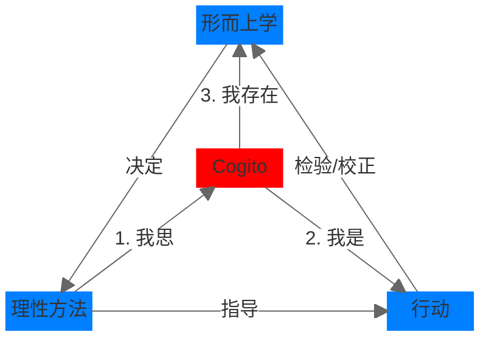

## 1. 核心内容

Cogito 是笛卡尔的核心思想，包含三个阶段：

1. 我思 (je pense)
2. 我是 (je suis)
3. 我存在 (je existe)

Cogito 是连接形而上学思想、方法和行动的拱心石：

- 客观上：
  - 形而上学的思想决定了理性的方法论
  - 方法论指导行动
  - 行动反过来可以对形而上学的思想进行检验/校正
- 主观上：
  - 通过方法论让“我”进行“我思”（反思/怀疑）
  - 因为“我”思考，所以“我（灵魂上）存在”
  - 我思之后，“我”的物理实体会有所行动 → “我是”

笛卡尔认为，理性/理智是人人都有的，然而要很好的使用它们，需要正确的方法论。方法论又衍生出行事规则。笛卡尔分别列出了四条规则：

- 方法论
  - 避免先入为主
  - 化繁为简
  - 从易到难
  - 整体复盘
- 行动
  - 遵守当地法律/风俗
  - 行事果断
  - 行事不成，反求诸己
  - 遵守以上三条

## 2. 参考笔记

[note-谈谈方法](note-谈谈方法.md)

[ref-谈谈方法](ref-谈谈方法.md)

## 3. 批判性思考

### a) 认同

对所有事物保持怀疑的态度，然后小心谨慎地去逐步验证。这应该是批判性思维的最早来源了吧。化繁为简地拆分问题，对应《像高手一样解决问题》中提到的 [MECE 法则](card-@像高手一样解决问题-4S.md)。

而反求诸己的行事风格，也对应了[强风吹拂](blog-@强风吹拂-何谓强大.md)中提到的：主动迎接这些困难，而不是一味地客观强调困难。

### b) 质疑

- 笛卡尔对于上帝/灵魂存在的证明，需要用批判的眼光去看待。笛卡尔也许并没有跳脱他身处的那个时代，对上帝存在的证明十分模棱两可。猜测是为了在那个时代为了获得理论支持合法性而故意迎合教会的说辞。我们应该用科学精神取代上帝

- 对感官（经验主义）的系统性贬低

- 试图用数学/几何去解释一切科学，反例：

  - 量子力学

  - 哥德尔不完备定理：数学系统自身存在不可证命题

## 4. 卡片链接

## 5. 行动

- [ ] 了解形而上学
- [ ] 在解决问题时使用笛卡尔提出的方法论

### a) 初探形而上学 (Metaphysic)

#### 1. **词源真相**

- **亚里士多德原意**：
  其弟子整理著作时，将研究“存在本身”的篇章**放在物理学著作之后** → 定名“物理学之后”
- **中文译名玄机**：
  《易经·系辞》“形而上者谓之道” → 严复精准捕获“超越有形世界”的精髓

#### 2. 核心内容

- 探究的是超越经验世界的“终极实在”（如亚里士多德的“存在之为存在”13，老子的“先天地生”的“道”7），试图回答万物运行的**最深层原理**。

#### 3. 和底层逻辑的区别

- 形而上学追问**存在本身**（如“自然律是客观还是建构？”），属于道的范畴；
- 底层逻辑聚焦**问题解决**（如“流量分发的算法逻辑”），强调操作效能，属于术的范畴

## 6. 延伸阅读

| 书籍                     | 关联点                               | 差异点                             |
| :----------------------- | :----------------------------------- | :--------------------------------- |
| **斯宾诺莎《伦理学》**   | 用几何学写伦理学（笛卡尔方法的应用） | 否定笛卡尔二元论（提出“神即自然”） |
| **洛克《人类理解论》**   | 回应“天赋观念”争议                   | 经验主义立场（白板说 vs 理性主义） |
| **波普尔《猜想与反驳》** | 延续“怀疑-重建”脉络                  | 用“可证伪性”替代“绝对确定性”追求   |