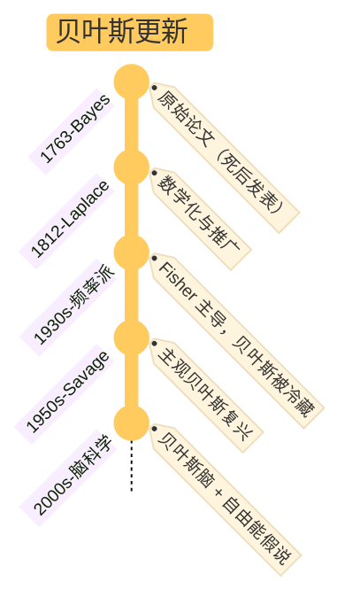

## §1 核心命题

**贝叶斯更新不是一个算式，是一种态度——理性的谦逊。**

它告诉你：**信念可以用概率表示，可以基于证据被持续修正，但永远不会变成 1 或 0。**

公式只是态度的形式化版本：

$$
P(H|E) = P(H) \cdot \frac{P(E|H)}{P(E)}
$$

含义：**后验 = 先验 × 似然比**——看到新证据后，你对假设的信念应该等于原信念乘上"这个证据在假设为真时出现的可能性 / 在假设为假时出现的可能性"。

## §2 关键区分：贝叶斯派 vs 频率派

| | 频率派（P 值） | 贝叶斯派 |
|---|----------------|----------|
| 关注 | "如果假设为真，观察到这组数据的概率？" P(Data\|H) | "既然观察到这组数据，假设为真的概率？" P(H\|Data) |
| 推断方向 | 假设 → 数据（演绎） | 数据 → 假设（归纳） |
| 先验 | 不显式纳入 | 显式纳入并允许主观 |
| 结论 | 拒绝 / 接受（二元） | 信念强度（连续概率） |
| 致命缺陷 | 重复性危机：P 值达标 ≠ 假设为真 | 先验若设为 0 / 1 → 永远无法被证据更新 |

**重复性危机的根源**：很多"显著发现"是因为先验概率极低（如心灵感应），但 P 值达标就被宣布为真。贝叶斯思维要求：在看实验结果之前，先审视假设本身**听起来有多靠谱**。

## §3 应用模式

### A. 似然比思维（实操核心）

面对新信息时，不要问"我该不该相信它"——

> **问：如果我的假设是真的，看到这个证据的可能性，比假设是假的时看到它的可能性大多少倍？**

这是个**比值**，不是绝对概率。它能帮你过滤噪音——当似然比接近 1，证据没有信息量；当似然比远离 1，证据有信息量。

新胜算 = 旧胜算 × 似然比。这是贝叶斯更新最实操的形式。

### B. 克伦威尔法则（保持开放）

> **永远不要把先验概率设为 0 或 1。**

如果你认为某事"绝无可能"（概率 = 0），那么无论后续有多少证据，贝叶斯公式算出的后验永远是 0。这就是"死脑筋"。**保持逻辑开放性**（概率永远在 0 到 1 之间）是贝叶斯主义者的道德修养。

### C. 高手与普通人的差别（更新先验的能力）

> 厉害的人和普通人的区别——不在于是否有先验，而在于**能否持续微量化更新先验**。

普通人：先验僵化 → 看到反证也不更新（精度锁死）
高手：先验精细 → 持续微调，最终形成高精度心理表征

具体怎么训练？**3F 流程**[^1]：

| 步骤 | 贝叶斯对应 |
|------|-----------|
| Focus（专注） | 收集高质量似然数据 |
| Feedback（反馈） | 产生预测误差 |
| Fix（修正） | 后验更新先验 |

[^1]: 见 [book-@刻意练习](book-@刻意练习.md) 与 [moc-@认知链路](moc-@认知链路.md)

### D. 在生活中（不要试图精确算概率）

> 我们无法获取所有相关信息，更不可能用贝叶斯公式整合所有变量。

实操版本：
- **不要追求精确概率**——超级预测者擅长定先验，普通人不擅长，强行算反而误导
- **要追求方向性更新**——这条新信息让我对 X 更确信还是更怀疑？变化幅度是大是小？
- **避免争论某个假说"对错"**——把它转化为"对它的信念有多强"

---

## §4 升级版理解：贝叶斯 + 精度

经典贝叶斯只有先验和似然两个项。但**预测加工框架**告诉你还有第三类参数——**精度**[^2]：

$$
\text{后验} = \text{先验} \times \text{先验精度} \times \text{似然} \times \text{似然精度}
$$

[^2]: 见 [moc-@认知链路](moc-@认知链路.md) §3 与 [card-@精度操控三型](card-@精度操控三型.md)

精度 = 你对该信息的确信程度。

- 先验精度高 → 更相信原模型（系统 1 主导）
- 似然精度高 → 更相信当下输入（系统 2 介入）
- 都不高 → 进入探索 / 不确定状态

**多巴胺**调节哪些预测误差值得学习——精度高的误差才被纳入更新；精度低的当作噪声丢弃。

这就是为什么贝叶斯更新不是机械的算式：**学习率本身是被多巴胺调节的**。

## §5 边界与反例

- **先验不是偏见，是基石**——没有先验就无法做任何推断。问题不在"有先验"，而在"是否更新"。
- **贝叶斯只反映相关性，不反映因果性**[^3]——它能告诉你"看到烟，火存在的概率"，但不能告诉你"我点火，是否会有烟"。Pearl 的因果阶梯是补充而非替代。
- **不是所有情况都适用贝叶斯**——当问题需要重构假设空间本身（不是在已有假设上更新），贝叶斯就失效了，要回退到批判性思维[^4]。
- **机械化使用贝叶斯陷阱**：把比例当公式硬套，忽视上下文差异。和二八法则的"数字陷阱"同构。
- **理论致盲**：一旦把贝叶斯当成万能锤，所有问题看起来都像钉子。

[^3]: 来自 Judea Pearl 的因果论批判，见 [toolkit-@贝叶斯式批判性思维](toolkit-@贝叶斯式批判性思维.md) 附录
[^4]: 见 [toolkit-@贝叶斯式批判性思维](toolkit-@贝叶斯式批判性思维.md) §2 认知差距

---

## §6 与其他 card 的关系

- [card-@系统1系统2](card-@系统1系统2.md)：系统 1 = 已编译进神经的隐式先验；系统 2 = 显式的贝叶斯推理。两者通过精度阈值切换
- [card-@精度操控三型](card-@精度操控三型.md)：精度锁死 / 通胀 / 坍塌都是贝叶斯更新出错——锁死 = 先验精度无穷大；通胀 = 似然精度被噪声占用；坍塌 = 学习率关闭
- [card-@进化层级模型](card-@进化层级模型.md)：基因是"经过自然选择长期更新过的物种级先验"；个体的贝叶斯更新是该先验在生命周期内的微调
- [card-@二八法则](card-@二八法则.md)：二八思维法的"关键少数审查"本质是**主动制造预测误差**——强迫先验暴露在新证据下
- 未来的 `card-@刻意练习`：刻意练习就是用高精度预测误差重塑先验
- 未来的 `card-@认知偏差清单`：所有偏差几乎都是贝叶斯更新机制的具体故障

## §7 应用痕迹（被哪些笔记调用）

- [moc-@认知链路](moc-@认知链路.md)：贝叶斯作为认知逻辑链的核心节点，串联自由能、多巴胺、双系统、刻意练习
- [toolkit-@决策的三层心理建设](toolkit-@决策的三层心理建设.md)：行动前贝叶斯估计、行动中斯多葛执行、行动后贝叶斯更新
- [toolkit-@贝叶斯式批判性思维](toolkit-@贝叶斯式批判性思维.md)：贝叶斯只是批判性思维的一个局部工具——当问题成立时的信念调整器
- [toolkit-@君主论与自我提升](toolkit-@君主论与自我提升.md)：认知拓展中的"信念更新理论"应用
- [book-@脑科学讲义](book-@脑科学讲义.md)：贝叶斯脑——大脑作为预测机器
- [ref-人性矩阵系列-05-大脑](ref-人性矩阵系列-05-大脑.md)：自由能 = 变分版本的贝叶斯公式

---

## §8 我的视角

> **贝叶斯不是统计工具，是一种谦逊的态度。**

可执行的判断标准——

1. **看到新信息时**，问自己一句话：**"这条信息让我对原假设更确信，还是更怀疑？"** 不需要算精确概率，只需要方向 + 幅度。
2. **遇到强烈分歧时**，问对方："**你的先验是什么？什么样的证据会让你改变想法？**" 如果答案是"任何证据都不会"，对方已经把先验设为 1，没法对话。
3. **复盘时**，问自己："**这次的预测误差是什么？我的先验该往哪个方向调多少？**" 如果你只会说"不太对劲"——预测误差精度不足，多巴胺系统会逐渐放弃学习[^5]。
4. **避免精确化幻觉**——你不是机器，没必要算概率。但你应该能说出"似然比方向"。

[^5]: 这一句直接对应 [card-@精度操控三型](card-@精度操控三型.md) 中的"精度坍塌"

**贝叶斯思维真正的考验不是公式，是面对反证时是否愿意承认"我之前可能错了"。**

---

## §9 起源（不重要的历史）

