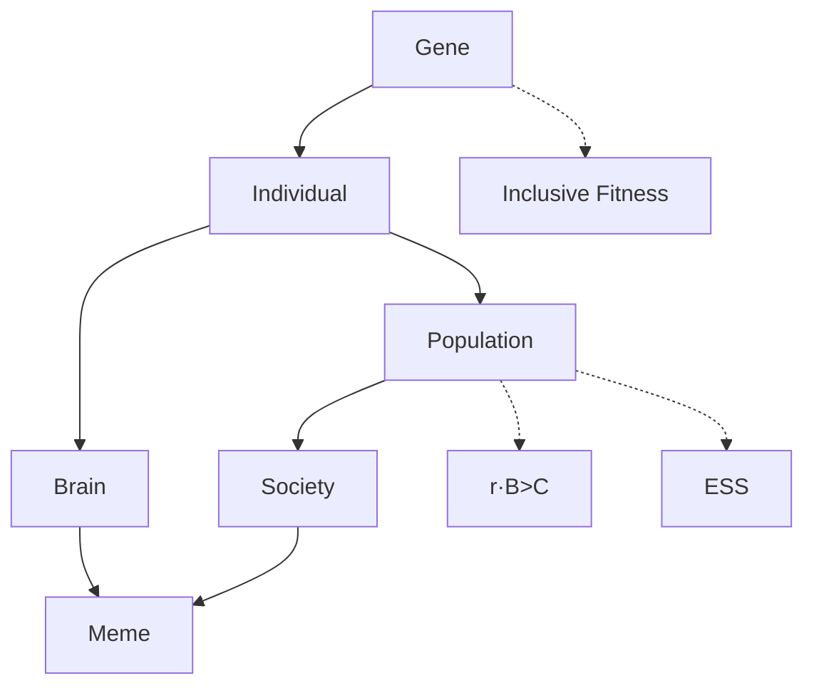

# 核心命题

把进化论的所有概念组织成**三正交维度**：

- **进化层级（where）**：复制因子（基因/觅母）→ 载体（个体/大脑）→ 互动（群体）→ 系统（社会/文化）
- **机制（how）**：自然选择 / 复制+变异+选择 / 时滞 / 博弈
- **理论工具（why）**：广义适合度 / 亲属选择 / 汉密尔顿法则 r·B>C / ESS（鹰鸽 / 还击者）

关键差别：**复制因子 vs 载体** —— 基因是不朽的复制因子，个体是临时的载体。`r·B > C` 与 ESS 是**跨层级**的解释工具，不属于某个特定层级。

# 主结构图

# 三维拆解

| 维度 | 内容 | 解释 |
|------|------|------|
| **进化层级（where）** | Replicator → Vehicle → Interaction → System | 复制因子（基因/觅母）→ 个体（含大脑）→ 群体 → 社会/文化 |
| **机制（how）** | 自然选择 / 复制+变异+选择 / 时滞 / 博弈 | 时滞 = 基因 vs 环境错配；博弈 = 策略互动 |
| **理论工具（why）** | 广义适合度 / 亲属选择 / r·B>C / ESS（鹰鸽/还击者） | 跨层级使用，非局限于单层 |

# 应用 Checklist

> **使用说明**：本 checklist 不是为了让你每件事都套用"基因自私"，而是帮助你识别**哪些场景适合用基因选择论/ESS/觅母视角**，然后调用相应的认知转变，最后落地到行动。建议每周复盘时抽取 1-2 条进行刻意练习。

## 第一部分：迁移边界检查（先问自己：这个场景能用吗？）

- **时间尺度检查**：这个问题涉及的是**长期反复发生的模式**，还是一次性选择？
  - 若是长期、可重复 → 适合基因/ESS 视角
  - 若是短期、一次性 → 换用博弈论中的"一次性囚徒困境"或心理学框架
- **是否存在"复制/模仿"机制**：某种策略、做法或观念会被其他人**模仿、传播或淘汰**吗？
  - 若存在（如行业惯例、育儿方式、消费习惯）→ 适合
  - 若纯属个人独有且无传播可能 → 不适合
- **有无有意识的"设计者"**：系统主要是由**盲目变异+选择压力**驱动，还是由**中央规划**驱动？
  - 前者（如市场中的小企业竞争）→ 适合
  - 后者（如军队指令链）→ 更适合组织行为学或管理理论
- **警惕"时滞"与"反馈"复杂性**：因果链条是否太长，中间有大量环境与大脑的实时调节？
  - 若是（如个人情绪管理、即时谈判）→ 调用神经可塑性框架（[《粉红色柔软的学习者》](book-@粉红色柔软的学习者.md)）
  - 若不是（如分析一个行业的长期竞争格局）→ 可以放心使用 ESS

## 第二部分：认知转变核验

- **从"我该怎么做"转向"在这个系统中，什么行为会被复制和传播？"**
  - 例：不应该问"我是否应该对同事慷慨"，而应问"在这个团队文化中，慷慨会不会被回报？背叛会不会被惩罚？"
- **区分"载体"与"复制因子"**：
  - 载体：我的公司、我的项目、我的身体健康（都是临时的）
  - 复制因子：**可传递的核心模式**（如：决策原则、教会别人的技能、留下的流程）
  - 行动：做决策时，优先保护/强化复制因子，而非执着于某个具体载体
- **识别 ESS**：在观察一个群体时，问：目前大家普遍采用的"默认做法"是什么？有没有人尝试过不同做法？结果如何？如果没人敢偏离，或者偏离者都失败了 → 你找到了一个 ESS。此时想改变它，代价极高
- **运用"针锋相对"心态**：面对新关系——先合作 → 然后精确镜像对方上一轮的行为 → 不主动背叛，但也不做永远的鸽子
- **用"觅母意识"过滤信息**：每当你被一段话/观念/产品吸引时，停下来问：**"这是真的/有用的，还是它只是容易复制？"** 容易复制的觅母特点：简单、情绪化、带点反叛感、承诺快速回报

## 第三部分：生活与决策应用

### A. 个人成长与习惯

- **习惯复制检查**：我正在重复的某个习惯（如刷短视频、熬夜），它是一个**高复制力的觅母**吗？
  - 若是，主动设计"摩擦"：把 app 放在文件夹深处、设定屏幕时间限额
- **学习聚焦**：选择学习一个技能时，优先考虑该技能是否能被**复用/组合/分享**（即成为复制因子）

### B. 人际与团队

- **合作启动**：进入新团队/新项目时，第一轮主动释放合作信号
- **报复策略校准**：被背叛时——
  - 一次性互动（陌生人）→ 忽略或远离，不浪费情绪
  - 长期重复博弈（同事、伴侣）→ 针锋相对：下一轮做对称回应（不是过度报复），观察是否回到合作
- **激励机制设计**：作为管理者，问：成员的个人广义适合度（晋升/声望/自主权）与团队目标对齐了吗？不对齐就一定会"自私地"偏离

### C. 投资与商业思维

- **行业 ESS 分析**：研究行业时，画出当前主要竞争策略，问：有没有"谁偏离谁就亏损"的策略？那就是当前的 ESS
- **管理层激励分析**：不看 CEO 说什么，而看他/她做什么。行为在最大化什么复制因子？短期股价（期权）、权力延续、还是长期健康？
- **组合思维**：将自己视为"基因库"，不同技能/知识模块是等位基因。**定期淘汰低回报模块**，强化高复利模块

### D. 信息消费与价值观

- **每周一次"觅母净评估"**：回顾本周吸收的信息，写出 3 个最印象深刻的观念，问：经得起事实检验吗？让我做出更好的决策，还是只是 feel good？愿意传给朋友或孩子吗？
- **反抗"自私的觅母"**：当某观念试图让你对另一群体产生仇恨、或让你放弃独立思考时，主动标记："这是一个寄生性觅母，我不下载。"

# 跨概念辨析

## ESS 与纳什均衡

| 维度 | 纳什均衡 | ESS |
|------|---------|-----|
| **核心定义** | 给定其他参与者策略，单方面改变无法获得更高收益 | 种群中绝大多数采用策略 P，任何突变体都无法"入侵" |
| **所属领域** | 博弈论（经济学/数学） | 进化生物学（道金斯引入博弈论后的扩展） |
| **核心关切** | 理性个体策略互动的"最优反应"固定点 | 自然选择下策略的"入侵抵抗力"与长期稳定性 |
| **稳定性要求** | 较弱：单方面偏离无利可图 | 更强：纳什 + 即使有少量突变体，原策略仍能淘汰入侵者 |
| **数学关系** | ESS 一定是纳什均衡 | 纳什均衡不一定是 ESS（存在中立稳定/弱均衡） |
| **世界观隐喻** | 理性人深思熟虑后的短期均衡 | 盲目变异与选择压力下的长期幸存者 |
| **典型例子** | 一次性囚徒困境的（背叛，背叛） | 鹰鸽博弈的混合比例（7/12 鹰，5/12 鸽） |
| **适用场景** | 短期、有意识、相对理性的互动（商业谈判、价格战） | 长期、由选择压力驱动、策略可复制的系统（行业惯例、文化规范） |

## 与神经可塑性的对话——"基因 ⇌ 大脑 ⇌ 环境"反馈环

道金斯模型表面是单向"基因 → 行为"，但加入神经可塑性视角后，应该看作三层反馈：

1. **环境**作为初始信号（如深度阅读这件事本身）
2. **大脑**作为高度可塑器官，神经元结构因环境刺激发生"动态重连"
3. 长期、经验依赖的神经活动**反馈回基因表达**——开启或关闭特定基因

精妙之处：环境刺激引发神经元活动，神经元活动的长期改变本身就能反馈调控基因表达，形成 **基因 ⇌ 大脑 ⇌ 环境** 的动态调控环路。

## 与《粉红色柔软的学习者》的对比

| 对比维度 | 《自私的基因》 | 《粉红色柔软的学习者》 |
|---------|---------------|---------------------|
| **核心关注** | 进化尺度上，**基因**作为复制因子的行为逻辑 | 个体尺度上，**大脑**如何通过环境持续重塑自己 |
| **时间尺度** | 数代至数百万年 | 毫秒至数十年 |
| **基本单位** | 基因（复制因子）/ 生存机器（个体） | 神经元 / 突触 / 神经可塑性 |
| **方向性** | 看似 基因 → 行为 / 身体 | 明显的 环境 → 大脑 → 基因表达 双向反馈 |
| **反馈机制** | 弱反馈：自然选择代际反馈，时滞很长 | 强反馈：环境刺激实时改变神经连接 |
| **隐喻** | 计算机程序（基因是代码，生存机器是执行） | 交通网络（神经元修建新路、废弃旧路） |
| **核心分歧** | 解释**物种为何**演化出某种倾向（终极原因） | 解释**个体如何**在当下适应学习（近端原因） |
| **互补关系** | 提供"为什么我们的脑子被设计成可塑的"进化解释 | 提供"可塑性具体如何运作"的机制解释 |

---

<strong>推导历史（与 AI 对话生成此 card 的过程）</strong>

## 2026-04-26：尝试总结全书内容生成 card

当前理解：

> 我希望能用一个 mermaid 图表总结笔记中的这些概念和关系 目的是把知识点可视化并结构化 因此不需要长篇大论，只需要列出关键概念和它们之间的关系即可 
>
> 我能想到的一些点是： 
>
> - 从小到大分为 5 个层面：基因/大脑/个体/群体/社会 
> - 每个层面分别对应性质或者说明：自然选择的最小单位/时滞性/生存机器/ r · B＞C/ESS 
> - 下一层对应示例：仙女座比喻/广义适合度/亲属选择/鹰鸽模型与还击者策略 
>
> 请你先分析我这样做结构化是否正确，还存在哪些补充和修正？ 
>
> 我目前能想到的：这样是不完整的，比如对于基因的示例这一行就是空的；而如何把人与其他生物区分开再加到这个系统中？因为 Meme 也是一个很重要的概念

和 deep seek 说明需求后生成的图表并不满意

又问了 Chat GPT, 它提出了几个洞见：

- 大脑是个体层的一个实现机制，不应该和基因-个体-群体看待
- r·B > C 和 ESS 是跨越层级的解释工具，不应该放到某个特定的层级中
- 并没有强调基因和个体的区别：复制因子 vs. 生存机器

同时，它提醒我可能进入了一个风险区——过早追求完美结构，而不是可用结构

第一版内容不需要完整，只需

- 解释 2-3 个典型现象即可（利他/冲突/人类文化）
- 支持你回忆整本书

基于此，Chat GPT 给出了它的大纲（即上方主结构图）。

这张图把整个系统拆成三条正交维度（即上方"三维拆解"）。

