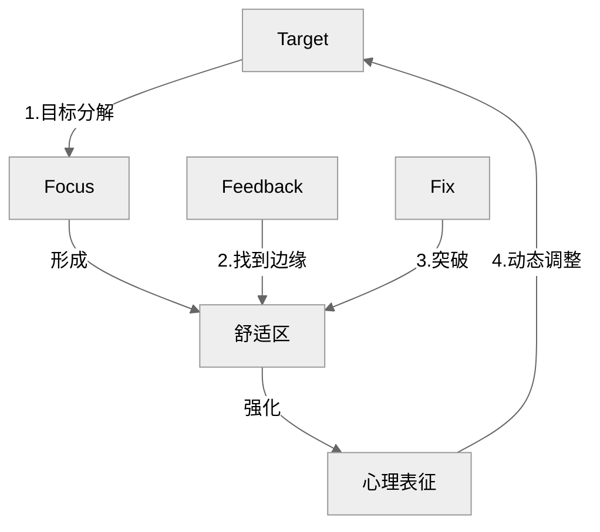

# 刻意练习模型

#自我管理 #职场效能

## 1. 核心内容

### 有目的的练习

由四部分组成：

- 定义明确的目标
- 保持专注（Focus）
- 走出舒适区/努力突破瓶颈期
- 有反馈（Feedback）/有正向的练习成果

### 心理表征（mental representation）

我查阅了 mental representation 的原始解释，个人感觉这个词放在刻意练习中并不合适，于是参考[这里](https://www.bilibili.com/video/BV1qM4m197z2/?spm_id_from=333.337.search-card.all.click&vd_source=bfb2e50dad8e670124c382656b85473e)使用「形成习惯」一词代替。

问：如何理解「杰出人物具有强大的心理表征」？

答：杰出人物做到了以下两点：

- 对大量知识的长期记忆 + 高效检索
- 专业直觉/肌肉记忆

### 刻意练习（deliberate practice）

刻意练习 = 有目的的练习 + 杰出人物指导

刻意练习的过程就是不断积累心理表征的过程。

- 该领域存在杰出人物作为导师
- 设定合适且详细的计划
  - 学员对自己当前的水平拥有清晰的定位
  - 跳出舒适区，不断尝试那些刚好超出当前能力范围的事物
- 主动练习，并把成果及时与导师分享
- 根据导师的建议及时修正（Fix）错误

### a) Why

### b) How

### c) What

## 2. 参考笔记

[note-刻意练习](/docs/note-刻意练习.md)

[ref-刻意练习](/docs/ref-刻意练习.md)

## 3. 相关链接

[仪式习惯](/docs/card-精力金字塔模型.md)
