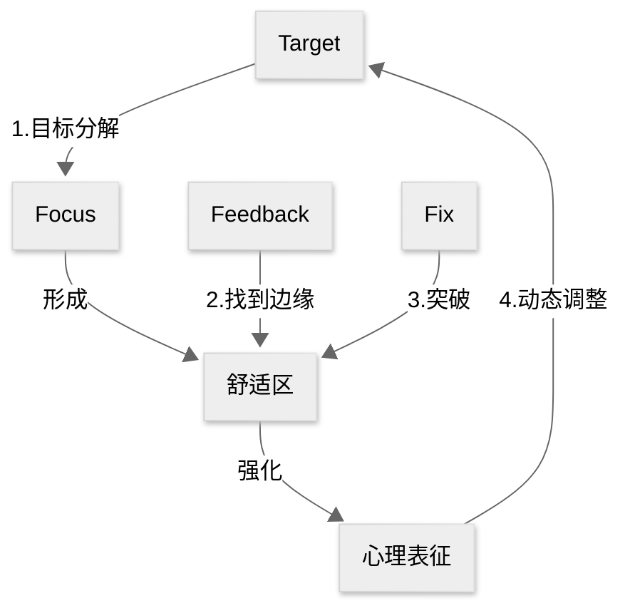

# 刻意练习模型

#自我管理 #职场效能

## 1. 核心内容

### a) Why

即使缺少天赋，使用**刻意练习**（deliberate practice）也能让我们成为某个领域的杰出人物

### b) How

1. 设定目标：成为某个领域的**杰出人物**/达到某个领域的**领域标准**
2. 让杰出人物作为导师/根据领域标准制定训练计划
   1. 训练者要认清自己当前的水平/定位
   2. 通过**有效反馈**寻找**舒适区边缘**
   3. 通过**反复修正**突破舒适区，不断强化**心理表征**（mental representation）
3. 根据心理表征对目标进行**动态调整**

### c) What

刻意练习 = 有目的的练习 + 杰出人物指导

刻意练习的过程就是不断积累心理表征的过程

## 2. 参考笔记

[note-刻意练习](/docs/note-刻意练习.md)

[ref-刻意练习](/docs/ref-刻意练习.md)

## 3. 相关链接

[仪式习惯](/docs/card-精力金字塔模型.md)
