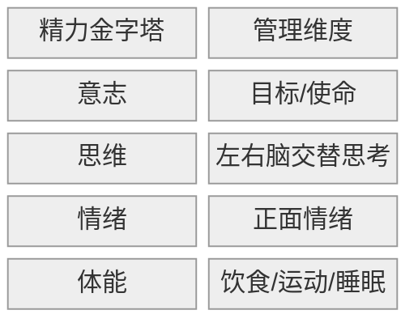

# 精力金字塔

## 1. 核心内容

```mermaid
block-beta
%%{init: {'theme':'neutral'}}%%
columns 2
精力金字塔 管理维度
意志 目标/使命
思维 左右脑交替思考
情绪 正面情绪
体能 饮食/运动/睡眠
```

## 2. 参考笔记

[[note-精力管理.md]]

[[ref-精力管理.md]]

## 3. 批判性思考

## 4. 相关知识
