# card

本 card 基于 ref 中的观点提炼和 AI 补充，由 Gemini 3 Flash 精简总结而成，mermaid 总览如下：

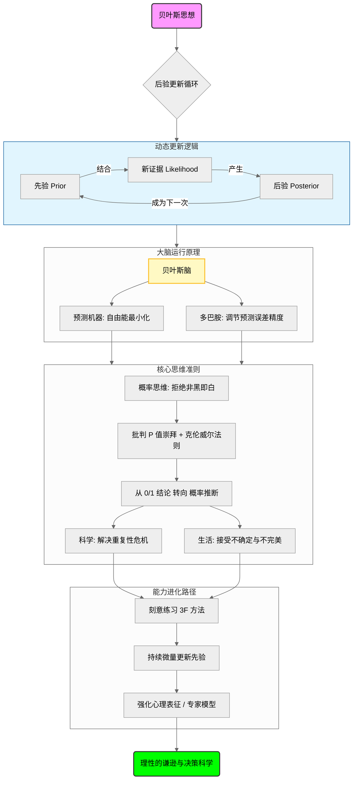

对 mermaid 的解释如下（注意，以下文字由 AI 生成）：

> 这本书不仅是在讲述一个数学公式，更是在揭示一套关于**“人类如何通过不确定信息趋近真相”**的万物理论
>
> **在科学推断上**，它批判了传统频率派对 P 值的盲目崇拜，主张科学不应是“非黑即白”的假设检验，而应是基于证据强度（似然比）不断调整“假设为真”的后验概率。它提醒我们要警惕低先验概率下的“显著发现”，从根源上反思科学界的重复性危机
>
> **在决策逻辑上**，它将概率转化为“胜算”，通过奥卡姆剃刀选择简单的解释，并恪守“克伦威尔法则”——永远不把概率设为 0 或 1。这要求决策者保持逻辑的开放性，承认自己可能犯错，从而在复杂动态的环境中寻求“似然比”最高的路径
>
> **在认知与修养上**，它指出先验虽然带有偏见，却是我们理解世界的基石。高手与普通人的区别，不在于是否有先验，而在于能否像“刻意练习”一样，通过 3F 模式不断捕捉微量信息来精密化更新心理表征。这是一种“动态修正”的觉悟，即接受结果的不完美，但追求过程的不断进化
>
> **在底层机制上**，贝叶斯思想直指生命本质——大脑是一台“预测机器”，遵循“自由能最小化”原则，通过多巴胺调节预测误差的精度。我们感知到的现实，实际上是大脑根据先验对感官信号进行的“最佳解释”
>
> **全书的核心启示是：** 贝叶斯思维是一种**理性的谦逊**。它教导我们：世界是不可完全预测的，但通过不断微调我们的先验，我们可以从“错误”中学习，在概率的迷雾中，通过持续更新，做一个更接近真相的聪明人

# ref

## 1. 核心思想

如何建立一套思维框架，帮助我们在不确定性中：

- 持续更新认知
- 动态调整决策

## 2. 核心概念

### 统计推断/概率推断

见：note - 1  b)

### 先验判断

- 定义：
  - 在没有额外数据支撑的情况下，对事物的主观判断

### 似然（likelihood）

- 定义：
  - 最大似然估计是根据已知实验数据，判断哪种假说最有可能产生当前的实验结果

### p 值

- 定义：
  - 先假定某一假说为真，在这种情况下看到类似结果的概率有多大
- 不是什么：
  - p 值衡量的不是假说为真的可能性有多大
- 应用：
  - 当 p 值小于 α (通常为 0.05)，我们就可以拒绝原假设，对极端结果予以重视

### 奥卡姆剃刀法则

见：note - 3 c)

## 3. 主题归档

类型：

关联领域：

## 4. 全书框架梳理

第一章首先介绍了贝叶斯定理的基本概念和发展历史

后面三章分别从科学、生活、大脑三个方面介绍了贝叶斯思想 

最后一章回归脑科学，讲述贝叶斯脑的由来

## 5. 写作动机

问题意识：

现实意义：

## 6. 观点提炼

在第二章，作者主要论述了为什么在科学研究中使用概率推断不是一个好方法：学术界过于看重 p 值对原假设的影响，而先构建假设，后推算结果发生的概率这件事情是值得商榷的。因为这是一种先假设为真，后来进行验证的思想。如果使用贝叶斯思想，则属于统计推断，是基于已有的事实/结果去推断假设成立的概率。科研人员应该用批判性思维去不断调整假说为真或者假的概率，而不是下一个为真或者为假的结论，然后推翻对立面的一切证据。

AI 补充：

> 你提到了 P 值和贝叶斯统计的区别，这里可以补充一个更本质的数学直觉：
>
> - **频率派**（P值）关注的是：**“如果假设为真，观察到这组数据的概率是多少？”** 即 `P(Data∣Hypothesis)P(Data∣Hypothesis)`
> - **贝叶斯派**关注的是：**“既然观察到了这组数据，假设为真的概率是多少？”** 即 `P(Hypothesis∣Data)P(Hypothesis∣Data)`
> - **补充点：** 书中其实隐含了一个严厉的批评——科学界的“P 值崇拜”导致了**重复性危机**。很多所谓的“显著发现”其实是因为先验概率极低（比如心灵感应），但因为 P 值达标就被宣布为真。贝叶斯思维要求科学家在看实验结果之前，先审视这个假设本身“听起来有多靠谱”（先验概率）

第三章讲的是如何使用贝叶斯思想做决策：把概率这种数学/统计学概念换成胜算更方便理解——我们可以说胜算很大，但是不能说胜算为 100%。这一章提到了效用和奥卡姆剃刀法则，告诉我们在做决策时，我们倾向于选择更简单的假说作为先验

AI 补充：

> 你在总结中提到了胜算（Odds）和奥卡姆剃刀。在决策部分，有一个极重要的概念值得补充：**证据的强度（似然比）**
>
> - **补充点：** 贝叶斯公式告诉我们：**新胜算 = 旧胜算 × 似然比**
> - 当你面对新信息时，你要问的不是“我该不该相信它”，而是“如果我的假设是真的，看到这个证据的可能性，比假设是假的时看到它的可能性大多少倍？”这能帮你过滤噪音

第四章告诉我们，在使用贝叶斯思想时，先验判断会存在很多认知偏差，例如框架效应，证真偏差，锚定、近固、频率偏差；然而，先验是很重要的。我们日常生活中做的决策，大多都是凭借直觉，即使没有人可以说清楚先验究竟有多牢固。而这也是厉害的人和普通人的区别——厉害的人更擅长持续不断的微量化更新先验概率，这让我想到了《刻意练习》中提到的 3F 方法。那么，更新先验概率的过程，也就是不断强化心理表征的过程。但不论如何，应该有这样一种觉悟：人会犯错，决策也会失效；我们能做的就是尽可能的考虑周全，然后接受不完美的结果

AI 补充：

> 你在总结最后提到“人会犯错……接受不完美”，这对应了贝叶斯统计中极其重要的一条准则：**永远不要把先验概率设为 0 或 1**。
>
> - **补充点：** 只要你认为某事“绝无可能”（概率为 0），那么无论后续有多少证据，贝叶斯公式计算出的后验概率永远是 0。这就是所谓的“死脑筋”。**保持逻辑开放性**（概率永远在 0 到 1 之间）是贝叶斯主义者的道德修养

第五章从脑科学出发，微观讲述了使用贝叶斯思想时大脑的内部流程。首先，大脑本身就是一个做预测的机器。作者提到了自由能的概念：大脑为了自由能最小化，会尽可能的降低惊讶度与复杂度。所以，我们看到的东西，其实都会经过我们大脑的加工，变成符合大脑期望的信号进入决策流程。而多巴胺在其中起到了至关重要的作用。多巴胺负责调节预测误差精度，它决定了我们是应该相信先验还是似然，进而让大脑产生（或者不产生）学习/行动的动机

AI 补充：

> 你提到的 **3F 方法（Focus, Feedback, Fix it）** 与贝叶斯更新的结合非常精辟
>
> - **Focus（专注）：** 相当于在收集高质量的感官数据（Likelihood）
> - **Feedback（反馈）：** 产生预测误差（Prediction Error）
> - **Fix it（修正）：** 也就是后验概率更新先验的过程
> - **补充：** 所谓“厉害的人”，其核心竞争力在于他们的**先验模型极其精细**。普通人看到棋局看到的是散乱的棋子，而大师看到的是“势”和“模块”，这种高级的心理表征就是经过无数次贝叶斯更新后形成的、极高精度的先验

AI 总结：

> 你的理解已经非常透彻。如果非要补充一点，那就是作者在书末传达的一种**人文关怀**：
>
> 贝叶斯不仅是一种统计工具，更是一种**谦逊的态度**。它承认我们永远无法掌握绝对真理，只能通过不断的微调趋近真相。这种“**动态更新、永不终结**”的思维方式，是应对不确定性世界的最科学工具

# note

## 1. 序言/引言/第一章

### a) 贝叶斯公式

贝叶斯理论是在不确定性中持续跟新认知和动态调整决策的一种思维框架

如果以 $$H$$ 代表假设（Hypothesis），以 $$E$$  代表证据（Evidence），那么贝叶斯公式可以写成如下形式：

$$
P_{(H|E)} = P_(H) \cdot \frac{P_{(E|H)}}{P_(E)}
$$
各项内容的含义如下：

- $$ P_{(H|E)} $$ 代表后验概率（posterior probability）
-  $$ P_{(H)} $$ 代表先验概率（prior probability），即主观信念（由弗兰克·拉姆齐提出）/偏见/猜测
- $$ P_{(E|H)} $$ 代表如果假设成立，证据出现的概率有多大
-  $$ P_{(E)} $$ 代表这个证据在现实中出现的总概率是多少
- $$\frac{P_{(E|H)}}{P_(E)}$$ 代表似然比（likelihood ratio），即调整幅度

### b) 概率论的发展历史

| 流派     | 推断     | 内容                             |
| -------- | -------- | -------------------------------- |
| 贝叶斯派 | 统计推断 | 根据已有的结果推断假设成立的概率 |
| 频率学派 | 概率推断 | 根据构建的假设推断结果出现的概率 |

## 2. 科学中的贝叶斯思想

### a) 伯努利谬误

《伯努利谬误》：概率论简史 https://book.douban.com/subject/36713071/

所谓的伯努利谬误，指的是：

先假定假说为真，在这种情况下使用 p 值表征类似结构的概率有多大，属于频率学派

而贝叶斯理论鼓励科学家去研究哪些我们先验地持怀疑态度的理论

### b) 不确定性

- 随机不确定性
- 认知不确定性

## 3. 决策论中的贝叶斯思想

### a) 三段论式的演绎推理

苏格拉底的三段论式推理的含义是：

结论是根据前提推导而来

并不意味着结论就是正确的

### b) 效用理论（utility theory）

在经济学中，效用的定义为：

> 商品/服务带来的主观满足程度

书中作者把效用比作金钱，即“确定自己到底有多在乎某事”

其延伸概念为前景理论

而期望值就是概率与效用的结合

### c) 奥卡姆剃刀原理

> 如果两个假说都说得通，我们会选择相信更简单的那一个

先验概率就建立在奥卡姆剃刀原则之上

## 4. 生活中的贝叶斯思想

### a) 框架效应

> 两种表达方式，在逻辑上是等价的，然而措辞不同，人们的态度也会不同

### b) 证真偏差（confirmation bias）

> 人们更愿意为了证明既有观点去寻找有利证据，而不是为了证伪某个假说去寻找不利证据 

推荐书籍：《黑天鹅》

### c) 三种常见的认知偏差

- 近固：过于看重近期的数据
- 锚定：过于看重第一印象
- 频率：过于看重最常出现的东西

### d) 贝叶斯与直觉

> 我们无法获取所有相关信息，更不可能用贝叶斯公式把所有公式整合到一起，算出概率
>
> 我们能做的，就是想办法找到一些捷径，比如启发法，从贝叶斯方法的角度看，我们靠直觉本能做出来的决策并没有那么糟糕
>
> 现实中对于个人而言，没必要把概率算的那么清楚

### e) 如何有效地使用贝叶斯分析：确定的先验概率

> 超级预测这更擅长确定先验概率，而普通人无法对预测给出具体概率
>
> 使用贝叶斯分析法，必须先确定先验概率
>
> 如果你不知道某件事发生的概率有多大
>
> 那么看到证据后，你仍旧无法知道这件事发生的概率有多大

### f) 贝叶斯认知论

> 多数情况下，事物之间并不存在明确的边界，因为世界并不是由演绎推理和命题陈述构成的，也不是非黑即白的
>
> 事情可能存在反例，人可能犯错
>
> 将信念定义概率化，我们就可以避开“所有概念都是不确定的，所有观念都是虚无的”这种后现代主义思想

## 5. 贝叶斯式的大脑

### a) 大脑的工作原理

1. 模糊的感官信息
2. 大脑处理
3. 推测信息起因

大脑的核心任务是对世界做出合理预测，然后根据各个感官收集到的信息更新预测模型，其中：

- 预测 → 先验概率
- 感官数据 → 似然函数
- 更新后的预测 → 后验概率

但本质上，人是生活在自己的预测中

因为你体验到的不是感官数据，而是脑内预测

### b) 多巴胺与预测误差

这一段内容在第一次阅读时忽略了，后面在研究贝叶斯/多巴胺/双系统的关系时重新发现

预测误差 = 感官数据与先验模型之间的差异，又被称为“惊异度”

而多巴胺就是衡量预测误差的精度标准

- 如果似然数据和先验概率非常接近，后验概率也不会差多少，多巴胺分泌正常
- 感官数据精度极低，预测精度极高，说明大脑更相信先验模型，多巴胺分泌正常
- 感官数据精度极高，且与预测不符，产生预测误差，多巴胺分泌旺盛

> 大脑非常讨厌预测偏误，非常希望自己能够做出正确预测，所以它总是想要将预测和感官数据之间的偏差讲到最低
>
> 换言之，大脑之所以很关注预测偏误，是因为大脑想解决这一矛盾

### c) 自由能原理

由卡尔弗·里顿提出，这种贝叶斯模型又被称为“预测加工理论”

它的问题在于：

1. 要先预测自己的动作会产生何种影响
2. 要预测怎样做才能尽可能地获取更多信息

从信息论的角度来说，自由能约等于预测偏误：人脑非常厌恶预测偏误，总希望将其最小化

怎么做呢？

从生物角度讲：

- 保持内稳态
- 保持应变稳态：通过深思熟虑的、有计划的行为，尽量避免稳态修正

从贝叶斯的角度讲：

- 改变自身状态避免预测偏误
- 尽可能多的搜寻与世界相关的信息，以便做出更好地预测

## 贝叶斯式的生命

乔治·博克斯说：

> 其实所有模型都是错的，只不过某些模型很有应用价值

每个人的大脑中都有一个世界模型，可以从三个角度理解大脑：

> - 所有模型都可以做出预测
> - 所有预测模型都是不完美的
> - 比预测更重要的是预测偏误：如果精度极高的先验判断和精度极高的世界信息产生矛盾，那么后验概率就会发生很大变化

我们对世界的感知方式，其实就是连续不断的做出预测，然后根据感官数据进行检验

从这个理论出发，再谈科学中的贝叶斯理论：

> - 大脑的工作模式就是做出预测，然后根据新信息更新预测
> - 科学就是构建一个世界模型，然后尽量用真实世界对其进行检验：做出预测，然后用新信息更新预测，尽量降低预测偏误
> - 这里的认知偏差在于，我们通常认为科学是客观的，但是先验概率是主观的，只是我们对真实世界的试图最优，但是注定不完美预测
> - 同时，贝叶斯方法无法解决所有问题，而且也不是所有情况都适用

对于生活，贝叶斯给我们的启示是：

1. 没必要过于关注某个假说的对错、真假，因为你可以将信念用概率表示出来，然后不断调整它的数值，而不是人为设定某个阈值，然后拒绝或接受某个假说
2. 信念就是预测：很多争论本质上都是在争论某个词是否可以用来形容某一现象。然而大多数情况下，人们并不关注事件本身，只关注它到底被贴上了什么样的标签。这样做或许能帮助你赢得争论，但不会对这个世界做出的预测产生影响

---
date: 2025-07-13
---

# note

“未来不属于那些害怕技术进步的人。”（Those who fear technological advances have every reason to fear the future.）


丘吉尔说过，”所谓成功，就是不停地经历失败，并且始终保持热情。”（Success is going from failure to failure without losing enthusiasm.）一次又一次地被拒绝，是你的勇气和进取心的最好证明。它们决定了你可以走多远，把你和那些决心放弃的人拉开差距。


**阮一峰谈读博：**


只有在国内大学读过博士的人，才能体会那种知识带来的绝望感。你付出了那么多，却一无所获，甚至连知识也学不到，因为大学不过是社会的缩影，所有社会丑恶现象在校园中全部存在，而且因为披着学术的伪装，而显得更加虚伪。


你把人类的知识向前推进了一步，这时你就成为博士了。


在大公司中，你只要一般性地努力工作，就能得到意料之中的薪水。你不能明显的无能或懒惰，但是谁也没觉得你会把全部精力投入工作。


**阮一峰谈医患问题：**


在我看来，这些都不重要。真正重要的是，我们要追问：

**——想当好医生的人，却当不成。这样的困境是谁造成的？**

一方面，普通人看不起病，觉得医疗费昂贵；另一方面，医疗资源十分紧张，医生感到收入偏低。这到底是怎么回事？到底是哪里出了问题？

医患之间紧张的关系，并不是因为医生没有医德，也不是因为病人刁钻，而是因为这两个群体被逼成这样。

说到底，是我们的制度出了问题。在这个制度里，你只能按照它的规则行事，不服从就要被淘汰。**医生和病人都是这个制度的受害者，他们被逼得对立起来。**

这就是，我写这篇书评的根本目的，我就是想问：**在制度的压迫下，个人应该怎么办？**


**阮一峰谈社会变革：**


**“一股巨大的、难以预测的力量……引发了许许多多急需解决的崭新问题……带来了一个充满变幻莫测的命运和戏剧性插曲的历史时代……”**

中国社会不正是这样吗？被现代化的力量推着前进，古老的思想和制度被一股脑冲走，但是新的思想和制度又没有建立起来，所以导致了众多的社会问题。

**“这是最强大和最深远的社会变革引擎，……那些持续不断发生、并且必然在它面前不断闪现的革命……这不可避免的命运……”**

中国的现代化进程，始于1840年鸦片战争。从那个时候至今，一直在被动地适应和接受新技术。这整个过程，就是一场革命，而它还没有结束。第一步是民族革命，第二步是民主革命，中国的第二步革命依然等待完成。

现代化的力量不可阻挡，不仅要解放物质的生产力，还要解放思想的生产力；不仅要确立现代化的工厂和科技，还要确立现代化的思想和制度。不做到这一点，革命就不会结束。


只要当局不再奉行”经济增长至上论”，真正把[民生和民权](http://www.ruanyifeng.com/blog/2006/07/post_267.html)放在第一位，移去每个人肩头沉重的生存压力，这个社会的冷漠和对立一定会扭转过来


在我看来，Blog写得再好，也只是”善于说”，而真正有用的是”善于做”。正如马克思的名言，”哲学家们只是用不同的方式解释世界，而问题在于改变世界。


**王建说谈写blog：**

blog是我个人的表达，不是传播公司信息的渠道。微软是一家很了不起的公司，它的名声和光环是属于它自己的，不是属于我的，我只是一个微软的普通员工。

我觉得一定要分清楚，哪些是自己建立起来的，哪些是公司带给你的。你之所以拥有后者，很可能仅仅是因为运气好，是公司的成功，而不是你的成功。所以，我不太会写到公司。


写作帮助我们整理自己的思想。blog其实是一种理性思维和表达能力的训练，很多时候我们写作

blog，就是在做这种训练。我写作的时候，有时会尝试不同的表达方法，看看怎么写最容易看懂、最容易被他人接受。每当有读者留言批评我的观点，我就知道了我的思维和表达在什么地方还有欠缺。Joel说过，写作能力是区分领袖和普通程序员的标志。我们不一定要当领袖，但是能够说服他人认同你的观点，这绝对是不容忽视的能力，而blog就是获取这种能力的一种卓越训练方法。


我的blog最重要的读者，就是我自己。如果碰巧帮助了别人，那是额外的收获。即使没有人读，我觉得我也会继续，因为它帮助自己思考。


我始终认为，中国人最落后的地方，就是思想太落后。大多数中国人的思想境界，还停留在封建时代。如果思想没有实现现代化，专制和愚昧就永远在这块土地上有市场。如果我们要建立一个民主和科学的新中国，那么第一步就是要改造人们的思想。而改造思想的第一步，就是传播怀疑。

如果大多数人不相信别人告诉他们的话，学会用自己的大脑，判断眼前发生的一切。凡事先想一想为什么，学会用不同来源的信息比对真伪，学会用逻辑的法则判断不同主张的合理性。那么，谎言就会无法生存，专制的基础就会动摇，中国发生变革的时刻，也就到来了。


**阮一峰谈唐德刚：**

但是，对我来说，毫无疑问地，唐德刚先生是当代最优秀的中国历史学家之一。虽然他自己恐怕没有想过要当大师，但他是真正的大师。如果你想正确地理解中国过去150年的历史，如果你想摆脱政党控制的宣传机器，了解中国近代史的真相，那么就一定要去读他的书。

历史学家的工作，不仅仅是发现史实，更重要的是指出历史变化的原因，说出将过去、现在、未来连在一起的神秘力量。他们传播的，其实不是”史”，而是”识”。


因为图书馆本来就是要让人待在里面的，建造图书馆的目的，就是创造一个适合人待的读书地方，而不是造一个堆放书籍的仓库。


我希望，未来中国的图书馆不仅硬件要升级，服务理念也要升级，不要把图书馆只当作一个藏书的仓库，而要把它建成一个让读者舒舒服服读书的地方，一个让人愿意长时间待在里面、甚至愿意在其中定居的地方。


**阮一峰：人吃人的中国/民生和民权重于经济发展**


总的来说，我觉得，整个局势已经没有可能挽回了，大错已经铸成，我们只能静待恶果了。这就好像火车脱轨，现在只有眼睁睁看着它坠下悬崖了。当然，悲剧是我们就在这列火车上，明知它要坠毁，却无法下车。我想，只有在发生重大危机的情况下，现行的制度才有松动的可能。但是，什么是重大危机呢？我不知道，目前看上去经济停滞和通货膨胀的可能性最大。有一个简单的事实，日本的经济增长被称为奇迹，从二战后开始，到九十年代结束，持续了40多年。中国的改革开放已经30年了，经济增长的停滞期已经不是特别遥远的事了。


**阮一峰谈中国房价为什么不可能下跌：这是统治集团和大资产阶级的共同需要。**


1. GDP 增长的需要：提升官员的政绩
2. 土地财政收入的需要：提高政府和官员的收入
3. 金融体系稳定的需要：保证四大行的运转


统治集团和大资产阶级在房价问题上，达成一致，组成了”利益共同体”，联手推高房价。这已经形成了事实上的垄断。普通中国人政治上无权，经济上无钱，只能被迫接受垄断高价，用一生的劳动去购买一套住房，听任自己的剩余价值成为富豪的财富、公务员的补贴和银行的暴利。


市场没有道德做基础，就犹如脱缰的野马引我们走入未知的歧路。也许有人会说，抱怨房价不道德有什么用，也许有人会力挺”市场说了算”。市场和道德并不冲突，不讲道德的市场不是合理的市场，贪婪的市场注定会为贪婪和不道德付出血的代价


**阮一峰谈小孩的上学问题：**


既然不同的选择都有各自的优缺点，你又无法对结果施加很大的影响，那就不要多想了，多想也没用。


**阮一峰谈学历：**


我们中国人，常常被认为是重视教育的民族。其实，这是错的，我们重视的不是教育，而是学历。我们的民族文化中，充满了对地位和权势的崇尚。因为学历是通往这条道路的敲门砖，所以中国（儒家）文化充分肯定学历，进而以重视教育的形式表现出来，比如什么”朝为田舍郎，暮登天子堂”、”十年窗下无人问，一举名成天下知”。


1. 学历证书有助于鉴别人才
2. 学历证书的认证作用与机构大小成正比
3. 学历的证明力与学历制度的重要性成反比


对于未来：在本质上，学历只是大机构内部管理的需要。一旦大机构消失，学历也将丧失它的光环，教育将回归到它的本来意义。人们来到学校，只是为了学习知识，不是为了得到一张文凭。


**阮一峰认为经济学无用：**


如果经济学是有用的，那么为什么会发生金融危机呢？


1974年，诺贝尔经济学奖同时颁给了哈耶克（Fdiedrich Von Hayek）和缪尔达尔（Karl Gunnar Myrdal）。两人的学术观点几乎完全相反，前者要求实行自由经济，后者要求政府对经济严格管制。观点相反的人能够同时获得诺贝尔奖，这种事情大概只可能发生在经济学上。米尔顿·弗里德曼（Milton Friedman）就说过，长久以来一直有一种看法，经济学更像一门艺术，而不像一门科学（参见《The Methodology of Positive Economics》）。


任何一本经济学教材都会告诉你，经济增长的最终动力来自于消费。如果消费不增长，只依靠投资和出口来拉动经济，那么一定长久不了。但是，这么简单的道理，政府就是不听，一味”加大投资、促进出口”，你能有什么办法？


所有政治家都觉得自己懂经济；所有经济学家都觉得只有参与政治，自己的主张才有机会实行。


**阮一峰谈中国劳动法：**


经济学的一条基本原理是，资源由市场配置，最有利于提高效益。劳动力也是资源的一种，所以劳动力也应该由市场配置。

因此，经济学家的普遍观点是：

1）劳动力必须能够自由流动，而且流动的障碍越小越好。这意味着，雇员有选择雇主的自由，雇主也有选择雇员的自由，而且雇员辞职和雇主裁员的障碍都应该最小化。

2）劳动力的生活保障，应该由社会来提供，这样最有利于劳动力的流动。


自由企业制度搭配完备的社会保障，是最好的经济制度。政府发展经济的最好措施之一，就是向全体公民提供优良的社会保障。

---
title: 博弈论与生活
author:  Lan Fischer
date: 2025-02-17
tags:
source:
---
# ref
## Q1: 为什么要读这本书？

2025 年 1 月购于上海外滩茑屋书店

## Q2: 这本书是谁写的？

- 「英」Lan Fischer
- 「译」林俊宏

## Q3: 这是哪类书？用一句话或一段话概述整本书的内容

观点类书籍，将博弈论应用于生活中，就解决一系列社会困境问题给出一些建议。

## Q4: 将书中重要篇章列举出来，它们是如何组成整体的架构的？

- 第 1 章：纳什均衡的概念
- 第 2 章：使用「你切我选」等策略公平分配资源
- 第 3 章：生活中的「社会困境」
- 第 4-8 章：解决社会困境的几种方法

## Q5: 重要的概念/关键词？

### #1 纳什均衡（Nash Equilibrium）

摘选自 Deep Seek：
>它描述了一种博弈中的稳定状态，即在给定其他参与者策略的情况下，没有任何一个参与者可以通过单方面改变自己的策略来获得更好的结果。
>
>纳什均衡具有以下特点：
>
>- 稳定性：在纳什均衡中，没有任何参与者可以通过单方面改变策略来提高自己的收益。
>- 非合作性：纳什均衡不要求参与者之间有合作或沟通，完全基于个体理性。
>- 不一定是最优结果：纳什均衡可能是次优的，尤其是在社会困境中（如囚徒困境）。
>- 可能存在多个均衡：一个博弈可能有多个纳什均衡，也可能没有纯策略纳什均衡（但可能有混合策略纳什均衡）。

### #2 七大社会困境（Social Dilemma）

- 囚徒困境
- 公地悲剧：获利的是少部分人，成本却要由所有人一同承担
- 搭便车
- 懦夫博弈
- 志愿者困境
- 两性战争
- 猎鹿问题


---
date: 2025-08-28
---

# card
## 1. 核心内容

```mermaid

```

|维度   |核心内容   |关键要点   |
|---|---|---|
|核心规律   |在集聚中走向平衡   | 1. 人口和经济向大城市集聚是发展的必然规律 <br> <br> 2. “平衡”指的是人均 GDP、收入与公共服务的趋同，而非资源总量的均匀分布  |
|现状与误区   |通过行政力量追求地区间经济总量的平衡 | 生产要素的配置扭曲： <br> <br> 1. 土地：建设用地指标与人口流向背离； <br> <br> 2. 资本：低利率导致长期重投资轻消费； <br> <br>3. 劳动力：户籍制度阻碍自由移民，抑制内需并造成社会分割  |
|问题根源   |限制城市发展   | 1. 夸大 3M (Time, Crime, Grime) 带来的危害 <br> <br>2. 忽视治理  |
|解决方案   | 3D 框架  | 1. Density: 发展大城市，发挥规模经济效应 <br> <br> 2. Distance: 根据城市与大港口的距离确定不同的发展方向 <br> <br> 3. Division: 户籍与土地制度联动，促进劳动力的自由流动  |
|目标与愿景   | 为了公共利益  | 1. 国家的长治久安<br><br>2. 社会公平  |

# ref
## 1. 核心思想

通过促进生产要素（尤其是劳动力）向大城市自由流动和集聚，在提升国家整体效率的同时实现地区间人均意义上的平衡发展，打破"效率与公平必然对立"的传统认知。

## 2. 核心概念

### 概念1：在集聚中走向平衡

- 定义：
  - Why? 集聚能产生规模效应，提高全要素生产率，是实现经济发展的客观规律
  - How? 通过人口自由流动和要素市场化配置，让劳动力流向回报更高的地区
  - What? 追求人均GDP、收入和生活质量的趋同，而非经济总量的均匀分布
- 示例：
  - 背景：美国人口持续向东西海岸大都市区集聚
  - 支撑点：集聚带来更高的人均收入和更多就业机会
  - 结果：各州人均收入差距不断缩小
  - 为何是典型示例？体现了在集聚过程中实现人均平衡的规律
- 反例：
  - 背景：中国通过行政手段将建设用地指标向中西部倾斜
  - 矛盾点：资源流向与人口流向背离
  - 结果：既牺牲效率又未能真正缩小地区差距
  - 为何是典型反例？违背集聚规律，追求总量平衡而非人均平衡

### 概念2：3M 问题与 3D 框架

- 定义：
  - Why? 理解城市发展规律需要系统分析框架
  - How? 3M（拥挤、污染、犯罪）是城市成本，3D（密度、距离、分割）是发展动力
  - What? 城市发展是3D动力与3M成本的动态平衡过程
- 示例：
  - 背景：东京通过轨道交通和精细化管理解决拥堵
  - 支撑点：通过技术和管理创新缓解3M问题
  - 结果：容纳3700万人口仍保持高效运转
  - 为何是典型示例？证明3M问题可通过治理缓解
- 反例：
  - 背景：北京通过行政限制控制人口
  - 矛盾点：用"堵"而非"疏"的方式应对城市病
  - 结果：问题未解决反而产生新扭曲
  - 为何是典型反例？错误地将3M问题归咎于人口规模

### 概念3：人地挂钩

- 定义：
  - Why? 解决土地配置与人口分布脱节的问题
  - How? 建设用地指标与人口流入数量挂钩，建立跨省流转机制
  - What? 让土地供应顺应人口流动方向的市场化改革方案
- 示例：
  - 背景：重庆地票制度改革试点
  - 支撑点：农村宅基地复垦形成建设用地指标
  - 结果：既保障农民权益又满足城市发展需求
  - 为何是典型示例？体现了土地与人口联动的改革方向
- 反例：
  - 背景：当前建设用地指标行政分配制度
  - 矛盾点：人口流入地缺指标，流出地指标浪费
  - 结果：房价高企与"鬼城"并存
  - 为何是典型反例？行政配置违背市场规律

## 3. 主题归档

类型：区域经济学/发展经济学

关联领域：城市化研究、劳动经济学、公共政策、土地制度

## 4. 全书框架梳理

核心论点：中国应通过要素市场改革，在集聚中实现效率与公平的统一

分论点1：集聚是经济发展的客观规律

- 案例：全球城市化趋势
  - 背景：发达国家服务业比重上升，集聚程度持续提高
  - 支撑点：现代服务业更需要集聚，知识经济强化此趋势
- 金句："发达国家的经济结构是以工业和服务业为主，尤其是以现代服务业为主，工业需要集聚，服务业比工业更需要集聚"

分论点2：现行政策造成资源配置扭曲

- 案例：建设用地指标分配
  - 背景：指标向中西部倾斜，与人口向东流动背离
  - 支撑点：导致东部房价高企、西部园区空置
- 金句："行政配置资源的方向与人口流向相悖"

分论点3：制度改革可破解发展困境

- 案例：户籍与土地制度联动改革
  - 背景：农民工市民化进程滞后
  - 支撑点："人地挂钩"实现多赢
- 金句："建设用地指标更多地配置到生产率更高的地区，让土地资源的配置方向与人口的流动方向保持一致"

## 5. 写作动机

问题意识：为什么在追求区域平衡发展的过程中，既牺牲了效率又未能实现真正的公平？

现实意义：为中国经济结构转型和区域协调发展提供新的理论框架和政策思路

## 6. 观点提炼

### a) Why

- 集聚产生规模经济效应，提升全要素生产率
- 要素自由流动是实现人均平衡的最有效途径
- 现行制度造成效率与公平双重损失

### b) How

- 推进户籍制度改革，促进劳动力自由流动
- 建立"人地挂钩"机制，优化土地资源配置
- 转变政府职能，从干预市场转向弥补市场失灵

### c) What

- 人口继续向大城市和城市群集聚
- 建立统一的生产要素市场
- 财政转移支付聚焦人均公共服务均等化

## 7. 批判性思考

### a) 作者背景

陆铭，上海交通大学安泰经济与管理学院教授，长期研究劳动经济学、城乡和区域发展

### b) 政治倾向

倾向于市场主导的改革路径，强调尊重经济规律，主张有限政府干预

### c) 价值预设

- 效率与公平可通过市场化改革同时实现
- 个人自由迁徙权优先于地方利益
- 科学发展应尊重客观规律而非主观愿望

# note
## 第一章：中国经济的欧洲化

### Deep Seek 总结第一章的作用

第一章在全书中扮演着奠基、破题和引论的核心角色，具体作用如下：

1. 提出核心问题（破题）： 直接挑战了“均匀发展才是平衡”的传统观念，旗帜鲜明地指出了全书将要批判的靶心——现行以“控制大城市规模、扶持中小城镇、限制人口流动”为特征的区域政策。
2. 建立分析框架（立论）： 引入了“在集聚中走向平衡”这一核心观点。它初步论证了：真正的平衡是地区间“人均”GDP、收入和生活质量的平衡，而不是经济“总量”的平衡。实现这一目标的路径恰恰是允许生产要素（尤其是劳动力）自由流向效率更高的地区，通过人口的自由流动来实现人均值的收敛，而不是试图逆转经济规律。
3. 预告全书内容： 第一章中提出的每一个问题（劳动力、土地、服务业），都将在后续章节中得到更深入、更详细的展开。例如，第二章会深入讲解“集聚”背后的经济学原理（规模效应、知识溢出等），后续章节则会具体讨论户籍改革、土地改革等政策建议。因此，第一章是全书的一张“总地图”。
4. 设定论述基调： 确立了全书用全球普遍经济规律和数据实证来分析中国特殊问题的研究方法，使其论述脱离了纯粹的观念争论，建立在坚实的科学基础之上。

---

### 我自己的总结

作者首先在第一节提出欧盟在实行一体化时遇到的问题：市场分割（即欧洲内部人口流动不充分） + 货币统一（各国货币的独立性丧失）的特点必然导致相对落后的国家选择举债弥补收支差额，进而引发欧债危机。

那么欧洲各国为什么要选择组建欧盟，成为一个“大国”呢？在第二节，作者给出了大国从古至今的优势。

在古代的优势有：

- 政府收税
- 分散风险
- 安全

在现代的优势有：

- 借助规模经济发展战略性产业
- 实现技术创新
- 公共品提供
  - 国防
  - 卫星导航
  - 国际护航/国际医疗援助
- 现代服务业
  - 金融
  - 医疗
  - 教育
  - 文化
- 铸币税

第三和第四节，作者提出了当代中国作为一个大国面临的一系列问题。

和欧盟相比，中国在政治上实行集权，但是经济上分权。一方面，中央制度市场化可以促进市场统一；另一方面，地方政府为了税收会保护本地经济，从而导致分割市场情况严重。这种情况不仅反映在商品市场，同样也反映在生产要素市场：

- 劳动力：户籍制度 → 农民实现身份转换困难
- 土地：建设用地指标配给制度 → 大城市限制用地 → 房价/地价飙升
- 资本：
  - 地方资本受到政府项目审批制度分割
  - 地方保护主义 → 跨省投资存在阻力

在劳动和资本积累速度放缓的背景下，借助规模经济效益，应该不断提高城乡间和地区间的资源配置效率，从依靠人口红利转变为依靠制度红利。

最后，在第五节，作者提出论点：

继续加速城市化进程 → 增强国家内部的自由移民 → 区域间人均 GDP 趋同 → 发挥大国优势

## 第二章：在集聚中走向平衡

### Deep Seek 总结第二章

第二章是全书的理论脊柱和分析引擎，其作用至关重要：

1. 提供理论基石： 第一章提出了问题和新观点，但观点需要理论支撑。第二章系统性地引入了规模经济、集聚效应、劳动力流动、知识溢出等现代经济学理论，为“大国大城”的论点奠定了坚实的学术基础，使其从一种“观点”转变为有严密逻辑支撑的“理论”。
2. 彻底扭转观念： 本章的核心目的在于完成读者认知上的根本性转变——将“人口集聚”从一个需要被控制和解决的“问题”，重新定义为一個应当被尊重和利用的“规律”和“解决方案”。它从根本上拆解了“均匀发展”的合理性。
3. 定义核心概念： 全书最重要的两个概念——“集聚”和“平衡”——在本章得到了最清晰、最深刻的界定。“平衡”是人均值的平衡，“集聚”是达成这种平衡的核心手段。这个定义是理解全书所有政策讨论的钥匙。
4. 承上启下： 它直接承接第一章提出的种种扭曲现象（如农民工问题、高房价），并为其提供了深层的经济学解释（因为违背了集聚规律）。同时，它也为后续章节（关于户籍、土地、财政等具体改革建议）提供了为什么要这样改的理论依据。所有的政策建议，都可以看作是实现“在集聚中走向平衡”这一核心原则的具体工具。

总结来说，如果说第一章是“破”，那么第二章就是“立”。它构建了全书的灵魂，之后的所有内容都是在这一理论框架下的延伸、应用和具体化。

### 我自己的总结

第二章开篇，作者提出了三个关于空间的问题：

1. 中国是否出现了人口过度向少数地区集聚的问题？
2. 如果不进行政府管制，人口是否会向少数地区一直集聚下去？
3. 人口集聚是否导致地区间差距越来越大？

在第一节，作者利用三个图回答了以上问题：

1. 中国集聚程度相较以前有所升高，但并未过度
2. 集聚会随时间的增长而达到平衡
3. 地区间的差异会随着集聚逐渐减小

同时，作者还解释了为什么发达国家会出现集聚现象：

> 发达国家的经济结构是以工业和服务业为主，尤其是以现代服务业为主，工业需要集聚，服务业比工业更需要集聚。现代服务业大量以知识、信息和技术为核心竞争力，这些产业更加集聚在城市（特别是大城市），这就导致了发达国家经济集聚程度更高这样的现象。事实上，在美国、加拿大、日本、欧洲这些发达国家和地区，人口还在进一步向大城市集中，这与其产业结构中现代服务业的比重越来越高有关，与知识、信息和技术越来越重要有关。相反，在欠发达国家，经济活动中农业的比重更高，而农业的主要投入品是土地，天然是自然分布的，在这样的国家，人口当然分散程度更高。

以及区域经济学的核心——在集聚中走向平衡：

> 对于经济增长和地区平衡来讲，我们需要的是人均意义上的增长和平衡，不是指总量意义上的差距缩小（即均匀分布）。

集聚现象是自由移民的结果。在第二节，作者指出自由移民的意义：

- 保障居民收入最大化
- 缩小区域收入差距的有效方式
- 是地区之间形成分工与合作的保证，更是保持国家统一和市场整合的有效途径

在第一章，作者已经提到，城市化进程是集聚现象的基础。对于城市的发展，作者在第三节提出了 3M+3D 框架：

* 3M 指 Matching/Messing/Mugging（拥挤/污染/犯罪），对应城市发展的成本和限制
* 3D 指 Density/Distance/Division（密度/距离/分割），对应城市发展的动力和因素

作者认为，3M 可以通过发展得到治理，不应该成为城市发展的瓶颈；而 3D 可以进一步具象化为：

*  Density → 规模经济：
  * 分摊固定收入
  * 匹配/专业化劳动力
  * 学习效应
* Distance → 贸易成本（例如交通/网络）
* Division → 生产要素流动的（政治）阻力：
  * 土地：无法流动，但土地使用权可以流动
  * 劳动力：会流向提供高回报的地方（即大城市）
  * 资本：会流向投资回报高的地方
  * 对此，作者建议中国要人动（自由移民）为主，动钱（中央支付转移）为辅

在第四节，作者把 3D 上升至三个层面的政策性总结：

- 规模经济 → 城市：
  - 减少 3M 成本，最大化收益
- 贸易成本 → 地区：
  - 要生活标准均等化，而非经济资源/规模/人口的均等化
- 政策阻力 → （发展中）国家：
  - 多参与国际贸易
  - 限制高技能人才外流/奖励高技能人才回流

## 第三章：打破大国发展的“不可能三角”

### Deep Seek 总结

#### 节与节之间的相互联系

这四节内容逻辑紧密，层层递进：

- 第一节（理论框架） 是本章分析的基石，它首先确立了评估政策的标尺：政府与市场的合理边界。
- 第二节（客观规律） 在此基础上，指出了空间经济发展的客观规律——集聚与不平衡，批判了“均匀发展”的主观愿景。
- 第三节（现实矛盾） 接着将前两节的理论与规律应用到中国现实，揭示了当前政策与经济规律和市场需求的核心矛盾——要素流动方向与行政配置方向相悖。
- 第四节（后果代价） 最终，深入剖析了这种矛盾政策所导致的严峻经济后果，用实证和数据说明了“以效率换均匀”的巨大代价，从根本上否定了这一政策路径的可行性。

逻辑链非常清晰：确立评判标准（政府vs市场）→ 认清客观规律（集聚必然）→ 指出现实问题（配置相悖）→ 论证严重后果（效率损失）。

#### 第三章在全书中的作用

第三章在全书中起着承上启下、提供关键实证批判的作用：

1. 深化批判： 它超越了第一章的现象描述和第二章的理论构建，从政府与市场关系这一根本性维度，并对资源配置效率这一核心经济指标进行了实证分析，对现行政策进行了最为深刻和有力的批判。
2. 揭示核心矛盾： 明确指出了“人口流向”与“资源行政配置方向”之间的悖论，这是理解中国区域发展困境的一把钥匙。
3. 承接解决方案： 本章彻底论证了“以效率换均匀”道路的不可行性，从而为下一章（第四章）提出新的解决方案——推动土地和户籍制度的联动改革（“警惕‘扭曲之手’”）——提供了无可辩驳的理由和紧迫性。它说明了“为什么要改”，而第四章则开始探讨“怎么改”。

### 我自己的总结

Deep Seek 部分用斜体标出

作者在开篇介绍了经济发展的不可能三角这个概念：

* 统一
* 效率
* 平衡

这里的平衡，指的是经济资源和人口分布的均匀。那么矛盾点在于：

* 大国统一的优势，在于生产要素的统一（规模效应/学习效应/专业匹配）
* 经济发展 → 效率最大化 → 劳动力自由迁徙 → 集聚现象
* 经济资源和人口分布的平衡会阻碍劳动力的自由迁徙以及集聚现象的出现
* 相反，如果政府进行行政干预，强行追求上述平衡就导致地方保护主义和分割市场，后果为丧失经济效率和市场统一

下沉到中国，作者提出，这个问题本质上是在讨论政府和市场的关系，再具体一些，就是政府在城市化和区域经济发展中应该扮演什么样的角色？

第一节，作者通过市场和政府在城市化进程中的分工，回答了这个问题：

* 市场的核心优势在于通过价格机制和竞争来实现资源的高效配置
* 政府的核心职责则在于
  * 提供制度基础（如产权保护）
  * 公共服务（如教育、医疗）
  * 进行再分配（如社会保障）
  * 弥补市场失灵
    * 提高正外部性
    * 减少负外部性

当前的误区在于，政府过度使用行政手段（如户籍、土地指标）直接干预资源配置，这既损害了效率，也未能有效完成政府本应承担的职责。

第二节，作者再次论述：无论是发达还是发展中国家，集聚现象一直存在 → 世界不是平的

第三节，作者指出，现在中国的经济发展模式是与正常/健康的发展模式（集聚/自由移民）相悖的：中国政府混淆了规模的平衡和人均的平衡两个概念，过度追求经济资源和人口分布的均匀 → 劳动力的流动存在阻碍 → 违背了市场经济的规律

第四节，作者给出了 TFP 这个指标：全要素生产率（说人话就是生产效率的提升带来的经济增长）。通过这个指标，作者告诉读者，违背市场经济规律，运用行政力量帮助欠发达地区发展是有害的：

* 产业趋同：中西部建立大量低效利用的工业园区和新城，积累地方债务风险
* 中西部劳动力流动受限：进一步加剧东部劳动力资源紧张
* 东部（国有/资源型/污染型）企业迁移至中西部：地方官员愿意以环境污染换取 GDP, 且河流自西向东流，进一步加剧东部城市污染

## 第四章：警惕“扭曲之手”

### Deep Seek 总结

第四章在全书中起着承前启后的核心作用，是从“批判”转向“建构”的关键一章。

1. 提出核心改革方案： 这是全书首次系统、正面地提出最具操作性的核心政策建议——“人地挂钩”与“建设用地指标跨省流转”。此后的所有讨论都可以看作是这一方案的延伸、补充或细化。
2. 完成批判闭环： 前三章分别从现象、理论、代价角度进行了批判，本章则从具体的政策领域（土地、户籍、产业政策） 进行了深入的、实证性的批判，使全书的批判体系更加完整和扎实。
3. 深化分析层次： 本章不仅指出了政策“是什么”（What）和“为什么”错（Why），还深入到了“为什么错的政策能持续”（Why persistent）的深层制度层面（第五节），将问题根源指向了激励机制的改革，极大地提升了分析的深度。
4. 承上启下：
   - 承上： 它直接回应了第三章结尾提出的“行政配置资源与人口流向相悖”的核心矛盾，并给出了解决方案。
   - 启下： 它提出的改革方案和揭示的深层阻力，为后续章节做了铺垫。第五章将更详细地探讨空间规划问题（如何发展城市），第六章则会更深入地讨论如何化解改革阻力、促进观念转变。
   - 第四章在全书中起着承前启后的核心作用，是从“批判”转向“建构”的关键一章。
     1. 提出核心改革方案： 这是全书首次系统、正面地提出最具操作性的核心政策建议——“人地挂钩”与“建设用地指标跨省流转”。此后的所有讨论都可以看作是这一方案的延伸、补充或细化。
     2. 完成批判闭环： 前三章分别从现象、理论、代价角度进行了批判，本章则从具体的政策领域（土地、户籍、产业政策） 进行了深入的、实证性的批判，使全书的批判体系更加完整和扎实。
     3. 深化分析层次： 本章不仅指出了政策“是什么”（What）和“为什么”错（Why），还深入到了“为什么错的政策能持续”（Why persistent）的深层制度层面（第五节），将问题根源指向了激励机制的改革，极大地提升了分析的深度。
     4. 承上启下：
        - 承上： 它直接回应了第三章结尾提出的“行政配置资源与人口流向相悖”的核心矛盾，并给出了解决方案。
        - 启下： 它提出的改革方案和揭示的深层阻力，为后续章节做了铺垫。第五章将更详细地探讨空间规划问题（如何发展城市），第六章则会更深入地讨论如何化解改革阻力、促进观念转变。

第四章是《大国大城》的政策核心。它如同一份详细的“诊断报告”和“处方”：先确诊了当前区域发展政策的几大“病症”（产业、劳动力、土地错配），然后开出了“人地挂钩”这味主药，并最后指出，要想药方能被服用，必须解决“医保体系”（激励体制）的问题。

### 我自己的总结

这一章的内容很多，但逻辑链条很清晰：

| 小节  | 内容                   | 关键词                                  |
| ----- | ---------------------- | --------------------------------------- |
| 1     | 对的政策有怎样的原则   | 公平原则                                |
| 2     | 对的方案（可能）是什么 | 土地-户籍联动改革                       |
| 3 + 4 | 现实为什么是错的       | 劳动力分配违背经济学规律 + 缺少比较优势 |
| 5     | 为什么错误难以改变     | 地方政府官员的激励体制                  |

再来细看每一节的结论

第一节，作者告诉我们，具备公平性的政策应该具备三点：

* 公共投资的效率原则
* 人口自由流动
* 适度财政转移（支持欠发达地区的公共事业，如教育/医疗）

按照这个准则，作者在第二节提出了一个方案——用土地换户籍：

* 沿海地区建设用地指标与外来农名工数量挂钩
* 建设用地指标跨省流转

第三节和第四节，作者分别从劳动力和资本/产业告诉我们，现有政策是如何违背市场规律和比较优势的：

* 农业只有规模化，收益才能最大化
* 农业规模化之后，会有高素质年轻人回流
* 农村的老龄化和留守儿童问题，是中国当下的制度造成，而非城市化本身的错
* 中国的产业升级存在畸形：企业的产品没有更新换代，只是生产方式更加倾向于资本了，劳动力本身的素质并没有因此得到提升
* 地方政府现有的以招商引资和财政税收为标准的考量体系，使得企业更愿意投资使用较多资本的行业，从而形成“资本深化过度”现象
* 产业同构现象严重，工业化进程远快于城市化进程和服务业发展速度

最后一节，作者回答了“既然方案这么好，为什么就是做不到？”这个终极问题——政府要明确自己在市场中的定位：

* 给市场充分的空间
* 在市场存在缺陷时有效地进行补充
* 不要试图取代市场的力量，违背市场经济的客观规律

## 上篇总览 （1-4 章）

### Deep Seek 总结

上篇四章是一个逻辑严密、层层递进的“破立结合” 的整体，旨在彻底扭转读者关于区域发展的传统认知。

- 第一章（中国经济的欧洲化）：【呈现现象，提出诘问】
  - 作用是 “破题” 。它首先描绘了中国区域发展不平衡的客观图景，并将其类比为“欧洲化”，指出这是一个“大国”的基本特征。随后，它通过劳动力市场、房价、服务业三个领域的扭曲现象，犀利地提问：为什么会有这些怪象？从而引出了对现行政策的质疑。
- 第二章（在集聚中走向平衡）：【建立理论，提供依据】
  - 作用是 “立论” 。它回答了第一章的诘问，为全书的观点奠定了坚实的经济学理论基础。它系统阐述了集聚效应、规模经济、知识溢出等原理，论证了“集聚”是提升效率的必然规律，而“要素自由流动”是实现“人均平衡”的唯一路径，从而破除了“效率与公平必然对立”的迷思。
- 第三章（打破大国发展的“不可能三角”）：【深化批判，明确原则】
  - 作用是 “攻坚” 。它将批判推向深入，直指政策制定的核心误区。它明确了政府与市场的边界，揭示了“行政配置资源与人口流向相悖”这一根本性矛盾，并最终论证了“以效率换均匀”的巨大代价。它确立了全书的价值原则：公平是“人均”的公平。
- 第四章（警惕“扭曲之手”）：【提出方案，剖析阻力】
  - 作用是 “开方” 与 “诊脉” 。在充分批判后，它正面提出了全书最核心的政策解决方案——土地与户籍制度的联动改革（“人地挂钩”）。同时，它从劳动力流向、产业政策等角度提供了实证支持，并最终深入剖析了改革难以推动的深层制度性阻力（激励体制），完成了从“是什么”、“为什么”到“怎么办”、“为何难”的完整论证闭环。

上篇四章的逻辑链条可简述为：承认大国差异→用经济学原理论证集聚的必然性与合理性→批判现行政策违背规律和原则→提出核心改革方案并分析实行阻力。

## 下篇前瞻（5-9 章）

### Deep Seek 总结

下篇将基于上篇建立的理论框架和核心方案，将视野从宏观的“大国”叙事聚焦到具体的“大城”发展及其关联问题上，是上篇思想的延伸、应用和深化。

如果说**上篇**的核心是 **“为什么”** （为什么要发展大城）和 **“是什么”** （核心改革是什么），那么**下篇**的核心就是 **“怎么做”** 和 **“还有啥”** 。它告诉你如何建设和管理大城市（第五章），如何处理好城乡关系（第六章），并从全球（第七章）和全国统一市场（第八章）的视角补充论证，最后在价值观层面进行召唤（第九章）。

## 第五章：大城市不死

### Deep Seek 总结

第五章在全书中起着承上启下、攻守兼备的关键作用：

1. 巩固理论，发起总攻： 上篇（尤其第二章）已经从经济原理上论证了集聚的效率。本章则聚焦于“城市”本身，从就业、创新、生活品质等更具体的维度，发起了对“控制大城市规模论”的总攻，是上篇理论在“城市”议题上的集中应用和深化。
2. 实现从“大国”到“大城”的视角切换： 作为下篇的开篇章，它成功地将读者的视野从宏观的“区域平衡”问题，引导到微观的“城市发展”问题上来，标志着全书议题从“为什么”（Why）向“怎么样”（How）的巧妙过渡。
3. 精准打击错误政策： 本章的第四、五节具有极强的现实批判性，直接针对北京、上海等超大城市曾推行或仍在存在的“以业控人”、“疏解低端人口”等政策，进行了釜底抽薪式的批判，提供了强大的理论武器。
4. 为后续章节铺垫： 既然大城市不能死、也不该死，那么接下来自然要讨论：如何更好地建设和管理大城市？如何让更多人享受大城市的福利？这便顺理成章地引出了后续关于城市规划（第六章）、城乡关系（第七章）和户籍改革（贯穿全书） 的讨论。

总结来说，第五章是“大城之解”部分的纲领性篇章，它旗帜鲜明地捍卫了大城市的价值，彻底驳斥了限制大城市发展的种种理由，为全书后半部分探讨如何建设一个更好的“大城”扫清了思想障碍，奠定了论述基调。

### 我自己的总结

本章分为五节，逻辑链为：

首先阐明大城市赖以生存和发展的核心机制（互补共生，第一、二节）→ 进而指出这一机制带来的巨大好处（活力与便利性，第三节）→ 最后论证，任何违背这一核心机制的政策都将是徒劳且有害的（第四、五节）：

* 第一节：从高技术人才的角度出发 → 大城市提供更多专业化的岗位
* 第二节：从低技术人才的角度出发 → 大城市的包容性就业实现高技术人才的技能互补
* 第三节：目前中国城市化发展不足，究其原因是因为道路过宽导致城市人口密度低，缺少服务业从而导致市民生活质量下降

* 第四节 + 第五节：通过产业升级来控制外来人口的“以业控人”政策，和限制低端劳动力，只希望引进高端技术人才的“挑选劳动力技能”方针，都会导致城市的竞争力下降，因为不同技能层次的劳动者需要互相匹配

## 第六章：全球视野下的大城市

### Deep Seek 总结

第六章在全书中扮演着 “他山之石”和 “终极实证” 的关键角色：

1. 提供终极论据： 在经历了理论推导（第二章）、国内现象批判（第一、三、四章）和城市价值论证（第五章）后，本章引入了国际经验和数据这一最强大的实证武器，使全书的论证基础变得无比坚实，几乎堵死了所有基于“感觉”和“例外论”的反驳空间。
2. 转变问题视角： 它成功地实现了一个关键视角转换：将关于中国大城市问题的讨论，从 “要不要发展” 和 “该不该控制” ，转变为 “如何更好地发展”和 “如何科学地治理” 。这是思想上的一个巨大飞跃。
3. 贡献解决方案： 本章（尤其是东京案例）并不仅仅是批判，更是贡献了积极的、可借鉴的解决方案。它指出，解决大城市病的出路在于投资于更科学的城市规划、更发达的公共交通和更精细化的管理，而不是逆规律而动地控制人口。
4. 承上启下： 它完美承接了第五章“大城市不死”的观点，并为其提供了强大的国际支持。同时，它也为后续章节（如讨论城乡关系、统一市场）提供了更广阔的视野，表明中国的改革是在顺应全球普遍规律，从而增强了改革的正当性和紧迫性。

总结来说，第六章是《大国大城》论证体系的“压舱石”。它通过全球视野和国际比较，告诉读者：北京上海不是太大了，而是还不够好；我们面临的挑战并非独一无二，而是早有成功答案。从而极大地增强了作者核心观点的说服力和感染力。

### 我自己的总结

逻辑链：中国趋势是世界趋势的一部分（定性）→ 中国城市规模符合国际规律（定量）→ 有成功先例可循（案例）→ 因此，我们的问题在于自身管理而非人口本身（结论）

第一节，作者说出了城市发展的普遍规律，以下因素和工资正相关：

* 人口密度
* 受教育程度
* 港口位置

第二节，作者从齐夫法则（Zipf's Law）入手，告诉读者：如果中国的经济发展也符合齐夫法则，那么中国的大城市目前还有发展空间

第三节，作者从三个角度阐述，为什么东京可以类比上海：

* 东亚国家人地关系紧张
* 东亚国家文化相近，且重视教育
* 中国必将成为全球经济规模最大的国家，自然应该效仿已经成为世界级的大都市东京

第四节，作者再次指出，上海由于以下两点：

* 人口密度分布不均
* 户籍制度

导致人口发展受限，由此引出作者的论点：政府应该科学地预测人口，调整城市规划，增加公共服务和基础设施的供给，而非控制人口来控制需求

## 第七章：城市化之辩

### Deep Seek 总结

这四节内容分别瞄准了反对大城市发展的四个核心论调，它们并列展开，但又共同服务于“破除迷思”的总目标：

- 第一节（模式之辩） 是总起和宏观反驳。它直接挑战了关于“应选择何种城市化道路”的根本性战略误判，用事实确立了“大城市主导”模式的正确性，为后续讨论定下基调。
- 第二、三、四节（具体议题之辩） 是并列关系，如同三把手术刀，精准地解剖了三个最流行的具体担忧：
  - 第二节（人口负担论） 从经济和社会角度，反驳了将人视为负担的错误观念，论证了开放包容的重要性。
  - 第三节（资源瓶颈论） 从土地资源角度，反驳了城市化会危及粮食安全的恐惧，论证了集约发展的重要性。
  - 第四节（环境破坏论） 从生态环保角度，反驳了城市必然不绿色的偏见，论证了可持续发展的重要性。

这四节共同构成一个强大的防御阵线：你们说大城市模式不对（第一节），说外来人口是负担（第二节），说会占用耕地（第三节），说会破坏环境（第四节）——本章的论证表明，这些担忧要么是基于错误事实，要么是可以通过正确政策解决的，因此都不能构成反对发展大城市的有效理由。

总结来说，第七章是《大国大城》论证链条中不可或缺的“答疑解惑”环节。它确保了全书的核心主张——发展大城市——不仅在经济理论上站得住脚，在应对各种现实性质疑时也同样坚不可摧，使立论更加无懈可击。

### 我自己的总结

作者在第一节通过两个问题：

* 中国的人口是否过于集中？
* 大城市的承载力是否已经达到上限？

来引出论点：由于户籍制度等制约因素的存在，中国现有的大城市规模并未达到最优状态，城市应该继续扩张

接着，在第二、三、四节，作者分别从以下三方面论证了这一观点：

* 人口
  * 城市扩容 → 人口年轻化 → 保障养老
  * 农民变为市民需要的成本被政府高估：
    * 忽视公共服务的规模经济效应
    * 多种因素被重复计算
    * 计算方式值得怀疑
    * 个人承担部分算入政府支付
    * 忽视市民化后带来的经济收益
* 土地资源
  * 中国城市化的问题不是人口增长太快，而是城市面积扩张太快
  * 理论上：
    * 在大港口 450 公里范围的城市 → 扩张城市规模
    * 中西部城市：区域型大都市为主，中小城市依赖大城市带动实现发展
  * 现实：
    * 沿海城市有地却没有建设用地指标 → 填海造地
    * 中西部大力发展工业园却无法吸引企业和人口
* 生态环境
  * 从时间维度来说，环境恶化是工业发展必须经历的阶段
  * 人多 → 地铁密度高 → 公共交通发达
  * 宜居 ≠ 环境好，宜居 = 符合人性（追求物质富足） 

## 第八章：城市社会分割之困

### Deep Seek 总结

逻辑链：先展示分割带来的具体而残酷的个人与经济损失（第一至三节）→ 然后从理念上驳斥分割的合理性并重申公平价值（第四、五节）→ 最后警告分割可能导致的长期社会文化危机（第六节）

这六节内容从具体到抽象、从经济到社会，层层深入地揭示了“社会分割之困”：

- 第一、二、三节（现实代价） 构成了一个紧密的因果链，揭示了分割的恶性循环：

  - 第一节描述了分割对农民工个体的残酷后果（现象）。
  - 第二节揭示了导致这种后果的城市政府的决策逻辑（动机）。
  - 第三节则分析了这种个体悲剧和决策逻辑对宏观经济（消费） 产生的负面影响（结果）。

- 第四、五、六节（理念升华与未来挑战） 则在批判现实的基础上，提出了更深层次的思考：

  - 第四节（权利理念） 是破解前两节“歧视原则”的思想武器，主张用公民权替代户籍身份。
  - 第五节（公平机遇） 修正了关于收入差距的流行误解，指出大城市的真正价值在于提供机会公平，而分割正在破坏这一价值。
  - 第六节（文化认同） 则将目光投向未来，指出如果前五节所描述的问题得不到解决，将引发最深层次的社会撕裂风险，强调了改革的紧迫性。

  第八章在全书中扮演着 “价值升华”和“警示未来” 的关键角色：

  1. 完成论证闭环： 本书的论证始于经济效率（集聚），但终于社会公平（融合）。本章将“大国大城”的讨论从“是否有利于GDP增长”提升到“是否有利于人的发展和社会的和谐”的高度，使全书的立论更加完整和有说服力。它证明，打破分割不仅是效率的要求，更是正义的要求。
  2. 揭示最深层次阻力： 本章第二节剖析的“歧视的原则”，触及了户籍改革最核心的阻力——财政成本算计和本地既得利益。这比任何理论上的误解都更难撼动，也让读者更深刻地理解改革的艰巨性。
  3. 指向未来风险： 本章第六节关于“文化融合”的讨论，具有强烈的现实针对性和前瞻性。它指出，如果不尽快解决户籍问题，当下的经济分割将演变为未来的社会撕裂，为改革提供了最紧迫的理由。
  4. 承上启下： 它完美地承接了前文所有关于要素自由流动的经济学论述，并为其注入了深厚的人文关怀。在系统阐述了分割的经济与社会代价之后，全书便自然地走向最终的结语与总结（第九章），呼吁为了公共利益而做出改变。

  总结来说，第八章是《大国大城》的“良心”所在。它告诉我们，发展大城不仅仅是为了让国家的经济数据更漂亮，更是为了让每一个为城市发展付出努力的人，都能有尊严地“生活”在那里，并看到希望。这使全书超越了一般的经济学著作，成为一部充满公共关怀的杰出作品。

### 我自己的总结

第一节阐述了户籍制度会对农名工造成的健康伤害表现在哪里：

* 劳动保护不健全
* 新农合异地就医报销难

这样的结果，就是让城市筛选农民工，只留下健康的低劳动力，不健康的负担留给农村

根据第一节的这个现象，作者在第二节提出，公共政策应该符合什么样的原则：

* 理性：政府不能主观臆断，哪些人群适合城市，哪些不适合
* 效率：即使控制人口，也应该以市场的手段进行
* 公平：城市管理政策应该对事不对人

第三节，作者提出，如果继续任由户籍制度发展下去，可能造成的后果：

* 消费受阻：农名工多储蓄、少消费
* 城市化进程受阻：消费型服务业的成本提高

为什么会有这样的后果呢？作者在第四节给出了解释：

* 收入差距：隧道效应
* 身份差异：城市新二元结构

本节最后，作者提出：用公民权替代户籍制度，让农民可以真正融入城市

那么这些后果要如何处理呢？

作者在第五节先解释了服务业的种类：

* 生产型：金融/贸易/咨询 → 高技能劳动者
* 生活型：体力型服务业 → 低技能劳动者

随后，作者指出了美国在社会和经济发展中出现的一个现象：

* 高技能劳动者之间：收入分化严重

* 高技能劳动者与低技能劳动者之间：收入分化也很严重

这种现象同样适用于中国

在这种已成定局的条件下，不能简单的通过政策进行干预，而应该均等化公共服务来缩小常住人口之间的差距

最后一节，作者提出，如果任由这种分割继续下去，则会导致文化危机

作者以方言回报作为引子，引出一条在全球化的大背景下适用的逻辑链：

* 城市/国家之间的竞争即人才的竞争
* 人才分为三类：
  * 本地人
  * 新市民
  * 外国移民
* 人才的竞争即文化的竞争
* 文化竞争也分为三类：
  * 传统本地文化
  * 其它地方文化
  * 国际优秀文化

何出此言？因为移民可以带来：

* 互补性
* 多样性

这些都有助于文化和科技的发展

最后的最后，作者强调：如果移民融合做的不好，多样性就可能转化为冲突

## 第九章：向城市病宣战

### Deep Seek 总结

逻辑链清晰有力：城市病可以治好（第一节）→ 治好要靠“疏导”即增加供给（第二节）→ 而且“疏导/集聚”模式本身在环保和防贫上更有优势（第三、四节）→ 所以，我们必须转变治理思路，从管人转向管事（第五节）。

第九章作为全书的收官之章，起到了 “一锤定音” 的关键作用：

1. 攻克最后堡垒： “城市病”是普通民众和决策者对于发展大城市最直观、最深刻的恐惧。本章彻底拆解了这一堡垒，论证了城市病是“治理病”而非“规模病”，从而扫清了接受“大国大城”理念的最后一道，也是最重要的一道心理障碍。
2. 实现论证闭环： 本书的论证始于回应经济层面的质疑（效率、平衡），终于攻克社会心理层面的恐惧（城市病），从理性到感性，从宏观到微观，完成了全面而立体的论证闭环。
3. 指明行动方向： 在批判了全书各种“错误答案”后，本章最终给出了所有问题的“最终解药”——转变城市发展模式，从“控制人”的思维，转向“服务人、管理行为”的思维，通过投资于更好的规划、技术和公共服务来提升城市治理能力。
4. 升华全书主旨： 它呼应了开篇的问题，并给出了最终的答案：中国作为一个大国，其发展之路必然是“大城”之路。我们不应恐惧问题，而应通过更深层次的改革和更现代化的治理去解决问题。这使全书的结尾充满了建设性和前瞻性的力量。

总结来说，《大国大城》的最后一章，以其坚定的立场、清晰的思路和富有建设性的方案，完美地捍卫了全书的中心思想，并将一个可能以批判和忧虑结尾的话题，最终引向了充满希望和行动方向的未来。

### 我自己的总结

作者在开篇再次指出集聚程度由两个因素决定：

* 收益
  * 收入
  * 就业机会
* 成本
  * 生产要素价格
    * 地价
    * 房价
    * 工资水平
  * 运输成本

而伴随集聚出现的，是大城市的城市病：

* 拥挤
* 污染
* 犯罪

那么，如何治理城市病呢？作者在第一节给出了一些国际经验：

* 拥挤：避免职住分离现象，大城市发展过程中，人口搬迁至郊区，那么工作岗位也应该和居民一起流出

* 污染：

  * 用清洁能源取代污染较重的制造业
  * 改进汽车技术，从而减少尾气排放
  * 高层建筑 + 立体绿化 → 绿化面积与人口密度并存

* 犯罪

  * 缩小不平等
  * 社会融合

  对于中国而言，应该如何解决这些城市病呢？作者在第二节给出答案：

  * 增加公共服务和基础设施的供给，而非一味地限制外来人口
  * 调整产业结构：鼓励环境友好型生活方式
  * 技术更新 + 管理创新：新能源 + 监管 + 税收
  * 职住平衡：部分服务业迁至郊区 + 廉租房
  * 财政改革：财政转移更加倾向于人口流入地

  第三节，作者通过数据指出，集聚本身有利于污染减排

  第四节，作者通过南美的发展论证了贫民窟造成的原因源自经济发展无法持续：

  * 中国的土地归国家所有，只要提供合适的公共服务，就可以防止平民窟的出现
  * 然而，低收入者的聚居现象却无法避免。但是，如果能做好教育等公共服务，就可以避免居民区分割的固化

第五节，作者再次重申：要尊重城市发展的规律，不要使用政府的力量和人为的政策限制城市规模，这样只能造成更大的不公平

## 结语 为了公共利益

> 我将再次系统而简明地分析当前中国公共利益受损的局面，在本书最后这一点儿有限的篇幅内，我将涉及中国一系列重大的现实问题，包括：
>
> * 中央—地方关系
> * 生产要素市场改革
>   * 利率
>   * 土地
>   * 户籍
> * 城市化和区域经济发展中的效率与平衡
> * 劳动收入占国民收入之比持续下降
> * 经济结构的扭曲与形成机制
> * 经济的潜在风险和持续增长动力
>
> 基于这里的逻辑，我将在最后提出，以生产要素市场改革为切入点，促进生产要素流动和城乡、区域间再配置，实现经济增长与社会和谐双赢的改革思路

在全球化和后工业化时代，经济发展对空间集聚的要求越来越高，而地方政府却追求本地经济规模和税收规模的最大化。过度追求地区间规模意义上的均匀发展，导致生产要素效率低下：

* 利率：长期的低利率
  * 鼓励了投资
  * 提高了房价
  * 抑制了消费
* 土地：大量建设用地被分配给欠发达的中西部地区，而经济发达的东部地区建设用地被管制
  * 中西部地区无法吸引投资 + 重复投资
  * 东部地区地价/房价被抬高，居民生活成本随之升高
* 劳动力：户籍制度让城市在扩大规模的同时成为无情的筛选机器：
  * 地区间的分割
  * 城市中的新二元结构

而地方政府的制度性缺陷会加剧债务危机：

* 地方政府官员只注重短期的经济增长与税收，因为政绩与经济/税收直接挂钩
* 地方政府成立的融资平台无法有效监管
* 银行无法正确评估地方政府的融资风险

类比欧盟，中国的欠发达地区与发达地区之间也面临着权衡：

* 局部利益 vs 全局利益
* 短期利益 vs 长期利益

为此，我们要强调公共利益，把零和博弈变为正和博弈：

* 利率：引入更多金融机构展开竞争，让利率恢复到市场供求决定的水平
* 土地：
  * 建设用地指标更多地配置到生产率更高的地区
  * 让土地资源的配置方向与人口的流动方向保持一致
* 劳动力：
  * 加速户籍改革：户籍与土地联动
  * 减少与户籍制度相关的社会保障体系分割和公共服务不均等
  * 农民进城，家乡的居住用地才能复耕为农业用地，剩下的农业人口才能拥有更多的人均土地，从而致富

* 中央财政转移：着眼于提升欠发达地区的生活质量
  * 基础设施
  * 教育
  * 医疗

* 集聚带来的低收入者聚居区：收入差距可能会扩大，但可以通过政策缩小福利差距

* 3M 城市病：科学地认识和预测城市人口增长趋势，增加供给

总结一下，作者认为：

* 时间维度：政府长期管制利率，一味靠投资推动经济增长 → 产能过剩/增长下滑 → 偏离经济的最优增长路径
* 空间维度：过度依赖行政力量引导资源向地理劣势地区配置，导致效率低下和竞争力恶化

结论：不要通过扭曲生产要素价格和阻碍生产要素流动来发展经济


# card


# ref

## 1. 核心思想

在原因与结果、投入与产出、付出与回报之间存在着一种内在的失衡，少量的原因、投入和付出将获得大量的结果、产出和回报。

## 2. 核心概念

### 二八法则

别名：帕累托法则/帕累托定律/80/20 准则/省力原则/失衡原则

- Why?
	- 资源分配天然不均衡，少数核心因素主导多数结果
- How?
	- 量化分析投入产出比，识别高价值因子
- What?
	- 80% 的结果由 20% 的原因导致


## 3. 主题归档

类型：

- 认知心理学
- 资源管理

关联领域：

- 蝴蝶效应([Wiki](https://wuu.wikipedia.org/wiki/%E8%9D%B4%E8%9D%B6%E6%95%88%E5%BA%94))
- 混沌理论 ([Wiki](https://zh.wikipedia.org/zh-hans/%E6%B7%B7%E6%B2%8C%E7%90%86%E8%AE%BA))

## 4. 全书框架梳理

- 第一部分：认识二八法则
  - 第 1 章： 介绍二八法则的起源、发展与定义
  - 第 2 章：在实践中运用 80/20 法则并区分 80/20 分析法与 80/20 思维法
- 第二部分总结了在商业运作中成功运用80/20法则的例子
- 第三部分阐述了如何运用80/20法则提升个人的工作和生活水平

## 5. 写作动机

问题意识：破除“努力即正义”的均等资源谬误

现实意义：在 VUCA 时代，提供聚焦关键要素的生存策略

## 6. 观点提炼

### a) Why

### b) How

### c) What

## 7. 批判性思考

### a) 作者背景

牛津MBA/贝恩咨询顾问（方法论源于管理实践）

### b) 政治倾向

### c) 价值预设

1. 效率至上主义（隐含：时间可货币化计量）
2. 反平均主义（警惕“公平”导致的集体平庸）
3. 精英思维（关键少数决定系统进化）

# note

## 二八法则的起源

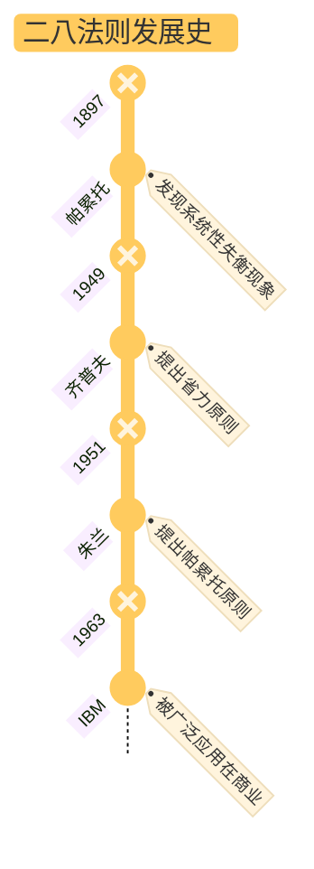

帕累托首先在经济研究中，发现了系统性失衡现象：

>某一群体占总人口数的百分比（即总相关人口的百分比）与这一群体所享有的收入或财富之间存在一种恒定的数量关系。

省力原则：
>各种资源（人力、物力、时间、技巧以及其他任何生产资料）都存在一种进行自我调整以实现工作量最小化的趋势，因此，大约 20%~30% 的资源占到与这一资源相关生产活动的 70%~80%.

关键少数原则：
>80% 的问题通常是由 20% 的原因引起的。在质量管理中，通过帕累托分析/帕累托图，可以识别出对产品质量影响最大的因素，从而将资源集中于解决这些关键问题，提高整体质量效率。

二八法则的广泛应用：

> 1963年，IBM公司发现，一台电脑大约80%的工作时间是在执行大约20%的程序代码。

## 什么是二八法则？

> - 80/20 [^1]法则认为，少量的原因、投入和付出将获得大量的结果、产出和回报
> - 原因与结果/投入与产出/付出与回报之间存在一种内在的失衡

[^1]: 特别需要注意的是，二八法则中的数字并不重要。这二者之和也不一定是 100. 因为比较的是完全不同的两组事物。可以是 60/30 或者 70/30, 重要的是去发现这两组事物之间存在的不平衡。

## 为什么二八法则如此重要？

- 反认知：

  > 当我们考察或者分析因果相关的两组数据时，最有可能得到的结论是存在一种不平衡模式。这种不平衡可能是65/35、70/30、75/25、80/20、95/5、99.9/0.1，或者是这些数据之间的任意一种组合。不过，进行比较的这两个数之和却未必等于100。

- 原因和结果之间存在巨大的不平衡性

- 二八法则在生活、学习和工作中都有着广泛应用

## 为什么混沌理论与二八法则具有强相关性？

混沌理论的解释见[Wiki](https://zh.wikipedia.org/wiki/%E6%B7%B7%E6%B2%8C%E7%90%86%E8%AE%BA)

混沌理论和二八法则都认为：

> - 世界不是线性的
> - 原因和结果之间的关系也是不平衡的
> - 强调自组织现象的存在：某些力量比其他力量更强大，而且它们都努力争取额外的资源
> - 起初一些微小的影响因素，一旦通过“临界点”，便可以在反馈回路的作用下，被无限放大而且产生意料之外的结果
> - 对初始条件的敏感性依存：起初微弱的领先位置能够转变成更有利的领先位置，甚至在后来取得决定性的领先，直到原来的平衡状态被打破，而另一种微小的力量又开始发挥巨大的影响力

## 二八法则可以带来什么好处？

我们不仅要批判和鉴别低生产力，更要做出改变：

- 重新分配现有资源，使其得到高效利用
- 让低效率资源在现有领域得到更高效的运用

> 我们应该鉴别、发展、丰富少数高效率资源，与此同时，摒弃或者大幅度削减对我们没有多少价值的大多数低效率资源

## 二八法则的分类有哪些？

### a) 二八分析法

why: 假设存在二八关系，然后搜集相关事实来揭示真正存在的关系

how: 定量分析

what: 确定原因、投入、付出与结果、产出、回报间的关系

用途：

- 关注引发这一关系的关键性原因，即产出80%产量（或者是任何数量的产出）的20%的投入
- 适时改变表现不佳的另外80%的投入——它们仅仅贡献了20%的产量

误区：使用线性方式运用二八法则，过于简化因果/出入的关系

### b) 二八思维法

定义如下：

> - 首先要思考二八法则是否在这一领域起作用
> - 非定量分析：并不需要我们搜集数据或者验证前提假设
> - 之后就可以据此行事

用途：

> 要进行 80/20 思维，我们必须不断地问自己：导致80%结果的20%的原因是什么？我们绝不能认为自己已经知道答案，而是要下功夫去进行创造性思考。与“次要多数”相对的“关键少数”投入或者原因是什么？关键部分在什么地方受到了干扰？

在每个重要领域，用 20% 的努力来争取 80% 的回报：

> 传统观念认为，不要把所有的鸡蛋放在一个篮子里。80/20法则却让我们仔细挑选一个篮子，把所有鸡蛋都放进去，然后像老鹰一样盯紧它。

## 我们如何运用二八法则？

作为80/20思维者，我们不能急于采取行动，而是先静心思考，领悟出一些东西后再采取有针对性的行动：做到有所为有所不为，即针对有限目标集中采取行动；同时要做到处事果断并富有成效，即投入尽可能少的精力和资源追求完美结果。

花一些时间仔细思考：对你而言，80/20法则是否在这些领域都起作用。具体的百分比是否为80/20并不重要，而且也不可能对其进行精确测量。对你而言，关键问题是花费的时间与取得的成就和收获的快乐之间是否存在着严重失衡。你最有效率的20%时间是否创造出了80%的价值？你80%的快乐时光是否集中出现在20%的生命历程中？

观察生活中是否存在这种失衡现象，思考哪些事情（20%）能够真正带给我们（80%）快乐/财富/意义，然后把精力和时间多用在这些事情上面

无论是对个人还是职场关系而言，少数但深厚的人际关系总是比宽泛而肤浅的关系要好。当你在某些方面花了很多时间结果却还是令人失望时，这就是失当的人际关系，应尽早终止。我们能承纳的人际关系数量有限，不要过早地或让低质量的关系填补上这个缺额。

要慎重选择，用心培养。

## 如何利用二八法则实现降本？

- 简化：通过撤销不盈利的活动使业务简单化
- 专注：关注少数改变现状的动力源
- 对比：对业绩进行比较

## 如何利用二八法则进行时间管理？

>- 努力工作，尤其是为别人工作，并不能实现自身追求
>- 独到的思想和做自己想做的事才能为我们带来高额回报
>- 做自己喜欢的事情，并把它视为工作
>- 20% 的人不但占有了 80% 的财富，而且享受了工作中 80% 的乐趣
>- 减少行动，因为多行动则势必减少思考


## 二八法则在人际关系中的运用

### a) 假设

- 在我们的人际关系中，20% 的人际关系具有80%的价值
- 我们人际关系 80% 的价值，来自我们最早建立起来的 20% 的亲密关系
- 然而，对于这创造了 80% 值的 20% 人际关系，我们的关注度远不到 80%

### b) 交友原则

- 乐于共处
- 互相尊重
- 经验共享
- 互惠互利
- 互相信任

你需要发展六七位最好的职场盟友：

- 一两个比你年长的导师
- 两三个同伴
- 一两个以你为师的人


---
date: 2025-11-04
---

## 1. Deep Seek 导读

**i) 核心20%章节（反映80%核心观点）：**

- 第1、3、4、5、6章（而非之前建议的2-5章）
  - 第1章：奠定“观察-感受-需要-请求”四要素基础框架
  - 第3-6章：分别深入阐述四个核心要素，构成完整的沟通模式

**ii) 逻辑链与章节联系：**

1. 认知重建（1-2章）：揭示“异化沟通”→引入“非暴力沟通”模式
2. 方法学习（3-6章）：四要素分解教学→构建全新沟通语言
3. 应用拓展（7-13章）：倾听他人→爱护自己→处理冲突→表达感激

**iii) 关键衔接点：**

- 第2章到第3章：从“问题诊断”转向“解决方案”
- 第6章到第7章：从“表达自己”延伸到“倾听他人”
- 第9章：将沟通模式应用于自我关系，完成从“对外”到“对内”的闭环

## 2. 我自己的总结

### Chap 1. 非暴力沟通 (Nonviolent Communication) 的四要素

- 观察
- 感受
- 需要
- 请求

### Chap 2. 异化的沟通方式

那些忽视人的感受和需要，从而导致疏远和伤害的语言以及表达方式，被称为异化的沟通方式

异化的沟通方式有以下形式：

- 道德/价值观评判
- 比较
- 回避责任/采用命令语气
- 强人所难/指责

> 暴力的根源在于人们忽视彼此的感受与需要，而将冲突归咎于对方

### Chap 3. 要素一：区分观察和评论

> 不带评论的观察是人类智力的最高形式

在特定的时间和情境中进行观察，然后客观的描述观察结果。最后可以根据这些观察适当的进行评论

如果将观察和评论混为一谈，人们将倾向于听到批评，甚至产生逆反心理

### Chap 4. 要素二：体会和表达感受

建立表达感受的词汇表：

- 需要得到满足时的感受
- 需要没有得到满足时的感受

适当的示弱有助于解决冲突

区分表达具体感受的词语与陈述想法/评论/观点/态度的词语

### Chap 5. 要素三：感受源于需要

听到不好听的话，我们有四种选择：

- 责备自己
- 指责他人
- 体会自己的感受和需要
- 体会他人的感受和需要

如果我们通过批评来提出主张，人们的反应常常是申辩/反击；

如果直接说出我们的需要，他人就有可能做出积极回应

个人成长一般会经历三个阶段：

1. 我们认为自己有义务使他人快乐
2. 我们拒绝考虑他人的感受和需要
3. 我们意识到只能对自己负责，无法为他人负责；同时，我们无法牺牲他人来满足自己的需要

### Chap 6. 要素四：请求帮助

如何提出请求容易得到积极的回应？

1. 提出具体的请求，避免使用抽象的语言，特别是在集体讨论中
2. 明确谈话的目的，表达明确的期待
3. 如果无法确定对方是否已经明白我们的请求（表达的意思和他人的理解不一致），我们可以通过反馈去判断
4. 确认对方明白我们的请求后，需要了解对方的反应
   1. 对方此刻的感受，以及为什么会产生这样的感受
   2. 对方的想法
   3. 对方是否接受我们的请求
5. 区分命令和请求：当请求没有被满足时，批评/指责/让被请求者内疚 → 命令

### Chap 7. 学会倾听

不要急于给出自己的建议：

> 遭遇他人的痛苦时，我们常常急于提建议，安慰或表达我们的态度和感受。可是，倾听意味着全心全意地体会他人的信息——这为他人充分表达痛苦创造了条件

不要试图分析问题：

> 试图分析问题妨碍了我们与他人的联系。如果我们只关心别人说了什么，并考虑他的情况符合哪种理论，我们是在诊断人——我们并没有倾听他们
>
> 在非暴力沟通中，倾听他人意味着，放下已有的想法和判断，一心一意地体会他人。倾听的这种品质体现了它与理解以及同情之间的区别。

如何给予他人反馈：

> 使用疑问句来给予他人反馈

提问集中在他人的观察、感受、需要和请求上

如何表达感谢

- 对方做了什么事情使我们的生活得到了改善；
- 我们有哪些需要得到了满足；
- 我们的心情怎么样？

非暴力沟通模式：

- 观察

  - 我所观察（看、听、回忆、想）到的有助于（或无助于）我的具体行为
  - 当我（看、听、回忆、想）……

  

- 感受

  - 对于这些行为，我有什么感受（情感而非思想）
  - 我感到 + 某些情绪

- 需要

  - 什么样的需要或价值导致了我的感受
  - 因为我需要/看重……

- 请求

  - 清楚地请求（而非命令）那些能丰富我生命的具体行为
  - 你是否愿意……

非暴力沟通的两点原则：

- 诚实的表达自己/关切地倾听他人
- 不要批评和指责

## 3. 带着这些问题进行阅读

**i) 基础理解层面**：

> 非暴力沟通四要素中，哪个要素最能帮助内向者克服“害怕冲突”的心理障碍？为什么？

是**‘需要（Need）’**这个要素。 

因为害怕冲突的根源，常是预见了指责和对抗。

NVC 将对话的焦点从‘谁对谁错’（评判）转向了‘我们各自需要什么’（解决）。这与《内向者沟通圣经》中的‘准备（Preparation）’环节完美契合。

内向者可以提前思考：‘我真正的需要是什么？对方可能的需要是什么？’ 这能将焦虑转化为清晰的行动路线图。

例如，不说‘你这个方案不关心用户’（指责），而说‘这个方案在用户体验部分的数据还不够充分（观察），我有些担心（感受），因为我看重项目的最终口碑（需要）。我们是否可以一起复核一下这部分？（请求）’ 这种基于需要的表达，将对抗关系扭转为了协作关系

> “感受的根源在于自身需要”这一观点，如何改变我们习惯性的指责模式？

“它通过一个关键的思维转换来实现：将‘你让我感到……’变成‘我感到……，是因为我需要……’。

- 指责模式是：`你迟到 → 你不在乎我（评判） → 我生气（感受）`
- NVC 模式是：`你迟到（观察） → 我感到失落（感受） → 因为我看重守时和尊重（需要）`
  这个转换让我们从情绪奴隶变成生活的主人，并为沟通打开了一扇门，而不是用指责把门关上。”

**ii) 应用实践层面**：

> 在区分“观察”与“评论”时，什么样的语言特征能帮助我们避免让对方感到被批评？

核心原则是：像摄像机一样说话，只记录事实，不作分析

1. **避免绝对化词语**：如‘总是、从不、经常、很少’。
2. **使用具体数据和语境**：如你所说，‘他本周有三次会议迟到’而非‘他总迟到’。

**跨文化提示**：在注重精确的德国文化中，这种客观描述本身就是一种专业。而在中文语境中，过于冰冷的‘观察’可能显得疏远，可以结合语气和后续的‘感受’来软化，例如‘注意到你这周有几天居家办公（观察），我有点担心项目沟通会不会不及时（感受）……’”

> 提出“请求”而非“命令”的关键区别是什么？这在职场沟通中为何重要？

关键区别在于：当请求被拒绝时，我们是否会施加批评或惩罚

- **命令**的背后是‘不得不’服从，否则会面临后果。它的焦点是‘控制行为’。

- **请求**的背后是真诚的‘协作’，即使被拒绝，也会好奇地倾听对方的需要。它的焦点是‘建立连接’。

**在职场中**，命令短期内可能有效，但损耗信任和创造力；而请求虽然看似‘效率不高’，却能够激发责任感与长期合作。一个简单的自检方法是：当对方说‘不’时，你的第一反应是恼怒，还是好奇？

**iii) 深度思考层面**：

> 非暴力沟通强调“需要”的普遍性，这对理解跨部门、跨层级的职场冲突有什么启发？

NVC最大的启发在于，它教导我们**穿透对立的‘立场’，去发现背后共享的、普遍的‘需要’**。

- **立场**是具体的解决方案、要求或观点（如“我必须在这个截止日期前完成”）

- **需要**是深层的、人类共通的渴望（如“效率、支持、可预测性、成就感”）

跨部门冲突常常是**立场冲突**：销售部要灵活定制（立场） vs 生产部要标准流程（立场）。但如果他们能说出需要：销售部需要‘满足客户以维持关系’（需要），生产部需要‘保证质量与控制成本’（需要），他们就会发现彼此的需要并不天然矛盾，从而可以共同寻找一个能同时满足双方需要的**新立场**（比如：优化流程以容纳某些定制项）。这便将一场权力斗争，变成了一个需要共同解决的‘设计题’

> 作为内向者，如何运用“用全身心倾听”来弥补在快速对话中的反应不足？

在快速对话中，您无需急于回应，可以运用沉默的力量和简短的语言，为对话‘降速’，引导深度思考。

- **减压话术示例**：
  - “我想确认我理解了你的重点，你是说……（观察）吗？”
  - “听起来，你对这个结果感到有些失望（感受），因为它对你来说很重要（需要）？”
- **这样做**：1. 确保你真正理解，而非误解。2. 让对方感到被深度理解，极大缓解对立情绪。3. 为你赢得了宝贵的思考时间。这正将内向者的‘反思’特质，从负担变成了稀缺的领导力资源。”
- 在快速对话中，您无需急于回应，可以运用沉默的力量和简短的语言，为对话‘降速’，引导深度思考。
  - **减压话术示例**：
    - “我想确认我理解了你的重点，你是说……（观察）吗？”
    - “听起来，你对这个结果感到有些失望（感受），因为它对你来说很重要（需要）？”
  - **这样做**：1. 确保你真正理解，而非误解。2. 让对方感到被深度理解，极大缓解对立情绪。3. 为你赢得了宝贵的思考时间。这正将内向者的‘反思’特质，从负担变成了稀缺的领导力资源

**iv) 个人整合层面**：

> 对比《内向者沟通圣经》的 4P 法则，非暴力沟通在哪一环节能提供最有力的补充？

非暴力沟通为《内向者沟通圣经》的‘准备（Preparation）’环节，提供了**一套极其强大的‘心理准备工具’**。在准备时，我们不仅可以准备要说的内容，更可以运用 NVC 框架来准备我们的心态和沟通策略：

- **准备观察**：我需要陈述哪些具体事实？
- **准备感受与需要**：我预期的感受是什么？我真正的需要是什么？**更重要的是，预测对方可能的感受和需要是什么？**
- **准备请求**：我的请求是否清晰、可行、且以合作的口吻提出？
  经过这样的准备，您在进入‘展示（Presence）’和‘推动（Push）’阶段时，会充满基于理解的自信，而非单纯的勇气，使整个 4P 过程都在一个富有同理心的框架内稳健运行。

> 在表达感激时，为什么要避免使用“很好”“很棒”这样的评价性语言？

‘很好’这类评价是**评判，而非感激**。

NVC倡导的感激是**一份详细的‘感谢信’**，它包含三个具体部分：

1. **对方做的具体事**（观察）：“在你昨天下午主动帮我复核了第三部分的数据之后...”
2. **我的需要如何被满足**：“...它满足了我对项目准确性和团队支持的需要。”
3. **我此刻的心情**（感受）：“...我感到非常安心和感激。”

这样的感激，因为具体而真诚，因为关联到需要而直抵人心，真正强化了彼此的联系。

### 总结

这本书的核心概念是**动态重连（livewired）**

这个概念来自于**大脑可塑性（brain plasticity）**，由 Willian James 提出

作者为了强调神经**持续变化**，并非简单的一次性塑形，然后永远保持不变的特点，将其称为动态重连

作者告诉我们，神经元为了争夺大脑皮质，始终在相互竞争；相应地，神经元一直在动态重连，最终形成大脑的神经地图

神经地图的形成受到两方面影响：

- 基因：神经核团的硬连接（hardwired）
- 环境：神经元的动态重连（livewired）

基因/遗传是基础，但是环境决定了我们每个人大脑的独特性：

环境 → 感官输入 → 大脑决策 → 神经元的动态重连 → 独一无二的神经地图

神经元的动态重连，是为了更好地应对输入；所以，无论接收到什么数据，大脑都会加以利用

从这个角度来说，你把时间花在什么上面，大脑就会做出什么改变，你的经历终会成为身体的一部分

### 认知更新

这些内容我以前从未想过：

- 大脑并不是分为几个独立的区域，每个区域的功能单一；相反，它们之间通过神经元的动态重连相互影响
- 学习分为两种类型：
  - 储备型学习：系统学习某一方面的知识以备不时之需
  - 即时型学习：想知道某一特定的知识时，立刻搜索并得到答案
  - 一般来说，只有在进行即时型学习时，神经调质才会大量释放
- 大脑永远保持可塑性并不是一件好事：
  - 无法了解普世规律
  - 无法形成关于社会生活的认知
  - 无法维持良好的社交关系

### 笔记关联

这些内容可以加强我已有笔记的连接：

与刻意练习的关联：

> 只有你正在做的事与奖励挂钩、与你的目标一致，大脑就会根据你在每件事上花费事件的长短来进行自我调节

与最小惊讶量的关联：

> - 大脑不会在每件事上都消耗神经元的能量，它的目标是重新配置神经网络，尽可能减少浪费
> - 在预测很准的情况下，大脑就不会再进行改变

与自由能的关联：

> 从根本上说，大脑就像一台预测机器，驱动自身不断地自我重塑

与系统 1 的关联：

> - 年老的大脑已经很难为新任务分配领地，但纷争初起的年轻大脑还很容易调整神经地图
> - 大脑会在适应性和效率之间做权衡，所以当你变得擅长某事时，就会不太擅长其他事

### 问题与思考

关于神经元是如何建立连接的？作者提到了两种物质：

- 神经元释放神经递质（neurotransmitter）/建立更多受体接受神经递质，从而加强彼此的联系
- 神经元系统会释放被称为神经调质（neuromodulator）的化学物质，建立事件的相关性
- 一种重要的神经调质是乙酰胆碱，它只能在特定位置释放，且受到奖赏和惩罚两个系统的驱动

思考：神经递质和神经调质的区别是什么？

思考：在 P222 作者提到：

> 你是你记忆的总和

或许这个表述并不严谨，因为同一段记忆，不同的人生阶段对它的解读也不是相同的？

---
date: 2025-11-16
---
# note

## 1. 内容摘抄

### Chap 1. 沟通的过程

> 说明有哪些因此可能会阻碍两个说同一种语言的人之间的沟通

- 三观
- 妄下结论
- 刻板印象
- 缺乏兴趣/知识
- 表达不准确
- 情绪
- 个性

### Chap 2. 说

无

### Chap 3. 听

> 列出并说明哪五种做法可以表示我们正在专心倾听

- 鼓励对方
- 得到信息
- 增进关系
- 解决问题
- 理解对方

> 听者如何避免分心

- 点头，然后等候
- 专心看着说话者
- 重复对方说的最后几个字，但不要过于频繁
- 说“了解”、“嗯”、“真的”等
- 回应对方，如果有不懂的地方，可以先重复对方说的内容，然后用 5W1H 提问

### Chap 4. 人际互动与非语言沟通

> 什么是“后设沟通” (meta-communication)？

meta 是超越或者附加的意思 → 后设沟通就是沟通之外附加的东西

即所有在文字之外，我们拿来阐释他人所说的话的线索

> “沉默”如何有助于沟通的过程？

这里的“沉默”指的是主动倾听，鼓励对方继续说下去，甚至把对方本不愿意表达的感觉和态度表达出来，其作用为：

- 鼓励响应
- 双向沟通

> 如果你求职面试迟到了三十分钟，也不道歉，对方可能会怎么想？

迟到 → 对方会认为我没有时间观念，以及对这次面试不够重视，并且不会为他人着想

不道歉 → 对方会认为我没有礼貌

> 研究肢体语言的科学称为什么？

人体动作学 (Kinesics):

- 肢体语言与传达出的语言信息相关
- 通常这种非语言沟通比说出来的文字更有力
- 借此可以了解沟通人的情绪

> 人类似乎有一个个人空间感。这个“个人空间”根据互动形态与彼此关系可以氛围哪四种距离？

- 亲密距离
  - 实际的接触 → 亲密的朋友/亲人
  - 拥挤的空间（电梯、地铁）内 → 肌肉紧张、避免眼神接触、退缩，潜在表达为“抱歉侵入你的私人空间，我不是有意的”
- 个人距离
- 社交距离：商业会谈
- 公共距离：非正式/正式集会

> 假设你跟对方各方面条件都差不多，如果你说话时看着对方，对方会对你有什么印象？

对方会认为我充满个人魅力，并且希望得到反馈

> 当两个人以上在交谈时，大家通常会轮流发言，使整个对话过程顺畅不冲突。有哪些非语言信号可特别用来推动整个对话的过程？

- 眼神
- 手势
- 面部表情
- 点头

> 如果语言信息和非语言信息互相矛盾，我们会相信哪个信息所传达的意义？

非语言信息

### Chap 12. 增进阅读速度

人们在屏幕上阅读的效率，往往比不上在纸张上阅读的效率 ，因此如果有长篇的、重要的或困难的内容，最好能打印出来

### Chap 13. 提高阅读效率

你应该在大致了解整体的内容与结构之后才开始阅读

这不只会使你阅读起来更轻松，也会使你阅读得更快

这个做法需要两个技巧

**i) 浏览**：

1. 了解结构：在开始仔细阅读之前，就对整个内容有个大致的了解
2. 评估：这样你就可以判断其价值，知道该什么时候读它，又需要投入多少精力。分类标准如下：
   - 必要的：需要仔细阅读
   - 有用的：读完必要的内容有，有时间再读
   - 不重要的

**ii) 略读** ：

- 方式
  - 找到主题段落中的主题句
  - 视觉标记：如斜体/加粗/画框/高亮
  - 语言标记：如首先/例如/因此
- 略读规则
  1. 用最快的速度阅读
  2. 遇到有趣的地方也不要停下来，专心评估整篇内容
  3. 先读目录、标题和总结
  4. 阅读每章的第一段，因为第一段应该包含整章内容的主题，说明其基本假设
  5. 阅读接下来每一段的第一句 ，而且只读第一句。每一段的第一句应该会总括该段落的主旨，就其给予基本信息。不要把整段都读完，第一句之后都属于细节，如果有需要，稍后才回来阅读
  6. 这些段落的第一句，应该能够按照逻辑顺序连贯起来 。如果你遇到哪一句与前面配合不起来，试试该段落的最后一句。如果还是行不通，先不要理会这一段，继续读下一段的第一句
  7. 在结尾的部分，放慢速度，把最后两三段完整读过去。这部分应该会包含推论、结论、结果等，此外还可能包含整份文件或整章的总结，尽管并没有标题指出来

**iii) SQ3R 阅读法**

1. Survey: 浏览目录/索引/前言等，找到想读的部分
2. Question: 对阅读内容进行提问
   - 主题是什么
   - 论点是什么
3. Read: 就是单纯的阅读，如果内容复杂可以读两遍，可以画线但是不要做笔记
4. Recall: 回忆读过的章节中的论点/论据/逻辑链，不要抄原文
5. Review: 快速检查前面四个步骤

## 2.逻辑链

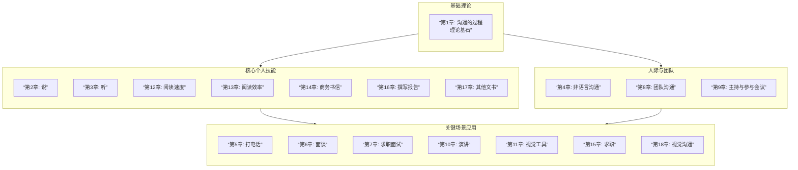


---
title: 滚床单心理学
author: 肖雪萍
date: 2025-01-08
tags:
source:
---
# ref
## 1. 核心思想

## 2. 列出最关键的三个概念

### 权力的边际效应与性

>- 拥有权力的人周围会有一群可以帮助其脱离困境的人，而这可以降低有权者犯错的成本
>- 权力本身会使行使权力的人产生“我很优秀”的错觉，误把权力带来的荣誉和尊敬当作自己有能力的标志
>
>所以，权力的边际效应会直接体现为一旦拥有权力就容易在性方面有优越感，认为所有的异性都该被自己占有。

### 性感觉阈值

>一个领域或一个系统的界限，被称为阈，而这个阈的数值被称为阈值。感觉阈值，就是能够让人体有感觉的阈的数值。用通俗的语言来说，就是从刚好能引发人体的感觉，到刚好不能引起人体的感觉的刺激范围的数值（对人体的刺激过大或过小，都无法让人体产生感觉）。而绝对感觉阈值，是指那个刚好能引发人体刺激感觉的数值。

### 费洛蒙

>没错，男女之间最初的吸引并不是来自于相貌、衣着、谈吐、学历等看得见的信息（除非这段关系是缘于功利性而非真正的吸引），而是身体散发出的看不见的气息。生物学家为这种身体气息命名为“信息素”，也有的译作“费洛蒙”。
>
>有不同身体气味的人就会有不同的免疫系统（遗传基因），而人们往往被那些拥有与自己不同身体气味（不同的免疫系统）的人所吸引

### 催产素

性行为时，人体会分泌一种叫“催产素”的化学物质，这种化学物质会随着性行为次数的增加而增加。而同居的情侣比那些不同居的情侣有更多的性行为，这使同居者与伴侣的连接会更深，彼此之间就会产生更多的依赖感，以至于无法轻易分离。

## 3 主题归档

- 两性关系
- 婚姻

## 4. 写作框架

### 4.1 写作动机是什么（问题意识/现实意义）？

向大众普及一些基本的性知识，以及介绍（中国）男性和女性在两性关系中的一些心理想法和思维差异。

### 4.2 论证方法是什么（定性/定量）？

- 第 1-3 章：性知识普及
- 第 4-6 章：滚床单时的两性差异以及潜在的出轨表现
- 第 7 章：性少数群体的特殊癖好

### 4.3 结论是什么？

## 5. 批判性思考

### 5.1 作者的学术背景、政治倾向或价值预设是什么？

肖雪萍，国家二级心理咨询师，专注于婚恋理咨询和对梦、潜意识的研究，对两性、爱情、婆媳关系、外遇等婚姻中常见的问题，对婚姻家庭问题有着深入独到的见解和丰富的临床经验。

在临床工作中，一直本着“去病化”、“关注人格基础”、“赋力”的咨询理念和积极的人性观，与每一位来访者真诚互动，用自身蓬勃的生命力，陪伴每一位正行走在黑暗中但却心向光明的人去找到属于他自己的力量和勇气。对中国传统文化有着深入的研究，致力于将西方的心理学本土化，平民化。

### 5.2 我是否认同或反对作者的观点？

算是性知识科普入门读物吧，很多观点有待证明。先通过这本书了解了一些最基本的概念。最认同的一句话：爱让性变得神圣。

## 6 行动/用途

- [ ] 《海蒂性学报告》

# note

**生命的本质是基因的延续。**

>每种生物（包括动物、植物），都是带着自己的使命来到这个世界上的，那就是将自己的基因传递下去，以使自己的族群能够延续。

**什么是权力的边际效应？**

>权力除了带给人许多机会外，还会让人更加自信，而这种自信除了表现在仪表和工作能力上，还表现在性的优越感和攻击性上。
>
>权力之所以能带来性的优越感和攻击性，还有另一个深层原因，就是权力的边际效应。
>
>权力的边际效应有两个层面：一是拥有权力的人周围会有一群可以帮助其脱离困境的人，而这可以降低有权者犯错的成本；二是权力本身会使行使权力的人产生“我很优秀”的错觉，误把权力带来的荣誉和尊敬当作自己有能力的标志。所以，权力的边际效应会直接体现为一旦拥有权力就容易在性方面有优越感，认为所有的异性都该被自己占有。

**性与爱的关系是什么？**

>爱情因性而更加美好，性因爱情而变得神圣
>
>因爱而性的爱情会更容易稳定和长久；在爱情基础上发展出的性关系，将会加深彼此的爱意，并使关系更稳固。
>
>而那些因性而爱的感情则更多地建立在激情的基础上，如果要发展成长久的爱情，就需要在关系开始后加强彼此之间的了解和亲密感的培养，否则关系就容易夭折。

**性的三个目的是什么？**

>社会学家和性学家认为性有三种目的：
>
> 1. 繁殖——生育孩子
> 2. 建立关系——在充满爱和信任的关系里进行性行为
> 3. 娱乐——得到直接的身体乐趣。

**一夜情与爱的关系是什么？**

>古人说“鱼和熊掌不可兼得”，用到“一夜情的娱乐性”和“亲密关系的满足感”这里，也是很恰当的——我们没有办法同时得到这两样东西，也就是说，它们之间是互相排斥的。如果我们得到了性经验的广度，自然就会同时失去它的深度，反之亦然。

**男性是如何控制男女比例的？**

>作为社会的主要管理者，男性会根据女性的数量多少来设定性的游戏规则，这就是控制的“伎俩”之一：当女性多而男性少时，他们就会鼓吹贞洁的重要性；而当女性少而男性多时，性解放又变成社会的主流口号。

**性压抑和性解放之间的关系是什么？**

>性观念的封闭会导致性压抑，可是性压抑会让人更容易得到性的满足；性观念的开放会导致性泛滥，这反而让人们由于得到太多刺激而导致性感觉绝对阈值的加大，从而更不容易得到满足。

**手足是如何反映人的真实想法？**

>距离大脑越近的身体部位，就越容易被大脑控制；而距离大脑越远的身体部位，则越容易脱离大脑的监管而“自行其是”。而距离大脑较远的身体部位所表达出来的，才是人们真正的内心想法，而不是由大脑修饰后再传达出来的意思。
>
>尤其是离大脑较远的手、腿和脚，它们常常不听使唤地透露出主人内心真正的想法。

**前戏与后戏有什么不同？**

前戏：关注点是性活动本身，为了营造较好的性感觉
后戏：通过性来提升感情，达到心理上的满足

**女人是需要拥抱的。**

>女性的身体到处都是敏感的神经，尤其是背部。脊椎处汇集了全身的多种神经，在被拥抱时能让人产生宁静和被接纳的安全感。当一个女人感受到自己正在被所爱的男人拥抱在怀里，并且只是单纯的拥抱时，她会更加确信自己正在被爱——那拥抱不是为了“下一步”，仅仅是因为爱惜她而拥抱她。她需要这种感觉以提升对爱的信心，以及提升她的自尊感。
>一种感觉：被拥抱，即被征服

**正常的性爱时长是多久？**

>完美的”滚床单时间是20分钟左右，但在这20分钟里大约有10分钟前戏和5分钟后戏，那么，真正的滚床单时间也就大约5分钟。只要前戏做得足够，再配合正确的滚床单技巧，5分钟对于女人来说，是足够能达到性高潮的时间了。


---
date: 2024-12-15
author: David Graeber
title: 毫无意义的工作
tags:
source:
---
# card

## 1. 核心内容

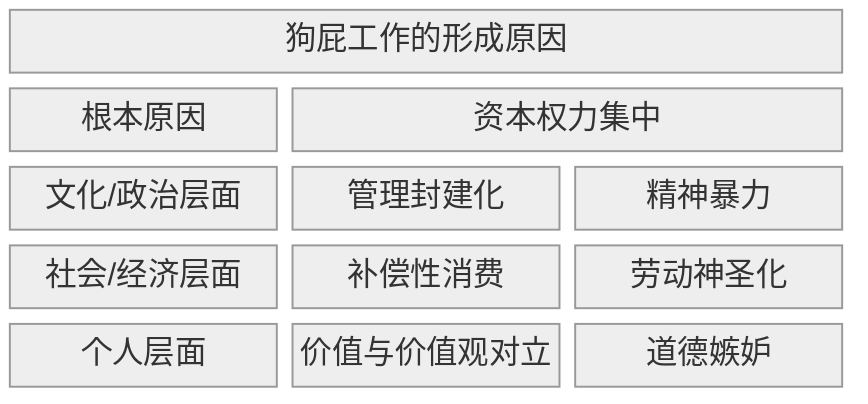

资本权力通过管理封建制，制造出大量的狗屁工作，并对员工施加精神暴力，导致：

- 用劳动神圣化美化剥削，趋势补偿性消费强化资本循环

- 个人层面

# ref

## 1. 核心思想

现代社会大量“狗屁工作”（bullshit jobs）的存在本质是系统性暴力，它们不仅没有社会价值，更通过剥夺劳动者的意义感制造深层精神痛苦，最终服务于权力结构的维持。

## 2. 核心概念

#### 狗屁工作（Bullshit Jobs）

- 定义：
  - Why?
    - 资本主义官僚体系需要创造虚假岗位维持控制权，分散社会反抗能量
  - How?
    - 通过虚构管理需求、过度监管和流程复杂化人为制造岗位
  - What?
    - 从业者自身都认为无存在必要且对社会无贡献的工作（随从/打手/补漏者/打勾者/分派者）
- 示例：某科技公司“战略协同副总裁”
  - 背景：初创公司被收购后官僚化
  - 支撑点：每日制作无人阅读的跨部门协作报告
  - 结果：员工抑郁离职，公司效率下降30%
  - 为何是典型示例？典型“分派者”角色（人为制造工作链）
- 反例：急诊科护士
  - 背景：
  - 矛盾点：工作必要性由生命需求决定而非权力意志
  - 结果：超负荷仍感知强烈价值感
  - 为何是典型反例？社会价值可被从业者及公众直接验证

#### 精神暴力（Spiritual Violence）

- 定义：
  - Why?
    - 意义剥夺比物质剥削更具摧毁性
  - How?
    - 强迫劳动者参与自我否定的劳动仪式
  - What?
    - 工作内容与人性创造本能对立，从而导致自我认知撕裂

#### 管理主义的封建制度（Managerial Feudalism）

- 定义：
  - Why?
    - 资本想更好地控制劳工阶级意识
  - How?
    - 强迫劳动者否定自己的工作价值
  - What?
    - 现代企业将封建时代的领主-附庸关系美化为管理制度，让员工忘记自己的真正价值

#### 补偿性消费（Compensatory Consumption）

- 定义：
  - Why?
    - 只有在工作中感受到痛苦，消费主义才具有合理性
  - How?
    - 把钱花在符号化消费中（例如奢侈品/极限体验）伪造存在感
  - What?
    - 用疯狂购物填补工作的空虚感

#### 价值与价值观的对立（Value vs. Values）

- 定义：
  - Why?
    - 资本逼人在“赚大钱”和“做善事”之间二选一
  - How?
    - 价值观越高尚的工作，其价值越低
  - What?
    - 社会奖励机制和人类良心的冲突

#### 道德嫉妒（Moral Envy）

- 定义：
  - Why?
    - 
  - How?
    - 通过贬低他人工作价值（如说教师/护士“穷忙”）来安慰自己
  - What?
    - 干着无意义工作的人对有意义工作者的嫉妒

## 3. 主题归档

类型：

- 社会批判理论
- 劳动政治学

- 经济人类学

关联领域：

- 奴性管理
- 薪资悖论

## 4. 全书框架梳理

核心论点：为什么会产生狗屁工作？

分论点1- 个人层面：为什么人们会从事并忍受毫无意义的工作？

- 人的社会地位和价值由工作决定
- 狗屁工作导致人们补偿性消费
- 消费成瘾后迫使人们继续从事狗屁工作

分论点2- 社会/经济层面：什么样的力量推动着狗屁工作的激增？

- 价值与价值观的对立

分论点3- 文化/政治层面：经济制度的狗屁化为何未被视作社会问题？为何没有人对此采取行动？

- 资本恐惧暴民，因此把他们分成三组：
  - 普通工人：有产出但被无情压榨/剥削
  - 无业游民：普遍受到抨击和斥责
  - 狗屁工作从业者：领着工资但不做有产出的东西，他们的存在只是为了认同统治阶级的观点和感受
- 暴民这种动物如此低等，以至一旦让他们获得闲暇，就会立刻变得危险，还是让他们忙忙碌碌没有时间思考来得安全

## 5. 写作动机

问题意识：当 40% 劳动者自认工作无意义，我们是否正在构建反人类文明？

现实意义：知识经济时代“高薪废物”现象爆发性增长

## 6. 观点提炼

### a) Why

- 打破普通认知：劳动是神圣的

- 普通人的工作实际上在被资本绑架

### b) How

- 全球百行业工作者匿名证言
- 官僚经济数据分析

### c) What

- 定义五类狗屁工作：随从/打手/补漏者/打勾者/分派者
- 精神暴力作用模型

## 7. 批判性思考

### a) 作者背景

大卫·格雷伯（David Graeber），美国著名人类学家、社会学家，“占领华尔街”主要参与者，先后任耶鲁大学副教授、伦敦政治经济学院教授，师承人类学家马歇尔·萨林斯

### b) 政治倾向

- 无政府主义人类学
- 全球正义运动理论

### c) 价值预设

- 根本怀疑科层制合理性
- 主张“价值劳动”（护理/教育/环保）应取代金融投机核心地位
- 预设：工作意义感是基本人权


# note
### 什么是 Bullshit Jobs

>狗屁工作是一份毫无意义且往往有害的定期领薪水的职业，其无意义或有害程度是如此之高，乃至从事这份职业的人都无法为其找出合适的存在理由。虽然要从事这份工作有一个条件，即从事者不得不假装这份工作的存在是完全合理的。

对于这个定义，提出以下疑问：

- 如何衡量有没有「意义」？
- 「有害」是指对谁有害？
- 如何评价工作是否「合理」？

梁永安在序言中写道：

摘录 1:

>格雷伯所说的这种“无意义”状况，并不是批判一切工作，而是指脱离了人类社会真实需要、人为叠床架屋的泡沫化分工。

摘录 2:

>美国制度经济学家道格拉斯·诺思提出过“生产性努力”和“分配性努力”这两个概念：生产性努力具有强大的创新性，不断增大社会财富，而分配性努力只是想在不增加社会财富总量的状况下抢占社会的优势地位，在分配结构中夺取更大的个体利益。在什么样的年代会产生普遍的“分配性努力”？诺思指出，当社会分配严重不公时，生产性努力没有回报，分配性努力却风生水起，人们自然不愿再将时间投入生产性努力，纷纷奔向分配性努力。长此以往，整个社会就会失去创造的激情，经济结构趋于单一，失去增长的原动力，从而必然陷入停滞。

所以作者想表达的意思是，在社会分配严重不公时，为什么很多人会选择分配性努力？这似乎和二八法则对上了：20% 的人掌握 80% 的资源/财富/权力。

关于个人与工作的关系，摘录如下：

>人们并不会将个人的职业视作后人对自己的主要评价来源。当我们离开这个世界后，在墓地前是找不到刻着“蒸汽管装修工”“办事员”“护林员”这样的墓碑的；相反，墓碑上刻下的，是人们生前曾共度时光的伴侣和后代的姓名，而这些都是我们在世间曾经存在过的证明，是我们曾经付出和收获的爱的见证，是与生命本身息息相关的一种情感传递。但是在世俗生活中，人们相遇时并不会问对方关于爱和承诺的问题，而是问：“你是做什么工作的？”

人们用工作的性质/职位/酬劳定义自己在社会中的地位，而不是承诺和爱。作者的这段描写，似乎一个冰冷的资本社会形象已经跃然纸上了。可是作者自己也说了，前提是在「世俗生活」中，或者说是「社会生活」。那么显然私人生活无法与社会生活完全划等号。

>整个社会，所有的人，似乎都陷入了某种悲惨的境况：我们将生命中大部分的时间都投入了工作，投入了那些我们知道对这个世界毫无贡献的工作中。

这里的「所有人」是否缺乏数据支持？有没有一种可能，就是工作是对世界有贡献的，只是当下无法体现，需要「让子弹飞一会」？

### Bullshit Jobs 背后隐藏的社会现象

>为什么有很多人明知自己的（一部分）工作毫无意义，却依然还要去做？为什么现在我们的社会科技发展如此之快，可依然无法达到每周只工作 15 小时？为什么没有工作就没有社会地位？

### Bullshit Jobs 的五大分类

>- 随从：衬托另一个人的重要性，让这个人看起来很重要或者让这个人感到自己很重要
>- 拼接修补者：其岗位完全是为了应对组织的某个故障或缺陷而存在的 。他们的全部工作是为了解决某个问题，而之所以产生这个问题，恰恰是因为那些地位更高的人压根儿懒得管这些。 拼接修补者最突出的例子，便是那些成天跟在能力不足、行事马虎的上司屁股后面，一直忙着收拾烂摊子的下属了
>- 打手：有一定进攻性，但存在的根本原因仅仅是有人花钱让其存在的岗位，例如电话/保险推销员
>- 打勾者：被雇用来掩盖某个组织不作为的员工。这类工作者存在的全部意义或者绝大部分意义就在于，雇用他们的组织可以对外声称，他们正在做某件他们其实没有做的事情
>- 分配者：
>  - 第一类分派者工作的全部内容就是给他人派活儿。如果分派者认为自己的介入其实毫无意义，哪怕没有他们的介入，下面的员工依然可以把活儿干好，那么我们可以说，他们从事的是狗屁工作。这类分派者正好和前面说的随从相反：后者是没必要存在的下级，前者是没必要存在的上级
>  - 第二类分派者的主要工作便是制造狗屁工作给他人，监督这些狗屁工作的完成，甚至还要招更多的人来完成这些狗屁工作。此类分派者可以被称作“狗屁工作生成器”。第二类分派者除了分派工作，或许还有其他工作，但如果他们全部或者大部分工作内容是生产狗屁工作然后分派，那么他们自己的工作也可以被归到狗屁工作中

精简重述一下，狗屁工作的五种分类：

- 随从（Flunky）
  - 为了显示上级重要性，什么都不做的人
  - 例如老板/明星身后的随从
- 拼接修补者（Duct Taper）
  - 为上级收拾烂摊子/擦屁股的人
- 打手（Gonner）
  - 通过制造焦虑/欺骗/展现攻击性，而让别人消费的人
  - 例如保险推销员/电话推销员
- 打勾者（Box Ticker）
  - 为了掩饰组织不作为而被雇佣的员工
  - 例如公司出了问题但不想解决，于是成立某某调查协会
- 分配者（Taskmaster）
  - 对工作进展毫无影响的上级
  - 制造狗屁工作的上级

### 为什么会产生 Bullshit Jobs

三个层面

- 个人层面——为什么人们会从事并忍受毫无意义的工作？
- 社会/经济层面——什么样的力量推动着狗屁工作的激增？
- 文化/政治层面——经济制度的狗屁化为何未被视作社会问题？为何没有人对此采取行动？

#### 个人层面：现代工作的悖论

>人类本质上由一系列目标构成，若是完全丧失了目标感，那么可以说人类将不复存在。
>
>正是因为憎恨自己的工作，工作者才获得了尊严感和自我价值感。
>
>过去25年中，远远超过100份的研究显示，人们常这样描述自己的工作：令人身心俱疲，使人感到无聊，让人丧失尊严感和存在感。
>
>（然而与此同时），人们想要工作。因为在某种程度上他们知道，工作在精神上对于人类品格的形成，扮演着至关重要甚至无与伦比的角色。工作不仅仅是谋生的手段，还是极其重要的给生命内在提供养分的方式……
>
>一个人若失去了工作的机会，他失去的绝不仅仅是那些工作可以带来的物质收入，更是丧失了定义自我、尊重自我的能力。
>
>诚然，在某种程度上，我们大部分人更希望通过工作以外的什么东西来定义自己而非工作本身。可不知道为什么，矛盾的事情发生了，当被问及生活的意义这个问题时，人们常常会回答，是工作赋予了他们生活的终极意义，而失业则会给他们的心理造成毁灭性的打击。
>
>我们不再以生产能力审视自己的存在，而是通过消费的对象来表达自己：穿的衣服、听的音乐、追的球队等。尤其从20世纪70年代起，每个人都希望归属到某个亚文化部落:
>
>1. 大部分人的尊严感和自我价值感与工作谋生息息相关
>2. 大部分人憎恨自己的工作

#### 社会/经济层面

>今日狗屁工作激增，主要原因在于掌控富裕经济体（同时也在逐渐掌控非富裕经济体）的**管理主义封建制度**的独特性。狗屁工作之所以给人们带来了痛苦，是因为人类幸福感的源泉是来自一种对这个世界能产生一定影响的感觉，而当提及自身工作的时候，人们大都会将这种感觉同社会价值等同起来。但是与此同时，他们意识到一点，一份工作产生的社会价值越大，它能给工作者带来的经济回报则越小。

#### 文化/政治层面

>人类的快乐是可以被精确量化的，因此所有的伦理道德议题都可被简化为对如何使“最多的人获得最大的快乐”的计算。
>
>在我看来，这种没完没了延续毫无意义的工作的冲动，实际上不过是来源于对暴民的恐惧：暴民这种动物如此低等，以至一旦让他们获得闲暇，就会立刻变得危险，还是让他们忙忙碌碌没有时间思考来得安全。
>
>真正有产出的工人被无情地压榨和剥削，剩下的人分成两组：一组是惶恐的不工作的人，这些人受到普遍的抨击和斥责；更多人是在另一组，他们领着工资但其实什么都不做，他们的岗位是为了认同统治阶级的观点和感受。

### 几个重要的概念

#### 道德嫉妒

> 你的工作高尚、有用，而你依然想要获得舒服的工资收入和丰厚的福利待遇，那你就会成为人们憎恨的对象。

对知识分子群体的憎恨情绪背后隐藏着以下两种认识：
第一，精英分子眼中的普通工人是一帮愚蠢的土鳖；
第二，精英阶级是一个不断被固化的阶级，工人阶级的孩子想要闯入精英阶级的难度，事实上已远远大于想要成为资本家的难度

#### 管理主义的封建制度

>今日狗屁工作激增，主要原因在于掌控富裕经济体（同时也在逐渐掌控非富裕经济体）的管理主义封建制度的独特性。狗屁工作之所以给人们带来了痛苦，是因为人类幸福感的源泉是来自一种对这个世界能产生一定影响的感觉，而当提及自身工作的时候，人们大都会将这种感觉同社会价值等同起来。但是与此同时，他们意识到一点，一份工作产生的社会价值越大，它能给工作者带来的经济回报则越小。

#### 补偿性消费

>人类工作越来越辛苦是因为人类创造了某种奇怪的施虐受虐逻辑论证法，通过这种逻辑论证，我们觉得只有在工作时不断感受痛苦，才能赋予我们那些隐秘的消费主义愉悦感以合理性。在这种理念的驱使下，工作占据了我们越来越多的时间，于是人们不再享有“生活”这件奢侈品，取而代之的是补偿性消费。
>
>在人人皆知自己的工作毫无意义之时，等级制度工作环境中的施虐受虐态势会迅速加剧。

#### 价值（Value）与价值观（Values）的对立

所谓价值，指的是工作的经济性，即通过工作赚得的金钱。

所谓价值观，指的是工作的实用性，即通过工作所产生的对这个世界/社会的贡献。

而这二者通常成反比。

>有理由相信，人们口中的左翼和右翼之间的巨大历史分歧主要集中在“价值”和“价值观念”之间的关系上。
>左翼一直致力于跨越那些纯粹由自私驱动的领域和那些往往体现高尚品格的领域之间的鸿沟。
>
>右翼则一直试图将这两个领域拉得更远，然后声称这两个领域都为自己所有。
>
>主流左翼主要控制着人的生产，主流右翼则主要把持着物的制造。

---
date: 2025-11-17
---
# note

## Deep Seek 调研导读

这本书的底层逻辑是：任何说话场景，都涉及到权力的流动。你需要先判断身处的“话语权场”，再选用正确的话术。

最核心的20%内容位于：

1. 第一章：五维话术（必读）
   - 核心价值： 这是全书的总纲和理论基石。它定义了沟通、说服、谈判、演讲、辩论这五大场景的权力关系和目标。不理解这一章，后面的技巧就是零散的招式。
2. 第二章：沟通（核心）
   - 核心价值： 这是使用频率最高的维度。旨在消除误解、增进理解，核心是“换位思考”与“平等交流”。对于需要频繁进行团队协作、需求确认的你来说，这是每日的刚需。
3. 第五章：谈判（核心）
   - 核心价值： 这是创造价值、解决冲突的维度。它不是你死我活的争论，而是寻求共赢的艺术。对于需要争取资源、敲定排期、明确责任的工程师而言，这是将工作推向前的关键能力。

建议略读或作为工具书查阅的部分：

- 第三章：说服（当你需要推销一个想法或产品时精读）
- 第四章：演讲（与《沟通圣经》有重叠，可在需要时对照阅读）
- 第六章：辩论（在需要捍卫技术方案、进行Code Review辩论时参考）

## 问题

#### **针对【第一章：五维话术】的核心问题：**

> 定义与区分： “沟通”、“说服”、“谈判”、“演讲”、“辩论”这五种话术，其根本的权力态势、核心目标与主要风险各是什么？

| 维度 | 话语权   | 核心目标 | 主要风险                       |
| ---- | -------- | -------- | ------------------------------ |
| 沟通 | 流动     | 理解     | 沟通双方不平等                 |
| 说服 | 在对方   | 改变     | 把说服变成说教、洗脑或强行灌输 |
| 谈判 | 在双方   | 协调     | 把谈判变成零和博弈             |
| 演讲 | 形成     | 表现     | 不容易让第三方产生共鸣         |
| 辩论 | 在第三方 | 捍卫     | 把辩论变成吵架，缺少批判性思维 |

> 核心概念： 什么是“话术能力是全息的”？为什么说在任何一个场景下，其他话术能力都可能成为你的“隐藏技能”？

这五个维度的话术是相辅相成的，任何具体的说话场景都会运用这五项能力展现，为此，应该做到：

- 具备并强化五项话术能力
- 各项话术能力都能与其他项目配合使用
- 知道具体场景中如何配合使用才能达到最佳效果

> 自我诊断： 回顾我最近一次不成功的对话，我错误地判断了场景吗？（例如，本该是“沟通”时，我却用了“辩论”的心态和技巧？）

上周末 Rosie 和我聊起产线批准样品的周期比较长，我想说每个人的出发点或者立场是不一样的，不应该单纯的从你的角度出发去考虑问题。这本应该是话语权的流动，即沟通，但是似乎双方是不平等的，聊着聊着，沟通就变成了辩论

#### **针对【第二章：沟通】的核心问题：**

> 核心技巧： 什么是“承上启下”的沟通技巧？在倾听时，如何通过“及时有效地反应”来避免误会、增进信任？

承上启下的沟通，即工具性沟通，是指在开展实际对话之前的准备工作：

- 建立基本共识
- 扩充对话时间
- 调整预设认知
- 释放可能的善意

要做到及时反应，可以：

1. 用自己的话总结对方刚刚说的话
2. 接下来提出一个开放问题，引导对方深入或者转向下一个议题

> 破冰与提问： 面对陌生人或尴尬的沉默，书中提供了哪些“打破坚冰”的实用方法？如何提出一个“不会落空”的好问题？

以对方的姓名为主题展开聊天

以八卦为主题展开聊天，但是要注意

- 不能给对方施加压力
- 不能涉及私生活，不索要信息
- 不炫耀自己
- （在多人聊天中）不具体针对某个人

避免提出封闭式问题（是/否），要多问“如何”/“怎样”/“什么”/“为什么”：

封闭式问题：这个需求能做吗？

开放式问题：要实现这个需求，您觉得我们会遇到哪些挑战？

> 请求与拒绝： 如何“礼貌地请求”才能提高成功率？又如何“有尊严地拒绝”而不破坏关系？

- 请求：原因 + 请求 + 好处
- 拒绝：表态 + 原因 + 替代方案

> 行动联结： 下次当我需要向产品经理确认一个模糊的需求时，我将如何运用本章的“沟通”技巧，来取代我可能习惯性的“辩论”或“说服”模式？

1. 总结老板的需求
2. 我的意见 + 开放式提问
3. 如有需要可以拒绝：表态 + 原因 + 替代方案

#### **针对【第五章：谈判】的核心问题：**

> 心态重塑： 谈判的本质是什么？它与“辩论”或“妥协”有什么根本不同？“双赢”谈判的关键思维是什么？

谈判的本质就是交换，且主要交换的乃是双方评价不相同的事物。而如何在一个既有的僵局中，为彼此创造出各种评价不同的事物以供协商与交换，就是所有谈判的精髓所在

谈判和辩论/妥协的本质不同在于，谈判是双方对一件事情的协商，理论上双方都可以为此做出让步；而辩论/妥协是捍卫或者被说服，是单方面的底线/让步

要想实现双赢，就应该把博弈从零和变为正和，绕过对方的立场，去探寻背后的需求

> 核心技巧： 什么是“滚木法”？在技术方案评审中，当与其他工程师或架构师意见不合时，我如何运用这些技巧来寻求更好的整合方案？

谈判双方在不同议题上的重视程度不同。**“滚木”就是在一项我方不那么在意、但对方很看重的事项上让步，以换取对方在我方核心关切事项上的让步。**

- **使用场景：** 谈判陷入僵局，双方在核心问题上互不相让时。
- **核心心法：** **“我好你也好，但我先在‘你好’上做文章。”**
- **话术范例：** “您坚持`【对方的核心要求】`，这对我们来说成本确实很高。不过，我注意到您也非常看重`【对方的次要要求】`。如果我们能在`【对方的次要要求】`上完全满足您，您是否可以在`【对方的核心要求】`上给我们一个更灵活的空间？”

> 开局与收官： 如何开出“一个无法拒绝的条件”？在谈判陷入僵局时，有哪些“打开思路”的突破方法？

**打破僵局的思路**

- **引入第三方：** “我们都觉得自己有道理，不如把`【某个双方都认可的专家或数据】`作为评判标准？”
- **焦点转移：** “我们好像在这个点上卡住了。不如我们先跳过，看看在其他条款上能否先达成一致？有时解决其他问题后，回头看这个就不是问题了。”
- **强调共同利益：** “我们都希望项目成功，僵持在这里对谁都没好处。我们一起看看，有没有什么是我们双方都还没想到的解决办法？”

> 行动联结： 当下次我需要与上级谈判项目排期或资源时，我将如何准备我的“谈判选项”，而不是简单地接受或抱怨？

谈判话术：夹心-掀桌-谈判

1. 夹心：表达理解和共同立场
2. 掀桌：陈述客观困难和后果
3. 谈判：提出替代方案

---
date: 2025-11-22
---
# note
## 0. notebooklm 导读

### I. 重点精读章节（20% 的章节，带来 80% 的核心收获）

这五章侧重于**克服内在障碍**和**掌握积极倾听的技巧**，对于您作为 INTJ-A 性格的工程师，尤其是在处理职场沟通中的情绪和冲突时，至关重要。

| 篇目/章节                                  | 核心主题（与 INTJ/工程师的关联）                             | 阅读目的                                                     |
| ------------------------------------------ | ------------------------------------------------------------ | ------------------------------------------------------------ |
| **第三章：沟通是如何瓦解的**               | 沟通瓦解的复杂因素：信息、元信息、移情与反移情。             | **认知升级：** 了解沟通失败不仅是技巧问题，更是心理过滤和无意识期望导致的。这对于理解跨文化（德语/英语）语境下的间接沟通（如“要求”而非“报告”）至关重要。 |
| **第五章：内在的期望损害了我们倾听**       | 内在的偏见与期待（客体关系理论）：我们如何基于过去的经验和不安，预设并歪曲了当前听到的信息。 | **自我觉察：** 识别工作和家庭中，自己的“次人格”或“内在冲突”如何投射到对话中，导致过度敏感或疏离。这有助于您放下预设，专注事实。 |
| **第六章：情绪化让我们具有防卫性**         | 情绪扳机与防卫性反应：批评、羞耻感和焦虑如何触发我们的反击或退缩。 | **冲突管理：** 理解过度反应的根源在于长期的记忆或羞耻感，而非当下的事实。学习容忍适当的焦虑，抗拒“战或逃”的本能。 |
| **第七章：倾听的核心：暂时搁置自己的需求** | **倾听的本质：** 搁置自我需求、不急于打岔、不给出建议、不假装感兴趣。 | **技巧核心：** 这是全书方法论的基石。对于倾向于理性分析和提供解决方案的您，学会控制给出忠告的冲动，真正做到“搁置自我”至关重要。 |
| **第九章：如何化解情绪化反应**             | **“反应式倾听”** 的具体步骤：抑制反驳冲动，重述对方立场以表示理解，不带防卫性地邀请对方详述。 | **实践工具：** 学习在激烈的讨论中（如技术评审或排期谈判）如何保持冷静，用重述来打破争论循环，并赢得思考时间（4P法的“展示”阶段）。 |

### II. 快速阅读章节（标题、导言或总结即可）

这些章节提供背景、理论或特定的应用场景，您可以快速浏览以建立全书的逻辑框架，并将精力集中在核心技巧的学习上。

| 篇目/章节                            | 核心主题（快速阅读原因）                       | 建议阅读内容                                                 |
| ------------------------------------ | ---------------------------------------------- | ------------------------------------------------------------ |
| **第一章：为什么倾听这么重要**       | 倾听的必要性与“被听见即被重视”的感受。         | **前言和导读：** 您已通过阅读四本沟通书，充分认识到倾听的重要性，只需略读以建立上下文。 |
| **第二章：倾听可形塑自我及人际关系** | 倾听对自我认同（社会自我、真我）的塑造作用。   | **第一段与总结：** 了解倾听作为人类基本需求（需求）和塑造个性的理论基础。 |
| **第四章：“什么时候才轮到我说？”**   | “自我中心”是倾听的主要障碍之一。               | **重点段落：** 核心观点已涵盖在第七章“搁置需求”中，只需了解“急于表达自己”是常见障碍即可。 |
| **第八章：同理心自开放做起**         | 同理心的概念：开放、敏锐度与自我超越。         | **关键定义：** 了解同理心并非同情，而是“为他人设想”。这与第五、六、七章精读内容有重叠，可作补充阅读。 |
| **第十章至十三章（第四篇）**         | 倾听在亲密伴侣、家庭、朋友及同事关系中的应用。 | **总结及练习：** 聚焦于**第十三章**中关于**同事和主管倾听**的部分，其余关系应用可根据您的生活需求快速查阅。 |

## 1. 我自己的总结

### Chap 3. 沟通是如何瓦解的

i) **沟通的两层意义：Report 和  Command**

> 格雷戈里·贝特森（Gregory Bateson）的观点，认为所有的沟通都有两层意义：**报道（report，文字信息）要求（command，即元讯息/metacommunication）**，后者决定了信息被接收的方式，并声明了双方关系的本质

我的理解：

Report 就是说者说出的文字本身的意思

Command 是说者隐藏在文字后面的真实需求

meta-communication 这个概念在[沟通圣经](book-@沟通圣经.md)中也有提及，在那里它被定义为除了沟通之外一切和沟通相关的东西，例如肢体语言、语气语调、眼神交流、情绪变化等。在本书中，作者进一步强调，meta-communication 决定了 Report 被接受的方式，以及听者和说者的关系

**ii) 移情 (Transference) 和反移情 (Counter-transference)**

移情：抛开沟通内容 (Report)，根据内在/先前建立的期待而产生的先入为主的态度/评价/观点/偏见 (Command)

反移情：本来应该是话语权流动的沟通维度，我却主动抢过话语权，把沟通变成了演讲，见[好好说话：五维话语权](book-@好好说话.md)

**iii) 改变自己对他人的反应方式，而非去改变他人**

面对抱怨等负面情绪，我们可以这样做：

1. 观察元信息，总结说话内容，提出开放式问题
2. 认可感受，直接连接到对方的需要
3. 进入请求/协作模式

一个例子：

1. 我观察到 xxx, 是不是因为 xxx
2. 我理解你感到失望/愤怒，因为你重视/需要 xxx
3. 那么我们现在一起看看，有没有更好的方式能满足你对 xxx 的需求？也许我们这样 xxx 做可以更好？

### Chap 5. 内在的期望损害了我们倾听

**i) 内在偏见与说话者的信誉**

> 我们内在的偏见会筛选我们所听的及所说的，常常表现为先入为主的期待。这种期待尤其影响我们对说话者信誉（credibility）的评估

在项目管理中，我可能会对哪些同事/上级产生负面期待，从而损害我对他们关键技术反馈的倾听质量？

|                    |                      |                                                              |
| ------------------ | -------------------- | ------------------------------------------------------------ |
| 潜在的负面期待     | 目标群体             | 倾听的损害（内在筛选）                                       |
| **“缺乏技术细节”** | **销售、市场人员**   | 您可能只关注他们报告中的技术事实（Report），而忽略了他们元讯息（Command）背后的 **商业需求和客户关系需求**。您可能会因为他们**“滥用倾听”**（说得太多，或总是改变话题）而感到费力，最终放弃倾听。 |
| **“总是爱抱怨”**   | **生产、运营人员**   | 当他们抱怨生产流程或排期时，您可能将此视为“唠叨”（认为对方信用破产），并认为他们没有提出解决方案，从而损害了对抱怨中隐含的**“请求/需要”**（如需要更高的效率、更稳定的流程）的倾听。 |
| **“不关心项目”**   | **不积极配合的同事** | 当您认为某位同事对工作“不热衷”或“只是专心于自己的工作”时，您可能会判定其**信誉度低**，从而认为他们即使说了有价值的话，也不值得您费力去听。 |

如何搁置这些态度，打破因说话者信誉低导致的倾听障碍？

- 信誉低（如总是抱怨的人）的说话者，即使说得再清楚，听者也会感到倾听“太费力”。有意识地承认这种“费力”感，并将其**视为自己的内在偏见**而非对方的本质缺陷，是搁置态度的第一步
- 当意识到自己的负面期待可能被投射到对话中时（如认为对方在指责），可以借鉴沙利文的**“反投射评论”（counterprojective comments），明确否认被投射的角色。**例如，在听到抱怨时，先说：“我不是要指责你，只是想了解这个需求对项目有多重要。”（这在跨部门沟通中尤其能稳定情绪）
- 搁置态度，意味着去理解说话者独特的内在经验世界，通过开放式提问（如“如何”“怎样”），邀请对方详述隐藏在表面内容（Report）背后的情感和需要（Command）

**ii) 次人格对内向者向上管理的影响**

> 第五章提出了“分裂的自我”即**“次人格”（subpersonalities）**的概念，认为我们的倾听困难源自这些**早期“客体关系”的残留物**被触发

当您在向上管理中（例如，向不了解技术的上级提交关键决策或争取资源时），如果您的提议被质疑或拒绝，您内在的“孩子气”次人格最可能被触发为哪两种极端的反应？

- 摆烂，把所有后果归结于我的建议没有被采纳
- 生气地指责对方

这两种反应是典型的“战或逃”（Fight or Flight）过度反应，是“孩子气”次人格被触发后，用于保护自我和对抗羞辱感的自然反应

- 在愤怒爆发前，您的内在期待（移情）可能是将上级视为“严厉的权威”或“不理解自己专业的无知者”。被质疑触发了您“不被尊重”的羞耻感，从而导致您陷入“失控的情绪化反应”
- “摆烂/指责” 对应的是 “战”（Fight）：当感受到权威（上级）的批评或拒绝时，“青春期”的次人格（因为没有完全学会抗拒父母的挑衅而倒退回孩子的角色）会爆发，将责任外化，以保持自身的完整性

请进一步思考，如何借鉴非暴力沟通（NVC）“感受的根源源于自身需要”“被贬低”“不被认可”期待，转化为对您自身“需要”（如需要自主、需要能力认可）的客观“观察”，从而避免陷入情绪化的防卫？

|                                        |                    |                                                              |                                                              |
| -------------------------------------- | ------------------ | ------------------------------------------------------------ | ------------------------------------------------------------ |
| 外部触发（观察）                       | 情绪化反应（感受） | 隐藏的内在需要（Need）                                       | NVC 转化（行动准备）                                         |
| 上级质疑我的技术方案或拒绝我的资源请求 | 愤怒、羞耻、被贬低 | **需要能力认可** (Appreciation)、**需要自主权** (Autonomy)、**需要公平** | **（对内）** 承认这种情绪源自对自身需要的看重，而不是因为对方“错”了<br />**（对外）** 在回应前，用反应式倾听**重述**上级的立场，确保上级感受到**尊重**，而不是反击 |

**iii) 失控感与会议节奏掌控**

> 本书强调倾听的困难常常涉及“失控”，因为我们害怕将要听到的事，放弃控制权会让我们不安。而内在的冲突（如“去做吧”与“不能做”的垂直分裂）也阻碍了我们接纳自己和他人的差异

对于您规划内向领导力发展，并提升4P 法则中“展示（Presence）”能力的目标，请问：

1. 您如何利用识别“次人格”的内省方法，在 ，提前预估并缓解可能阻碍您有效倾听和协作的“失控感”？
2. 如何将容忍“失控感”的练习，转化为在激烈技术讨论中“掌握会议节奏”的工具？（提示：思考容忍不确定性如何为您赢得思考时间。）

内省工具的应用（Preparation 阶段）：在准备阶段，预估沟通中的风险点。例如，当您知道要在会议上捍卫一个有争议的技术方案时：

  ◦ 识别冲突的声音： 哪一个“次人格”在说“去做吧”（理性分析家：这是事实，必须坚持），哪一个在说“不能做”（害怕冲突的孩子：一旦争吵，一切都会失控）？这种“垂直分裂”正是失控感的来源

  ◦ 提前安抚： 告诉自己，我已做了书面准备和风险标注，我不需要通过控制谈话来证明价值

容忍失控感（容忍不确定性）是内向者掌握会议节奏（Presence）的关键策略：

| 机制               | 实践方法                                                     | 掌握节奏                                                     |
| ------------------ | ------------------------------------------------------------ | ------------------------------------------------------------ |
| **接受不确定性**   | **主动使用沉默和停顿**：当有人提出质疑时，不要急于回应，而是**容忍随之而来的焦虑**。给自己和对方**留出时间**。 | **赢得思考时间**： INTJ 需要时间整合信息。沉默是一种**有效的倾听**姿态，能够减缓对话速度。 |
| **转化防御为协作** | 运用**反应式倾听（responsive listening）**：在听到对方的批评或质疑时，用自己的话重述对方的立场。 | **打破争论循环**：通过重述（而不是反驳），打破争论的“拔河”状态，迫使对方纠正你的理解。这能将对话从**辩论**模式（零和游戏） 转化为**协作**模式（共同解决设计题） |

### Chap 6. 情绪化让我们具有防卫性

#### i) 反应式倾听

**a) 本质上是 [NVC](book-@非暴力沟通.md) 中关切地倾听他人这一原则的具体实践：**

> 1．在发觉有争论迹象时，抑制住自己想反驳的冲动，专注地倾听对方的故事
>
> 2．以不加防卫、不予反对的方式，邀请对方表达他的想法、感受与期望
>
> 3．用自己的话重述对方的立场，说明你认为他想到与感受到的是什么
>
> 4．请对方纠正你的印象，或更详细描述他的看法
>
> 5．把自己的反应保留到稍后再说。在针对重要或有争议的议题时，等候一两天再说出自己的意见。在小事上，可停顿一下，询问对方愿不愿意听听你的意见

| 反应式倾听                   | 对应 NVC 要素                 | 目的和来源支持                                               |
| ---------------------------- | ----------------------------- | ------------------------------------------------------------ |
| 抑制反驳冲动，专注倾听       | 观察                          | 搁置自我（放下批判）：只有放下“自己所想的、渴望及评判”，才能像摄像机一样接收信息，并避免防卫性反应 |
| 邀请对方表达想法、感受与期望 | 感受 + 需要                   | 倾听人们所说的内容里隐含的感受<br />抱怨的背后往往是一个请求 |
| 用自己的话重述对方的立场     | 反馈/确认 (Empathic Response) | 重述能让对方知道你已抓住他的论点，获得被了解和被认同的慰藉，并避免误解 |

**b) 是[五维话术](book-@好好说话.md)中从沟通到谈判的过程**

沟通：反应式倾听的作用是消除误解、增进理解。它通过**认同**对方的观点（即使不同意）来化解防卫性。只有在“你已抓住他的论点”，对方感到被了解后，他才会更愿意开放自己，去倾听你想说的

谈判：谈判是创造价值、解决冲突的维度。NVC 教导我们穿透对立的“立场”，去发现背后共享的、普遍的“需要”。通过反应式倾听，您可以将争论从“谁对谁错”（立场）转化为“我们各自需要什么”（需要），为后续的共赢谈判（如争取排期、资源）打下基础。反应式倾听是解决争论的

**c) 相当于问题解决中的 5 Why, 目的是找到隐藏在情绪背后的真实需求**

- 通常人们话中最重要的隐含讯息，正是在内容背后的感受，而感受的根源在于自身需要
- 达到这种深度理解的方法是调查，例如要求对方说得更详细，使用开放式问题（如“如何”“怎样”“什么”“为什么”）来引导对方深入
- 反应式倾听的步骤 4（请对方纠正或更详细描述）正是这种“5 Why”机制的应用。它要求你不断寻求确认和深化理解，而不是总结后就结束

#### ii) 搁置建议与掌控情绪

**a) 为什么我会不加克制的打断对方/给予忠告/分享自己类似的经验**

- 内在需求： 倾听者无法忍受随之而来的焦虑（Anxiety）。当别人有困扰时，我们“总觉得我们必须说些什么，好消除那种焦虑”
- 焦点转移： 给予忠告反映出听的人无法忍受自己的焦虑，即我们是在处理自己的感受，而不是在听对方的故事
- 倾听核心： 因此，倾听的核心是 “暂时搁置自己的需求”

**b) 使用 4P 法则化解**

- 准备阶段：提前识别并抗拒可能引发您过度反应的“情绪扳机”（如对无逻辑批评的敏感），可以减少情绪化反应的发生
- 展示阶段：在激烈的技术讨论中，您无需急于回应。通过运用反应式倾听，您可以赢得宝贵的思考时间，从而“掌握会议节奏”。这正是将内向者的“反思”特质转化为稀缺的领导力资源

#### iii) 总结

如果您倾向于理性分析和解决问题，那么在沟通中，您的大脑就像一台“高性能的技术处理器”，当接收到问题（输入）时，它会立刻运行程序并输出最优解。

而倾听的艺术，就是学习在接收到输入时，先给这个“处理器”设置一个“情绪缓冲层”和“重述过滤器”。在您真正理解对方的“需求”（而不仅仅是“问题”）之前，这个缓冲层为您赢得了冷静思考和分析对方元讯息（Command）的时间，确保您的理性分析服务于建立关系和发现需要，而非仅仅是解决症状

### Chap 7. 倾听的核心：暂时搁置自己的需求

这一章将前几章讨论的心理障碍（内在期待、防卫性）转化为具体可操作的技巧，即专注、确认和认可，共同构建了反应式倾听的基石

### i) 如何专注 (Foucus)

-  搁置分心的事
- 不思考自己的反应
- 主动把握对方的“要求”或情感宣泄

- 刻意努力
- 如果无法专注，要诚实地告诉对方，我现在真的不能专心听你说话
- 倾听绝不是被动接收器，而是主动、开放、询问，并配合对方步调的过程

### ii) 如何确认 (Confirmation)

- 用自己的话重述对方论点，请对方更正或确定，目的是为了让对方情感得到充分宣泄和更详尽表达
- 重述的关键在于提问，让对方知道你正在努力了解，而不是你已经知道
- 避免使用封闭式陈述（如“我知道了”、“我曾经也碰到过相同的情况”）来切断对话

### iii) 如何认可 (Recognition)

- 开启话题后，在表明自己的看法之前，先让对方说说他的观点
-  认可意味着提供深度了解的联结桥梁，而非肤浅的同情
- 即使你不同意对方的观点，也要先表达对对方观点的接纳，这有助于对方感到被了解，并更有意愿听你的看法

### iv) 如何面对冲突

- 说出自己的感受（什么困扰着我们，期待什么）
- 不需要为别人的感受负责，只需要去察觉/了解

### Chap 9. 如何化解情绪化反应

无

## 2. 模型总结

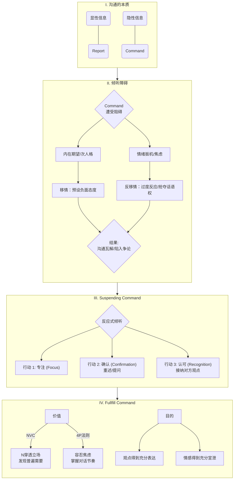

可以看出，关键词为 Command, 因此可以把这个模型简化为：

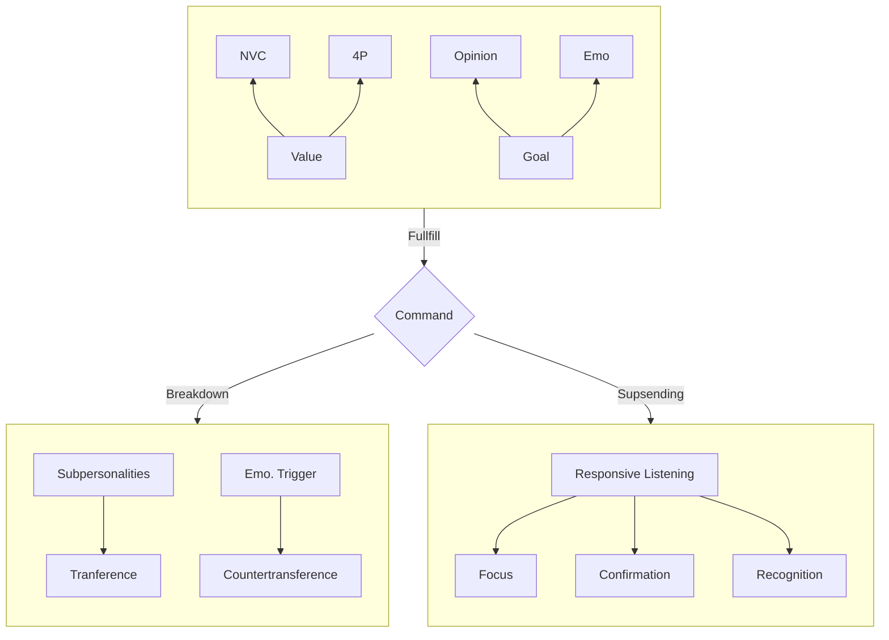


# 疑问


# card

# ref

## 1. 核心思想

作者想告诉我们两点：

1. 从神经科学/社会文化/经济发展的角度，人类偏爱做加法
2. 然而相对于一味的做加法，合理的增减显得更为重要

但不要把“减法”神圣化——减法本身也可能变成意识形态，真正成熟的周期框架应该是：

构建 → 增长 → 复杂化 → 削减 → 重构

或者说是：增加 → 复杂化 → 边际收益递减 → 维护成本上升 → 削减 → 重构

而减法不应该是目的，而是周期的一部分

## 2. 核心概念

### 满意度

- 见 note 第五章

### 自我效能

- 见 note 第五章

### 消极效价

- 见 note 第五章

### 场

- 见 note 第六章

## 3. 主题归档

类型：

关联领域：

## 4. 全书框架梳理

Part 1：人类为何偏爱加法？

- 生物层面：为了生存而获取食物的天性导致加法会让大脑分泌多巴胺
- 文化层面：教育鼓励创造
- 经济层面：追求 KPI/GDP

Part 2：如何做减法？

- 达到满意度之后开始做减法
- 改变系统和环境
  - 认知负荷理论告诉我们，不要一味地做加法
  - 与其说做减法，不如说是“如何合理增减”
- 为学日益 → 知识做加法；味道日损 → 智慧是抽象/压缩的

## 5. 写作动机

- 学术动机：他做了一系列实验，发现减法选项被系统性忽略。这在行为科学上具有发表价值
- 社会动机：现代社会确实面临：
  - 信息过载
  - 制度复杂化
  - 基建过度扩张
  - 工作流程膨胀
- 市场动机：“极简”“效率”“少即是多”是当代文化热点，出版环境鼓励这种主题

## 6. 观点提炼

见 1. 核心思想 

## 7. 批判性思考

### a) 作者背景

作者 Leidy Klotz 是美国工程师，长期在 University of Virginia 任教

 研究方向涉及：

- 结构工程
- 可持续设计
- 行为科学与工程决策

他不是纯心理学家，而是工程背景转向行为科学

工程师天然关注“系统优化”和“资源效率”，这会影响他的问题意识

他写的书是 Subtract

这本书基于他与行为科学家合作的实验研究，而不是纯随笔

### b) 政治倾向

### c) 价值预设

核心预设可以拆解为三层：

1. 认知层：人类在问题解决中系统性忽略减法选项
2. 效率层： 忽略减法会导致资源浪费与复杂度上升
3. 规范层（隐含）： 减少不必要的复杂性是有益的

# note

## 0. 前言：减法的力量

> 减是一个行动，少是一种最终状态
>
> 有时，实现少靠的是减法；有时，少意味着你什么都不做
>
> 这两种类型的少存在很大的差异
>
> 要实现少往往意味着做得更多或者想的更多
>

思考：做减法和断舍离，极简主义的区别是什么？

回答：

- 断舍离：是一种整理行为
- 极简主义：是一种价值观，强调生活方式的“少”
- 减法：是决策偏差修正工具，他关心的是“我们在解决问题时，为什么很少想到删除”

## Part 1: 为什么人类排斥做减法？

### 第一章：少是一种更好的选择

> 如果减法和加法一样有用，但减法又不如加法用的频繁，那么减法便具备未开发的潜力
>

思考：这算是做减法的价值预设吗？

回答：是的，它的逻辑链如下：

- 如果减法和加法同样有效
- 但是减法的使用频率小于加法
- 那么存在效率损失
- 问题在于，减法真的和加法一样有效吗？是否存在第三种可能性，即“替换/重组/抽象化”

> 选择加法，或许是因为删减东西就意味着要承认之前添加的属于沉没成本
>
> 人们很容易把减少当成一种损失
>

思考：

- 很契合《思考，快与慢》中提到的前景理论——相比于获得，人们更不愿意失去，更多内容见第五章
- 即使客观而言算是优化，但是人类的心理上容易把减少等同于主观损失

思考：P13——什么是心理可及性问题？

回答：心理可及性（availability）指的是：

越容易在脑中浮现的选项，越容易被选择

它和加法的关联在于，由于：

- 文化训练
- 多巴胺奖励
- 教育强调创造和增加

减法不常被想到，而加法方案更容易浮现，所以不进入心理选项集合，这是一种搜索空间偏差

### 第二章：人类做加法的本能

> 其他物品的获取与食物获取一样，都能激活大脑中的相同奖赏机制：中脑皮质通路
>
> 该通路始于我们大脑的外层——大脑皮层，将我们的思想和行动与目标联系起来
>
> 然后进入负责情感的中脑，并深入中脑腹侧被盖区，即多巴胺通路的起始位置
>
> 而获取物品的本能使我们倾向于要更多的东西
>

思考：这里作者从脑科学的角度，指出了人们更喜欢做加法的原因——如果获得更多的东西，就会预测奖励，就会激发多巴胺分泌

> 当进入睡眠之后，我们的脑细胞会收缩，此时，小胶质细胞便进入脑细胞收缩后留出的空间，清理神经元之间未使用的连接
>
> 这个自动清理的过程，神经科学家称为突触修剪
>
> 我们的大脑神经元之间也会建立突触连接，我们的突触连接使用的越多，连接就会变得越来越强
>
> 但是，就像茂盛的果树也需要修剪，以使珍贵的阳光和水不会浪费在不结果实的树枝上，在我们的大脑中，小胶质细胞就起到了修建的作用
>
> 它们清除掉一些不太有用的突触连接，使我们可以将更多的能量和空间分配给其他连接
>

思考：

- 《刻意练习》是为了加强特定神经元的突触连接，而《减法》告诉我们，睡眠可以修剪突触，从而让真正有用的突触进行连接
- 可是大脑怎么知道应该修剪哪些突触呢？如何解释有些事情睡一觉之后就想清楚了？我记得有人说过不要在晚上做决定，这背后的原因是什么？晚上已经达到认知负荷极限，不适合做决策？

ChatGPT 补充：

- 神经可塑性遵循“用进废退”原则：频繁激活的突触被强化（long-term potentiation），不常用的被削弱

- 为什么睡一觉想清楚？可能的机制包括：

  - 睡眠期间海马体进行记忆重放
  - 突触强度重新平衡

  - 前额叶恢复能量

### 第三章：加法带来文明，文明带来累积

思考：

1. 整个章节的逻辑链不够清晰
2. 如何理解“场”？
3. 场、文化和文明是如何导致人们偏爱做加法而非减法的？

ChatGPT 回答：

1. 生存竞争 → 技术进步 → 累积 → 制度奖励增长 → 文化强化增长 → 个体默认加法
2. “场”可以理解为：情境 + 规范 + 预期 + 奖励机制的集合
3. GDP 增长/教育鼓励创造/企业KPI奖励

> 在《冲突！》一书中，马库斯强调：“我们都有一种感觉，认为在所有时间、地点和情况下，每个自我都是相同的”
>
> 她说，这种感觉其实是错误的，因为，“当我们更仔细的观察生活时，我们会发现，实际上自己的内在有许多不同的自我”

思考：如何理解这句话？每个人都是各种人格通过不同权重叠加的结果？

> 问题不在于“我们应该增加还是减少”，而在于“我们该如何进行合理的增减”

思考：

- 这句话说的很对，总感觉这本书的标题有点把人带偏了，这句话应该才是全书的核心论点
- 相比于增加，作者想告诉我们，当增加到一定程度（应该就是后面说的达到满意度之后）就应该考虑删减了

### 第四章：时间、金钱与崇尚加法的现代社会

> 经济因素强化了生物和文化因素，最终，让人类一直在做加法
>
> 减法想的越多，我们越容易寻求到少，大脑中就会有更多的通路被激活，我们也就能想到更多的减法，如此循环往复

思考：

- 最小可行性产品、设计思维、减法思维和二八法则之间存在什么关系？
- 所谓最小可行性产品，应该对应设计思维中的原型 prototype，是能够满足客户最基本需求的产品
- 二八法则对应关系应该是：20% 的产品功能对应 80% 客户的需求？
- 但是它和减法思维的关系是什么呢？感觉减法思维是对那些 all for one 的产品说的
- 苹果的产品有一种极简的设计之美，也许用它作为 use case 更好理解一些？

## Part 2: 如何做减法？

### 第五章：思维反转：找到减法，分享减法

> 赫伯特西蒙发现，当做得足够好之后，我们就会停下，这是一种普遍存在的倾向
>
> 西蒙将这种倾向称为“满意度（satisficing）”，它是“满意”（satisfying）与“满足”（sufficing）合并而成的一个词语
>
> 西蒙发现，我们之所以能够达成满意度，是因为理论上可行的改进做起来非常困难，不值得努力，或者没有必要
>
> 在这种情况下，存在缺憾的满意度是最有意义的，是实现目标最快捷的途径
>
> 额外的努力可以在满意度达成之后实现“更少”，但如果我们不会做减法，额外的努力就会让我们在满意度达成之后变得“更多”

思考：忽然想到了“急流勇退”和这段描述相关吗？

回答：二者都涉及“边际效益递减”，但是层级不同：

- 满意度：搜索成本大于预期收益 → 停止
- 急流勇退：边际风险大于边际收益 → 退出

> 《怦然心动的人生整理魔法》作者近藤麻理惠坚持认为，如果一个物品不能让你快乐，那么，是时候把它从你的生活中消失了

思考：做减法的准则是丢弃让自己不快乐的物品

更正：她的标准是“spark joy”，这是一种主观效价标准，受情绪驱动；而 Klotz 讨论的是“决策盲区”

> “自我效能感”是指我们相信自己有能力找到动机，付诸行动并改变自己周围的环境
>
> 心理学家米哈里切克森米哈赖在他的代表作《发现心流》中指出，这种最佳心理体验产生于能力与挑战之间的碰撞
>
> 让一名高中足球运动员与小孩比赛，他会觉得没有任何挑战性；但如果让他去踢职业比赛，他会觉得完全遭到碾压，也根本不会有心流可言。发现心流，我们就要竭尽全力，但不要做无用功

思考：自我效能感、心流和刻意练习之间是否存在关系？

回答：

- 刻意练习 → 能力提升
- 能力提升 + 合适的挑战 → 心流
- 持续地成功体验 → 自我效能增强
- 而减法在三者中的作用是：剔除无效努力，让挑战精准匹配能力

> 心理学家库尔特勒温认为，心理效价是一个事件、物体或想法对人的内在吸引力（积极效价）或带来的厌恶感（消极效价）
>
> 1979 年，阿莫斯特沃斯基和丹尼尔卡尼曼发表了一篇论文，他们发现，赢得 100 美元的满足感比不上输掉 100 美元的失望，他们称之为“损失厌恶”，即对损失的反应强于对收益的反应
>
> 减少并不是一种损失，但为了避免误解，我们可以把减法换一个表述方式
>
> 使用揭开、清理和切割对减法进行替代，这几个动词更温和，不会激发消极效价，也不会激发损失厌恶

思考：

- 避免消极效价和损失厌恶，使用替代减法的动词
- 揭开、清理和切割的英语原文是什么？
  - remove
  - eliminate
  - streamline
  - prune （最常见）


### 第六章：减法清单：用减法改变系统

> “场”已经逐渐代表了在特定时间内能够影响人类行为的所有力量总和

思考：所以场代指的是做减法的环境？场的英语原文是什么？

回答：

- “场”大概率对应库尔特·勒温（Kurt Lewin）提出的场理论（field theory），他认为行为 = 人 × 环境
- 场不是“做减法的环境”，而是行为发生时所有力量的合力

> 如果涉及一个系统，忽略了减法会给我们带来更大的损失，因为忽略的可能才是更好的选择
>
> 勒温的见解是，如果你想做出行为上的改变，有两种方法，一种是好方法，一种是坏方法
>
> 好方法就是去减少制约的力量，而不是去增加驱动力量
>
> 坏方法就是做加法，无论是对好的行为增加激励还是对坏的行为加大惩罚，这种加法都会加剧系统内部的紧张程度

思考：也可以对应到政府关系中——经济全球化背景下，中国的大政府体系（做加法）和欧美的小政府体系（做减法）

> 遇到复杂系统，我们要尽量避免超过工作记忆的负荷
>
> 德内拉梅多斯一直在寻求系统的本质，并与人们分享自己的观点。她对复杂系统有深入的研究，能用简单的语言解释复杂的系统，她的著作为《系统之美：决策者的系统思考》

思考：

- 认知负荷理论，对应后面提到的概念“心智带宽”
- 《系统之美》这本书已经在我看到的其他书中提到了不止一次，另外还有《黑天鹅》与《心流》

> 本章的重点有四点：
>
> - 看清需要做减法的系统
> - 消除障碍是改变系统的好方法
> - 改变一个系统靠的不仅仅是加法运算规则
> - 制作对照自己的减法清单：
>   - 在改进系统前删减细节
>   - 先做减法
>   - 坚持让“少”看得见，实现质的飞跃
>   - 重复利用删除的内容（甜甜圈中间是空的，让受热更均匀的同时，也给予中间空缺部分相当大的自由度）

思考：

- 这可能是最有用的一段总结了，但是作者（或者译者）说的云里雾里，几点疑惑：
  - 对系统做减法的原则是什么？什么时候应该做加法？什么时候应该做减法？
  - 如何定义“障碍”？
  - 不靠加法运算那么靠什么呢？加减互补？
  - “细节”是如何定义的？
  - 怎么让“少”看得见？让谁看得见？

回答：

1. 当维护成本 > 新增收益时，应考虑减
2. 障碍：在系统中阻止目标达成的约束力量，例如：流程冗余/信息过载/激励冲突
3. 细节：对系统输出贡献极小，却消耗大量认知或维护资源的元素
4. 通过对比去感受“少”带来的变化

### 第八章：从信息到智慧：减法实现富足人生

> 老子曾说：“为学日益，为道日损”

思考：

- 对日常的学识积累、技能提升做加法
- 世俗欲望、主观偏见做减法
- 最终“损之又损，以至于无为”

> 拥有不受干扰的时间，就是完成工作与愚蠢之间的区别
>
> 为了处理大量消息，我们牺牲了自己用以充实并深化思想的能力
>
> 要区分数据与信息，最简单的标准就是——如果它对你没有用，那它肯定不是信息
>
> 在另一些情况下，问题在于信息是否值得存储
>
> 在提高效率方面，“少即是多”给我最大的启示就是少记笔记

思考：

- 对应 DIKW 模型
  - 区分 data 和 info
  - info 是否值得储存？

ChatGPT 把 DIKW 模型和老子的话结合在了一起：

- 知识获取靠扩展
- 智慧形成靠抽象与压缩

> 当然，有些东西我还是要记下来，比如，整理思路时需要记笔记
>
> 自从不打算记更多笔记之后，我就节省了很多时间来思考沉积在大脑中的一些想法
>
> 否则时间一长，这些想法又会被大脑不自觉地清除了
>
> 同时，这也为形成好的思想留出了更多的时间

思考：

- 作者的结论是：少做笔记多思考
- 作者对于笔记的定义和理解是不是和我不一样？
- 或者说，我现在记的不仅仅是“信息”而是“提炼”，是我对信息的主动思考
- 之前和 chatgpt 对话，它告诉我说，纸质笔记是思考的延伸，数字笔记是思考的沉淀
- 这里我的问题还不够清晰，需要和 AI 对话明确一下问题：或者这里作者的意思是，对于已经在生活中实践过的东西就没必要为了形式上的完美主义而进行记录？可是习惯都是逐渐养成的，有些事情偶然间做过，如果不去复盘记录，又如何察觉到它的影响呢？

## 后记：坚持做看得见的减法

作者的总结如下：

> - 思维反转：先考虑减法
> - 拓展：加减互补
> - 提炼：想的多一些，越容易发现使用者的追求
> - 坚持

- 思维反转：先问“能不能减？”
-  提炼：减少表层，强化结构
-  坚持：形成习惯


---
title: 简单的逻辑学
author: 「美」D.Q.McInerny
date: 2025-03-08
tags:
source:
---
# card
## 1. 核心内容

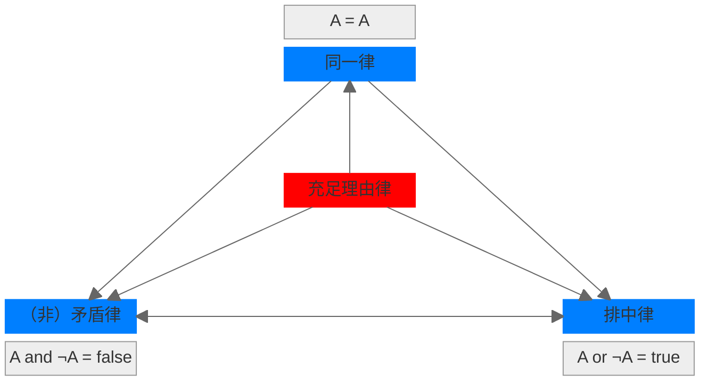

### a) 逻辑三律

亚里士多德在逻辑学中提出经典逻辑三律：

- 同一律
- （非）矛盾律
- 排中律

其中，同一律是推理的基础，而（非）矛盾律和排中律共同构建的二值体系，保证了逻辑推理的结果是真值（真或者假）。

### b) 充足理由律

莱布尼茨在 17 世纪提出了充足理由律，更多地是在强调逻辑推理的原因/理由/动机。基于此，莱布尼茨提出了理性的宇宙观：

真理分为两种：

- 基于（非）矛盾律的理性真理，具有必然性
- 基于充足理由律的事实真理，具有偶然性

### c) 四大定律之间的关系

- 同一律、矛盾律和排中律是传统逻辑的基石，它们确保推理的内部一致性、确定性和清晰性
- 充足理由律不是纯粹的逻辑定律，而是形而上学或认识论原则，它为逻辑推理提供外部解释和依据，使推理更完整

## 1. 核心思想

逻辑学是清晰思考与有效沟通的艺术，通过掌握基本原理和避免常见谬误，人们可以更准确地认识真相、理性决策。

## 2. 核心概念

### 逻辑学的四大定律

- 同一律 (Law of Identity)
  - 同一时间，同一方面，事物只能是其本身
- 不矛盾律 (Law of Non-contradiction)
  - 同一时间，同一方面，针对同一事物，如果出现两个完全相反的命题，则它们是互相矛盾的
- 排中律 (Law of Excluded Middle)
  - 同一时间，同一方面，两个互相否定的命题中，必有一个是真的，不存在中间状态
- 充足理由律 (Law of Sufficient Reason)
  - 事物是客观存在的，任何结论都不是凭空产生的，必须有充分的理由来支持。

### 如何定义术语

- 归类：把术语所代表的客观事物放入最相近的类别（class）之中
- 区分：确定其与同类其他事物的不同特性（attribute）
- 示例：正义的定义
  - 归类：社会美德
  - 区分：使成员各有所得
  - 结果：避免与宽容/慷慨混淆
- 反例：把椅子定义为坐具
  - 未区分摇椅和牙科椅的功能差异
  - 未归类到家具这一更精准的类别
  - 结果：沟通中误用概念

### 论证

论证由两个基本要素组成：

- 前提/因为
- 结论/所以

最有效的论证总是试着得出最简单明了的结论。

论证的形式：

- 演绎论证 (Deductive reasoning)：从一般到特殊
- 归纳论证 (Inductive reasoning)：从特殊到一般

## 3. 主题归档

类型：逻辑学

关联领域：批判性思维

## 4. 全书框架梳理

- 第 1 章：being logical 需要搭建的思维框架
  - 确认事实与观点
    - 事物与事件是客观存在的
    - 例句：事实需要我们主动去认识。

  - 语言与真相的关系
    - 避免模糊语言
    - 例句：语言要忠实表达客观事物本来面貌。

- 第 2-3 章：逻辑思维的基本原理及其表现形式
  - 四大定律

- 第 4-5 章：非逻辑思维的根源及其论述形式
  - 态度性根源：怀疑论
  - 26 中谬误  


## 5. 写作动机

问题意识：公众逻辑能力下降导致沟通低效、易被误导

现实意义：培养真相导向的思维习惯，应对信息爆炸时代的认知陷阱

## 6. 观点提炼

### a) Why

非逻辑思维扭曲真相，源于态度不端（如玩世不恭者预设立场）

### b) How

识别根源（如压制理性、滥用专家意见），坚守“论证服务于真相”

### c) What

真诚是基础但不充分，需结合常识与证据（示例：权威观点需验证其理由）

## 7. 批判性思考

### a) 作者背景

美」D.Q.McInerny 哲学教授（圣母大学），神学研究经历

### b) 政治倾向

### c) 价值预设

- 真相客观性（反对相对主义）

- 逻辑普适性（逻辑是“人类理性基本原理”）
- 道德关联：逻辑服务于善（第六章强调“推理目的必须正当”）


---
author: me
title: 精力管理
date:
---
# card

## 1\. 核心内容

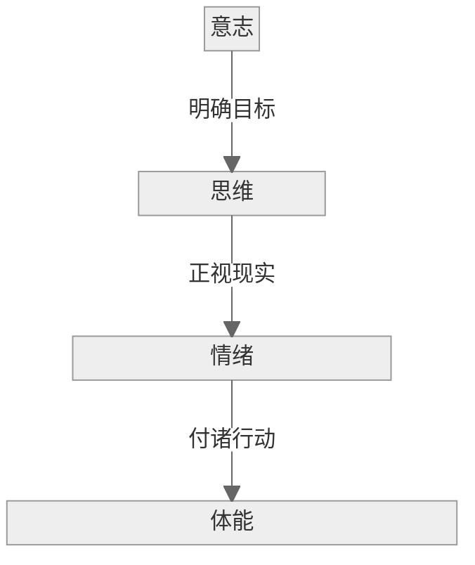

精力通过仪式习惯进行管理：

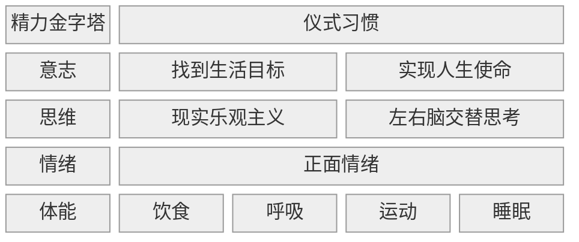

### a) What

精力需要从四个维度进行管理

### b) How

精力管理的方式是不断突破舒适区，形成**仪式习惯**

### c) Why

精力管理的结果/输出是**全情投入**地完成任务

# ref
## 1. 核心思想

通过科学管理体能、情感、思维、意志四种精力源，以周期性恢复代替线性消耗，实现高效能的全情投入。

## 2. 核心概念

### 精力金字塔

- 定义：精力由低到高分为体能、情感、思维、意志四层，底层是高层的基础
- 示例：体能不足时难以专注
- 反例：熬夜后强行用意志力工作

### 周期性恢复

- 定义：精力需遵循“消耗-恢复”的波动节奏，而非持续消耗
- 示例：工作90分钟休息20分钟
- 反例：连续加班导致效率暴跌

### 全情投入（Full Engagement）

- 定义：在目标驱动下，以最佳状态投入关键任务
- 示例：运动员比赛时高度专注
- 反例：开会时刷手机分心

### 仪式习惯

- 定义：通过固定行为模式减少决策损耗
- 示例：晨间冥想稳定情绪
- 反例：靠意志力临时克制拖延

## 3. 主题归档

类型：

- 自我管理
- 职场效能
- 应用心理学

关联领域：

- 时间管理
- 积极心理学
- 运动科学

## 4. 全书框架梳理

核心论点：管理精力而非时间

分论点1：体能是基础精力源

- 案例：睡眠不足降低决策力（P.45）  
- 金句：“身体是革命的本钱，但多数人从未真正充值”（P.33）  

分论点2：情感精力决定投入质量  

- 案例：积极社交提升抗压能力（P.82）  
- 金句：“负面情绪是精力的高利贷”（P.76）  

分论点3：价值观驱动意志精力  

- 案例：消防员为救人突破体能极限（P.155）
- 金句：“意义感是永不枯竭的燃料”（P.142）  

## 5. 写作动机

问题意识：时间管理失效（人们有24小时却总觉精力不足）

现实意义：信息时代注意力稀缺，需系统性精力分配方案

## 6. 观点提炼

### 6.1 What

体能训练

情绪调节

思维聚焦

价值观校准

### 6.2 How

四个维度管理

仪式化习惯

间歇恢复

### 6.3 Why

线性消耗精力导致倦怠，需匹配任务需求

## 7. 批判性思考

### a) 作者背景

企业培训师，非学术研究

### b) 预设职场价值观

“高效能=成功”


# note

## 精力金字塔

精力 (Energy) 就是做事情的能力，由四个维度组成效能金字塔

效能金字塔从底层到顶层分别为：

- 体能 (physical energy)：“身体是革命的本钱”
- 情感（emotional energy）：将威胁转化为挑战
- 思维 (mental energy)：专注和实现乐观主义
- 意志（spiritual energy）：有目标的人生才有意义

## 普通人管理精力的四大原则

### 原则一

全情投入需要调动四种独立且相关联的精力源：体能，情感，思维和意志

### 原则二

因为使用过度和使用不足都会削弱精力，必须不时更新精力以平衡消耗

### 原则三

为了提高能力，我们必须突破自己的惯常极限，模仿运动员进行系统训练

### 原则四

积极的精力仪式习惯，即细致具体的精力管理方法，是全情投入、保持高效表现的诀窍

## 仪式习惯

### 定义

仪式习惯指的是定义明确、具有高度计划性的行为

### 批判性思考

作者类比专业的体育运动员，认为自律和毅力是开始改变的起点，但是最终的目标是要形成习惯，因为“人 95% 的行为是以习惯为导向的”

类比联想：似乎和刻意练习中提到的心理表征一词类似

### 如何建立仪式习惯，从而管理精力？

#### 第一步：明确目标

人类不应该询问生活的意义，因为他自己才是需要做出回答的人。每个人都要接受生活的质询。他只能为自己的生活作答，并负起相应的责任。

找到人生的使命感，自上而下地支配精力：

- 从负面变为正面：正视缺陷
- 从外部转向内部：对某件事物本身的渴望，仅仅因为它能给我们带来满足感
- 从自我变成他人：普世美德

梳理人生中最重要的事情，并引导它们在人生和工作方面构建切合实际的愿景:

- 如果现在就是人生的尽头，你学到的最重要的3件事是什么？为什么它们如此重要？
- 想想你最敬重的一个人，描述他/她身上你最钦佩的3种品质
- 你能做到的最好的自己是什么样的
- 你希望你的墓志铭如何总结你

#### 第二步：正视现实

面对现实，看到真实的自己，而非我们希望或想象中的自己：

- 避免麻木不仁
- 不双标
- 为保护自尊，我们会自我欺骗，认定自己的观点就等同于事实
- 谨慎使用纯理性探讨，因为它在思维上认可却在情感上置之不理
- 为任何情况做最坏打算容易让人只透过狭隘的悲观镜头看待事情
- 面对真相保持开放的心态，接受自己的局限性

心理学家詹姆斯·希尔曼称，人们终究需要在自我认同和持续努力改进自己的有害方面之间找到平衡：

- 一方面从道德上意识到这一部分自我是种负累，不可忍受，一定要做出改变
- 另一方面认可并微笑着接受自己的不足，敢于正视它们，永远带着喜悦之心。既要努力改变又要学会放手，既要严格批判又要欣然接受

《平静祷文》是精力管理理想状态的完美入门指导：“上帝，请赐予我平静，接受我无法改变的；请给予我勇气，改变我能改变的；请赋予我智慧，分辨这两者的区别。”

我们耗费巨大的精力担忧无法控制的人和事，而更好的选择是，将精力集中在可以切实改变的事物上

#### 第三步：付诸行动

突破舒适区：用实际行动缩小“现实的我”与“理想的我”、 “目前的精力管理方式”与“为达目标所需要的精力管理方式”之间的差距

我们每一个人都是由自己一再重复的行为所铸造的

一次只培养一个仪式习惯

## 如何实现精力消耗与恢复的动态平衡？

### 常见的认知误区

思维和情感：精力可以无限被消耗

体能和精神：不需要投入过多精力即可实现高效产出

### 保持精力波动的平衡

人类最基本的需求是精力的消耗（压力）与恢复

要保持波动的平衡，我们要分别从精力金字塔的四个维度去实现

## 如何管理体能

### 影响因素

#### 1. 呼吸

Why

- 延长呼气时间有利于精力恢复
- 深度、平静、有节奏地呼吸会激发精力、敏锐和专注，也能带来放松、宁静和安宁

How

- 吸气：三次一组
- 呼气：六次一组

#### 2. 饮食

##### 早餐最重要

早晨起床时， 8～12个小时没有进食，即使你并不感到饥饿，血糖水平也在衰退，这时需要早餐进行补充

早餐不仅能提高血糖水平，还能强力推动机体新陈代谢

##### 摄入血糖指数低的食物

升糖指数用以测量糖分从食物进入血液的速度

缓慢释放的糖分能够提供更稳定的精力

低血糖指数的食物包括：

- 全麦食物
- 草莓、梨、苹果
- 蛋白质

##### 少食多餐

食物通常只能维持 4-8 小时的高效表现

为了拥有稳定的精力，一天内吃 5-6 餐低热量而高营养的食物是值得推荐的

两餐之间的零食热量应该控制在 100-150 卡路里，并选择低升糖指数的食物

- 坚果
- 葵花籽
- 水果
- 半条200卡的能量棒
  
##### 喝水

喝水或许是最常被人忽略的体能再生方式

口渴不会像饥饿一样散发出明显的信号，等我们感到口渴的时候，身体或许已经缺水很久了

一家研究机构称，每天至少饮用 1.8 公斤水对维持体能有诸多好处

##### 80/20 法则

如果你摄入的 80% 的食物都是健康而高效的，剩下的 20% 可以是你喜欢的任何食物，只要份量控制得当

#### 3. 睡眠

睡眠时长： 7-8 小时

早睡早起

避免晚上过长的工作/消耗精力

#### 4. 生理周期

工作周期：每 90-120 分钟为一个工作周期

小憩：每 4 小时休息 20-30 分钟

### 体能训练

How: 间歇性训练

- 一周 3-5 次
- 每次 20-30 分钟

What

- 有氧运动
  - 慢跑
  - 瑜伽
- 无氧运动
  - 健身
  - 力量训练

## 如何管理情感

### 目标：永远保持正面积极的情感

突破当前的情感极限

- 自信
- 自控
- 学会沟通
- 理解他人/共情

留出充足的恢复空间：参加任何带来享受、满足和安心的活动

- 与家人朋友定期聚会
- 参加体育活动
- 做爱

### 如何培养积极情感

学会倾听

学会独处

三明治批评法

- 首先给予积极评价
- 意见是讨论而非训斥
- 用鼓励的话结束反馈

## 如何管理思维

### 现实乐观主义

看清事物真相，却依然朝着目标积极努力

区分「悲观主义」：强调自我防备而非解决问题

### 让大脑得到充分休息

使用左右脑交替思考

- 左脑：逻辑/顺序/语言神经（线性思考）
- 右脑：直觉/灵感/视觉化/空间化（边缘型思考）

锻炼身体，让更多的血液和氧气输送到大脑

## 如何管理意志

### 何为意志

意志 ＝ 价值取向 + 超出个人利益的目标

意志决定了我们取用精力的动机

### 如何提升意志

具备以下品德：

- 激情
- 奉献
- 正直
- 诚实

在以下两方面之间做出平衡：

- 超越自身的目标
- 自我关心


---
title: ref-君主论
author: 马基雅维利
date: 2024-01-01
---
# ref
## 1. 核心思想

政治应基于现实而非道德理想，君主需以权力巩固与国家生存为首要目标，必要时可摒弃道德约束。

## 2. 核心概念

### 政治现实主义

- What: 以“有效真理”（verità effettuale）替代空想模型，聚焦权力运作的真实逻辑
- How: 道德中立——慷慨/吝啬、仁慈/残酷、守信/欺骗的取舍依情境而定
- Why: 人性本恶且趋利避害，道德理想在动荡政局中易致失败

### Lion-Fox Duality[^1]

- What: 君主必须是一头狐狸以识陷阱，又是一头狮子以惊豺狼

- How: 武力震慑（狮子）与欺诈伪装（狐狸）结合，掩饰权谋本质

- Why: 单一策略易被制衡（狮子落陷阱，狐狸惧豺狼）

[^1]: Lion-Fox Duality 是我类比波粒二象性提出的概念：面对不同的生存场景，我们要同时具备直面困难（狮子）的勇气和识破陷阱的智慧（狐狸）

### 命运（Fortuna）与能力（Virtù）

- Why：命运主宰半数行动，但可控部分需君主主动掌控
- How：顺应时势调整策略（如改革制度）、预判危机并储备军事力量
- What：

## 3. 主题归档

类型：政治哲学 / 现实主义政治理论

关联领域：国际关系现实主义、领导力心理学、专制政体研究

## 4. 全书框架梳理

全书一共 26 个章节，我把它们分为五部分：

| 板块   | 对应章节 |
| ------ | -------- |
| 政体篇 | 1-11     |
| 军事篇 | 12-14    |
| 品德篇 | 15-19    |
| 执政篇 | 20-23    |
| 动机篇 | 24-26    |

五大篇章之间的关系为：

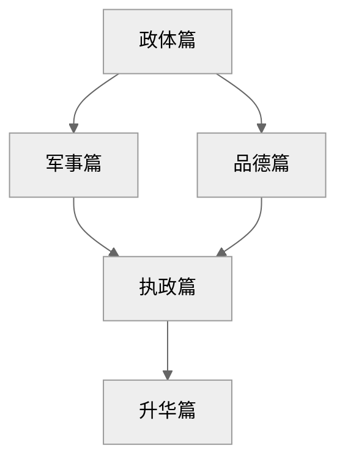

作者在政体篇提出君主统治的三种国家状态：

- 已有领土，不需扩张 → 世袭
- 已有领土，需要扩张 → 混合
- 没有领土，需要扩张 → 全新

在混合型政体中，作者重点阐述了如何征服他国领土；在全新型政体中，作者介绍了六种上位方式。作者认为，要实现领土的扩张或者上位，君主需要从军事和品德两个方面进行培养：

- 军事篇中作者介绍了四种军队类型，提出了构建国民军的重要性，并提出了君主要具备的军事素质
- 品德篇中作者按照破立防的顺序，首先否定了道德的善恶二元对立，提出道德相对主义，然后分别列举了三种现实道德，最后给出了如何防止道德反噬的解决方案

执政篇给出日常理政的一些建议，是君主军事和品德的微观体现：

- 对外如何分化强敌、提升声望
- 对内如何筛选大臣、巩固统治

最后，作者在动机篇提出写这本书的目的：把高度上升到民族统一，希望新君采纳他的建议。

## 5. 写作动机

问题意识：意大利城邦分裂遭外敌侵凌（如法国、西班牙），需强权君主统一

个人诉求：向美第奇家族自荐复职（献书朱利亚诺二世），以实践其理论

现实意义：

- 现代军事理论先驱：
  - 国民军原则 → 演化为主权国家义务兵役制（如法国大革命后的“全民皆兵”）；
  - 君主责任论 → 发展为文官控军原则（如美国宪法规定总统为三军统帅）；

## 6. 观点提炼

### a) Why

### b) How

### c) What

## 7. 批判性思考

### a) 作者背景

马基雅维利是意大利佛罗伦萨的政治家、外交家和政治思想家。马克思对他的评价是：

> 已经用人的眼光来观察国家了，它们都是从理性和经验中而不是从神学中引出国家的自然规律……权力都是作为法的基础。由此，政治的理论观念摆脱了道德，所剩下的是独立地研究政治的主张……马基雅维利是第一个使政治学独立，同伦理家彻底分家的人，有资产阶级政治学奠基人之称。

更多背景介绍见 note 部分

第 23 章（防谄媚）实际是为进谏铺路——暗示“我才是敢讲真话的顾问”，而 26 章引用但丁诗句更是将美第奇家族比作救世主，献媚技巧登峰造极。这种写作策略证明《君主论》既是技术手册，更是一份精心包装的政治求职信。

### c) 价值预设

- 人性本恶
- 结果正义论：国家利益高于个人利益

# note
## 马基雅维利生平

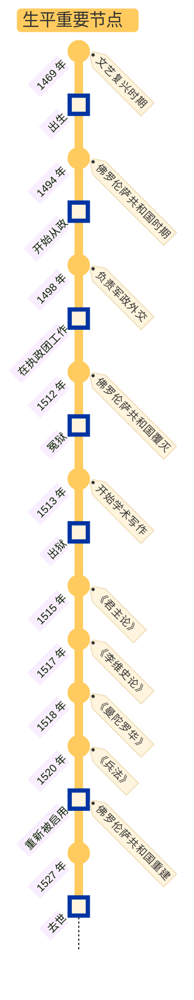

### a) 时代/家庭/仕途

大背景：成长于和平的文艺复兴全盛时期

家庭：祖辈是佛罗伦萨贵族

学识：拉丁文、意大利古典文学、史学、罗马共和制度

政治主张：

- 由于经历了佛罗伦萨共和国的覆灭，深感雇佣军是意大利一切灾难的来源，因此主张：
  - 建立自己的政治秩序必须以自己的武装作为后盾 → 建立国民军
  - 军队与法律是立国之本
- 由于任职外交官，可以深入了解各国领袖：
  - 深感弱国无外交，富国必须强兵
  - 认可博尔贾为了努力建立一个强大统一的国家而不择手段的行事风格

潘光典（译者）评价马基雅维利：

> 除了时代的局限性和固有的阶级性之外，马基雅维利的思想往往趋于极端，带着某种片面性、夸张性，受着他个人的主观经验束缚与强烈的政治激情影响。但是他的建设国民军的基本目的，是为了建立一个统一的国家，排除外国的干涉与侵略，维护独立。这些主张是符合新兴阶级和人民的利益的，因此在历史上具有进步意义。

### b) 著作

马基雅维利的本意是希望撰写一本小册子，论述君主国是什么，有什么种类，怎样获得，怎样维持，以及为什么会丧失，据此献给[朱利亚诺](https://zh.wikipedia.org/wiki/%E6%9C%B1%E5%88%A9%E4%BA%9A%E8%AF%BA%C2%B7%E5%BE%B7%C2%B7%E7%BE%8E%E7%AC%AC%E5%A5%87)。然而他的愿望最终石沉大海，在失望中他仍然撰写了《李维史论》。本书围绕有关意大利兴亡的国家政治、军事、历史和宗教等方面的问题展开论述。《君主论》是《李维史论》的一个分支：

- 《君主论》讨论的是由于意大利腐败，内忧外患混乱状态不得不采取的**君主政体制**
- 《李维史论》则阐述以古罗马共和国制度为楷模的**共和制**

而《兵法》阐述军事与政治的密切关系，强调建立国民军的必要性，批判了城堡化的保守策略。

戏剧《曼陀罗华》是对腐朽社会道德的讽刺，也反映了作者对道德伦理和教会的态度，算是戏剧版的《君主论》。

## 君主和人民的关系

从人民群众中来，到人民群众中去：

> - 深深地认识人民的性质的人应该是君主
>
> - 深深地认识君主的性质的人应属于人民

## 政体篇：君主国的种类与治理理念

作者在第一章先提出了国家的分类：

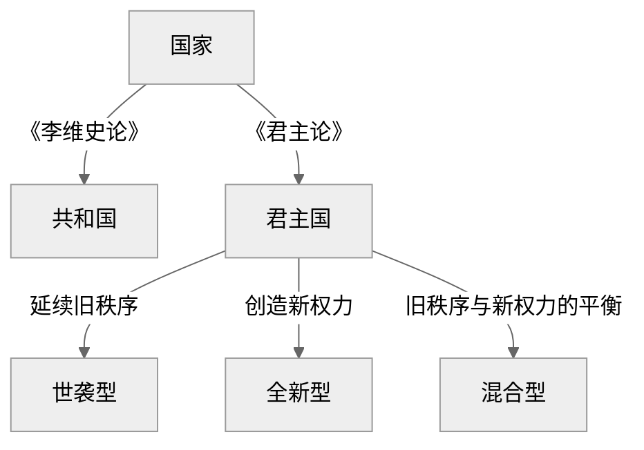

### a) 世袭型

对于世袭型，作者认为统治者要做到两点[^1]：

- 不触犯祖制
- 对于随机事件要做到随机应变

统治者的统治方式分为两种[^2]：

| 统治方式        | 示例                        | 征服难度 | 统治难度 |
| --------------- | --------------------------- | -------- | -------- |
| 君主 + 一群臣仆 | 土耳其皇帝 + 波斯国王大流士 | 难       | 易       |
| 君主 + 诸侯     | 法兰西国王                  | 易       | 难       |

[^1]: 对应第二章内容
[^2]: 对应第四章内容

### b) 混合型

所谓“混合型”君主国，指的是**原有世袭领土兼并新领土形成的国家**，本质是“部分新、部分旧”的复合体。统治混合型国家的困难在于，如何平衡旧盟友与新臣民的利益。

按照被征服领土的性质，作者提出的对策如下：

| 被征服地区           | 特点                                                         | 对策                                                         |
| -------------------- | ------------------------------------------------------------ | ------------------------------------------------------------ |
| 非完全异质的君主国   | 存在部分文化差异                                             | - 灭绝旧统治家族<br />- 保留原有法律和税收<br />- 建立低成本殖民地（而非驻军）[^3] |
| 完全异质的世袭君主国 | - 文化、制度完全割裂<br />- 民众长期习惯集权统治，反抗弱但同化难 | - 由于无法温和过渡，需彻底摧毁旧体系<br />- 君主亲自驻守<br />- 依赖少数代理人，分化地方贵族 |
| 自由城邦             | - 民众强烈认同自由价值，反抗意识顽固<br />- 旧贵族势力持续煽动复辟 | - 低成本：彻底毁灭其社会结构（如屠城、驱逐公民）<br />- 中成本：君主亲自驻军统治<br />- 高成本：保留自治 + 进贡 + 扶植傀儡政府（需持续镇压叛乱）[^4] |

此外，无论想要征服哪种国家，都要警惕外部势力介入统治管理

[^3]: 为什么殖民比驻军更能有效控制成本？作者认为，驻军意味着提高旧盟友的投入，而殖民意味着只需要得罪少数新势力的利益，见第三章内容
[^4]: 对应第五章内容

### c) 全新型

对于从平民上位成为君主的情况，作者从君主上位路径展开论述，介绍了六种途径：

| **对应章节** | **上位方式**               | **权力来源**  | **统治难点**               | **案例**      |
| :----------- | :------------------------- | :------------ | :------------------------- | :------------ |
| 第六章       | 自身能力                   | 军事/政治才能 | 维持创新成果               | 摩西、居鲁士  |
| 第七章       | - 他人武力<br />- 自主转型 | 命运 → 能力   | - 恩主反噬<br />- 旧部背叛 | 切萨雷·博吉亚 |
| 第八章       | 邪恶手段                   | 暴力/欺诈[^5] | - 民众仇恨<br />- 道德反噬 | 阿加托克勒斯  |
| 第九章       | 市民拥戴                   | 贵族/平民支持 | 派系制衡失效               | 罗马市民君主  |
| 第十一章     | 宗教制度                   | 神权合法性    | 世俗权力缺失               | 教宗国[^6]    |

[^5]: 损害行为要一次性干完，这样百姓可以少受一些损害；而恩惠要一点一点地赐予，以便让百姓能够更好地品尝恩惠的滋味
[^6]: 作者表面称赞宗教国稳定且幸福，实则讽刺现实，指出宗教国是意大利分裂的祸根，因为它阻挠强权君主实现统一

对于第九章，作者还提出了执政的三种情况：

- 贵族支持的君主权
- 平民支持的自主权
- 二者都不是的无政府状态

对于贵族，作者认为要分三种情况处理：

- 约束自己且不贪婪的贵族：给予荣誉并加以爱护
- 胆怯或天生缺乏勇气的贵族：利用他们，特别时那些能够提出有益意见的人，因为即使君主逆境也无需畏惧他们
- 为了野心故意不依靠的贵族：防范，把他们当作公开的敌人那样警惕，因为他们会在君主不利的时期，率先出来把君主灭掉

对于人民，作者认为：

- 若通过人民上位，则继续同人民保持友好关系，因为人民的需求时免于压迫
  - 要说服人民，更要让他们对说服的意见坚定不移，形成信仰
  - 当人民不再有信仰时，还要使用武力迫使人民就范
- 若通过贵族上位，则要想方设法争取人民，把人民置于自己的保护之下
- 如果脱离人民，从平民政制转向专制政制，君主的统治地位会处于危险状态

第十章是第六至九章的补充，回答了“若通过上述方式上位后遭遇外敌入侵（如法国进攻意大利），如何临时保权？”的问题——使用最低成本防御原则：

- 加固首都——首都象征着权力的合法性
- 绑定人民利益——民众和君主利益趋同
  - 让臣民感到有希望，相信霍乱不会长久下去
  - 让臣民对敌人的残酷感到恐惧
  - 控制过于莽撞的人民

## 军事篇

在作者看来，法律和军队是一个稳固政权的基础，而良好的军队一定会带来良好的法律。因此，军事是权力延续的终极保障[^7]。这一部分对应原文第十二至十四章[^8]：

| 军队类型 | 可靠程度 | 军队特点                       | 案例                   |
| -------- | -------- | ------------------------------ | ---------------------- |
| 外国援军 | 0        | 骁勇善战 + 团结一致 + 效忠外主 | 教宗国借西班牙军反噬   |
| 雇佣军   | 1        | 唯利是图 + 怯战叛变            | 意大利佣兵队长斯福尔扎 |
| 混合军   | 3        | 警惕雇佣兵反噬国民军           | 15 世纪威尼斯征服内陆  |
| 国民军   | 5        | 为国而战 + 团结一致 + 效忠君主 | 罗马共和国 + 瑞士民兵  |

[^7]: 联想到“枪杆子里出政权”，以及吴思提出的血酬定律：暴力最强者说了算

[^8]: 简而言之，雇佣军 = 慢性自杀；外国援军 = 加速自杀；只有国民军才是唯一解，同时作者还指出，正是城邦雇佣军制度导致意大利的分裂

### a) 与政体篇的逻辑关系

- 作者在第十章已经提出了被动防御/构筑城堡是缓兵之计，构建国民军 + 君主过硬的军事素养才是主动出击的根本

- 具化解释第六章：依靠自身能力上位需要的军事素养
- 揭露第七章：单纯依靠他人武力无法使统治持久
- 否定第八章：使用邪恶建立政权的君主，会忽略军队建设的重要性

### b) 如何构建国民军

- 兵源政治化：军队从**本国公民**（非流民）招募，使其战斗与家国利益关联
- 分权制衡防止叛乱：
  - 军官由君主直接任命（防军阀化）
  - 训练权/指挥权分离（如瑞士模式
- 成本平民化
  - 国民军平时务农，战时集结（低维持成本）；
  - 避免重税养雇佣军引发民怨

### c) 君主自身的军事素养要求

作者认为，作为君主，其军事能力一定要强：

> 和平时期比战争时期更需备战

终极目的是：

- 威慑贵族/反对派叛乱
- 预防外地入侵

**君主要具备怎样的用兵才能？**

- 用兵时，君主必须身临前敌，亲自挂帅
- 必须使用国民军，对于被委派的将领：
  - 能力不足 → 必须撤换
  - 能胜任 → 必须用法律加以约束，确保不越出指示范围

**君主要具备怎样的军事训练才能？**

| **维度**     | **要求**                                                    |
| :----------- | :---------------------------------------------------------- |
| **知识积累** | 研究地形（山地/沼泽战法）、历史战役（如汉尼拔越阿尔卑斯山） |
| **实践训练** | 狩猎模拟战争（锻炼体能、地形分析力）                        |
| **制度设计** | 建立军事档案库（地图、军备记录）、定期巡视边境              |

## 品德篇

关于品德篇的内部逻辑链关系：

1. 破：第十五章是总纲领，提出“道德相对主义”概念，否定传统道德标准
2. 立：第十六至十八章分别批判三大传统美德（慷慨/仁慈/守信），提出替代性“现实品德”
3. 防：第十九章转向正面建构“敬畏统治术”，规避道德反噬风险

### a) 道德相对主义

理想状态下，道德存在明显的善恶二元对立。然而在现实中，作者认为君主则要遵循“道德相对主义[^9]”——没有绝对的善恶之分，一切根据情景必要切换：

> - 避免那些使自己亡国的恶行
> - 保留那些不会使自己亡国的恶行
> - 如果没有恶行就会难以拯救自己的国家，君主也不必对恶行的责备感到不安

[^9]: 即主张以结果有效性为道德判断标准，例如政权稳固等

### b) 现实道德

#### i.) 慷慨 vs. 吝啬

- 何时慷慨，何时吝啬？
  - 对自己的财富要吝啬，否则：慷慨 → 逐渐奢侈 → 为保住慷慨名声而增税敛财 → 民众仇恨 → 灭亡
  - 对他人/掠夺的财富慷慨
- 终极目的：保证慷慨的受益者是大多数，而吝啬的受害者是少数

#### ii.) 仁慈 vs. 残酷

君主要警惕过度仁慈，被人畏惧好过受人爱戴，只要避免被人憎恨即可[^10]：

> 人民爱戴君主，是基于他们自己的意志，而感到畏惧则是基于君主的意志，因此以为明智的君主应当立足在自己的意志之上，而不是他人的意志之上。他只是必须努力避免招惹仇恨。

[^10]: 需要指出的是，这里作者的预置假设是人性本恶

#### iii.) 守信 vs. 欺诈

作者认为世间的斗争分为两种：

- 以人性为出发点的法律

- 以兽性为出发点的武力

关于兽性，作者结合动物进行说明：

> 君主必须是人也是兽——狮子御敌，狐狸识陷阱

因此，作者提出了狐狸法则：

- 何时守信——当约定符合自身利益时
- 何时欺诈——当约定损害生存时
- 如何平衡——假装歌颂所有美德以获得民众支持

### c) 防止道德反噬

- 不要让民众憎恨：不侵财产、妻女
- 不要让贵族蔑视：展现军事和执政能力
- 结论：**把担待责任的事情交给他人处理，把布施恩德的事情掌管在自己手中**

## 执政篇

作者层层递进，告诉君主如何平衡短期安全与长期稳定，最终实现权力闭环的过程：

| **章节** | **核心策略**                | **具体手段**                                                 | **关联前文**                    |
| :------- | :-------------------------- | :----------------------------------------------------------- | :------------------------------ |
| 20章     | 解除武装<br />分权陷阱      | - 永远不要解除旧部的武装[^11]<br />- 为了防止叛乱，要解除新领土的归降武装，并把武装力量转移到绝对信任的旧部<br />- 在威胁本国领土的核心区扶持分裂势力，以便制衡对手<br />- 在开辟新领土的核心区扶持武装势力<br />- 构建堡垒的标准：害怕人民 > 外国势力 | 呼应第5章（自由城邦需解除武装） |
| 21章     | 声望塑造<br />国际博弈      | - 公开支持弱者（低成本博声望）<br />- 避免中立[^12]（必得罪一方）<br />- 集中力量打击一个强敌[^13] | 升华第16章（定向慷慨）          |
| 22章     | 核心官员筛选术              | - 用敢直谏的能臣（非谄媚者）<br />- 以利益绑定非道德绑定<br />- 大臣过错君主担责（保权威） | 暗合第19章（避贵族蔑视）        |
| 23章     | 防御谄媚[^15]<br />信息控制 | - 仅特殊人群享有谏言权力[^14]<br />- 自主决策并坚持<br />- 建立情报网交叉验证信息 | 完善第18章（狐狸的伪装术）      |

[^11]:武装自己的属民，可以让属民更加忠诚；没有武装的属民也会体谅君主，因为他们会认为武装力量付出更多，理应得到更多利益；一旦解除旧部，就会得罪他们，同时代表不再信任他们；最后，君主会开始依赖雇佣军

[^12]:他如果不是你的朋友，就要求你采取中立；如果他是你的朋友，则要求你拿起武器公开表态

[^13]:但是不要为了进攻他国而和一个比自己强大的国家结盟，即使获胜，你也会成为强国的俘虏
[^14]: 要想防止阿谀奉承，必须让人民知道对你讲真话不会得罪你；而当所有人讲真话时，对君主的尊敬就会自然减少；因此君主应该采用第三种方式，即选拔有识之士，单独让他们享有对他讲真话的自由权，但是只询问，最终需要自主决定并持续坚持下去。因此，君主必须是极好的倾听者，且只应该在他愿意征求意见时进行谏言，而对于不征询意见的任何事情，他应该使每个人都没有提意见的勇气。同时，如果不把真话告诉他，他要保持震怒。
[^15]:总之一句话，良好的谏言来自于君主的贤明，而不是反过来，忠言使得君主变得贤明

**如何做一名明君？（微观）**

- 对于百姓：

  - 奖励各个行业中的杰出人士
  - 激励百姓各司其职
  - 适时举行节日和聚会
  - 重视社会集团，如商会、部族等

- 对于大臣：

  - > 人民对于一位君主及其能力的第一个印象，就是通过对他左右的人民的观察得来的

  - 能够识别大臣的能力（作者把大臣分为三类）：

    - 靠自己脑子理解
    - 缺乏自主判断，但是可以辨别别人所说的事情
    - 自己不理解，也无法理解别人的说明


## 动机篇

最后，作者上升到解放民族的高度，用最后三章论述了他写书的目的：

- 破：第二十四章分析意大利旧统治者的失败
- 立：第二十五章强调新君主突破命运的可能性
- 呼吁：第二十六章直接呼吁美第奇家族行动

| **章节** | **核心论点**       | **内容精要**                                                 | 说服策略 | 潜台词                       | **现实指向**               |
| :------- | :----------------- | :----------------------------------------------------------- | -------- | ---------------------------- | :------------------------- |
| 24章     | 意大利旧君主的败因 | - 忽视军事（依赖雇佣军）<br />- 民众憎恨（横征暴敛）<br />- 贵族蔑视（无能妥协） | 贬低对手 | “旧君主无能，唯您可救意大利” | 直指萨沃纳罗拉等失败统治者 |
| 25章     | 命运与能力的辩证   | - 命运如洪水，但可筑堤坝（预判危机）<br />- 新君主需“暴力改革”突破困局 | 降低预期 | “命运可控，失败非您之过”     | 呼应第6章（能力型君主）    |
| 26章     | 解放意大利的呼吁书 | - 揭露外敌残暴（法国、西班牙）<br />- 论证国民军可行性 <br />- 将美第奇比作摩西 | 神圣绑定 | “您将是摩西式的民族救星”     | 献书洛伦佐·德·美第奇       |


---
author:
  - 「美」Anders Ericson
  - 「美」Robert Pool
title: ref-刻意练习
date: 2024-12-31
tags:
source:
---
# card
## 1\. 核心内容

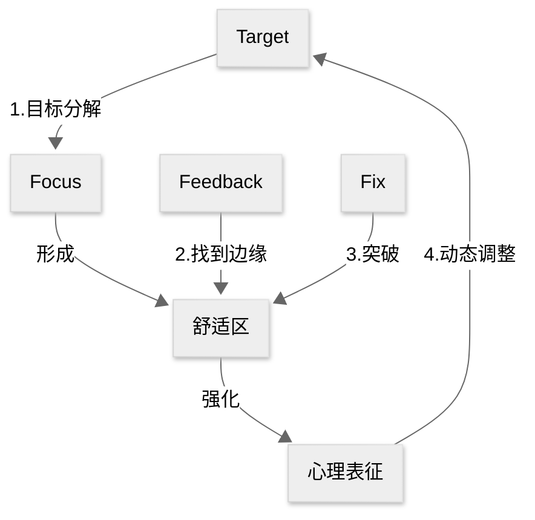

### a) Why

即使缺少天赋，使用**刻意练习**（deliberate practice）也能让我们成为某个领域的杰出人物

### b) How

1.  设定目标：成为某个领域的**杰出人物**/达到某个领域的**领域标准**
2.  让杰出人物作为导师/根据领域标准制定训练计划
    1.  训练者要认清自己当前的水平/定位
    2.  通过**有效反馈**寻找**舒适区边缘**
    3.  通过**反复修正**突破舒适区，不断强化**心理表征**（mental representation）
3.  根据心理表征对目标进行**动态调整**

# ref
## 1. 核心思想

通过高度结构化、目标明确的刻意练习，任何人皆可突破天赋限制，重塑大脑与身体能力，成为特定领域的专家。

## 2. 核心概念

### 刻意练习（deliberate practice）

- 定义：在舒适区外进行目标分解、即时反馈、反复修正的专业化训练
- 示例：小提琴手针对薄弱乐章逐小节纠正音准
- 反例：每天重复弹奏已熟练的曲目

### 心理表征（mental representation）

我查阅了 mental representation 的原始解释，个人感觉这个词放在刻意练习中并不合适，于是参考[这里](https://www.bilibili.com/video/BV1qM4m197z2/?spm_id_from=333.337.search-card.all.click&vd_source=bfb2e50dad8e670124c382656b85473e)使用「形成习惯」一词代替。

- 定义：大脑中形成的专业领域信息的高效组织模式
- 示例：棋手瞬间识别棋局优劣的直觉判断
- 反例：新手仅能看到分散的棋子位置

### 有效反馈

- 定义：由导师或数据系统提供的精准改进建议
- 示例：运动员通过录像分析动作角度误差
- 反例：自学写作却无人指出逻辑漏洞

### 舒适区边缘

- 定义：介于当前能力与潜能挑战之间的训练强度
- 示例：程序员尝试解决超出当前水平的算法题
- 反例：只做简单练习题或直接挑战无法理解的难题

## 3. 主题归档

类型：

- 认知心理学
- 技能习得方法论

关联领域：

- 教育理论
- 神经可塑性研究
- 人才培育策略

## 4. 全书框架梳理

核心论点：使用刻意练习可以发挥人类潜能

分论点1：没有天赋的普通人依然可以成为某个领域的专家

- 案例：莫扎特和帕格尼尼在成功之前并没有人说他们天赋异禀

分论点2：如何使用刻意练习

- 目标分解：音乐练习的段落切割
- 及时反馈：运动员生物力学分析
- 跳出舒适区：医学诊断难度递增训练

分论点3：从生物学的角度论述刻意练习对大脑的改善

- 案例1：伦敦出租车司机的海马体增大
- 案例2：盲人阅读者的视觉皮层重组

分论点4：如何在工作中使用刻意练习

- 案例1：外科医生的模拟手术训练
- 案例2：教师教案的迭代优化机制

分论点5：如何在生活中使用刻意练习

- 案例1：儿童兴趣引导的三阶段模型
- 案例2：成人技能突破的时间管理方案

## 5. 写作动机

问题意识：

- 揭穿“天赋决定论”对个人发展的压制
- 解决传统重复练习的低效困境

现实意义：

- 为教育体系提供科学训练框架
- 给职场人提供可迁移的进阶方法论
- 破除年龄限制的潜能开发指南

## 6. 观点提炼

### a) Why

人类潜能可突破生理/年龄限制，专家能力可被科学构建

### b) How

1. 创建领域标准
2. 寻找顶级导师
3. 建立反馈系统
4. 突破舒适区

### c) What/Who

在各领域培育出远超常人的专业表现者

## 7. 批判性思考

### a) 作者背景

- 心理学家安德斯·艾利克森（Anders Ericsson），佛罗里达州立大学教授，专攻专家绩效研究40年

### b) 政治倾向

- 无

### c) 价值预设

- 坚信“可习得性”优于“先天决定论”
- 主张训练质量＞训练时长
- 否定1万小时定律的机械解读

# note

## 有目的的练习

所谓有目的的练习是与天真的练习区分开来的：
>有目的的练习具有几个特征，使得它与我们所说的“天真的练习”区分开来。所谓“天真的练习”，基本上只是反复地做某件事情，并指望只靠那种反复，就能提高表现和水平。

 有目的的练习具有以下特点：

- 定义明确的特定目标
- 保持专注
- 有反馈
- 走出舒适区

>因此，我们在这里简单地总结有目的的练习：走出你的舒适区，但要以专注的方式制订明确的目标，为达到那些目标制订一个计划，并且想出监测你的进步的方法。哦，还要想办法保持你的动机。

## 心理表征

>心理表征是一种与我们大脑正在思考的某个物体、某个观点、某些信息或者其他任何事物相对应的心理结构，或具体或抽象。一个简单的例子是视觉形象。

我的理解为，人们潜意识/下意识会做的事情，或者是与自我认知发生关联的事情，而这种心理表征会随着刻意练习的增加而变得丰富。

>这些表征是信息预先存在的模式（比如事实、图片、规则、关系，等等），这些模式保存在长时记忆之中，可以用于有效且快速地顺应某些类型的局面。对于所有的心理表征，有一点是相同的：尽管短时记忆存在局限，但它们使得人们可以迅速地处理大量信息。事实上，人们可能把心理表征定义为一个概念式的结构，设计用于回避短时记忆施加在心理加工上的一般局限。

作者认为，杰出人物之所以能够成为杰出人物，是他们具有强大的心理表征：

>将杰出人物和我们其他人区分开来的主要因素是：他们经过年复一年的练习，已经改变了大脑中的神经回路，以创建高度专业化的心理表征，这些心理表征反过来使得令人难以置信的记忆、规律的识别、问题的解决等成为可能，也使得他们能够培养和发展各种高级的能力，以便在特定的专业领域中表现卓越。

心理表征的好处：

- 预测未来
- 寻找规律
- 无意识决策中的最优解
- 有助于制定计划
- 从「知识陈述」转变为「知识转换」

>心理表征的一个重要好处在于，可以帮助我们处理信息：理解和解读它，把它保存在记忆之中，组织它、分析它，并用它来决策

## 刻意练习

>简单地讲，我们说刻意练习，因为它与其他类型的有目的的练习在两个重要的方面上存在着差别。
>
>首先，它需要一个已经得到合理发展的行业或领域，也就是说，在那一行业或领域之中，最杰出的从业者已达到一定程度的表现水平，使他们与其他刚刚进入该行业或领域的人们明显地区分开来
>
>其次，刻意练习需要一位能够布置练习作业的导师，以帮助学生提高他的水平。导师必须已经达到一定的水平，并且有一些可以传授给别人的有益的练习方法。
>
>有了这个定义，我们可以在有目的的练习（其中，人们想尽一切办法来推动自身的提高）与既有目的、又获得指导的练习之间总结出明显的区别。特别是在刻意练习中，受训者了解表现最杰出者的成就，并且受到后者的指导，同时，他们还理解，这些表现最杰出者在哪些方面表现卓越。刻意练习也是一种有目的的练习，而且知道该朝什么方向发展，以及怎样去达到目标

有目的的练习更强调个人的努力，而刻意练习强调的是在杰出人物的指导之下进行的有目的的训练，具有以下特点：

- 该领域存在杰出人物作为导师
- 需要人们跳出舒适区，不断尝试那些刚好超出当前能力范围的事物
- 导师要根据学员的目标设定详细的计划
- 学员要根据导师的计划主动练习，及时反馈
- 心理表征是产生反馈的手段

## 如何寻找杰出人物？

>如果你试图从这些行业或领域中辨别表现最杰出的人，要牢牢记住一件事：主观的判断本来就容易受到各种偏见的影响。“理想的情况是找到客观的、可复制的测量指标，以便前后一致地从普通从业者之中挑选出最优异的从业者。如果这一理想的状况不可能实现，那么尽可能做到接近理想。
>
>找到主观上你认为的杰出人物，不以客观标准来判断。
>
>一旦你已经辨认出杰出人物，那么，辨别出是什么使得这个人和其他人表现不同，那些差别就可以解释他的卓越成就。

关于一万小时法则，作者认为，尽管具体的数字不一定是一万小时，但是要做到杰出，任何领域都需要花很多时间去训练：

>在任何一个有着悠久历史的行业或领域，要想成就一番事业，致力于变成业内的杰出人物，需要付出许多年艰苦卓绝的努力。也许并不需要恰好1万小时的练习，但要花很长时间练习。

## 刻意练习在工作中的应用

首先要认识到三种错误思想：

- 人的能力收到基因限制
- 只要做某件事情的时间足够长，就一定会更擅长
- 只要努力就会有提高

>刻意练习的心态提供了截然不同的观察视角：任何人都可以进步，但需要正确的方法。如果你没有进步，并不是因为你缺少天赋，而是因为你没有用正确的方法练习。一旦你理解了这一点，进步就只取决于你想出什么是“正确的方式”了。

在工作中使用刻意练习的方法是「边干边学」（learning by doing）：

>阿特着手制订一些方法，使正常的商业活动可以转变成为有目的的练习或者刻意练习的机会。
>
>“边干边学”方法的一个好处是，它使人们熟悉练习的习惯，并思考如何练习。一旦他们理解了日常练习的重要性，并意识到可以用练习来实现多大的进步，那么，他们会找机会将其他的日常商业活动转变成练习活动。

如何找到一种符合刻意练习原则的方法：

>对于商业世界中任何一个着眼于寻找有效改进方法的人，我的基本建议是找寻一种与刻意练习原则相一致的方法，问自己以下这些问题：这种方法，是不是逼着人们走出舒适区，迫使人们尝试做一些对他们来说并不容易的事情？它有没有提供关于绩效和表现的即时反馈，以及关于可以做些什么事情来提高绩效和表现的反馈？那些制订了这种方法的人，有没有辨别出他们所处的特定行业或领域之中的最杰出人物？有没有确定是什么因素将杰出人物与其他人区分开来？训练是不是被设计用来提高行业或领域内的杰出人物所拥有的那些特定技能？如果对所有问题的回答全都是肯定的，尽管也许不能保证那种方法有效，至少可以肯定，它是有效方法的可能性大得多。

- 跳出舒适圈，做一些不容易的事情
- 有反馈
- 有无杰出人物
- 是否明确目前与杰出人物的差距在哪
- 是否明确要提高的内容与杰出人物一致

## 知识与技能的区别

>传统的方法也一直是先找出关于正确方法的信息，然后很大程度上让学生去运用那些知识。刻意练习则完全相反，它只聚焦于绩效和表现，以及怎样提高绩效和表现。
>
>当你观察人们在职业领域和商业世界中如何接受训练时，会发现一种趋势：不重视技能，过于重视知识。主要的原因是传统和方便：向一大群人介绍知识，比起创造条件让人们可以通过练习来提升技能，要容易得多。
>
>一般来讲，专业学院着重关注知识而不是技能，因为教学生知识，然后为检验学生掌握知识的情况而设计一些测验，要比教学生技能容易得多。此外，人们一般认为，如果掌握了知识，也就能相对容易地熟练掌握技能。结果，当大学生进入职场时，通常发现自己需要大量的时间来提升工作中需要的技能。另外，许多专业领域并不会比医学专业更好地帮助从业人员磨砺他们的技能，大多数情况下，甚至在这方面比医学专业做得更差。在这些行业和领域之中，人们同样以为，只要简单地积累更多的经验，就能提高从业者的技能水平。
>
>正如在许多情况下，只要你已经想出了怎样来正确地提问，就已经知道了一半的正确答案。在专业的或商业的背景中涉及提高绩效和表现时，正确的问题是“我们怎样改进相关的技能”，而不是“我们怎样传授相关的知识”。

知识≠技能，实际上技能的培训比知识更难，而我们往往认为技能比知识难。

## 在生活中使用刻意练习

1. 找一位导师
2. 制定练习计划
    1. 学员要主动练习
    2. 每次训练时长不超过一小时
3. 导师不仅要指导学员练习，还要帮助学员建立心理表征，其中包括
    1. 应该注意哪些特定的方面
    2. 犯过哪些错误
    3. 怎样识别卓越的表现
4. 如何对待瓶颈期：
    1. 搞清楚到底是什么让你停滞不前。你犯了些什么错？什么时候犯的？逼着自己走出舒适区，看一看是什么拦住了你前进的路
    2. 设计一种练习方法，专门来改进那个特定的弱点。一旦你已经弄懂了问题是什么，你也许能够自己纠正，或者，可能得向一位经验丰富的教练或导师寻求建议。不论是哪种方法，在练习的时候要重点关注发生了什么
    3. 如果依然没有进步，那就需要再试试其他方法/更换导师

## 使用 3F 创建有效的心理特征

>为了在没有导师的时候有效地练习某种技能，牢牢记住以下三个F，将是有帮助的。这三个F，其实是以字母F开头三个单词，即：专注（focus）、反馈（feedback）以及纠正（fix it）。将技能分解成一些组成部分，以便反复地练习，并且有效地分析、确定你的不足之处，然后想出各种办法来解决它们。
>
>我们只有努力去复制杰出人物的成就，失败了就停下来思考为什么会失败，然后再去复制，一旦失败了，再次停下来思考原因，如此一而再再而三地尝试，才能创建有效的心理表征。成功的心理表征与人们的行为而不是思想紧密相连，这是一种拓展的实践，着眼于复制原始的作品，这种复制行为可以创建我们寻求的心理表征

## 如何坚持练习

两个误解：

1. 几乎没有科学证据证明，这世间存在一种可在任何情形中运用的一般的“意志力

2. 意志力和天生才华，都是人们在事实发生了之后再赋予某个人的优点

保持动机的两个方法：

- 弱化停下脚步的理由
  - 每天留出独立的一小时进行训练
  - 保证充足的睡眠和健康
- 强化继续前行的理由
  - 内部动机
    - 相信自己可以成功
    - 当练习有一定成果后，会反馈给我们作为继续坚持下去的动力
  - 外部动机
    - 社会动机：他人的认可与崇拜
    - 加入具有相同追求的团体/组织，与他们分享你的秘诀/成绩/遇到的困难，互相信任支持
    - 把对同一件事情感兴趣的所有人聚集起来/吸引他们加入一个团体，把团体的共同目标和情谊作为你自己目标的额外动机
  - 细化目标，将其分解成一系列可控的目标，每达到一个目标后，就给自己一个奖励

>对于那些长期保持有目的训练或刻意练习的人们，有一件事情与之相似。他们通常培养了各种习惯，帮助自己继续前行。我觉得，所有希望提高在某一行业或领域中的技能水平的人，应当每天花1个小时或更多的时间，专心练习那些需要全神贯注投入才能做好的事情。这是一条经验法则。
>
>保持这种推行此类体制运行下去的动机，包括两个组成部分：继续前行的理由和停下脚步的理由。你不再做自己当初想做的事情，是因为停下脚步的理由最终战胜了继续前行的理由。因此，你要保持动机，要么强化继续前行的理由，要么弱化停下脚步的理由


# card

结合《思考，快与慢》中的系统 1 和系统 2, 可以得出以下流程图：

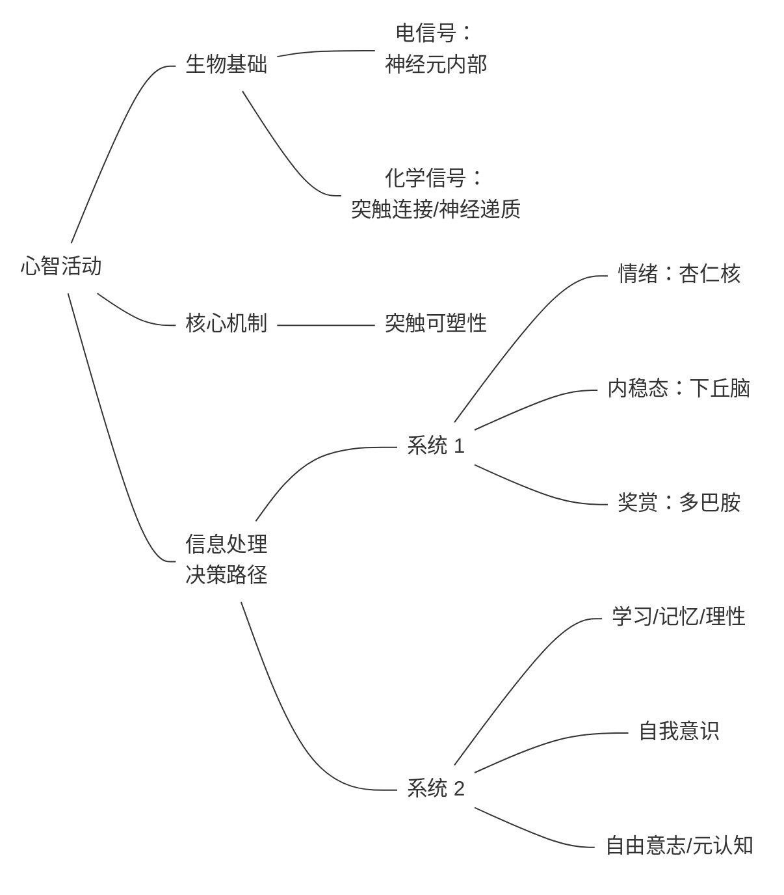


# note
## 1. 核心概念

### 心智

定义：一切大脑活动的表现

物理载体：大脑中的神经元及其连接

### 标记线（labeled line）

> 只有极少数生死攸关的、基于动物本能的、不太需要频繁调试和改动的心智活动，是通过脑功能和神经细胞一一对应的方式来工作的，这种工作方式也被称为标记线

### 群体编码（population coding）

> 除了极少数生死攸关的、基于动物本能的心智活动，较为复杂的心智活动更可能是通过某种网络化的方式来开展工作的，这种工作方式也被称为群体编码

### 神经元（neutron）

组成：细胞核 + 轴突 + 树突

信号在神经元内部的传递：刺激信号 → 动作电位（action potential） → Na/K 离子平衡 → 电信号单项沿轴突传递

> 神经信号的传递并不是像电流那样沿着轴突简单的流过去，而是靠钠离子垂直穿过细胞膜，触发一连串局部的电压变化。每一个局部电压变化都会引发下一个区域的钠离子通道打开，钠离子再次流入，形成新的动作电位。就这样，动作电位像骨牌一样依次产生，沿着轴突方向层层推进，最终完成一场高效而有序的神经i信号传导过程

信号在神经元之间的传递：突触 → 神经递质→ 下一个细胞树突

### 神经递质（neurotransmitter）

是神经元之间信号传递的本质，属于化学信号，分为四步：

1. 合成：通过多种酶
2. 装载：囊泡
3. 释放：囊泡
4. 清除：通过降解酶/轴突末端重新吸收

常见的神经递质有：

- 乙酰胆碱
- 去甲肾上腺素
- 多巴胺
- 血清素
- 谷氨酸
- γ-氨基丁酸
- 甘氨酸
- 一氧化氮

### 视觉

> 人与其说是在观察外部世界，不如说是在用自身固有的思路乃至偏见往外部世界上套。在视觉信息采集的第一步，我们九已经看到了”先天认知形式“的威力和束缚

> 与其说人眼在完整采集各个波段的光信号，倒不如说是人眼预设了三把尺子（红绿蓝），用且只用这三把尺子去丈量世界

### 学习

定义：脑的输入—输出模式被环境和经验改变的过程

类别：

1. 改变对某个单一输入的输出强度，即习惯化和敏感化
2. 在原本无关的输入和输出之间建立联系，从而建立新的输入—输出模式，即条件化

相关性和因果性：

- 为了更好地生存繁衍，动物真正需要掌握的是事件的因果性
- 在进化史上，脑只能退而求其次，用相关性来表征因果性，以快速做出决策
- 动物会天然地利用因果性这把尺子丈量世界，把所有总是先后发生的事情解读为具有因果关系，并据此对未来行动及其后果做出预测

学习的微观本质：增强/减弱输入和输出之间的突出连接

> 当输入和输出之间的突出连接网络被同时到达的奖惩信号所增强或减弱，使得原本中性的输入也带上了价值判断，学习就会发生

记忆：在突触之间产生和记录，分为两种形式：

- 短期记忆：体现为突触信号传递效率的变化
- 长期记忆：突触结构性的变化，涉及蛋白质的形成，存储于大脑皮层的不同区域

理性和经验的形成：相关性 → 因果性 → 指导原则

### 多巴胺

本质：奖赏预期差

> 多巴胺信号和奖赏有关，但它代表的不是奖赏本身，而是对奖赏的语气，是将来进行时的奖赏

如何维持伴侣关系：从多巴胺转为维持高水平的催产素和加压素

### 贝叶斯定理

> 主观信念不是一成不变的，它需要随着相关证据的发现而改变。当发现有力证据时，主观信念增强；当发现不利证据时，主观信念减弱

更进一步可以提出贝叶斯脑的概念：

> 脑中总是有一个基于经验（包括进化积累的经验和日常生活的经验）而形成的基础模型，脑可以基于这个基础模型做出初始的推测和判断；同时，脑也可以随时利用新的信息修正这个基本模型，并不断调整自己的推测和判断

### 快乐

| 关键环节       | 影响因素 |
| -------------- | -------- |
| 追求奖赏       | 多巴胺   |
| 避免惩罚       | 氯胺酮   |
| 奖赏带来的愉悦 | 内啡肽   |

### 睾酮

来源：睾丸

睾酮进入大脑后兵分两路，影响雄性行为：

- 雄激素受体
- 通过芳香化酶转换成雌激素，进而形成雌激素受体

### 语言

语言能力与大脑中的布洛卡区相关：

> 布洛卡区的功能并非简单的让人说话，而是把人脑重点思想转换成为富有逻辑和顺序、符合语法规则的语言

语言的本质是表达思想：

> 语言其实时把无形无质的思维梳理成一些明确的概念和字词，然后按照某种天生的或者学习而来的、一维线性的方式清晰表达出来的过程。利用声带振动发出声音并进行交流，只是人类语言能力的副产品

### 理性

理性的三个意义：

- 不是盲目 → 抽取出普世规律
- 不是迷信 → 分析不同证据，不断优化自己的判断
- 不是感性 → 对抗来自先天本能和情绪的劫持，避免冲动行动

> 感性时脑对外部刺激的第一有限反映模式，只需调用杏仁核和下丘脑这些本能驱动的中枢就可以完成；而理性为我们决定是否使用和如何使用感性提供了边界和约束，需要调用更为复杂的大脑皮层区域才可以完成

理性由大脑皮层掌握，大部分为位于脑门的前额叶皮层；

情绪由大脑深层决定：

- 下丘脑
- 杏仁核
- 伏隔核
- 基底核

### 自我意识

生物基础：镜像神经元

当左右脑分开且独立工作时，它们会分别产生一个独立的自我意识，且这个自我意识能独立感知世界，能对感知到内容做出独立反应，还能独立对自己的反映做出解释

只要脑的神经网络的复杂程度和规模达到一定程度，它就会自然涌现出某种关于自我的认知

心智理论（theory of mind）：大脑具备的一种能力：能够推测和理解他人的心理状态，包括它们的信念、意图、情绪与想法

### 自由意志

意识的否决权：虽然行动看起来是不自由的，但制止行动可能是自由的

所谓自由意志更可能是对行为的事后解释

> 为了做正确的是，为了做个更好的人，或者仅仅是为了让我们的脑在时候解释时对自己的行为更满意，我们都应该为自己和自己的生活设置一些原则。这与自由无关，但与生而为人的尊严有关


---
title: 内向者沟通圣经
author:
  - 「美」Jennifer Kahnweiler
  - 「译」魏瑞莉
date: 2025-03-30
---
# card
## 1. 核心内容

4P 法在以下三个领域的技术变形：

### a) 项目管理

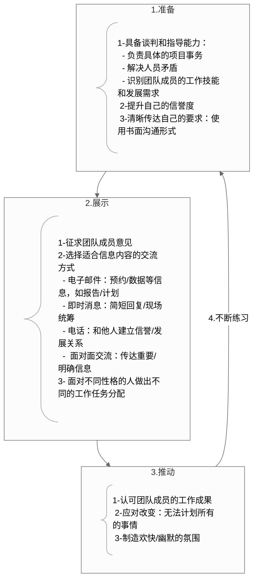

### b) 领导者

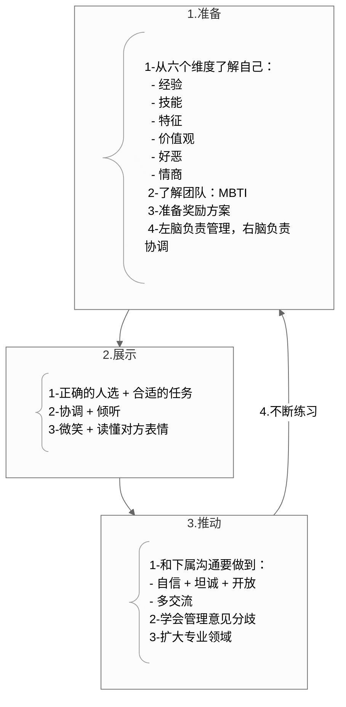

### c) 向上管理

```mermaid
---
config:
  theme: 'neutral'
---
graph TD

A1@{ shape: comment, label: "1-我的工作是协助上司实现他的目标，因此要首先明确：</br>  - 他的目标是什么 </br>  - 公司的目标是什么</br>  - 他认为你在整个大局中的位置</br>  2-上司的个人风格和处事风格是什么 </br> 3-让上司充分了解自己，从而让他（或者更专业的人士）更好地指导你" }
A2@{ shape: comment, label: "1-让上司从正反两方面给出工作表现的反馈</br>2-短时间内做出成绩并书面记录</br>3- 带着可能的解决方案和上司讨论，而非单纯地把问题抛给上司" }
A3@{ shape: comment, label: "1- SAR 模式</br> 2-知道管理上司的边界在哪里 </br> 3-了解公司的变动" }

subgraph 1[1.准备]
A1
end

subgraph 2[2.展示]
A2
end

subgraph 3[3.推动]
A3
end

1 --> 2 --> 3 --4.不断练习--> 1

style A1 [book-@内向者沟通圣经](book-@内向者沟通圣经.md)-a[book-@内向者沟通圣经](book-@内向者沟通圣经.md):left

```

# ref
## 1. 核心思想

内向者可通过系统化的"4P法则"（准备→展示→推动→练习）将性格特质转化为职场竞争力，在保留深度思考优势的同时突破沟通障碍，实现领导力跃迁。

## 2. 核心概念

### 4P

- “准备（Preparation）”意味着你要有一套作战方案，按步骤为人际交往做好准备
- “展示（Presence）”意味着你要完全活在当下，也就是“此刻所在的地方”
- “推动（Push）”意味着你要主动承担风险，强迫自己离开舒适区域
- “练习（Practice）”意味着你要持续不断地将这些有效果的行为内化为自身能力的一部分

## 3. 主题归档

类型：职场技能 × 心理学应用 × 领导力发展

关联领域：内向者专属成长方法论（区别于普适沟通技巧）

## 4. 全书框架梳理

作者首先在第一章提出了内向者在工作中面临的四大困境：

- 压力
- 认知偏差导致低估自己
- 人脉缺失
- 职场隐形

然后在第二章提出应对方法，即 4P. 第三章给出自我测评意见

第 4-9 章分别阐述 4P 法则在不同职场场景下的应用：

- 内向者如何演讲
- 内向者如何做领导
- 内向者如何进行项目管理
- 内向者如何向上管理
- 内向者如何开会
- 内向者如何建立人脉

最后两章总结升华主题，提出使用 4P 法则进行沟通的意义在于：

- 个人层面：
  - 准备：哪怕一点点准备都可以缓解紧张情绪
  - 展示：关注当下，给人留下正面印象
  - 推动：迈出第一步，你就成功了 90%
  - 练习：内向者需要不断练习
- 公司/组织层面：
  - 准备：我的表现就是公司的绩效
  - 展示：拥有展示能力可以促进团队工作
  - 推动：挖掘自己的潜能，就是提升公司的投资回报
  - 练习：优秀公司的核心价值就是打造领导者

## 5. 写作动机

> 你是不是胸怀抱负的企业中层，需要引领他人提高业绩，实现目标？可能你是项目负责人，也可能你作为普通员工，希望承担更多的责任和挑战；如果你从事技术、科研或财务工作，很有可能你的性格更为文静，也可能你不曾像你的销售部、管理部的同伴们一样接受过系统的人际关系处理技能培训；也许作为一名女性，在你的工作领域男性占据着主导地位；也可能作为一名公司员工，你的意见总是得不到重视。
>
> 你可能经常觉得自己内向。内向性格有不同的等级，有些情况下，即使“话痨”也会失语，不知道如何应对令人不适的人际关系。作为一名经理，不论是管人还是管项目，你的团队里一定会有内向者。本书会教你学会理解他们、指导他们，引导他们为组织发挥最大的能力。

问题意识：

- 内向性格不是缺陷而是可管理的特质

现实意义：

- 职场文化外向崇拜导致50%内向者被低估
- 内向者错误模仿外向行为引发能量耗竭

## 6. 观点提炼

### a) Why

内向者在职场也具备竞争力

### b) How

4P

### c) What

- 内向者领导的管理思维
- 项目管理中的内向者
- 向上管理：SAR 模型
  1. 描述具体的问题情况 (Situation)
  2. 行动 (Action)
  3. 行动产生的结果 (Result)
  4. 提供备选方案
  5. 备选方案可能带来的结果

## 7. 批判性思考

### a) 作者背景

作者是一个外向的人，从事企业咨询、演讲、培训工作已经超过 25 年，其婚姻超过 35 年，丈夫的性格属于内向型。

作者为来自各类企业的数千名领导者提供培训、咨询服务。

作为为《美国退休人士协会会刊》(AARP The Magazine)、人力资源协会和《亚特兰大宪法日报》(Atlanta Journal Constitution)撰稿的职场专栏作家，作者对成功领导者做过广泛的调查研究，其中包括很多内向型领导者。

### b) 政治倾向

### c) 价值预设

> 我亲自采访了来自多个行业的 100 多位内向者。有些采访基于事先准备的问题提纲，有些则无非是在客户公司走廊里或者在飞机上与邻座的闲聊。
>
> 带着记者的视角，我列席了各种团队会议、学术研讨、培训课程，寻找内向型领导者掌控局面的实际例子。我记录在笔记本上的观察结果最终汇聚成了本书。
>
> 我发现在社交网站上发布特定的问题也能收到很多回复。很多人喜欢跟我书面沟通，他们提出了丰富多样的建议。本书也参考了活跃在本行业前沿的学术和商业思想家们的独特观点。


# note

## 内向者在工作中遇到的挑战有哪些？

- 压力
- 你眼里的自己远逊于别人眼中的你（即低估自己）
- 不懂经营“关系”，职业发展将受阻（即缺少人脉）
- 成为职场隐形人

## 为什么要在工作中学会经营关系？

>办公室政治（好的那种）也相当于在银行里储存政治资本，它会随着时间的推移产生复利。这意味着要跟正确的人建立关系，不一定非得是企业中职位最高的人，但通常是受到他人尊重，并且人脉广阔的人。储存政治资本需要花时间跟这些人相处，发现他们最关注的事情和他们最迫切的需要，并判断企业的发展方向。从你的人脉网络了解更多与企业文化相关的信息，能够帮助你实现自己的目标。

**4P 法分别针对以上四类挑战作出解决方案：**

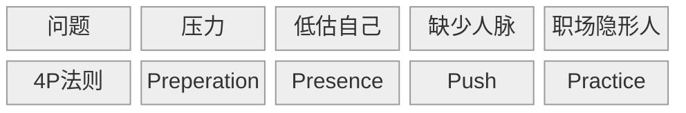

**准备阶段需要做什么？**

>准备意味着你要拿出一个通盘计划，因此你应该花时间独自为人际交往制定策略（例如，明确目的，想出具体要问的问题和要说的话，做笔记，并且跟一个值得信赖的朋友排练一下）。观察那些擅长人际交往的人，将他们的方法融入到自己的风格当中。这样会产生很好的效果。

**展示阶段需要做什么？**

- 专注于当下/此刻在一起的人
- 当场展示
- 为意外情况做准备

**推动阶段需要做什么？**

推动意味着走出舒适区，进入不舒适的人际互动领域

## 内向者如何做好项目管理？

项目管理者要做到以下几点：

- 准备
  - 解决复杂的团队人员矛盾，识别团队成员们各自不同的工作技能和发展需求
  - 与团队成员单独交谈，让团队成员信任自己（单独交谈足够吗？有时项目需要多人一起 align）
  - 使用书面形式清晰传达自己的需求
- 展示
  - 征求意见
  - 选择适合的交流方式
    - 邮件：报告/案例/计划/预约
    - 聊天软件：简短回复/物流现场的统筹规划
    - 电话：提醒别人注意一封已发邮件/希望与他人发展关系或建立信誉
    - 面对面：传达重要信息/明确意见/远程会议打开摄像头
  - 根据团队成员的性格特点切换开关
- 推动
  - 在达到里程碑时称赞团队
  - 称赞团队成员
    - 认可团队成员的努力
    - 选择合适的方式称赞
  - 持续向项目相关人员提供项目最新的进展信息
  - 面对变更，与团队成员进行清晰有效的沟通
  - 变得幽默，展示笑容
- 练习

## 如何管理你的上司/向上管理？

准备阶段：

- 向上司提问：你/公司的目标是什么，我在整个大局中应该处于什么样的位置，其他同事的目标与我的工作领域有什么关系？
- 了解上司的性格/做事风格
- 做好充足的准备，帮助上司更好的了解我，从而让他更好的帮助我：
  1. 我在这个职位可以利用哪些优势来帮助我的上司？
  2. 哪些项目能够发挥我的才能和工作经验？
  3. 我在哪些项目中可以学习新技能，获得新观点？
  4. 上司有哪些宝贵知识、技能或经验值得我学习？
  5. 我的上司愿意指导我吗？用什么方式？如果他觉得自己不是合适人选，那么他可以向我推荐其他专业人士吗？

展示阶段：

- 保持自我：

  - >虽然你要根据上司的管理和领导风格进行自我调整，但是你也要做自己。你们面谈时，一定要请上司对你工作表现的正反两个方面给出反馈意见。问他具体的反馈意见，准备明确的问题

  - >要尊重你的经理的时间，保持注意力集中和明确的目标。考虑一下提前发送信息给他审阅，如果你的上司也是内向者，就更有必要这么做了。通过这种方式，你可以建立起相互信任

- 开始新工作/更换新老板后，尽快作出成绩

- 不抱怨

推动阶段

- 和上司交流时，使用 SAR 方法提供反馈：

  - >首先描述具体情况（S），然后讲述你所采取的行动（A），以及这种行为产生的结果（R）。然后提供一个备选方案，以及这个备选方案会带来的结果。这是你对如何解决这个问题提出的建议。它的目的在于开诚布公地探讨如何做出建设性的改变，而不是追究和指责

- 明确向上管理的边界在哪里

  - >要注意的是，你的上司一定得是乐于接受反馈意见的那一种。如果你的经理感觉受到威胁，或者你所在的公司正处于混乱状态，给上司提建议可能就不太安全，甚至可能会毁了你的工作。在这种情况下，向公司内部的你尊敬的其他人寻求指导，来解决你的上司的问题，而且要记住，即使在这种情况下，你还是能学到很多东西。很多人在事后回想时，都觉得他们其实从工作效率不高的上司那里学到的最多

  - >另外一种不适合管理上司的情况是，上司所做的工作已经违背了道德规范

- 和上司交流，了解公司的变化

练习阶段

>管理上司是一门科学。通过定期会面、提出问题和给出反馈，可以确保你们共同的目标。如果上司换人，则更要抓住机会进行沟通。这可以帮你了解自己是否正在朝着正确的目标前进，如果与目标的方向不一致，自己要采取什么纠正措施，这也是你了解这些信息的唯一方式。另外，随时加深对组织的了解，这样你的目标就能与公司保持一致的发展方向。在未来发展中，你将会成为你的上司最宝贵的合作伙伴。

## 如何在会议中不做隐形人？

在会议中做隐形人会导致以下后果：

- 我的贡献不被认可
- 我的想法被别人抢先说出或被别人操控
- 在别人眼中没有给团队增加价值

准备阶段：

- 了解会议目的：
  - 会议希望得到什么样的结果？
  - 向团队宣布一个决定还是要让团队接受一个决定？
  - 会议是要作出决定吗？
  - 会议目的是为了解决问题、提出想法、发泄感受还是表彰成绩？
  - 我被邀请参加会议的原因是什么？如果是我的老板要求我代替他出席，我是否被授予了决策权？
- 会议的议程是什么
  - 如果没有议程，主动找上司要一份议程，或者主动申请准备议程，然后交给团队审阅
- 在会议上主动表达自己的意见
  - 最好在刚开始的 5 分钟内让别人听到我的首次发言。会议刚开始时，说句评论、提个问题，甚至是转述别人说过的话都要更容易一些，而且别人更会认为你做出了贡献
- 计划位置
  - 如果是电话会议，站着说话比坐着更有活力
  - 线下会议坐在离领导几个座位的地方

---
date: 2025-11-19
---
# note
本书的主旨其实与 [5am project](ref-5am-project.md) 高度契合

我花了大约一小时粗略读完了全文，感觉书中提到的很多方法我已经在实践了，于是算是交叉验证了我的行动

以下是 notebooklm 对本书的总结

---

起床后的黄金一小时》这本书由“早起计划”发起人池田千惠所著，旨在帮助那些感到时间不够用、对职业发展迷茫的人，通过每天起床后的1小时来逆转人生轨迹。该书强调，<mark>早起并非目的，而是**手段**，其关键在于集中时间去做对自己人生重要的事，尤其是要利用早上的时间进行**“播种”**（Sowing）</mark>

该方法论的核心是一个结构化的 **“早上固定习惯”** 流程，可以归纳为以下四个主要阶段：

阶段一：明确志向与基础准备

在开始执行“早上固定习惯”之前，需要做好心理和目标上的准备：

1. **确定人生志向 (定位)**：明确自己希望的人生状态和职业方向。作者提出了四种志向类型，如**“工作&工作志向”**、**“工作&个人志向”**、**“工作&第二职业志向”**和**“工作&投资志向”**。您的沟通技巧提升，可能隶属于“工作&工作志向”或“工作&个人志向”下的**自我投资**。
2. **保证充足睡眠**：早起绝不应以减少睡眠时间为前提，因为睡眠不足会导致大脑效率低下。您应根据“立起”法则，运用“90分钟×（4或5）+α（入睡时间）”的公式来测试和找到适合自己的最佳睡眠时间。
3. **创建仪式感**：在“早上1小时”内，建议先**断网**以维持集中注意力和判断力，并准备好专用的纸笔（作者推荐使用手账或笔记本）来制订计划。

阶段二：黄金一小时的结构化执行（Start Up法则）

作者建议将起床后的黄金1小时划分为前后两个30分钟，以保证规划和行动的平衡：

• **前30分钟：做好一天的工作分类**

• **后30分钟：朝着理想努力践行（播种）**

这个过程可以分解为**“增强行动力只需这三步”**：

1. **写出所有工作内容**：将脑中浮现的当天或未来的工作内容（包括需联系的人、项目、未来想做的事、课题、想看的书/资料等）全部写下来，**将大脑的记忆分给纸笔来承担**。
2. **按照四象限法则划分颜色（确定优先顺序）**：使用“紧迫性×重要性”的原则，将工作计划分成四种颜色。
3. **细化“播种”内容**：将对未来发展至关重要的“播种”内容分解，使其具备**可以立即推行**的状态。

阶段三：四象限法则（颜色划分法）

这是书中确定优先顺序、提高决策效率的核心工具。该方法通过**颜色标记**来让优先顺序一目了然：

| 颜色 | 类别 | 定义            | 特点及行动建议                                               |
| ---- | ---- | --------------- | ------------------------------------------------------------ |
| 红色 | 播种 | 不紧急 × 重要   | 对将来有至关重要影响，代表自我学习、健康管理、提升技能、人生规划等。必须利用早上时间着手，并将其细化到可行动的步骤。 |
| 绿色 | 收割 | 紧急 × 重要     | 与目前生活、工作直接相关，需要快速处理，如重要客户联系、提案、会议资料。 |
| 蓝色 | 疏苗 | 紧急 × 不重要   | 不做影响不大，但需要抽空尽快完成，如不着急的电话、邮件回复。 |
| 黑色 | 风干 | 不紧急 × 不重要 | 落实无意义，可以暂时晾着或取消。                             |

**模型核心洞察**：作者指出，大多数人的工作内容中，**“收割”的绿色会占总体的7成**，因此**“播种”的红色最容易被忽视**。早上1小时的后30分钟正是用来聚焦并推进这些“播种”内容的时间。

阶段四：持续优化与宏观把握

为了让早起计划持续有效，需要定期回顾和调整：

1. **时常盘点**：以每周、每月为周期，对工作进行盘点（比如：想联系的人、今后推进的项目、想看的书等），**果断放弃**那些久拖不决或不必要的事项，避免“收割”堆积造成压力。
2. **分解术**：将看似庞大的“播种”任务（如制作企划案、学习新技能）分解成一个个可执行的小步骤，实现**“不写自明”**，提升成就感和行动力。
3. **宏观把握**：每3—6个月使用**思维导图**来对工作进行宏观把握，防止每天专注于细微之处而混淆了**手段与目的**

---
date: 2025-12-01
---
# note
## 0. AI 导读

### i) 核心章节

本书的核心方法论是 **“获得幸福的 6 个技巧”**，它们构成了将冲突转化为亲密关系的完整流程。建议您将 80% 的阅读精力投入到详细阐述这六个技巧的 **第二部分 (第 4 章至第 9 章)** 中

| 章节    | 核心主题                               | 对应“获得幸福的 6 个技巧” | 核心价值（与锚点连接）                                       |
| ------- | -------------------------------------- | ------------------------- | ------------------------------------------------------------ |
| 第 4 章 | 唤醒渴望：发现需求，遵从本心           | 技巧 1：唤醒渴望          | 寻找根源： 引导读者穿透表象的“想要”（谬望），找到争吵背后未被满足的终身渴望（如被重视、被影响）。这与 NVC 的核心——“感受的根源源于自身需要”——高度契合 |
| 第 5 章 | 紧密互动：公平争吵、积极相处的七条规则 | 技巧 2：紧密互动          | 规则实践： 设定建设性争吵的规则（如 5:1 的积极/消极互动比例、各自承担 50% 责任）。指导如何进行创造性的紧密互动，避免“天启四骑士”式的破坏性行为 |
| 第 6 章 | 揭露问题：限制观念与未解心结           | 技巧 3：揭露问题          | 心理深潜： 揭示冲突根源：信念矩阵、内隐记忆和移情/投射。这是对《学会倾听》中移情和次人格概念的深度应用，指导读者识别谁在与你同床共枕——过去的父母或创伤 |
| 第 7 章 | 解放自我：摆脱思维与行为定式           | 技巧 4：解放自我          | 打破旧规： 采取行动挑战在第 6 章中发现的限制观念，通过“任务型生活方式”打破旧模式。强调解放自我需要勇气、冒险，而非仅仅是心理建设 |
| 第 8 章 | 重建矩阵：重塑思想，改造关系           | 技巧 5：重建矩阵          | 持久化： 利用大脑的神经可塑性，通过重复和有意识的练习（如执行意向）建立新的赋能观念和神经通路。争吵成为转变观念和修复裂痕的催化剂 |
| 第 9 章 | 坚持行动：致力于变成更好的我们         | 技巧 6：坚持行动          | 长期承诺： 强调终身致力于改变和成长。关键在于 “切断退路”（消除骑驴找马的幻想）和 “深度刻意练习”。这与您内向者 4P 法则中的“练习（Practice）”阶段相辅相成 |

### ii) 逻辑链

第一部分：亲密关系的真相——破解谜团和重建认知 (Ch. 1–3)


| 章节        | 逻辑功能                                                     | 关键概念                                                     |
| ----------- | ------------------------------------------------------------ | ------------------------------------------------------------ |
| **第 1 章** | **引入冲突的积极性**                                         | 争吵是值得的；介绍 **15 种基本争吵类型**。                   |
| **第 2 章** | **冲突的必然性**                                             | **爱情中的不和谐音**；冲突是为了生存；关系是持续的“分裂”和“重组”；引入家庭系统理论中的**差异化**（独立个性）。 |
| **第 3 章** | **打破童话迷思**                                             | **爱情迷思**（如“灵魂伴侣”/“相容性”）；只有爱是不够的；鼓励读者**抛开童话，进入森林**（冒险和面对未知）。 |
| **联系：**  | **认知重建：** 奠定基础——良性的冲突是必然的，且是成长的必需品，但必须摒弃传统的错误观念。 |                                                              |

第二部分：争吵的艺术——将冲突转变为幸福的 6 个技巧 (Ch. 4–9)

| 章节    | 逻辑功能                                                     | 关键概念                                                     |
| ------- | ------------------------------------------------------------ | ------------------------------------------------------------ |
| 第 4 章 | 找到争吵的动机                                               | 唤醒渴望：区分渴望（深层需求，如被爱、被重视）与谬望（表面需求，如让对方扣上牙膏盖）；渴望的位置（大脑满足中枢） |
| 第 5 章 | 建立行为规则                                                 | 紧密互动；建设性与破坏性互动比例（5:1）；天启四骑士（批评、轻蔑、防御、退缩）；50% 责任原则 |
| 第 6 章 | 挖掘心理根源                                                 | 揭露问题；信念矩阵（早期经验的程序）；移情和投射；互补法则；杏仁核劫持 |
| 第 7 章 | 开始行动转变                                                 | 解放自我；打破旧规则；通过采取与限制观念相反的行动来挑战旧矩阵；强调新鲜感和刺激 |
| 第 8 章 | 巩固和深化转变                                               | 重建矩阵；神经可塑性；情绪调谐（Attunement，互相理解内在状态）；修复裂痕（争吵后重建联系）；执行意向（“如果……就……”策略） |
| 第 9 章 | 持续与承诺                                                   | 坚持行动；切断退路；深度刻意练习；致力于变成最好的我们       |
| 联系：  | 方法论（核心）： 通过识别真正的渴望，设定公平争吵的规则，挖掘潜意识障碍，然后系统地、反复地重建大脑和行为模式，实现持久的个人和关系转变。 |                                                              |

第三部分：开放心胸，拓宽视野 (Ch. 10–12)

| 章节     | 逻辑功能                                                     | 关键概念                                                     |
| -------- | ------------------------------------------------------------ | ------------------------------------------------------------ |
| 第 10 章 | 独立与亲密                                                   | 情绪成熟；独立人格（从原生家庭脱离）；自主获取的亲密感；自我成长是亲密关系的前提 |
| 第 11 章 | 情绪管理与神经学                                             | 掌控情绪；情绪能力的四个方向（向内、向外、向上、向下）；表达而非压抑情绪；催产素（信任激素）在亲密接触中的作用 |
| 第 12 章 | 整体升华与愿景                                               | 好好吵架吧；争吵是追求浪漫的英雄征程；心灵战士（为目标和原则而战）；为关系构想远大愿景 |
| 联系：   | 应用与升华： 技巧的最终目的是培养成熟、独立的个体，他们能够在高层次的情感能力上进行互动，最终获得“深度生活”和“完美之爱”（Ultimate Love） |                                                              |

### iii) 重点概念

 **15 种基本争吵类型：** 作者总结了伴侣间常见的冲突表象，如“推卸责任”、“家务琐事”、“你总是/你从不”等。书中强调这些只是表面问题，核心在于潜藏的内在矛盾。

• **冲突是为了生存：** 进化科学和神经学表明，人类对失去关系（依恋）的恐惧会触发大脑中的痛觉区域，因此回避争吵是一种原始的生存恐惧。

• **爱情迷思：** 那些由童话、影视剧和文化灌输的错误观念，如“找到灵魂伴侣就能解决一切问题”、“化学反应很重要”或“真爱应该无往不利”。这些迷思是阻碍有效争吵和关系深化的主要障碍。

第二部分：争吵的艺术（核心技巧）

• **唤醒渴望（Awaken Desire）：** 引导我们发现藏在争吵表象（谬望）下的深层、普遍的**人类渴望**（如被重视、安全感、被理解）。争吵的目的是为了满足这些渴望。

• **5:1 比例：** 幸福伴侣在分歧时，积极互动与消极互动的比例约为 5:1。这表明冲突本身不可怕，关键在于**积极的联结要远远多于破坏性的互动**。

• **天启四骑士（Four Horsemen）：** 最具破坏性的四种互动方式：**批评、轻蔑、防御、退缩**。它们的出现预示着婚姻的破裂。

• **信念矩阵（Belief Matrix）与内隐记忆：** 构成我们潜意识观念、感受和行为模式的神经通路，形成于生命早期（缺乏语言能力前）。当下的争吵常常触发这些**内隐记忆**（储存在意识之外的感觉），使我们对伴侣的反应与当下事实不符。

• **移情与投射（Transference & Projection）：** 我们无意识地将童年时期重要关系中未解的情感和期待，投射到伴侣身上。被吸引是因为伴侣能激活我们的矩阵，他们是**“完美的冤家”**，能刺痛我们未解的心结。

• **杏仁核劫持（Amygdala Hijack）：** 失去理智的状态。当依恋关系受到威胁（依恋破裂）时，大脑杏仁核会分泌皮质醇和肾上腺素，触发“对抗—逃跑—呆滞”模式，使我们丧失逻辑推理能力。

• **执行意向（Implementation Intention）：** 一种重建矩阵的策略，通过使用 **“如果……就……”** 的句式，提前预想并在特定情境下采取新的、赋予力量的观念和行为。

• **切断退路：** 致力于改善的承诺要求伴侣不能再考虑“也许还有更好的人”或“如果我就这么走开”的模糊期望，必须全身心地投入到现有关系中。

第三部分：开放心胸，拓宽视野

• **情绪成熟与独立人格（Differentiation）：** 真正的亲密需要双方成为成熟、完整的独立个体，能够在保持独立性的同时，与伴侣在情感上保持联结。

• **情绪能力的四个方向：** 发展情绪的能力需要从四个维度着手：**向内**（感知和识别感受）、**向外**（负责任地表达）、**向上**（提升积极情绪和动力）、**向下**（自我安抚和调节紧张感）。

• **情绪调谐（Emotional Attunement）：** 深入地了解彼此的内在状态和情绪，并通过眼神、语调、身体接触等表达理解、关心和同情，从而促进彼此大脑神经通路重组。

• **英雄征程（Hero's Journey）：** 将良性争吵视为一场冒险。通过勇敢面对内心的阴影（怪物），才能发现亲密关系中的巨大财富（如勇气、力量、亲密感），最终实现自我发展和关系的蜕变

## 1. 刻意练习框架下的正确争吵


### Target

激发最好的自己，成为合适的伴侣，而非让伴侣做出改变

### Focus: 唤醒渴望

- 什么引发了争吵？
- 我在逃避什么？
- 争吵时爆发了什么？
- 争吵前后我的感受如何？
- 隐藏在争吵背后的渴望是什么？

### Feedback: 与伴侣分享渴望

对应紧密互动，具体做法有：

- 避免批评、轻蔑、防御、退缩（天启四骑士）
- 5:1 的积极/消极互动比例
- 双方各自承担 50% 责任

### Fix: 揭露问题 + 解放自我

我以前有这样的感受吗？哪些限制信念与之对应？它引发了我哪些未接心结？

- 移情/投射
- 内隐记忆/信念矩阵
- 判断此刻是否出现杏仁核劫持现象

我在做出改变之前，应该遵循哪些原则？

- 及时并经常争吵：不要谨言慎行，要把冲突展现出来，这样才能对其进行处理
- 每天谈论心情/渴望/恐惧/梦想
- 有话立刻说：人们常常在成功表达感受之后才知道自己在烦什么
- 给自己设置高标准
- 强调伴侣双方共同合作的重要性

### 心理表征

对应书中提到的信念矩阵 (Belief Matrix), 是关系的心理表征，而神经可塑性是这种表征的生物学基础

我们的信念矩阵是基于早期经历（内隐记忆）形成的神经通路，它支撑着我们潜意识中的观念和行为模式，这就是我们看待世界和关系、进行争吵的程序/心理模板

### 强化心理表征/动态调整：重建矩阵

我怎么做才能有不一样的表现？

- 执行意向
- 切断后路

### 价值预设

双方致力于自我成长，并对这段关系进行长期投入

这个预设并非要求伴侣一开始就必须是成熟的人，而是要求他们对成为最好的自己抱有坚定的**意愿和承诺**

成熟（情绪成熟、独立人格）是伴侣通过“为幸福而战”而获得的结果，而不是开始这段旅程的先决条件。但愿意承诺（Commitment）和勇于投入（Engagement）是启动这套系统的前提条件

## 1. 为什么要进行深度工作？

作者的逻辑链如下：

当今社会要求两种能力：

1. 迅速掌握复杂工具的能力
2. 在工作质量和速度方面达到精英层次的能力

而这两种能力，依赖于深度工作

作者提出了深度工作假设（Deep Work Hypothesis）：

1. 深度工作的能力日益稀少
2. 深度工作的价值日益提升

培养这项技能并将其内化为生活核心的人会获得成功

## 2. 为什么深度工作的能力日益稀少？

作者提出了一个名词，叫做“度量黑洞”——作者认为，个体带来的价值很难被衡量，很多浅浮工作（比如发邮件）造成的浪费大都无法察觉

度量黑洞表现为三个方面：

- 最小阻力原则：在工作环境下，若各种行为对于底线的影响没有得到明确的反馈意见，我们倾向于采用当下最简单的行为
- 忙碌代表生产力：在工作中，对于生产能力和价值没有明确指标时，很多知识工作者都会采用工业时代关于生产能力的指标，以可视的方式完成很多事情
- 网络中心主义：大众的默认思维是，网络 = 与时俱进

这一系列的表现导致的后果就是：大量浅浮工作替代了深度工作

## 3. 为什么深度工作是有意义的？

三个角度：

- 神经学角度：深度工作可以强化专注力，更少的让杏仁核通过情绪等因素抢走专注力
- 心理学角度：深度工作非常适合产生心流，因为它将脑力开发到极限；专注；在一项活动中达到忘我
- 哲学角度：深度工作可以反映匠心精神

## 4. 如何实现深度工作

四个准则：

1. 深入工作
2. 拥抱无聊
3. 远离社交媒体
4. 摒弃浮浅

如何深入工作？作者认为最佳的深入工作方式，就是形成习惯：

- 有固定的工作场所和工作时间
- 工作开始后设定明确目标，可以参考《高效能人士的执行四原则》（思考：这似乎和 SMART 原则很相似？）：
  - 关注点放到极端重要的事情
  - 目标要可执行
  - 要追踪目标
  - 定期回顾目标

- 确保大脑得到必要的支持：咖啡/散步/保持能量的食物

此外，还可以做一些大手笔，作者给出了两个事例：

- 置身豪华酒店写作
- 远离工作一周，只做思考
- 在国际航班上写作

这些举动推动你的深度目标，占据心理优先的地位，有助于你解锁必要的心理资源

思考：似乎并不绝对？有些人必须要用特定的钢笔和纸张写作，也有一些人随手抓一支笔就可以写作；很多人买了很昂贵的本子舍不得下笔，总觉得这么贵的本子必须要记录最重要的事情；而有些人买了本子之后第一件事情就是先任意挑一页纸写写画画，这样告诉自己——这个本子已经被写过了，不要再有负担，放心大胆的去写

这里，作者再次提到劳逸结合的重要性：

- 自主性注意力是有限的
- 过度工作会让第二天效率下降
- 无意识思维理论（unconscious thought theory）

思考：所以还是对应认知负荷理论模型，UTT 也说明了运动对于大脑的重要性？

作者对于社交工具的态度我十分认同：

- 社交工具把我们的时间碎片化，削弱了我们集中注意力的能力
- 大部分对于社交工具的态度是，但凡社交工具有任何益处，或如果不使用就可能错过某事，那么就有足够的理由使用；而作者的态度是，只有一种工具对决定成功与幸福的核心因素的实际益处大于害处时，才选择这种工具
- 作者认为，社交媒体的本质是：如果你注意我说了什么，我就会注意你说了什么，不管这话语有无价值
- 社媒可以带来益处，但还 没有重要到将自己的时间和注意力投入其中的程度

作者认为在晚上或周末到来之前，就确定要做的事情：

- 在大脑清醒时去做有意义的事情
- 不要放任自己浏览网页

这样在一天结束时你会觉得更加充实，第二天更加轻松

## 5. 对《深度工作》的一些思考  

两个重要的概念：

- 深度工作（Deep Work）：无干扰状态下专注进行职业活动，使个人认知能力达到极限
- 浮浅工作（Shallow Work）：对认知要求不高的重复性事务，往往在受到干扰的情况下开展

书的结构还是很清晰的，分为两个部分：  

- 为什么深度工作很重要？  
- 如何进行深度工作  
  

关于第一点，我选择看这本书就是因为我已经在认知层面意识到要进行深度工作了，感觉没必要再从作者到视角去过多了解  

作者把《刻意练习》和《心流》联系了起来，认为深度工作是一种刻意练习，尤其对应 3F 中的 focus，其神经学基础为，刻意练习让髓磷脂在神经元附近生长，从而保证神经元的生长和卫生；而心流是深度工作的表现形式  

批判性思考：作者认为 focus 比 feedback 更重要。真的如此吗？我感觉 feedback 比 focus 更重要才对。feedback 让我们知道自己努力的方向是不是对的，这应该比一味的朝一个方向走要重要得多吧？  

进一步思考：如何平衡深度工作和与同事交流？  

认同三点：  
- 工作带来的心流能愉悦身心，这比无所事事的业余生活要精彩  
- 早起+冥想：让大脑尽量处于没有外部干扰的情况下工作，更容易进入深度工作的的状态  
- 高质量工作产出 = 时间 X 专注度

插个题外话：似乎但凡是关于自我提升的书籍，都会提到《心流》这本书。虽然我没看过，但是通过这些道听途说似乎都快掌握这个概念了  

关于第二点，作者的背景在互联网时代，被各种邮件困扰；而现在的 AI 时代又与之不同了。而且，现在的 AI 时代我认为是不可能离开电脑/网络的。如果想进行深度工作，那么一定要善用 AI  

作者提到隔离社交圈这点我已经在做了，效果也的确很好。现在我只保留了微信作为日常的通讯工具，what app 作为和外国人沟通的软件。朋友圈能屏蔽的就屏蔽。这样能挤出很多时间出来看书  

是不是可以这样理解：深度工作 = 集中注意力？这么说的话，是不是可以说，所谓的碎片化学习本质上是伪命题？  

所以，这本书带给我的行动和改变究竟是什么呢？  
列出我的日常工作中，哪些是深度工作，哪些是浅浮工作？  

苹果 AI 总结要点如下：  
> - 深度工作的定义和重要性：深度工作是一种刻意练习，类似于心流状态，对提升工作效率至关重要。  
> 
> - 深度工作与反馈的关系：作者认为专注力比反馈更重要，但反馈在指导努力方向上更重要。  
> 
> - 如何进行深度工作：早起冥想、隔离社交媒体干扰、善用AI工具以及区分深度工作和浅浮工作。  


# card

```mermaid

```

| 维度     | 比较对象                        | 系统偏差                             |
| -------- | ------------------------------- | ------------------------------------ |
| 认知工具 | 系统 1 <br />vs. <br />系统 2   | 光环效应<br />小数效应<br />锚定效应 |
| 风险决策 | 理性人<br />vs.<br />普通人     | 前景理论<br />禀赋效应<br />框架效应 |
| 幸福评价 | 体验自我<br />vs.<br />记忆自我 | 峰终定律<br />时长忽略               |

# ref
## 核心观点

人类存在两个思考系统：

- 系统 1（快）是直觉、快速、情绪化的，擅长日常决策但易出错
- 系统 2（慢）是理性、逻辑、耗费精力的，能进行深入分析但“懒惰”

我们多数判断是系统 1 主导，易陷入“直觉偏误”和“认知捷径”，因此关键在于认识并平衡这两个系统，关键时刻启动系统2进行审慎思考

## 核心概念

### 启发式（heuristic）判断

利用相似性，简化复杂判断的手段，相当于经验法则

### 系统误差

对启发式的依赖导致预测中出现可预见的偏差

等同于所见即一切（What You See Is All There Is）：在保证信息一致性而非完整性的情况下，根据有限的证据妄下结论

常见的偏差有：

- 光环效应（halo effect）：即爱屋及乌
- 小数定律（law of small numbers）：即过度自信/放大个例的影响，认为小样本也能像大样本一样代表总体规律
- 框架效应（framing effect）：用不同方式呈现同一个信息会引发不同的情绪，例如：“术后一个月的存活率为 90%”的说法比“术后一个月的死亡率为 10%”更让人安心
- 锚定效应（anchoring effect）：人们在做决策或定量估测时，会过度依赖最先获得的信息（“锚点”），并围绕这个初始值进行调整，即使该锚点可能无关或不准确，也会影响最终判断，常见于商业定价、谈判和投资等领域，如“原价”设定促使消费者觉得打折商品划算。刻意的换位思考也许是抵制锚定效应的有效策略

### 关联记忆（associative memory）

心理学家将想法视为一个庞大网络中的节点，而这个网络就被称为关联记忆。每个想法都和其他想法链接在一起，链接的类型有：

- 因果链接
- 属性链接
- 类别链接

### 促发效应（priming effect）

是一种[内隐记忆](https://zh.wikipedia.org/wiki/内隐记忆)的效应，也被称为**启动效应**, 而这个效果是指受到一种刺激 （即知觉模式）时，会影响到另一个刺激的反应。例如： 当我们听到护士时，会很快地想到医生而不是面包

### 理论致盲

一旦你接受了某个理论，并将其作为思维工具，就很难注意到它的错误。如果发现一个观察结果似乎与模型不符，你会认为，肯定有一个你不知道的完美解释。你赋予它不受质疑的权利，相信接受这一理论的专家群体

### 前景理论（prospect theory）

有三个认知特征，源于系统一：

- 评估是相对于中性参考点而言
- 敏感性递减原则
- 损失厌恶

价值函数曲线图：


用 DeepSeek 的总结是：

> 前景理论描述的是“在心理参照点附近，对损失高度恐惧、对收益逐渐麻木的、非对称的趋利避害”

### 峰终定律（Peak-End effect）

人们对于某一段经历的记忆，只会记得高峰时和结束时的感觉，即“峰值”和“终值”的体验，而过程中的其他体验对人们的记忆几乎没有影响

一个经典例子是宜家的 1 元冰激凌：


### 两个自我

- 体验自我 活在当下，渴望持续的舒适、愉悦、投入感，厌恶疼痛、无聊、焦虑
- 记忆自我 活在事后，渴望一个有意义、有高峰、结局圆满的好故事

## 主题归档

- 认知心理学

- 社会心理学

## 全书框架梳理

见纸质书序言部分

总的来讲可以分为三点：

- 1-3 部分介绍了双系统
- 4 部分介绍了两种人：纯理性的经济人与受情绪支配的普通人如何决策
- 5 部分介绍了两种自我：负责生活的体验自我与负责做选择、切分的记忆自我


---
author: René Descartes
date: 2025-01-12
title: NS-review-谈谈方法
tags:
source:
---
# card
## 1. 核心内容

```mermaid
---
config:
  theme: 'neutral'
---
block-beta
  columns 5

  space:2 A["形而上学"] space:2
  
  space:5
  space:5

  space:2 B["Cogito"] space:2

  space:5
  space:5

  C["理性方法"] space:3 D["行动"] 

  A --"决定"--> C
  D --"检验/校正"--> A
  C --"指导"--> D

  B --"3. 我存在"--> A
  C --"1. 我思"--> B
  B --"2. 我是"--> D

  style B fill:red,stroke:red,color:white;
  style A fill:#007FFF,stroke:#007FFF,color:white;
  style C fill:#007FFF,stroke:#007FFF,color:white;
  style D fill:#007FFF,stroke:#007FFF,color:white;
```

Cogito 是笛卡尔的核心思想，包含三个阶段：

1. 我思 (je pense)
2. 我是 (je suis)
3. 我存在 (je existe)

Cogito 是连接形而上学思想、方法和行动的拱心石：

- 客观上：
  - 形而上学的思想决定了理性的方法论
  - 方法论指导行动
  - 行动反过来可以对形而上学的思想进行检验/校正
- 主观上：
  - 通过方法论让“我”进行“我思”（反思/怀疑）
  - 因为“我”思考，所以“我（灵魂上）存在”
  - 我思之后，“我”的物理实体会有所行动 → “我是”

笛卡尔认为，理性/理智是人人都有的，然而要很好的使用它们，需要正确的方法论。方法论又衍生出行事规则。笛卡尔分别列出了四条规则：

- 方法论
  - 避免先入为主
  - 化繁为简
  - 从易到难
  - 整体复盘
- 行动
  - 遵守当地法律/风俗
  - 行事果断
  - 行事不成，反求诸己
  - 遵守以上三条

# ref
## 1. 核心思想

谈谈两种方法：

1. 如何正确引导自身理性
2. 如何在各门学科中探求真理

## 2. 核心概念

### 我思故我在

这句话的第一表述是法语而非拉丁语，蕴含了三个阶段：

1. 我思 (je pense)
2. 我是 (je suis)
3. 我存在 (je existe)

“我”作为实体的存在，唯一属性是“思”。这里的思应该理解为**反思/怀疑**。除了“思”以外的任何属性都不能决定“我”的实体性/存在，因为怀疑本身的这种不可怀疑性保证了“思”的实在属性。

## 3. 主题归档

类型：哲学方法论

关联领域：

- 认知论革新
- 科学方法论

## 4. 全书框架梳理

- 1 章：笛卡尔对各门学科的不同看法
- 2-3 章：笛卡尔所探讨的方法论的主要原则，以及从这一方法论中所提取的行为准则
- 4 章：笛卡尔证明上帝和人类灵魂存在的理由
- 5 章：探讨了一系列的物理学问题，例如医学/人类与动物灵魂之间的差异
- 6 章：笛卡尔的写作动机  

其中，前四部份是重点。

## 5. 写作动机

问题意识：

- 打破经院哲学教条主义
- 解决科学革命中的认识论危机（如伽利略审判）

现实意义：

- 为新兴自然科学提供方法论护盾（避免宗教迫害）
- 确立理性而非权威作为真理标准

## 6. 观点提炼

### a) Why

传统逻辑存在局限性，例如三段论只能说明已知的事物

### b) How

构建新的方法论

### c) What

指导思想：保持理性

方式：保持理性和正确行事的四条规则

## 7. 批判性思考

### a) 作者背景

Rene Descartes, 17 世纪法国哲学家、数学家和科学家。出身贵族，参加了 1618 年爆发的三十年战争。他生前公开发表的作品有：

- 《谈谈方法》
- 《第一哲学沉思集》
- 《哲学原理》
- 《论灵魂的激情》

以下内容摘自译者（左天梦）附录：

> 在笛卡尔所处的时期，传统大学衰败，城市受到战争和瘟疫的袭击。几何学与数学在实践领域的应用取得巨大进步，天文学、医学和物理学得到长足发展。哲学家和科学家们敏锐的感受到“新科学”在这个世界中的无限生机，本书就在这样的背景时代下应运而生。

### b) 政治倾向

- 表面妥协（献书给索邦神学院）
- 实质颠覆：用“上帝是几何学家”取代“上帝是立法者”

### c) 价值预设

- **理性至上**：数学推理可解决一切问题
- **形而上学**：严格区分心灵（思考）与物质（广延）
# note
## 如何理解理性？

>并不是因为有的人更理性、其他人不够理性而导致对相同的事物持有不同看法，而是因为我们使用了不同的方法来对待相同的事物。光有理性是不够的，重点在于能够恰当的运用它。

## 保持理性的四条规则

> 第一，凡是不了解的观点，我绝不将之当成是真的，也就是说，**避免轻率地下判断还有先入为主**，只相信在脑海里清楚明白地呈现出来的观点和完全不受怀疑的事物；
>
> 第二，把我要去研究的难题尽可能分成一小块一小块，然后**逐步解决**；
>
> 第三，理清我的思路，**从最简单、最容易认识的对象开始，逐步上升到最复杂的认识对象**；对本身没有先后之分的事物，也分门别类和排序；
>
> 最后，检查每一处数据的完整性以及进行总体复查，确保**没有任何疏漏**。

## 正确行事的四条规则

> 第一条：遵守国家的法律还有民俗的习惯，坚守自身的信仰；
>
> 第二条：行事上尽可能做到坚定和果断，一旦确定某个想法之后，即使存在着很大的怀疑，也坚决遵循这条路走下去；
>
> 第三条：一直努力地去战胜自己，而不是战胜命运，去改变自己的愿望而不是世界的秩序，始终相信除了能够掌控自己的想法之外，其他事情是无法掌控的；
>
> 第四条：耗费一生的时间来培养我的理性，使用我所制定的方法，在对真理的认知道路上前进。

## 我思故我在

> 我毫不犹豫地将这条真理看作是我所追寻的哲学第一原理......我无法假装我不存在。恰恰相反，我怀疑其他事物的真实性，反映出“我存在”这一事实是如此明显和肯定。**如果我停止了思考，即使我之前所想的全部东西都是真实的，我也没有理由相信自己存在了**。此处，我意识到自己是一个实体，而它的本质或者说天性是思想，因此，它不用占据任何空间以及依靠任何有形之物。为了将这个自我——也就是灵魂，通过它，我才能使我——完全区别于肉体，认识这个自我是非常惬意的事，其实形体不在，灵魂仍将是它自己。
>
> 理性告诉我们，我们的思考不完全是真实的，因为我们并非完美，在清醒的时候所作的思考比睡梦中所想的，应该过呢国家真实和准确。

---
author: me
date: 2025-01-18
title: note-像高手一样解决问题
tags:
source:
---
# card
## 1. 核心内容

```mermaid
block-beta
  %%{init: {'theme':'neutral'}}%%
  columns 5
起源 PSAC:4
space:5
逻辑推理 演绎:2 反演/溯因:2
space:5
解决思路 做出假设 MECE 设计思维:2
space:5
id1["Statement"] TOSCA:2 形成共情 视角陈述
space:5
space:5
id2["Structure"] 假设树 问题树 建立设计要求:2
space:5
space:5
id3["Solve"] 8D:2 EDIPT:2
space:5
space:5
id4["Sell"] id5["SCQA + 金字塔原理"]:4

id1 --"按需迭代"--> id2
id2 --"按需迭代"--> id3
id3 --"按需迭代"--> id4
id2 --> id1
id3 --> id2
id4 --> id3
```

# ref
## 1. 核心思想

通过**结构化工具**（MECE/假设树）和动态迭代机制（4S模型），将复杂问题拆解为**可验证的子问题**，结合**设计思维**解决**战略性问题**。

## 2. 核心概念

### PSAC

- Why?
  - 解决咨询问题类的战略问题

- How?
  - 以假设为驱动，对假设进行测试和验证
    - 方法：假设金字塔
    - 缺点：先入为主，存在证实性偏差 (confirmation bias)

  - 以问题为驱动，以系统化的角度审视问题的不同方面，对解决方案不带任何预设的想法拆解问题
    - 方法：问题树
    - 缺点：无法保证拆解后的问题能够得到解决

  - 设计思维
    - 方法：观察产品对客户的体验，然后把观察转变为洞察 (insight)，将洞察转变为能改变人生的产品和服务
    - 缺点：未提及

- What?
  - Problem-Solving Approach of Consulting
  - 源自于麦肯锡公司 (McKinsey & Company) 开发并完善形成，其基础建立在笛卡尔的《方法论》原则之上的一套方法论


### 溯因推理

- Why?
  - 如何设计出满足用户需求的产品？
- How?
  - 设计思维
- What?
  - 利用有限的观察结果为数据生成最合理、最简洁的解释
  - 这种解释可能并不正确，必须经过检验和论证
  - 验证形式为原型迭代

### 设计思维

- Why?

  - 满足溯因推理的前提
  - 问题较为复杂，需要从多个维度考虑
  - 很难对问题进行精准陈述

- How? 

  - 发散与收敛
    - 发散思维可以在每个阶段创造大量可供选择的选项
    - 收敛则要求设计人员在大量选项中做出选择
  - 具体与抽象
    - 定量收集信息
    - 定性分析信息
  - 迭代与协作
    - 解决方案的形成是非线性的，需要不断迭代更新
    - 解决方案的形成需要跨学科协作
  - 创造力与包容度
    - 解决问题需要创造力
    - 面对失败需要拥有包容度

- What? (EDIPT)

  设计思维不是线性的，要**时刻准备迭代**！

  1. 设计思维是对人的需求进行观察和挖掘，最终形成共情 (**Empathize**)：
     - 观察
       - 了解用户的实际行为
     - 互动：与用户交互，从而捕捉用户的行为方式、想法和感受
       - 在用户遇到问题的实际环境中观察
       - 倾听用户意见
       - 体验用户用以解决问题的产品
     - 沉浸
       - 让自己成为一名用户，亲自体验并使用产品
       - 与极端用户共情：
         - 目标产品的专家级用户和从未使用该产品的人群
         - 因约束条件而在使用产品时受阻的人
         - 产品的狂热爱好者与批评者
         - 每天高强度使用产品的人和拒绝使用的人
  2. 并将这种观察和挖掘置于问题解决过程的核心 (**Define**):
     - 使用**共情地图（用户画像） / 行程地图 / 洞察卡**等工具，对单独的数据进行处理
     - 对定量的数据进行定性分析，从而将结构化的数据提炼成关于用户问题的一致理解  
       a. 归纳用户的**需求**：情感/实体上的需要与欲望，用动词形式表达出用户需要帮助的地方  
       b. 找到需求背后的**洞察**：关于用户行为、思考或感受的深度认知  
       c. 总结所有的需求和洞察，形成**设计规则**
     - 定义**视角陈述**：「用户」需要「需求」，因为「洞察」。
     - 对视角陈述进行「怎样才能」的提问，形成问题陈述
  3. 设计思维提倡设计人员对解决方案进行迭代测试，将他们对遇到问题的人（即用户）的了解转化成为解决方案中对用户喜好的明确判断，进而开发出潜在的解决方案 (**Ideate**)：
     - 生成不同解决方案概念，注重数量和多样性，不用考虑质量：
       1.  类比思维
       2.  头脑风暴
       3.  形态分析
       4.  SCAPER 问题清单
     - 利用结构化评估过程进行收敛
       1.  指标：设计标准/可落实性/可行性
       2.  请同行发表看法
  4. 然后将其转换为原型 (**Prototype**)
  5. 这套原型要能够利用来自解决方案实施者的反馈进行**迭代**测试 (**Test**)：
     - 明确测试内容
     - 选择正确的测试环境和测试对象
     - 收集反馈
     - 反思结果

### TOSCA 框架

- Why?
  - 如何使用演绎推理做出假设并拆分问题？
- How?
  - 假设金字塔
  - 问题树
- What?
  - Trouble: 期望与结果/愿望与现实之间的差距
    - 不接受我们无法解决的抱怨
    - 不要先入为主地让自己个人的想法/理解渗入对麻烦的定义中
    - 提问“为什么是现在出现”
  - Owner: 找出谁应该对 Trouble 负责（参考 [RACI](https://www.atlassian.com/zh/work-management/project-management/raci-chart "RACI") 矩阵中的负责人）），其意义在于
    - 其身份塑造了解决方案的空间
    - 指明了问题定义的方向
    - 在不断的迭代中不断评判解决方案的好坏
  - Success Criteria: 
    - 描述出成功应有的样子
    - 成功发生在什么时候（例如项目管理中的 SMART 原则）
    - 成功是否包含明确的可量化目标
  - Constraints: 找出 Owner 面临的约束是什么，又该如何权衡，主要分为三类
    - 对 Success Criteria 的约束，即该问题与其他问题/目标/承诺/KPI 的冲突
    - Owner 资源和能力的约束
    - 时间/预算/技能/保密的约束
  - Actors: 参考 [RACI](https://www.atlassian.com/zh/work-management/project-management/raci-chart "RACI") 矩阵中的知情人/咨询者/执行者
    - 按照支持态度，Actors 可分为支持者/中立者/反对者
    - 我们要特别留意潜在的反对者

### MECE 拆分问题

将一个问题拆分成若干个必要条件的子问题，每一个子问题要满足：

- 相互独立 (Mutual Exclusivity)：即相互之间不能有重叠
- 完全穷尽 (Collective Exhaustiveness)：加总为一体即为充分条件

### SCQA 表达结构

- What?
  - 情景 (Situation)
  - 冲突 (Complication)
  - 疑问 (Question)
  - 解答(Answer)
- How?
  - 设计小故事：
    - 带入背景
    - 引出矛盾
  - 表达小启发：
    - 点出问题
    - 表达核心
- Why?
  - 在使用金字塔原理展示战略问题的解决方案是，如何做到开门见山地引出核心论点点题，提高表达质量？

## 3. 主题归档

类型：

- 设计思维
- 问题解决

关联领域：

- 系统思维
- 认知心理学
- 博弈论

## 4. 全书框架梳理

见 6.观点提炼

## 5. 写作动机

问题意识：如何解决战略性问题

现实意义：企业 90% 战略失败源于错误问题定义

## 6. 观点提炼

```mermaid
---
config:
  theme: 'neutral'
---
flowchart LR
  A["顶层目标：如何解决战略性问题"] 
  --> B1["第一级策略：动态问题解决系统"]
  --> B2["第二级策略：理性 + 人文双核驱动分析"]
  
  B1 --> C1["核心模块1：Statement（问题定义）"]
  B1 --> C2["核心模块2：Structure（框架构建）"]
  B1 --> C3["核心模块3：Solve（方案生成）"]
  B1 --> C4["核心模块4：Sell（决策交付）"]
  
  B2 --> D1["理性引擎：MECE×假设树×八度分析法"]
  B2 --> D2["人文引擎：PSAC/TOSCA×EDIPT×溯因推理"]
  
  C1 --> E1["工具：PSAC/TOSCA"]
  C2 --> E2["工具：MECE/问题树/假设树"]
  C3 --> E3["工具：EDIPT/8D"]
  C4 --> E4["工具：SCQA/故事矩阵"]
  
  E1 --> F1["底层原理：责任边界理论"]
  E2 --> F2["底层原理：系统分解律"]
  E3 --> F3["底层原理：人因工程学"]
  E4 --> F4["底层原理：认知心理学"]
  
  classDef focus fill:#FFE6CC,stroke:#D79B00;
  class B1,C1,C2,C3,C4 focus;
```


## 7. 批判性思考

### a) 作者背景

- 伯克利哈斯商学院教授 
- 麦肯锡前合伙人

### b) 政治倾向

### c) 价值预设

1. 工程化思维：所有问题均可结构化
2. 批判经验主义：理性分析优于直觉判断
3. 弱化行业特异性：强调工具普适性


# note
## PSAC

解决咨询问题的思路思路：Problem-Solving Approach of Consulting

适用于解决**战略问题**，由麦肯锡公司 (McKinsey & Company) 开发并完善形成，其基础建立在笛卡尔的《方法论》原则之上。

问题解决方法的形式：

- 以假设为驱动
- 以问题为驱动
- 设计思维

以假设为驱动的思路，是从关于解决方案可能是什么的一个假设起步，对其进行测试和验证的过程。为此，我们使用假设树来实现。其缺点是先入为主，难免让我们掉入采用潜在的解决方案陷阱，学名叫做**证实性偏差** (confirmation bias)，即一旦找到能证实假设的证据，便更有可能会相信它们，而非寻找与假设相悖的证据。

以问题为驱动的思路，是将问题拆分成由小元素（即模块：关于典型重复性商业问题的一套已拆分出来的元素，并已预先包装完成）组成的**问题树**，从而对问题进行全面建构，以系统化的角度来审视问题的不同方面，对解决方案不带任何预设的想法，从而避免掉进采用潜在解决方案的陷阱。其局限性是，使用问题树尽管能拆分问题，但无法保证所有拆分后的问题能够得到解决。同时，使用问题树所需要的分析工作比假设金字塔更多。

设计思维关注的是人们对人工制造出来的物品所产生的体验，因为这些物品代表的是问题解决方案。从最基本的层面来看，问题的存在表面人们的需求和欲望并没有得到满足，表明现有解决方案没能满足人们的需要。设计思维的使命，是将观察转变为洞察 (insight)，将洞察转变为能改变人生的产品和服务。

## 溯因推理

溯因推理就是我们利用有限的观察结果为数据生成最合理、最简洁的解释。这种解释可能并不正确，必须经过检验和论证。运用设计思维的人们，会压制它们自身对问题的假设，利用在观察用户的过程中产生的理解，来提出有关解决方案的假设。随后，人们会以原型的形式对这些假设进行迭代测试，使其收敛为最合适的解决方案。

设计的关注点在于事物应该是怎样的，如何设计出人工制品来满足需求。设计人员构思出一套行动方案，刻意创造出全新的人工制品作为解决方案，将现有的情景转变为理想之中的情境。对于每一个需要解决的问题，都存在一个需要设计出来的解决方案。

## 设计思维 (Design Thinking)

### #1 什么是设计思维

[哔哩哔哩：一个案例看懂什么是设计思维（Design Thinking）](https://www.bilibili.com/video/BV1vu41127dR/?spm_id_from=333.337.search-card.all.click&vd_source=bfb2e50dad8e670124c382656b85473e "哔哩哔哩：一个案例看懂什么是设计思维（Design Thinking）")


设计思维是对人的需求进行观察和挖掘 (**Empathize**)，并将这种观察和挖掘置于问题解决过程的核心 (**Define**)。设计思维提倡设计人员对解决方案进行迭代测试，将他们对遇到问题的人（即用户）的了解转化成为解决方案中对用户喜好的明确判断，进而开发出潜在的解决方案 (**Ideate**)，然后将其转换为原型 (**Prototype**)。这套原型要能够利用来自解决方案实施者的反馈进行迭代测试 (**Test**)。

设计思维不是线性的，要时刻准备迭代！

#### 阶段 1：共情

共情的方法

- 观察
  - 了解用户的实际行为
- 互动：与用户交互，从而捕捉用户的行为方式、想法和感受
  - 在用户遇到问题的实际环境中观察
  - 倾听用户意见
  - 体验用户用以解决问题的产品
- 沉浸
  - 让自己成为一名用户，亲自体验并使用产品
  - 与极端用户共情：
    - 目标产品的专家级用户和从未使用该产品的人群
    - 因约束条件而在使用产品时受阻的人
    - 产品的狂热爱好者与批评者
    - 每天高强度使用产品的人和拒绝使用的人

#### 阶段 2：定义

定义阶段要求设计人员：

1.  使用**共情地图（用户画像） / 行程地图 / 洞察卡**等工具，对单独的数据进行处理
2.  对定量的数据进行定性分析，从而将结构化的数据提炼成关于用户问题的一致理解  
    a. 归纳用户的**需求**：情感/实体上的需要与欲望，用动词形式表达出用户需要帮助的地方  
    b. 找到需求背后的**洞察**：关于用户行为、思考或感受的深度认知  
    c. 总结所有的需求和洞察，形成**设计规则**
3.  定义**视角陈述**：「用户」需要「需求」，因为「洞察」。
4.  对视角陈述进行「怎样才能」的提问，形成问题陈述

#### 阶段 3：构思

构思的步骤：

1.  生成不同解决方案概念，注重数量和多样性，不用考虑质量：
    1.  类比思维
    2.  头脑风暴
    3.  形态分析
    4.  SCAPER 问题清单
2.  利用结构化评估过程进行收敛
    1.  指标：设计标准/可落实性/可行性
    2.  请同行发表看法

指导方针：

- 团队多样化
- 延迟判断
- 追求数量

#### 阶段 4：原型

将构思转化为实体，为用户创建解决方案的近似物，从而达到学习、管理风险和沟通的目的。

#### 阶段 5：测试

- 明确测试内容
- 如何测试
  - 选择正确的测试环境和测试对象
  - 收集反馈
  - 反思结果

### #2 什么时候适合使用设计思维

- 解决方案是为人而设计并供人使用的
- 问题较为复杂，需要从多个维度考虑
- 很难精准地进行问题陈述

### #3 设计思维的核心特征

- 发散与收敛
  - 发散思维可以在每个阶段创造大量可供选择的选项
  - 收敛则要求设计人员在大量选项中做出选择
- 具体与抽象
  - 定量收集信息
  - 定性分析信息
- 迭代与协作
  - 解决方案的形成是非线性的，需要不断迭代更新
  - 解决方案的形成需要跨学科协作
- 创造力与包容度
  - 解决问题需要创造力
  - 面对失败需要拥有包容度

## TOSCA 框架

TOSCA 是以下单词的首字母缩写：

- Trouble
- Owner
- Success Criteria
- Constraints
- Actors

在问题陈述阶段，我们需要考虑以上几点，从而使核心问题呈现出来。

**Trouble** 是期望与结果/愿望与现实之间的差距。为了能够阐述明白 Trouble，可以从以下三点考虑：

- 不接受我们无法解决的抱怨
- 不要先入为主地让自己个人的想法/理解渗入对麻烦的定义中
- 提问“为什么是现在”

**Owner** 是找出谁应该对 Trouble 负责，参考 [RACI](https://www.atlassian.com/zh/work-management/project-management/raci-chart "RACI") 矩阵中的负责人，比如公司中的股东/CEO。问题所有者的意义在于：

- 其身份塑造了解决方案的空间
- 指明了问题定义的方向
- 在不断的迭代中不断评判解决方案的好坏

**Success Criteria** 是要描述出成功应有的样子，会发生在什么时候（例如项目管理中的 SMART 原则）。注意在描述达到的目标是什么时，要避免复述 Trouble。在思考成功标准的过程中，一个重要关注点就是要看到其中是否包括明确的可量化目标。

**Constraints** 是要找出 Owner 面临的约束是什么，应该如何权衡。为此，要考虑以下三种类型的约束：

- 对 Success Criteria 的约束，即该问题与其他问题/目标/承诺/KPI 的冲突
- Owner 资源和能力的约束
- 时间/预算/技能/保密的约束

**Actors** 可参考 RACI 矩阵中的知情人/咨询者/执行者。按照支持态度，Actors 可分为支持者/中立者/反对者。我们要特别留意潜在的反对者。

## Statement

问题陈述是发现核心问题，并不断塑造问句的迭代过程。

核心问题应该是问句，而非陈述句。问题的范围应该符合 TOSCA 框架：

- 该问句可以应对 Trouble
- 从 Owner 视角造句
- 阐明 Success Criteria
- 列出存在的 Constraints
- 识别出利益相关的 Actors

核心问题的迭代过程，要求 Owner 具备从多个角度/不同利益相关者的视角看待同一个问题的能力。这种能力被称作**共情**。共情有两种方法：

- 展开问题定义访谈：与不同利益相关者建立联系，询问他们如何看待手头的问题
- 沉浸 (immersion)：观察 Actors 的举动，让自己沉浸在对方面临的情境之中

## MECE 拆分原则

将一个问题拆分成若干个必要条件的子问题，每一个子问题要满足：

- 相互独立 (Mutual Exclusivity)：即相互之间不能有重叠
- 完全穷尽 (Collective Exhaustiveness)：加总为一体即为充分条件

## Structure

### #1 建构原则

在问题建构阶段，使用 MECE 原则，对假设/问题进行拆分，即所谓的假设树和问题树。一般而言，除非我们相信自己的假设，否则应该使用问题树对核心问题进行建构。

如果使用假设树，则需要考虑：

- 必要条件和充分条件
- 逻辑和因果关系
- 因果关系和相关性

以问题为驱动的建构形式以笛卡尔《谈谈方法》中提到的四个原则为基础，可以总结为：

- 批判性思维
  - 避免先入为主
- MECE 原则
  - 不断拆分问题，直到子问题可以被处理
  - 从简单的问题着手分析，由简至难，同时保持对顺序和优先级的关注
  - 复盘，确保毫无遗漏
- 80/20 原则
  - 在绝大多数问题中，少部分关键因素发挥着重大作用
  - 20% 的 Problem 产出 80% 的 Insight

### #2 建构方法

确定了原则之后，我们就可以使用一些预先定制好的、通用的分析框架，或者说是模型，来切分问题。框架可以分为四类：

- 子目录
- 流程
- 公式
- 逻辑拆分（无框架）

面对复杂的问题，单一的框架是远远不够的。我们要集思广益，多维度地征求专业人士的建议，然后综合所有人的框架，形成可以解决某个问题的独一无二的框架。

## Sell

### #1 使用金字塔原理推销解决方案

[哔哩哔哩-金字塔原理](https://www.bilibili.com/video/BV1Vg411Q7FN/?spm_id_from=333.337.search-card.all.click&vd_source=bfb2e50dad8e670124c382656b85473e "哔哩哔哩-金字塔原理")  
[哔哩哔哩-SCQA](https://www.bilibili.com/video/BV1Re411g7Ze?spm_id_from=333.788.videopod.sections&vd_source=bfb2e50dad8e670124c382656b85473e "哔哩哔哩-SCQA")

不要在材料报告中展示解决问题的过程  
要像问题所有者解释和论证给出的建议

文本架构：

1.  使用 SCQA 引出核心论点
2.  使用归类/论述模式构建主线
    1.  归类：所有论点都是对中心论点的支撑 （MECE 原则）
    2.  论述：前后论点之间按照逻辑顺序相关联，最终指向中心论点 （问题树）

---
title: 性心理学
author: Havelock Ellis
---
# ref

### Q1: 为什么要读这本书？

- 豆瓣高分书籍
- 被书名吸引

### Q2: 这本书是谁写的？

- 「英」Havelock Ellis
- 「译」潘光旦

作者和译者都主张优生/计划生育。

### Q3: 这是哪类书？用一句话或一段话概述整本书的内容

学术类书籍，本书是霭理士专为医学生和一般大众写作的性学指南。

### Q4: 将书中重要篇章列举出来，它们是如何组成整体的架构的？

- 性的生物学
- 青春期的性冲动
- 性的歧变
- 同性恋
- 婚姻
- 恋爱
- 性冲动的本质和升华

### Q5: 有没有重要的概念或者关键词你想在这里强调一下？

#### #1 发情止礼

- 所谓的「情」是指：发生于生物基础的“人欲”是出于自然的，必须按照自然的演化规律得到发展；
- 所谓的「礼」是指：个人性的要求必须在不影响社会健全运行的渠道里得到满足

### Q6: 读完这本书有什么感想，是否同意作者观点？是否有疑问？

今天读完了「性心理学」。我只在婚姻和恋爱两章简单记了一点笔记。鉴于这些笔记尚未被我所用，因此也就暂时留在备忘录中了。

但是抛开性心理学这个话题，这本书给我的最大收获，莫过于潘光旦夹带私货的批注。对于霭理士的某些观点，潘光旦表达出了不同见解；有些还用中国古代的记载交叉验证，实属是带着批判的眼光翻译原作了。

### Q7: 读完这本书之后，有什么需要做得事情么？这本书提供了什么行动建议？有什么方法或观点是可以实际在生活中使用的？

- [ ] 阅读更多关于性学的书籍
- [ ] 像潘光旦一样使用批判性思维阅读书籍
- [ ] 把性作为一种科学对待：生物性/人/男女...

# note

### 6.婚姻

#### 6.2 婚姻的可取性

- 在结婚之前，做妇科/尿道检查
- 性知识/性感受的自我检查：真的了解自己和对方的身体构造吗？真的了解彼此对性的感受吗？
- 见解/兴趣/才能/性格比性更重要 p371

#### 6.3 婚姻美满的问题

怎样定义美满？p378
>他们不了解婚姻终究是人生的一个缩影，一个太容易和太舒服的婚姻生活就不成其为一个缩影，换言之，就是不可能的；而对于人生真有阅历和真已备尝甘苦的人，这种太容易和太舒服的婚姻生活事实上也不能给予什么餍足。

#### 6.4 一夫一妻制的婚姻

>大多数的人，不论男女，是单婚而多恋的。也就是说，他们只愿意有一次永久的婚姻，而同时希望这种婚姻关系并不妨碍他/她对其他一个或者多个异性的人发生性的吸引。

潘光旦认为，人的性生活应当做到「发情止礼」：

- 所谓的「情」是指：发生于生物基础的“人欲”是出于自然的，必须按照自然的演化规律得到发展；
- 所谓的「礼」是指：个人性的要求必须在不影响社会健全运行的渠道里得到满足

>在一个真正“理想的”婚姻里，我们所能发现的，不只是一个性爱的和谐，而是一个多方面的而且与年俱进的感情调协，一个趣味与兴会的结合，一个共同生活的协力发展，一个生育子女的可能的合作场合，并且往往也是一个经济生活的单位集团。婚姻生活在其他方面越来越见融洽之后，性爱的成份反而见得越来越不显著。性爱的成份甚至于会退居背景以至于完全消散，而建筑在相互信赖与相互效忠的基础之上的婚姻还是一样的坚定而震撼不得。

### 7.恋爱的艺术

#### 7.1 性冲动与恋爱的关系

>婚姻是一种契约，不止是为了性关系的运用与维持，并且是为了经营一个真正的共同生活。所谓真正，指的是一方面既有经济与精神的条件做基础，而另一方面更有道德的/社会的责任与义务做堂构。婚姻也是两个人因志同道合而自由选择的一个结合。
>
>恋爱是欲和友谊的一个综合；是一种吸引的情绪与自我屈服的感觉之和，其动机出于一种需要，其目的在于获取刻意满足这需要的一个对象。 
>
>于两人之外，恋爱一定要有更远大的目的，要照顾到两人以外的世界，要想象到数十年生命以后的未来，要超脱到现实以外的理想境界，也许这理想永无完全实现的一日，但我们笃信，爱的力量加一分，这理想的现实化就近一分。


---
title: 批判性思维
author: me
date: 2025-03-22
tags:
source:
---
# card
## 1. 核心内容

```mermaid
---
config:
    theme: "neutral"
---

graph LR
  Issue --descriptive--> E[Reasoning]
  Issue --value/prescriptive--> E[Reasoning]
  E --> |why|H    
    subgraph H[Argument]
    A[Reason]
    B[Assumption]
    C[Evidence]
    subgraph D[Grey Thinking]
    Ambiguous?
    Fallacy?
    F[Rival Causes?]
    G[Omitted Information?]
    end
    D --> Conclusion 
    B --> |How:implicit|C --> |How:explicit|A --> |What|D
    end

H --> Verification --> H
```

Critical Thinking 由两部分构成：

- 论题 (Issue)
  - 描述性论题 (Descriptive Issue): 不可以用二分思维 (Dichotomous Thinking) 的论题
  - 价值观/规定性论题 (Value/Prescriptive Issue): 可以**初步**二分思维的论题（是/否、对/错、好/坏），但最终结论需要超越二分法
- 论证 (Argument)
  - 论证的依据 (Warrant) 为：
    - 理由 (Reason)
    - 证据 (Evidence)
    - 未被言明的假设 (Assumption)
  
  - 论证的结果为结论 (Conclusion)
  - 论证可能存在歧义 (Ambiguous) /谬误 (Fallacy) /替代理由 (Rivial Cases) /缺失信息 (Omitted Information), 需要使用灰度思考来完善论证
  

论证和推理 (Reasoning) 的关系与区别：

- 推理是论证的基础，是一个人内在的思维过程
- 论证是推理的外在表达，必须结构化（理由 + 结论）
- 只有结论而没有支撑的理由，只能是纯观点 (mere opinion), 而非论证

Critical Thinking 的最终结果，就是要求一个人：

1. 虚怀若谷地接纳各种观点
2. 理性而又有理有据地批判这些观点
3. 在理性判断的基础上决定接受哪些观点或采取哪些行动

另外还要补充的是，结论还需要进行检验，从而形成动态反馈，持续回溯修改理由或者假设

# ref
## 1. 核心思想

批判性思维 (critial thinking) 的核心是主动质疑和评估信息，通过提出关键问题识别论证漏洞，形成独立理性判断。

## 2. 核心概念


## 3. 主题归档

类型：方法论/思维训练类工具书

关联领域：批判性思维、逻辑学、沟通决策

## 4. 全书框架梳理

第 1 章：批判性思维的重要性（批判性思维基础）

- 思维模式对比
  - 海绵式思维
   - 示例：死记硬背教材，不质疑矛盾点
  - 淘金式思维
    - 论点：主动筛选评估
    - 示例：追问“美国禁枪”中“典型杀人犯”的定义是否全面
- 价值观驱动论证
  - 核心观点：价值观决定人与人之间的互动
  - 反例：忽视价值观差异导致对话破裂，例如“强制社区服务”争论中“慈善本质”的冲突

论证部分（第 2-5 章）

- 论证组成（第 2-3 章）

  - 第 2 章：Issue and Conclusion 

  - 第 3 章：Reasons 

- 第 4 章：语言模糊性 (Ambiguous) 

  - How
    - 锁定关键词
    - 检验歧义
  - 金句：**谁想说服你，谁就得负责解释清楚**

- 第 5 章：隐形假设 (Assumption) 

  - 价值观假设：
    - 概念：优先价值取向
    - 示例：支持“核电站”者隐含“效率 ＞ 安全”
  - 描述性假设：
    - 概念：未声明的世界运作信念
    - 示例：假设“电视分级制度影响行为”未验证

- 第 6 章: 常见的推理谬误 (Fallacies) 

  - 人身攻击
    - 概念：针对人而非论证
    - 示例：你支持控枪？难怪你是自由派！
  - 滑坡谬误
    - 概念：夸大连锁反应
    - 示例：允许安乐死 → 下一步杀老人
  - 循环论证
    - 概念：假设结论成立
    - 示例：圣经真实，因为圣经说它是真实的

- 第 7-8 章: 证据 (Evidence) 

  - 类型：个人经历
    - 潜在问题：以偏概全
    - 案例：“我朋友的比特犬温顺”推及所有犬种
  - 类型：专家意见
    - 潜在问题：利益关联
    - 案例：烟草公司资助研究称“吸烟无害”
  - 类型：统计数据
    - 潜在问题：数据的欺骗性
    - 案例：“平均值”掩盖收入分布差异

多元归因（第 9-10 章）

- 第 9 章: (Rival Causes) 
- 第 10 章: (Omitted Information) 

## 5. 写作动机

问题意识：信息爆炸时代，公众易被情感化论证、模糊术语和谬误误导，缺乏理性判断能力。

现实意义：培养公民独立思辨能力，支撑民主社会健康运行（前言强调“民主制度需公众批判性思考”）。

## 6. 观点提炼

### a) Why

抵御信息操控，成为理性决策者。

### b) How

掌握11类关键问题

### c) What

具体工具：

- 定位结论
- 检验假设
- 识别谬误
- 评估证据质量

## 7. 批判性思考

### a) 作者背景

尼尔·布朗（Neil Browne）是一位著名的批判性思维专家，以其在教育和写作领域的贡献而闻名。他与斯图尔特·基利（Stuart Keeley）合著的经典教材《学会提问：批判性思维指南》（Asking the Right Questions: A Guide to Critical Thinking）被广泛用于大学课程，帮助读者培养分析和评估信息的能力。

主要背景与贡献：

- 学术背景：
  尼尔·布朗曾在美国鲍灵格林州立大学（Bowling Green State University）任教，担任经济学教授，后专注于批判性思维的研究与教学。
- 代表作《学会提问》：
  该书自1981年首次出版后多次再版，被誉为批判性思维的“圣经”。书中提出了“批判性思维十步法”，指导读者如何通过提问辨析论点的逻辑、证据和假设，适用于学术、职场及日常生活。
- 核心思想：
  强调主动质疑（“海绵式思维” vs “淘金式思维”），鼓励读者不盲目接受信息，而是通过系统性提问（如“结论是什么？”“证据是否有效？”）深入思考。
- 影响领域：
  其方法论被广泛应用于教育、商业决策、媒体素养等领域，尤其在“后真相时代”对辨别误导性信息具有重要价值。

### b) 政治倾向

暂无

### c) 价值预设

- 推崇“自主性、好奇心、理性”价值观（P55）；
- 反对“一厢情愿思维”（如忽视战争代价的盲目乐观）（P72）。

# note
## 论题

>论题是引起对话/讨论的问题/争议，是后续所有讨论的原动力。

- 类别：问题 (Question)/争议 (Controversy)
- 属性：引发讨论的原动力 (Stimulus)
- 形式：
  - 描述性论题 (Descriptive Issue): 对各种过去、现在或未来对描述准确与否的问题
  - 价值观/规定性论题 (Value/Prescriptive Issue): 什么该做、什么不该做、什么是对、什么是错、什么是好、什么是坏的问题

## 结论

>结论是作者或发言者希望你接受的信息，它们来源于论证，是被推论出来的。

- 类别：信息 (Message)
- 属性：源于推理 (Reasioning)，其过程被称为推论 (inferred)
- 如何发现结论
  - 论题是什么
  - 指示词 (Indicator Words)
    - consequently
    - therefore
    - thus
    - it follows that
    - shows that
    - indicates that
    - suggests that
    - proves that
    - the truth of the matter is
  - 位置 (Locations)
    - 开头
    - 结尾
  - 这些不是结论：
    - 例证 (Examples)
    - 数据 (Statistics)
    - 定义 (Definitions)
    - 背景 (Background)
    - 证据 (Evidence)

## 论证

>理由是指我们相信某个结论的原因或原理

- 类别：解释 (Explanation)
- 属性：结论的逻辑基础，说明 Why 的问题
- 指示词
  - as a result of
  - because of the fact that
  - is supported by
  - studies show that
  - for the reason that
  - because the evidence is

>证据是指证理由的真实性的事实

- 类别：事实 (Fact)
- 属性：展示理由的真实性，说明 How 的问题
- 形式

## 如何避免歧义/不明确 (Ambiguous)

在以下条目中找到关键词/短语，并定义/解释它们：

- Issue
- Conclusion
- Reason

在 Argument 中找到抽象词，并努力澄清 (Clarify) 它们

反问：持相反意见的人会如何定义这些术语，以支持他们自己的论点？

## 假设

>假设 (Assumption) 是一个通常没有明说出来的信念，写作者认为其是理所当然的，并用来支持外显的论证。

- 类别：信念 (Belief)
- 属性：
  - 在大部分情况下是隐藏 (hidden) 或没有明说 (unstated) 的
  - 论证者认为是理所当然的 (granted)
  - 对结论的确定影响很大
  - 可能有欺骗性 (deceptive)
- 存在于：
  - Reasons
  - Reason to Conclusion
- 形式：
  - 价值观/规定性假设 (Value/Prescriptive Assumption )：
    - 这个世界应该 (should be) 是什么样的信念
    - 如何寻找价值观假设？
      - 反串 (reverse role-play)
      - 可能产生的后果是什么
      - 背景/追求的利益是什么
      - 我们的价值观偏好 (Value Preference) 是什么
  - 描述性假设 (Descriptive Assumption)：
    - 这个世界过去、现在、将来 (was/is/will) 是什么样的信念
    - 如何寻找描述性假设？
      - 不断思考 Conlcusion 和 Reason 之间的 Gap
      - 寻找为了支持 Reason 而没有明说的想法 (unstated ideas)
      - 站在论证者的立场
      - 站在反对者的立场

## 谬误 (Fallacy)

>谬误是论证中的欺骗手段，交流者有可能利用这个欺骗手段来说服你接受他的结论

- 类别：Trick
- 属性：
  - 在 Reasoning 中使用
  - 目的为让你接受他的结论
- 形式
  - 人身攻击 (Ad Hominem)
  - 混淆 make-sense story 与现实
  - 试图发现一劳永逸的完美解决方案
  - 错误的呈现两难选择 (Dilemma)
  - 诉诸情感/权威/大多数人
  - 转移议题
    - 引入另一话题
    - 攻击不存在的稻草人 (Straw Person)
    - 乱扣帽子
    - 循环论证

## 证据

>所谓证据，就是立论者告知的明确信息，用来支撑或证明一个事实断言的可靠性。
>
>- 在规定性论证中，需要有证据来证明属于事实断言的那些理由
>- 在描述性论证中，需要有证据来直接证明一个描述性的结论

- 类别：明确的信息 (Explicit Information)
- 属性：
  - 支持/证明一个事实性主张 (factual claim) 的可靠性 (Dependability)
  - 直接证明描述性的结论 (descriptive conclusion)
  - 来自于对事实的系统性收集和组织 (systematic collection and organization)
- 形式
  - 个人经历 (personal experiences)
  - 案例 (case example)
  - 当事人证言 (testimonials)
  - 权威/专家
  - 个人观察 (personal observations)
  - 研究结果 (research studies)
  - 类比 (analogies)

**核心问题：如何评价证据质量的好坏？**

>对于一些给你经不起推敲的证据的人，不要着急否定，问问他们能不能多提供一些扎实的证据。

- 证据是事实还是见解？
- 个人经历/经典案例是否以偏概全 (Hasty Generalization)？
- 当事人的证言通常不可信，因为每个人的经历/利益不同，导致其反馈出来的信息是不全的(omitted information)
- 专家/权威的断言 (claims)
  - 是否是一手资料？
  - 是否存在个人偏见 (personal bias)？
  - 利益影响？
  - 专家的断言是否可靠？持有其他观点/预期/价值观/利益的专家对其如何评价？
- 使用科学方法 (scientific evidence) 的研究结果
  - 较为可信，因为：
    - 语言精准
    - 使用控制让外部因素的影响最小化
    - 公开验证
  - 但是也要注意以下几点：
    - 不同的研究之间，质量/人为因素差异
    - 研究结果互相矛盾
    - 事实会随着时间而改变
    - 研究只能支持结论，无法证明结论
    - 科学研究是人类活动，无法摆脱主观影响

## 替代原因 (Rival Causes)

>所谓替代原因，即言之成理的替代解释，它能够说明为什么特定的结果会发生

- 类别：解释 (plausible alternative explanation)
- 属性：解释为何会发生一种特定的结果 (outcome)
- 避免以下谬误：
  - a cause ≠ the cause
  - Association/Correlation ≠ 因果关系 (Causation)
  - 混淆因果关系：两件事之间可能是相互影响的
  - 忽略共同原因：两件事之间之所以有联系，是因为第三种因素在起作用
  - 事件 A 引起事件 B，仅仅是因为事件 A 在事件 B 之后发生

## 其他

使用灰度思维 (Grey Thinking) 而非二分思维 (Dichotomous Thinking) 考虑问题

统计数字的可信度有多少，以平均值 (Averages) 为例：

- Mean/平均数
- Median/中位数
- Mode/众数


---
author: me
date: 2024-11-15
title: ref-潜规则/血酬定律/我想重新解释历史
source:
---
# card

## 1\. 核心内容

```mermaid
%%{init: {'theme':'neutral'}}%%
block-beta

columns 5

A0>"阶级定位"] 暴力集团 统治集团 官僚集团 百姓

A1>"生物类比"] 虎狼 人 牧羊犬 牛马

A2>"生存方式"] 暴力掠夺 官家主义/合法伤害权:2 劳动生产

A3>"规章制度"] 元规则 元规则+潜规则:2 第二等公平

A4>"资源分配"] 血酬 法酬:2 公共税收
```

在一个稳定的大一统社会中，统治集团和官僚集团负责管理，百姓进行经济生产。

不论是统治集团还是官僚集团，都会追求自身利益最大化：

- 上级是暴力最强者，因此他们制定元规则
- 下级在执行元规则时，也会按照潜规则进行利益再分配

元规则和潜规则的执行除了要保证社会正常的运作之外，还拥有合法的掠夺权。

然而，他们也受到血酬定律约束。如果生产-生存平衡被打破，百姓/官员就会放弃生产，转变为暴力集团进行财富掠夺。

当支持暴力集团的基数足够大，便代表了「正义」或者「民意」。于是，原有的统治集团被推翻，新的暴力集团成为统治阶级，循环往复。

血酬定律所描述的核心问题，就是生命与生存资源的交换。

血酬的价值是由拼命争夺的对象的价值决定的。

### a) 血酬

- what
    - 通过暴力掠夺换取的酬劳
- why
    - 生产带来的财富小于暴力掠夺带来的财富
- how：
    - 暴力掠夺的强度/广度与血酬正相关
    - 与成本（道德/机会/财务）负相关

### b) 法酬

- what
    - 法酬 = 全部税收 - 公共税收 （维持社会基本运转 + 百姓基本生存所需要的资金）
    - 暴力集团变为统治集团后，制度化的血酬
- why
    - 统治集团和官僚集团追求利益最大化
- how
    - 皇室利用征税获得的财富
    - 官家利用潜规则/合法伤害权获得的财富

### c) 元规则

- what
    - 暴力最强者说了算
    - 各种规则的规则
- why
    - 追求自身利益的最大化
- how
    - 暴力竞争
    - 谁拥有让对手得不偿失的伤害能力，谁就拥有规则的否决权
- who
    - 暴力竞争的胜利者
    - 接受暴力集团统治的人

### d) 潜规则

- what
    - 潜规则是偏离元规则的、当事人实际遵守并执行的规则
    - 潜规则在明朝被称为「陋规」
- why
    - 元规则产生的收益不足以满足当事人的利益需求
    - 受到血酬定律约束，如果利益（法酬）分配不均，将招致暴力集团报复
- how
    - 当事人将元规则的代表屏蔽于局部互动之外
    - 将元规则的代表拉入私下交易之中
- who
    - 制定潜规则的人
    - 接受潜规则的人
    - 元规则的代表

### e) 官家主义

- what
    - 暴力资源集中在统治者手中
    - 统治者选拔代理人管理
    - 代理人不能世袭，没有武装力量
- why
    - 区别于历史书中所讲的封建帝国主义
    - 皇权专制无法体现潜规则对中国历史的影响
- how
    - 从血酬定律和元规则的角度看，中国历史呈现为一个又一个暴力集团的崛起
    - 他们打天下，坐江山，建立大一统帝国，立法定规，吃法酬，然后被另一个暴力集团推翻，如此循环不已
- when
    - 从秦汉到明清
- who
    - 皇族
    - 官府
    - 官员

### f) 第二等公平

- what
    - 相对于绝对公平，第二等公平是在潜规则框架下实现的相对公平
- why
    - 通过经济生产得到的酬劳高于流血卖命换取的酬劳
- how
    - 拿人钱财，替人消灾
- who
    - 百姓

# ref
## 1. 核心思想

中国历史演进的核心动力是暴力集团与生产集团博弈形成的元规则/暴力最强者说了算，一切制度、道德、文化的本质都是暴力掠夺与生存策略的演化产物。

## 2. 核心概念

### 潜规则

- 定义：
  - Why?
    - 规避元规则的高执行成本，实现各方风险最小化的利益交换
  - How?
    - 通过非正式契约形成灰色秩序，取代表面制度
  - What?
    - 隐藏的权力分配
- 示例：
  - 背景：明清衙役征收粮税
  - 支撑点：官方要求1石粮，衙役通过“淋尖踢斛”“折色火耗”等手法实收2石
  - 结果：农民默认为生存成本，朝廷默认为基层激励
  - 为何是典型示例？
    - 展示权力如何通过非正式渠道变现
- 反例：
  - 背景：海瑞任应天巡抚时严禁潜规则
  - 矛盾点：拒绝所有灰色收入导致官僚系统瘫痪
  - 结果：政策无法执行被调离
  - 为何是典型反例？
    - 证明潜规则是系统维持运行的润滑剂

### 血酬定律

- 定义：
  - Why?
    - 暴力决定资源分配
  - How?
    - 通过暴力投入获取生存资源（血酬 = 暴力掠夺收益）
  - What?
    - 通过换血/卖血得到的酬劳，即暴力价值的计算法则
- 示例：
  - 背景：土匪绑票定价
  - 支撑点：根据农户家产精确计算赎金（如牲畜折价/土地年产出）
  - 结果：形成“不竭泽而渔”的可持续掠夺
  - 为何是典型示例？  
    - 展示暴力收益的理性化计量
- 反例：
  - 背景：明末李自成“追赃助饷”政策
  - 矛盾点：无差别拷掠官绅导致统治基础崩塌
  - 结果：迅速失去政权
  - 为何是典型反例？
    - 破坏血酬可持续性原则

### 元规则

- 定义：
  - Why?
    - 暴力优势决定规则制定权
  - How?
    - 暴力集团使掠夺合法化
  - What?
    - 所有规则的母规则
- 示例：
  - 背景：清朝“八旗圈地令”
  - 支撑点：武力征服者立法强占汉民土地
  - 结果：建立“铁杆庄稼”特权制度
  - 为何是典型示例？
    - 暴力直接转化为法权
- 反例：
  - 背景：孔子周游列国推行仁政
  - 矛盾点：在武力兼并时代倡导道德治国
  - 结果：终生未被重用
  - 为何是典型反例？
    - 证明无暴力支撑的规则无效

## 3. 主题归档

类型：

- 中国政府

关联领域：

- 暴力博弈
- 权力寻租
- 历史运行逻辑

## 4. 全书框架梳理

核心论点1：暴力集团生存策略

分论点1：血酬的演化形态

- 案例：土匪经济
  - 背景：民国山东匪帮分红制
  - 支撑点：暴力集团也会从事生产活动，且似乎比官府更“公平”  
- 金句：土匪的股份制合作，比衙门更讲契约精神  

分论点2：暴力合法化路径

- 案例：
  - 背景：唐太宗“天下英雄入吾彀中”
  - 支撑点：科举制作为赎买机制  
- 金句：

核心论点2：生产集团应对逻辑

分论点1：

- 案例：
  - 背景：明末陕西饥民吃“观音土”仍纳税
  - 支撑点：农民“良民-流民-暴民”转化  
- 金句：纳税是购买暴政勒索权的赎金  

分论点2：法酬的转移支付

- 案例：
  - 背景：票号镖银抽成的暴力折现
  - 支撑点：晋商与镖局分润制度  
- 金句：  

核心论点3：制度僵化陷阱

分论点1：“崇祯死弯”概念

- 案例：
  - 背景：辽东战事与三饷加派
  - 支撑点：剿饷→流寇→剿饷恶性循环  
- 金句：“越剿匪，匪越多”的财政癌变  

分论点2：“淘汰清官”概念

- 案例：
  - 背景：官僚集体抵制清丈田亩
  - 支撑点：海瑞在应天府的改革困局  
- 金句：

## 5. 写作动机

问题意识：

- 解释中国历代政府的真实运行逻辑

现实意义：

- 揭示制度运行的真实逻辑，为当代改革提供历史镜鉴
- 如果暴力掠夺是历史常态，文明如何可能？

## 6. 观点提炼

### a) Why

暴力均衡是人类生产行为的条件之一

### b) How

暴力博弈 → 潜规则 → 显规则演化路径

### c) What

血酬定律/法酬/元规则等概念体系

## 7. 批判性思考

### a) 作者背景

- 作家
- 历史学者

### b) 政治倾向：

- 市场经济与经济发展正相关
- 违反第一定律，政权就不稳定
- 收权还是放权，取决于执政者的利害计算

### c) 价值预设

- 人性永恒趋利避害
- 暴力是终极权力来源
- 制度是博弈的暂时均衡


---
title:
author:
date: 2025-10-31
---
# ref
## 1. 核心思想

Deep Seek 的总结足够精简：

> 在供给无限、渠道成本趋近于零的数字时代，**冷门、小众、非热门的利基产品（即“长尾”）所共同构成的市场份额，足以与少数热门产品相抗衡甚至超越**。这打破了传统“二八法则”中“20% 产品贡献 80% 收益”的固有认知

## 2. 核心概念

### 概念1: 丰饶经济学（The Economics of Abundance）

- **定义**：这是长尾理论的**基石**。传统经济学研究的是**稀缺资源**下的选择，而丰饶经济学指出，在数字时代，由于**货架空间无限**（例如在线商店）、**生产成本和分销成本极低**，我们面临的是一个产品极大丰富的世界。当文化中的供需瓶颈开始消失，所有产品都能被人取得时，长尾便会自然发生
- **正例**：
  - **亚马逊**：一家实体书店可能只能陈列几万本书，而亚马逊可以提供数百万种书籍的销售信息，没有物理货架限制
  - **Netflix**：无需像传统影院或实体租赁店那样受限于放映时间和货架空间，可以提供庞大的影片库供用户随时点播
- **反例**：
  - **传统沃尔玛/大超市**：物理货架有限，只能选择销售最可能畅销的商品，大量不畅销或小众商品无法上架
  - **黄金时段的广播电视**：频道和24小时的时间限制是稀缺的，必须播放能吸引最大众口味的节目，难以服务小众兴趣群体

### 概念2: 利基产品（Niche Product）

- **定义**：利基产品指那些针对**特定小群体**、专业性较强、**需求量不大**的产品或服务。在传统市场中，它们因无法产生规模经济而被忽视，但在长尾市场中，**利基产品的种类极其繁多**，其集合能形成巨大市场。"利基"特指更窄地确定某些群体，这是一个小市场并且它的需要没有被服务好
- **正例**：
  - **独立音乐人的非热门歌曲**：在 Rhapsody 或 iTunes 这样的平台上，有数百万首这样的歌曲，它们各自销量不大，但聚合起来份额可观
  - **专业性强或冷门的书籍**：例如，亚马逊销售额中有相当一部分来自排名10万以后的书籍
- **反例**：
  - **暑期档好莱坞大片**：目标是吸引最广泛的观众，属于典型的热门产品
  - **Billboard Hot 100 榜单上的热门单曲**：是大众流行品味的代表，位于需求曲线的头部

### 概念3: 集合器

- **定义**：指能将**数之不尽的各类产品集合起来**（通常在同一平台），使其变得**易于寻找和获取**的企业或服务。它们降低了市场进入门槛，是长尾第二大力量——**普及传播工具**的体现。集合器印证了长尾的根本逻辑：**销售成本越低，销量就越大**
- **正例**：
  - **亚马逊、eBay**：聚合了海量有形商品和卖家
  - **iTunes, Netflix**：分别是音乐和电影内容的强大集合器
  - **Google**：集合了信息的長尾，也集合了中小广告商（广告的长尾）
- **反例**：
  - **传统的乡村小卖部**：商品种类受限于极小的物理空间和本地化需求，只能提供非常有限的货品
  - **大型百货公司的实体柜台**：虽然商品比小卖部多，但依然受制于物理空间和区位，无法像网上商城那样无限扩展品类

### 概念4: 过滤器

- **定义**：指**搜索引擎、推荐系统、用户评论、排行榜**等工具和技术。它们能帮助消费者在浩瀚的产品海洋中**找到适合自己的利基产品**，将需求从曲线头部推向尾部。在一个无限选择的时代，**统治一切的不是内容，而是寻找内容的方式**。过滤器解决了**信号与噪音**的问题。
- **正例**：
  - **亚马逊的"购买此商品的顾客也购买了"**：基于用户行为的协同过滤推荐
  - **Google 的 PageRank算法**：根据网页重要性排序，帮助用户快速找到高质量信息
  - **豆瓣的书评、影评**：为用户提供决策参考，是群体智慧的应用
- **反例**：
  - **不加分类整理的 FTP 资源站**：文件杂乱无章，缺乏有效的搜索和分类工具，用户很难找到所需资源
  - **仅按字母顺序排列的庞大产品目录**：虽然也是一种组织方式，但效率低下，没有考虑用户偏好、流行度等因素，无法有效引导需求

## 3. 主题归档

类型：

> 这是一本 **“商业趋势预言”** 和 **“新经济理论”** 类的非虚构作品。它不属于严谨的学术著作，而更像是一本基于大量案例和数据观察的 **“思想领导力”** 书籍

关联领域：

- **经济学**：特别是微观经济学、信息经济学和互联网经济学
- **市场营销**：研究消费者行为、细分市场、口碑传播
- **战略管理**：指导企业（尤其是平台型企业）在数字时代的商业模式创新
- **传媒研究**：分析内容生产、传播和消费方式的变革
- **社会学**：探讨文化从统一走向多元的“碎片化”趋势

## 4. 全书框架梳理

Deep Seek 给出的逻辑链如下：

> - **现象提出**（第一章）：
>   - 数据显示：冷门产品销量聚合起来非常可观
> - **历史背景**（第二章）：
>   - 传统经济受限于物理货架与广播式传播，导致“热门专制”
> - **三大动力**（第三章）：
>   - **生产普及**（谁都可以创作）
>   - **传播普及**（谁都可以发行）
>   - **供需连接**（谁都可以找到）
> - **市场实现**（第四～六章）：
>   - **新生产者**（业余者加入）
>   - **新市场/集合器**（平台整合资源）
>   - **新过滤器**（推荐系统降低搜索成本）
> - **经济学论证**（第七章）：
>   - 用数据证明：**长尾产品的利润可能不低于甚至高于热门产品**。
> - **现实对比**（第八章）：
>   - 解释为何传统货架经济无法实现长尾
> - **文化影响**（第九～十二章）：
>   - 探讨长尾对消费者选择、文化结构的影响
> - **总结法则**（第十三章）：
>   - 提出可操作的“长尾法则”，完成理论闭环

## 5. 写作动机

**写作动机**：

> 1. **解释新兴现象**：克里斯·安德森在2004年观察到来自Ecast、亚马逊、Netflix等公司的数据，发现“非热门”产品的集合市场巨大，这与传统商业认知相悖。他试图为这一现象命名、定义并构建一个完整的解释框架
> 2. **挑战旧范式**：他旨在颠覆统治商业社会一个世纪之久的 **“热门中心主义”** 和 **“80/20法则”** 的绝对权威，证明在数字时代，后者不再是唯一的商业圣经

**解决的问题**：

> - **理论问题**：在供给无限的世界里，商业和文化的规律是什么？
> - **现实问题**：为什么那些在传统商店里找不到的电影、音乐和书籍，在网上却能创造可观的经济效益？中小企业或个人创作者如何在巨头的阴影下生存和发展？

**现实意义**：

> - **对创业者/生产者**：为中小企业和个人创作者指明了道路——无需盲目追求成为“热门”，可以专注于服务好一个特定的“利基市场”
> - **对大型企业**：指导像谷歌、亚马逊、Netflix这样的平台型企业如何利用“集合器”和“过滤器”构建核心竞争力
> - **对消费者**：解释了我们的文化选择为何变得如此丰富，以及我们如何更好地发现自己真正的喜好

## 6. 观点提炼

### 什么是长尾理论？

Deep Seek 回答如下：

> 长尾理论是数字时代下的一种市场新范式。
>
> 它指出，在**丰饶经济学**（货架空间无限、生产成本极低）的前提下，那些在传统实体市场中因不经济而被忽视的、数量庞大的**冷门或利基产品**，其所共同构成的总体市场份额，足以与少数**热门产品**相抗衡，甚至更大。
>
> 它并非推翻二八法则，而是对其的扩展，将商业焦点从只关注“头部”热门，转向同时关注“头部”与“尾部”利基市场。

### 长尾理论的驱动力有哪些？

- **生产大众化**：科技降低准入门槛，任何人（业余者）都能成为生产者，极大丰富了产品多样性
- **分销大众化**：互联网作为终极渠道，催生了亚马逊、Netflix 等“集合器”，提供了无限的虚拟货架空间
- **连接供需**：搜索引擎、推荐系统、用户评论等“过滤器”显著降低了消费者的搜索成本，帮助他们从海量选择中找到适合自己的利基产品

### 长尾理论的经济学原理是什么？

- **边际成本趋零**：对于数字产品，其生产、存储和分销的额外成本几乎为零
- **利润结构改变**：尽管热门产品贡献大量收入，但由于采购和库存成本更低，**长尾中的利基产品往往能带来更高的利润率**。这使得服务小众市场变得有利可图
- **市场曲线扁平化**：上述动力共同作用，使得需求曲线变得更加平坦，尾部变得更“厚”，整体市场从零和博弈转向正和博弈

### 传统物理货架是如何被数字货架打破的？

传统物理货架受制于**匮乏经济学**：

- **高昂成本**：有限的货架空间租金极高，只有最可能畅销的产品才有资格上架
- **地理限制**：商店只能服务本地客户，分散的需求无法聚合
- **固定性**：产品只能存在于一个位置，无法根据个人兴趣实时重组

**数字货架通过“丰饶经济学”打破了这些限制**：

- **近乎零成本**：虚拟空间无限且存储成本极低，允许容纳所有产品
- **无视地理**：在线平台能聚合全球的分散需求
- **动态灵活**：通过搜索和过滤器，每个用户都能拥有一个为自己定制的“个人货架”

### 长尾理论的原则是什么？

1. 降低库存成本
   - 数字化
   - 按需生产
2. 让顾客参与生产：利用众包和用户生成内容
3. 多种传播渠道
4. 提供多种产品版本
5. 实施灵活定价：根据产品流行度和消费者动机（愿望vs需求）动态定价
6. 分享信息：产品评分、评论等信息的透明度是强大的过滤器
7. 用正和思维替代零和思维，同时提供热门和利基产品
8. 信任市场：不要预测市场，而是通过数据分析市场的实时反馈
9. 理解免费的力量：免费试用、样本是引导消费者探索长尾的有效工具

## 7. 批判性思考

### a) 作者背景

> **克里斯·安德森** 并非象牙塔里的学者，而是一位 **“身处一线的趋势观察家和商业编辑”**。
>
> - **教育背景**：他毕业于乔治城大学，攻读物理，后来在洛杉矶加州大学攻读量子力学和科学新闻。这训练了他的科学思维和数据敏感性
> - **职业经历**：他曾先后在《自然》和《科学》杂志做编辑，这培养了他将复杂科学概念通俗化的能力。之后在《经济学人》杂志工作了七年，练就了从全球经济视角分析问题的能力。在写作《长尾理论》时，他是 **《连线》杂志的主编**
> - **核心优势**：他的背景使他善于从海量的企业数据和科技趋势中，提炼出简洁而有力的核心模型，并用通俗易懂的语言和案例呈现出来

### b) 政治倾向

> 这本书 **没有明显的、传统的左/右翼政治倾向**。它主要是一部商业和经济著作
>
> 如果非要分析其隐含的“倾向”，那更接近于一种 **“技术乐观主义”** 和 **“数字自由主义”**
>
> - **技术乐观主义**：他相信技术（特别是互联网）本质上是进步的、解放性的力量，能够创造更丰富、更多元、更民主的文化和经济
> - **数字自由主义**：他倾向于支持开放的、去中心化的、由市场（而非传统守门人，如唱片公司、好莱坞制片厂）主导的模型。他对于版权问题的讨论（如鼓励知识共享）也带有这种色彩
> - **非政治性**：书中并未讨论政府角色、财富再分配、工会等传统政治议题，其核心焦点始终是市场、技术和文化

### c) 价值预设

> 1. **“选择更多”本质上是好的**：他默认消费者渴望并受益于无限的选择，而并未深入探讨“选择悖论”可能带来的负面影响
> 2. **“效率”和“增长”是最高价值之一**：他赞扬能够更高效匹配供需、创造更大市场的模式，这是一种典型的商业价值观
> 3. **“颠覆传统权威”是进步的**：他预设了绕过传统守门人（如唱片公司、出版商）是积极的，这体现了硅谷典型的“颠覆”文化
> 4. **“个人化”优于“大众化”**：他认为文化从统一走向碎片化、个人化是一种解放和进步
> 5. **“业余者”的贡献与“专业者”同等重要**：他高度赞扬了业余生产者的创造力，预设了“专业-业余”界限的模糊对社会有利
> 6. **“丰饶”本身是值得追求的**：他将“丰饶经济学”作为一个积极的起点，但并未过多批判其可能带来的问题，如信息过载、注意力分散、文化共同性的丧失等

# note
## # Deep Seek 导读指南

### 1) 必读章节

| 章节                   | 核心内容                                                     | 为什么重要                                     |
| :--------------------- | :----------------------------------------------------------- | :--------------------------------------------- |
| 第一章：长尾市场       | 提出“长尾”概念，用数据说明冷门产品集合起来市场规模巨大       | 奠定全书基础，展示长尾现象的实证数据           |
| 第三章：长尾的三种力量 | 阐述推动长尾形成的三大动力： 1. 生产工具普及 2. 传播工具普及 3. 连接供给与需求 | 全书理论核心，解释“长尾为何现在出现”           |
| 第七章：长尾经济学     | 分析长尾市场的经济原理，对比“二八法则”与“长尾法则”的利润结构。 | 经济学基础，揭示长尾为何可行且有利可图         |
| 第八章：货架争夺战     | 解释传统物理货架的限制如何被无限数字货架打破                 | 理解渠道变革，说明“匮乏经济”到“丰饶经济”的转变 |
| 第十三章：长尾法则     | 总结长尾经济的九大法则，提出实践建议                         | 全书总结与行动指南                             |

### 2) 辅助章节

| 章节                                    | 内容概要                                       |
| :-------------------------------------- | :--------------------------------------------- |
| 第二章：大热门的兴衰起伏                | 回顾“热门文化”的历史，说明其统治力正在衰退     |
| 第四章：新生产者                        | 讲业余创作者如何参与生产（如博客、维基）       |
| 第五章：新市场                          | 介绍“集合器”（如Amazon, Netflix）如何整合长尾  |
| 第六章：新时尚领军人                    | 讲过滤器（推荐系统）如何帮助消费者发现长尾产品 |
| 第九章：选择的天堂                      | 讨论“选择过多是否是负担”                       |
| 第十章：利基文化                        | 分析文化如何因长尾而碎片化                     |
| 第十一～十二章：娱乐业之外 & 无限的荧屏 | 扩展长尾理论到其他行业                         |

## # 自己的总结

### Chap 1. 长尾市场

读完第一章后，我发现它的作用是破题而非直接给长尾效应一个明确定义。作者指出，音乐下载量符合降幂分布。因为其走势像一条长长的尾巴，故命名为长尾效应。文中有两个关键词语一闪而过：丰饶经济学和利基产品。作者并未给它们明确的定义。随着内容的深入，它们会被更清晰的展现出来

### Chap 3. 长尾的三种力量

这是非常重要的一章

开头作者就给出了长尾效应的定义，我用自己的话将其概况为： 

- 前提1：丰饶经济学（没有货架空间和其它供应瓶颈的限制） 
- 前提2：供需匹配（长尾经济源于利基产品，所以要找到利基产品的需求在哪里） 
- 现象：市场从重视头部的少数大热门产品转向尾部的大量利基产品 

接着，作者给出了为什么会出现这种现象的解释： 

- i) 客观事实是，利基产品天然比热门产品多 → 科技的提升让利基产品的成本进一步下降 
- ii) 通过适当的过滤器（根据兴趣推荐/市场销量等）可以让消费者更好地找到个性化的利基产品 

这二者共同作用，可以让原本的降幂曲线变得扁平，意味着尾部和头部的差距在不断缩小。这种情况下，聚合尾部产生的经济效应也会不容忽视 

继续深究，为什么利基产品的成本会下降？

作者给出了三个方面的解释，也就是标题《长尾的三种力量》的由来： 

1) 生产工具的普及：科技的进步打破了某些产品/行业（例如媒体、出版社、音乐）的专业壁垒。而对于同一个产品，做的人（即生产者）越多，基数越大，就会出现更多选择，让分布向右移动； 
2) 传播工具的普及：实体产品正在变为数字产品，或者至少可以映射成为数字产品。而互联网加速了数字产品在消费者中的流动性 
3) 连接供需：筛选器的出现降低了消费者的搜索成本，并且可以指导消费者和市场

### Chap 7. 长尾经济学

开篇，作者论述了二八法则和长尾理论的关系

作者首先介绍了帕累托和齐夫法则，这些在二八法则一书中已经做过介绍。不同的是，作者由此指出，其实长尾理论源于二八法则，属于二八法则的演化

值得一提的是，其实在二八法则中作者也提到过，具体的数字/比例是多少并不重要，重要的是很多事物展现了一种失衡的关系。在二八法则中我们要关注头部——20% 的原因/产品造成了 80% 的影响/利润，本质上是永远去抓住主要矛盾。因此，如果用二八法则来作为指导方针，那么其核心思想应该是找到一种合适的杠杆关系，即哪些最小的输入得到了最大的产出。而长尾现象则是说，当失衡关系没有那么明显时（即长尾曲线变得扁平化），尾部同样重要

接着，作者开始从经济学的角度去分析长尾理论：为什么在当代市场中，尾部会很重要？三点原因，即对应第三章驱动长尾的三种力量： 

- i) 生产工具的普及 → 边际生产成本降低 
- ii) 传播工具的普及 → 边际销售成本降低 
- iii) 二者共同作用，尽管销量不如头部，利基产品的利润依旧十分可观

之后，作者又从博弈、价格、微结构、时间四个方面对长尾理论进行了补充

i) 从博弈论的角度讲，二八法则属于零和博弈，而长尾理论属于正和博弈

ii) 在长尾经济中，根据消费者的购买动机，价格可以分为两种： 

- 由愿望驱动的购买 → 期待低价格 
- 由需求驱动的购买 → 对价格不敏感

iii) 所谓的微结构，解释了长尾理论没有发挥相反效果（曲线是向右而不是向左）的原因——Filter 在利基产品中可以发挥很好的效果，放到热门产品中就没有那么好了 

iv) 流行程度有三种影响因素：

- 吸引力的深度 → 决定了产品位于降幂曲线的上面还是下面 

- 吸引力的广度 → 决定了产品位于降幂曲线的左面还是右面

- 新旧程度 → 和时间有关，说明长尾是动态的，文化热点在不断变迁，今天的冷门就是明天的热门产品 

最后，作者终于提到了丰饶经济学 (The Economics of Abundance) 

丰饶是如何定义的呢？作者认为，丰饶性 = 充足性，意味着：

- 有充足的货架空间
- 充足的流通渠道
- 充足的选择 

丰饶经济学打破了传统经济学的限制，稀缺性不再是经济学的限制条件

| 传统经济       | 丰饶经济       |
| -------------- | -------------- |
| 零和博弈       | 正和博弈       |
| 有限资源       | 无限资源       |
| 如何取舍       | 共同开发       |
| 经营头部或尾部 | 经营头部和尾部 |

### Chap 13. 长尾法则

最后一章是行动指南，告诉我们在丰饶经济学的背景下，如何整合长尾：

- 降低库存成本
- 让顾客参与生产 (Crowd-sourcing)
- 多种渠道传播
- 个性化定制
- （根据消费者的动机是渴望还是需求）动态定价
- 信息透明化
- 用正和博弈的思维替代零和博弈
- 不要预测市场，而是分析市场的反馈是什么
- 免费试用是强大的营销工具


---
title: note-置身事内：中国政府与经济发展
author: 兰小欢
---
# card

## 1\. 核心内容

```mermaid
---
config:
  theme: neutral
  look: neo
  layout: fixed
---
block-beta
    columns 3
政府分类 中央政府 地方政府
事权划分 制定经济政策/计划 落实中央政策
央地矛盾 财权上交 事权下压
形成原因 分税制改革:2
采取措施 中央支付转移 土地财政
表现形式
    block:group1:2
    columns 3
    城市化 工业化 国际化
    end
存在问题
    block:group2:2
    columns 3
    重土地轻人 重生产轻消费 重规模轻质量
    end
导致后果
    block:group3:2
    columns 3
    贫富差距加大 负债加重 产能过剩 
    end
解决方案 a["生产型政府 → 服务型政府"]:2
```

中国政府分为中央政府和地方政府。中央政府负责制定宏观经济目标/计划，地方政府负责因地制宜，执行计划。

在计划经济和改革开放初期，我国经济发展失衡。具体体现在两个方面：

- 横向：地区/省份间发发展不平衡
- 纵向：在中央 --> 省--> 市 --> 县的行政划分下，财权层层上收，事权层层下压

为了增加中央财政收入，增强宏观调度能力，政府在 1994 年开始实施分税制改革。分税制改革后，国税和地税互相分立，税收向中央集中，便于中央实施财政转移。地方政府则从两个方面增加税收：

- 城市化：大兴土地财政和土地金融，主要表现为房地产财政
- 工业化：招商引资，发展乡镇企业

城市化和工业化的本质都是让农民的身份发生改变：农民分别变为工人和市民。这样做虽然能让经济快速发展，但也会导致一系列债务问题：

- 过度工业化
    - 国企效率不高，从而导致资源浪费
    - 产能过剩，从而引发国际贸易战
- 过度城市化
    - 重生产、轻消费，忽略了城市建设应该以人为本（即提高公共服务），从而导致人们的贫富差距过大

政府在经济发展中的角色是调控经济发展的速度。随着时代的发展，中国政府的角色也要进行改变：从生产型政府转变为服务型政府。

附中国经济发展过程中的重要节点：

```mermaid
%%{init: {'theme': 'base', 'gitGraph': {'mainBranchName': '重要节点'}} }%%
gitGraph TB:
    commit id:"1994 年之前"
    commit id:"土地承包制" type: HIGHLIGHT tag: "中央两个比重下降"
    
    commit id:"1994 年"
    commit id:"分税制改革" type: HIGHLIGHT tag: "地方政府财政减少"

    commit id:"2008 年"
    commit id:"4 万亿计划" type: HIGHLIGHT tag: "地方负债积累"
    
    commit id:"2010 年"
    commit id:"通货膨胀" type: HIGHLIGHT tag: "货币政策收紧"
    
    commit id:"2012 年"
    commit id:"欧债危机" type: HIGHLIGHT tag: "影子银行扩张"
    
    commit id:"2015 年"
    commit id:"股灾 + 外资出逃" type: HIGHLIGHT tag: "天价房价"
    
    commit id:"2017 年"
    commit id:"中美贸易战" type: HIGHLIGHT tag: "产能过剩"
```

### a) Why

如何解决计划经济遗留的发展失衡问题？

- 横向：地区间发展差距过大
- 纵向：中央财权弱化与地方事权过载

中央政府需重塑财政集权能力，推动全国统一大市场建设

### b) How

如何实现发展再平衡？

- 中央政府
    - 分税制改革
        - 中央强化宏观调控
        - 转移支付平衡地区差异
    - 国际化
        - 加入 WTO
- 地方政府
    - 工业化：招商引资竞赛（税收优惠 + 国企改制）
    - 城市化：土地资本化（土地财政 + 土地金融）
- 个人身份转换：农民 → 工人/市民，支撑工业化与城市化进程

### c) What

成就与代价分别是什么？

- 成就
    - 经济高速增长（2001-2010年均增速10.5%）
    - 城镇化率跃升（1993年28%→2020年64%）
- 代价
    - 国企低效 → 资源错配/产能过剩 → 贸易摩擦
    - 重基建轻服务 → 贫富分化加剧

生产型政府模式下，债务驱动增长不可持续 → 需向服务型政府转型，重构“人本导向”发展逻辑

# ref
## 1\. 核心思想

中国政府通过深度介入经济运作（如“土地财政”、产业投资、资源调配）推动工业化与城市化，这种“生产型政府”模式是中国经济高速增长的核心动力，但也积累了“债务风险”与“结构失衡”，未来需向“服务型政府”转型。

## 2\. 核心概念

### 1994 年分税制改革

- 定义：
    - Why?
        - 为提升中央财政收入占比（“弱中央”问题）
        - 增强宏观调控能力
    - How?
        - 通过划分税种归属（中央税/地方税/共享税）
        - 分设国税地税机构
        - 税收返还 + 转移支付制度，从根本上取代财政包干制
    - What?
        - 取代财政包干制的系统性财政体制改革
        - 央地收入分配关系的制度化重构
- 示例：增值税的央地共享（75%:25%）
    - 背景：增值税原为地方主体税源（改革前地方政府留存 75% 以上），1994 年后被划为央地共享税
    - 支撑点：
        - 税种归属：明确纳入共享税范畴（非地方税或中央税）
        - 分成机制：中央政府强制拿走75%（地方仅留25%）
        - 征收机构：由国家税务局（而非地税局）统一征收
    - 结果：
        - 中央财政增收：中央增值税收入占比从 1993 年的 21% 飙升至 1994 年的 55%
        - 制度化分配：超越传统“财政包干”的谈判分成，形成刚性规则
    - 为何是典型示例？
        - 完全符合分税制改革的 “How 层”机制（税种划分 + 分成比例 + 国税征收）
        - 直接服务于 “Why 层”目标（中央财权强化）
- 反例：契税（1997 年前为纯地方税）
    - 背景：契税是对土地、房屋权属转移征收的税种，1994 年分税制改革时未被纳入共享税范畴，保留为地方独享税
    - 矛盾点：
        - 税种归属：未按“税种三分法”划为共享税（2009 年后才逐步上调中央分成比例）
        - 征收机构：1994-2018年由地方税务局征收（未移交国税）
        - 财政效果：
            - 地方留存 100%（1994-2009年）→ 强化地方依赖非共享税
            - 催生“ 土地财政替代性路径 ”（如搭配土地出让抬高契税收入）
    - 结果：分税制改革的不彻底性留白，为地方政府预留了自主财源拓展空间，客观上助推了后续土地财政膨胀
    - 为何是典型反例？
        - 暴露了分税制改革的制度设计边界：
            - 未将所有税种纳入央地分成体系（契税等保留为地方税）
            - 未实现税收征管完全集中（地税局保留部分征管权）

### 土地财政

- 定义：
    - Why?
        - 制度性诱因：分税制改革后，地方税收收入占比骤降，而支出责任未减，由此导致了中央和地方之间的结构性矛盾：“财权上收、事权下放”
        - 发展需求驱动：地方政府禁止直接发债（截止至 2014 年），倒逼地方开辟非预算内财源
        - 两项政策激活了土地资产价值，使地方政府成为土地市场唯一垄断供给方：
            - 1998 年住房商品化改革
            - 2003 年土地招拍挂制度
    - How?
        - 土地出让收入
            - 操作方式：征收农地 → 政府储备 → 招拍挂出让
            - 财政转化路径：70年土地使用权一次性拍卖（占地方财政 30%-50%）
        - 土地抵押融资
            - 操作方式：城投公司以土地为抵押物向银行贷款
            - 财政转化路径：形成地方政府表外债务（隐性债务主体）
        - 房地产开发税收
            - 操作方式：土地增值税/契税/房产税等
            - 财政转化路径：可持续税收流但依赖房价上涨
        - 土地开发溢出收益
            - 操作方式：基建投入拉升周边地价 → 下一轮出让溢价
            - 财政转化路径：自我强化的正反馈循环
    - What?
        - 核心载体：
            - 土地出让金（非税收入，占地方基金收入 90%+）
            - 地方政府融资平台（LGFVs, 以土地抵押负债超60万亿）
        - 典型特征：
            - 周期依赖性：与房地产景气度强正相关
            - 不可持续性：增量土地减少 + 债务利息累积
            - 二元结构：农村土地低价征收 → 城市高价出让
- 示例：城投公司“自循环”土地融资模式
    - 背景：
        - 1994 年分税制改革后，地方税收分成比例大幅压缩，但土地出让收益划归地方
        - 2000 年代初，地方政府为弥补财政缺口，依托\*\*融资平台公司（城投公司）\*\*构建“土地金融”循环：城投购地 → 土地抵押贷款 → 土地出让金充实财政
    - 支撑点：
        - 土地资本化：政府指令城投公司高价竞拍本地土地，土地出让金计入政府性基金收入
        - 融资属性：城投以土地为抵押向银行融资，资金用于支付购地款，形成“财政增收-债务增加”闭环
        - 核心目标：短期内做大财政收入，支撑基建投资（如新城开发、轨道交通）
    - 结果：
        - 快速城市化：2001-2021 年全国土地出让收入累计 62.9 万亿元，推动 300% 的基建扩张
        - 债务风险积累：2023 年地方政府隐性债务达 14.3 万亿元，城投平台资产负债率普遍超 80%
    - 为何是典型示例？
        - 完全符合土地财政的“信用扩张”本质：土地作为抵押品撬动金融杠杆，将未来收益贴现为当下资本，支撑高速城市化
- 反例：农民土地权益剥夺与财富逆向分配
    - 背景：
        - 宪法规定农村土地集体所有，但征地制度使政府垄断土地增值收益
        - 城市化进程中，农民仅获有限补偿
    - 矛盾点：
        - 公平性缺失：土地财政依赖低成本征地（补偿不足市价 10%）和高价出让，级差地租被政府独占，而非返还土地所有者
        - 目标异化：定义中“土地资本化推动发展”变为“以地敛财加剧不公”
    - 结果：
        - 财富逆向分配：2001-2021 年住宅均价涨 5 倍，一线城市达几十倍，普通居民购房负担剧增；有房者财富增值，无房者被挤出
        - 社会矛盾激化：河南 Q 县截留中央拨付的宅基地补偿金，引发农民对政府信任崩溃
    - 为何是典型反例？
        - 揭示土地财政的制度性缺陷：其可持续性以牺牲农民权益和代际公平为代价，背离“发展工具”初衷

### 政府引导基金

- 定义：
    - Why?
        - 引导社会资本投向特定产业：新能源/光伏等
        - 社会资本天然规避早期科创/基础科研等高风险项目，政府需要接入其中来填补缺口
        - 推动区域经济转型升级
    - How?
        - 财政出资 20-30% 作劣后级 LP(Limited Partner) ，吸引社会资本（银行/企业/个人）担任优先级 LP，定向投资战略产业
        - 政府优先承担亏损
        - 政府投资盈利后本金收回财政，收益部分再投入新基金
    - What?
        - 由政府出资设立，按市场化方式运作的政策性投资基金
            - 母基金架构（FOF）：70% 基金采用“引导基金→子基金→项目”三级放大
            - 专项基金
- 示例：
    - 背景：2019 年合肥国资投资蔚来汽车
    - 支撑点：70 亿注资换取 24.1% 股权，要求总部迁址合肥
    - 结果：带动新能源产业链集聚，2022 年税收回报超投资额
    - 为何是典型示例？
        - 展示政府比风投更敢押注战略产业
- 反例：
    - 背景：湖北某市 2016 年半导体基金
    - 矛盾点：未绑定核心技术团队，盲目投资落后产线
    - 结果：项目烂尾，基金亏损 83%
    - 为何是典型反例？
        - 违背产业规律导致政府失灵

### 债务风险传导链

- 定义：
    - Why?
        - 1994年分税制改革导致“财权上收、事权下放”，地方政府财力缺口扩大
        - GDP 考核导向下，地方政府过度依赖“负债驱动投资”发展基建
        - 表外融资（如城投债、PPP）缺乏透明度，风险跨市场传染
    - How?
        - 地方政府债务 → 金融机构资产恶化 → 信贷紧缩与流动性危机 → 企业融资成本上升 → 实体经济衰退 → 税收减少+社保支出增加 → 更大债务
    - What?
        - 债务违约通过三重循环，将局部流动性危机放大为系统性风险：
            - 金融系统
            - 实体经济
            - 财政收支
- 示例：
    - 背景：2018-2020 年，西部某省融资平台集中到期债务占地方财政收入的 180%，主要投向低回报基建项目
    - 支撑点：分税制后地方财力缺口 + 政绩考核压力 → 过度举债
    - 结果：中央紧急提供300 亿纾困资金，但 GDP 增速仍下跌 4.5%
    - 为何是典型示例？
        - 完整呈现“举债动机 → 金融传染 → 实体衰退 → 财政反噬”闭环，揭示传导链的不可逆性和系统性危害
- 反例：
    - 背景：2021 年黑龙江鹤岗市债务率超 600%，触发财政重整条件
    - 矛盾点：
    - 结果：
        - 2 年内债务率降至 300%，未引发区域性金融震荡
        - 民生支出保持稳定，未出现企业连锁倒闭
    - 为何是典型反例？
        - 证明通过早期干预和制度性阻隔（如财政重整机制），可破解传导链的自我强化逻辑，避免局部风险升级为系统性危机

## 3\. 主题归档

类型：

- 政治经济学
- 中国政府
- 中国经济

关联领域：

- 发展经济学
- 公共政策
- 制度分析

## 4\. 全书框架梳理

核心论点：中国政府是中国经济的引擎

### a) 微观机制：地方政府如何推动经济发展？

分论点1：中央和地方政府的事权划分不同：中央负责制定计划，地方负责落实中央政策

- 案例：浙江省‘省直管县’财政实验（省管县 vs 市管县财政效率对比）
    - 背景：1994 年分税制改革导致基层财政困境
    - 支撑点：县财政留成比例提高 → 百强县数量占全国 1/4
- 金句：事权层层下压，财权逐级上收，县级政府成了压力最大的一环

分论点2：分税制减少了地方政府的财政资源，于是地方政府实施土地财政等措施填补收支缺口

- 案例：天津‘海河产业基金’运作 （1994 年分税制 → 土地财政兴起）
    - 背景：2008 年 4 万亿刺激计划
    - 支撑点：政府出资 200 亿撬动社会资本 5020 亿 → 芯片/航空产业落地
- 金句：土地资本化创造的不是财富，而是把未来的收益变成今天可用的资本

分论点3：地方政府通过建立“产业引导基金”等手段帮助乡镇企业实现工业化

- 案例：合肥国资投资京东方
    - 背景：2015 年中央提出的“中国制造 2025”战略
    - 支撑点：90 亿拨款 + 土地优惠引进 6 代线 → 面板产业链集群产值超千亿
- 金句：地方政府像风险投资者，敢于押注技术路线尚不成熟的关键产业

### b) 宏观现象：地方政府推动经济发展模式有哪些特点？

分论点1：过于重视 GDP 等经济指标导致债务风险

- 案例：贵州独山县‘天下第一水司楼’
    - 背景：西部大开发基建热潮
    - 支撑点：400 亿债务建烂尾景观 → 全县年财政收入不足 10 亿
- 金句：主官任期制下的工程，常常是“前人借钱，后人还债”

分论点2：地方政府在城市化建设中重土地轻人，导致贫富差距扩大

- 案例：东莞‘世界工厂’农民工困境
    - 背景：户籍制度改革滞后
    - 支撑点：600 万外来工仅 15% 有本地医保 → 消费率比全国低 10%
- 金句：人的城市化落后于土地的城市化，就像电路只完成了布线却未通电

分论点3：中国政府在国际贸易竞争中面临转型

- 案例：中兴通讯被制裁事件
    - 背景：2018 年中美贸易战
    - 支撑点：芯片禁运导致产线停摆 → 倒逼国家大基金二期加码半导体
- 金句：全球化不是伊甸园，技术链的断裂可能瞬间让繁荣归零

## 5\. 写作动机

问题意识：

- 破解西方“中国崩溃论”与“威胁论”的误判，揭示中国经济的真实运作逻辑

现实意义：

- 为理解“供给侧改革”“双循环”等政策提供底层认知框架

面向群体：

- 对中国经济现象困惑的企业家、学生、政策研究者

## 6\. 观点提炼

### a) Why

中国需在保持经济增长的同时防范系统性风险，实现从“生产型”政府到“服务型”政府的转型

### b) How

政府要充当“风险资本 + 基础设施供应商”复合角色：

- 财税改革约束地方债务
- 发展资本市场替代土地财政，实现产业升级
- 强化民生支出

### c) What

- 政府官员取消 GDP 考核
- 政府采购
- 重视民生
    - 税收优惠：试点房产税
    - 全国统筹医保

## 7\. 批判性思考

### a) 作者背景

- 复旦经济学院教授
- 留美经济学博士
- 擅长制度分析与实证研究

### b) 政治倾向

- 无？？？

### c) 价值预设

- 承认政府干预在特定阶段的必要性，反对完全自由市场原教旨主义
- 警惕权力与资本结合导致的寻租（如部分 PPP 项目腐败）
- 隐含立场：渐进改革优于激进转型

# note
## Part 1. 微观机制

### Part 1. 综述

微观机制部分，分别对应第一至四章

在微观机制中，作者介绍了地方政府推动经济发展的模式

### 1. 简述地方政府的事权划分

#### a) 中国政府体系的特点

- 政治集中：中央政府确保地方官员拥有统一的意识形态
- 行政分权：充分发挥地方的主动性和积极性
- 上下分治：中央负责制定计划，地方负责「因地制宜」地落实

#### b) 政府的权力受到哪些约束？

- 做事的能力：取决于掌握的资源
- 做事的意愿：取决于各方的积极性和主动性

#### c) 地方政府间事权划分的基本逻辑是什么？

- 公共服务的规模经济与行政/地理/文化边界
- 信息复杂性：上有政策，下有对策
- （上下级官员的）激励相容

#### e) 原文引用

- >不能脱离政府来谈经济，是理解中国经济的基本出发点。
- >只有理解了地方政府的事权划分，才能清楚地方政府能干哪些事，以及用哪些资源去做这些事。
- >要想把握政府的真实意图和动向，不能光读文件，还要看政府资金的流向和数量。科学的财税体制是优化资源配置、维护市场统一、促进社会公平的制度保障。政府的事权必然要求相应的财力支持。
- >1994 年开始实施分税制。此后地方政府的支出一直高于收入，入不敷出的部分要通过中央转移支付来填补。

### 2. 分税制改革是什么？

#### a) 背景

我国一开始使用承包制

财政承包制下，交完了中央的，剩下的都是地方自己的

改革开放后，「两个比重」越来越低：

- 中央财政预算收入占全国财政预算总收入的比重
- 全国财政预算总收入占 GDP 的比重

在这种背景下，国家开始分税制改革

#### b) 税收分类

- 中央税：关税/消费税
- 地方税：营业税/个人所得税/房产税
- 共享税：增值税

#### c) 改革对地方经济发展方式的影响？

分税制减少了地方政府手头可支配的财政资源

以下措施可以填补预算内收支缺口：

1. 土地财政
2. 中央转移支付
3. 增加税收规模
4. 税收返还

#### d) 土地财政

地方政府为什么重视制造业？

- 增值税在生产环节征收
- 制造业可以带动三产发展，增加相关税收

地方政府重视制造业的后果是什么？

- 重视企业而轻视民生
- 重视生产而轻视消费

土地的资本化运作

- 制造业的核心是资本化运作
- 与人力相比，土地更容易被资本化
- 土地的资本化运作，本质是把未来的收益抵押到今天去借钱
- 我国的土地资本化，靠土地公有制实现:
  - 城市土地归国家所有
  - 农村土地归集体所有
  - 农地先经过征地变为国有土地，然后才可以用于发展工商业或建造住宅
- 土地资本化的风险是什么？
  - 如果借来的钱投资质量高，转化成了有价值的资产和未来更高的收入，那债务就不是大问题；如果地方官员在任期内搞面子工程，过度借债搞大项目，则会引发债务问题
  - 人力和土地资源的使用效率不高
  - 经济发展开始进入中期阶段，市场竞争越来越激烈，技术要求越来越高

### 3. 基层财政存在哪些困难？

地区间经济发展不平衡：

- 东西之间
- 南北之间

### 4. 政府在工业化中的角色是什么？

“东亚经济奇迹”一个很重要的特点，就是政府帮助本土企业进入复杂度很高的行业，充分利用其中的学习效应、规模效应和技术外溢效应，迅速提升本土制造业的技术能力和国际竞争力

1. 建立“产业引导基金”
2. 与社会资本共同投资“私募基金”
3. 发展“战略新兴产业”

## Part 2. 宏观现象

### Part 2. 综述

在宏观现象中，作者从三个维度总结了地方政府推动经济发展模式的特点，分别对应三个章节：

- 第五章--> 城市化建设 --> 重土地轻人 --> 贫富差距加大
- 第六章--> 招商引资 --> 重规模、扩张 --> 负债加重
- 第七章--> 发展战略 --> 重生产轻消费 --> 产能过剩、贸易冲突

### 5. 城市化建设

第五章开篇，作者描述了“城市化建设的链条关系”：

- >通过出让城市土地使用权，可以累积以土地为信用基础的原始资本，推动工业化和城市化快速发展
- >中国特有的城市土地国有制度，为政府垄断土地一级市场创造了条件，将这笔隐匿的财富变成了启动城市化的巨大资本，但也让地方财源高度依赖土地价值、房地产和房价
- >房价连着地价，地价连着财政，财政连着基础设施投资，于是经济增长、地方财政、银行、房地产之间就形成了“一荣俱荣，一损俱损”的复杂关系

#### a) 城市房价高的原因是什么？

- >房价中长期主要由供求决定，房屋供需与人口结构密切相关，因为年轻人是买房主力
- >年轻人大都流入经济发达城市，但这些城市的土地供应又受政策限制，因此房屋供需矛盾突出，房价居高不下

#### b) 地区间城市发展不平衡的原因是什么？

根源之一在于土地和人口等生产要素流动受限：

- >城市化的核心不应该是土地，应该是人
- >要实现地区间人均收入均衡、缩小贫富差距，关键也在人
- >要真正帮助低收入群体，就要增加他们的流动性和选择权，帮他们离开穷地方，去往能为他的劳动提供更高报酬的地方，让他的人力资本更有价值
- >同时也要允许农民所拥有的土地流动，这些土地资产才会变得更有价值

#### c) 贫富差距的敏感度和经济增速的关系是什么？

- >经济增速高时，虽然收入差距在拉大，但低收入人群的收入水平也在快速上升，人们更看重自己的劳动收入（即工作能力），社会对贫富差距的敏感度在一段时间内没有那么高
- >经济增速慢时，人们更看重自己的资产收入（如房产），社会对不平等的容忍度减弱，贫富差距更容易引发社会矛盾

#### d) 我国的城市化经历了哪三个阶段？

- 1994 年前，乡镇企业崛起，农民离土不离乡，城市化速度不快
- 1994 年分税制改革之后，农民工进城大潮形成，土地的城市化速度远大于人的城市化速度：地方政府以土地为杠杆撬动城市建设，但是城市的新移民并没有得到相应的公共服务（教育/医疗/养老等）
- 十八大之后，城市化重心逐步从“土地”向“人”转移

### 6. 城市化建设导致的债务问题

#### a) 债务的一般经济学原理

债务是什么？

- >是借来的钱，即（未来需要偿还的）本金 +（额外需要支付的）利息

为什么会有债务？

- >债务源于人性：总想尽早满足欲望，又对未来盲目乐观，借钱时总觉得将来能还上

债务的特点是什么？

- >债务常常把风险集中到承受能力最弱的穷人身上

#### b) 我国债务的成因、风险、后果

我国债务的成因是什么？

- >我国债务迅速上涨始于 2008 年
- >当年在金融危机的大背景下，我国出口打击很大
- >为防止经济下滑，中央出台财政刺激计划，同时放宽金融管制以及对地方政府的投融资限制，带动基础设施投资大潮，也推动大量资金涌入房地产

我国债务累积分为哪些阶段？

- 2008 - 2009: 4 万亿计划，载体为基建和房地产
- 2010 - 2011: 通货膨胀抬头，货币政策收紧
- 2012 - 2015: 欧债危机导致影子银行（例如信托贷款）开始扩张
- 2015 - 2016: 股灾+资本外逃
- 2017 - 2018: 中美贸易战+中央政策：去产能，不炒房

我国企业债务的特点是什么？

- >地方政府融资平台企业的债务占 GDP 较高，资金主要投向基础设施，项目回报率低
- >“国进民退”现象凸显：国企规模迅速扩张，但其多占用低资金没有转化为同比例低新增收入，推升了整体债务负担
- >房地产是支柱型产业，不仅本身规模巨大，而且直接带动钢铁、玻璃、家具、家电等众多行业。在购置土地环节，发达国家一般要求企业使用自由资本金，而我国允许房企借钱买地，这就刺激了放弃竞相抬高地价和储备土地

我国银行债务的特点是什么？

- >银行不仅发放贷款，也持有大多数债券
- >银行偏爱以土地和房产为抵押物的贷款，因为这些抵押物让银行的风险降低
- >银行投资有风险，因此银行会和信托公司/券商合作，成立“影子银行”（功能类似银行，但不受银行监管）

银行信贷的保障有哪些？

- 优良抵押物
  - 土地
  - 房子
- 政府担保

#### c) 如何化解债务风险？

偿还已有债务：

- 压缩支出：国企混改
- 增发货币：
  - 金融危机前：降低利率。前提是投入货币之后，经济能够增长，实际收入能增加
  - 金融危机后：“量化宽松”，即央行增发货币来买入各类资产，把货币注入经济。问题是，央行购买的各种金融资产会推高资产价格，受益的是相对富裕的人，增发的货币难以转到穷人手中
  - 把债务货币化：用无利率的货币替代有利率的债务，以政府预算收支的数量代替金融市场的价格（即利率）来调节经济资源配置

遏制新增债务：

- 限制房价上涨
- 限制土地财政和土地金融
- 限制政府担保和国有企业过度借贷
- 改革资本市场，用股权代替债权

总结：

- >总体来说，我国债务风险的本质不是金融投机的风险，而是财政和资源分配机制的风险
- >在中国，政府和国企主导投资，国有银行主导融资
- >这一体系在过去的经济增长中发挥过很大的作用，但如果投资主体不变，权力不下放给市场，那想要构建政府和银行风险的直接融资体系、想让分散的投资者去承担风险，就不符合“谁决策谁担风险”的逻辑

### 7. 发展战略

第七章将展开讨论“我国对国际经济体系的冲击”，并且从国际冲突的角度出发，由外向内再度审视国内经济结构的失衡问题

#### a) 产能过剩是什么？

1. 生产效率下降
   1. 宏观：GDP 增速放缓，低于债务增速
   2. 微观：地方政府过度投资，为“僵尸企业”输血，扭曲了资源配置，且土地财政和土地金融过度依赖地价和房地产
2. 国际失衡：由于重生产轻消费，中国必须向国外输出剩余产能，对国际经济体系冲击巨大，从而导致贸易战
3. 产业升级：由于产能过剩，我国制造业竞争激烈，价格和成本不断降低。要想在国内市场上存活和保持优势，头部企业必须提高质量和技术，这进一步冲击了发达国家的国际分工体系

#### b) 国内经济结构为何失衡？

作者认为，我国经济结构失衡的最突出特征是消费不足。这存在两方面的可能性：

1. GDP 中老百姓可供支配的收入份额下降
2. 老百姓把更大一部分收入存了起来，储蓄率上升

对于第二点，作者认为是三点共同作用的结果：

- 计划生育导致老年人储蓄率偏高
- 政府民生支出不足：教育/医疗/养老
- 房价上涨导致老百姓消费不足

对于第一点，作者认为，如果百姓的收入份额下降，一定对应着政府/企业份额的提升：

- 经济发展初期，将更多资源从居民消费转为资本积累，变成基础设施和工程，可以有效推动经济起飞和产业转型，提高生产率和收入
- 起步时百废待兴，绝大多数投资都有用，都有回报，关键在于加大投资，加速资本积累
- 但当经济发展到一定阶段后，这种方式就不可持续了，原因有四点：
  - 基础设施和工业体系趋于完善，投资难度加大
  - 居民消费不足，无法消化投资形成的产能
  - 贫富差距拉大
  - 过剩产能导致的国际冲突

#### c) 以中美贸易战为例，中国经济如何对外国形成冲击和反弹？

落后国家崛起的两大特征：

- 对先进国的高效模仿和学习
- 结合本土实际，带有本国特色，发展路径与先进国有诸多不同之处

因此，落后的工业国在崛起过程中与先进国之间的种种冲突，历史上是常态

作为对中国经济的观察者，作者认为要培养出一种发展的观念：

- 理解发展目的不等于发展过程，发达国家目前的做法不一定能解决我们发展中面临的问题
- 我国过去的一些成果经验和发展模式也不可能一直有效，因为时代在不断发展

中国对美国的最大冲击点是什么？

- 作者认为，中国对美国的就业冲击并不重要
- 相比之下，对美国的技术冲击和挑战更加实在，这也是中美贸易冲突和美国技术遏制可能会长期化的根本原因：
  - >对站在科技前沿的国家来说，新技术的发明和应用一般从科学研究和实验开始，再到技术应用和专利阶段，然后再到大规模工业量产
  - >但对一个后起的发展中国家来说，很多时候顺序是反过来的：先从制造环节入手，边干边学，累积技术和经验，然后再慢慢根据自身需要改进技术，创造一些专利产品销量逐步扩大、技术逐步向前沿靠拢之后，就有了更多资源投入研发，推进更基础、应用范围更广的科研项目

作者认为，尽管美国的科技技术依然领先，但是全球最大的市场在中国

如果市场和科技渐行渐远，对双方都是巨大损失：

- >我国在基础科研质量、科技成果转化效率等方面，还有很长的路要走
- >而美国要想在全球再找一个巨大的市场，也是天方夜谭
- >没有了市场，美国公司持续不断的高额研发支出很难持续，也就难以长久维持技术优势

如何才能突破技术壁垒，实现国产替代？

- 技术高压可能让我国企业在短期内受挫
- 但很多相对落后的国产技术也因此获得了市场机会，可能提高市场份额和收入，进而增大研发力度，进入“市场-研发-迭代-更大市场”的良性循环，最终实现国产替代
- 但是这一切的前提，是我国能真正支撑起“国内大循环为主体，国内国际双循环”的模式：
  - 作者认为，实现这一战略转型的关键是“提高居民收入和消费”
    - 要提高居民收入，就要继续推进城市化，让人口向城市，尤其是大城市集聚：
      - >虽然制造业是生产率和科技进步的主要载体，但从目前的技术发展和发达国家的经验看，制造业的进一步发展吸纳不了更多就业
      - >产业链全球化之后，标准化程度越来越高，大多数操作工序都由机器完成
      - >比较高端的制造业，资本密集度极高，自动化车间里没有几个工人。所以解决就业和提高收入必须依靠服务业的大力发展，而这只能发生在人口密集的城市中
    - 扩宽居民的财产性收入
    - 改革金融体系和资本市场，壮大国内市场
      - 市场从建立到完善，其规模和效率都需要逐步提升，完善的市场本就是经济发展的结果，而不是前提
  - 地方政府也要改变角色：
    - 遏制其投资冲动
    - 降低其生产性支出
    - 加大民生支出

### 8. 总结

#### a) 关于中国政府在经济发展中所扮演的角色

中国政府，尤其是市县一级的地方政府，通过政策、财政、金融等手段深度参与经济发展，最终让政府置身于市场之中，把竞争机制引入政府：

- 中央政府设定经济发展目标，然后放权给地方政府，让地方政府互相竞争，优化资源配置
- 这种中央协调 + 地方地方分权竞争的模式，属于中国特色
  - 优点
    - 把官员的晋升和地区经济表现挂钩
    - 以市场竞争约束地方官员
    - 当地的经济表现能力为地方官员和政府工作提供及时的反馈
  - 缺点
    - 官员缺乏淘汰机制
    - 地方保护主义
    - 市场的长周期与官员任期短周期之间的矛盾
- 政府角色的转变：从生产型到服务型，加大人力资本的投资，比如教育、医疗等民生支出
- 区分经济发展过程和发展目标：
  - 经济发展必然要改变旧有的生活方式，重新分配利益，所以必然伴随着矛盾和冲突
  - 政府的关键作用之一，就是调控改变速度的快慢
    - 社会变化过程快慢之间，对身处其中的人而言，感受天差地别
    - 对于环境的变化，人们需要时间去适应
    - 人不是机器部件，不可能瞬间调整，也没有人能一直紧跟时代，所以稳定的改革过程要留下足够的时间和资源去缓冲

#### b) 关于发达国家和发展中国家经济发展的差异

对处于技术前沿的发达国家来说：

- 提高生产率的关键是不断探索和创新
- 其相对完善的市场经济是一套分散化的决策体系，其中的竞争和价格机制有利于不断“试错”和筛选胜者

对发展中国家来说：

- 提高生产率的关键不是探索未知和创新
- 而是学习已知的技术和管理模式，将更多资源尽快组织和投入到学习过程中，以提高学习效率
- 后进国家虽然有模仿和学习先进国家技术的“后发优势”，但其“组织学习模式”不可能一直持续下去：
  - 当技术和生产率提高到一定水平之后，旧有的模式若不能成功转型为“探索创新模式”，就可能会阻碍经济进一步发展
  - “后发优势”可能变成“后发劣势”。

#### c) 关于中国的地方经济发展

经济发展的关键在于工业化和城市化：

- 表面上看，这是个工业生产技术和基础设施建设的问题
- 但看深一层，这是个“农民转变为工人和市民”的问题

行政区域决定了可行的经济发展政策的边界

在我国，可行的政策空间和演变路径受三大制度约束：

- 农村集体所有制
- 城市土地公有制
- 户籍制度
