## 什么是 5am-project？

专注于早起想做的事情 (project)，而非早起本身。

## 为什么要做 5am-project？

所谓「无利不起早」：早起的动力来自于你要做的事情，而不是别人告诉你应该做的事情。

为什么一定要早起来做呢？

早上起来的时间完全属于自己，没有工作/社交的干扰。因此在这段时间做事效率比较高。

## 什么事情属于 5am-project？

- 兴趣爱好
- 需要解决的问题
- （相对于工作/生活）特别不同的事情

---
source: https://www.youtube.com/watch?v=0CGTrSHADh4
author: moneyXYZ
date: 2024-12-08
---

## 1. 观点梳理

其实 up 主的这个系列叫做：「投资书友会」，讲的大都是投资相关的书籍推荐。这最后一期却是讲如何读书的，值得单独拿出来记一篇笔记。

作者谈论了以下三个问题：

1. 把数量和速度作为读书的目标有什么不对？
2. 有声书/干活总结/速读技巧存在哪些问题？
3. 读书的目标是什么？

关于第一点：

- 数量和速度是阅读的结果，而非目标
- 阅读的本质是思考的过程
	- 思考的速度决定了阅读的速度
	- 而阅读的速度无法决定思考的速度

关于第二点：

> You get what you measure.

- <mark>一切教你加速阅读的方法都是试图让你省略思考，这恰恰躲避了阅读的本质</mark>

- 干货总结是总结者思考的过程，观众是没有经历这个思考过程的：

  >思考就像练肌肉，别人的总结等于看别人锻炼，跟自己屁关系都没有

  - 作者以 DIKW 模型阐述了知识和智慧的获取只能通过思考得来
  - <mark>成为做总结的人，而不是总结的消费者</mark>

- AI 总结目前存在两个问题：
	- AI 总结的准确度不高
	- AI 总结过于“客观公正”，无法与“我”产生共鸣

- 如何加速思考的过程：

  - take your time → 按照适合自己的速度阅读

  - increase your reading time → 增加阅读时间
    - “挤”出时间阅读
    - 选择适合自己的书籍（见[如何爱上读书](https://www.youtube.com/watch?v=DdiXunzH4VA&list=PL1ta5B0mfuN0mNihyFOI_n8PfXt8sVfsd&index=8)）
    	1. 具体的读书需求：读书是为了解决“我”面临的实际问题
    	2. 书籍可以带来思想/感情上的满足感：如果没有这种满足感，可以换一本书读
    	3. 顺藤摸瓜找到类似的书籍，持续产生满足感

关于第三点：

- 阅读的目标/结果是要做出改变，体现在：
  - 思维的转变
  - 行动
  - 输出
  - 讨论

- 省略思考的阅读相当于扫描机，而注重思考的阅读相当于 AI 模型训练：通过结果倒逼输入的权重和训练方法

## 2. 批判性思考

### a) 同意

总结一下，作者的核心观点有两个：

- 阅读的过程是思考的过程
- 阅读的结果是要有所改变

### b) 质疑

---
title: PKM-ref-把阅读作为方法：从选书到笔记的经验分享
author: yuchen_lea
date: 2024-11-12
source: https://sspai.com/post/78133
tags:
---

## 引言：为什么要读书？

><mark>书籍的本质是沉思，它就像知识储备的压舱⽯，可以帮助我们在信息洪流中保持⼼态的从容，远离信息过载的焦虑</mark>[^批注5]。

[^批注5]: 再次强调书籍的优先性高于线上文章

作者的工作流参考了 GTD 思想：

1. 收集
2. 处理：未读书库是什么/为什么需要它/如何管理它？
3. 计划
4. 执行
5. 回顾：怎么做读书笔记
6. 输出：怎样把阅读阅读所得切实运用起来

## 1. 收集

### 1.1 认知层面：如何确定待读书籍？

作者认为，与书交流是比与人交流更为方便经济的认识自我的方式。那么，如何找到适合自己的书籍：

- 去（独立）书店翻找真实的书籍
- 他人推荐
- 自己的兴趣：<mark>从一个节点出发，跟随自己的兴趣，总会抵达某处。回头再看来时寻找的路，都是每个人独有的经验，而非弯路 
- 积累、维护自己关于阅读的信息渠道：同一作者/同一系列/好的书评人主页

### 1.2 工具层面：用什么工具将所有待读书籍统一收集到一处[^批注1]？

[^批注1]: 目前我的存书量并不多，暂时用不到这一点

- 有灵活的添加方式：可以从图书资源添加、根据 ISBN 添加，也可以批量添加；
- 对数据有完全的自主权，不用担心一些书籍没有收录或者被下架，也可以自定义新的字段辅助管理。所有字段可以自行修改，不用担心无法修改「读过」的时间；
- 可以批量下载图书元数据，减少人工工作量；
- 有良好的图书资源管理机制：如果图书书目和资源分开管理，将使得维护成本大幅提高；
- 有强大的数据组织能力：可以方便地查看封面、标题、作者等各种信息，可以自定义栏目并进行多维度筛选，可以设置层级标签；
- 书目能够导出，可以与笔记系统打通。

## 2. 处理[^批注2]

[^批注2]: 同 1，目前只需要明确一点，即读的书越多，相对应的不懂的知识就越多，如图所示：
通过快速阅读，判断书一本书的种类，其实就是在训练自己的信息抽取能力，这本身也是一种知识的能力体现。

## 3. 计划

### 3.1 为什么需要制定年度阅读计划？

- 有助于构建个人知识框架
- 根据阅读的难易程度确定阅读顺序
- 养成良好的阅读习惯

### 3.2 如何制作阅读计划？

1. 明确自己希望了解的主题
  a. 长期关注的领域是否存在一些需要深度探究的方向
  b. 近期的困惑/关注点
2. 针对主题设置书单
3. 选取一些主题之外的书籍阅读，避免信息茧房和培养更多元、立体的思考
4. 如果书单过长，也要适当删减，原则为：
  a. 保证广度
  b. 保证书籍的内容质量
  c. 找到长期/中期/新方向的平衡点

### 3.3 如何选择阅读主题

作者把书单主要分为**虚构类**和**论述类**。

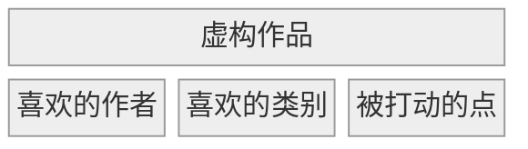

对于论述类作品，按照类型和难度[^批注3]两个角度筛选：
[^批注3]: 最好的专业入门书籍是大学基础课课本

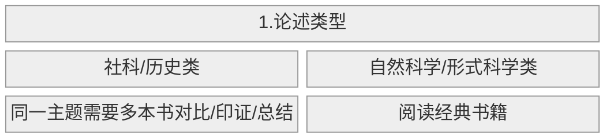

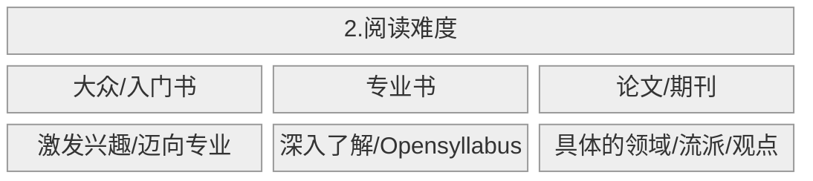

## 4. 执行：几个坚持阅读的方法

几个对我比较有启发的点：

- 不必死磕一本书，实在读不下去就放弃这本书，但是不要放弃阅读的习惯
- 同时阅读几本难度不同的书
- 追踪读书进度

## 5. 回顾

作者把从书中摘抄出来的内容称为原子笔记：

- 对原子笔记的重点进行渐进式阅读
- 不必吃透整本书，只要确保提取的部分可以运用到目前现有的知识体系即可

## 6. 输出

读完书，做完笔记，还要对新的体系进行输出。可以是写作/分享/决策[^批注4]

[^批注4]: 和[刻意练习](ref-认知训练模型.md)异曲同工

## 7. 在 AI 的大环境下，读书的意义究竟是什么？

既然现在有 ChatGPT, 还需要读书吗？
>我们需要有⾜够强的判断⼒去分辨，它究竟在⼀本正经地胡说⼋道，还是提供了⼀个可以相信的答案。或者需要有⾜够强的敏锐⼒去区分，哪些问题适合 ChatGPT 去解决，哪些不适合。

当 AI 进化为神，我们还需要读书吗？
><mark>真正的问题不是机器能否思考，⽽是⼈类能否思考。这个时代相⽐过往，更加要求我们去认识⾃⼰</mark>。

---
date: 2025-09-04
source: https://www.bilibili.com/video/BV1sFtXz3Ez2/?spm_id_from=333.1387.favlist.content.click&vd_source=bfb2e50dad8e670124c382656b85473e
---

## 总览

本视频属于大学公开课，告诉学生从两个方面做才能成功，分别是：

* 自己要做什么？包括两个方面：
  * 解决成瘾问题
  * 构建学习方法

* 和他人如何交往？包括两个方面：
  * 对于大多数人：博弈
  * 对于少数人：感情

对于第一点，可以用脑科学 + 神经科学的知识了解自己的身体发生了什么，然后改变自己；对于第二点，使用博弈论社交，用真诚培养感情

## 成瘾

下表列出了大脑中常见的激素以及它们对应的感受：

| 激素   | 感受         | 关键词             | 措施                  |
| ------ | ------------ | ------------------ | --------------------- |
| 多巴胺 | 欲望         | 可变奖励模式       |                       |
| 皮质醇 | 压力         |                    |                       |
| 内啡肽 | 快乐 → 平静  | 镇痛剂             | 冥想/大笑/音乐/运动   |
| 催产素 | 幸福/愉悦/爱 | 抵抗抑郁           | 感恩日记/去爱他人     |
| 血清素 | 专注/平静    | 与褪黑素含量正相关 | 做饭/手动/敲代码/弹奏 |

那么我们要做的就是提高内啡肽/催产素/血清素的含量，减少多巴胺和皮质醇的含量 

## 学习

学习的结果是产生记忆，记忆的本质是大脑的神经元产生新的连接

那么怎么做才能产生记忆，我们又该如何保持记忆？

* 间隔学习
* 交替刺激大脑的不同区域（链接[《精力管理》：边缘型思考](book-@精力管理.md)）
* 用自己产出的知识更容易被记住 → 费曼学习法
* 残差效应（我认为即锚点效应）：找锚点，然后看差异
* 大脑偏爱多模态处理：文字 + 图像 + 声音 + 行动 + 思维

接下来，到需要用知识的时候，如何提取记忆？

* 大脑偏爱结构和逻辑 → 分类/递进/因果/时间
* 营造熟悉的环境
* 费曼学习法

最后，作者还提出了一些其它的方法：

* 动机管理 → 自驱型成长/内在成长
* 避免学习时分心 → 听纯音乐/非母语音乐
* 睡眠 + 运动促进海马体产生新的神经元

## 与他人交往

博弈

## 培养感情

对于爱情，作者认为，如果具备以下三个品质，爱情自然而然会到来：

* 可变奖励模式
* 能做事，能抗事
* 真诚

---
title: PKM-ref-打造个人工作流-认知篇
author: yuchen_lea
date: 2024-11-07
tags:
source: https://sspai.com/post/87028
---

## Question

如何选择适合自己的笔记工具，进而搭建知识库

## Statement

一般来讲，笔记工具自带一套方法论。在讨论用什么工具之前，先问自己为什么用这个工具。要创造符合自己需求的工作流，笔记软件要做到两点：稳定可靠+阻力最小化。

## Argument

何谓稳定可靠

- 通过 Changelog/Roadmap 看发展趋势
- 通过 Interview 看设计理念
- 通过 社区/团队 看可持续性

何谓阻力最小化

- 先选择自带方法论的笔记工具用起来，不做过早优化
- 在找到工作流中的重点后，使用更靠近底层逻辑的工具进行优化
- 不要把需求和具体的方案划等号

## Conclusion

知识库的目的是为了解决实际问题。因此：

- 要带着问题进行检索，并批判地看待信息
- 通过笔记软件整理信息，加入自己的理解，最后转化为知识输出
- 要满足各类需求，需要多种工具互相配合。我们能做的是减少不同工具之间的摩擦，打造高效的工作流。

---
---

## 工具选择：重器轻用 vs. All-in-One

两个事实：

- 没有单一的工具能完全满足所有用户的需求
- 随着工具数量的增加，使用的摩擦也会增加

矛盾点：

>正是不被满足的需求和多个工具之间的摩擦，拉动我们在所谓的「重器轻用」和「all-in-one」之间来回摇摆。
>在没有限定条件的前提下，这两个方向难以指导具体事件，只能表达个人立场，最终导向为了工具而工具。

## 以输出为导向的稳定工作流

作者指出：既然对于重器/All in One 的定义不明确，与其讨论这两个方向，不如回到最原始的问题——我们选择软件是要解决什么问题？

作者的回答：我们的需求是为了把输入消化后进行某种形式的输出（外向表达型和内向决策型）。为了有一个高效的输出，需要一个稳定可靠并减小阻力的工作流。工作流的实现需要工具的辅助。那么问题就变为：在工具的选择上，如何平衡当下的探索成本和未来的踩坑代价？

作者引用了 Donald Knuth 的理念：97%的优化为时过早，剩下3%的优化依然是关键且必要的。据此，作者提出：

- 要理解工具的逻辑，抓住那 3% 的关键
- 要降低不同工具之间迁移的成本
- 工具的选择并非非黑即白，实际情况可能是五彩斑斓的灰色

要做到以上三点，对自我和工具有一个明确的认知。

## 认清自我

作者提出了认清自我的三个方面：

- 需求
  - 显性需求：笔记要契合个人认知的方法论，对于当下并非迫切的需求，不要照搬别人的系统，做过早优化
  - 隐形需求：受限于认知等因素，我们一开始提出的需求可能仅仅是「为了满足需求而做的具体方案」。因此要从更高的维度去考虑：我想解决什么问题/以现有的工具能否满足
- 时间/精力
  作者用房子的种类类比笔记软件：
  
|     房子         |     说明                                        |     软件                                |     优点                                                                    |     缺点                                                                         |
|------------------|-------------------------------------------------|-----------------------------------------|-----------------------------------------------------------------------------|----------------------------------------------------------------------------------|
|     精装房       |     自身包含了一套方法论                        |     Roam   Research/Heptabase           |     上手简单                                                                |     当新的需求出现/用久了发现不符合自己习惯时，可能出现怎么调整都不契合的情况    |
|     毛坯房       |     只定义笔记的格式和一些操作笔记的基本方法    |     Obsidian/Logseq/Emacs   Org-mode    |     简陋但客制化程度高                                                      |     处在更底层逻辑，入门门槛更高，需要付出更多的时间和精力                       |
|     Open Plan    |     模板化的底层工具                            |                                         |     先使用比较流行的配置方案，随着自己有了独特的需求后，再选择自己加组件    |     除了底层逻辑，还要了解现有模板的组装逻辑                                     |

作者的建议：

|             | 建议                      | 原因                                                                                                                                                                                |
|-------------|---------------------------|-------------------------------------------------------------------------------------------------------------------------------------------------------------------------------------|
|     新手    |     自带方法论的工具      |     新手最重要的两点需求：  1. 明确且适当的束缚：太过自由，超出能力范畴的自由只会让人无所适从  2. 从工具属性来说，使用一个能快速上手满足自身需求的工具，而不是费力去配置工具        |
|     进阶    |     靠近底层逻辑的工具    | 1. 可以在第一个方案上继续工作，不打乱输出节奏       2. 根据自身需求，认识到在原有的方法论中，哪些功能非常重要，哪些可以妥协。有了明确的目标，这些工具便可以提供充足的潜能           |

- 金钱
  - 付费之后的使用频率有多高？
  - 现有的免费方案在付出时间和精力之后，是否能达到付费方案？

## 认清工具

工具的选择标准和使用方法很难做统一评价，因此作者主要讨论了两个问题：

- 如何评价软件的付费合理性？
- 如何判断软件未来发展的趋势？

 对于第一个问题，作者认为，在讨论软件的「付费多少」问题之前，要先确定「付费种类」有哪些。作者归为以下几类：

- 开源：不仅免费，更关注用户的自由权益（liberty）
- 不开源但免费：没有开源，因此无法学习/改进
- 免费+内购：高级功能需要付费
- 完全买断制：所有功能付费买断
- 无限使用+有限升级：功能更新订阅制/大版本买断制/Freemium

对于第二个问题，作者认为以下几点需要考虑：

- 是否具备专业性？
  专业性可以从工具功能/官方博客/团队构成等角度去考虑。特别地，对于笔记软件，作者会看其是否有自己的一套方法论，比如：

- Roam Research：细颗粒度的链接
- Heptabase：手动可视化笔记提供的全局视角
- Obsidian：直观的 Markdown 编辑体验 + 可扩展性
- Emacs Org-mode：纯文本格式提供的极致自由
- 软件的发展方向是否与个人需求一致？
  - 从 Changelog 看过去功能的实现
  - 从 Roadmap 看未来规划的方向
  - 从访谈看公司/创始人是否真诚
    - 是否坦言自己的局限
    - 合理的收费机制
    - 是否关心老用户的利益
    - 合理的推出机制
- 团队
  - 开源工具由社区维护，具有未来的可持续性
  - 林迪效应（Lindy effect）：如果工具存在的时间越久，它未来可能存活的时间也越久
- 社区
  - 社区可以帮助用户解决不同层面的问题，不只是软件本身的功能配置，还包括使用软件的案例方法，这点对于知识管理类工具很有帮助
  - 社区的氛围是否理性开放

---
title: 打造个人工作流-系统篇 
author: yuchen_lea
date: 2024-11-09
tags:
source: https://sspai.com/post/87698
---

## Question

如何降低折腾工具的成本

## Statement

通过实践 $\rightarrow$ 系统  $\rightarrow$  需求  $\rightarrow$  工具  $\rightarrow$  实践的循环构建工作流。

## Argument

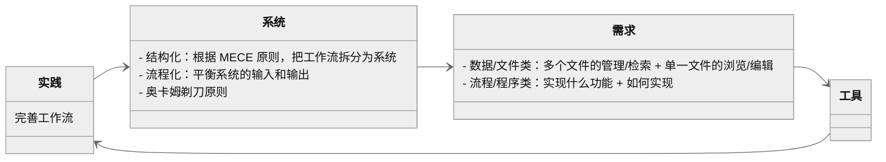

---
---

## 实践 → 系统：系统性思维看待工作流

作者认为，工具不应被视为孤立存在，而应成为某个系统的一部分​。为此，需要培养工具的系统意识。那么，如何才能做到系统化的选择工具，作者给出了两点建议：
• 结构化 
• 流程化

结构的意思是，每一个工具应该要满足其独特的需求。

流程化的意思是，输入和输出要做到平衡。对于知识管理而言，输入对应阅读，输出对应写作。如果工作流出现问题，很有可能是输入和输出之间失衡，或者理解为思考与行动之间的失衡。为此，要找到合适的处理顺序。

结构化 + 流程化，未来可以进一步实现标准化 + 自动化，并不断迭代优化，使其更加完善。

根据奥卡姆剃刀原理「​如无必要，勿增实体​」，考虑两点：
• 是不是可以让别人来做
• 是不是可以在已有系统上加工

## 系统 → 需求：在工作流中，有不同类型的需求

在 PKM-构建工作流-认知篇 中已经提到认清需求的重要性。那么如何才能选择满足自己需求的工具？作者认为，要把工作流拆解开来，使每个子工作流做到「高内聚、低耦合」，即相互独立但又紧密相关。然后根据子工作流的需求选择工具。需求分为两种：

- 数据/文件类
  - 管理：提供恰当的视图来浏览文件列表，提供文件的组织和检索功能
  - 浏览：对单一文件的浏览
  - 编辑：对单一文件的创建/修改
- 程序/流程类

数据/文件类最重要的需求是管理。传统的文件夹管理让文件只能放在单一目录。库管理工具加入了元数据管理，让检索更灵活。作者给出了几个常用的工具：

|             |     管理                          |     编辑                   |     浏览                   |
|-------------|-----------------------------------|----------------------------|----------------------------|
|     图书    |     calibre                       |     Sigil                  |     多看阅读               |
|     音乐    |     Foobar、Roon                  |     XLD                    |     Symfonium、椒盐音乐    |
|     论文    |     Zotero、JabRef                |     Adobe   Acrobat Pro    |     PDF   Expert           |
|     电影    |     tinyMediaManager、Jellyfin    |     ffmpeg                 |     PotPlayer、mpv         |
|     图片    |     Eagle、Picsee                 |     Photoshop              |     Irfanview、XnView      |

程序/流程类的需求最好使用代码实现。作者认为，一个基本的逻辑可以是「If This Then Trigger That」。This 代表 What，即实现哪些功能；That 代表 How，即如何调用这些功能。

文件和流程类的需求并非泾渭分明。作者之所以分出这两种需求，是因为这种分类可以帮助我们更好的理解工具的应用逻辑。比如，把 zotero 和 pdf expert 比较，就相当于把管理工具和浏览工具作比较，这样只会增加管理工具的复杂性。

---
source: https://www.bilibili.com/video/BV1GCJ3zHEZy/?spm_id_from=333.788.top_right_bar_window_default_collection.content.click&vd_source=bfb2e50dad8e670124c382656b85473e
author: Stephen Krashen
date: 2025-05-18

---

## 1. 观点梳理

Stephen Krashen 认为，习得语言的唯一途径，是在**低焦虑**环境中，获取**可理解性输入**（comprehensible input）。

>We acquire language in one way and only one way, when we get comprehensible input in a low anxiety environment.

首先，作者提出了可理解性输入的假设：只有理解了谈话内容（message），才能学习语言。可理解性输入的形式可以是：

- 实物教具
- 图片
- 知识/常识

借着这个假设，作者给出了一个重要推论（corollary）：

> Talking is not practicing.

作者以自己在纽约开设第二语言学习班的经历，告诉我们：

- 开口说话不是语言学习的第一步，而是所有可理解性输入积累的结果
- 说话的关键不在于你说了什么，而是对方回应了你什么

这两点的学术化表达是：交谈中真正有价值的是你从他人哪里获得的可理解性输入。

第二个重要推论是情感过滤假设（affective filter hypothesis）。

作者提出了限制语言学习的三个因素：

- 动机（Motivation）
- 自尊（Self-Esteem）
- 焦虑（Anxiety）

这三者的状态较低（尤其以焦虑为主）时，产生情感过滤：输入可以被从外界获得，但是无法传达到大脑中负责语言习得的那些区域——language acquisition device (LAD). 用图形表示为：

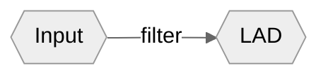

## 2. 批判性思考

### a) 同意

我们通常认为语言的学习要从四个维度进行：

- 听
- 说
- 读
- 写

而 Stephen Krashen 认为，从系统性的角度看待，有输入、学习和输出三部分内容。[Optimal Input](https://www.bilibili.com/video/BV1Hh411W7Bs/?spm_id_from=333.788.recommend_more_video.0&vd_source=bfb2e50dad8e670124c382656b85473e) 来自听和读，而说和写是语言学习的结果。

学习语言的最佳途径，是大量的阅读，尤其先从最简单的书籍开始。

### b) 质疑

---
title: PKM-ref-极简三步-我的个人知识管理工作流
author: 小梨笔记
date: 2023-08-16
tags:
source: https://sspai.com/post/81926
---

## What

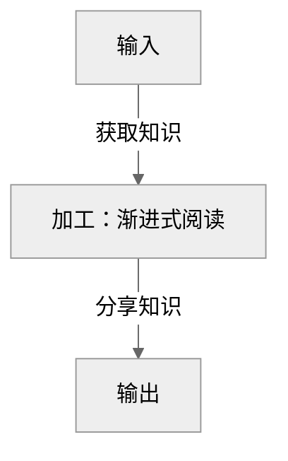

## Why

* 简化工作流步骤能让我们在状态不好的时候更好地启动和执行
* 在简化的同时也要保证工作流的完整性

## Step 1: 输入

* 纸质书[^批注4]：
    1. 封面：写下吸引自己的页面+自己对内容的看法
    2. 封底：用自己的话总结书中要点+自己可以马上付诸行动的点
    3. 消化几天，然后进行写作输出，每本书只提取三点
* 文章：
    1. 有限输入：信息时代最大的挑战不是如何获取信息，而是如何把别人的知识内化成自己的知识[^批注5]
    2. 及时阅读
    3. <mark>读完并非结束，而是知识管理的开始！</mark>

## Step 2: 加工：渐进式阅读

 1. 确定信息源的位置，方便以后查找
 2. 对所有感兴趣的部分画线
 3. 第二遍阅读，对重点加粗
 4. 第三遍阅读，对重点高亮
 5. 用自己的话对加粗和高亮进行总结
 6. 重组输出：加入自己的想法/思考/例证/创造，见 Step 3 输出

## tips: 渐进式阅读

* 渐进式阅读可以分次分批完成，不需要追求一次完成[^批注1]，因为：
  * 知识的应用需要一定的时间去沉淀
  * 每次执行的心理压力不大，有更好的动力去执行
* 不是每篇笔记都需要走 6 步，要根据笔记的内容/质量/特点，有选择的记录，一切笔记形式以思考为主
* 1-4 最好都在同一个文档中进行，可以最大程度保留上下文语境
* 在执行 3/4 时，要不停的追问：「这对我有用吗？」而非「这是有趣的吗？」
* 在执行 5/6 时，要不停的追问：「我如何用它产生新的想法？」

## Step 3: 输出

如何检验自己对知识的吸收程度？不是搭建多么完善的笔记体系，而是：

* 能否应用到实际生活/工作[^批注2]
* 能否和自己现有的知识体系产生连接，用自己的话/自身经历进行输出，然后让其他人获取到你的知识点[^批注3]

[^批注1]: 所以管理项目卡是十分必要的
[^批注2]: i.e. MVP 法则
[^批注3]: i.e. 费曼学习法
[^批注4]: 很有意思的做法，将来阅读纸质书时尝试一下
[^批注5]: 好句

## 1) What？

一种尽可能平衡压缩与语境的记录笔记的方法

## 2) How?

1. 确定信息源的位置，方便以后查找
2. 对所有感兴趣的部分画线
3. 第二遍阅读，对重点加粗
4. 第三遍阅读，对重点高亮
5. 用自己的话对加粗和高亮进行总结
6. 重组输出：加入自己的想法/思考/例证/创造

tips:

* 渐进式阅读可以分次分批完成，不需要追求一次完成，因为：
  * 知识的应用需要一定的时间去沉淀
  * 每次执行的心理压力不大，有更好的动力去执行
* 不是每篇笔记都需要走 6 步，要根据笔记的内容/质量/特点，有选择的记录，一切笔记形式以思考为主
* 1-4 最好都在同一个文档中进行，可以最大程度保留上下文语境
* 在执行 3/4 时，要不停的追问：「这对我有用吗？」而非「这是有趣的吗？」
* 在执行 5/6 时，要不停的追问：「我如何用它产生新的想法？」

## 3) Why？

为了在可发现性与可理解性中做出平衡

---
date: 2025-10-22
source: https://www.youtube.com/watch?v=fES9ZrLXY9s
---

## 1. 内容摘录

一次 Tiago Forte 和 AlexandBooks 的谈话，主题是如何阅读纸质书籍并将其转化为行动

### a) 如何捕捉笔记？

制作自己的目录：

1. Highlight 重点/感兴趣的内容
2. 在书的扉页写下对应的页码和内容

写下 Lessons Learned:

- 写什么？
  - 可以执行的建议
  - 定期 review  
- 怎么写？
  - 用自己的话构建句子
  - 如果它非常重要，可以加上星标
- 写多少？
  - 最多只写三点
 
### b) 什么时候记笔记？

取决于书籍的类型：

- 连贯的学术著作：读完一章再记录，对出现的重点内容折页标记
- 独立段落：随看随记

记录会打断阅读的心流，要做好二者之间的平衡

### c) 如何实现笔记的数字化？

笔记软件的选择标准：

>Simplicity over Complex.

- 把 Apple Notes 当作 Foundation
- 如果当前软件无法满足你的需求，或者你需要更多的 Features, 再去寻找新的 APP

## 2. 批判性思考

关于 c): 即应该遵循[奥卡姆剃刀](https://en.wikipedia.org/wiki/Occam%27s_razor)原理

---
source: https://www.bilibili.com/video/BV1SN41117oY/?spm_id_from=333.1387.favlist.content.click&vd_source=bfb2e50dad8e670124c382656b85473e
date: 2025-10-26
---

## 1. 观点梳理

为何戒瘾如此痛苦？因为我们大多数人属于：

- 认知觉得必须努力
- 情绪不想努力
- 行为间接努力

UP 主的观点主要来源于以下几本书：

- 《基因彩票》by 凯瑟琳 · 佩奇 · 哈登
- 《大脑通信员》by 赵思家
- 《成瘾》by 安娜 · 伦布克

a) 多巴胺的功能 

1. 行为选择：奖励系统[^1]
2. 运动控制：为了满足感而产生的行动
3. 强化学习：行动后大脑的强化倾向学习

[^1]:特指由于预测误差而产生的奖励，进而愉悦感

b) 关于多巴胺需要正视的两个点

- 渴望/欲望 ≠ 喜欢
- 分泌多巴胺后，人并不会快乐[^2]

[^2]: 来自《成瘾》：由于大脑中产生快乐与痛苦的区域高度重叠，多巴胺产生大量快乐之后，随之而来的是等量的痛苦

c) 如何降低多巴胺

- 宣誓
- 物理隔离成瘾源[^3]
- 梳理成瘾源，然后尽量控制
- 不要独处
- 正念抽离
- 运动[^4]

[^3]: 联想到了[ref-战略性懒惰](ref-战略性懒惰.md)中提到的主动设计环境，从而让成瘾的阻力最大化
[^4]: 运动消耗肌肉糖原，大脑为了抑制疼痛会分泌内啡肽止痛，从而感到快乐——来自《为什么精英这样用脑不会累》

d) 多巴胺与内啡肽的区别 

多巴胺：伴随亢奋，分泌忽高忽低

内啡肽：伴随平静，持续分泌

本质上，还是身体的平衡机制在发挥作用：如果我们先做一些痛苦的事情，那么平衡机制的天平就会往快乐倾斜

## 2. 批判性思维

---
title: PKM-ref-使用卡片盒笔记遇到的困难和解决方案
author: 和燕燕
date: 2022-02-03
tags:
source: https://sspai.com/post/71274
---

## Question

如何分类闪念/文献/永久笔记？

## Statement

作者认为，不必照搬卢曼所说的每一种卡片。
作者把闪念、文献、永久、项目、索引五种卡片简化为三种，并创建了三步走流程：

* 第一步是多途径搜集「闪念笔记」
* 第二步是整理、汇总「闪念笔记」，深入思考，形成「常青笔记」
* 第三步是笔记积累到一定程度之后建立「索引笔记」，帮助梳理个人知识系统结构

## Argument

名词解释：

* 闪念：所有临时的记录，其最终归宿全部指向长青笔记
* 长青：<mark>所谓的永久笔记在实践中并非永久，也许使用长青一词更适合</mark>。此类笔记是所有经过自己系统加工的内容，需要不断地定期回顾/加工/完善
* 索引：所有有关联的长青笔记的索引目录

## Conclusion

1. 及时记录 FN
2. <mark>定期整理/回顾/完善 FN</mark>
3. 重视笔记之间的链接，通过<mark>索引笔记</mark>实现自上而下和自下而上之间的平衡

---
---
## 写作目的

对于知识体系，如何实现自下而上和自上而下的互动和平衡

## 作者在实践卡片盒笔记时的三个困境：

### Q1: FN 用完就扔？

看之前留下的批注，可能会产生新的灵感，这种灵感建立在阅读批注而非阅读原文之上。对于需要反复阅读的文章/文献，读完就扔并不合适[^批注1]

### Q2: PN 写完就不改了吗？

正是因为要带着批判的思维阅读，在阅读的深度和广度增加后，最早的笔记也许会不断地修改完善

### Q3: 项目笔记不重要？

记笔记的过程可以看作一个项目，有项目就需要对其进行管理。如何管理记笔记呢？

## 作者的解决之道

作者把卢曼的五种卡片重新按照笔记内容和笔记管理两个维度进行分类：

* 不区分闪念/文献/永久笔记，统一称作常青笔记 EN
* 使用项目/索引笔记来串联笔记/辅助协作，建立知识结构

记笔记的步骤为：

1. 多途径搜集 FN
2. 整理/汇总/思考 FN，形成 EN
3. 笔记积累到一定数量后，建立索引笔记，帮助梳理个人知识结构

## 项目笔记是平衡自下而上和自上而下的工具

项目笔记和 FN/EN 之间是双向的，即：

* FN/EN —> 项目： 自下而上
* 项目 —> FN/EN： 自上而下

在记笔记的过程中，不断地双向链接项目笔记和 FN/EN，实现自上而下和自下而上的平衡。

[^批注1]: 所以对于网络文章最好还是先下载保存到本地

---
author: yuchen_lea
date: 2024-11-10
title: PKM-ref-不要神话双链笔记
tags:
source: https://sspai.com/post/65273

---

## Question

双链笔记/卡片盒笔记法 (Zettelkasten) 真的可以提高生产力吗？

## Statement

尽管传统的层级结构笔记有诸多痛点，双链简化了笔记之间建立关联的过程，但是不要一味地迷信双链，因为这会让使用者忽略主动思考的过程。任凭双链自由生长只能带来一团乱麻。只有经过思考，才能设计出适合自己的系统结构。

## Argument

大部分吹捧双链的文章/视频的逻辑如下：

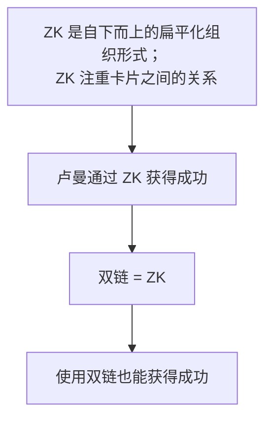

作者认为这样的逻辑是存在缺陷[^批注1]的：
[^批注1]: 一味的吹捧双链并不是一个健康的生态环境，接受「自下而上」并非要完全否定「自上而下」

1. 在使用扁平化的、以输出为导向的卡片之前，卢曼的第一个卡片盒是自上而下的、更偏向传统结构的层级形式。这是否说明只有经过一定系统学习的积累才能转为输出？
2. 卢曼每写一张卡片都要对其编号，编号的过程对应层级结构的分类
3. 卢曼写完卡片后还会阅读与之关联的其他卡片，这似乎对应了双链功能。然而，双链只体现了引用和被引用的关系，笔记之间是同级关系，无法突出核心笔记

## Conclusion

做笔记的目的用十二字概括[^批注2]为：
[^批注2]: 好句

- 用得着
- 想得起
- 找得到
- 记得住

不管是层级化还是扁平化的结构，我们首先要明确的是记笔记的目的，不要过多纠结于形式。然后理清自身需求，设计最小可用系统 (Minimum Viable Product)，最后再不断迭代优化[^批注3]。

[^批注3]: 其实这里和[老强](ref-认知训练模型.md)的观点不谋而合

---
---
## 传统笔记的缺陷

传统笔记的层级结构有几大缺陷：
	• 只能按照一种方法分类，很难实现 MECE 原则
	• 不方便检索查找
	• 不利于发现笔记之间的联系
	

## 卡片盒笔记法真的有用吗

作者指出，大部分文章的逻辑链条为：

a. 卢曼自下而上地生成卡片 → b. 卢曼重视在笔记之间建立联系 → c. 现在的双向链接就是卢曼卡片盒笔记法的软件实现 → d. 得益于卡片盒笔记法，卢曼从公务员成为德国当代重要的社会学家，因此这种扁平化的组织形式是十分有效的。

然而这样的逻辑链是值得商榷[^批注4]的。
[^批注4]: 卢曼搞学术研究是否能和我们的日常生活划等号？卢曼的社科研究是否也可以用于其他领域？卢曼生活的年代是否有其科技发展的局限性？网上吹捧的卡片盒笔记法是否全部反映了卢曼的笔记思路？

首先，a 和 d 的有效性不足。在以输出为导向的、没有严格层级划分的第二个卡片盒笔记法之前，卢曼还有一个预置了树形结构的、更贴近传统笔记的卡片盒。那么，第二个是否是第一个的升级版？作者认为，只有经过系统的学习之后，才能从积累转为输出。

其次，b → c 和 c → d 的逻辑也有问题。卢曼的卡片盒笔记法有两个流程：
	1. 给卡片编号
	2. 编号之后重新阅读邻近卡片的内容，增强联系
在思考给卡片编号的过程其实就对应了层级结构的分类。双链快捷的编码功能让使用者缺少了人工思考阅读的过程。因此双链并不能全面的反映卡片盒笔记法。

## 双链的缺陷

1. 并非所有类型的笔记都适合双链。比如菜谱、会议纪要等笔记之间本身就不会产生太多关联
2. 过分信任无层级的网络结构，会让双链无序生长，最终形成的神经网络是一团乱麻[^批注5]
3. 本质上，双链描述的是笔记之间引用和被引用的关系。二者之间只有关系而缺少关联度。这会让笔记之间是只能是同级关系，无法像层级结构那样突出核心笔记。

[^批注5]: 建立链接是为了方便我们记完笔记之后，定期的回顾/总结/吸收/对比/交叉验证。如果缺少了后者，单纯的建立链接将毫无意义。换言之，即使没有双链，只要能做到定期回顾，知识体系同样可以建立起来。

## 重新思考笔记

不论是自上而下的层级（标签/目录），还是自下而上的双链，其目的都是尽可能消除笔记内容和搜索的不确定性。消除不确定性的信息必定是带有结构性的。结构绝对不会自发生长出来，而是经过思考设计出来的。[^批注6]

[^批注6]: 同样的观点在[ref-极简三步-我的个人知识管理工作流](ref-极简三步-我的个人知识管理工作流-少数派.md)也有提及

---
source: https://www.bilibili.com/video/BV1sM91YCE7R?spm_id_from=333.788.videopod.sections&vd_source=bfb2e50dad8e670124c382656b85473e
author: 何夕夕与书
date: 2025
---

## 1. 内容摘抄

基因存在三种选择机制，分别对应弗洛伊德的精神三大部分：

| 弗洛伊德结构 | 选择方式 |
|--------------|----------|
| 自我 (das Es)        | 智能选择         |
| 本我 (das Ich)        | 性选择/生存选择         |
| 超我 (das Über-Ich)        | 亲缘选择         |

基因的算法就是最大化复制概率，它只在乎你能否顺利生育，确保后代存活
一旦任务完成，基因并不在乎载体死活

所谓亲缘选择，是基因计算出的投资优先级：

- 基因相似度
- 繁殖潜力

关于性选择，男女的择偶理念不同：

- 男性
  - 年轻漂亮
  - 忠贞——理性保守  
- 女性
  - 资源地位
  - 忠诚——心理性依恋

为何会有智能选择？因为基因对环境的反应太慢，大脑的临场决断让我们做出繁衍最优的选择

## 2. 批判性思考

### a) 同意

### b) 质疑

---
source: https://www.bilibili.com/video/BV1P5QGYCENH/?spm_id_from=333.1387.favlist.content.click&vd_source=bfb2e50dad8e670124c382656b85473e
author: 何夕夕与书
---

## 1. 观点梳理

### a) 催产素的基本概念

- 促进分娩和哺乳的激素
- 来自下丘脑
- 好处：
  - 促进血清素 → 平静从容
  - 降低皮质醇 → 减少压力和焦虑
  - 感到温暖和幸福
- 加压素 (AVORIA) ≈ 男版催产素

### b) 如何分泌催产素？

- 亲密关系（家人、伴侣、子女）
- 萌物（小孩、宠物）
- 亲社会行为（团结他人、合作）

### c) 催产素的代价

- 过度信任 （例如：直播间带货）
- 非理性
- 种族歧视

### d) 催产素的社会意义 

催产素和加压素都会加强敌我意识，不同之处在于：

- 催产素：对自己温柔
- 加压素：对敌人攻击

在人与人的层面，催产素可以加强情感纽带

在社会/群体层面，催产素会增加内群体偏见 (in=group bias)

### e) 亲密关系 

宠物 ≈ 更低养育成本的幼崽；朋友 ≈ 可选择的亲人

在[基因篇](ref-人性矩阵系列-01-基因.md)中提到基因的亲缘选择和性选择

亲缘选择对应亲情，性选择对应忠诚，再加上朋友的友情，构成了我们的亲密关系

良好的亲密关系让我们幸福，而幸福是健康的保证

## 2. 批判性思考

### a) 同意

### b) 质疑

---
source: https://www.bilibili.com/video/BV1aYoXYnER1/?spm_id_from=333.1387.favlist.content.click&vd_source=bfb2e50dad8e670124c382656b85473e
author: 
date: 2025-10-23
---

## 1. 观点梳理

### a) 睾酮的基本概念

睾酮是一种和斗争有关的激素：

- 感受：斗志昂扬
- 心理行为倾向
  - 竞争和攻击性
  - 渴望权力和地位
  - 自利、自我导向
- 影响因素
  - 短期
    - 性感元素
    - 竞争环境
    - 竞争结果

  - 长期
    - 年龄
    - 婚育状况（单身 ＞ 结婚 ＞有娃）

- 高睾酮个体如何促进合作
  - 本身是领导者
  - 作为下属，等级制度清晰

### b) 睾酮与催产素的关系

|                | 睾酮               | 催产素             |
| -------------- | ------------------ | ------------------ |
| 演化来源       | 性选择             | 亲缘选择           |
| 行为倾向       | 利己               | 利他               |
| 合作倾向       | 激发斗志           | 强化团结           |
| 镜像神经元     | 同情减少           | 同情增加           |
| 分别心         | 高下之分           | 敌我之分           |
| 马斯洛需求层次 | 权力、地位         | 认同、归属感       |
| 类似激素       | 雌二醇（情商相关） | 加压素（守护相关） |

可以把催产素看作“我们 | 他们”组成的同心圆，而睾酮是“老大 | 小弟”组成的金字塔[^1]

[^1]: 弹幕中说，其实可以把他们看作三维模型的两个不同视图

### c) 父爱的生理基础

- 通过识别图像信号产生催产素 → 亲密关系
- 保护欲来自加压素
- 通过识别生物信号产生催乳素[^2] → 养育、呵护

[^2]: 催乳素和多巴胺相互拮抗，可以压制睾酮分泌，让男性退出雌性竞争市场

### d) 从睾酮引出的社会行为分析：为何会出现一夫一妻制

人类持续进化：

- 大脑生长
- 直立行走

这导致人类在生理上出现一个问题：

- 脑袋太大
- 骨盆太小

从而造成沉重的育儿负担：

- 分娩痛苦
- 婴儿脆弱的幼年
- 小孩漫长的同年

在如此沉重的育儿负担下，基因开始奖励那些专一的父亲，于是便产生了一夫一妻制[^3]

[^3]: 从另一方面来说，由于人类是群体生活，这从某种程度上让这种制度打了折扣

因此，女性的择偶偏好是拥有资源和地位的男性，这正是男性性选择的演化压力

### e) 延伸书籍

- 互助论：无政府主义，各个组织互助团结
- 利维坦：人类生活必须要有秩序
- 蓝图：通过各种沉船事件说明，文明来自不平等

## 2. 批判性思考

### a) 同意

### b) 质疑

---
source: https://www.bilibili.com/video/BV1KDdUYbEB2?spm_id_from=333.788.videopod.sections&vd_source=bfb2e50dad8e670124c382656b85473e
author: 何夕夕与书
date: 2025-02-28
---

## 1. 观点梳理

> 一个注定失败，但是可能有用的尝试，系统化理解人性 →  Decode the Matrix

情绪受到三个单胺类物质影响：

- 血清素
  - 受四个维度影响，即[马斯洛需求层次理论](https://zh.wikipedia.org/zh-cn/%E9%A9%AC%E6%96%AF%E6%B4%9B%E9%9C%80%E6%B1%82%E5%B1%82%E6%AC%A1%E7%90%86%E8%AE%BA)
    - 阳光、饮食、睡眠、运动
    - 杏仁核：安全感
    - 催产素：亲密、归属
    - 睾酮：胜利、权位

- 多巴胺
  - 内啡肽是快感本身，而多巴胺是对快感的期待[^1]
  - 多巴胺是我们建立习惯的核心物质，也是造成上瘾行为的罪魁祸首[^2]

- 去甲肾上腺素 (NE)
  - 人在高度注意或者意外出现时产生 NE [^3]

[^1]: 即习得的过程
[^2]: 即贪、嗔、痴
[^3]: 其作用和肾上腺素相同，不同在于 NE 作用于大脑，肾上腺素作用于身体

这三种物质可以如下总结：

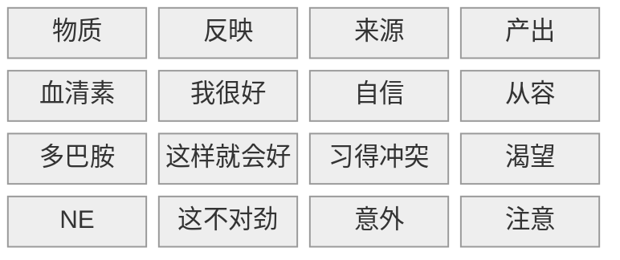

这三种物质组成了八种情绪，称为“三胺八情”：

| 情绪 | 血清素 | 多巴胺 |  NE  |
| :--: | :----: | :----: | :--: |
|  乐  |   高   |   高   |  高  |
|  安  |   高   |   低   |  低  |
|  怡  |   高   |   高   |  低  |
|  惊  |   高   |   低   |  高  |
|  怒  |   低   |   高   |  高  |
|  怯  |   低   |   高   |  低  |
|  惧  |   低   |   低   |  高  |
|  悲  |   低   |   低   |  低  |

然而这个模型过于理想化，原因有三：

1. 只给出了基础情绪，而忽略了认知系统（例如内疚、羞耻、后悔）
2. 二元化：每种神经递质只有高和低两种状态
3. 匹配方式分歧：
   1. 语言的模糊性：情绪无法用单一词汇描述
   2. 观测手段局限：目前无法有效测量不同情绪下对应的神经递质浓度

于是，作者给出了修正模型：

| 情绪   | 精神疾病 | 血清素 | 多巴胺 | NE   |
| :----: | :------: | :----: | :----: | :--: |
| 乐     |          | 高     | 高     | 高   |
| 安     |          | 高     | **中** | 低   |
| 怡 |          | 高     | 高     | 低   |
| （理想化的）惊 |          | 高     | **中** | 高   |
| 怒/慌     |  狂躁症  | 低     | 高     | 高   |
| 怯     |  拖延症  | 低     | 高     | 低   |
| 深层恐惧     |  焦虑症  | 低     | 低     | 高   |
| 悲     |  抑郁症  | 低     | 低     | 低   |

其中，准确度较高的情绪有：

- 乐
- 安
- 怡

由此可见，只要血清素高，对应的情绪就不可能是负面的。三胺都低会产生抑郁症已经是主流看法，而焦虑症和狂躁症也有较多理论支持。有论文认为，三胺并非互相独立，高血清素会抑制多巴胺与 NE. 因此，怯是否存在尚且存疑。但是作者出于工整性的考虑还是给出了这个情绪，对应拖延症。

作者还以创作喜剧的底层逻辑为例，解释了喜剧让人发笑的原因：

- 血清素对应优越论
- 多巴胺对应不协调论
- NE 对应反转

最后，作者认为，当你无法意识到三胺的存在时，你正在被它们控制；当你能意识到它们的存在时，你就可以控制它们，利用三胺成为更好的自己。

## 2. 批判性思考

### a) 同意

### b) 质疑

---
source: https://www.bilibili.com/video/BV1Rj53z3EoX/?spm_id_from=333.1387.favlist.content.click&vd_source=bfb2e50dad8e670124c382656b85473e
author: 
date: 2025-10-24

---

## 1. 观点梳理

### a) 自由能原理

大脑是一台预测机器，其所有运算只为了一个目的——最小化惊讶量和复杂度

自由能 (Free-Energy) 的概念由 Karl Fristan 提出，可以理解为变分的贝叶斯公式，其公式为：

自由能 = 预测误差[^1] + 复杂度[^2]

[^1]: 惊讶量
[^2]: 信息熵

### b) 大脑的活动

有了自由能的概念，我们可以说，大脑的一切活动都是围绕**最小化自由能**这个目标展开的，分为四个方面：

1. 感知
2. 注意
3. 行动
4. 学习

**i) 关于感知：**

我们的一切感官输入：

- 像素
- 亮度
- 触感
- 频率
- 颜色

经过大脑的知觉系统[^3]，最终转化为认知系统，从而形成：

- 符号
- 概念
- 描述

等抽象性的东西

[^3]: 大脑内置的图像识别系统

所谓感知，就是感官系统 + 知觉系统，它把外部世界的输入做第一重简化，是谓脑补

**ii) 关于注意：**

感知输入如此之多，大脑显然需要做集中处理，这就是大脑的第二道筛选机制——注意力

和注意力相关的激素有：

- NE: 对输入的特定信号进行加权处理
- （背景式的）全局 NE: 对所有输入都十分敏感 → 警觉状态
- 血清素：对原本模型的信任度

以上，可以总结一个情绪表格：

| 模型可靠？    | 警觉状态   | 情绪 |
| ------------- | ---------- | ---- |
| 是 → 血清素高 | 全局 NE 高 | 专注 |
| 否 → 血清素低 | 全局 NE 高 | 躁动 |

**iii) 关于行动：**

根据自由能公式，大脑要最小化惊讶量，那么人类为什么还要主动探索未知？因为人类希望把未来的潜在收益贴现到当下的决策，这就是好奇心的来源

好奇心是一种特殊的行为动机，当满足以下两点时，大脑会释放**乙酰胆碱**，从而好奇心爆棚：

- 高血清素：当下的模型是可靠的，大脑愿意做进一步的探索
- 高的潜在探索价值

**iv) 关于学习：**

强烈的好奇心促使我们进行学习，和学习相关的激素是多巴胺[^4]

[^4]: 强化学习中的学习信号——奖励预测误差 (RPE) 即模拟多巴胺在大脑中的作用

学习是为了调整内部模型，从而更好地预测世界，减小惊讶误差

真正的学习发生于不断提前的结果预期：我知道这样做可以改善预期

多巴胺并不庆祝结果本身，而是在庆祝预期的改善

当结果超出预期，大脑便会释放多巴胺

而多巴胺可以理解为一种中间传递机制，重点则是**内啡肽**带来的纯粹快感

内啡肽与痛感（p 物质）互相拮抗，产生于以下三种情况：

- 性
- 食物（辣）
- 三胺俱高的状态：大笑、顿悟、心流

### c) 小结

| 大脑活动 | 感知 | 注意 | 行动   | 学习   |
| -------- | ---- | ---- | ------ | ------ |
| 对应激素 |      | NE   | 血清素 | 多巴胺 |

需要说明的是，这里所讲的大脑活动（或者说自由能原理），是狭义的计算大脑，不包含外来动机的纯粹预测工具，来自单纯的智能选择的演化压力

外源性动机包括：

- 内啡肽
- 催产素
- 睾酮

而情绪则是内部和外部的连接点，一方面受外来动机影响，一方面也是大脑运行的中间参数

### d) 自由能原理与康德

既然自由能原理来自贝叶斯理论，那么我们可以说：

我们从未理解真正的世界，而是生活在自己构建的世界中

这恰好符合康德的先验范畴：

- 因果论是我们人类认知世界的工具，而并非世界的本质

- 而世界的本质是不可知论

## 2. 批判性思考

### a) 同意

### b) 质疑

---
source: https://www.bilibili.com/video/BV16BNLzgEdJ/?spm_id_from=333.788.videopod.sections&vd_source=bfb2e50dad8e670124c382656b85473e
author: 
date: 2025-10-25
---

## 1. 观点梳理

### a) 智商 ≠ 认知

- 智商 = 特定模型下的运算能力
- 认知 = 建立模型的过程，从而理解、预测这个世界

### b) 认知系统的构成

- 符号：最底层元素
  - 是专有名词
  - 其意义由它所嵌入的整个意义网络决定
- 概念：多个符号类比形成
  - 学习任何一门学科，本质就是掌握这门学科的核心概念，以及他们之间的组织结构
- 命题：多个概念类比、扩张
- 认知：多个关联命题构成的模型

### c) 类比

可以看到，从符号到模型，类比作用于每一个层面

然而，类比仅仅是思维的起点，我们还需要现实的反馈：

- 概念生成 → 定义
- 命题推演 → 逻辑
- 模型适用 → 验证

### d) 范式转化

在[自由能](ref-人性矩阵系列-05-大脑.md)公式中，复杂度这一项可以拆分为两项：
$$
\begin{align}
自由能 &= 预测误差 + 复杂度 
    \\&= 预测误差 + 后验熵 - 先验损失
    \\&= 准确性 + 简洁性 - 保守性
\end{align}
$$
大脑具有保守性，其生物基础为：

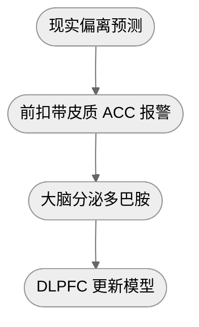

放到整个社会发展的进程[^1]中，可以理解为：

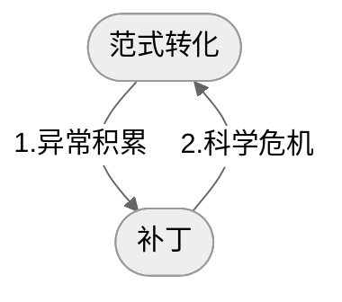

[^1]: 来自《科学革命的结构》

### e) 思维偏误[^2]产生的原因

- 两个思想钢印：
  - 我很好 → 和血清素相关
  - 世界很公平 → 和杏仁核（道德公平）相关
- 元认知长期由系统一[^3]主导
  - 系统一：
    - 包括以下三点：
      - 思维惯性：来自于此前的环境和观念
      - 潜意识：来自于激素（多巴胺、睾酮、催产素 etc.）和思想钢印
      - 态度系统：高度简化的行动指南，来自于 VMPFC
    - 特点是快捷、节能、高效
    - 极致状态是心流，此时负责认知的 DLPFC 关闭
    - 缺点：一旦环境发生变化就会无法适应
  - 系统二：认知模型
- 安抚机制
  - 通过抱怨/自怜的形式短暂安抚 ACC, 从而逃避xian'shi

[^3]: 来自《思考，快与慢》
[^2]: 来自《清晰思考的艺术》

## 2. 批判性思考

### a) 同意

### b) 质疑

---
source: https://www.bilibili.com/video/BV1xPgVzWETq/?spm_id_from=333.1387.favlist.content.click&vd_source=bfb2e50dad8e670124c382656b85473e
date: 2025-10-26
---

## 1.观点梳理

### a) 什么是态度？

根据上一期提到的认知系统中的最小单位——符号，我们可以说，态度系统是映射在符号上的好坏判断

由此，可以引出符号在态度系统和认知系统中的生物学基础：

| 符号     | 一致性依据         | 大脑信号 |
| -------- | ------------------ | -------- |
| 态度系统 | （无逻辑的）一致性 | VMPFC    |
| 认知系统 | 逻辑一致性         | DLPFC    |

### b) 态度系统的规律

根据《影响力》一书，态度系统符合三个原则：

- 喜爱原则：与临近符号保持一致
  - 行为表现：选择/逃避
  - 功能：反应模式
- 从众原则：与群体保持一致[^1]
  - 行为表现：支持/反对
  - 功能：敌我识别器
- 一致原则：与过往行为保持一致
  - 表现为行为和态度互相影响，见津巴多：《态度改变与社会影响》

[^1]: 根本性的思想改变总是伴随着群体归属感的转变，改变态度 = 改变群体认同

### c) 如何说服他人？

- 能不说服，就不说服[^2]
- 先同步，再影响[^3]
- 先行为，再归因[^4]

[^2]: 最好的说服是：你说出了我想说的话
[^3]: 同步的意思就是尽量先和他人的保持一致，避免他人触发敌对识别器
[^4]: 绕开态度，直接影响他人的行为。行为发生后，让他人自己找到与行为一致的态度理由

### d) 影响行为的因素

根据津巴多：《态度改变与社会影响》一书，人总是先行为再归因，那么哪些因素在潜意识中会影响行为呢？

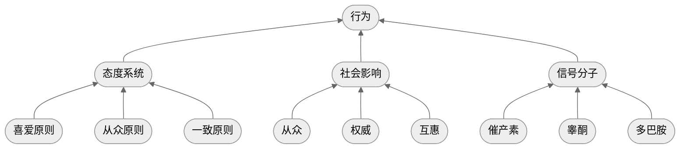

当行为被追问理由，归因系统被激活，反过来调整态度系统，进而塑造自我认知

### e) 总结

在原始采集社会，态度系统可以很好的给出反应，识别敌我，强化群体边界；

在现代社会，由于态度系统和认知系统经常混杂在一起，会导致很多冲突与荒谬：

- 观点碰撞 → 立场对轰
- 路线之争 → 派系之争

因此，我们要实事求是，回到问题和现实本身，弱化态度系统的干扰，这样才能：

- 减少对立 → 通向团结
- 深化认知系统，从而产生更深刻的理解

佛家所谓“不二”，即消除分别心，指的是在认知上理解差异的同时，不执着于它们带来的好与坏：

- 把所有词汇当作中性词
- 不要想着赢得争论，而去考虑如何获得成长

## 2. 批判性思维

---
source: https://www.bilibili.com/video/BV19yeLzTEkh/?spm_id_from=333.1387.favlist.content.click&vd_source=bfb2e50dad8e670124c382656b85473e
date: 2025-10-26
---

## 1.观点梳理

### a) 什么是公共知识 (Common Knowledge)?

- 公共知识[^1] ≠ 每个人知识的总和
- 公共知识 = 无限递归[^2]的知识状态
- 公共知识独立于每个人内心存在

[^1]: 注意与另一种公共基础知识做区分：包括政治、法律、经济、管理、历史、地理、科技等在内的综合性知识考试科目
[^2]: 群体中的每个人不仅知道某个事实，而且知道其他人也知道这个事实，并且其他人知道其他人也知道……以此类推到无限层级

### b) 大脑是如何处理公共知识的？

首先要了解前额叶皮质 (Prefrontal Cortex), 简称 PFC

PFC 位于大脑皮层，负责理性认识与决策

PFC 的主要组成如下：

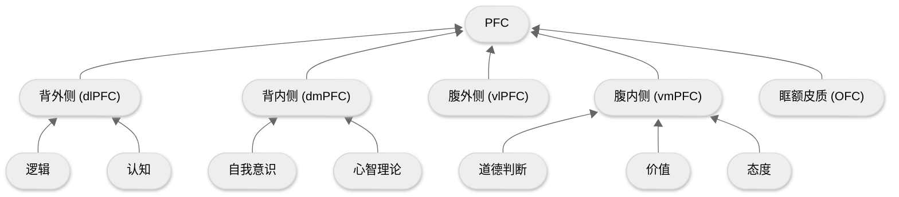

其中，和公共知识相关的部分是心智理论 (Theory of Mind), 又称为他心理论，即一个人理解他人内心状态的能力，这是社会认知的基础，由此诞生了同情、合作、欺骗、道德判断等复杂行为

可以说，为了简化他人的内心世界， dmPFC 在大脑中单开了一个模拟器进行模拟：

| 心智理论维度          |      | 模拟他人的 |
| --------------------- | ---- | ---------- |
| 理解他人知道什么      | →    | 信念       |
| 理解他人喜欢/厌恶什么 | →    | 态度       |
| 理解他人想要什么      | →    | 意图       |
| 理解他人认同什么      | →    | 道德       |

公共知识可以被视为一种高阶的心智理论，是模拟器中的模拟器，在这个公共的舞台上，存放着：

- 公共的信念
- 公共的态度
- 公共的道德
- 公共的欲望

在[态度](ref-人性矩阵系列-07-态度.md)中提到过：

> 自我的态度与群体态度保持一致

这里的群体即公共知识范畴下的态度，由此可以推而广之：

| 心智理论（自我） |      | 公共知识（群体） |
| ---------------- | ---- | ---------------- |
| 态度             | →    | 意识形态         |
| 欲望             | →    | 货币             |
| 道德             | →    | 法律             |

### c) 为何群体总是不理性？

了解了公共知识的概念之后，作者进而试图解释勒庞提出的问题：为何群体总是不理性？

在《乌合之众》一书中，勒庞提出：

> 群体总是情绪化的，只能接受简单鲜明的观念，几乎没有能力容纳复杂而细腻的理解

由于认知的提升很困难，但态度的同步极快

这就导致**在群体中大多缺乏必要的公共知识，而符号/态度系统会迅速成为主导**

更进一步，勒庞定义了异质群体：

> 越是临时构成且成分复杂的群体，越容易极端化和情绪化

一个很好的例子就是热搜话题广场，大多成为二极管思维的互撕现场

相反，同质共同体[^3]的一个例子就是学术共同体：只要在论文中给出引用，便可以将理解的义务甩给读者

[^3]: 所以说，义务教育是很必要的，它保证了公共知识的下限

### d) 公共知识是如何存在以及改变的？

公共知识通过语言公之于众，输入到公共符号的秩序之中

而媒体（广播、报纸、电视、网络）是语言的重要传播形式

只有改变在公共场域的信息，才能影响公共知识[^4]的运行

[^4]: 作者类比拉康的他者，称其为大他者

### e) 共同体

不论是国家、公司还是组织，这些共同体的背后是依靠想象而构建的公共知识，是隐形的秩序

共同体依靠义务教育和媒介发展，具有同时性[^5]

[^5]: 即使人与人互相陌生，但由于媒介的发展，让不同地区的人们身处同一个公共广场，从而产生同步的信息体验

智人与其它生物最大的不同在于，智人会讲故事并相信那些不存在的东西

正是这些想象，构成了各种各样的共同体

## 2. 批判性思维

---
source: https://www.bilibili.com/video/BV17An2z8Eow/?spm_id_from=333.1387.favlist.content.click&vd_source=bfb2e50dad8e670124c382656b85473e
date: 2025-10-26
---

## 1.观点梳理

本视频分别介绍了道德四要素：

- 同情
- 公平
- 团结
- 守序

### a) 同情

叔本华[^1]认为，同情 (Mitleid) 是道德的基础，共苦 ＝ 同情；

亚当斯密认为，其它美德都是同情的衍生物[^2]

[^1]: 叔本华认为，如果一个人只是出于理性的义务而行动，这只是在满足自己的理性一致性；只有同情心驱使的行动是超越了个体的，才是真正的道德
[^2]: 出自《道德情操论》

同情心的神经学基础是镜像神经元

### b) 公平

公平分为三个默认模块和一个自定义模块：

- 默认模块：
  - 互惠[^3]
  - 诚信[^4]
  - 分配的相对平等
- 自定义模块：vmPFC （生理基础）
  - 道德是一种特殊的态度系统
  - 道德与以下三点保持一致：
    - 群体行为
    - 相似行为
    - 过往行为

[^3]: 来源于催产素，进而产生报复/感恩等心理
[^4]: 说与做一致 = 诚；做与说一致 = 信

### c) 团结

团结的心理学基础是：内群体偏见 (in-group bias)

团建是一种有边界感的道德 → 在边界处容易与公平原则相撞

团结具有两面性：

- 凝聚力
- 排他性

### d) 守序

尼采认为，道德是弱者的武器，是一种弱化的暴力，源于对强者的嫉妒与怨恨；[^5]

[^5]: 来自《道德的谱系》

马克思认为，道德是统治阶级意志的体现，实质是为统治阶级的利益服务；

二者都把道德指向对现有权力的维护

### e) 总结

| 道德 | 正向 | 反向 | 传统美德   | 生物基础   | 来源            |
| ---- | ---- | ---- | ---------- | ---------- | --------------- |
| 同情 | 关心 | 伤害 | 仁         | 镜像神经元 | 意图模拟机制    |
| 公平 | 正直 | 作弊 | 直、廉、信 | vmPFC      | 互惠合作        |
| 团结 | 忠诚 | 背叛 | 义         | 催产素     | 亲缘 + 群体选择 |
| 守序 | 顺从 | 扰乱 | 忠、孝、礼 | 睾酮       | 社会规训        |

## 2. 批判性思维

---
date: 2025-10-27
source: https://www.bilibili.com/video/BV1H3jEz1EsD/?spm_id_from=333.1387.favlist.content.click&vd_source=bfb2e50dad8e670124c382656b85473e
---

## 1. 观点梳理

### a) 皮质醇的基本概念 

按照时间维度，可以列出下面的矩阵：

| 时间 | 来源 | 感受 | 三胺  |
|----|----|----|-----|
| 短期 | 危险 | 恐慌 | 低高高 |
| 长期 | 压力 | 压力 | 低低高 |

### b) 皮质醇的直接影响

- 免疫系统抑制
- 代谢下降，肥胖上升
- 心血管损伤
- 消化系统损害

### c) 皮质醇的间接影响

性腺压制：

- 肌肉流失、骨质酥松
- 皮肤老化
- 生殖系统障碍[^1]

[^1]: 男性精子质量下降；女性月经失调

大脑改变：

- 记忆力下降 → 记忆中枢
- 难以专注、拖延 → 理性中枢
- 降低动力 → 奖励系统
- 激活杏仁核 → 更加焦虑

### d) 皮质醇的作用

短期：

- 提高警觉：NE 上升
- 保证功能：升高血压和血糖
- 节能：抑制耗能系统[^2]

[^2]: 包括免疫系统、消化系统、生殖系统、肌肉合成、记忆合成等

长期：造成焦虑

社会影响：是社会地位的生理映射，约等于反向睾酮

### e) 如何降低皮质醇？

三种路径可以降低皮质醇：

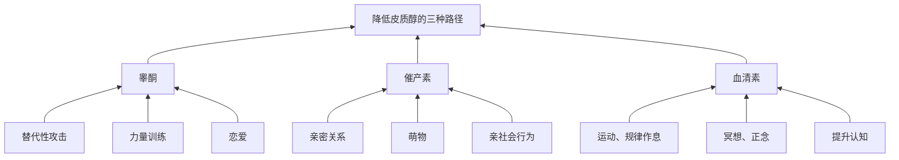

### f) 如何迈出提升认知的第一步？

把内心中焦虑的对象明确地拆解出来 → 具体化

| 是什么 | 怎么做  | 为什么     |
|-----|------|---------|
| 勇气  | 具体化  | 改变可以改变的 |
| 从容  | 冥想正念 | 接受无法改变的 |
| 智慧  | 提升认知 | 分辨以上两者  |

## 2. 批判性思维

---
source: https://www.youtube.com/watch?v=_mghGjRcLV4&t=14s
date: 2025-10-29
---

## 1. 观点梳理

### a) 雌二醇

**i) 生理性影响：最重要的一种雌激素**

- 调节女性生殖功能
- 调节女性的第二性征

**ii) 提升社交信号的敏感度：**

- 雌二醇越高，催产素受体越高 → 催产素相关的社交效应更明显
- 影响奖励系统的伏隔核 → 多巴胺分泌增加
- 影响杏仁核 → 个体对负面情绪的识别灵敏度提升

**iii) 提升大脑神经的可塑性**

- 海马体前额叶突出生长增多
- 认知灵活度提升

二者共同作用的结果是，在复杂情境中的处理能力提升 → 雌二醇是和情商相关的激素

**iv) 提高血清素**

由此可以解释：

- 更年期女性雌二醇含量降低 → 情绪问题
- 产后抑郁

**v) 增强骨骼，光滑皮肤**

### b) 雌二醇的偏爱因素

雌二醇偏爱好基因 + 高睾酮：

i) **好基因有哪些**？

- 颜值身材 → 好的外观形象
- MHC 差异大 → 好的免疫系统
- 创造力 → 好的大脑

ii) **高睾酮意味着什么**？

- 低沉的嗓音
- 表现支配性行为，例如领导力
- 偏好高风险/有攻击性的行为

### c) 黄体酮

最重要的孕激素：

- 增强厌恶 → 对清洁、秩序的偏好增强，脏乱差容忍度降低
- 调节情绪 → 调节 GABA 活性，起到类似镇定剂的效果

### d) 黄体酮的偏爱因素

- 资源地位
- 忠诚稳定
- 亲密与育儿

### e) 黄体酮 vs 雌二醇

| 黄体酮     | 雌二醇            |
| ---------- | ----------------- |
| 好基因     | 好爸爸            |
| 高睾酮     | 高催产素 + 加压素 |
| 危险的帅哥 | 温柔的暖男        |
| 看重权力   | 看重资源          |
| 最求刺激   | 寻求稳定          |

### f) 卵巢激素潮汐图

了解激素规律，可以更好地判断究竟是哪种激素占据主导作用

### g) 婚姻与 VSA 模型

婚姻幸福的三个因素为：

- 情绪稳定性 (Vulnerability )
- 压力 (Stress)
- 应对机制 (Adaptation)

其中，压力属于外部因素，无法掌控

而应对机制的基础是情绪稳定[^1]，这样双方才可以建立有效沟通

[^1]:或者至少有一人是情绪稳定的

## 2. 批判性思维

睾酮 vs 雌二醇：

| 睾酮       | 雌二醇    |
| ---------- | --------- |
| 输赢       | 爱憎      |
| 看不看得起 | 爱不爱    |
| 在上/在下  | 在内/在外 |

---
date: 2025-10-29
source: https://www.youtube.com/watch?v=sgCZlmhMhE0
---

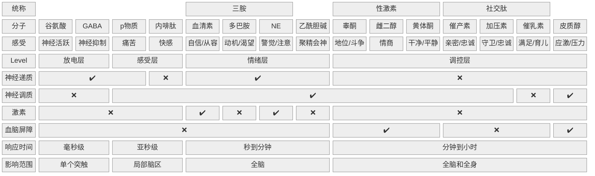

## 1. 观点梳理

### a) 神经递质、神经调质、激素和血脑屏障分别是什么？

|      | 神经递质              | 神经调制           | 激素      |
| ---- | ----------------- | -------------- | ------- |
|      | Neurotransmitters | Neuromodulator | Hormone |
| 传播途径 | 神经元               | 神经系统           | 血液      |
| 传播位置 | 大脑                | 大脑             | 身体      |
| 传播范围 | 小                 | 大              | 大       |
血脑屏障，顾名思义，就是血液和大脑之间的一道屏障

屏障之内，只能在大脑内传播；屏障之外，可以在血液流动

大多数激素、抗体无法通过血脑屏障

咖啡、酒精等小分子可以通过

### b) 谷氨酸和 GABA

谷氨酸对应神经活跃，影响因素有：

- 睡眠
- 外部刺激
- 兴奋剂

GABA 对应神经抑制，影响因素有：

- 放松活动
	- 瑜伽
	- 冥想
- 睡眠
- 有氧运动
- 酒精
- 碳水化合物 （胰岛素升高会促进 GABA）
- 安定、麻醉剂

谷氨酸和 GABA 互相拮抗

### c) p 物质和内啡肽

p 物质对应痛苦，影响因素有：

- 损伤、炎症
- 精神创伤

内啡肽对应快感，影响因素有：

- 性
- 食物
- 巅峰情绪体验
	- 心流
	- 大笑
	- 深度共鸣
- 外部镇痛
	- Runner's high
	- 辣椒素
	- 分娩

p 物质和内啡肽互相拮抗
## 2. 批判性思维

笔记链接如下：

- [加压素 + 催产素](ref-人性矩阵系列-02-催产素.md)
- [催乳素 + 睾酮](ref-人性矩阵系列-03-睾酮.md)
- [雌二醇 + 黄体酮](ref-人性矩阵系列-矩阵之外-02-雌激素和孕激素.md)
- [皮质醇](ref-人性矩阵系列-矩阵之外-01-皮质醇.md)
- [血清素 + 多巴胺 + NE](ref-人性矩阵系列-04-情绪.md)
- [内啡肽 + p 物质 + 乙酰胆碱](ref-人性矩阵系列-05-大脑.md)

---
title: 如何训练认知
author: 老强说
date: 2024-11-20
tags:
source: https://www.bilibili.com/video/BV1No42evERs/?spm_id_from=333.337.search-card.all.click&vd_source=bfb2e50dad8e670124c382656b85473e
---

## Question

很多人在建立知识体系后却不使用知识，久而久之就会遗忘。那么应该如何建立模型，进而提升认知？

## Statement

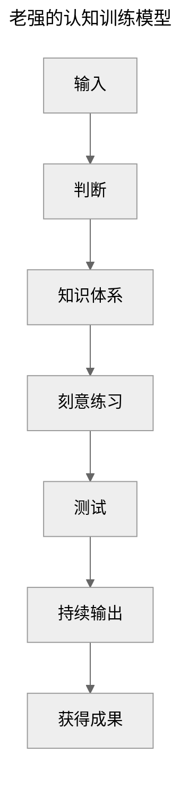

## Argument

前三步为**获取知识**:
>You are what you read/watch/think

* 减少被动输入
* 选择主动输入
* <mark>判断信息的来源是观点还是事实</mark>[^批注1]
* up 主并没有对知识体系做过多说明

后四步为**转为认知**，通过 MVP 学以致用，并最终不断给自己带来复利:

* 刻意练习：如何把知识转化为认知/思维习惯
  * 建立模型
  * 刻意练习
  * 及时反馈
* <mark>MVP：让认知带来复利的最小成本</mark>[^批注2]
* 持续输出/获得成果
  * 人生的商业模式：把自己当作一家公司运营
  * <mark>能力 X 效率 X 杠杆</mark>[^批注3]

## Conclusion

作者认为：

* 带着批判性思维去主动输入信息
* 刻意训练和 MVP 提供给我们一个使用知识的机会，通过反馈让我们更好地：
  * 加深知识的理解
  * 明确未来的目标
  * 了解自身的不足

[^批注1]: i.e. 批判性思维
[^批注2]: i.e. 创业成本
[^批注3]: 这个观点在《纳瓦尔宝典》中也提到过

---
title: 三种卡片类型 
author: Minjia
date: 2022-09-11
tags: 
source: https://utgd.net/article/6941
---

作者以「造房子」为例，把笔记分为三种：

* 长青笔记：基础建材
  * 观点笔记：自己/他人的观点，并不避讳一家之言
  * 词条笔记：公认的定理/原理/原则/现象/效应
* 大纲笔记：梳理其他笔记的清单，如写作大纲/日记/会议记录/头脑风暴，相当于脚手架
* 临时笔记：并不存储在卡片笔记中，但会为永久笔记提供素材[^批注1]

[^批注1]: 观点与 [ref-极简三步-我的个人知识管理工作流-少数派](ref-极简三步-我的个人知识管理工作流-少数派) 相同

## 1. 长青笔记[^批注2]

[^批注2]: 这里作者也没有区分文献笔记和永久笔记，而是统一作为长青笔记。只是按照是别人的观点还是自己的观点分为了观点笔记和词条笔记
>标准化会增强而非限制创造力

### 1.1 观点笔记

正因为观点笔记都是一家之言，需要我们补充资料/收集数据/加以阐释。虽然观点笔记相比于词条笔记的可信度低一些，但是它也最能体现作者自己的思考。

### 1.2 词条笔记

规范化的定义+自己的注解
作者也十分认可自创词条，理由是「命名一个问题等于拥有了一个问题」

## 2. 大纲笔记

仅凭永久笔记无法梳理思路。这时就需要编写大纲笔记来：

* 筛选：找出和分类关系最紧密的素材
* 排序：把网状素材捋成线性文章
作者特别指出，<mark>日记也属于大纲笔记的一种。在写日记时，使用 [[]] 留下一连串思考的基点，给观点笔记留下了空位；日后还可以一路回溯，找到最初酝酿这些想法的上下文</mark>。

## 3. 临时笔记

临时笔记的特点：

* 不放进笔记工具中
* 能总结为陈述句式的观点，就尽可能展开论述/添加证据，将其加工为观点笔记
* 如果不行，写成疑问句，日后补充论据，成为疑问句式的观点笔记
* 前面都做不到，则定期回顾

---
date: 2025-09-04
source: https://t.qianzhan.com/daka/detail/210825-af751ab0.htmd
---

对这篇网文进行简单整理，因为它连接了脑科学与[刻意练习](book-@刻意练习.md)

关于刻意练习的具体训练方法不再赘述，这里主要说一下使用刻意练习的目的/动机

最重要的两条结论：

1. 神经元连接，是人脑学习的第一性原理

2. 高手与普通人的本质区别，在于高手拥有长期正确训练所获得的特殊脑神经结构

## 1.1 神经元的功能

神经元相当于人体的电线：

1. 接受身体产生的某种信号
2. 将信号转化为电脉冲
3. 脉冲沿着轴突/神经纤维传递到另一神经/肌肉
4. 机体产生相应变化

## 1.2 什么是神经元连接

* 每个神经元都要与同类进行大量的交流 ，只能通过这种方式来发展连接关系，一旦发现对方是同类，就会努力实现连接
* 连接存在优先级，基于我们人脑设定的概率
* 学习的过程就是在不断建立/加强神经元的连接

## 1.3 神经元的特点

* 神经元是人类进化的产物
* 大脑的反应速度 = 神经冲动的传递速度 → 集中注意力有助于提升神经元的反应速度
* 神经元具有可塑性，且被重塑后可以再次被重塑 → 习惯的重要性
* 身体/动作的改变 → 情绪/思维的改变 → 多做运动和与正向情绪/思维相关的动作
* 神经元活跃一段时间后需要恢复到正常水平 → 充足的睡眠可以让神经元休息
* 神经元的连接 = 把短时记忆变为长时记忆
* 实现神经元的连接需要大量重复练习
* 神经元连接越多，大脑解决复杂问题的概率越高
* 如果压力过大，神经元会倾向退缩，不发展连接关系
* 运动促进大脑神经元连接
* 镜像神经元是我们理解他人的基础

为了实现尽可能多的神经元连接，我们要进行刻意练习，不断修正舒适区的边界并突破它

---
source: https://www.bilibili.com/video/BV1svU7YXEbE/?spm_id_from=333.1007.tianma.2-2-4.click&vd_source=bfb2e50dad8e670124c382656b85473e
author: 老司机耿进财
date: 2025-01-07
---

## 1. 观点梳理

本视频介绍了两点内容：

1. 何为学生思维
2. 学生思维在走向社会之后的弊端

作者提出，尤其是对于接受高等教育的学生而言，上学是为了学习生存技能。而生存技能由三个维度构成：

- 价值体系：对世界的认知和判断
- 专业知识：长期训练的细化领域的掌握和经验
- 人际交往：对于规则设定和运行的感知与适应

在校期间，老师只会教授专业知识。因此，对于学生而言，价值体系和人际交往往往被忽略。单一的学生思维让学生缺乏从其他角度观察世界的能力和敏感性。这种学生思维具体可以在以下三个方面显现：

- 对于一项具体的工作，总是寻求一个标准答案
  - 不具备基本的判断能力，以及寻找合理解决方案的能力
  - 妄想通过复制粘贴他人的经验让自己成功
- 低估客观事物的复杂性
  - 自变量之间并非互斥关系，而是会相互影响
  - 好的结果往往由多种因素共同影响形成
- 缺乏站在其他利益相关方的立场思考问题的能力
  - 换位思考
  - 看他做了什么，而非说了什么

社会思维应该如何做？

1. 收集信息
2. 筛选方法
3. 实践验证效果
3. 根据反馈情况做出调整

在执行上述每一个步骤时，都会让人产生挫败感。但是只有付出这些代价，人才会成长。

在寻求他人帮助时，也要学会甄别、借鉴和整合，而非为了图省事。

## 2. 批判性思考

### a) 同意

人与人之间的差距，除了专业知识，更来自于价值观和人际交往

>聪明是具象的，智慧是抽象的。[^1]

[^1]: 实际上，拥有智慧的人外在往往显得“愚钝”，是谓大智若愚。

### b) 质疑

我认为，所谓的学生思维，本质上是一种应试教育下“片面认识世界”的思维，逻辑链如下：

- 应试教育让考试成为学习能力的唯一标准
- 每一道题都有标准且唯一的答案
- 这导致应试教育出来的人，在没有额外价值观和人际交往影响下，天然的认为工作/生活中所有遇到的问题都有标准且唯一的答案

因此，可以给“学生思维”下一个定义：

**遇事总是寻求标准（唯一）答案，低估现实复杂性，不考虑各方平衡的思维**

明确了这一点，我们要做的就是从“学生思维”转向“社会思维”。

---
source: https://www.youtube.com/watch?v=0mXnKgsEIAU
author: Productive Peter
date: 2025-10-21
---

## 1. 内容摘抄

[B 站](https://www.bilibili.com/video/BV1AEZJY1EeJ/?spm_id_from=333.337.search-card.all.click&vd_source=bfb2e50dad8e670124c382656b85473e)有搬运视频，搭配机翻。

### a) 引言

> Be ambitious but lazy

如何定义懒惰 (Lazy)?

- 懒惰并非回避工作，而是回避那些不必要 (uncessary) 的工作
- 懒惰是效率的驱动器 (Efficiency Driver)

如何完成心态上的转变？

- 对精力 (Energy) 的正确认知：精力不是时间的叠加，而是一种资源 (Resource)
- 我们要关注的不是付出多少努力 (Effort), 而是找到可以实现最大产出的杠杆 (Leverage)

### b) 80/20 Principle

根据二八法则，20% 的原因造成 80% 的影响

我们要做的就是识别 (identify) 出那 20% 高产出的影响 (High Impact), 这样做可以让我们消除低价值活动 (eliminate Low Value Activities), 始终专注在重要的事情上，意味着更高的效率

### c) Decision Minizatioin

如果很多事情大量重复地出现，那么做一次决定，然后为它们设计框架 (Framework)、模板 (Template) 和默认值 (Default Value)

所谓意志力 (Willpower) 强的人，一定是设计出了更好的执行系统，让阻力 (Friction) 最小化，从而避免决策疲劳 (Decision Fatigue)

### d) Environment Design

意志力总是会被环境打败，因此你需要调整环境中出现的阻力：

- 重要的任务 → 减小阻力
- 干扰 (Distraction) → 增加阻力

调整阻力 (Friction Adjustment) 就是你的杠杆，它会产生巨大的行为改变 (Behavior Changes)

### e) Strategic Automation

> Automation is the ultimate leverage tool

- 识别你工作和生活中的重复性任务 (Recurring Tasks)
- 为它们建立自动化流程

### f) Building System vs. Setting Goals

|          | Setting Goals | Building System |
|----------|---------------|-----------------|
| When     | Future        | Now             |
| Who      | Amateurs      | Professionals   |
| Archieve | Once          | Forever         |
| Guidance | No            | Yes             |

视频中还给出了几个实例：

- 目标：写书；系统：设计一个每天可以写 500 字的系统
- 目标：保持身材；系统：设计一个每天最小阻力进入健身房的系统

### g) Minimum Effctive Dose for Maximum Results

- MED （最小剂量）即边际效应，是最佳杠杆点：用最小的输入创造最大的预期产出
- 本质 (Essence) 是 Working **smarter**, not working harder

### h) Leveraging Others

- 认识到别人什么时候可以做什么事，然后有效地进行分配 (Effecitive Delegation), 这被称作战略资源配置 (Strategic Resource Allocation)
- 委派后重视结果而非过程，给予他人自主权，让他们用自己的方式去解决问题

### i) Creating Assets That Work While You Sleep 

> True leverage comes from creating assets that generate value without your active involvement

真正的杠杆不是用时间换取金钱，而是以最小的维护成本，源源不断的创造资产

资产 (Assets) 的定义是：

- Knowledge
- Skill
- Interest

### j) The Strategic Efficiency Lifestyle 

生活哲学 (Life Philosophy) 包含三个关键词：

- Value （价值）
- Leverage（杠杆）
- Automation（自动化）

为了实现这样的生活哲学，可以从四个维度着手：

- 战略性 + 系统性地思考
- 最小化决策
- 设计阻力最小的环境
- 最小有效剂量

## 2. 观点梳理

### a) 同意

再次提到了二八法则，有人说没有那 80% 不重要的，又如何能分辨出 20% 重要的事情呢？
对此我想说，在做之前，没有人知道做多少会有期望产出，但是我们要不断地追问：究竟是哪 20% 才是最重要的，这样能让我们始终专注在最重要的事情上

最小有效剂量的概念与 [最小可行性系统 (MVP)](ref-认知训练模型.md) 相似

### b) 质疑
