# 2024

## 2024-11-17

### 0. 引言

一个好的知识体系可以用 12 个字概括：

1. 用得着
2. 想得起
3. 找得到
4. 记得住

多于三个的复杂流程会让我失去执行的动力，因此，我把知识管理系统的建立分成三步：

1. 输入
2. 加工
3. 输出

其中，「输入」要解决的问题是如何用得着，或者说「哪些内容应该被记录在知识库中」；「加工」要解决的问题是如何想得起/找得到，或者说「如何记录新知识，并且在需要的时候能被快速检索出来」；「输出」要解决的问题是如何记得住，或者说「如何将新知识纳入现有体系」。

由于输入的内容都是信息，因此我把输入称为信息流。加工和输出的过程分别称为工作流和输出流。接下来，我就分别从需求和工具两个角度，依次介绍一下这三个流程。

### 1. 信息流

#### 1.1 信息的分类

我把信息源分为两类：

- 客观存在的第三方媒体，比如书籍/资讯/视频/论文/播客...
- 主观产生的灵感，比如自我的想法/与他人的交流...

对于媒体，我参照[ref-把阅读作为方法：从选书到笔记的经验分享](ref-把阅读作为方法：从选书到笔记的经验分享.md)中提到的观点：

> 书籍帮助我们在信息洪流中保持⼼态的从容，远离信息过载的焦虑

要系统的学习知识，书籍永远是第一选择。当然，对于一些粗颗粒度的知识，视频/播客/在线文章等是很好的途径。不论是何种信息源，我们应该做到「主动输入」，即在对信息进行加工之前，先筛选信息。

#### 1.2 信息的筛选

在筛选信息时，用批判性思维看待检索结果：

- 以「解决问题」为导向：学习是为了解决问题
- 判断：「这是事实还是观点」

如果检索内容是事实，那么我们就能以此为基础进行延伸；如果检索内容是观点，那么我们就要进行交叉验证。

### 2. 工作流

在接受信息源之后，下一步就要对其中的信息进行归纳总结。这便是我的工作流。

#### 2.1 我的笔记分类

在[review-PKM](review-PKM.md)中，我总结了网上的一些笔记方法。再次重申，知识体系的构建分为两种：

1. 自上而下的「层级结构」
2. 自下而上的「网状结构」

两种结构没有绝对的对错之分。实际上，根据使用场景的不同，二者应该是共存的关系：

- 想要系统地从零开始学习一门学科，层级结构显然更合适
- 如果是阅读论文等细颗粒度等内容，此时我们已经对这类知识有一个大概的轮廓认知。自下而上的层级结构更有助于知识点之间的发散和连接

据此，我把笔记分为三种：

1. 临时笔记
2. 大纲笔记
3. 长青笔记

##### # 临时笔记

临时笔记就是在接受信息源后，第一时间记录的内容。按照信息源的类型，我把临时笔记分为两种类型：

- 主观产生的 draft
- 客观存在的 extract

##### # 长青笔记

正如[ref-三种卡片类型](ref-三种卡片类型.md)中所说：

> 临时笔记的最终归宿都应该是长青笔记。

关于临时笔记如何变成长青笔记，已经在中[渐进式阅读](atom-24-02.md)说过，在此不再赘述。

长青 (Evergreen) 一词参考了花园浇水的过程。只有不停地灌溉，植物才能永葆长青。同理，当临时笔记变成长青笔记后，不应该被放置一处，不再做任何改变。原因如下：

- 一方面，回顾长青笔记，寻找其中的关联，会产生新的想法；
- 另一方面，新知识与长青笔记的碰撞也会产生新的灵感。实际上，这个过程就是把新知识逐渐转化为自己已有知识的过程。

我把长青笔记分为两种类型：

- 对于一家之言的观点，标签为 ref
- 对于客观存在的事实，标签为 card

##### 大纲笔记

事实上，大纲笔记应该也算作长青笔记的一种。之所以单独列出来，是因为相比上一节提到的单纯记录内容的 ref/card，大纲笔记兼具管理/检索/记录灵感的功能：

- 对相同主题的 ref/card 内容进行总结/类比/归纳，并打上标签 review；如果存在「组块」(chunk)，也可以创建新的 card 笔记
- 日常的所思所想/日记等，为未来的长青笔记留出空位

从这个角度看，大纲笔记也是层级结构和网状结构的连接/平衡点。

### 3. 输出流

单纯把新的知识记录下来而不使用，这是没有意义的。其实古人早有一个成语概括，那便是「学以致用」。这里我从[ref-认知训练模型](ref-认知训练模型.md)得到了刻意练习和最小可行性系统这两个很重要的概念。于是，根据知识的类别，可以分为两种方式：

- 对于偏理论的知识，使用「费曼学习法」，从「5W1H」六个维度，用自己的话总结概念
- 对于偏实践的知识，使用「刻意练习」+「MVP」

最后，自己总结的经验/概念，写成博客发布，并打上 blog 标签。

事实上，完全可以把知识库的输出当作是个人版的 GPT，整个写作的过程就是在逐层递进的问自己为什么。 通过 Q&A 不断训练自我，强化知识的理解。

### 4. 总结

#### 4.1 各类标签和笔记的关系图

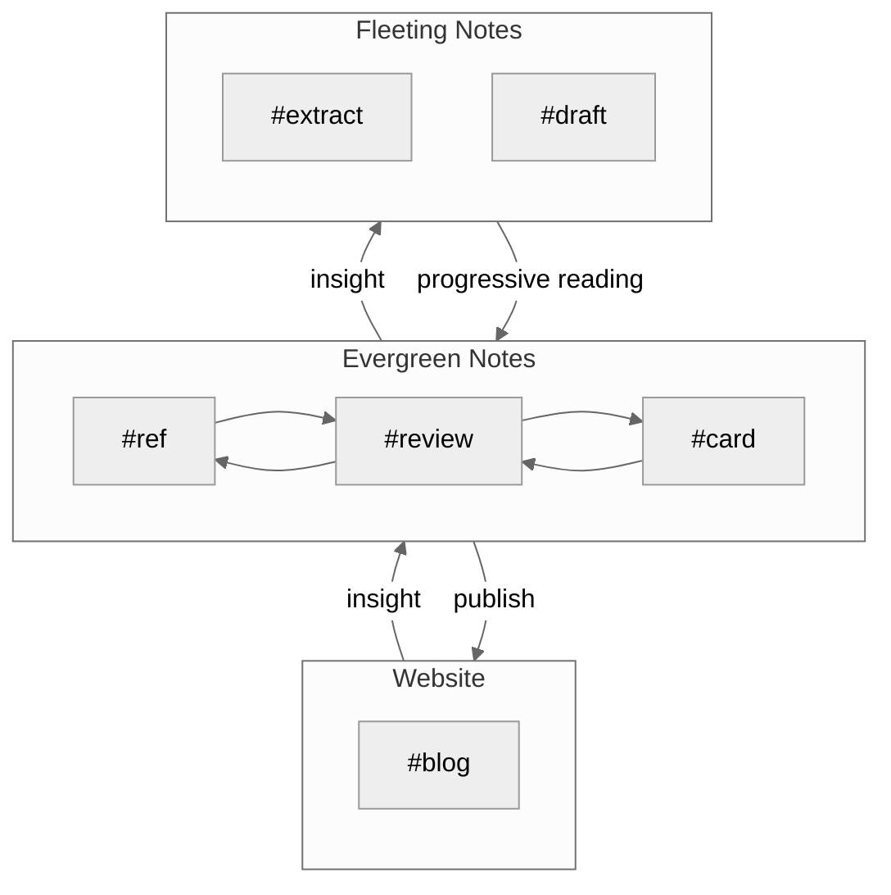

#### 4.2 CODE 法则

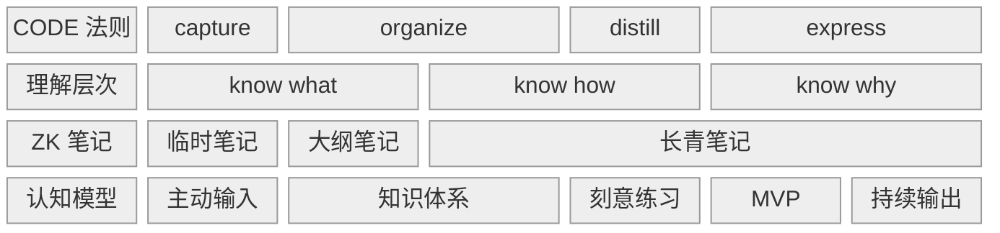

#### 4.3 实现信息流与工作流的工具与标签

这里主要从以下两篇文章中总结而来：

- [ref-打造个人工作流-系统篇](ref-打造个人工作流-系统篇.md)
- [ref-打造个人工作流-认知篇](ref-打造个人工作流-认知篇.md)

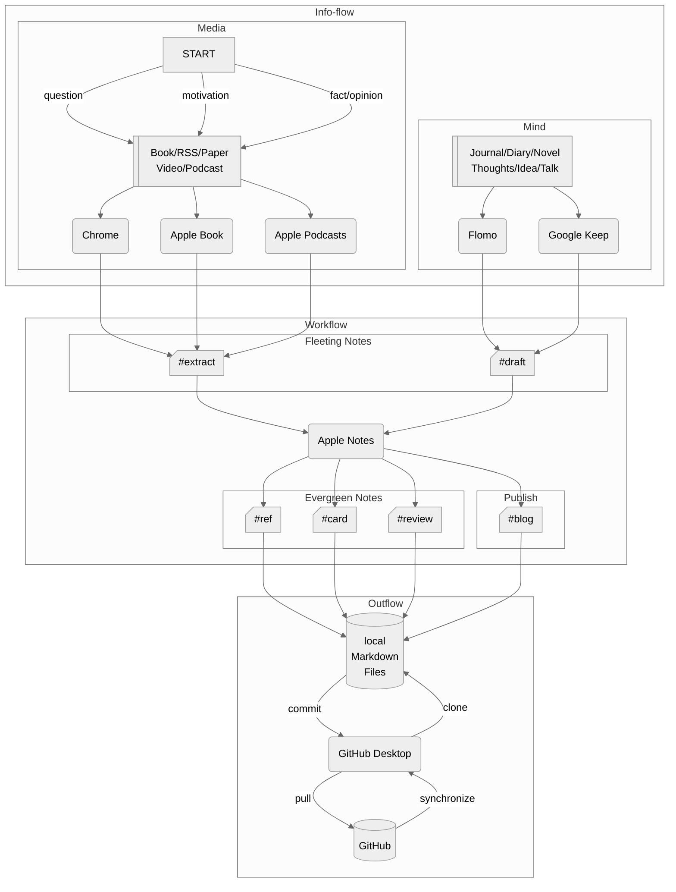

#### 4.4 工作流总览

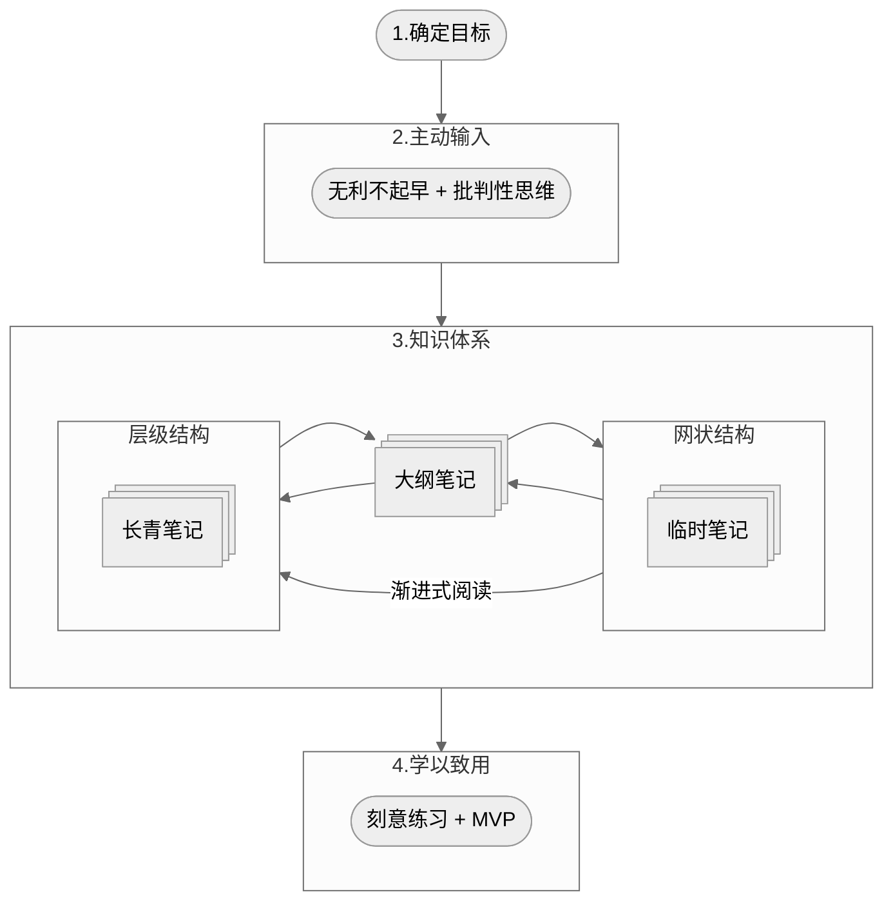


#### 4.5 对引言的回答

Q1: 哪些内容应该被记录在知识库中？

A1: 主动输入：以问题为导向 + 批判性思维

Q2: 如何记录新知识，并在需要的时候快速检索？

A2.1: 临时/长青笔记：渐进式阅读

A2.2: 大纲笔记：管理/检索/预留灵感

Q3: 如何将新知识纳入现有体系？

A3: 费曼学习法 + 刻意练习 + MVP

## 2024-11-24

近年来，随着 notion/obsidian 等一众新型笔记软件井喷式的出现，让知识管理变得丰富了起来。在[ref-打造个人工作流-认知篇](ref-打造个人工作流-认知篇.md)中，作者认为笔记软件属于特殊的一类工具软件，因为它们往往自带一套方法论。例如，如果使用 OneNote 就必须接受它提供的自上而下式的层级结构。随着层级结构越来越深，笔记也越记越乱。因此，当「双链」这个功能伴随着「卡片盒笔记法」这个概念横空出世，看着那一团知识网图，没有人会不为之心动。

然而，正如[ref-请不要神化双链笔记-少数派](ref-请不要神化双链笔记-少数派.md)所说，双链并不能反映链接之间的主次关系。如果不按照一定的结构去管理，知识体系绝不会自己生长出来。

而我在实践之后，也不禁要提出以下几个疑问：

- 卢曼搞学术研究是否能和我们的日常生活划等号？
- 卢曼的社科研究是否也可以用于其他领域？
- 卢曼生活的年代是否有其科技发展的局限性？
- 网上吹捧的卡片盒笔记法是否全部反映了卢曼的笔记思路？

同样地，在以下三篇中，作者也没有完全参照卢曼的卡片盒笔记法，而分别根据自己的需求进行了适当的简化：

- [ref-极简三步-我的个人知识管理工作流-少数派](ref-极简三步-我的个人知识管理工作流-少数派.md)
- [ref-巧用分类法解决使用卡片笔记时遇到的困境-少数派](ref-巧用分类法解决使用卡片笔记时遇到的困境-少数派.md)
- [ref-三种卡片类型](ref-三种卡片类型.md)

不可否认，卡片盒笔记法提供了一种全新的「自下而上」的知识体系管理思路。然而，我们不应该一股脑的就把这种方法奉为圭臬。更理性的做法，是根据自身的需求，<mark>在「自上而下」和「自下而上」之间找到平衡点</mark>。

## 2024-11-30

总结以下论点：

1. 使用主动输入过滤信息源
2. 使用渐进式阅读让来自第三方信息源的临时笔记变为长青笔记
3. 大纲笔记是实现层级结构和网状结构知识体系的平衡点
4. 使用主动输出让新知识归入现有知识体系之中

由此，可以提取六个知识点：

- 长青笔记
- 大纲笔记
- 渐进式阅读
- 知识体系
- 主动输入
- 主动输出

我使用长篇幅去论述的，是前四个点；然而今天我突然意识到一个问题：我们总是妄想把所有看到/听到的内容记录下来放在一处，然后在需要的时候拿出来。可事实上，大部分表象的问题都可以通过网络搜索解决。没有自己的思考，把信息放在笔记中（即使它已经被总结/归纳/对比/验证，可是它并没有为我所用）和放在网络中是没有区别的。从一定程度上来讲，只要知识能够为我所用，那么有没有笔记也是无所谓的。因此，<mark>笔记只是知识体系的一种形式，要杜绝形式上的完美主义</mark>。我们不应该期望通过输入和加工得到输出。相反，是输出决定了输入，进而决定了在加工过程中笔记的形式。

# 2025

## 2025-05-15

以上体系：

已经实施半年有余，最近再回顾一下。

这些方面做的不错：

- 主动输入：阅读书籍为主，中长视频和 AI 为辅
- 主动输出：使用快捷指令复制读书笔记模版，使用 vscode 的 markdown 功能填写模版内容
- 既保证了数据的本地化，又可以同步到 iCloud 和 GitHub

这些方面不尽如人意：

1. 单纯的 markdown 文件只能记录文字，目前记录的文件大多为很有框架/条理的读书笔记，缺少一些灵感/想法/思路/工作/生活的记录
2. 缺少像 notion/obsidian 等笔记软件的 dataview （管理/追踪/回顾）功能
3. ios 备忘录在大部分情况下仅作为备忘录使用
4. flomo 的使用频率逐渐减少，也许是因为其使用场景大多为手机端

**如何解决第一个痛点**？

出于以上动机，选择 logseq 作为补充。logseq 的定位是 outliner，即大纲，是一条串起思路的线。logseq 的优势在于不需要考虑把笔记放到哪里，可以做到打开软件无压力记录。当然，后面还是要定期对日志中的内容进行分类。结构化/体系化的文字表达形式应该依然由 vscode 完成。因此，可以把 logseq 作为 review 类文档的「碎片」。事实上，这篇文档也正是我在 logseq 中记录的 PKM 相关内容的集合。

那么 logseq 的使用场景为：

- 记录：使用日志记录每天的所思所想
- 回顾：利用双链/图谱定期回顾想法
- PKM 的输出应该从工作和生活两个方面展现。因此，一旦 PKM 中的知识被应用，应该使用一款软件进行记录

目前 logseq 的 Pages 分为以下几类：

- 行动类的 TODO/DOING/DONE
- 书籍类：关联主题，列出行动
- 主题类：关联书籍，形成树状知识体系

**如何解决第二个痛点？**

尝试使用了以下几款软件：

- 无边记
- notion
- anytype
- calibre
- zotero

然而效果都不尽如人意。主要是目前的管理项目成本太高。创造书籍条目，添加元数据，再分组查看，这些更多的是形式主义。后来想想，其实就目前而言，logseq 的主题目录就已经足够。当然，对于 anytype 或者 notion 的探索不应该就此打住。关于个人生活的项目管理，使用 anytype/notion 是完全可行的，只是不在本次的 scope 中罢了。

.md 文件优点是可靠且容量小，缺点是不容易浏览。思维导图刚好可以弥补这一缺憾。今天刚好发现了一个在 vscode 中很不错的插件，可以把 .md 文件在线预览为思维导图！可惜仍然存在不足：

- 链接无法跳转
- 无法渲染 mermaid

不过这样也倒逼我做一些改变（当然现在想想也很值得）：

- 对于读书笔记的文档，建立两种标签：
  - note: 记录高亮/笔记
  - ref: 系统化地总结全书
- 对于这两类标签，尽量不用图表/mermaid, 每一行的字不要太多，多使用子标题
- 对于 card 类文档，尽量使用 mermaid 进行可视化，这样便于查看和理解
- 定义 review 类文档的作用：搜集 topic, 有点类似于 blog 但是以日期为子标题，更多的是为了记录一个思考的过程。另外，一些在视频或者其他地方看到的信息，如果值得记录，也会加入到 review 中

**关于第三点...**

其实现在我也不那么 care 备忘录具体记录什么东西了。我把它简单的分了四个文件夹：

- Fleeting
- prog. Reading
- Distill
- Archive

其实就是对应了 GTD/CODE/PARA 的原理。任何我想到的东西，都可以迅速记录在备忘录中。Archive 的标志是，它的内容被记录到 docs 的文档中。

**总结：**

目前的常用工具有：

- iOS 图书：电脑/移动端（手机+平板）阅读书籍+导出高亮文字和笔记
- iOS 备忘录：移动端的灵感记录+碎片化捕捉
- vs code：电脑端编写读书笔记 (ref)+发布博客 (blog)
- logseq：电脑端记录日志+碎片化信息整理+为博客提供大纲 (review)

做读书笔记应该是把新知识纳入自己知识库的第一步。用王阳明的话说，叫做要做到「知行合一」。这里的行指是批判性的思想，也可以是行动，或者一次写作。

## 2025-05-18

最近看到了两篇不错的文章：

- [透过信息架构 看各笔记软件](https://sspai.com/post/76736)
- [笔记的策略：文件夹、标签、链接、冗余和可靠性](https://sspai.com/post/98086)

与其他视频/文章不同，这两篇文章并没有从具体的软件出发，而是从更高的一个维度去看待笔记/知识库。以下是一些总结：

**记笔记/知识库的原则是什么？**

- 记笔记只是第一步，你的最终目标还是要完成工作/生活中的具体任务/项目，实现你的目标
- 笔记系统的原则：简单/易维护
- 知识库的作用是为了帮助我们完成记忆的工作

**《信息架构：超越 web 设计》是如何对信息结构进行分类的？**

信息结构分为三大类：

- 层级结构（即文件夹）
- 数据库（元数据管理）
- 超文本/网状结构（单链/双链/反链）

通常在知识库中，这三种结构要结合使用：

- 先设计层级结构，但其深度和广度不宜太多
- 多用数据库
- 超文本用作层级结构或数据库的补充

另外，以下系统可以用作补充：

- 标签：信息环境中更大的信息块，用于粗颗粒度的检索+快速分类
- 导航：引导用户在网络中访问的系统
- 搜索：信息检索

**如何设计标签系统？**

- 避免过多使用标签，定期 review/简化你的标签系统
- 避免在正文中使用标签
- 少使用嵌套标签
- 标签的命名要简短且准确
- 把标签作为数据库中的一种元数据（logseq 目前使用双括号[[]]作为标签）

## 2025-05-26

最近似乎终于找到了 GitHub project 以及 issues 的正确用法：

- 为每一本书建立一个 issue, 加入主题/作者/进度/类别等标签和元数据，实现图书管理和总览
- 然后再使用 vscode 打开相应的 note/ref 文档，预览思维导图模式进行查阅

一言以蔽之，文档的记录使用 vscode + logseq, 书籍/主题的管理使用 GitHub.

## 2025-06-13

对 DeepSeek 的使用场景愈发和我对于文档的分类清晰：

- note 是阅读完书籍后形成的渐进式总结
- ref 是根据 note 的内容，辅以 DeepSeek 形成的系统化总结
- card 分为两种，通常以 mermaid 语句呈现：
  - 一种是根据 note 和 ref 的内容，精炼而成的原子笔记，记载了书籍中最核心的观点/内容
  - 另一种是在 B 站看到的值得三连的视频/公开课，由于其本身已经高度结构化，只需要提炼其最核心的观点即可

以同心圆描述三者的关系：card 是最核心的内容，由内至外分别为 card-ref-note.

**如何使用 card?**

- 每个 card 拥有若干主题，主题使用标签来描述
- 若干 card 描述同一主题，该主题可以汇总为 review
- 同样地，在 review 中也许会发现某些 card 之间的联系，形成新的 card 或者体系
- 若干 card 可以作为 blog 写作的大纲，使用 AI 辅助写作。备选 AI 有：
  - Refly
  - NotebookLM
  - DeepSeek

## 2025-06-21

在和 DeepSeek 讨论关于笔记软件的对话中产生了一些灵感，遂把这些想法记录下来：

刚才说的算是打造个人知识库的一个方面：工具篇。按照黄金圈法则，这算是 How 层面的东西，或者按照道法术器的角度，这算是术/器的层面。刚才所有的提问，归根结底是在问：**为了打造知识库，我需要记笔记，那么应该用什么样的笔记软件来实现这一功能？**

至于 Why/道层面，我的目标是很明确的：成为一名终身学习者，通过不断的主动学习去认知这个世界，也认知自己，然后始终以开放的心态迎接生活。打造个人知识库是我实践主动学习的表现，记录的笔记是学习的结果。而我打造知识库的目的则是使用个人知识库辅助我更好地思考问题。

此外，我还有自己一套法/术层面的东西：如何打造个人知识库？按照 MECE 拆分法则，可以把这个问题拆解为：如何通过以下维度处理笔记？

- 用得着：记录的东西应该是有价值的，现在和未来能够用得到的东西
- 想得起：遇到新知识/输入可以做到和已有知识体系产生联想
- 找得到：能够通过一套体系化的设计，在用到笔记是相对迅速的找到笔记
- 记得住：这里并不是在过分强调记忆力。事实上随着年纪的增大，记忆力显然会衰退；而这正应该是打造知识库的一个原因。所谓记得住，我更多的是强调要做到融会贯通，也就是用最基本的描述去**理解**概念（费曼学习法）

为此，我的知识库工作流分为三个阶段：

- 输入
- 处理
- 输出

关于输入...
在 VUCA 时代更要严格限制输入。实际上，尽管网络上的信息越来越花哨，我认为书依然是最好的信息源，因为它显然经受住了时间的考验。基本上每看完一本书，这本书中提到的一些参考书籍就是我下一本要看的书了。慢慢地，横向类比和纵向延申，我相信可以形成一张大的知识网络。此外，主动寻找信息源：也就是要带着问题去检索。看完书以后，对哪些知识点/观点有疑问，主动搜索谷歌/B站，然后把它们的观点收纳进来。
以上，可以解决**用得着**的问题

关于处理...
这里就涉及到如何处理笔记了。我的原则是：把书读厚，然后再把书读薄。要做到这点，我会为每本书创建三个 markdown 文件：

- note 记录在读的过程中画出的高亮部分
- ref 是系统化的总结全书（核心观点/重要概念/全书架构/写书的现实意义/作者背景）
- card 是结合 note 以及 ref 形成的最核心的部分，大多使用 mermaid 语法，用一张图表示出来
  三个文档代表了对书籍的三种程度的理解，我把 note/ref/card 称为三种读书笔记的 type. 以上，通过 typora 的沉浸式写作体验，可以解决**找得到**的问题
  此外，Obsidian 支持 yaml 语法。利用这一特点，我为每个 card 文档添加元数据（标签/作者/日期...）。此外，它还具有强大的 dataview 和双链功能，可以形成知识图谱，可视化笔记之间的联系，这就解决了**记得住**的问题
  最后，虽然 note/ref/card 都是对一本书记的笔记，我只选择给 card 文档添加元数据，但是三个文档统一使用type+书名命名，可以让我在还没有打开文档之前就大概知道这些笔记是关于什么的。而我回顾时，会先看 card 类型，然后再看 ref，如果哪里不太清楚，再返回 note 中寻找。这样就完成了note/ref/card 之间的双向循环。
  以上，可以解决**找得到**的问题。 

关于输出...

- 每读完一本书，记录采取的行动 (logseq/obsidian)
- 当 card 积攒到一定数量，发现 card 之间的 insight，融会贯通，对某一特定主题进行写作，并加入 type: review (logseq/obsidian/typora)
- 对于纯文学类书籍，可以写观后感/读后感，加入 type: blog (logseq/obsidian/typora)
  此外，灵感的来源是基于现有的认知，这既是输出，也是下一次写作/行动的输入(logseq/flomo/iOS 备忘录)

最终，我可以形成输入→处理→输出→再输入的循环体系。

## 2025-06-22

### 0. 总览

这次，我从“道→法→术→器”的角度对知识库体系再次更新。这个表是我在拥有了大概 40+ 笔记后做的总结：

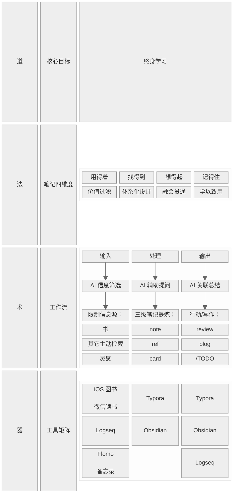

由于兼顾了视觉上的美观和整洁，还需要用文字补充说明表中不够清晰的关系(*注：引用代表该部分是 AI 辅助写作原文*):

- 法与术的对应关系
- 器与术的对应关系
- AI 在整个体系中的作用

接下来分章节对上述三点进行说明。

### 1. 法-术的对应关系

1. 输入阶段（限制信息源）→ 保障“用得着”：
   - 通过严格筛选书籍和主动检索，确保输入的信息具有长期价值
   - AI 在信息筛选阶段的作用是：
     - 可信度评估
     - 知识坐标定位

2. 处理阶段（三级笔记提炼）→ 实现“找得到”和“记得住”：

   - note/ref/card 的三级结构提供了体系化的组织方式（找得到）：
     - note: 捕获书中重要的原始信息
     - ref: 对全书进行解构 → 重组
     - card: 将知识内化为可理解、可复用的模型（记得住）

   - AI 在处理阶段的作用是：
     - 辅助提问：帮助深化思考（如生成批判性问题）
     - 辅助总结：帮助建立连接（如跨领域链接），促进融会贯通

3. 输出阶段（行动/写作）→ 达成“学以致用”（即“想得起”和“记得住”）：
   - 通过 review/blog 等输出形式，将知识与实际应用场景结合
   - 通过 /TODO 记录行动，将知识转化为行为改变
   - AI 在辅助总结阶段的作用是：
     - 帮助生成行动要点
     - 帮助形成写作框架

### 2. 术-器的对应关系

1. 输入阶段工具：
   - iOS图书/微信读书：获取高质量书籍内容（用得着）
   - Logseq：记录临时灵感（通过 daily notes），作为输入缓冲区
   - Flomo/备忘录：快速捕获碎片灵感，经过筛选后进入正式处理流程

2. 处理阶段工具：
   - Typora：用于沉浸式撰写和提炼 note/ref/card，其流畅的书写体验有助于专注思考（记得住）
   - AI 工具在撰写过程中提供实时辅助

3. 输出阶段工具：
   - Typora：用于撰写长文（review/blog）
   - Obsidian：通过知识图谱和全局搜索实现知识的快速检索（找得到），并通过可视化关联促进知识联想（想得起）
   - Logseq：管理行动项（/TODO），将知识转化为行动（学以致用）

### 3. AI 的跨层级增强

1. > 在输入阶段，AI 不仅是信息筛选器，还通过预读生成问题框架，为后续处理阶段做准备（提前激活“想得起”）

2. > 在处理阶段，AI 的辅助提问和总结不仅作用于当前笔记，还会主动关联知识库中的已有内容（如提示与某card 的关系），强化“找得到”和“想得起”

3. > 在输出阶段，AI 的总结功能会识别行动模式和知识应用点，形成闭环反馈，进一步优化输入（如推荐相关新书）


### 4. 图表总结：两个关键循环

> 整个体系形成一个增强回路：
>
> 输入（高质量）→ 处理（深度提炼）→ 输出（有效应用）→ 通过AI和工具强化各环节 → 产生更多高质量输入（如写作引发的新问题/行动中产生的新灵感）。这样，图表中分开的四个层级和各个模块，通过上述关系紧密连接为一个有机整体。

最后，用 mermaid 图表表示法-术之间的对应关系：

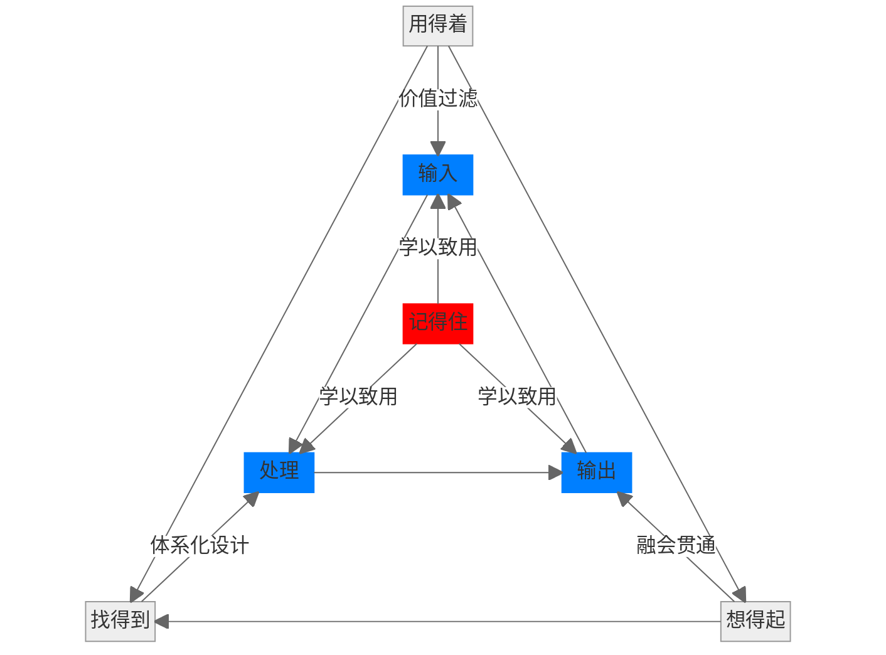

我用两个三角矩阵展示了工作流与笔记四维度的对应关系：

- 外圈是法层四维度
- 内层是术层工作流

这里着重强调了记得住，因为它是这两个所有循环的驱动核心：我们记笔记最终的目的是要**学以致用**。

实际上，上图中的”记得住“蕴含一个前提，即出于什么样的原因让我开始想去检索笔记？可能是一个问题，也许是一个突发的灵感，或者是一个对输出结果的批判性观点。这里统一叫做动机。所以，除了输入/处理/输出以外，我增加了一个**动机层**。**动机是输出的结果，也是新输入的开始，如此就可以形成工作流的循环。**这张图展示了工具矩阵是如何支撑起工作流与笔记四维度的：

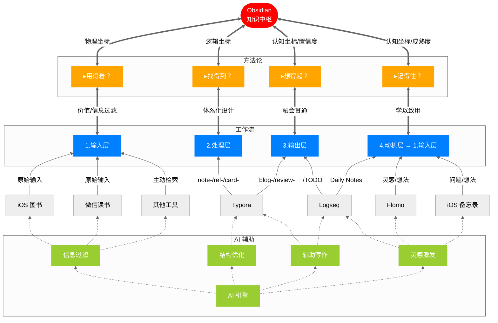

这套体系的特点是：

- 以 Obsidian 为中枢，驱动工作流的进行，其它工具对应服务于各项流程
- AI 为增强引擎：我刻意使用虚线表示 AI 对工具的影响，是为了说明 AI 仅仅是辅助，还是要以人的判断为主
- 四维度作为标准评判笔记的质量

以上，**不同的工具对应不同的心流状态**，让我更好地形成自己的知识体系。

## 2025-06-23

### 0. 引言

在 [blog-我的知识管理-再谈笔记构建](review-PKM.md)中提到，今后要使用 obsidian 作为知识管理工具。在 obsidian 中可以给 markdown 文件添加 YAML 属性，其本质是给文档添加一系列的元数据，方便后面使用 dataview 插件进行知识图谱的制作和文档关联的可视化。由此，引出问题：

- 按照 MECE 法则，应该从哪几个维度添加元数据？
- 每一个维度又应该对应哪些内容？
- 如何建立标签系统？

DeepSeek 为我分了五个维度，分别是：

- 来源维度 (Source Dimension)：知识从哪来？
- 内容维度 (Content Dimension)：如何（在知识网络中）快速识别知识？
- 认知维度 (Cognitive Dimension)：我与知识是什么关系？
- 关系维度 (Relation Dimension)：当前知识位于知识网络的什么位置？
- 管理维度 (Management Dimension)：如何管理知识？

知识管理的精髓，根据客观存在和主观意识，分为三类：

- 物理存在
- 逻辑本质
- 认知映射

按照这个原则，分别对应这五个维度：

- 物理坐标：来源维度 + 管理维度 **→ 笔记实体**
- 逻辑坐标：内容维度（面 → 点） + 关系维度（点 → 面） **→ 知识本质**
- 认知坐标：**产生输出/创造行动**，为下一个工作流创造灵感/动机/问题，最终形成闭环

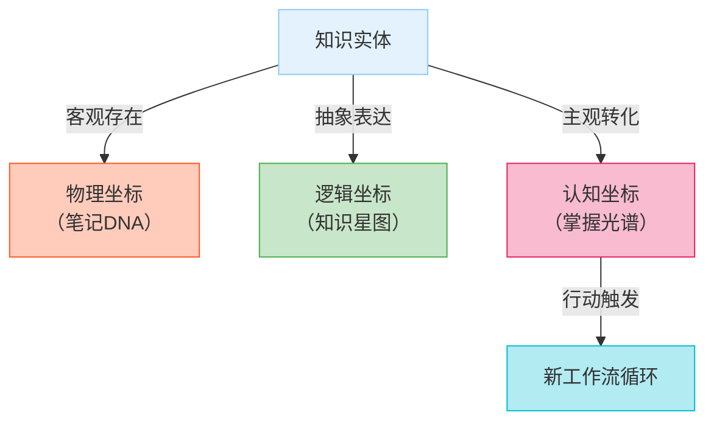

对于认知坐标，DeepSeek 用一个例子说明：

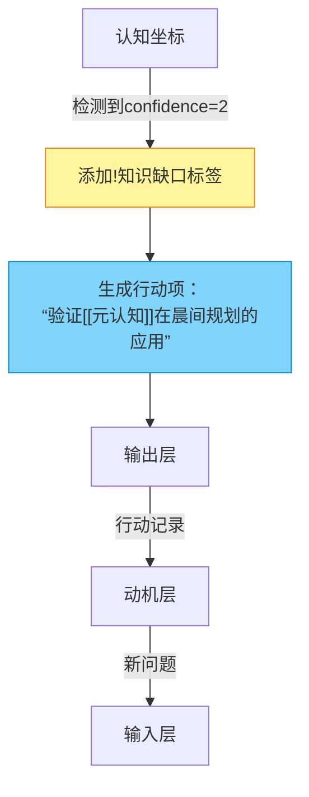

最后，DeepSeek 总结了元数据是如何在“法-术-器”层面起作用的：

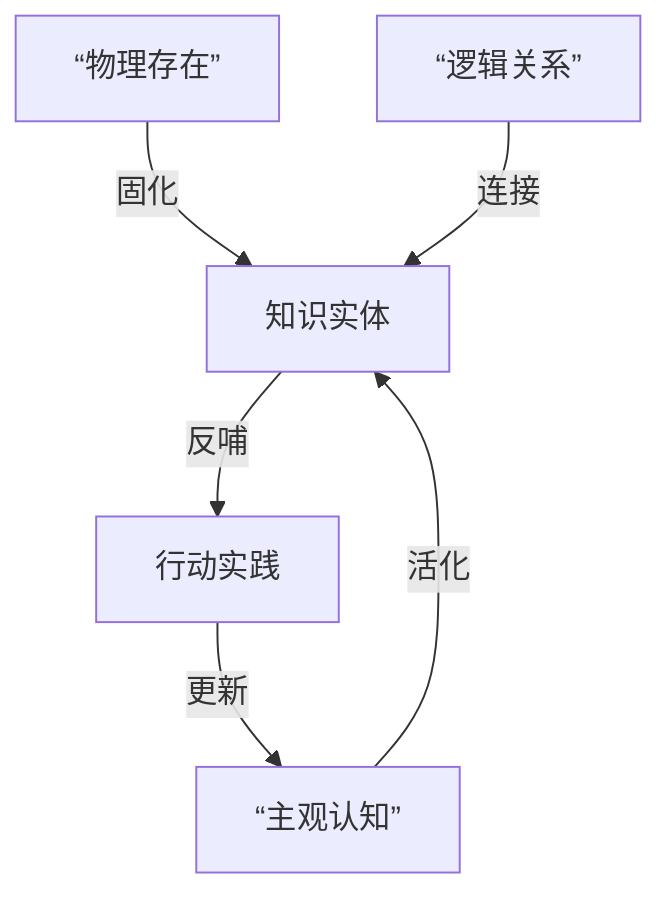

引用 DeeSeek 的一段话：

>当您打开Obsidian时：
>
>- 您看到的是**物理坐标**（笔记元数据）
>- 您思考的是**逻辑坐标**（知识网络）
>- 您创造的是**认知坐标**（个人理解）


### 1. 来源维度 

| 字段              | 说明         | 示例                                      | 必要性   |
| :---------------- | :----------- | :---------------------------------------- | :------- |
| `sourceType`      | 载体类型     | `book`/`podcast`/`video`/`paper`/`course` | 必填     |
| `sourceTitle`     | 来源完整名称 | 《认知觉醒》/《Lex Fridman Podcast》      | 必填     |
| `sourceCreator`   | 创作者       | 周岭/Lex Fridman                          | 必填     |
| `sourcePublisher` | 出版方/平台  | 中信出版社/YouTube                        | 选填     |
| `sourceDate`      | 来源发布时间 | `2020-03`                                 | 选填     |
| `sourceLink`      | 来源链接     | [URL]                                     | 强推     |
| `sourceISBN`      | 书籍唯一标识 | `9787508660752`                           | 书籍必填 |
| `sourceDOI`       | 论文标识     | `10.1016/j.tics.2021.06.001`              | 论文必填 |

### 2. 内容维度 

| 字段            | 说明            | 示例                                                         | 必要性 |
| :-------------- | :-------------- | :----------------------------------------------------------- | :----- |
| `coreConcept`   | 核心概念/模型名 | 艾宾浩斯遗忘曲线/二八法则                                    | 必填   |
| `knowledgeType` | 知识分类        | `concept`/`model`/`method`/`principle`/`case`/`quote`/`data` | 必填   |
| `domain`        | 所属领域        | `认知科学`/`经济学`/`AI`                                     | 必填   |
| `abstract`      | 一句话摘要      | 描述遗忘规律的记忆模型                                       | 强推   |
| `keyDiagram`    | 核心图表代码    | ````mermaid graph LR...`                                     | 强推   |
| `complexity`    | 理解难度        | `1-5`分                                                      | 选填   |

### 3. 认知维度

在认知维度，存在知识管理中最大的挑战——**如何将主观认知客观化**？

我真正需要的是既能反映认知状态、又能指导行动的关键指标。特别是对于终身学习者来说，**评估工具本身不应该成为学习的负担**。

| 字段            | 说明         | 示例                                                 | 必要性 |
| :-------------- | :----------- | :--------------------------------------------------- | :----- |
| `maturity`      | 笔记成熟度   | `seedling`(初稿)/`budding`(发展中)/`evergreen`(完善) | 必填   |
| `lastReviewed`  | 最后复习时间 | `2023-08-20`                                         | 必填   |
| `confidence`    | 掌握置信度   | `1-5`分                                              | 强推   |
| `knowledgeGaps` | 知识缺口     | ["神经机制不明","缺少案例"]                          | 选填   |
| `actionItems`   | 行动项       | ["实践费曼技巧","验证模型"]                          | 强推   |

其实，三维坐标的设计正好对应了 know-what/know-how/know-why 的**三阶认知模型**：

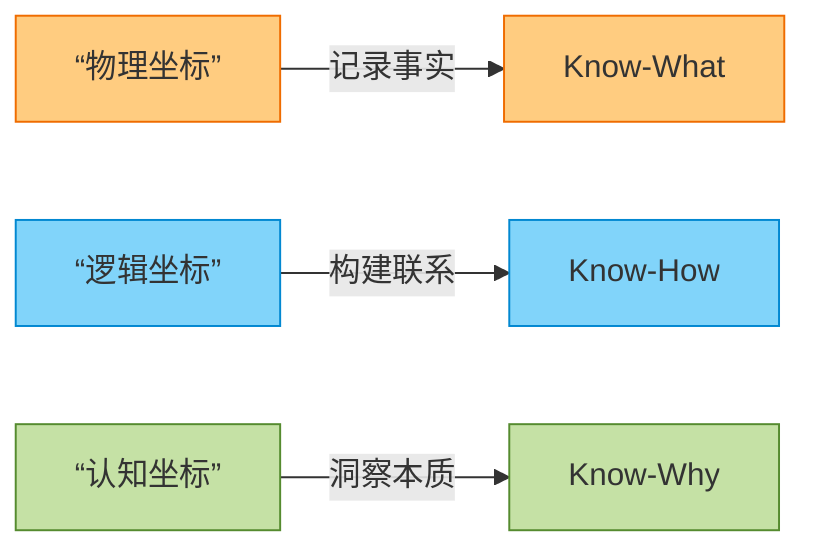

三阶认知模型和不同层面的对应关系为：

| 认知 | know what      | know how     | know why                          |
| ---- | -------------- | ------------ | --------------------------------- |
| 维度 | 理论层面       | 行动层面     | 思想层面                          |
| 方法 | 费曼学习法     | MVP          | 批判写作（正反观点）+知识图谱扩展 |
| 工具 | Typora         | Logseq       | Obsidian                          |
| 说明 | 抽象概念具体化 | 实践检验原理 | 洞察底层逻辑                      |

那么，置信度和成熟的区别是什么？

| **维度**     | 成熟度 (Maturity)                      | 置信度 (Confidence)                      |
| :----------- | :------------------------------------- | :--------------------------------------- |
| **定位**     | 知识的**客观完成度**                   | 您对知识的**主观掌握度**                 |
| **评估对象** | 笔记内容本身                           | 您与该笔记的关系                         |
| **进化动力** | 知识结构的完善                         | 应用验证的积累                           |
| **衡量标准** | Know-What/How/Why 的完整性             | Know-What/How/Why 的掌握证据             |
| **上限制约** | 置信度≤成熟度 （无法掌握不存在的内容） | 成熟度≥置信度 （知识可能比您理解的更深） |

> **置信度与成熟度的关系**如同**剑与剑法**：
>
> - 成熟度是剑的锻造品质（客观存在）
> - 置信度是您的剑术水平（主观能力）
> - 三维训练法就是您的《独孤九剑》秘籍

对于笔记成熟度，DeepSeek 给出了评判标准：

| 等级          | 评估标准（可验证证据）                | 认知维度  |
| :------------ | :------------------------------------ | :-------- |
| **Seedling**  | • 核心概念正确定义 • 来源信息完整记录 | Know-What |
| **Budding**   | • 建立1+应用场景 • 连接3+相关概念     | Know-How  |
| **Evergreen** | • 能解释底层原理 • 经跨领域验证       | Know-Why  |

和掌握置信度，DeepSeek 给出了评判标准：

| 等级  | 验证方式            | 通过标准                    | 认知维度  |
| :---- | :------------------ | :-------------------------- | :-------- |
| **1** | 概念复述            | 能说出基础定义              | Know-What |
| **2** | 单场景应用          | 在典型场景成功实践1次       | Know-How  |
| **3** | 多场景迁移+原理阐释 | 在2个不同领域应用并解释机制 | Know-Why  |

### 4. 关系维度

| `parentNote`      | 关联原始笔记 | `[[note-认知科学]]`           | 必填 |
| ----------------- | ------------ | ----------------------------- | ---- |
| `childCards`      | 衍生知识卡片 | `[[card-工作记忆]]`           | 选填 |
| `relatedConcepts` | 相关概念     | `[[刻意练习]]`,`[[心流]]`     | 强推 |
| `opposingViews`   | 对立观点     | `[[行为主义学习论]]`          | 强推 |
| `appliedIn`       | 应用场景     | `[[写作技巧]]`,`[[项目管理]]` | 强推 |

### 5. 管理维度

| 字段          | 说明       | 示例               | 必要性 |
| :------------ | :--------- | :----------------- | :----- |
| `cardID`      | 卡片唯一ID | `CRD-2023-B001`    | 必填   |
| `createdTime` | 创建时间   | `2023-08-20T14:30` | 必填   |
| `updatedTime` | 更新时间   | `2023-09-15T10:22` | 必填   |
| `curator`     | 整理者     | 您的姓名           | 选填   |
| `version`     | 版本号     | `v1.2`             | 强推   |

### 6. 标签系统

- 使用三级层级标签
- 特殊标签前缀：
  - `!`
  - `$`
  - `@`

### 7. 总结

这套系统虽然详实，但是感觉维护成本太高，容易陷入为了管理而管理的境地

对于数量不超过 100 篇的笔记而言，这样做有些大材小用了

同时，如果笔记超过 100 篇，我的认知负荷也会增加

## 2025-07-12

截止今天，我一共产出了 49 篇笔记：

- 6 篇 blog
- 12 篇 card
- 8 篇 note
- 23 篇 ref

我把这 49 篇笔记系统地进行了分类，分别放在四个 review 中：

- PKM
- 社会可续
- 问题解决
- 自我管理

于是，现在笔记变得有结构了起来：

- README 中放所有 review
- review 中放同类型的 card/blog
- review 的作用有两种：
  - 充当 card/blog 的 MOC
  - 记录该主题下的所思所想，当其篇幅足够长时，便可产出为 blog
- note/ref 产出 card/blog, 不再对其进行细分
- 由于 review/note/ref/card/blog 都在同一个文件夹中，因此所有笔记是相同层级的，相互之间是可以引用/链接的，于是避免了分类导致的知识边界

---

## 2025-07-21

从[blog-君主论](atom-25-02.md)中提取了「AI 雇佣军」的概念，要警惕 AI 的双重面孔：

| **工具性价值**   | **认知侵蚀风险** |
| :--------------- | :--------------- |
| 信息检索加速器   | 削弱信息溯源能力 |
| 模板化方案供应商 | 僵化问题解决思维 |
| 语言修饰助手     | 弱化逻辑自洽训练 |

需警惕*依赖雇佣思考者的人，永远在焦虑中等待崩溃*

---

## 2025-07-23

今天发布了一篇[博客](review-PKM-纸质记录.md)，列举了纸质笔记的应用场景和使用方法。其中提到：

>A6 负责记录：
>
>- 关系图谱/头脑风暴
>- 行动追踪
>- 概念定义

目前暂时还没有应用行动追踪。对于概念定义，这比较符合线性的书写习惯，暂无额外的想法。

对于关系图谱和头脑风暴，最终还是要归档到数字笔记中，形成规范的文档。此外，<mark>有必要找到一种方法，把所有的批判性思维（质疑/联想/类比）集中一处 ，最好以可视化的形式展现出来，因为这些才是我独一无二的产出</mark>。随着积累的知识越来越多，有必要形成类似思维导图的层级结构，同时又不能局限于思维导图，需要更灵活地展现各个知识点之间的关联。一个好的关系图谱应该包括两点：

- 清晰明确的关系展现：**父子/同级**
- 知识点和知识点之间需要必要的**文字和箭头说明**

最近尝试了以下方法：

1. 白板类：使用插件 Excalidraw (以及高阶版的 Excalibrain)
2. 使用笔记作为 MOC, 在笔记中插入：
   - markmap 代码
   - mermaid 代码
   - 使用插件把 markdown 笔记当作 mindmap 查看
   - 表格

根据前面提到的两点的标准，对这些方法进行打分：

| 展现难度      | 白板类 | 思维导图 | mermaid | 表格     |
| ------------- | ------ | -------- | ------- | -------- |
| 父子关系      | 低     | 低       | 低      | 无法实现 |
| 同级关系      | 低     | 无法实现 | 低      | 低       |
| 文字/箭头说明 | 低     | 无法实现 | 高      | 低       |
| 排版/语法     | 高     | 低       | 高      | 无       |
| 加载卡顿程度  | 中     | 高       | 低      | 无       |
| 可视化程度    | 高     | 中       | 高      | 低       |
| 未完待续...   |        |          |         |          |

---

## 2025-07-24

最近开始在移动端（iPad mini 7/iPhone 13）使用 obsidian, 遂产生了同步的新需求：如何在移动端更好地同步笔记？我还是更习惯使用 Windows 电脑进行编辑。现在把_Aleph 文件夹放在了 MacBook 的 Obsidian 应用程序文件夹中，这样就可以通过 iCloud 实现电脑和移动端的同步了：

1. 在家中使用 Windows 电脑编辑然后把笔记同步至 GitHub
2. 使用 MacBook 从 GitHub Desktop fetch 云端笔记，作为补充编辑选项（外出/旅行）
3. 使用 iCloud 同步移动端笔记

于是现在的方案如下：

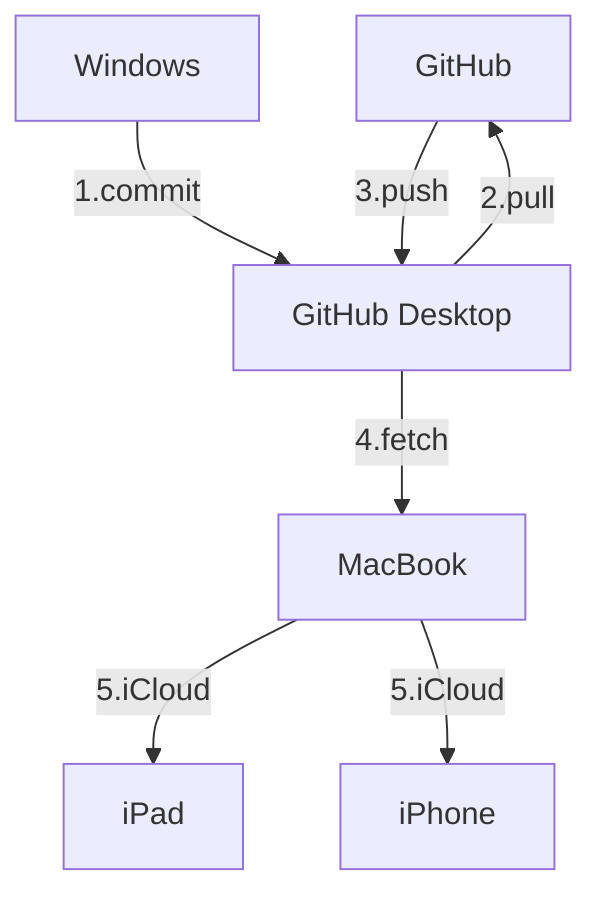

需要说明的是，笔记加工的主力军还是电脑，移动端仅作为阅读使用。这套方案唯一的阻碍就在于，每次使用 Windows 电脑编辑完，还需要在 MacBook 中使用 GitHub Desktop fetch 一次。 

---

## 2025-08-25

### a) CODE 和 DIKW 的对应关系

以前：依次对应

现在：E 不一定对应智慧，消化之后的表达可能只是浅层的知识，需要不断迭代 CODE 才能最终形成智慧

### b) 笔记工具箱

以前：Flomo + Logseq + Obsidian + 备忘录

现在：舍弃了 Flomo 和 Logseq，改用纸笔进行一元化记录 —> Pocket 活页整理 —> 输入知识库  —> Personal 活页消化树状知识并记录 Bridge Notes + Pocket 记录原子笔记

### c) 备忘录结构优化

以前：Fleeting  —> prog. Reading  —> Distill —> Archive

现在：inbox  —> mini essay  —> archive

Inbox 作为收集箱，mini essay 为特定主题的大纲

### d) 关于 Distill

- 让 AI 精简数字笔记内容，打印至 Personal 活页
- 提炼关键概念，抄写至 Pocket 活页形成原子笔记

### e) 关于知行合一

- 知对应 Zettelkasten
- 行对应 PARA
- 知与行需要 LYT 结合：
  - 创建 MoCs
    - 以主题为导向
    - 以问题为导向
  - 创建 Bridge Notes 专门总结批判性思考：
    - 双栏布局
    - 对话式笔记：正题/反题/合题

### f) 关于认知负荷

以认知负荷理论为基础，打造知识库：

- 最小化外在负荷
- 最大化相关负荷

### g) DKIA 模型

结合目前已有的知识点，创造自己的人生模型：DKIA (Drive-Knowledge-Integration-Action)

- Drive Layer
  - Meta-Tool
    - Critical Thinking
    - 80/20 法则
  - Floyd 心理人格结构：自我/本我/超我
  - 精力金字塔：意志/思维/情绪/体能
  - Cogito
- Knowledge Layer
  - DIKW
  - Feyman
  - Zettelkasten
- Action Layer
  - 指导思想
    - 刻意练习
    - 锚点思维
  - 实现方式
    - PARA
    - CODE
- Integration Layer
  - MoCs
  - Bridge Notes

Drive 驱动 Knowledge 和 Action, Knowledge 和 Action 通过 Integration 连接，Integration 反馈给 Drive.

# 2026

## 2026-01-06

又过了大半年，再次回顾我的 PKM, 不知不觉已经写了快 100 篇笔记。可以明显发现灵感变得更多了，链接也变得更多了。昨天晚上和 ChatGPT 聊天得到了一些洞见，总结下来是三点：

- **分类 = 隔离**：分类最大的问题不是管理成本，而是过早地冻结笔记的意义
- **跨学科 = 洞见**：如果我给一篇笔记贴上“标签 A” 和“标签 B”，等于是在告诉未来的自己，这篇笔记只能从这些角度被理解。而真正有价值的时刻，往往发生在用错误的视角读对的材料的时候
- **检索 ＞ 整理**：用问题而非主题去锚定笔记，这样做的好处是，未来我不是在找一篇笔记，而是在重遇一个问题

顺着最后一点，可以提出一个论文模型，把笔记统分为两大类：

- 文献笔记 ≈ 颗粒度更粗的文献
- 问题导向的笔记 ≈ 我写的论文

以下内容引用自 ChatGPT

> 第一种文献型笔记， 它们的职责只有一个：**可被引用**
>
> 一篇高质量文献型笔记，合格标准非常低，但非常明确：
>
> - 它说清楚了一个观点或模型
> - 它保留了来源、上下文、限制条件
> - 它没有假装自己是结论
>
> 这种笔记不需要“完成感”，就像论文里的参考文献，你不会因为没把它“想透”而焦虑
>
> 第二种，才是真正稀缺的东西：**问题型笔记**
>
> 问题型笔记不是“记录我学了什么”，而是：
>
> - 我正在试图解释什么现象
> - 我在哪些地方卡住了
> - 哪些材料被我拉来当证人
>
> 它们天然是“未完成的”，而且应该允许自相矛盾，这正是论文初稿的状态
>
> AI 最擅长的不是“替你思考”，而是**在你已经有问题时，帮你召回可能相关的证据**。
>  这和论文写作里的文献回顾几乎一模一样。
>
> 所以真正面向 AI 友好的，不是复杂的链接结构，而是：
>
> - 清楚的问题陈述
> - 明确的论点痕迹
> - 可被机器读懂的自然语言
>

所以现在要做的事情是，开始写问题型笔记

## 2026-01-09

新洞见：

- 长青笔记 ≈ 问题型笔记
- 只对问题型笔记进行分类
- 对于文献型笔记统一打上 ref- 或 book- 前缀，不做分类

那么现在对于问题型笔记，存在两个问题：

1. 如何设计笔记结构？
2. 如何进行有效分类？

对于第一个问题：

什么叫做有效？要满足以下几点要求：

- 自然语言
- 轻量化
- 元数据不依赖于笔记内容

核心原则是：不要在笔记里迎合数据库，而是应该让数据库迎合笔记

于是我的想法是：

1. 对于每一篇问题型笔记，添加 YAML 表头编辑元数据
2. 使用脚本提取知识库中的所有 YAML 数据，如有必要可以转换为中间格式（json/csv...）
3. 把数据导入至更符合人类认知的数据库软件 UI

ChatGPT 告诉我，这里有个非常重要的认知转变：

> Obsidian 的 Dataview 是“在 Markdown 里假装数据库”
>  你要的是“把 Markdown 暴露给真正的数据库”
>
> 所以你的核心组件其实是一个很小的东西：
>
> - 遍历所有 `.md` 文件
> - 读取 YAML front matter
> - 合并成一个结构化文件
>
> 这个步骤一旦存在，后面世界就打开了：
>
> - 导入 Notion
> - 导入 Airtable
> - 导入本地 SQLite + 任意前端
> - 喂给 AI 做索引
>
> 而且这个过程是**单向、可重复、可丢弃的**。

## 2026-01-11

顺着上一次的思路，趁热打铁对知识库进行了一次大更新，把原先将近 100 篇笔记进行了精简

现在的系统分为两类：

- 问题型笔记：前缀为 `atom-`
- 文献型笔记：
	- 来自书籍的笔记，前缀为 `book-`
	- 来自网络的笔记，前缀为 `ref-`

另外对 `atom-` 的笔记添加了元数据，用的是 `YAML` 语法

元数据的展现形式是 `obsidian` 的插件 `base`，好处是在使用 obsidian 时可以在 `README.md` 中插入数据库实时显示，也可以使用插件实现统一管理

一个未来的想法：当标签嵌套超过三级，说明标签之间是存在结构的，此时应该考虑对标签建立 `MOC` 索引

## 2026-01-18

关于问题型笔记，再次和 ChatGPT 对话

### 问题

- 文献型笔记再怎么整理，它们都不会自己产生意义
- 问题有很多类型：单个概念/不同概念/整本书/多本书，而且会变化、演化、互相污染

### AI 建议方案

三个原则：

- 你现在不可能一次性把“问题的类型”设计对
- 解决办法不是更精细的分类，而是让问题可以退化和升级
- 你最宝贵的不是信息，而是你与信息发生反应时留下的痕迹

建议方案如下：

先只做一类笔记（我已经在做了，统一标题前缀 atom-）

**i) YAML 元数据**

设计 `status` 属性，不要其他标签/优先级/情绪难度，只记录问题的状态：

- `seed`: 刚产生，混乱，未来可能推翻
- `growing`: 反复想过，结构开始稳定
- `stable`: 短期内不想再改了

**ii) 开头：一个锚点句——我现在卡住/震撼/不确定/反感/认同的到底是什么？**

锚定的作用是定位认知摩擦发生的位置，比如：

- 我几乎全盘接受了这些观点，这让我不安
- 我理性上同意，但行动上做不到
- 我隐约觉得这个论述在偷换概念，但一时说不清

AI 抓住了问题型笔记的核心：

> 一篇问题型笔记，写的不是“我想到了什么”，而是“我在和什么东西对抗”
>
> 如果没有对抗对象，那基本就是信息的再分发
>
> 如果你现在回头看一篇笔记，却完全感受不到摩擦，那篇笔记大概率只是在“存档”

**iii) 中间：思考本体**

1. 我的第一反应：决定了我被影响前的状态
2. 隔离变量：不要把别人的东西当作是自己想出来的，要明确文字的来源（AI/书/人）
3. 批判性思考：我的反抗/妥协/不适，目的是要承认想法的不完整/不确定/借用 AI. 参考句式：
   - 我在借用 AI 的逻辑，而不是自己走一遍
   - 我接受这样的解释，但是有两个地方不舒服
   - 如果让我复述这个观点，我可能只是换了一种说法

**iv) 结尾：链接，大约 3-7 个参考笔记**

当引用过多，说明我在试图用文献笔记的引用数量代替自己的思考

**v) 笔记何时拆，何时分？**

拆：我想引用一部分，但不得不读完全篇

分：我在两篇笔记中讲了同一个事

**iv) 如何防止被 AI 同化？**

1. 列出问题后，先自己盲写
2. 问 AI 参考答案
3. 重点是记录：AI 比我多做了哪一步推理

或者主动找 AI 的反例，首先对 AI 持怀疑态度

---
date: 2025-07-23
author: me
---

# 2025-07-23

## 0. 动机

使用笔记软件整合信息虽然高效，但是也给我带来了一定的疏离感。于是，我开始考虑打造手写笔记系统。需要强调的是，重新回归纸笔，并非否定数字笔记的意义：二者应该是共存的互补关系，而非二元的对立关系。

按照黄金圈法则，提出三个问题：

- why：为什么在电子时代仍要进行纸笔记录？ 

- how：如何使用 A6/A7/A8 的小本子记录？ 
- what：应该在本子上记录哪些内容？

## 1. 关于 why

### a) 为什么使用数字工具会存在疏离感？

Deep Seek 回答如下：

> - 数字工具模拟的是"手写动作"，但无法模拟"纸面空间认知"
> - 神经科学已经证实，手写会激活大脑不同区域：
>   - 纸笔 → 触觉反馈
>   - 纸张 → 空间记忆

在 Obsidian 白板拖拽笔记时缺失的正是这种多感官协同记忆。

### b) 数字时代坚持纸笔记录的深层价值是什么？

使用数字软件，思考的过程很难完整的在笔记中呈现，因为：

> 数字化的修改不留痕迹，而纸笔的涂改痕迹其实是元认知的路标

因此，手写的意义在于：

- 思维痕迹的可视化[^3]
- 提升专注度，更容易产生洞见/顿悟感[^1]

[^3]:这种有摩擦的深度加工，就像是陈酿美酒，而数字笔记是高效的榨汁机
[^1]:来自 Deep Seek, 真实性有待验证：在约翰·霍普金斯大学 2023 年的最新研究中，他们在 fMRI 监测下发现，手写时前额叶与楔前叶的同步性比打字时高 37%, 而这两者协同工作正是产生“顿悟感”的生理基础

## 2. 关于 how

### c) 相比于 A4/A5 的大本子，使用小本子的优势是什么 ？

- 更好地精炼数字笔记信息
- 符合拇指测试[^2]标准

[^2]:拇指是否可以自然覆盖页面 1/3 区域？这个覆盖区就是视觉焦点的范围。单手持本时，小本子的焦点区 ≈ 手机屏幕，符合现代人视觉习惯

### d) 如何选择纸张尺寸？

|           | A6            | A7             | A8         |
| --------- | ------------- | -------------- | ---------- |
| 尺寸 (mm) | 74 X 105      | 52 X 74        | 37 X 52    |
| 用法      | 多个概念整合  | 单个概念追踪   | 关键词联想 |
| 跨页策略  | 双页协同变 A5 | 页角折叠扩展区 | 平面重组   |
| 字数限制  | 300 字/页     | 150 字/页      | 50 字/页   |

A7 显得有些不伦不类——既不如 A6 书写面积大，又不如 A8 小巧便携，故而舍弃 A7, 采用 A6 + A8 的笔记策略。

### e) 如何选择本子类型？

|          | 活页本/卡片     | 固定本（TN 护照本/线圈本） |
| -------- | --------------- | -------------------------- |
| 认知哲学 | 知识可重组      | 接受思维原始态             |
| 受众群体 | 逻辑型思考者    | 直觉型思考者               |
| 书写方式 | 高迭代/高频重组 | 线性沉淀/情感附着          |

A6 活页本显然是最优解，但是目前我只有线圈本，所以先把线圈本用起来，后面再慢慢摸索布局和形式。更何况，如果某页与前面某页属于同一主题，额外添加页码就好了。

### f) 如何布局？

把一张纸分为以下几个模块：

- 思考区
  - 灵感
  - 悖论/质疑
  - 跨域联想
- 结晶区
  - 概念定义
  - 行动
  - 图谱

## 3. 关于 what

### g) 哪些内容要使用纸笔记录下来？

作为数字笔记的补充，手写笔记当然是去记录那些数字笔记无法体现的东西。这其实是问题 b) 的一个延伸——哪些内容无法在数字笔记中呈现？答案如下：

- （突如其来的）灵感
- （跨域联想产生的）灵感
- 批判性质疑
- （计划的）行动
- （完成的）行动
- 精炼后的概念定义
- 关系图谱/头脑风暴

### h) A6 和 A8 分别记录什么？

记录的原则是：<mark>记录自己的主动思考，而非变为电子笔记的摘抄本</mark>

A6 负责记录：

-  关系图谱/头脑风暴
- 行动追踪
- 概念定义

A8 负责记录：

- 灵感捕捉
- 看着 obsidian 关系图谱，强制联想
- 问题/批判性质疑

纸笔记录的最终结果，是要把记录的内容归档在电子笔记中 → <mark>如何归档？</mark>

### i) 纸笔记录的辅助方式有哪些？

四种辅助方式：

- 使用不同颜色的笔/高亮：区分文字内容

- 画框 X 划线：划分模块

- 箭头 X 符号：表现关系
- 折痕 X 褶皱：使用痕迹

### j) 纸笔记录存在哪些阻力？

阻力如下：

- 纸张布局
- 字是否好看
- 天然抗拒写错

应对方法如下：

- 关于第一点：提前预留小空间 → 见下页
- 关于后两点：留下“失败”的痕迹，对抗电子笔记的完美主义——<mark>真正的思考自由从“允许自己写垃圾”开始</mark>

### k) 纸笔记录存在哪些潜在陷阱？

需要警惕两个陷阱：

- 限于纸张篇幅，精炼数字笔记的同时也存在信息损耗的风险（遗漏上下文）
- 工作流切换的认知成本

---

# 2025-08-25

实践纸质记录一个月，目前形成了三个本子的体系：

- 用 A6 Pocket Notebook 进行一元化记录，目的是清空大脑的想法
- 每周回顾笔记内容，分类整理到 Pocket Binder 作为 inbox
- 整理数字笔记
	- 成体系的内容打印至 Personal Binder 作为 distill
	- 单个概念整理至 PockePocket Binder 作为原子笔记

# 2026-01-22

纸质笔记实践已经半年了，效果显著

目前已经写完了 7 个本子，真正起到了 Fleeting Notes 的作用

最近和 ChatGPT 深度聊天之后获得灵感，记录在 # 008 中，以下为整理后的内容

## 0. 动机

之前存在一个认知摩擦：每次想写笔记时，都要纠结是以 `atom-`还是`hypo-`作为前缀——任何由于分类产生的认知摩擦都应该避免！

尽管经历了一次数字笔记的大改，现在问题型笔记全部以 `atom-`开头，只做 `atom-`之间的链接。但是存在两个风险：

1. 笔记容易退化成 MoC, 没有思考，只有陈列

2. 笔记数量激增，从而导致认知负荷

如何预防风险 1？对于聚合类笔记，在开头添加锚定句：

> 我试图把以下笔记放入同一个压力场中，用以说明/阐述/批判 xxx

同时，ChatGPT 也告诉了我一个潜在风险：

> `atom-`越来越诚实，也越来越锋利，但你开始回避重读它们

这点说的可太对了

尽管现在有一些白板笔记软件，但是：

- 只要坐在电脑前，我的认知状态就是：我要产出，而非我要思考
- 即使强迫自己思考，在不同笔记之间来回跳动简直就是灾难

## 1. 真正的问题

ChatGPT 告诉了我真正的问题在于：

> - 本子 ＝ 思考发生
> - 数字笔记 ＝ 思考被承认

而这两者之间缺少一个中间态

于是，我想到，不是缺少中间态，而是这二者之间本就应该是可以互相转化的双向关系

ChatGPT 认可了我的想法，同时给出三点建议：

1. 在笔记开头写上： `atom-`源自本子 x 的第 y 页，通过画图/涂改/并排/对照产生
2. 不要强行使用 `mermaid`语法或者列表，从而造成提前完成的感觉——在笔记中写“我认为它们之间存在这种关系，但是我还无法讲清逻辑”
3. 没进入数字笔记 ≠ 失败——数字笔记是被选中的内容，而非完整的映射

## 2. 与 AI 的认知摩擦

我仔细想了想，其实我的摩擦不止存在于数字和纸质笔记之间，还有 AI:

- AI 给出的回答是顺着我的逻辑走的，我只是跟着这条逻辑继续在走
- 即使有茅塞顿开的感觉，隔一段时间就会发现其实并没有完全吸收，有时理解的甚至完全不对
- AI 的回答语句很通顺，还经常使用比喻/类比，看起来很“权威”
- 我不用去想接下来应该怎么思考

所以，纸质笔记真的是破除数字笔记和 AI 的一个强有力工具，它强迫我“慢下来”，这样我会有更多的时间去通过大脑思考

目前我的一套思考流程如下：

1. 与 AI 对话，获得视角/思路/启发
2. 产生“我好像懂了”的感觉
3. 在本子上写写画画
4. 发现卡点/阻力/问题 → 1
5. 把内化的东西写入数字笔记

三种介质的功能如下：

- AI: 制造语言上的可能性与视角
- 纸：内化/重构内容，让理解真正发生
- 数字笔记：为理解立案留痕


---
date: 2025-10-11

---
# 2026-01-10

想到一些关于上学和工作的不同之处：

上学的时候做题，已知是很明确的，问题也是很明确的，我们锻炼的只是中间的求解过程

等工作以后，问题和已知都是不明确的，有时甚至会随着时间而改变。相比于求解，或者说处理过程，我们更要具备的是，明确已知和问题的能力。如果它们无法明确，至少要转变观念——**工作的大部分内容都是在确定已知和问题，而不是处理**

从这个角度来说，所谓的问题解决的能力，看的似乎从来都不是如何把问题一步步解决，而是去明确已知，定义问题

# 2025-10-11

下个月就要告别产线测试，正式进入研发的电气仿真岗位

现在，是时候对这一次转变进行一次全面的复盘了

按照 Deep Seek 给出的建议，从四个维度进行剖析：

* 目标
* 策略
* 执行
* 进化

> 在复盘时，应该遵循以下原则：
>
> 1. 记录事实，而非感受： 在分析每个维度时，先罗列客观事实。例如，不是“我感觉面试很好”，而是“我用了PPT、提到了 X 案例、老板当时点头并追问了 Y 问题”。
> 2. 对比预期与结果： 这是发现问题的关键。将“维度一”的预期与“维度三”的结果逐一对比，找到差距（无论是正面的还是负面的）。
> 3. 深度剖析，追问“五个为什么”： 对于关键的成功或失败点，不断追问“为什么”。例如：“为什么我的桥梁价值被认可？” → “因为我给出了具体落地场景。” → “为什么我能给出？” → “因为我提前思考了工作流并预判了痛点。”
> 4. 提炼原则，形成清单： 将复盘的结论转化为未来的行动指南。例如：
>    - “转岗成功检查清单”
>    - “面试价值主张设计原则”
>    - “入职前100天行动计划”
>
> 最后，请记住： 复盘不是一次性的总结，而是一个持续的、螺旋上升的过程。您在新岗位上遇到的每一个挑战和成功，都可以不断回过头来丰富和修正这次的复盘结论。

## 1. 目标与定位

### a) 初始动机

> 为什么当初想离开测试部门？

客观上：

* 工作逐渐进入舒适区，开始出现重复性的工作
* 新老板的 Debuff：
  * 外国人，德语和英语说的都不好
  * 外行
  * 外部公司空降，而且是小公司
  * 从前没有管理岗经验，来到我们部门要一下管理 15 个人
* 测试部门在新老板到来之后，未来的发展方向并不清晰
* 说到底，测试的研发部门毕竟还是属于生产部门，还是以降本为核心去开展工作
* 无法参与研发更高维度的工作：
  * 新的 Package
  * 新的 Chip
* 测试部门的核心竞争力有限：
  * 绝缘测试一般来讲没什么大问题
  * 静态测试被特定的同事牢牢占据
  * 动态测试在 Package 确定的情况下，只能取决于电气研发的决策

主观上：

* 我没有看到新老板规划的 Agility Team 如何与测试的核心竞争力相匹配
* 如果仅有产线工作的经验，相对于国内，竞争力并不大
* 最近看了很多方法论的书籍，做了大量笔记，希望可以放到工作中去真正使用，毕竟实践是检验真理的唯一标准
* 我的性格，遇到问题可能更习惯先自己思考，即使自己无法解决问题，也更偏爱先尝试把问题描述清楚再求助他人，这在产线测试中也许会浪费很多时间，甚至显得有些 Overengineering

### b) 目标清晰度

> 我对新岗位的期望是什么？

* 增加核心竞争力：
  * 虽然从测试到电气仿真是一个不小的跨越，但总归还是在技术岗位
  * 测试属于硬件，仿真则是软件，软硬结合，可以让我拥有更多不可替代性
  * 进一步强化 Problem-Solving 的能力
* 积累更多资源
  * 技术资源：
    * 毕竟是研发岗，今后可以有机会更多地与前道的芯片研发、后道的模块机械研发、电气研发、电气概念以及市场组交流
    * 新部门的特殊之处在于，虽然被归到了模块部门，但实际上也会接触很多其它的 Package，比如单管或者 Bare Dies
    * 新部门的老板本身就是技术出身，半导体物理的博士，在工作中肯定可以给予更多指导
  * 人脉资源
    * 同第一点，可以接触更多 BU 的同事
    * 相信以后会有更多的 Workshop
* 升职
  * 目前组内人比较少，除了老板，只有 6 个人，除了我之外其他人都至少是 EG13
  * Yikai 和我同一年入职，三年之后，现在也升到 EG13 了，我并不想和他作比较，但至少可以以他作为锚点去看差异

### c) 信息评估

> 试前我对新岗位的了解，与实际工作相比，有哪些准确之处？有哪些“信息差”或“误解”？

- [ ] tbd.

- 你之前理解的“仿真部门的工作流程”（如复现问题、给出方案）是否准确？部门的工作模式是项目制还是支持制？
- 信息差：实际的工作强度、会议数量、跨部门协作的复杂程度，与你想象的有何不同？仿真结果的“落地率”高吗？

### d) 价值主张验证

> 我当初认为的独特价值（即产线视角），在实际工作中是否真的被需要？

- [ ] tbd.  

这是你复盘的核心。入职后，请密切关注：

- 当大家讨论一个测试现象时，是否会主动询问你的看法？
- 你基于产线经验提出的“这个仿真条件是否过于理想”、“这个参数在产线波动很大”等意见，是否被团队采纳和重视？
- 电气研发组的同事是否会因为你的背景，而更愿意与你沟通测试规格？

## 2. 策略与规划 

### a) 机会识别

> 我是如何敏锐地发现这个岗位机会的？是主动搜寻，还是被动获得？如何能更系统地获取这类内部机会？

说起来真的很偶然，本来是想替一个朋友看看最近有没有新的职位放出来，结果一打开内部的 Job Search 就看到了这个职位，而且它刚被放出来一天

发现 Jobbeschreibung 的描述基本符合，于是第二天立即和 Yikai 了解情况，第三天就投了简历

<mark>**可迁移经验**：保持定期浏览内部招聘信息的习惯，即使不跳槽，也能了解公司技能需求的变化</mark>

### b) 优势-需求匹配

> 我的“三部曲”（简历-面试-PPT）是如何精准地将我的产线经验转化为仿真部门需要的解决方案的？这个匹配逻辑在现实中成立吗？

关于简历：

* 其实我不确定，新部门决定录用我，究竟是因为产线的经验，还是因为读书时发表的与电磁耦合相关的论文更契合仿真部门，还是说有我大学教授的背书作为保证

关于面试：

* 面试本来决定线上进行，但是临时改成了线下
* 这其实正是我希望的，最好是面对面的交流，这样更能捕捉细微的变化

关于PPT：

* 在阅读 Jobbeschreibung 的时候，发现对 Prasentation 的能力有要求，那么不如直接在面试中就展示出这种能力
* 我个人也更倾向于事先做准备，然后用 PPT 的形式展现出来，这样我可以把握整个面试的节奏，因为我展示的东西，就是我希望面试官看到的东西，我说起来也更有把握
* 从最开始的杂乱无章到最后精简的三页，PPT 前前后后准备了大概一周。专门看了一些制作 PPT 的技巧视频，这也是我的思路一步步从混沌到梳理清楚的过程。而 PPT 则是这种思维逻辑的展现

### c) 沟通策略

> 我的面试陈述和提问，是如何一步步构建“桥梁”人设，并管理对方在“软件技能”上的期望的？哪一点打动了对方最关键？

首先，我介绍了测试部门的工作性质和内容

其次，我介绍了我现有的核心竞争力：

* 大学知识作为基础
* 测试部门的相关度
* general 在工作中的 Problem-Solving 能力

最后，作为 Back-up, 准备了大学期间发表的两篇论文的摘要

对于软件技能，其实老板也没有过多去展开，毕竟他是技术出身，用他的原话说，就是符合二八法则：

80% R&D (Research and Development), 20% Methodik

软件只是工具，更重要的是要明白，仿真值不值得做，以及在做仿真之前，如何定义正确的问题

至于是哪方面打动了对方，我认为，就像同事和我说的：所谓面试，就是要面对面的去看一看这个人，确认面试者所在的部门同事以后愿意和 ta 一起共事。显然，他们未来是愿意和我一起共事的。为什么？因为我展示了不错的 PPT 技巧，大学知识比较契合。整个面试计划进行 60 分钟，而实际上我们聊了大概 90 分钟，整体的氛围也比较轻松愉快，中间甚至还有一些开玩笑的 small talk

### d) 风险规避

> 我预判了哪些风险（如技能短板）？我采用的应对策略（强调学习能力、转化视角）有效吗？

- [ ] tbd.

- 可补充内容：你预判的最大风险是软件技能短板。
- 应对策略：你在面试中成功将其转化为学习潜力和“Know-Why”优势。
- 有效性：从老板的反馈来看，非常有效。他更看重你解决问题的思维，而非工具熟练度。

## 3. 执行与掌控

### a) 准备效率

> 在有限的准备时间内，我是如何 prioritise 学习内容和面试准备的？哪些投入 ROI 最高（如PPT精炼）？哪些可以优化（如软件预学）？

首先，我要明确为什么转岗，于是先找 Yikai 问了仿真部门的情况，然后问 Deep Seek, 说出了我潜在的需求。沿着这个思路，开始准备 PPT, 中间穿插着 PPT 制作的学习，这也是投入产出比最高的部分。我并没有进行软件的预学，事实也证明，老板更看重的是 know why

### b) 关键时刻

> 在整个过程中，有哪些“关键时刻”（如老板要求看论文、技术问题对答）？我在这些时刻的表现如何？有哪些即兴发挥后来被证明是成功的？

关于关键时刻：

* 老板提问了我为什么要换岗，我展示了我的 PPT 中关于核心竞争力的部分
* 老板针对我的论文提出了一个关于互感是如何影响短路曲线的问题，我向他解释了互感现象存在的原因，以及寄生电感是如何对门极电压造成影响，进而对整个短路造成影响的

关于即兴发挥

* 开始的 small talk, 老板说我的德语讲的不错，我开玩笑地说，nicht gut, aber good enough für die Arbeit. 注：Good Enough 是我们公司去年在降本的大前提下提出的一个口号。这个回答为这次面试定下一个轻松的基调

### c) 资源利用

> 我利用了哪些内外部资源？（如之前的项目经验、论文、行业知识、甚至前同事的信息）。我还能调动哪些未利用的资源？

之前项目的经验 + 论文：放在了 PPT 中作为展示

同事的信息：

* Yikai: 仿真部门的同事，向我介绍了仿真部门大概的工作，以及招新人的动机
* Yizheng: Technical Marketing 的同事，给我提供了技术市场的视角
* Zheng: 我的学长，一起 review 了我的 PPT, 给了我很多面试的 Tipps
* Renke: 闲聊时说到了我的转岗，给了我很多支持，坚定了我要转岗的决心

<mark>你有效地调动了信息源（Yikai）、视角补充（Yizheng）、技能指导（Zheng）和情感支持（Renke）</mark>

我还能调动哪些未利用的资源：

* Thomas: 我的大学教授
* Weinan: 电气研发的同事

### d) 过渡管理

> 从拿到Offer到入职，我的告别、预热和学习计划，哪些做得好？哪些可以做得更丝滑？

- [ ] tbd.

这是你接下来要重点规划的部分。

- 告别：是否已发送告别邮件？是否与关键同事一对一告别？
- 预热：是否已联系新部门同事，了解他们当前的项目和挑战？
- 学习：是否已获得软件许可，并制定了第一个月的学习计划？

## 4. 迭代与进化

### a) 认知升级 

> 这次转岗，打破了我对仿真工作、跨部门合作或自身能力边界的哪些原有认知？

关于仿真工作

通过和老板的聊天，印证了我之前的观点，相比 know how 更重要的是有 know why 的能力

关于跨部门合作

tbd.

关于自身能力边界

正好最近读到了阮一峰的博客，我的这次转岗，恰好契合 Tim O'Reilly 所说的，重要事情的三大标准：

* 不仅仅为了赚钱 → 而是为了提升核心竞争力
* 创造了更多价值 → 做仿真更多的是项目正式开始前的 Feasibility Check, 更加从源头上去实现降本的原则
* 符合长期利益和整体利益 → 直接获益：技术；隐形获益：人脉

既然符合这三个标准，那么我就可以确信，自己在做的事情是值得的。内心中知道要做什么，剩下的就只是如何去执行的问题了。这么看来，能力边界似乎不再是很重要的事情了。

### b) 可迁移模型 

> 我能否将这次成功的经验提炼成一个可复用的模型？例如：

Deep Seek 给出的建议就不错：

> - “内部转岗三段论”：精准定位（**价值挖掘**）→ 深度说服（**策略沟通**）→ 软着陆（**过渡管理**）
> - “能力展示金字塔”：底层（**工具技能**）→ 中层（**问题解决**）→ 顶层（**战略思维/桥梁价值**）

### c) 能力地图

> 我清晰地看到了自己哪些核心能力（如跨部门沟通、结构化思考）是强大的？下一步最需要补强的1-2个关键能力是什么？

哪些能力我做的不错：

* 展示能力
* 沟通能力
* 逻辑思维能力
* 可以抓住面试官的核心需求

哪些能力还要加强：

* 学习新技术/软件的能力
* 套用阮一峰的一句话：在大公司学做人，在小公司学做事。而我，两手都要抓，两手都要硬

### d) 未来应用

> 如果未来我再面临一次转变（如晋升为技术经理），这次复盘得出的方法论和教训，将如何应用？

- [ ] tbd.

想象一下，未来你申请技术经理岗位。

- 精准定位：你需要挖掘的将不是“产线视角”，而是“技术执行者视角”，你能为管理团队带来哪些不同的价值？
- 深度说服：你依然需要准备一个“PPT”，阐述你的管理哲学和团队规划。
- 软着陆：你需要提前与未来的下属、平级经理建立联系，了解他们的期望和挑战。

## 5. 尾声

1. **完善`tbd.`部分**：将上述建议的“思考方向”作为你入职初期的观察清单，随时记录，定期更新
2. **开启新的复盘循环**：这份文档是“阶段1：转岗成功”的复盘。入职后，立即开启“阶段2：入职前100天”的复盘，关注点在：**学习曲线、关系建立、第一个项目的贡献**

# 2025-07-01
## 深度思考

嗯，这位用户是功率半导体产线测试工程师，想转岗到研发仿真部门，但担心软件技能不足。他的核心诉求其实很清晰：如何在面试中弱化工具技能的短板，突出自己独特的跨部门价值。

用户已经敏锐地抓住了关键点——老板招人是为了解决问题，而不是追求软件操作熟练度。他三年产线测试经验的价值可能被低估了。我注意到他描述的工作场景特别有说服力：当仿真部门给出改进方案后，最终需要产线测试工程师落地验证。这恰恰是他最大的优势——全链条视角。

仿真部门最头疼的问题可能就是仿真与实测的差异吧？用户每天在产线看到无数测试数据，哪些工况下仿真容易失准，哪些参数需要重点验证，他比纯仿真背景的人清楚得多。比如他肯定知道：双脉冲测试时产线实际遇到的振荡问题，往往和探针接触电阻、寄生参数等仿真难以覆盖的因素有关。

软件技能确实需要补课，但重点应该放在应用层面。ANSYS Q3D提取寄生参数、Simetrix导入芯片模型这些具体场景的操作，比泛泛而谈“会ANSYS”更有说服力。用户提到“知道为什么使用工具”很正确，建议他准备两个产线实际案例，说明“当时如果有仿真支持就能更快定位问题”。

转岗说服力的构建可以分三个层次：首先是问题诊断能力（用产线数据反推仿真需求），其次是落地保障能力（预判仿真方案在产线的可行性），最后才是工具应用能力（现学现用的具体计划）。老板最在意的可能是——招个纯仿真工程师回来，提出的改进方案在产线根本没法执行。

值得提醒的是，用户需要量化自己的产线经验。比如“处理过200+短路测试异常案例，熟悉振荡/电压过冲的16种产线诱因”，这种数据比“熟悉产线测试”有力得多。他还可以主动提出过渡期方案：转岗后前三个月同时支持部分产线工作，帮助新老部门衔接。

---

你的分析和思路非常清晰，抓住了转岗面试的核心——**站在老板角度思考价值**。你已有的产线测试经验恰恰是这个仿真岗位最稀缺的视角！以下是如何最大化你的优势、弥补短板、并精准打动老板的详细策略：

## 🔍 核心策略：突出“产线-仿真”桥梁价值，将“短板”转化为“成长性”

老板最关心的不是你会多少软件，而是**招你进来能解决什么问题、带来什么独特价值**。你最大的优势在于**深刻理解产线测试的痛点和数据**，这是纯仿真背景工程师难以具备的。

## 🎯 向老板展示的核心维度 (Why You?)

1.  **“产线测试视角”的核心竞争力 (你独一无二的价值)：**
    *   **精准定位问题 & 验证闭环：**
        *   “我深刻理解**产线测试的真实场景、数据含义、测试规格制定的依据以及可能遇到的偏差**。当电气研发组拿到仿真改进方案后，最终需要产线测试验证。我能**提前预判仿真方案在产线落地时可能遇到的挑战**（如测试夹具限制、寄生参数影响、可重复性问题），**优化测试方案**，确保仿真结果能有效、高效地被验证，**加速改进闭环**。”
        *   “我能**快速理解电气研发组提出的测试需求背景**，因为他们发现的问题（如震荡），正是我在产线测试中经常需要测量和分析的对象。我理解这些问题的**实际表现、严重程度和产线可测性**。”
    *   **仿真模型校准与验证的关键输入：**
        *   “仿真模型的准确性依赖于真实测试数据的校准。我拥有**丰富的产线实测数据（双脉冲、短路等）解读经验**，了解哪些参数在现实中波动大、哪些测试条件难以精确控制、测试结果中的‘噪声’可能来自哪里。这能**显著帮助仿真部门更快地校准模型，提高仿真结果的可信度和预测性**，避免‘仿真很美好，实测一团糟’的情况。”
    *   **需求翻译与问题聚焦：**
        *   “我能作为‘翻译官’，**将产线测试工程师和电气研发工程师描述的实际问题/现象，更精准地转化为仿真部门需要复现和研究的边界条件与关键参数**。反之，也能将仿真部门的专业结论和建议，用更贴近生产和测试的语言进行沟通，减少信息损耗。”
    *   **风险预判与成本意识：**
        *   “基于产线经验，我能**更早地评估仿真建议的改版（如改Layout、改阻值、加电容）在量产时的可行性和成本影响**。例如，某种Layout改动是否会导致组装良率下降？某种特殊电容是否采购困难？这能帮助团队在方案选择时更务实。”

2.  **“解决问题能力”与“学习潜力”的展示 (弥补软件短板)：**
    *   **强调底层原理理解：**
        *   “我理解仿真工具（如有限元分析寄生参数、Spice仿真电路行为）**试图解决的核心物理问题和电气问题是什么**：电磁耦合、热效应、开关瞬态、寄生振荡、短路电流路径与应力等。我的产线测试经验让我对这些现象有**直观和定量的认识**。”
        *   “我明白**为什么**需要用ANSYS提取寄生参数、**为什么**需要用Simetrix/Simplis做双脉冲仿真、**为什么**需要用MATLAB/Python进行数据处理和参数扫描优化。我的目标不是成为软件操作专家，而是成为**运用这些工具解决特定工程问题（如降低振荡、优化开关损耗、提升短路鲁棒性）的有效工程师**。”
    *   **展示主动学习计划与快速上手能力：**
        *   “我承认在仿真软件深度操作上目前是学习阶段。但我**有明确且高效的学习计划**：”
            *   **聚焦核心任务：** “入职初期，我会**优先深入学习与部门核心业务（如双脉冲振荡分析、短路仿真流程）最直接相关的特定模块和功能**（例如ANSYS Q3D/Simplorer， Simetrix/Simplis的关键模型搭建和仿真设置），而非泛泛而学。”
            *   **利用现有知识迁移：** “我有使用类似工具（即使不精通）的基础，理解仿真逻辑和基本操作概念，这将**加速我掌握新工具特定应用场景的速度**。”
            *   **强调学习资源与意愿：** “我会积极利用公司内部资料、向同事请教、参加官方培训（如有）、并利用在线资源（如教程、案例）进行**针对性极强的实战演练**。我的目标是**在X个月内（给出一个合理预估）能独立完成分配给我的核心仿真任务**。”
        *   **举例说明快速学习能力：** “回顾我在产线测试岗位上，当时需要快速掌握[提及一个你曾经快速学会的复杂测试设备、新测试标准或数据分析方法]，我通过[具体方法]在[具体时间]内达到了[具体成果]，证明了我在压力下快速学习应用的能力。”

3.  **“团队协作与人手补充”的价值 (直击招聘痛点)：**
    *   **快速融入与分担压力：**
        *   “我理解部门目前人手紧张。我的加入能**立即分担现有同事在[具体提到你了解到的某项繁重工作，如基础模型搭建、常规仿真任务、测试数据整理分析]方面的负担**，让他们能更专注于更复杂、更具创新性的工作。”
    *   **促进跨部门协作润滑剂：**
        *   “我已有的工作关系和对产线/电气研发流程的熟悉，能**更快地打通部门间协作的流程，减少沟通成本，加速问题从发现到仿真再到验证落地的整体周期**。我能成为连接仿真部门与产线测试、电气研发组的天然桥梁。”

## 📝 面试准备与呈现策略

1.  **精心准备“价值主张”陈述：** 在自我介绍和“为什么适合这个岗位”的回答中，**清晰、结构化地阐述以上核心维度（1 & 3为主，2为辅）**。用[STAR原则](https://viprs.github.io/gitbook_crack_interview/%E9%9D%A2%E8%AF%95%E6%96%B9%E6%B3%95/STAR%E5%8E%9F%E5%88%99.html)准备1-2个**产线测试中遇到问题，并深度参与分析/解决过程**的具体案例，重点突出你**发现问题本质、跨部门沟通、利用数据/原理分析问题**的能力。案例结尾可以巧妙关联：“如果当时我能直接参与仿真，我可以如何更快地定位到XX参数或XX耦合路径”。
2.  **展现对仿真工作的深度理解（即使工具不熟）：**
    *   研究该部门可能使用的**具体软件在功率模块仿真中的典型工作流程**（如ANSYS Icepak/Q3D + Simplorer, COMSOL, Simetrix/Simplis）。了解关键步骤：几何清理、网格划分（关注点）、材料属性、边界条件设置、激励源定义、关键结果查看（如电感矩阵、电流电压波形、损耗、温度场）。
    *   理解**双脉冲测试（DPT）在仿真中的核心目标**（提取开关特性、验证模型、评估振荡）、**关键设置**（母线电压、负载电流、门极电阻、驱动波形）和**关注结果**（Vge/Vce波形、振荡频率/幅度、开关损耗、di/dt dv/dt）。
    *   理解**短路测试仿真的目的和挑战**（高di/dt, 高电流密度，热应力，关断电压尖峰），以及仿真中如何设置短路条件、需要关注哪些失效机制。
    *   面试中适时提问：“在仿真[具体问题，如DPT振荡]时，通常是如何确定寄生参数提取的范围和精度的？” 或 “当仿真结果和实测出现偏差时，团队一般会优先排查哪些方面？” 展示你的思考深度和对仿真工作内在逻辑的关注。
3.  **坦诚面对技能短板，但强调解决方案和潜力：**
    *   **不回避但积极转化：** “如您所知，我的强项在于产线测试和实际问题分析。在仿真软件深度应用上，我正在快速补强。我坚信我对功率模块工作原理、测试验证流程和实际问题的深刻理解，结合我系统性的学习计划和快速学习能力，能让我在短时间内达到岗位要求，并为团队带来独特的跨领域价值。”
    *   **展示初步行动：** 如果时间允许，在面试前可以：
        *   快速重温一款你“用过”的软件（如Python），做一个**小型的、与功率数据分析相关的示例**（比如用Matplotlib画个带标注的开关波形图，做个简单的数据滤波）。
        *   或学习一个**Simetrix/Simplis的简单教程**，搭建一个最基础的Buck电路跑一下。
        *   **目的不是展示技能，而是展示行动力和诚意**：“为了准备这次面试/更快适应新岗位，我已经开始着手[具体行动]，例如[简单描述你的学习成果]。”
4.  **强调热情与长期承诺：** 表达你对技术深入（仿真领域）的强烈兴趣，以及你看到这个岗位如何能将你的产线经验与新的技术方向结合，实现个人成长并为公司创造更大价值。让老板感受到你是深思熟虑后的选择，而非一时兴起。
5.  **准备有针对性的提问：**
    *   “这个岗位入职后最先需要承担的具体仿真任务会聚焦在哪些方面？（便于你针对性优先学习）”
    *   “团队目前在仿真与实测对标方面遇到的最大挑战是什么？（展示你的桥梁价值切入点）”
    *   “您认为对于我这样背景的人加入仿真团队，在初期最需要快速弥补的关键技能是什么？（显示你的务实和学习意愿）”

## ✨ 总结：你的独特卖点（USP）

> **“我是最懂产线测试痛点、拥有海量实测数据解读经验、并能确保仿真方案有效落地验证的仿真工程师候选人。我能加速仿真部门的模型校准、优化测试验证闭环、并显著提升跨部门协作效率。仿真软件操作是我的学习项，但如何运用仿真解决实际工程问题、连接设计与制造，是我的核心价值。”**

**你的产线经验不是过去的标签，而是开启新领域的通行证。软件操作可以速成，但弥合设计与制造鸿沟的视角却需要时间沉淀——这正是你不可复制的优势。** 当你站在面试官面前时，记住：他们不是在找一个仿真操作员，而是一个能真正理解产品全生命周期挑战的问题解决者。你手中握有的测试数据、产线见闻和用户视角，恰恰是这个职位最需要的“隐藏需求”。