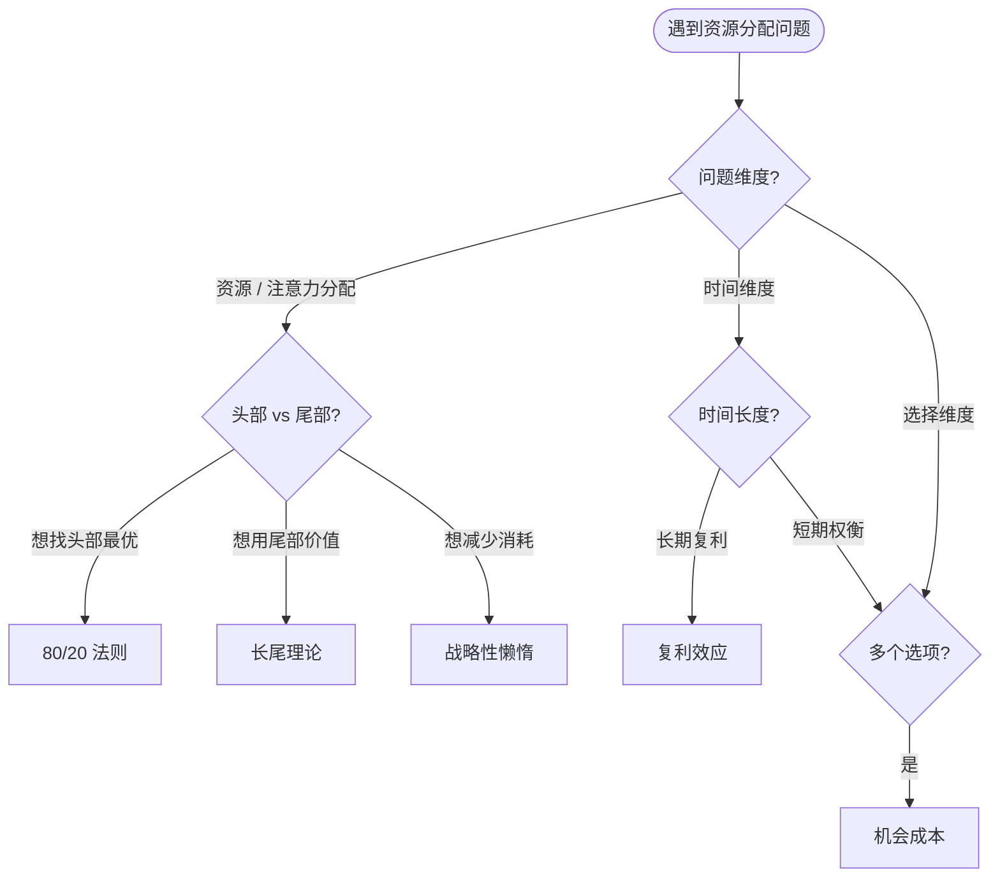

> **来源声明**：本文由 Claude 代写，基于 2026-05-04 与作者关于 inbox §二八法则 中 DeepSeek 建议（"形成决策杠杆模型知识簇"）的对话整理。Claude 负责合成结构与跨概念辨析，作者负责 review 与最终判断。

# 驱动问题

> 80/20 / 长尾 / 战略性懒惰 / 复利 / 机会成本——这 5 个概念在资源整合 / 抽象模型 / 刻意练习 cluster 中反复冒头。它们是**同一概念簇的不同切片**，还是**互相独立**？如果有重叠，**何时用哪个**？

---

# §1 概念辨析

## 1.1 五个概念的定义

| 概念 | 核心命题 | 主要作用 | 来源 book |
|------|---------|---------|---------|
| **80/20（帕累托）** | 80% 的结果由 20% 的原因导致 | 识别**关键少数**，集中资源 | [book-@二八法则](book-@二八法则.md) |
| **长尾** | 总体中存在大量小份额、低频、个性化的"尾部"需求，加总后甚至超过头部 | 利用**剩余 80%** 的潜在价值（互联网时代的可行性） | [book-@长尾理论](book-@长尾理论.md) |
| **战略性懒惰** | 通过**自动化、环境设计、决策最小化**减少日常摩擦，把精力留给真正重要的事 | 降低系统总能耗 | [ref-战略性懒惰](ref-战略性懒惰.md) |
| **复利效应** | 当前选择会**通过时间累积**放大；小差异在长周期下产生巨大差距 | 鼓励**长期投入**而非短期博弈 | （隐含在多篇 book 中，无独立 book） |
| **机会成本** | 选择 A 意味着放弃 B；A 的真实成本不是 A 的价格，而是 B 的价值 | 强迫**纵向比较**，避免沉浸单一选项 | （经济学基础概念，散布于多篇 book） |

## 1.2 它们的共同点：都是"杠杆"

5 个概念都指向**非线性的资源分配**——即"投入 ≠ 产出按比例缩放"：

- 80/20：少数投入决定多数产出（杠杆**支点**）
- 长尾：分散投入也能聚合出价值（杠杆**广度**）
- 战略性懒惰：减少无效投入释放高价值时间（杠杆**减法**）
- 复利：时间维度上的杠杆（杠杆**时间**）
- 机会成本：选择维度上的杠杆（杠杆**纵向**）

所以它们**确实是一族**——回答 DeepSeek 提出的问题：**是的，这是同一族**。

但它们的**侧重维度不同**——

## 1.3 区别与边界

| 维度 | 80/20 | 长尾 | 战略性懒惰 | 复利 | 机会成本 |
|------|-------|------|-----------|------|---------|
| **关注方向** | 头部聚焦 | 尾部价值 | 减法节能 | 时间累积 | 选择放弃 |
| **优化对象** | 投入比例 | 覆盖广度 | 总能耗 | 时间长度 | 决策本身 |
| **典型问题** | 哪 20% 最重要？ | 80% 还有什么价值？ | 哪些事可以自动化？ | 这事 10 年后会怎样？ | 选这个我放弃了什么？ |
| **风险** | 忽略尾部 | 资源分散 | 节能成懒惰 | 短期看不到效果 | 决策瘫痪 |

---

# §2 与 [moc-@理性思考模型总结](moc-@理性思考模型总结.md) §1 约束条件 的边界

`moc-@理性思考模型总结` §1 约束条件涵盖的是 **MECE / 假设树 / 4S 模型** 等"问题拆解工具"——这些回答的是**"如何分析"**。

本 moc 处理的是**"如何分配"**——即拆解之后，如何在多个候选中分配资源 / 时间 / 注意力。

**不重叠**。两个 moc 是问题解决的两个连续阶段：

```
理性思考模型总结（拆解） → 决策杠杆（分配） → 行动
```

如果一个具体场景同时用到两组工具，先调用前者再调用后者。

---

# §3 路径：何时用哪个？

## 3.1 决策树



## 3.2 5 个概念的协同应用

实际场景往往**组合使用**：

- **找事业方向**：80/20 找头部 → 复利评估长期 → 机会成本权衡放弃
- **每日生产力**：战略性懒惰减摩擦 → 80/20 选关键事 → 时间分配上靠刻意练习沉淀
- **投资 / 学习**：复利 + 长尾 + 机会成本——3 者必须同时考虑

---

# §4 关联笔记

## 已存在
- [book-@二八法则](book-@二八法则.md) — 80/20 主源头
- [book-@长尾理论](book-@长尾理论.md) — 长尾主源头
- [book-@减法](book-@减法.md) — 战略性懒惰精神近邻
- [ref-战略性懒惰](ref-战略性懒惰.md) — 战略性懒惰主源头
- [card-@二八法则](card-@二八法则.md) — 80/20 单概念结晶

## 等待信号

- **复利效应** 暂无独立 book / card——撞到第 1 本系统讨论复利的书时，考虑起 `card-@复利效应`
- **机会成本** 暂无独立 book / card——撞到第 1 本经济学/决策科学书时，考虑起 `card-@机会成本`

---

# §5 验证标准

本 moc 的真实价值要看：

- 下次做资源分配类决策时，是否真去打开本 moc 走一遍 §3.1 决策树
- 1-2 个月后，5 个概念是否在 tracking-@工作 / tracking-@PKM 中实际被引用
- 如果完全没用到 → 说明 moc 设计偏理论，需要调整或归档

第一次实战触发后回填到 §6 复现案例。
