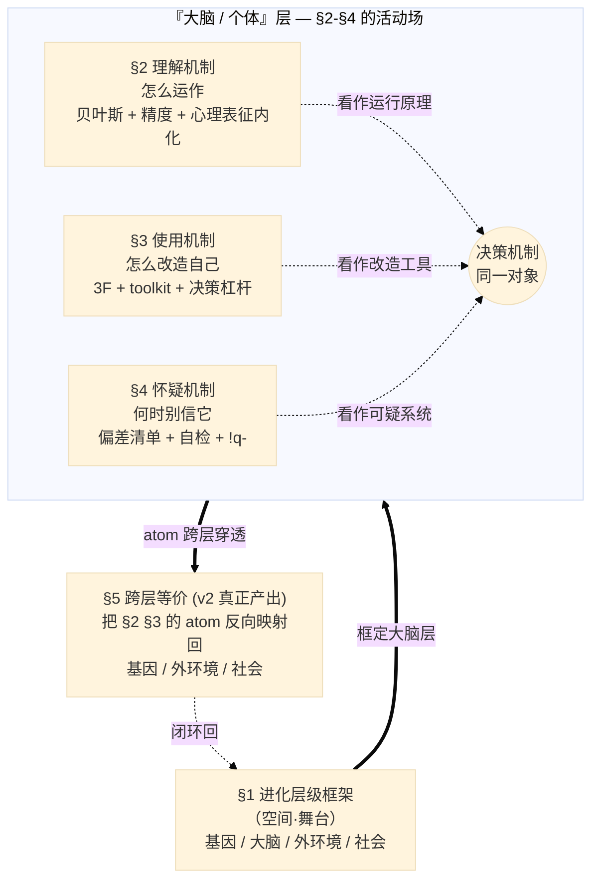
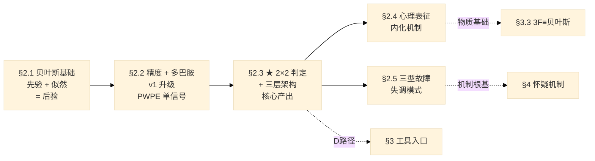
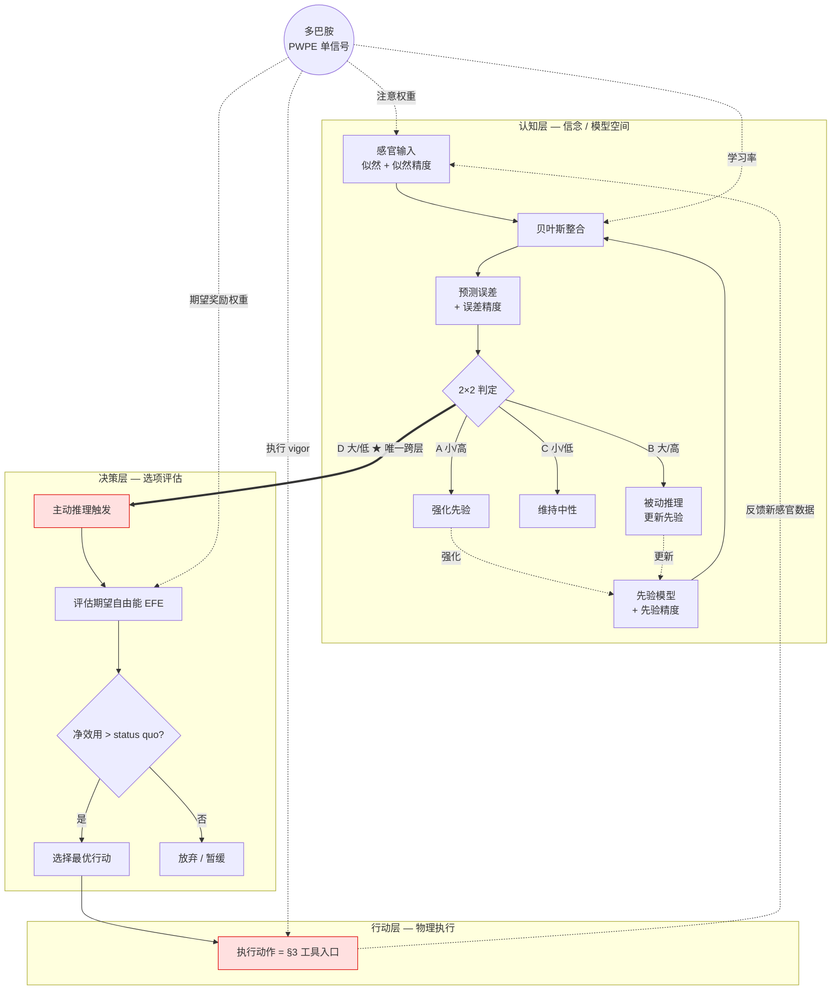
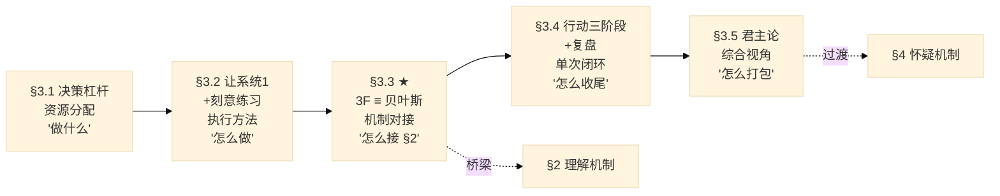
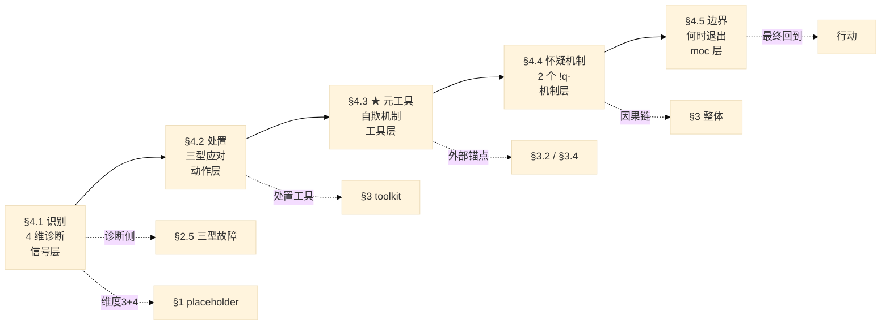

## 来源声明

> 本节按时间线记录 v2 每轮代写的触发点、改动范围、关键升级点。所有改动属 Claude 代写，作者保留 review 与最终修改权。

### 2026-05-11

本文骨架由 Claude 代写（半成品），基于与作者关于 Canvas vs [moc-@认知链路](moc-@认知链路.md) v1 比对的讨论整理。仅含 SCQA + 中心论点 + 4 条 MECE 支撑论点的锚点句。具体证据 / 展开 / mermaid / atom 网络由作者补全。

### 2026-05-24

根据作者反馈（"子论点标题不清晰 / 子论点之间关系不明 / 中心论点应等子论点写完再回填"），Claude 做了五处修改：

1. §2-§4 标题统一为"理解机制 / 使用机制 / 怀疑机制"三动作维度
2. 在「工作流」与「引子」之间新增 [#子论点关系图]() 一节（含 mermaid + 书写顺序建议）
3. 「工作流」从演绎法（先填中心论点）改为归纳法（§3 → §2 → §4 → §1 → §5 → 中心论点 A 最后回填）
4. 「结构 self-check」维度同步更新，并新增"跨层闭环"一条
5. 本声明扩展为时间线

### 2026-05-25

作者动笔前讨论 §3 三层结构（指导思想 / 具体执行 / 心态补充），Claude 通读 5 个核心 toolkit/card/moc 后给出整合后 5 子节结构 plan（详见 `.claude/plans/1-toolkit-moc-cuddly-yao.md`），plan 由作者审批。

**本次代写内容**：§3 五子节正文（§3.1 决策杠杆 / §3.2 让系统1+刻意练习 / §3.3 3F≡贝叶斯桥梁 / §3.4 行动三阶段+复盘 / §3.5 君主论综合案例）。

内容基于既有笔记摘录 + 结构合成，作者原洞察"决策不一定产生行动，但刻意练习一定是行动的过程"嵌入 §3.2。

### 2026-05-25（续）

作者 review 后反馈"章节内部也应递归用金字塔结构"。Claude 据此重构 §3：

1. 新增「§3 总览」节（论点锚点 + 贯穿主线 + 5 子节角色定位表 + LR 子节关系 mermaid + 跨节接口列表）
2. 跨节关系（"与 §x 的接口"）从子节中抽走，全部上提到总览
3. 每子节增加「本节论点」一句话锚点
4. 工作流加「分形金字塔」通则，适用于后续 §1/§2/§4/§5 写作

### 2026-05-30

作者动笔前与 Claude 进行 4 轮 Q&A 推演 §2 机制结构，由**作者主导提出 4 个尖锐问题**（决策→行动的 delta / 认知-决策-行动三层 / 2×2 缺失的 AC 象限 / 多巴胺三作用是否同一信号），Claude 协助整理为机制图。

**本次代写内容**：§2 五子节正文 + §2 总览（§2.1 贝叶斯基础 / §2.2 精度 + 多巴胺单信号 / §2.3 ★ 2×2 + 三层架构 / §2.4 心理表征内化 / §2.5 三型故障），结构遵循分形金字塔通则。

**v1 升级点**：

1. 多巴胺定位从"调节精度"升级为"单一 PWPE 信号 + 四层 manifestation"
2. sys1/sys2 二元切换升级为 2×2 判定 + 三层架构
3. 心理表征内化展开为神经元/先验模型/行为三层叠加
4. 三型故障与多巴胺信号失调显式对应

plan 详见 `.claude/plans/1-toolkit-moc-cuddly-yao.md`。

### 2026-05-30（续）

作者 review 后给出 3 处调整：

1. §2.3 EFE 公式从 mermaid 抽出，单独成段并标记为"讨论新产出 + 强化点"，后续需补独立 card 或整合进 §2.2
2. §2.4 三层叠加从"物质 / 信息 / 行为"重命名为"神经元 / 先验模型 / 行为"（更具体、不抽象）
3. §2.5 二阶修正项保留并补作者备注——"当前架构以绝对理性为前提，但人不可能绝对理性，二阶修正项是为这个不完美预留的缓冲，目前作用尚未显现"
4. 奥卡姆剃刀显式覆盖暂缓，留到后续决定

### 2026-05-31

作者动笔前与 Claude 进行 1 轮 Q&A 推演 §4 结构，**作者主导提出 4 个尖锐问题**（认知偏差是否对应除精度外其他维度 / 克伦威尔法则是哪种故障的反面 / 两个 !q- 怎么连到怀疑机制 / §4 行文结构应该怎样），Claude 提议 **6 个遗漏点**（自欺机制 / 怀疑成本 / 时间维度 / 元认知失效 / 外部 sanity check / 集体性偏差），作者全部接受纳入。

**本次代写内容**：§4 五子节正文 + §4 总览（§4.1 4 维诊断 / §4.2 三型处置 / §4.3 ★ 元工具+自欺机制+外部锚点 / §4.4 两个 !q-+怀疑成本+时间维度 / §4.5 边界+何时停止怀疑），按"**怀疑半径递增**"组织（信号 → 动作 → 工具 → 机制 → moc 本身）。

**v1 升级点**：

1. 自欺机制 + 元认知失效 显式化（v1 隐含）
2. 4 维诊断框架（v1 无 §4 层）
3. 两个 !q- 归属确定为怀疑触发场景
4. "何时停止怀疑然后行动"显式说明

plan 详见 `.claude/plans/1-toolkit-moc-cuddly-yao.md`。

**附带决策点**：作者 5/31 提出"v2 是否应重新分类为 hypo（论证型）而非 moc（索引型）"——决策 deferred 到 §5 + 中心论点 A 写完后，详见 plan 末尾「Post-v2 决策点」。

### 2026-05-31（续）

作者 review §4 后给出 4 处调整：

1. §4.1 认知偏差↔维度映射表保留但加"强制对应风险"显式 callout，**待 §1 完成后做 §1+§4 联合 review**
2. §4.3 自欺机制 5 形式从表格扩展为带例子的详细分项（防"只写结论后遗忘"）
3. §4.5 "停止怀疑判据"区分小行动 vs 大行动 + 软化为"指示性非决定性" + 加元怀疑 callout（"硬性定义判据本身就是 PKM 先分类陷阱"——作者 5/31 洞察）
4. §4.5 "信息边际增益 < 行动延迟成本"显式标注"借自经济学边际概念 + 未独立 card 化 + 强化点"

**附带工作流调整**：作者反馈"§4 跨章引用太多，读起来跳"——下一步先写 §1 框架，然后做 §1+§4 联合 review，再写 §5。

### 2026-05-31（元规则）

作者提出**格式升级元规则**：来源声明 entries 越来越多，blockquote 全文展开难以快速定位。改造方案：

1. 来源声明从 blockquote 升级为 `##` 二级标题（独立可折叠）
2. 每个日期 entry 升级为 `###` 三级标题（Obsidian 中可独立折叠定位）
3. 长 entry 拆出 bold 字段（**本次代写内容** / **v1 升级点** / **附带决策点** / **附带工作流调整**）使结构更可扫描
4. 顶部增加 1 行 callout 说明节意图 + 全局披露（原 footer 上提）

本次只改格式，entry prose 内容保持原样（仅 ① ② → 1. 2. 编号化 + 标点微调）。

同步更新 memory `feedback_authorship_disclosure` 反映新格式规则。

---

# 工作流（写之前先读这一节）

本文按金字塔原理结构组织，但**采用归纳法补写**（先立子论点，再归纳出中心论点），而非演绎法。补写顺序：

1. **先读 [#子论点关系图]()**——理解 §1-§5 的分工与动作维度（理解 / 使用 / 怀疑），不读图直接动笔会迷路
2. **§3 → §2 → §4 → §1 顺序逐节填**——按 Canvas 现有素材饱和度排序，最小阻力起手（理由见关系图节末"书写顺序建议"）；每节 ≥2 条具体证据
3. **§1 写完后做 §1+§4 联合 review**（2026-05-31 作者反馈引入）——§4 中维度 3+4 placeholder 和整体跨章引用密度依赖 §1 内容才能定型；§1 单独立住之后回看 §4 是否还成立、是否需要软化映射
4. **§5 跨层等价**——v2 真正的产出；必须在 §1-§4 都立住之后再写，否则是空中楼阁
5. **最后回填中心论点 A + §7 最重要的一句**——子论点都成立了，归纳法自然得出，不需要凭空想
6. **写完后决定**：替换 v1 / 保留 v1 作为历史 / 把 v1 移入 archive

写作时遵循的几条约束（来自前几天的协作原则）：

- **半成品填空，不是看一遍就过**——填的过程就是吸收，Claude 不会替你填
- **每个论点 ≥2 条具体证据**（事实 / 引用 / 文件 link / Canvas 上的 atom）
- **MECE check**：§1-§4 应保持互斥且穷尽（4 个维度 = 空间舞台 / 理解机制 / 使用机制 / 怀疑机制），写完检查是否有重叠
- **金字塔 check**：中心论点是最高层结论但最后写；§1-§4 都为它服务，不能跑题
- **分形金字塔（章节内部递归用金字塔）**：每章开头给「§x 总览」（论点锚点 + 子节角色定位表 + 子节关系 mermaid 图 + 跨节接口列表）；每子节开头给「本节论点」一句话锚点；子节内只放该节独立论述，跨节关系全部上提到总览。理由：① 子节可被独立 cite ② 跨节关系单点维护，不会散落各处 ③ 方便 review 时一眼看到章内结构

完成度自检：写完每节后回到 [#子论点关系图]()，问 "这一节是否在支撑该有的动作维度？" 如果不是 → 要么改这一节，要么改维度定义。

---

# 子论点关系图（先看图，再读下面）

> 2026-05-24 补：此节由 Claude 代写，澄清 §1-§5 的分工，让作者读完一图即知"先写哪节、节与节的关系是什么"。

§1 是**空间框架**（4 层进化舞台）；§2 §3 §4 不是平行的三个主题，而是对**同一个对象（决策机制）的三种动作** —— 理解 / 使用 / 怀疑；§5 是把大脑层的 atom 反向映射回基因 / 外环境 / 社会，让框架真正闭环。



**关系一句话**：§1 给舞台 → §2 装机制 → §3 用机制 → §4 审视机制 → §5 让机制跨层穿透。

**书写顺序建议**（基于"最小阻力 + Canvas 现有素材饱和度"）：

§3 → §2 → §4 → §1 → §5 → 中心论点 A

- 先 **§3**：Canvas 上素材最饱和（3F / 三 toolkit / 决策杠杆组都已成形），下笔阻力最低
- 再 **§2**：写 §3 时会自然遇到"要解释 fix 的'后验更新先验'，必须先讲精度"——§2 的写作动力被 §3 拉出来
- 再 **§4**：偏差清单 + 自检 + !q- 已存在，主要是"组织"
- 再 **§1**：本质是摘录 [card-@进化层级模型](card-@进化层级模型.md)，留到熟练后再压缩进 moc
- 再 **§5**：跨层等价是真正的合成，必须在 §1-§4 都成立后才能写
- 最后 **中心论点 A**：归纳法 —— 子论点都立住了，A 一句话自然浮现

---

# 引子（SCQA）

**S（情景）**：

moc v1（2026-04 写就）串联 6 个概念回答"人是怎么决策的"——自由能 / 奥卡姆剃刀 / 贝叶斯 / 多巴胺 / 双系统 / 刻意练习。

**C（冲突）**：

TODO 用户补——Canvas 实战暴露了 v1 的哪个具体局限？（参考 2026-05-11 比对：层级缺失 / 方法论侧缺失 / agent 层缺失——三选一或综合）

**Q（问题）**：

TODO 用户补——v2 应该回答一个比"人是怎么决策的"更大的问题，是什么？


**A（中心论点）**：

TODO 用户补——一句话给出 v2 的核心论点。

> 备选锚点（参考用，可改）："人作为一个进化出来的 agent，如何在 4 个层级上同时决策、行动、改造自己。"

---

# 支撑论点 §1：什么是进化层级框架？

**论点锚点**：

> v1 所有概念都局限在"大脑/个体"这一层——v2 需要把它嵌进 4 层级框架（基因 / 大脑 / 外环境 / 社会），让决策机制上下贯通。

在进化层级框架下，各个层级之间的关系可以形成闭环：

基因给出生存目标

个体是基因的生存载体，而大脑是基因为了应对外部环境而产生的预测机器

大脑中的神经元会以 livewired 形式与外部环境之间相互影响

在外部环境中，如果每个人都可以理性的决策，就会形成社会层面的博弈

**TODO 用户补**：

- [ ] 基因层的角色（hardwired / 给出生存目标 / 自然选择的复制因子）
- [ ] 大脑层的角色（livewired / 预测机器 / 个体载体）
- [ ] 外环境层的角色（神经元的输入源 / 反馈环 / 改变基因表达）
- [ ] 社会层的角色（ESS / 群体博弈 / 文化传播）
- [ ] 4 层之间的因果链（基因 → 大脑 → 行动 → 社会反馈 → 基因表达 ⇌ 神经元重连）

---

# 支撑论点 §2：理解机制 — 大脑层的决策怎么运作

## §2 总览（先看这一节，再读子节）

**论点锚点**：

> v1 的 6 概念链作为大脑层的核心结构保留，但需要补充"精度"维度，并显式连接到心理表征的"内化"环节。

**贯穿主线**（2026-05-30 4 轮 Q&A 推演的核心共识）：

> **大脑做决策的本质 = 在"误差大小 × 精度高低"的 2×2 判定空间里选择处理路径——只有其中一种路径会跨出认知层、触发行动。**

§2.1-§2.5 沿着"基础 → 升级 → 核心判定 → 内化 → 故障"五步把这条主线展开。

**5 子节角色定位**：

| 子节 | 角色 | 回答的问题 |
|---|---|---|
| §2.1 贝叶斯整合基础 | 基础结构 | 大脑如何整合先验和似然？ |
| §2.2 精度 + 多巴胺 | v1 升级 | 经典贝叶斯不够，怎么升级？ |
| §2.3 ★ 2×2 + 三层 | **核心产出** | 4 种处理路径如何切分？谁触发行动？ |
| §2.4 心理表征内化 | 沉淀机制 | sys2 如何变成 sys1？ |
| §2.5 三型故障 | 失调模式 | 机制坏了会怎样？ |

**子节关系图**：



**子节之间的接口**（独立成段，子节内部不再重复这些跨节关系）：

- **§2.1 → §2.2**：经典贝叶斯只有先验和似然两个量，但大脑实际需要第三类参数——精度，才能解释为什么有的误差被学习、有的被忽略
- **§2.2 → §2.3**：精度 × 误差的乘积决定处理路径——这条乘法关系自然展开为 2×2 矩阵
- **§2.3 → §2.4**：B 和 D 路径的反复迭代 → sys2 的推理被压缩为 sys1 的直觉，这就是"内化"
- **§2.3 → §2.5**：当多巴胺 PWPE 信号失调，2×2 判定会失败——三型故障是这种失败的三种典型模式
- **§2.3 → §3**（跨章桥梁）：D 路径（误差大 / 精度低）是 §3 toolkit 的入口；"刻意练习 = 主动驻留在 D 区"首次出现在此
- **§2.5 → §4**（跨章桥梁）：三型故障为 §4 怀疑机制提供机制级根基——§4 不再是清单，而是"精度信号失调的识别 + 处置"
- **§2.4 → §3.3**（跨章桥梁）：心理表征内化的物质基础（突触可塑性）解释了 §3.3 "3F ≡ 贝叶斯"为什么需要数月至数年

---

## §2.1 贝叶斯整合基础

**本节论点**：大脑不是在计算公式，是在用先验整合似然的概率推断——后验 = 先验 × 似然比。

经典贝叶斯告诉你：

$$
P(H|E) = P(H) \cdot \frac{P(E|H)}{P(E)}
$$

但 [card-@贝叶斯更新](card-@贝叶斯更新.md) 强调，公式只是态度的形式化：

> **贝叶斯不是一个算式，是一种态度——理性的谦逊。它告诉你：信念可以用概率表示，可以基于证据被持续修正，但永远不会变成 1 或 0。**

### 似然比思维（实操核心）

面对新信息时，不要问"我该不该相信它"——

> **问**：如果我的假设是真的，看到这个证据的可能性，比假设是假的时看到它的可能性大多少倍？

这是个**比值**：当似然比接近 1，证据没有信息量；远离 1，证据有信息量。**新胜算 = 旧胜算 × 似然比**——这是贝叶斯更新最实操的形式。

### 克伦威尔法则（保持开放）

> **永远不要把先验概率设为 0 或 1。**

如果你认为某事"绝无可能"，那么无论后续多少证据，贝叶斯算出的后验永远是 0——这就是"死脑筋"。保持逻辑开放性（概率永远在 0 到 1 之间）是贝叶斯主义者的认识论底线。

---

## §2.2 精度维度 + 多巴胺（v1 升级点）

**本节论点**：经典贝叶斯只有先验和似然不够——精度是"对信号的确信度"；多巴胺 = 单一 PWPE 信号（precision-weighted prediction error），跨层 manifest 为注意 / 学习率 / 动机 / vigor。

### 升级版公式

预测加工框架在贝叶斯基础上加入"精度"参数：

$$
\text{后验} = \text{先验} \times \text{先验精度} \times \text{似然} \times \text{似然精度}
$$

精度 = 你对该信息的确信程度：

- 先验精度高 → 更相信原模型（sys1 主导）
- 似然精度高 → 更相信当下输入（sys2 介入）
- 都不高 → 进入探索 / 不确定状态

### 多巴胺定位升级（v1 → v2）

| 版本 | 多巴胺定位 |
|---|---|
| v1 | "调节哪些预测误差值得学习" |
| **v2** | **单一 PWPE 信号 + 四层 manifestation** |

v1 没错，但描述得太局部。Friston 自由能原理框架揭示：多巴胺其实是**一个统一的精度信号**，在大脑不同层级产生不同的下游效果：

| 作用层 | 多巴胺的 manifestation | 实际效果 |
|---|---|---|
| 感知层 | **注意权重** | 哪些输入信号值得被加权 |
| 认知层 | **学习率** | 信念更新的幅度 |
| 决策层 | **动机 / 期望奖励权重** | 哪些选项值得选 |
| 行动层 | **执行 vigor** | 动作有多用力 |

→ 一个信号，多层表现。这是 v2 比 v1 升级的关键。

### 反推：信号水平决定行为模式

- 多巴胺 ↑（信号强）→ 学习率高、动机强、行动 vigorous → 容易"冲动"（赌博 / 成瘾）
- 多巴胺 ↓（信号弱）→ 学习率低、动机弱、行动迟缓 → 容易"冷漠"（抑郁 / apathy）
- 多巴胺 stuck（信号无法重新校准）→ 学习无法更新 → 偏执 / 思维定式

→ 这条反推为 §2.5 三型故障埋下伏笔。

---

## §2.3 ★ 2×2 判定 + 三层架构（§2 真正的核心产出）

**本节论点**：误差 × 精度的 2×2 判定决定 4 条处理路径；只有 D 路径（误差大 / 精度低）跨出认知层、触发行动——这是 §3 主线"决策不一定行动"的机制级根基。

### 2×2 判定表

|  | **误差小** | **误差大** |
|---|---|---|
| **精度高** | **A 强化先验**（sys1 默认）<br/>"模型准 + 证据可信" | **B 更新先验**（sys2 被动推理）<br/>"模型错 + 证据可信" → 认知改变，**不行动** |
| **精度低** | **C 维持中性**（sys1 忽略噪声）<br/>"模型可能准 + 证据不可信" | **D ★ 主动行动**（sys2 主动推理）<br/>"模型可能错 + 证据不可信"<br/>**必须行动获取新数据** |

### 三层架构（认知 / 决策 / 行动）

sys1 / sys2 不是层级，是**横切维度**（加工方式：快 vs 慢）。两者都可以跨认知 / 决策 / 行动三层：

|  | 认知层（信念 / 模型） | 决策层（选项评估） | 行动层（物理执行） |
|---|---|---|---|
| **sys1**（快路） | 自动感知 / 模式匹配 | 默认走 | 习惯动作（开车走老路） |
| **sys2**（慢路） | 反思推理 / 主动假设 | 评估选项 / 价值权衡 | 主动行动 |

### D 路径的独特性

ABCD 四种处理路径中：

- **ABC 全在认知层完成**——信念被强化 / 更新 / 维持，不需要外部动作
- **只有 D 跨出认知层**——进入决策层（评估行动选项）→ 行动层（物理执行）

→ **行动的真正触发条件不是"误差大"，而是"误差大 + 精度低"**——大脑搞不清楚到底是模型错了还是噪声大，只能主动收集更多数据验证。

### 主干 mermaid（§2 总图）



### 关于「期望自由能 EFE」（讨论新产出 · 强化点）

EFE 是主动推理理论的核心评估量，粗略可理解为"做这个行动的期望成本"——**越小越值得做**。它由三部分组成：

- 期望奖励的不足程度（结果会不会偏离我想要的）
- 信息增益的不足程度（这个行动能不能减少不确定性）
- 行动本身的代价（精力 / 时间 / 机会成本）

⚠️ **强化点**：EFE 是 2026-05-30 与 Claude 讨论后引入的**新产出**，目前在 v2 中作为决策层评估标准的占位。后续需要：① 补独立 card（如 `card-@期望自由能`），② 或者在 §2.2 升级版公式中显式整合（"后验 × 精度 × EFE"作为完整决策方程），③ 或者升级 [card-@贝叶斯更新](card-@贝叶斯更新.md) §4 把 EFE 作为预测加工框架的第三块拼图。

---

### 关键洞察：刻意练习的本质 = 主动驻留在 D 区

"舒适区边缘"（能勉强完成 60-80%）正好是 D 区的实操定义：

- 误差大（新领域，预测不准）
- 精度低（不熟悉，无法判断哪里准 / 哪里错）

→ 大脑被迫调用主动推理 → 行动验证 → 反馈感官数据 → 更新模型。

100% 完成 = 已观察区域 = 被动推理就够了 = 模型不会成长。这条机制级解释让 §3 的"刻意练习一定是行动"从经验直觉变成机制必然。

---

## §2.4 心理表征内化（sys2 → sys1 的固化机制）

**本节论点**：反复 2×2 迭代 → 系统 2 的高耗能推理被压缩为系统 1 的自动反应；机制是神经元 / 先验模型 / 行为三层叠加。

[card-@系统1系统2](card-@系统1系统2.md) §3.B 给出了核心命题：

> 刻意练习的本质是**用系统 2 的高耗能努力，构建出高速、自动、精确的系统 1 模式**——即心理表征。

这个"固化"过程不是一种机制，而是**三层叠加**：

| 层 | 机制 | 例子 |
|---|---|---|
| **神经元层** | 突触可塑性（LTP / LTD）；神经元 livewired 形态——用进废退 | 神经元连接的强化 / 弱化 |
| **先验模型层** | 先验从 sparse（稀疏）→ dense（细密）；预测误差精度上升 | 心理表征的细化 |
| **行为层** | 慢思考 → 直觉；高耗能 sys2 → 低耗能 sys1 | 专家的"棋感" / 消防员的"危险感" |

### 三层叠加的因果链

- **神经元层是基础**：神经元被高精度误差反复激活 → 突触强化（LTP）；不被激活 → 突触弱化（LTD）。这是 livewired 的硬件机制
- **先验模型层是中介**：硬件变化转化为模型更新——先验从"少量参数 + 高不确定性"逐步变为"多参数 + 高确定性"
- **行为层是输出**：模型细化后，sys1 可以直接给出准确预测，不需要 sys2 介入。心理表征 = 长时记忆中预存的"模式 + 关系"

→ 三层叠加解释了为什么内化需要**数月至数年**——突触可塑性有生物学速率上限。

### 边界

本节只讲**机制**（how it works）。**怎么用**这个机制（设计训练 / 找反馈 / 找导师）是 §3 [toolkit-@让系统1为我所用](toolkit-@让系统1为我所用.md) + [card-@刻意练习](card-@刻意练习.md) 的领域，不在本节展开。

---

## §2.5 三型故障（精度信号失调的三种模式）

**本节论点**：当多巴胺 PWPE 信号失调，2×2 判定就会失败——三型故障是精度信号失调的三种典型模式。

[card-@精度操控三型](card-@精度操控三型.md) 提出三种典型的精度操控偏差：

| 三型故障 | 精度参数错配 | 多巴胺 PWPE 信号状态 | 生活实例 |
|---|---|---|---|
| **精度锁死** | 先验精度被拉满，反证全被视为噪声 | 信号被压制 → 不学习 | 应试教育 / 立场先行的自媒体 |
| **精度通胀** | 似然精度被高频低质反馈占用 | 信号过度活跃 → 噪声被当真信号 | KPI / 短视频 / 社交媒体点赞 |
| **精度坍塌** | 学习率主动关闭，误差无法被定位归因 | 信号 stuck → sys2 不再被调用 | 犬儒主义 / 躺平 / 没干劲 |

### 三型与 §2.2 多巴胺的闭环

§2.2 说"多巴胺 = 单一 PWPE 信号"，§2.5 说"三型故障 = PWPE 信号失调"——两条对应起来：

- 锁死 = PWPE 被压制（学习率太低）
- 通胀 = PWPE 过强（学习率太高 + 噪声放大）
- 坍塌 = PWPE 信号 stuck（学习率被关闭）

→ 三型 = **同一精度信号的三种失调模式**，不是三个独立故障。

### 二阶修正项：情绪 / 生理状态

精度不是纯理性分配的——疲劳 / 睡眠 / 压力 / 威胁感 / 安全感会整体性地**抬高或压低精度阈值**。它们：

- 不直接生成预测误差
- 不直接操控精度
- 而是**改变精度分配的默认增益**

这条修正项让 §2.5 不止是认知层故障，而是与身体状态耦合的复杂系统失调。

**保留理由**（作者 2026-05-30 备注）：

> 当前 §2 整体架构以"**绝对理性**"为前提推论（所有 2×2 路径都假定大脑在按贝叶斯逻辑工作），但**人不可能是绝对理性的**——二阶修正项是为这套架构留给"人类不完美"的缓冲。当前作用尚未显现，但后续 §4 怀疑机制 / §5 跨层等价 / 中心论点 A 写作时可能会成为关键支点。

🏷 **桥梁去 §4**：本节只讲机制成因（why）。§4 怀疑机制会展开"如何识别自己卡在哪一型 + 如何处置"（what to do）。§2.5 + §4 一起构成"精度失调"的完整诊疗。

---

# 支撑论点 §3：使用机制 — 用机制改造自己

## §3 总览（先看这一节，再读子节）

**论点锚点**：

> v1 把刻意练习作为终点轻提一句——v2 需要展开为完整方法论子树：3F 流程 + 3 个 toolkit + 决策杠杆族。

**贯穿主线**（作者 2026-05-25 提炼）：

> **决策不一定产生行动，但刻意练习一定是行动的过程。**

§3.1-§3.5 沿着"决策 → 执行 → 机制对接 → 单次闭环 → 综合应用"五步把这条主线展开。

**5 子节角色定位**：

| 子节 | 角色 | 回答的问题 |
|---|---|---|
| §3.1 决策杠杆 | 资源分配原则 | 做什么？（往哪用劲） |
| §3.2 让系统1 + 刻意练习 | 执行方法 | 怎么做？（具体动作） |
| §3.3 ★ 3F ≡ 贝叶斯 | 桥梁回 §2 | 怎么对接机制？ |
| §3.4 行动三阶段 + 复盘 | 单次闭环 | 怎么收尾？（单次复盘） |
| §3.5 君主论综合案例 | 整合视角 | 怎么打包？（综合应用） |

**子节关系图**：



**子节之间的接口**（独立成段，子节内部不再重复这些跨节关系）：

- **§3.1 → §3.2**：先决定"做什么"，再决定"怎么做"。例：战略性懒惰（§3.1）= 决定"哪些事不亲自做" → 设计环境（§3.2 策略 5）= 决定"那些事如何自动化"
- **§3.2 → §3.3**：5 策略中**只有刻意练习的 3F 与 §2 贝叶斯机制一对一对应**——§3.3 单独成节就是为了承接这个对应，是 §3 通往 §2 的唯一显式桥梁
- **§3.3 → §3.4**：3F 是宏观沉淀流程（数月至数年），行动三阶段的复盘是微观执行模板（单次行动）——同一机制的不同时间尺度
- **§3.4 → §3.5**：散装的 4 个 toolkit 组合并不直观——君主论提供一套整合语言，证明这些工具可以打包
- **§3.5 → §4**：君主论的"参政院三院仲裁"已经触及"何时不该信机制"的范畴，是 §3 → §4 的天然过渡

---

## §3.1 决定做什么 — 资源分配原则

**本节论点**：决策的前置环节是资源分配——5 个杠杆型概念回答"往哪里用劲"。

[moc-@决策杠杆](moc-@决策杠杆.md) 把 5 个杠杆型概念（80/20 / 长尾 / 战略性懒惰 / 复利 / 机会成本）归为**非线性的资源分配** —— 即"投入 ≠ 产出按比例缩放"：

| 杠杆 | 维度 | 典型问题 |
|---|---|---|
| 80/20 | 头部聚焦 | 哪 20% 最重要？ |
| 长尾 | 尾部价值 | 剩下 80% 还有什么用？ |
| 战略性懒惰 | 减法节能 | 哪些事可以自动化？ |
| 复利 | 时间维度 | 这事 10 年后会怎样？ |
| 机会成本 | 选择维度 | 选这个我放弃了什么？ |

> 完整辨析见 [moc-@决策杠杆](moc-@决策杠杆.md) §1.3；何时用哪个的决策树见同文 §3.1。

资源分配的判断错了，再精的执行也是徒劳。

---

## §3.2 具体怎么做 — 执行方法

**本节论点**：资源分配确定后，[toolkit-@让系统1为我所用](toolkit-@让系统1为我所用.md) 把"系统 2 改造系统 1"拆成 5 大策略；其中刻意练习是**唯一有反馈的物理执行项**——也是 §3 主线"刻意练习一定是行动"的落点。

5 大策略：

| 策略 | 类型 | 调用方式 |
|---|---|---|
| 1. System 2 Checklist | 主动介入 | 决策前扫描偏差（锚定 / 可得性 / 过度自信 / 损失厌恶） |
| 2. **刻意练习构建专家直觉** | **长期沉淀** | **3F 流程在某领域反复执行** |
| 3. 创造外部视角 | 主动介入 | 基率思维 + 外部顾问视角 |
| 4. 预加载情绪标记 | 被动改造 | 把判断点与强烈情感绑定 |
| 5. 设计环境 | 被动改造 | 让系统 1 的"顺手"指向正确选择 |

> 5 策略的协同关系（被动改造 vs 主动介入 vs 长期沉淀）见 [toolkit-@让系统1为我所用](toolkit-@让系统1为我所用.md) "5 策略的执行顺序" mermaid 流程图。

### 5 策略的三类性质（按"对系统 1 的作用类型"重新归类）

- **决策类工具**（策略 1 + 3）= 调整**思考** —— 系统 2 上线瞬间纠偏
- **设计类工具**（策略 4 + 5）= 预设**默认** —— 不靠 in-the-moment 调用系统 2，而是改造默认走向
- **行动类工具**（策略 2 = 刻意练习）= 唯一**有反馈的物理执行**

### 为什么刻意练习要单拎出来

| | 决策类 + 设计类（4 策略） | 行动类（刻意练习） |
|---|---|---|
| 需要物理执行？ | 否 | **是** |
| 需要反馈？ | 不强制 | **强制** |
| 是否真正重塑系统 1？ | 间接 | **直接** |
| 时间尺度 | 即时 / 长期被动 | **数月至数年** |

其他 4 策略让系统 1 **不犯错或走对路**；只有刻意练习让系统 1 **长出新能力**。

具体方法论见 [card-@刻意练习](card-@刻意练习.md)，本节抓两点：

1. **舒适区边缘**（能勉强完成 60-80% 的难度）—— 这是预测误差精度最高的区域：太简单（误差精度 = 0）/ 太难（误差精度淹没在噪声中）都不行
2. **三种练习的区分**（天真 / 有目的 / 刻意）—— 多数人停在"有目的的练习"，因为找客观标准 / 杰出人物本身就难（详见 [card-@刻意练习](card-@刻意练习.md) §2 对比表）

---

## §3.3 ★ 桥梁回 §2 — 3F ≡ 贝叶斯更新

**本节论点**：刻意练习的 3F 与 §2 贝叶斯机制一对一对应——这是 §3 → §2 的唯一显式桥梁。

3F 流程**逐项对应** §2 描述的贝叶斯更新机制：

| 3F 步骤 | 具体动作 | §2 贝叶斯对应 |
|---|---|---|
| **Focus** | 强制调用系统 2，打破系统 1 自动模式 | 收集高质量似然数据 |
| **Feedback** | 外部 / 自我监控产出的精准信息 | 产生预测误差 |
| **Fix** | 系统 2 设计修正动作，重复将其刻进系统 1 | 后验更新先验 |

> 出处：[card-@刻意练习](card-@刻意练习.md) §3 A 表。

3F **缺一不可** —— 缺哪个对应 §2 的哪种精度故障：

- 只有 Focus（专注但无反馈）→ 精度坍塌
- 只有 Feedback（频繁数据但不调整）→ 精度通胀
- 只有 Fix（不断换方法但不专注）→ 模式无法巩固

🏷 **候选 §5 跨层等价**：本表是 §5 TODO "3F ≡ 贝叶斯更新流程"的预产出。

---

## §3.4 单次行动的完整闭环 — 心态 + 复盘

**本节论点**：宏观尺度上有 3F，单次行动尺度上需要 [toolkit-@行动三阶段框架](toolkit-@行动三阶段框架.md) —— 行动后的复盘是 leverage 最高的一段。

三阶段：

| 阶段 | 心理建设 | 对应机制 |
|---|---|---|
| **行动前** | 贝叶斯先验（**尽人事**） | 现在能做什么改善情况 |
| **行动中** | 斯多葛（**听天命**） | 关注当下动作而非结果 |
| **行动后** | 贝叶斯后验（反喂数据） | 把结果作为新似然数据 |

弗洛伊德映射：先验 ≈ 本我（既有经验+本能）；现实数据 ≈ 自我（理性反馈）；斯多葛 ≈ 超我（高维价值准则）。

### 行动后：配套复盘模板（重点）

toolkit 的"配套复盘模板"分三部分：

**1. 决策快照（行动前 - 贝叶斯先验）**

- 初始假设：我认为做 A 能达成 B（预期胜率 X%）
- 关键依据：基于经验 C 和资源 D
- 控制边界：能控制 E，不能控制 F

**2. 结果记录（行动后 - 斯多葛式客观描述）**

- 用**第三人称视角**写实验报告，禁用"我感到 / 我真笨 / 太可惜了"等词汇
- 事件还原 + 最终结果 + 情绪标记（仅记录，不沉溺）

**3. 偏差校准（核心 - 复利点）**

- **信息差**：漏掉了哪个关键信息？
- **逻辑差**：是否存在幸存者偏差 / 过度自信？
- **环境变动**：现实规则是否变了？
- **下一次迭代**：先验概率应调整为多少？checklist 增加哪一条？

---

## §3.5 综合应用案例 — 君主论与自我提升

**本节论点**：散装的 4 个 toolkit + 决策杠杆容易凌乱，[toolkit-@君主论与自我提升](toolkit-@君主论与自我提升.md) 给出一套**整合语言**——证明这些工具可以打包为一个完整的"管理自己"体系。

### 6 类映射

| 君主论 | 自我提升类比 |
|---|---|
| 君主 | 我 |
| 领土 | 认知（本我 / 自我 / 超我） |
| 财政 | 精力（二八法则） |
| 军队 | 知识技能（PKM 国民军 + 费曼法） |
| 法律 | 习惯（冥想 / 运动） |
| 参政院 | 思维（平民 / 贵族 / 枢密三院仲裁） |

### 君主论给 §3 增加的视角

1. **资源约束是大前提** —— 回应决策杠杆的"为什么要分配"
2. **认知复利**（新领土反哺世袭领土）—— 是复利效应在"自我提升"场景下的具体形态
3. **PKM 国民军 vs 精神雇佣军** —— 给刻意练习加了一条边界：**核心能力绝不外包**（不能用 AI 替代 / 用药代替锻炼）

> 注意：本节只点君主论的**整合视角**，6 类映射的细节见 [toolkit-@君主论与自我提升](toolkit-@君主论与自我提升.md)。

---

# 支撑论点 §4：怀疑机制 — 何时不该信这套机制

## §4 总览（先看这一节，再读子节）

**论点锚点**：

> v1 默认所有概念成立——v2 需要单独承载"系统 1 故障地图 + 边界判定工具 + 未明边界的开放问题"，即 agent 层。

**贯穿主线**（2026-05-31 推演的核心共识）：

> **怀疑的真正对象不是世界，是你自己——而最难诊断的是"你以为你在诊断"。**

§4.1-§4.5 按**怀疑半径递增**组织——上一层用对了不代表下一层用对了：

```
信号 → 动作 → 工具 → 机制 → moc 本身
```

**5 子节角色定位**：

| 子节 | 怀疑对象 | 回答的问题 |
|---|---|---|
| §4.1 识别 | 信号层 | 我现在处于哪种故障？|
| §4.2 处置 | 动作层 | 这种故障的应对动作是什么？|
| §4.3 ★ 元工具 | 工具层 | 我的工具是不是用对了？|
| §4.4 怀疑机制本身 | 机制层 | 机制本身是不是还成立？|
| §4.5 边界 | moc 层 | 该用本 moc 吗？什么时候停止怀疑？|

**子节关系图**：



**子节之间的接口**（独立成段，子节内部不再重复这些跨节关系）：

**内部接口**：

- **§4.1 → §4.2**：识别哪种故障 → 对应处置动作
- **§4.2 → §4.3**：处置动作本身也可能用错——需要元工具层补丁
- **§4.3 → §4.4**：工具用对了不代表机制还成立——升到机制层怀疑
- **§4.4 → §4.5**：机制层怀疑需要边界——不能无限退步

**跨章接口**：

- **§4.1 → §2.5**：4 维诊断的维度 1+2 是 §2.5 三型故障的诊断侧（§2.5 是 why，§4.1 是 how to detect）
- **§4.1 → §1**：维度 3 进化遗留 + 维度 4 集体性偏差 依赖 §1 → placeholder
- **§4.2 → §3**：处置动作（跨界对话 / 反馈重设）与 §3 toolkit 重叠 → §4.2 简引用，§3 是主出处
- **§4.3 → §3.2 + §3.4**：外部锚点 3 件套（写下决策 / 跟外部对话 / 公开承诺）复用 §3 已有 toolkit
- **§4.4 → §3 整体**：§3 "使用机制"的成功**催生**了 §4 "怀疑机制"的必要性——因果链
- **§4.5 → 行动**：§4 不是无限退步，最终回到行动闭环

---

## §4.1 识别 — 4 维诊断框架（信号层）

**本节论点**：识别自己处于哪种故障 = 4 维诊断（信号 + 增益 + 进化遗留 + 集体放大）。

### 4 维诊断表

| 维度 | 失调类型 | 自检问题 | 出处 |
|---|---|---|---|
| 维度 1 | **精度三型**（信号失调） | 我的先验精度 / 似然精度 / 学习率是否错配？ | §2.5 |
| 维度 2 | **二阶修正项**（增益失调） | 我现在的疲劳 / 压力 / 安全感是否扭曲了精度基线？ | §2.5 二阶修正项 |
| 维度 3 | **进化遗留** | 这条偏差是不是基因层为祖先环境写死的"快速响应"，在现代环境失效？ | §1（placeholder）|
| 维度 4 | **集体性偏差** | 这条偏差是不是被我所在的群体放大了？ | §1 社会层（placeholder）|

### 认知偏差 ↔ 维度对应

引用 [card-@认知偏差清单](card-@认知偏差清单.md) 的 5 大类，映射到 4 维：

| 偏差 | 主要维度 | 次要维度 |
|---|---|---|
| 锚定效应 | 维度 1 精度锁死（先验精度被拉满） | — |
| 可得性启发 | 维度 1 精度通胀（最近经历被赋高精度） | 维度 2（疲劳时更依赖）|
| 过度自信 | 维度 1 精度锁死 + 维度 2 安全感增益 | 维度 3（祖先环境"自信 = 行动力"）|
| 损失厌恶 | 维度 3 基因层（"失去食物 = 死亡"写死） | 维度 2 威胁感增益 |
| 框架效应 | 维度 1 似然精度被表述方式扭曲 | — |

🏷 **强化点**（2026-05-31 备注）：本表的对应映射是 Claude 基于推演的尝试，**强制对应的风险显式存在**——例如"损失厌恶 = 维度 3 基因层 + 维度 2 威胁感"的双对应是否成立，本质上依赖 §1 进化层级框架是否成立。**等 §1 写完后做 §1+§4 联合 review**，回看是否需要调整、软化或重新映射。

### 克伦威尔法则 — 通用怀疑准则

> **永远不要把先验概率设为 0 或 1。**（出自 [card-@贝叶斯更新](card-@贝叶斯更新.md) §3.B）

克伦威尔法则直接对应**精度锁死的反面**——但广义看，它是**对三型故障的通用预防药**：保留"我可能错"的可能性，能同时抵御锁死（先验僵化）/ 通胀（噪声当真信号）/ 坍塌（放弃学习）。

🏷 **§1 placeholder**：维度 3+4 暂留触发器，等 §1 进化层级框架完成后回填具体内容。

---

## §4.2 处置 — 三型故障对应应对动作（动作层）

**本节论点**：识别完故障类型后，给出可执行的应对动作——**意识到 ≠ 修正**。

### 三型 × 处置动作表

| 故障类型 | 应对动作 | 与 §3 接口 |
|---|---|---|
| **精度锁死** | 主动制造高精度反证（跨界对话 / 角色互换 / 反方辩论 / 找最强反例） | §3.2 策略 3 外部视角 |
| **精度通胀** | 重设反馈结构（屏蔽噪声源 / 拉长反馈周期 / 关注慢变量） | §3.2 策略 5 设计环境 |
| **精度坍塌** | 重建可归因的反馈（缩小练习单元 / 找导师 / 量化指标） | §3.2 策略 2 刻意练习 + [card-@刻意练习](card-@刻意练习.md) §3.B |
| **二阶修正项失调** | 改善生理基线（睡眠 / 运动 / 安全感建设） | §3.5 君主论"法律 = 习惯" |

> 注意：§4.2 只点处置原则，**具体工具落地在 §3**——避免重复展开。

---

## §4.3 ★ 元工具 — 自检 + 自欺机制 + 外部锚点（工具层）

**本节论点**：决策前先问"我现在的工具是不是用对了"，但**元认知本身可能失效**——必须有外部锚点。

### toolkit-@工具决策前的自检

[toolkit-@工具决策前的自检](toolkit-@工具决策前的自检.md) 作为 agent 层元工具——调用 §3 toolkit 前先跑一遍"我现在的工具选择是不是受认知偏差影响"。

但 **元工具本身也可能被 sys1 欺骗**，所以下面两段必须配套。

### ★ 自欺机制（最深盲点）

大脑**不只会犯错，还会主动隐藏错误**。下面 5 种形式逐项展开（防止只看表格后遗忘）：

**① 合理化（事后编故事）**

决策错了之后，sys2 会自动编出"我当时其实是想 X"的解释，把不一致的事实重新整合进自我形象。这不是"撒谎"——sys2 真的相信这个故事。

> 例：投资亏了之后说"其实我本来就只想试一下"；选错路之后说"反正这条路风景也不错"。

**② 美化失败 / 夸大成功（记忆被偷偷篡改）**

为维持自我形象，记忆会被悄悄重写：失败被淡化（"那不是真的我"），成功被强化（"我一直都很努力"）。回顾过去时，叙事会越来越自洽，但越来越不准确。

> 例：复盘 10 年前的项目，记得的"成功因素"往往是当时根本没意识到的事。

**③ 不一致认知容忍（cognitive dissonance）**

大脑可以同时持有矛盾信念，只要这两个信念不被同时激活。靠场景切换（工作中信 X，生活中信非 X）避免触发冲突，从而避免修正任一信念。

> 例：宣称"重视健康"但每天熬夜——两个信念在意识里被分隔处理，不引发不一致警报。

**④ 元认知失效（达克效应）**

越无知越自信——能力评估本身需要能力。新手不知道自己不知道，所以高估；专家知道自己不知道的边界，所以低估。元认知监督本身可能错（[card-@系统1系统2](card-@系统1系统2.md) §5：sys2 不能裁决 sys1 的所有偏差，因为它本身依赖某个被采纳的模型）。

> 例：刚学一个新领域时最敢"指点江山"，深入之后反而越来越保守。

**⑤ 元认知是 sys1 输出（最深的递归陷阱）**

"我觉得自己理性"这条判断本身也是 sys1 给出的——你"感到"理性时，可能只是 sys1 在告诉你"我理性"。元认知的"我在元认知"其实又是元元认知，再往下还是 sys1。

> 例：你"觉得"自己已经审视过这个决定，但这个"觉得"也可能是 sys1 的快捷判断——递归不会自动终止于"真正的理性"。

### 外部锚点 3 件套（自欺的反制）

既然内部 audit 不可信，必须有**外部锚点**：

| 锚点 | 做法 | 反制目标 | 工具接口 |
|---|---|---|---|
| **写下决策** | 行动前用第三人称记录初始假设 + 控制边界 | 防止事后篡改记忆 | §3.4 复盘模板第一部分 |
| **跟外部高质量人对话** | 找有不同先验的人 review 你的判断 | 防止自我循环 | §3.2 策略 3 外部视角 |
| **公开承诺** | 让认知不一致的代价高到无法合理化 | 防止合理化 | — |

> ★ **这是 §4 最深的盲点**：元认知靠不住，所有 audit 必须落到外部锚点。

---

## §4.4 怀疑机制本身 — 两个 !q- + 怀疑成本 + 时间维度（机制层）

**本节论点**：机制使用得很好的时候，需要怀疑机制本身是否还成立——这是 §4 升到元层的关键。

### §3 → §4 的因果链

§3 "使用机制"的**成功**催生了 §4 "怀疑机制"的**必要性**：

> 你越擅长用机制，越需要怀疑它是否还成立。心理表征的高精度先验是把双刃剑——成功的内化恰恰是锁死的种子。

### 两个 !q- 作为怀疑触发场景

| !q- | 表面问题 | 深层怀疑 |
|---|---|---|
| [!q-做擅长 vs 突破舒适区](!q-做擅长%20vs%20突破舒适区如何平衡.md) | 资源分配 | **sys1 主导是否该被怀疑？** 你的擅长还成立吗？还是该进 D 区？|
| [!q-心理表征是否变成定式](!q-心理表征是否会变成思维定式.md) | 心理表征副作用 | **sys2 内化的成果是否过期？** 成功的内化是锁死的种子 |

→ 两个 !q- 不是孤立问题，是 **§4 怀疑机制的两个具体触发场景**。

### 怀疑的成本（防止决策瘫痪）

笛卡尔式怀疑会无限退步——怀疑机制 → 怀疑怀疑机制 → 怀疑怀疑怀疑机制 → ...

**三段节奏**（解决无限退步）：

| 阶段 | 怀疑动作 |
|---|---|
| **行动前** | 需怀疑（避免错决策） |
| **行动中** | **禁**怀疑（参考 §3.4 行动中 = 斯多葛"听天命"）|
| **行动后** | 必怀疑（复盘 = §3.4 行动后） |

### 时间维度 / 复盘节奏

| 节奏 | 触发条件 |
|---|---|
| 即时 | 每次大决策前 |
| 30 秒粒度 | 每次小决策做完后 |
| 周期性深度 | 每月 / 每季度 |

→ 复盘节奏与 §2.4 心理表征内化的"数月至数年"互补——内化是慢变量，复盘是快变量。

---

## §4.5 边界 — 何时该用本 moc + 何时该停止（moc 层）

**本节论点**：怀疑机制本身需要边界——moc 不是万能锤，最终要回到行动。

### 使用 / 不使用 边界表

| 该用本 moc | 不该用本 moc |
|---|---|
| 大决策前（高 stakes / 不可逆）| 行动中（已经在做，怀疑会瘫痪）|
| 复盘时（行动后）| 已熟练的高频微操作（用 sys1 就够了）|
| 反复失败时（怀疑机制本身）| 时间极度紧迫（无 sys2 资源）|
| 跨领域应用前（先验可能不适用）| 单纯情感问题（生死之外，无需机制干预）|

### ★ 何时该停止怀疑然后行动

> **行动是检验真理的唯一标准。**

#### 取决于行动的颗粒度：小行动 vs 大行动

"停止怀疑然后行动"的判断**取决于行动的颗粒度**：

| 行动类型 | 何时停止怀疑 | 何时继续 |
|---|---|---|
| **小行动 / 单步行动** | 规划好就该做——继续怀疑往往是借口 | 信息确实严重不足时 |
| **大行动 / 多步行动** | 不需要全盘怀疑完——**走一步看一步**，后续子动作取决于前序子动作的结果 | 每个子步骤的反馈触发"是否需要重做规划" |

→ 大行动不该等"全部论证完毕"才动——那是 §3.1 决策杠杆"复利"的反例（早期完美主义吞掉复利窗口）。

#### 边际判据（指示性，非决定性）

停止怀疑的**指示性**信号：**信息边际增益 < 行动延迟成本**。

> ⚠️ **强化点**：此判据借自经济学的"边际"概念（borrowed concept），尚未独立 card 化。后续遇到第 2 本系统讨论"边际决策"的书时，考虑起 `card-@边际决策`。

继续怀疑会产生新信息吗？

- 是 → 继续怀疑值得（净期望效用为正）
- 否 → 停止怀疑，进入行动（信息已饱和）

这条呼应 §4.4 怀疑成本——和 §2.3 EFE 决策评估同构。

#### ★ 关于"判据本身"的元怀疑（作者 2026-05-31 洞察）

把"何时停止怀疑"硬性定义为某个公式，本身就**犯了"PKM 先分类再写入内容"那种错误**——会让本应灵活的判断变成新的精度锁死。

所以本节给的"边际判据"是**指示性的，不是决定性的**。最终决定"现在该不该停止怀疑"依然是一个**判断**（属于 §2.3 D 路径的主动推理），而不是一个**计算**。

> 这条元怀疑本身也是 §4 的自我应用——§4 怀疑机制连"怀疑何时停止"这个判据都要怀疑。

### _todo §四候选池 mapping

[_todo](_todo.md) §四候选池中已识别的 5 条 seed-status !q-，标识哪些对应本 moc 的边界判断：

| 候选 !q- | 是否对应本 moc 边界 |
|---|---|
| 二八法则陷阱 vs 结构性不平等 | 部分（§4.1 维度 4 集体性偏差）|
| 大一统 vs 小政府 | 否（§1 社会层范畴）|
| 形而上学 vs 底层逻辑 | 部分（§4.5 moc 适用范围本身）|
| 目标驱动 vs 系统驱动 | 否（§3.1 决策杠杆范畴）|
| PKM 是否需要 skill 层 vs agent 层 | **是**（这就是 §4 的元定位问题）|

→ 第 5 条 !q- 与 §4 的元定位高度对齐——可作为 §4 自身的元论证 anchor。

---

# §5 跨层等价关系（v2 真正的产出）

**论点锚点**：

> 4 层不是独立的，而是通过若干"跨层等价"互相穿透——这些等价关系是 v2 高于 v1 的核心价值。

**TODO 用户补**：

- [ ] 心理表征 ≡ 神经元稳定连接（认知层 ≡ 神经元层 = livewired 稳定模式）
- [ ] 3F ≡ 贝叶斯更新流程（行动层 ≡ 认知机制层）
- [ ] 二八关键少数 ≡ ESS 稳定策略（个体优势 ≡ 群体稳定）
- [ ] 还有哪些可补的跨层等价？

---

# §6 给自己的提醒（写完 v2 后回填）

**TODO 用户补**：

- v2 完成后，旧 moc-@认知链路 v1 如何处理（替换 / 并存 / 归档 archive）
- v2 是否需要 mermaid 图，如何画
- v2 升级是否让某些其他 moc 也需要联动升级（如 moc-@决策杠杆 / moc-@沟通 / moc-@人性矩阵 等）

---

# §7 本次升级最重要的一句

TODO 用户补——v2 完成后回来填一句金句，要求：

- 是 v1 没说出的洞察
- 一句话能概括 v2 的核心价值
- 适合作为本文最后一行单独引用

---

# 结构 self-check（金字塔 + MECE）

完成后回到这里逐项打勾：

- [ ] **顶端**：中心论点（引子的 A）是一句话明确的结论（注意：归纳法补写——它是 §1-§5 都立住之后最后才回填的）
- [ ] **第二层**：§1-§4 是 4 条 MECE 论点（空间舞台 / 理解机制 / 使用机制 / 怀疑机制），互斥且穷尽
- [ ] **底层证据**：每条 § 至少 2 条具体证据（不能只有锚点句）
- [ ] **不跑题**：每节都在支撑对应的动作维度；不在支撑的内容删掉或挪走
- [ ] **跨层闭环**：§5 至少给出 3 条跨层等价（大脑层 atom → 基因 / 外环境 / 社会其一）

如果完成后发现**少了一个维度**（比如"时间维度"——决策机制的演化历史），增补一条 §。
如果发现**有重叠**（比如方法论和元层界限不清），合并或调整。
