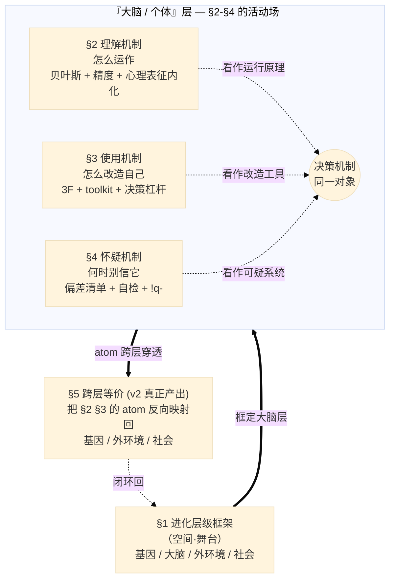
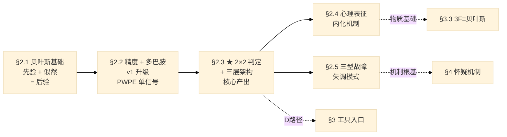
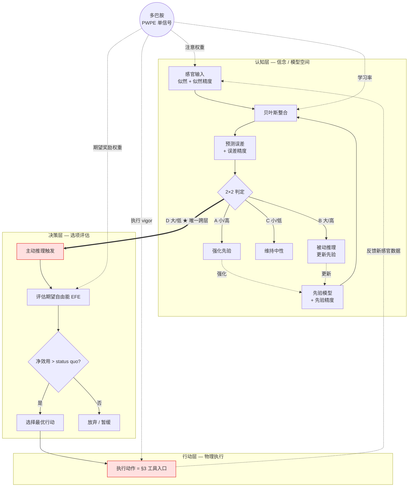
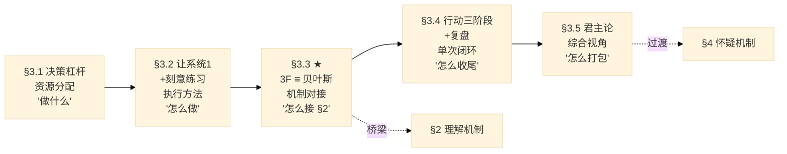
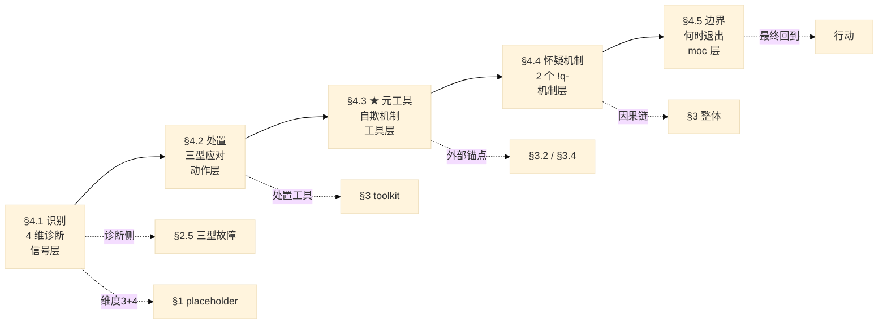

# 子论点关系图（先看图，再读下面）

> 2026-05-24 补：此节由 Claude 代写，澄清 §1-§5 的分工，让作者读完一图即知"先写哪节、节与节的关系是什么"。

§1 是**空间框架**（4 层进化舞台）；§2 §3 §4 不是平行的三个主题，而是对**同一个对象（决策机制）的三种动作** —— 理解 / 使用 / 怀疑；§5 是把大脑层的 atom 反向映射回基因 / 外环境 / 社会，让框架真正闭环。



**关系一句话**：§1 给舞台 → §2 装机制 → §3 用机制 → §4 审视机制 → §5 让机制跨层穿透。

---

# 引子（SCQA）

**S（情景）**：

moc v1（2026-04 写就）串联 6 个概念回答"人是怎么决策的"——自由能 / 奥卡姆剃刀 / 贝叶斯 / 多巴胺 / 双系统 / 刻意练习。

**C（冲突）**：

v1 的 6 概念链虽然完整地描述了**大脑层**的决策机制，但只看一层——无法回答"为什么 hardwire / livewire（基因层）、sys1 / sys2（个体层）、习俗 / 创新（文化层）反复出现同一种 fast / slow 结构"。这不是 v1 缺概念，是 v1 **没看见跨层同构**。

**Q（问题）**：

如果同一组 "fast routine + slow adaptive" 在 4 个时间尺度上重复出现，那么决策就不只是 "大脑怎么运作"——它是 **4 层进化嵌套的 fast / slow 二元如何在任意尺度被落地**。改造自己（= 在任意尺度把 slow adaptive 落地为 fast routine）是否就是 "认知" 的真正含义？


**A（中心论点）**：

> **认知不是大脑层的现象——是 4 层进化嵌套的 fast routine + slow adaptive 模式在不同时间尺度的同构显现。改造自己 = 在任一尺度把 slow adaptive 落地为 fast routine。**

A 包含两个 punchline：

- **描述性**："认知是 4 层嵌套的同构显现"（呼应 §1.5 同构嵌套主线 + §5 hierarchy）
- **行动性**："改造自己 = slow → fast"（呼应 §3 "决策不一定行动，但刻意练习一定行动" + §4 怀疑边界）

> 备选 framing（作者后续可改）：
> - **候选 B（最简短）**："决策的真正机制是 4 层进化嵌套的同一组元约束，在不同时间尺度上反复显现。"
> - **候选 C（反 v1）**："v1 把决策当成大脑层独有的事——但 4 层进化嵌套揭示，同一组 'fast/slow 二元' 在任意尺度都重复。改造自己不是大脑训练，是在任一尺度把 slow adaptive 落地为 fast routine。"

---

# 支撑论点 §1：进化层级框架 — 4 层级 × 3 维度

## §1 总览（先看这一节，再读子节）

**论点锚点**：

> v1 所有概念都局限在"大脑/个体"这一层——v2 需要把它嵌进 4 层级框架（基因 / 大脑 / 外环境 / 社会），让决策机制上下贯通。

**贯穿主线**（2026-06-01 推演的核心共识）：

> **4 层不是平铺，是同构嵌套——"fast routine + slow adaptive" 的结构模式在 4 个时间尺度上重复出现。**

§1.1-§1.5 沿着"4 层各自描述 → 同构嵌套综合"展开。

### 4 × 3 矩阵（§1 核心结构）

| 层级 | WHERE（在哪 / 位置定义）| HOW（怎么互动 / 机制）| WHY（为何存在 / 进化函数）|
|---|---|---|---|
| **§1.1 基因层** | hardwired / 复制因子 / 自然选择尺度（世代）| 传递生存目标 → 大脑 / 决定 sys1 默认走向 | 在世代尺度保持物种稳定 |
| **§1.2 大脑层** | livewired / 个体载体 / 突触可塑性（生命周期）| 接收基因目标 + 整合环境似然 + 输出行动 | 个体生命周期内应对环境（基因来不及更新）|
| **§1.3 外环境层** | 大脑 livewire 的输入空间 + 物理/化学规律 | 提供感官输入 / 接收行动 / 决定哪些先验加强 | 为大脑提供训练数据（没环境 = 没 livewired）|
| **§1.4 社会层** | 多个体 ESS 稳定策略集 + 文化（memes）| 约束个体决策 / ESS 维持平衡 / 反哺基因选择 | 多体长期稳定（个体策略需与他人协调）|

> ★ **元规则注**：[card-@进化层级模型](card-@进化层级模型.md) 用"三正交维度"语言描述这 3 维（where/how/why），但实质是 **MECE 关系**（无重叠 + 全覆盖），不是严格数学意义的正交。v2 在此订正。

### 层间关系（4 层闭环）

> **行文说明**：本章用矩阵 + 文字描述层间关系即可——4 层闭环的核心是"每层都既约束下一层、又被前一层反哺"，用 mermaid 强行画反而让 §1.5 同构节点的位置不自然。

4 层之间的关系是**相互调节的闭环**：

- **正向链**：基因（§1.1）传递生存目标 → 大脑（§1.2）接收并整合 → 行动改变外环境（§1.3）→ 多体互动形成社会（§1.4）
- **反馈链**：
  - 外环境感官输入 → 调节大脑 livewire
  - 社会层文化选择压力 → 反哺基因选择
  - 长期外环境压力 → 表观遗传 → 改写基因表达

→ 每个层都**既"约束下一层"又"被前一层反哺"**。§1.5 抽取的"同构嵌套"不是另一个层级，而是这个闭环中**反复出现的结构特征**——每层都有自己的"快慢二元"，且在不同时间尺度上重复同一种 fast routine + slow adaptive 模式。

### 子节之间的接口（独立成段，子节内部不再重复）

**内部接口**：

- **§1.1 → §1.2**：基因传递生存目标到大脑（hardwire 给定 sys1 默认走向）
- **§1.2 → §1.3**：大脑通过感官与外环境互动（双向反馈）
- **§1.3 → §1.1**：长期外环境压力反哺基因表达（livewire ⇌ hardwire 反馈）
- **§1.4 反哺所有层**：社会层既约束个体（§1.2）也反哺基因选择（§1.1）
- **§1.1-§1.4 → §1.5**：4 层各自的"快慢二元"在不同时间尺度同构

**跨章接口**：

- **§1.1 → §4.1 维度 3（进化遗留）**：损失厌恶 / 可得性启发等的基因根源（祖先环境快速响应）
- **§1.4 → §4.1 维度 4（集体性偏差）**：ESS 视角下的群体放大
- **§1.1+§1.2 → §2.5 二阶修正项**：情绪 / 生理状态作为 hardwire + livewire 的进化产物
- **§1 整体 → §2.2 自由能**：自由能最小化是基因层的元目标
- **§1.4 ← §3.5 君主论**：君主论的 6 类映射是 §1 元 4 层框架的特例
- **§1.5 → §5**：4 条跨层等价候选作为 §5 跨层等价的输入

---

## §1.1 基因层 — hardwired 复制因子

**本节论点**：基因是世代尺度的 hardwired 复制因子，传递生存目标到大脑，由自然选择稳定下来。

### WHERE — 它在 hierarchy 中的位置

- **hardwired**：不能在个体生命周期内改写，只能在世代尺度通过选择压力调整
- **复制因子**（Replicator）：自然选择的最小单位是**基因**，不是个体
- **时间尺度**：世代级（数代-数百万年）
- **载体关系**：个体只是基因的"生存机器"（[book-@自私的基因](book-@自私的基因.md) 的核心论断）

### HOW — 与相邻层如何互动

- **基因 → 大脑**：通过遗传发育，预先写好 sys1 的默认走向（本能 / 情绪反应 / 感官偏好）
- **基因 → 个体行为**：通过广义适合度（含亲属选择 r·B > C），驱动看似"利他"的行为
- **环境 ⇌ 基因**：长期环境压力通过表观遗传 + 基因表达调控反馈到基因层（[card-@进化层级模型](card-@进化层级模型.md) §神经可塑性段）

### WHY — 这一层为何存在

- **自然选择稳定性**：基因作为"不朽的复制因子"必须 robust —— 所以编码为 hardwire
- **时滞作为特性**：基因 vs 现代环境的错配是必然的（[card-@进化层级模型](card-@进化层级模型.md) §三维拆解 "时滞"）
- **元目标**：自由能最小化（§2.2）—— 维持物种 homeostasis 的基因表达稳定

> 跨章桥梁：本节内容直接回填 §4.1 维度 3「进化遗留」—— 损失厌恶 / 可得性启发等偏差的基因根源就在此。

---

## §1.2 大脑层 — livewired 预测机器

**本节论点**：大脑是生命周期尺度的 livewired 预测机器，接收基因目标并整合环境似然，是 §2 全部机制的载体。

### WHERE

- **livewired**：神经元具备突触可塑性（LTP / LTD）—— 在个体生命周期内可被反复重塑
- **个体载体**（Vehicle）：作为基因的执行机器
- **时间尺度**：毫秒（信号传递）→ 数十年（神经可塑性的长期改变）

### HOW

- **基因输入**：接收 hardwired 的 sys1 默认走向 + 基础情绪 / 本能（基因给的"先验骨架"）
- **环境输入**：通过感官接收似然数据，进行 §2 的贝叶斯整合
- **行动输出**：通过运动皮层 + 基底神经节执行（§2.3 D 路径的主动推理）

> §2 全部机制（贝叶斯 / 精度 / 多巴胺 / 2×2 判定 / 心理表征）都发生在本层。本节不复述 §2，只点 §2 是大脑层的内部细节。

### WHY

- **进化必要性**：基因更新太慢（世代级），无法应对个体生命中的快速环境变化 → 需要 livewired 大脑作为快速适应器
- **生命周期内的复利**：突触可塑性让先前经验影响后续判断（§2.4 心理表征内化）
- **个体差异的根源**：同样基因 + 不同环境 = 不同 livewired pattern → 个体差异

> 跨章桥梁：本节内容支撑 §2 全部，并为 §2.5 二阶修正项（疲劳 / 压力 / 安全感）提供进化解释——这些是 livewired 系统的内置调节器。

---

## §1.3 外环境层 — 反馈源 + 物理约束

**本节论点**：外环境既是大脑 livewire 的输入空间，也是物理 / 化学 / 社会规律的载体——没有环境就没有 livewired。

### WHERE

- **位置**：大脑外部、可被感官捕获的所有数据源
- **范围**：物理环境（自然规律）+ 生物环境（其他物种 / 同种个体）+ 部分文化环境（信息载体）
- **备注**：[card-@进化层级模型](card-@进化层级模型.md) 没有"外环境"作为独立层——v2 把它从 card 的 "Interaction(Population)" 层抽出，因为外环境包含**非生物物理约束**这一关键部分

### HOW

- **感官输入端**：为大脑提供原始似然数据（§2.1 贝叶斯整合的输入）
- **行动接收端**：行动通过物理交互改变环境状态 → 产生新的反馈（§2.3 D 路径的反馈循环）
- **训练源**：决定哪些先验被反复加强（§2.4 心理表征内化的物质供给源）

### WHY

- **训练数据的必要性**：livewired 大脑没有环境 = 没有训练信号 = 退化（神经可塑性的"用进废退"，[ref-神经元连接：高手与普通人的本质区别](ref-神经元连接：高手与普通人的本质区别.md)）
- **物理约束的不可移除性**：进化必须发生在某种物理基底中
- **环境驱动基因表达**：长期环境压力会反馈到 §1.1（表观遗传 + 自然选择压力）

> 跨章桥梁：本节支撑 §3 [toolkit-@让系统1为我所用](toolkit-@让系统1为我所用.md) 策略 5（设计环境）—— 之所以能"设计环境改变 sys1"，根源是外环境对 livewired 大脑的训练作用。

---

## §1.4 社会层 — ESS 群体博弈

**本节论点**：社会层是多个体 ESS（演化稳定策略）+ 文化（memes）的载体，约束个体决策并反哺基因选择。

### WHERE

- **位置**：多个体长期互动形成的稳定策略集
- **载体**：文化 / 制度 / 习俗 / memes（道金斯引入的"文化复制因子"）
- **时间尺度**：从代际（习俗演化）到瞬时（社会压力影响个体决策）

### HOW

- **约束个体**：通过 ESS 让个体策略空间收敛（偏离 ESS 的策略被群体压力淘汰）
- **维持平衡**：ESS 不是最优解，而是**入侵抵抗解**（[card-@进化层级模型](card-@进化层级模型.md) §跨概念辨析 ESS vs 纳什均衡）
- **反哺基因**：长期社会模式（如分工合作）通过选择压力反馈到基因层（§1.1）—— 形成基因 ⇌ 大脑 ⇌ 社会 三层闭环

### WHY

- **多体协调**：单个体策略只在群体中才有意义；ESS 是多体博弈的稳定吸引子
- **文化的进化必要性**：当个体生命周期不足以传递所有适应信息时，需要文化层（memes）作为快速复制因子
- **集体放大**：个体认知偏差被群体共振放大（直接对应 §4.1 维度 4）

> 跨章桥梁：① 本节直接回填 §4.1 维度 4（集体性偏差）；② [toolkit-@君主论与自我提升](toolkit-@君主论与自我提升.md) 的 6 类映射是 §1 元 4 层框架的"自我提升场景特例"；③ §4.1 克伦威尔法则的"群体内开放性"在此找到机制根源。

---

## §1.5 ★ 同构嵌套 — 跨层 pattern 综合（§1 真正的产出）

**本节论点**：4 层不是平铺，是**同构嵌套**——"fast routine + slow adaptive" 的结构模式在 4 个时间尺度上重复出现。

### 主 pattern：fast routine + slow adaptive 跨 4 时间尺度

| 时间尺度 | Fast routine（快速默认） | Slow adaptive（慢速更新） |
|---|---|---|
| **进化（世代）** | 基因 / hardwire | 大脑 / livewire |
| **个体（生命）** | sys1 | sys2 |
| **决策（秒-分钟）** | 直觉（sys1 调用） | 反思（sys2 调用） |
| **文化（代际）** | 既有 memes（习俗） | 新涌现 memes（创新尝试） |

→ 同一结构模式在不同时间尺度上重复出现——这就是"同构嵌套"。

### 每行的含义

- **进化层**：基因是 hardwired 的代际不变模式（[card-@进化层级模型](card-@进化层级模型.md) §三维拆解）；大脑作为 livewired 的快速适配器，让个体生命周期内能应对环境变化
- **个体层**：sys1 是大脑层的"已编入"模式（快速 / 自动 / [card-@系统1系统2](card-@系统1系统2.md) §1）；sys2 是"持续更新"的反思机制（慢速 / 高耗能 / §2 全部机制）
- **决策层**：单次决策中，sys1 输出"直觉"（无需推理的判断），sys2 输出"反思"（带显式推理过程）。**注意**：本行与"个体层"是**同一对系统在不同时间窗口上的体现**——个体层讲 sys1/sys2 在生命中的**发育**（神经可塑性、内化），决策层讲**当下哪个被调用**
- **文化层**：群体中的**既有 memes**（即 ESS 形成的"习俗"，参考 [card-@进化层级模型](card-@进化层级模型.md) §跨概念辨析 ESS vs 纳什均衡）是群体默认策略，偏离它的个体会被群体压力淘汰；**新涌现 memes**（即"创新尝试"）是对 ESS 的入侵尝试，多数失败，但偶有成功——成功的 memes 会改写 ESS 形成新稳态（这就是文化层的"范式革命"机制）

### 4 条跨层等价（送 §5 候选）

1. **★ hardwire / livewire ≡ sys1 / sys2**（2026-06-01 作者新洞察，v1 完全没有）
   - 共享结构：低耗能默认 + 高耗能改写
   - 关键区分：执行时间 vs 改写时间—— hardwire 改写在世代尺度；sys1 改写在生命周期
2. **心理表征 ≡ 神经元稳定连接**（§5 既有 TODO）
   - 认知层抽象 ≡ 神经元物理层稳定状态
   - §2.4 心理表征内化三层叠加已部分展开
3. **3F ≡ 贝叶斯更新流程**（§5 既有 TODO，§3.3 已落 atom）
   - 行动层 ≡ 认知机制层
   - Focus = 似然 / Feedback = 误差 / Fix = 后验更新
4. **二八关键少数 ≡ ESS**（§5 既有 TODO）
   - 个体优势 ≡ 群体稳定
   - 关键少数 = 在策略空间中具备入侵抵抗力的稀有策略

### 同构嵌套的元含义

> 4 层不是独立的层级，而是**同一"低耗能默认 + 高耗能改写"结构在不同时间尺度的反复显现**。

这条主线为 v2 与 v1 的核心差异提供了根基：

- **v1**：6 概念链局限在大脑层（贝叶斯 / 多巴胺 / sys1/sys2 / 自由能 / 奥卡姆 / 刻意练习）
- **v2**：揭示这 6 概念在大脑层是"同一 fast+slow 模式"的一种 instance；同一模式在基因层、社会层、文化层都有 instance

→ §5 真正的产出，就是把这条主线**具体化**为可操作的跨层等价关系。

---

# 支撑论点 §2：理解机制 — 大脑层的决策怎么运作

## §2 总览（先看这一节，再读子节）

**论点锚点**：

> v1 的 6 概念链作为大脑层的核心结构保留，但需要补充"精度"维度，并显式连接到心理表征的"内化"环节。

**贯穿主线**（2026-05-30 4 轮 Q&A 推演的核心共识）：

> **大脑做决策的本质 = 在"误差大小 × 精度高低"的 2×2 判定空间里选择处理路径——只有其中一种路径会跨出认知层、触发行动。**

§2.1-§2.5 沿着"基础 → 升级 → 核心判定 → 内化 → 故障"五步把这条主线展开。

**5 子节角色定位**：

| 子节 | 角色 | 回答的问题 |
|---|---|---|
| §2.1 贝叶斯整合基础 | 基础结构 | 大脑如何整合先验和似然？ |
| §2.2 精度 + 多巴胺 | v1 升级 | 经典贝叶斯不够，怎么升级？ |
| §2.3 ★ 2×2 + 三层 | **核心产出** | 4 种处理路径如何切分？谁触发行动？ |
| §2.4 心理表征内化 | 沉淀机制 | sys2 如何变成 sys1？ |
| §2.5 三型故障 | 失调模式 | 机制坏了会怎样？ |

**子节关系图**：



**子节之间的接口**（独立成段，子节内部不再重复这些跨节关系）：

- **§2.1 → §2.2**：经典贝叶斯只有先验和似然两个量，但大脑实际需要第三类参数——精度，才能解释为什么有的误差被学习、有的被忽略
- **§2.2 → §2.3**：精度 × 误差的乘积决定处理路径——这条乘法关系自然展开为 2×2 矩阵
- **§2.3 → §2.4**：B 和 D 路径的反复迭代 → sys2 的推理被压缩为 sys1 的直觉，这就是"内化"
- **§2.3 → §2.5**：当多巴胺 PWPE 信号失调，2×2 判定会失败——三型故障是这种失败的三种典型模式
- **§2.3 → §3**（跨章桥梁）：D 路径（误差大 / 精度低）是 §3 toolkit 的入口；"刻意练习 = 主动驻留在 D 区"首次出现在此
- **§2.5 → §4**（跨章桥梁）：三型故障为 §4 怀疑机制提供机制级根基——§4 不再是清单，而是"精度信号失调的识别 + 处置"
- **§2.4 → §3.3**（跨章桥梁）：心理表征内化的物质基础（突触可塑性）解释了 §3.3 "3F ≡ 贝叶斯"为什么需要数月至数年

---

## §2.1 贝叶斯整合基础

**本节论点**：大脑不是在计算公式，是在用先验整合似然的概率推断——后验 = 先验 × 似然比。

经典贝叶斯告诉你：

$$
P(H|E) = P(H) \cdot \frac{P(E|H)}{P(E)}
$$

但 [card-@贝叶斯更新](card-@贝叶斯更新.md) 强调，公式只是态度的形式化：

> **贝叶斯不是一个算式，是一种态度——理性的谦逊。它告诉你：信念可以用概率表示，可以基于证据被持续修正，但永远不会变成 1 或 0。**

### 似然比思维（实操核心）

面对新信息时，不要问"我该不该相信它"——

> **问**：如果我的假设是真的，看到这个证据的可能性，比假设是假的时看到它的可能性大多少倍？

这是个**比值**：当似然比接近 1，证据没有信息量；远离 1，证据有信息量。**新胜算 = 旧胜算 × 似然比**——这是贝叶斯更新最实操的形式。

### 克伦威尔法则（保持开放）

> **永远不要把先验概率设为 0 或 1。**

如果你认为某事"绝无可能"，那么无论后续多少证据，贝叶斯算出的后验永远是 0——这就是"死脑筋"。保持逻辑开放性（概率永远在 0 到 1 之间）是贝叶斯主义者的认识论底线。

---

## §2.2 精度维度 + 多巴胺（v1 升级点）

**本节论点**：经典贝叶斯只有先验和似然不够——精度是"对信号的确信度"；多巴胺 = 单一 PWPE 信号（precision-weighted prediction error），跨层 manifest 为注意 / 学习率 / 动机 / vigor。

### 升级版公式

预测加工框架在贝叶斯基础上加入"精度"参数：

$$
\text{后验} = \text{先验} \times \text{先验精度} \times \text{似然} \times \text{似然精度}
$$

精度 = 你对该信息的确信程度：

- 先验精度高 → 更相信原模型（sys1 主导）
- 似然精度高 → 更相信当下输入（sys2 介入）
- 都不高 → 进入探索 / 不确定状态

### 自由能的元目标（2026-06-02 §1+§4 联合 review 回填）

精度+贝叶斯整合的最终服务对象是 **自由能最小化**——但自由能为什么是大脑的优化目标？答案在 §1.1 基因层：

> **自由能最小化不是大脑随便选的目标——它服务于 §1.1 基因层的物种 homeostasis 稳定。** 大脑作为基因的"快速适配器"（§1.2 livewired 预测机器），其最小化自由能的机制本质是 hardwire 层施加的元目标。

→ 这也解释了为什么 §2.3 的 2×2 判定不是"个体偏好的选择"——它是 §1.1 进化层级施加的硬约束在大脑层的具体显现。

### 多巴胺定位升级（v1 → v2）

| 版本 | 多巴胺定位 |
|---|---|
| v1 | "调节哪些预测误差值得学习" |
| **v2** | **单一 PWPE 信号 + 四层 manifestation** |

v1 没错，但描述得太局部。Friston 自由能原理框架揭示：多巴胺其实是**一个统一的精度信号**，在大脑不同层级产生不同的下游效果：

| 作用层 | 多巴胺的 manifestation | 实际效果 |
|---|---|---|
| 感知层 | **注意权重** | 哪些输入信号值得被加权 |
| 认知层 | **学习率** | 信念更新的幅度 |
| 决策层 | **动机 / 期望奖励权重** | 哪些选项值得选 |
| 行动层 | **执行 vigor** | 动作有多用力 |

→ 一个信号，多层表现。这是 v2 比 v1 升级的关键。

### 反推：信号水平决定行为模式

- 多巴胺 ↑（信号强）→ 学习率高、动机强、行动 vigorous → 容易"冲动"（赌博 / 成瘾）
- 多巴胺 ↓（信号弱）→ 学习率低、动机弱、行动迟缓 → 容易"冷漠"（抑郁 / apathy）
- 多巴胺 stuck（信号无法重新校准）→ 学习无法更新 → 偏执 / 思维定式

→ 这条反推为 §2.5 三型故障埋下伏笔。

---

## §2.3 ★ 2×2 判定 + 三层架构（§2 真正的核心产出）

**本节论点**：误差 × 精度的 2×2 判定决定 4 条处理路径；只有 D 路径（误差大 / 精度低）跨出认知层、触发行动——这是 §3 主线"决策不一定行动"的机制级根基。

### 2×2 判定表

|  | **误差小** | **误差大** |
|---|---|---|
| **精度高** | **A 强化先验**（sys1 默认）<br/>"模型准 + 证据可信" | **B 更新先验**（sys2 被动推理）<br/>"模型错 + 证据可信" → 认知改变，**不行动** |
| **精度低** | **C 维持中性**（sys1 忽略噪声）<br/>"模型可能准 + 证据不可信" | **D ★ 主动行动**（sys2 主动推理）<br/>"模型可能错 + 证据不可信"<br/>**必须行动获取新数据** |

### 三层架构（认知 / 决策 / 行动）

sys1 / sys2 不是层级，是**横切维度**（加工方式：快 vs 慢）。两者都可以跨认知 / 决策 / 行动三层：

|  | 认知层（信念 / 模型） | 决策层（选项评估） | 行动层（物理执行） |
|---|---|---|---|
| **sys1**（快路） | 自动感知 / 模式匹配 | 默认走 | 习惯动作（开车走老路） |
| **sys2**（慢路） | 反思推理 / 主动假设 | 评估选项 / 价值权衡 | 主动行动 |

### D 路径的独特性

ABCD 四种处理路径中：

- **ABC 全在认知层完成**——信念被强化 / 更新 / 维持，不需要外部动作
- **只有 D 跨出认知层**——进入决策层（评估行动选项）→ 行动层（物理执行）

→ **行动的真正触发条件不是"误差大"，而是"误差大 + 精度低"**——大脑搞不清楚到底是模型错了还是噪声大，只能主动收集更多数据验证。

### 主干 mermaid（§2 总图）



### 关于「期望自由能 EFE」（讨论新产出 · 强化点）

EFE 是主动推理理论的核心评估量，粗略可理解为"做这个行动的期望成本"——**越小越值得做**。它由三部分组成：

- 期望奖励的不足程度（结果会不会偏离我想要的）
- 信息增益的不足程度（这个行动能不能减少不确定性）
- 行动本身的代价（精力 / 时间 / 机会成本）

⚠️ **强化点**：EFE 是 2026-05-30 与 Claude 讨论后引入的**新产出**，目前在 v2 中作为决策层评估标准的占位。后续需要：① 补独立 card（如 `card-@期望自由能`），② 或者在 §2.2 升级版公式中显式整合（"后验 × 精度 × EFE"作为完整决策方程），③ 或者升级 [card-@贝叶斯更新](card-@贝叶斯更新.md) §4 把 EFE 作为预测加工框架的第三块拼图。

---

### 关键洞察：刻意练习的本质 = 主动驻留在 D 区

"舒适区边缘"（能勉强完成 60-80%）正好是 D 区的实操定义：

- 误差大（新领域，预测不准）
- 精度低（不熟悉，无法判断哪里准 / 哪里错）

→ 大脑被迫调用主动推理 → 行动验证 → 反馈感官数据 → 更新模型。

100% 完成 = 已观察区域 = 被动推理就够了 = 模型不会成长。这条机制级解释让 §3 的"刻意练习一定是行动"从经验直觉变成机制必然。

---

## §2.4 心理表征内化（sys2 → sys1 的固化机制）

**本节论点**：反复 2×2 迭代 → 系统 2 的高耗能推理被压缩为系统 1 的自动反应；机制是神经元 / 先验模型 / 行为三层叠加。

[card-@系统1系统2](card-@系统1系统2.md) §3.B 给出了核心命题：

> 刻意练习的本质是**用系统 2 的高耗能努力，构建出高速、自动、精确的系统 1 模式**——即心理表征。

这个"固化"过程不是一种机制，而是**三层叠加**：

| 层 | 机制 | 例子 |
|---|---|---|
| **神经元层** | 突触可塑性（LTP / LTD）；神经元 livewired 形态——用进废退 | 神经元连接的强化 / 弱化 |
| **先验模型层** | 先验从 sparse（稀疏）→ dense（细密）；预测误差精度上升 | 心理表征的细化 |
| **行为层** | 慢思考 → 直觉；高耗能 sys2 → 低耗能 sys1 | 专家的"棋感" / 消防员的"危险感" |

### 三层叠加的因果链

- **神经元层是基础**：神经元被高精度误差反复激活 → 突触强化（LTP）；不被激活 → 突触弱化（LTD）。这是 livewired 的硬件机制
- **先验模型层是中介**：硬件变化转化为模型更新——先验从"少量参数 + 高不确定性"逐步变为"多参数 + 高确定性"
- **行为层是输出**：模型细化后，sys1 可以直接给出准确预测，不需要 sys2 介入。心理表征 = 长时记忆中预存的"模式 + 关系"

→ 三层叠加解释了为什么内化需要**数月至数年**——突触可塑性有生物学速率上限。

### 边界

本节只讲**机制**（how it works）。**怎么用**这个机制（设计训练 / 找反馈 / 找导师）是 §3 [toolkit-@让系统1为我所用](toolkit-@让系统1为我所用.md) + [card-@刻意练习](card-@刻意练习.md) 的领域，不在本节展开。

---

## §2.5 三型故障（精度信号失调的三种模式）

**本节论点**：当多巴胺 PWPE 信号失调，2×2 判定就会失败——三型故障是精度信号失调的三种典型模式。

[card-@精度操控三型](card-@精度操控三型.md) 提出三种典型的精度操控偏差：

| 三型故障 | 精度参数错配 | 多巴胺 PWPE 信号状态 | 生活实例 |
|---|---|---|---|
| **精度锁死** | 先验精度被拉满，反证全被视为噪声 | 信号被压制 → 不学习 | 应试教育 / 立场先行的自媒体 |
| **精度通胀** | 似然精度被高频低质反馈占用 | 信号过度活跃 → 噪声被当真信号 | KPI / 短视频 / 社交媒体点赞 |
| **精度坍塌** | 学习率主动关闭，误差无法被定位归因 | 信号 stuck → sys2 不再被调用 | 犬儒主义 / 躺平 / 没干劲 |

### 三型与 §2.2 多巴胺的闭环

§2.2 说"多巴胺 = 单一 PWPE 信号"，§2.5 说"三型故障 = PWPE 信号失调"——两条对应起来：

- 锁死 = PWPE 被压制（学习率太低）
- 通胀 = PWPE 过强（学习率太高 + 噪声放大）
- 坍塌 = PWPE 信号 stuck（学习率被关闭）

→ 三型 = **同一精度信号的三种失调模式**，不是三个独立故障。

### 二阶修正项：情绪 / 生理状态

精度不是纯理性分配的——疲劳 / 睡眠 / 压力 / 威胁感 / 安全感会整体性地**抬高或压低精度阈值**。它们：

- 不直接生成预测误差
- 不直接操控精度
- 而是**改变精度分配的默认增益**

这条修正项让 §2.5 不止是认知层故障，而是与身体状态耦合的复杂系统失调。

**保留理由**（作者 2026-05-30 备注）：

> 当前 §2 整体架构以"**绝对理性**"为前提推论（所有 2×2 路径都假定大脑在按贝叶斯逻辑工作），但**人不可能是绝对理性的**——二阶修正项是为这套架构留给"人类不完美"的缓冲。当前作用尚未显现，但后续 §4 怀疑机制 / §5 跨层等价 / 中心论点 A 写作时可能会成为关键支点。

### 进化根源（2026-06-02 §1+§4 联合 review 回填）

情绪 / 生理状态不是 bug，是 feature——它们是 **§1.1 基因层 hardwire 给我们的"精度调节器"** + **§1.2 大脑 livewire 在生命周期内的"状态指标"**：

- **威胁感放大损失厌恶**：祖先环境"威胁 = 生死"，基因层 hardwire 了"威胁 → 精度调节"以提高生存率
- **疲劳压低 sys2 资源**：节约能量是基因层的核心约束，hardwire 了"疲劳 → 精度阈值上升"
- **安全感放大过度自信**：在 ESS 群体内，安全感意味着群体支持，hardwire 了"安全 → 大胆决策"
- **多巴胺基线随生理状态波动**：livewire 系统通过激素（皮质醇 / 睾酮）实时调节多巴胺基线

→ 这就是为什么"二阶修正项"**不能像 sys1 偏差那样靠 sys2 反思修正**——它的根源在 hardwire 层，需要通过 §3.5 君主论"法律 = 习惯"（即环境设计 / 生理基线管理）才能改善。具体处置见 §4.2 「二阶修正项失调」行。

🏷 **桥梁去 §4**：本节只讲机制成因（why）。§4 怀疑机制会展开"如何识别自己卡在哪一型 + 如何处置"（what to do）。§2.5 + §4 一起构成"精度失调"的完整诊疗。

---

# 支撑论点 §3：使用机制 — 用机制改造自己

## §3 总览（先看这一节，再读子节）

**论点锚点**：

> v1 把刻意练习作为终点轻提一句——v2 需要展开为完整方法论子树：3F 流程 + 3 个 toolkit + 决策杠杆族。

**贯穿主线**（作者 2026-05-25 提炼）：

> **决策不一定产生行动，但刻意练习一定是行动的过程。**

§3.1-§3.5 沿着"决策 → 执行 → 机制对接 → 单次闭环 → 综合应用"五步把这条主线展开。

**5 子节角色定位**：

| 子节 | 角色 | 回答的问题 |
|---|---|---|
| §3.1 决策杠杆 | 资源分配原则 | 做什么？（往哪用劲） |
| §3.2 让系统1 + 刻意练习 | 执行方法 | 怎么做？（具体动作） |
| §3.3 ★ 3F ≡ 贝叶斯 | 桥梁回 §2 | 怎么对接机制？ |
| §3.4 行动三阶段 + 复盘 | 单次闭环 | 怎么收尾？（单次复盘） |
| §3.5 君主论综合案例 | 整合视角 | 怎么打包？（综合应用） |

**子节关系图**：



**子节之间的接口**（独立成段，子节内部不再重复这些跨节关系）：

- **§3.1 → §3.2**：先决定"做什么"，再决定"怎么做"。例：战略性懒惰（§3.1）= 决定"哪些事不亲自做" → 设计环境（§3.2 策略 5）= 决定"那些事如何自动化"
- **§3.2 → §3.3**：5 策略中**只有刻意练习的 3F 与 §2 贝叶斯机制一对一对应**——§3.3 单独成节就是为了承接这个对应，是 §3 通往 §2 的唯一显式桥梁
- **§3.3 → §3.4**：3F 是宏观沉淀流程（数月至数年），行动三阶段的复盘是微观执行模板（单次行动）——同一机制的不同时间尺度
- **§3.4 → §3.5**：散装的 4 个 toolkit 组合并不直观——君主论提供一套整合语言，证明这些工具可以打包
- **§3.5 → §4**：君主论的"参政院三院仲裁"已经触及"何时不该信机制"的范畴，是 §3 → §4 的天然过渡

---

## §3.1 决定做什么 — 资源分配原则

**本节论点**：决策的前置环节是资源分配——5 个杠杆型概念回答"往哪里用劲"。

[moc-@决策杠杆](moc-@决策杠杆.md) 把 5 个杠杆型概念（80/20 / 长尾 / 战略性懒惰 / 复利 / 机会成本）归为**非线性的资源分配** —— 即"投入 ≠ 产出按比例缩放"：

| 杠杆 | 维度 | 典型问题 |
|---|---|---|
| 80/20 | 头部聚焦 | 哪 20% 最重要？ |
| 长尾 | 尾部价值 | 剩下 80% 还有什么用？ |
| 战略性懒惰 | 减法节能 | 哪些事可以自动化？ |
| 复利 | 时间维度 | 这事 10 年后会怎样？ |
| 机会成本 | 选择维度 | 选这个我放弃了什么？ |

> 完整辨析见 [moc-@决策杠杆](moc-@决策杠杆.md) §1.3；何时用哪个的决策树见同文 §3.1。

资源分配的判断错了，再精的执行也是徒劳。

---

## §3.2 具体怎么做 — 执行方法

**本节论点**：资源分配确定后，[toolkit-@让系统1为我所用](toolkit-@让系统1为我所用.md) 把"系统 2 改造系统 1"拆成 5 大策略；其中刻意练习是**唯一有反馈的物理执行项**——也是 §3 主线"刻意练习一定是行动"的落点。

5 大策略：

| 策略 | 类型 | 调用方式 |
|---|---|---|
| 1. System 2 Checklist | 主动介入 | 决策前扫描偏差（锚定 / 可得性 / 过度自信 / 损失厌恶） |
| 2. **刻意练习构建专家直觉** | **长期沉淀** | **3F 流程在某领域反复执行** |
| 3. 创造外部视角 | 主动介入 | 基率思维 + 外部顾问视角 |
| 4. 预加载情绪标记 | 被动改造 | 把判断点与强烈情感绑定 |
| 5. 设计环境 | 被动改造 | 让系统 1 的"顺手"指向正确选择 |

> 5 策略的协同关系（被动改造 vs 主动介入 vs 长期沉淀）见 [toolkit-@让系统1为我所用](toolkit-@让系统1为我所用.md) "5 策略的执行顺序" mermaid 流程图。

### 5 策略的三类性质（按"对系统 1 的作用类型"重新归类）

- **决策类工具**（策略 1 + 3）= 调整**思考** —— 系统 2 上线瞬间纠偏
- **设计类工具**（策略 4 + 5）= 预设**默认** —— 不靠 in-the-moment 调用系统 2，而是改造默认走向
- **行动类工具**（策略 2 = 刻意练习）= 唯一**有反馈的物理执行**

### 为什么刻意练习要单拎出来

| | 决策类 + 设计类（4 策略） | 行动类（刻意练习） |
|---|---|---|
| 需要物理执行？ | 否 | **是** |
| 需要反馈？ | 不强制 | **强制** |
| 是否真正重塑系统 1？ | 间接 | **直接** |
| 时间尺度 | 即时 / 长期被动 | **数月至数年** |

其他 4 策略让系统 1 **不犯错或走对路**；只有刻意练习让系统 1 **长出新能力**。

具体方法论见 [card-@刻意练习](card-@刻意练习.md)，本节抓两点：

1. **舒适区边缘**（能勉强完成 60-80% 的难度）—— 这是预测误差精度最高的区域：太简单（误差精度 = 0）/ 太难（误差精度淹没在噪声中）都不行
2. **三种练习的区分**（天真 / 有目的 / 刻意）—— 多数人停在"有目的的练习"，因为找客观标准 / 杰出人物本身就难（详见 [card-@刻意练习](card-@刻意练习.md) §2 对比表）

---

## §3.3 ★ 桥梁回 §2 — 3F ≡ 贝叶斯更新

**本节论点**：刻意练习的 3F 与 §2 贝叶斯机制一对一对应——这是 §3 → §2 的唯一显式桥梁。

3F 流程**逐项对应** §2 描述的贝叶斯更新机制：

| 3F 步骤 | 具体动作 | §2 贝叶斯对应 |
|---|---|---|
| **Focus** | 强制调用系统 2，打破系统 1 自动模式 | 收集高质量似然数据 |
| **Feedback** | 外部 / 自我监控产出的精准信息 | 产生预测误差 |
| **Fix** | 系统 2 设计修正动作，重复将其刻进系统 1 | 后验更新先验 |

> 出处：[card-@刻意练习](card-@刻意练习.md) §3 A 表。

3F **缺一不可** —— 缺哪个对应 §2 的哪种精度故障：

- 只有 Focus（专注但无反馈）→ 精度坍塌
- 只有 Feedback（频繁数据但不调整）→ 精度通胀
- 只有 Fix（不断换方法但不专注）→ 模式无法巩固

✅ **§5 跨层等价已落地**（2026-06-04 retrofit）：本表是 §5 等价 #5 的预产出。**升级版（含 3 个精度 gate + 3 种失败模式的完整对应）详见 [§5.4 等价 #5](#§5-4-应用层-流程-杠杆)**——3F 不只是"3 步对应"，而是"3 步 + 3 个 gate + 3 种故障"的双向桥梁。

---

## §3.4 单次行动的完整闭环 — 心态 + 复盘

**本节论点**：宏观尺度上有 3F，单次行动尺度上需要 [toolkit-@行动三阶段框架](toolkit-@行动三阶段框架.md) —— 行动后的复盘是 leverage 最高的一段。

三阶段：

| 阶段 | 心理建设 | 对应机制 |
|---|---|---|
| **行动前** | 贝叶斯先验（**尽人事**） | 现在能做什么改善情况 |
| **行动中** | 斯多葛（**听天命**） | 关注当下动作而非结果 |
| **行动后** | 贝叶斯后验（反喂数据） | 把结果作为新似然数据 |

弗洛伊德映射：先验 ≈ 本我（既有经验+本能）；现实数据 ≈ 自我（理性反馈）；斯多葛 ≈ 超我（高维价值准则）。

### 行动后：配套复盘模板（重点）

toolkit 的"配套复盘模板"分三部分：

**1. 决策快照（行动前 - 贝叶斯先验）**

- 初始假设：我认为做 A 能达成 B（预期胜率 X%）
- 关键依据：基于经验 C 和资源 D
- 控制边界：能控制 E，不能控制 F

**2. 结果记录（行动后 - 斯多葛式客观描述）**

- 用**第三人称视角**写实验报告，禁用"我感到 / 我真笨 / 太可惜了"等词汇
- 事件还原 + 最终结果 + 情绪标记（仅记录，不沉溺）

**3. 偏差校准（核心 - 复利点）**

- **信息差**：漏掉了哪个关键信息？
- **逻辑差**：是否存在幸存者偏差 / 过度自信？
- **环境变动**：现实规则是否变了？
- **下一次迭代**：先验概率应调整为多少？checklist 增加哪一条？

---

## §3.5 综合应用案例 — 君主论与自我提升

**本节论点**：散装的 4 个 toolkit + 决策杠杆容易凌乱，[toolkit-@君主论与自我提升](toolkit-@君主论与自我提升.md) 给出一套**整合语言**——证明这些工具可以打包为一个完整的"管理自己"体系。

### 6 类映射

| 君主论 | 自我提升类比 |
|---|---|
| 君主 | 我 |
| 领土 | 认知（本我 / 自我 / 超我） |
| 财政 | 精力（二八法则） |
| 军队 | 知识技能（PKM 国民军 + 费曼法） |
| 法律 | 习惯（冥想 / 运动） |
| 参政院 | 思维（平民 / 贵族 / 枢密三院仲裁） |

### 君主论给 §3 增加的视角

1. **资源约束是大前提** —— 回应决策杠杆的"为什么要分配"
2. **认知复利**（新领土反哺世袭领土）—— 是复利效应在"自我提升"场景下的具体形态
3. **PKM 国民军 vs 精神雇佣军** —— 给刻意练习加了一条边界：**核心能力绝不外包**（不能用 AI 替代 / 用药代替锻炼）

> 注意：本节只点君主论的**整合视角**，6 类映射的细节见 [toolkit-@君主论与自我提升](toolkit-@君主论与自我提升.md)。

---

# 支撑论点 §4：怀疑机制 — 何时不该信这套机制

## §4 总览（先看这一节，再读子节）

**论点锚点**：

> v1 默认所有概念成立——v2 需要单独承载"系统 1 故障地图 + 边界判定工具 + 未明边界的开放问题"，即 agent 层。

**贯穿主线**（2026-05-31 推演的核心共识）：

> **怀疑的真正对象不是世界，是你自己——而最难诊断的是"你以为你在诊断"。**

§4.1-§4.5 按**怀疑半径递增**组织——上一层用对了不代表下一层用对了：

```
信号 → 动作 → 工具 → 机制 → moc 本身
```

**5 子节角色定位**：

| 子节 | 怀疑对象 | 回答的问题 |
|---|---|---|
| §4.1 识别 | 信号层 | 我现在处于哪种故障？|
| §4.2 处置 | 动作层 | 这种故障的应对动作是什么？|
| §4.3 ★ 元工具 | 工具层 | 我的工具是不是用对了？|
| §4.4 怀疑机制本身 | 机制层 | 机制本身是不是还成立？|
| §4.5 边界 | moc 层 | 该用本 moc 吗？什么时候停止怀疑？|

**子节关系图**：



**子节之间的接口**（独立成段，子节内部不再重复这些跨节关系）：

**内部接口**：

- **§4.1 → §4.2**：识别哪种故障 → 对应处置动作
- **§4.2 → §4.3**：处置动作本身也可能用错——需要元工具层补丁
- **§4.3 → §4.4**：工具用对了不代表机制还成立——升到机制层怀疑
- **§4.4 → §4.5**：机制层怀疑需要边界——不能无限退步

**跨章接口**：

- **§4.1 → §2.5**：4 维诊断的维度 1+2 是 §2.5 三型故障的诊断侧（§2.5 是 why，§4.1 是 how to detect）
- **§4.1 → §1**：维度 3 进化遗留 + 维度 4 集体性偏差 依赖 §1 → placeholder
- **§4.2 → §3**：处置动作（跨界对话 / 反馈重设）与 §3 toolkit 重叠 → §4.2 简引用，§3 是主出处
- **§4.3 → §3.2 + §3.4**：外部锚点 3 件套（写下决策 / 跟外部对话 / 公开承诺）复用 §3 已有 toolkit
- **§4.4 → §3 整体**：§3 "使用机制"的成功**催生**了 §4 "怀疑机制"的必要性——因果链
- **§4.5 → 行动**：§4 不是无限退步，最终回到行动闭环

---

## §4.1 识别 — 4 维诊断框架（信号层）

**本节论点**：识别自己处于哪种故障 = 4 维诊断（信号 + 增益 + 进化遗留 + 集体放大）。

### 4 维诊断表

| 维度 | 失调类型 | 自检问题 | 出处 |
|---|---|---|---|
| 维度 1 | **精度三型**（信号失调） | 我的先验精度 / 似然精度 / 学习率是否错配？ | §2.5 |
| 维度 2 | **二阶修正项**（增益失调） | 我现在的疲劳 / 压力 / 安全感是否扭曲了精度基线？ | §2.5 二阶修正项 |
| 维度 3 | **进化遗留** | 这条偏差是不是基因层为祖先环境写死的"快速响应"，在现代环境失效？ | §1.1 基因层（已回填，见下方"进化根源"段）|
| 维度 4 | **集体性偏差** | 这条偏差是不是被我所在的群体放大了？ | §1.4 社会层（已回填，见下方"进化根源"段）|

### 认知偏差 ↔ 维度对应

引用 [card-@认知偏差清单](card-@认知偏差清单.md) 的 5 大类，映射到 4 维：

| 偏差 | 主要维度 | 次要维度 |
|---|---|---|
| 锚定效应 | 维度 1 精度锁死（先验精度被拉满） | — |
| 可得性启发 | 维度 1 精度通胀（最近经历被赋高精度） | 维度 2（疲劳时更依赖）|
| 过度自信 | 维度 1 精度锁死 + 维度 2 安全感增益 | 维度 3（祖先环境"自信 = 行动力"）|
| 损失厌恶 | 维度 3 基因层（"失去食物 = 死亡"写死） | 维度 2 威胁感增益 |
| 框架效应 | 维度 1 似然精度被表述方式扭曲 | — |

🏷 **强化点**（2026-05-31 提出 / 2026-06-02 联合 review 后处理）：本表的对应映射经 §1+§4 联合 review 检查——映射本身**经得起 §1 提供的进化根源支撑**（详见下方「维度 3+4 的进化根源」段），但 Claude 基于推演的"损失厌恶 = 维度 3 + 维度 2"等**双对应仍偏粗**。**建议保留映射但标注为"主要 + 次要"概率分布**，而非硬性单一对应。后续如有第 2 本认知偏差专书，可以进一步细化映射强度。

### 克伦威尔法则 — 通用怀疑准则

> **永远不要把先验概率设为 0 或 1。**（出自 [card-@贝叶斯更新](card-@贝叶斯更新.md) §3.B）

克伦威尔法则直接对应**精度锁死的反面**——但广义看，它是**对三型故障的通用预防药**：保留"我可能错"的可能性，能同时抵御锁死（先验僵化）/ 通胀（噪声当真信号）/ 坍塌（放弃学习）。

### 维度 3+4 的进化根源（2026-06-02 §1 完成后回填）

**维度 3 进化遗留**（接 §1.1 基因层）：

许多认知偏差是 hardwired 进化遗留——在祖先环境中是适应性的，在现代环境失效。

- **损失厌恶**：祖先环境"失去食物 = 死亡"，基因 hardwire "损失放大反应"（生存性能高于精确性）
- **可得性启发**：祖先环境信息稀缺，"最近经历 = 最相关"通常成立，基因 hardwire "近期 = 高精度"
- **过度自信**：祖先"自信 = 行动力 = 生存率"，基因 hardwire "默认自信"作为决策启动剂
- **框架效应**：祖先在群体中需要快速跟随框架（"领头者的措辞 = 部落共识"），基因 hardwire "高敏感度跟随"

→ 这条机制让 §4.2 处置精度锁死时**不能只靠"反思"** —— hardwire 层的偏差需要通过**反复制造高精度反证**（§4.2 处置）+ **环境设计**（§3.2 策略 5）才能压制。

**维度 4 集体性偏差**（接 §1.4 社会层）：

个体偏差被群体共振放大——单人的损失厌恶在群体里变成 bank run；单人的可得性启发在群体里变成舆论暴风。ESS 视角下：

- **群体已收敛的偏差 = ESS**（参考 [card-@进化层级模型](card-@进化层级模型.md) §跨概念辨析）：偏差作为多人协调的稳定策略，比单人偏差更难修正
- **偏离群体偏差的代价**：偏离 ESS 的个体可能在群体中被边缘化（社会代价 > 认知代价）
- **集体放大的反馈环**：群体共振 → 个体强化偏差 → 群体进一步共振

→ 这条机制说明：§4.3 元工具的"跟外部高质量人对话"必须**找有不同先验的人**——同 ESS 群体内的"外部视角"其实是同质化的，无法打破群体共振。

✅ **§1 placeholder 已回填**（2026-06-02 §1+§4 联合 review 完成）—— 维度 3+4 的进化根源段已落入本节。

---

## §4.2 处置 — 三型故障对应应对动作（动作层）

**本节论点**：识别完故障类型后，给出可执行的应对动作——**意识到 ≠ 修正**。

### 三型 × 处置动作表

| 故障类型 | 应对动作 | 与 §3 接口 |
|---|---|---|
| **精度锁死** | 主动制造高精度反证（跨界对话 / 角色互换 / 反方辩论 / 找最强反例） | §3.2 策略 3 外部视角 |
| **精度通胀** | 重设反馈结构（屏蔽噪声源 / 拉长反馈周期 / 关注慢变量） | §3.2 策略 5 设计环境 |
| **精度坍塌** | 重建可归因的反馈（缩小练习单元 / 找导师 / 量化指标） | §3.2 策略 2 刻意练习 + [card-@刻意练习](card-@刻意练习.md) §3.B |
| **二阶修正项失调** | 改善生理基线（睡眠 / 运动 / 安全感建设） | §3.5 君主论"法律 = 习惯" |

> 注意：§4.2 只点处置原则，**具体工具落地在 §3**——避免重复展开。

---

## §4.3 ★ 元工具 — 自检 + 自欺机制 + 外部锚点（工具层）

**本节论点**：决策前先问"我现在的工具是不是用对了"，但**元认知本身可能失效**——必须有外部锚点。

### toolkit-@工具决策前的自检

[toolkit-@工具决策前的自检](toolkit-@工具决策前的自检.md) 作为 agent 层元工具——调用 §3 toolkit 前先跑一遍"我现在的工具选择是不是受认知偏差影响"。

但 **元工具本身也可能被 sys1 欺骗**，所以下面两段必须配套。

### ★ 自欺机制（最深盲点）

大脑**不只会犯错，还会主动隐藏错误**。下面 5 种形式逐项展开（防止只看表格后遗忘）：

**① 合理化（事后编故事）**

决策错了之后，sys2 会自动编出"我当时其实是想 X"的解释，把不一致的事实重新整合进自我形象。这不是"撒谎"——sys2 真的相信这个故事。

> 例：投资亏了之后说"其实我本来就只想试一下"；选错路之后说"反正这条路风景也不错"。

**② 美化失败 / 夸大成功（记忆被偷偷篡改）**

为维持自我形象，记忆会被悄悄重写：失败被淡化（"那不是真的我"），成功被强化（"我一直都很努力"）。回顾过去时，叙事会越来越自洽，但越来越不准确。

> 例：复盘 10 年前的项目，记得的"成功因素"往往是当时根本没意识到的事。

**③ 不一致认知容忍（cognitive dissonance）**

大脑可以同时持有矛盾信念，只要这两个信念不被同时激活。靠场景切换（工作中信 X，生活中信非 X）避免触发冲突，从而避免修正任一信念。

> 例：宣称"重视健康"但每天熬夜——两个信念在意识里被分隔处理，不引发不一致警报。

**④ 元认知失效（达克效应）**

越无知越自信——能力评估本身需要能力。新手不知道自己不知道，所以高估；专家知道自己不知道的边界，所以低估。元认知监督本身可能错（[card-@系统1系统2](card-@系统1系统2.md) §5：sys2 不能裁决 sys1 的所有偏差，因为它本身依赖某个被采纳的模型）。

> 例：刚学一个新领域时最敢"指点江山"，深入之后反而越来越保守。

**⑤ 元认知是 sys1 输出（最深的递归陷阱）**

"我觉得自己理性"这条判断本身也是 sys1 给出的——你"感到"理性时，可能只是 sys1 在告诉你"我理性"。元认知的"我在元认知"其实又是元元认知，再往下还是 sys1。

> 例：你"觉得"自己已经审视过这个决定，但这个"觉得"也可能是 sys1 的快捷判断——递归不会自动终止于"真正的理性"。

### 外部锚点 3 件套（自欺的反制）

既然内部 audit 不可信，必须有**外部锚点**：

| 锚点 | 做法 | 反制目标 | 工具接口 |
|---|---|---|---|
| **写下决策** | 行动前用第三人称记录初始假设 + 控制边界 | 防止事后篡改记忆 | §3.4 复盘模板第一部分 |
| **跟外部高质量人对话** | 找有不同先验的人 review 你的判断 | 防止自我循环 | §3.2 策略 3 外部视角 |
| **公开承诺** | 让认知不一致的代价高到无法合理化 | 防止合理化 | — |

> ★ **这是 §4 最深的盲点**：元认知靠不住，所有 audit 必须落到外部锚点。

---

## §4.4 怀疑机制本身 — 两个 !q- + 怀疑成本 + 时间维度（机制层）

**本节论点**：机制使用得很好的时候，需要怀疑机制本身是否还成立——这是 §4 升到元层的关键。

### §3 → §4 的因果链

§3 "使用机制"的**成功**催生了 §4 "怀疑机制"的**必要性**：

> 你越擅长用机制，越需要怀疑它是否还成立。心理表征的高精度先验是把双刃剑——成功的内化恰恰是锁死的种子。

### 两个 !q- 作为怀疑触发场景

| !q- | 表面问题 | 深层怀疑 |
|---|---|---|
| [!q-做擅长 vs 突破舒适区](!q-做擅长%20vs%20突破舒适区如何平衡.md) | 资源分配 | **sys1 主导是否该被怀疑？** 你的擅长还成立吗？还是该进 D 区？|
| [!q-心理表征是否变成定式](!q-心理表征是否会变成思维定式.md) | 心理表征副作用 | **sys2 内化的成果是否过期？** 成功的内化是锁死的种子 |

→ 两个 !q- 不是孤立问题，是 **§4 怀疑机制的两个具体触发场景**。

### 怀疑的成本（防止决策瘫痪）

笛卡尔式怀疑会无限退步——怀疑机制 → 怀疑怀疑机制 → 怀疑怀疑怀疑机制 → ...

**三段节奏**（解决无限退步）：

| 阶段 | 怀疑动作 |
|---|---|
| **行动前** | 需怀疑（避免错决策） |
| **行动中** | **禁**怀疑（参考 §3.4 行动中 = 斯多葛"听天命"）|
| **行动后** | 必怀疑（复盘 = §3.4 行动后） |

### 时间维度 / 复盘节奏

| 节奏 | 触发条件 |
|---|---|
| 即时 | 每次大决策前 |
| 30 秒粒度 | 每次小决策做完后 |
| 周期性深度 | 每月 / 每季度 |

→ 复盘节奏与 §2.4 心理表征内化的"数月至数年"互补——内化是慢变量，复盘是快变量。

---

## §4.5 边界 — 何时该用本 moc + 何时该停止（moc 层）

**本节论点**：怀疑机制本身需要边界——moc 不是万能锤，最终要回到行动。

### 使用 / 不使用 边界表

| 该用本 moc | 不该用本 moc |
|---|---|
| 大决策前（高 stakes / 不可逆）| 行动中（已经在做，怀疑会瘫痪）|
| 复盘时（行动后）| 已熟练的高频微操作（用 sys1 就够了）|
| 反复失败时（怀疑机制本身）| 时间极度紧迫（无 sys2 资源）|
| 跨领域应用前（先验可能不适用）| 单纯情感问题（生死之外，无需机制干预）|

### ★ 何时该停止怀疑然后行动

> **行动是检验真理的唯一标准。**

#### 取决于行动的颗粒度：小行动 vs 大行动

"停止怀疑然后行动"的判断**取决于行动的颗粒度**：

| 行动类型 | 何时停止怀疑 | 何时继续 |
|---|---|---|
| **小行动 / 单步行动** | 规划好就该做——继续怀疑往往是借口 | 信息确实严重不足时 |
| **大行动 / 多步行动** | 不需要全盘怀疑完——**走一步看一步**，后续子动作取决于前序子动作的结果 | 每个子步骤的反馈触发"是否需要重做规划" |

→ 大行动不该等"全部论证完毕"才动——那是 §3.1 决策杠杆"复利"的反例（早期完美主义吞掉复利窗口）。

#### 边际判据（指示性，非决定性）

停止怀疑的**指示性**信号：**信息边际增益 < 行动延迟成本**。

> ⚠️ **强化点**：此判据借自经济学的"边际"概念（borrowed concept），尚未独立 card 化。后续遇到第 2 本系统讨论"边际决策"的书时，考虑起 `card-@边际决策`。

继续怀疑会产生新信息吗？

- 是 → 继续怀疑值得（净期望效用为正）
- 否 → 停止怀疑，进入行动（信息已饱和）

这条呼应 §4.4 怀疑成本——和 §2.3 EFE 决策评估同构。

#### ★ 关于"判据本身"的元怀疑（作者 2026-05-31 洞察）

把"何时停止怀疑"硬性定义为某个公式，本身就**犯了"PKM 先分类再写入内容"那种错误**——会让本应灵活的判断变成新的精度锁死。

所以本节给的"边际判据"是**指示性的，不是决定性的**。最终决定"现在该不该停止怀疑"依然是一个**判断**（属于 §2.3 D 路径的主动推理），而不是一个**计算**。

> 这条元怀疑本身也是 §4 的自我应用——§4 怀疑机制连"怀疑何时停止"这个判据都要怀疑。

### _todo §四候选池 mapping

[_todo](_todo.md) §四候选池中已识别的 5 条 seed-status !q-，标识哪些对应本 moc 的边界判断：

| 候选 !q- | 是否对应本 moc 边界 |
|---|---|
| 二八法则陷阱 vs 结构性不平等 | 部分（§4.1 维度 4 集体性偏差）|
| 大一统 vs 小政府 | 否（§1 社会层范畴）|
| 形而上学 vs 底层逻辑 | 部分（§4.5 moc 适用范围本身）|
| 目标驱动 vs 系统驱动 | 否（§3.1 决策杠杆范畴）|
| PKM 是否需要 skill 层 vs agent 层 | **是**（这就是 §4 的元定位问题）|

→ 第 5 条 !q- 与 §4 的元定位高度对齐——可作为 §4 自身的元论证 anchor。

---

# §5 跨层等价 — 4 层 hierarchy × 6 条等价（v2 真正的产出）

## §5 总览（先看这一节，再读子节）

**论点锚点**：

> 4 层不是独立的，而是通过若干"跨层等价"互相穿透——这些等价关系是 v2 高于 v1 的核心价值。

**贯穿主线**（2026-06-03 ~ 06-04 跨日推演的核心共识）：

> **4 层进化嵌套 → 同一组元约束 → 同一组跨层等价 → 4 层 hierarchy。** §5 把 §1.5「同构嵌套」主线从抽象口号具体化为 6 条可操作的等价关系 + 元结构。

§5.1-§5.5 按 **hierarchy 自上而下**组织：元目标驱动 → 信号差异选择 → 机制固化 → 应用杠杆。

### 6 条等价 × 4 层 hierarchy（§5 核心结构）

| Hierarchy 层 | 等价 | 跨层接口 | 共享深层结构 |
|---|---|---|---|
| **元目标层** | #1 自由能 ≡ 物种 homeostasis | 元目标跨层 | 稳定平衡的元目标 |
| **信号层** | #2 多巴胺 PWPE ≡ 自然选择压力 | 基因 ↔ 大脑 | 差异选择信号 |
| **机制层** | #3 hardwire/livewire ≡ sys1/sys2 | 基因 ↔ 大脑 | "低耗能默认 + 高耗能改写" |
|  | #4 心理表征 ≡ 神经元稳定连接 | 大脑 ↔ 外环境 | 认知抽象 ≡ 物理稳定状态 |
| **应用层** | #5 3F + 精度 ≡ 贝叶斯精度更新 | 大脑层内部 | 3 步 + 3 gate + 3 故障 |
|  | #6 二八 ≡ ESS 成功入侵 | 大脑 ↔ 社会 | 杠杆少数 → 多数 outcome |

### 子节关系

§5.1（总览）→ §5.2（地基层 = 元目标 + 信号）→ §5.3（机制层）→ §5.4（应用层）→ §5.5（总结 + A 种子）

逻辑：自上而下——每一层都是上一层的具体化。元目标定"为什么"，信号定"选什么"，机制定"怎么固化"，应用定"怎么落地"。

### 子节之间的接口（独立成段，子节内部不再重复）

**跨章接口**：

- **§5 整体 → §1.5 同构嵌套主线**：§5 是 §1.5 的具体化
- **§5.2 #1 自由能 → §1.1 + §2.2**：[§2.2 自由能子节](#§2-2-精度维度-多巴胺-v1-升级点) 已 grounded
- **§5.2 #2 多巴胺 → §1.1 + §2.2**：多巴胺四层 manifestation 已展开
- **§5.3 #3 hardwire/livewire → §1.1 / §1.2 + §1.5**：fast/slow 4 时间尺度表
- **§5.3 #4 心理表征 → §2.4**：三层叠加机制
- **§5.4 #5 3F+精度 → §3.3**：⚠️ **§3.3 retrofit alert** —— §3.3 当前 mapping 缺精度，§5 升级后 §3.3 需要补一句指向 §5.4 升级版
- **§5.4 #6 二八/ESS → §1.4 + §3.1 决策杠杆**
- **§5.5 → §6 中心论点 A**：留种子，**不写 A**

---

## §5.2 地基层 — 元目标 + 信号

**本节论点**：自由能 + 多巴胺信号是所有等价的根基——前者定"为什么要改"，后者定"改什么"。

### #1 自由能最小化 ≡ 物种 homeostasis

**共享深层结构**：稳定平衡的元目标——大脑追求自由能最小化 = 基因层追求物种 homeostasis 稳定。

| 层级 | 表现 | 时间尺度 |
|---|---|---|
| 大脑层（§2.2） | 大脑作为预测机器追求自由能（预测误差 + 模型复杂度）最小化 | 毫秒至数十年 |
| 基因层（§1.1） | 基因作为复制因子追求物种 homeostasis 稳定 | 世代 |

→ 同一组"稳定平衡"目标在不同时间尺度上重复。

**使用价值**：任何"改善自己"的设计都要**服务于** homeostasis，不是抵抗它——

- 想养成新习惯？让新习惯**降低**长期不确定性（变得 stable），sys1 才会接纳
- 想打破旧模式？必须有更大的 homeostasis 收益（减压 / 节能 / 改善关系），否则会反弹

**边界**（什么时候这条等价不能用）：

- 自由能在大脑是**可计算量**（贝叶斯精度框架内）；homeostasis 在群体是**涌现属性**（不可精确量化）
- 跨层不能机械套用——不能用大脑自由能公式去"推算"物种 homeostasis 的值
- 自由能可短期降低（如冲动决策的临时舒适）但损害 homeostasis（长期不健康）——等价不意味着两者完全同向

### #2 多巴胺 PWPE ≡ 自然选择压力

**共享深层结构**：差异选择信号——多巴胺选哪些预测误差值得学习，自然选择选哪些变异值得保留。

| 层级 | 信号内容 | 选择对象 |
|---|---|---|
| 大脑层 | 多巴胺 PWPE（精度加权预测误差，§2.2） | 哪些感官误差值得加权 / 哪些行动值得做 |
| 基因层 | 自然选择压力 | 哪些基因变异能存活下来 |

→ 同一组"差异选择"机制在不同时间尺度上重复。两者都是**非中立信号**——告诉系统哪些差异有意义。

**使用价值**：

- 设计"外部压力"（环境压力 / 反馈系统）时**借鉴自然选择**——不需要 prescription（写明该做什么），只需要 selection（用反馈淘汰错的）
- 例：刻意练习（§3.3）的 Feedback 信号就是"多巴胺级"的选择压力——告诉 sys1 哪些动作值得固化
- 例：组织设计的 KPI 是"自然选择级"的选择压力——但要小心精度通胀（§2.5）

**边界**：

- 多巴胺是**个体瞬时信号**（毫秒级）；自然选择是**群体累积过程**（代际级），**时间尺度差 4 量级**
- 多巴胺有显式接收者（sys1 / sys2 / 运动皮层）；自然选择没有，是 blind
- 不要把"自然选择的压力"浪漫化为"宇宙在塑造我"——这是把多巴胺的 intentional 性质投射到 blind 进化过程

---

## §5.3 机制层 — 内化的同构

**本节论点**：机制层 2 条等价描述"如何把信号转化为持久结构"——hardwire→livewire 是进化时间尺度的内化，心理表征→神经元是个体时间尺度的内化。

### #3 hardwire / livewire ≡ sys1 / sys2（作者 2026-06-01 洞察）

**共享深层结构**："低耗能默认 + 高耗能改写"在不同时间尺度的重复。

| 层级 | Fast routine（低耗能默认） | Slow adaptive（高耗能改写） |
|---|---|---|
| 进化（世代） | 基因 / hardwire | 大脑 / livewire |
| 个体（生命） | sys1 | sys2 |

→ 两个 pair 共享 asymmetric updateability 结构：**执行快，改写慢**。

**关键区分**（避免作者 6/1 提到的"sys1 不该时滞"误判）：

- 时滞在**改写**维度，不在**执行**维度
- 基因 / hardwire：执行 fast，改写需世代尺度
- sys1：执行毫秒级，改写需 sys2 长期训练（数月至数年）
- 两者共享"快执行 + 慢改写"的 asymmetry

**使用价值**：

- 改造 sys1 = "**进化自己的快路**"——借鉴基因→大脑机制：长期、间接、需要环境压力
- 不要试图"瞬间改造 sys1"——它的物质基础是突触可塑性（§2.4），有生物学速率上限
- 设计 sys1 改造时，向自然选择学习：靠**反复的环境压力**（→选择信号→突触强化），不是靠意志力

**边界**：

- 个体的 "sys2 训练 sys1" 是 **deliberate**（有目标 / 反馈）
- 进化的 "基因→大脑" 是 **blind**（无目标 / 反馈）
- 不要把 deliberate intention 投射到进化（如"我可以通过冥想改变基因"——表观遗传部分对，但跨代效应极弱）
- 反向也别：不要因为进化是 blind 就放弃 deliberate 设计 sys1 改造

### #4 心理表征 ≡ 神经元稳定连接

**共享深层结构**：认知层抽象 ≡ 神经元物理层稳定状态——livewired 在长期互动中固化。

| 层级 | 表现 |
|---|---|
| 认知层（§2.4） | 心理表征——预存的模式 / 规则 / 关系（专家的"棋感"） |
| 物理层（§2.4） | 神经元稳定连接——LTP / LTD 形成的突触强化 pattern |

→ 同一现象的两种描述：信息层（心理表征）vs 物质层（神经元）。

**使用价值**：

- 学习新概念时，**目标不是"记住它"**，而是让神经元形成稳定连接 = 心理表征
- 操作上：反复在不同情境下激活该概念（神经元层 = 重复激活同一连接）
- 这就是 §3.3 刻意练习 + §3.4 复盘的物质基础——重复的高精度反馈让神经元连接稳定

**边界**：

- 心理表征**不是单一神经元**——是分布式连接 pattern（涉及数百万神经元）
- 单一神经元损坏不会摧毁心理表征（冗余）；但大量损坏（如卒中）会
- 心理表征**可以错位**——如思维定式（[!q-心理表征是否变成定式](!q-心理表征是否会变成思维定式.md)）。神经元稳定 ≠ 心理表征正确

---

## §5.4 应用层 — 流程 + 杠杆

**本节论点**：应用层 2 条等价描述"如何在实践中操作"——3F 是个体决策层的具体流程，二八/ESS 是群体策略层的杠杆原理。

### #5 3F + 精度 ≡ 贝叶斯精度更新（Q1 升级版）

**共享深层结构**：3 步 + 3 个精度 gate + 3 种失败模式。

| 3F 步骤 | 贝叶斯对应 | 精度 gate | 失败模式（§2.5） |
|---|---|---|---|
| **Focus** | 收集高质量似然数据 | **似然精度**决定输入是否值得加权 | 似然精度低 → 信号被当噪声 → **精度坍塌** |
| **Feedback** | 产生预测误差 | **误差精度（多巴胺 PWPE）**决定误差是否值得学习 | 误差精度被噪声占用 → **精度通胀** |
| **Fix** | 后验更新先验 | **学习率**决定更新幅度 | 学习率被锁 → 拒绝更新 → **精度锁死** |

→ 3F 不只是"3 步对应"，而是 **3 步 + 3 个 gate + 3 种失败模式**——精度 gate 让 3F 的边界显式化，三型故障 = 3F 在 3 个 gate 上的具体失效。

⚠️ **§3.3 retrofit alert**：[§3.3](#§3-3-桥梁回-§2-3f-贝叶斯更新) 当前 mapping 只有 3 行（无精度）。§5 升级版完成后，§3.3 需要补一句"详见 §5.4 升级版"，或者直接升级 §3.3 表格。**deferred action**：写完 §5 后另作。

**使用价值**：

- 刻意练习时**先 audit 精度 gate**：似然精度够吗（数据是否高质量）？误差精度够吗（反馈是否清晰可归因）？学习率有问题吗（是否拒绝更新）？
- 卡在某型故障时**反查对应 gate**：精度坍塌 → 修复 Focus（提升数据质量）；精度通胀 → 拉长 Feedback 周期；精度锁死 → 强制 Fix（外部锚点 / 公开承诺）

**边界**：

- 3F + 精度只适用于**有客观反馈的领域**（如运动、技艺）——纯主观领域（哲学、艺术）的精度 gate 难定义
- 精度调节本身可能失调（§2.5 二阶修正项）——情绪 / 生理状态会扭曲精度基线，此时不能机械应用 3F + 精度

### #6 二八关键少数 ≡ ESS 成功入侵突变（Q2 升级版）

**共享深层结构**：少数关键决策 / 少数成功突变 = 非线性决定多数 outcome / 群体方向。

#### ★ 关键 sharpening：动态 framing，不是静态

| Framing | 内容 | 评价 |
|---|---|---|
| **静态（错）** | 二八关键少数 ≡ ESS 稳定策略（个体优势 ≡ 群体稳定） | ❌ ESS 的"多数"和二八的"少数"方向相反 |
| **动态（对）** | 二八关键少数 ≡ ESS 的成功入侵突变（杠杆 ≡ 群体演化推动力） | ✅ 共享"稀缺关键 → 非线性放大" |

具体对应：

| 维度 | 二八法则（个体层） | ESS 动态（群体层） |
|---|---|---|
| 关键稀缺资源 | 20% 关键投入 | 20% 突变尝试中的成功 ones |
| 决定的产出 | 80% 个体结果 | 群体长期演化方向 |
| 非线性放大 | 杠杆 | 入侵 → 新稳态 |

**使用价值**：

- 在群体中找"杠杆位置" = 找 **ESS 边界处的突变机会**——绝大多数人在稳定 ESS 内，少数人尝试 alternative，极少数成功
- 想推动群体变化？目标不是说服"多数"，是找到**能成功入侵的突变策略**
- 个人成长：与其在"已饱和领域做得比别人好"（多数策略），不如尝试"在已稳定 ESS 边界处的 niche"（少数策略）——这是路径依赖的逆操作

**边界**：

- "成功入侵"是**事后判定** —— 入侵尝试时不知道是否成功，所以多数尝试者会失败
- 二八的"20% 关键投入"是个体层的**可控选择**；ESS 的"20% 突变"是群体层的**不可控分布**——不要把个体决策权投射到群体演化
- **v1 / card 都没有这条 sharpened 等价** —— 是 v2 的关键产出之一

---

## §5.5 总结 + 中心论点 A 的种子

**本节论点**：6 条等价 + 4 层 hierarchy 揭示了 v2 与 v1 的核心差异——不是"加了几个新概念"，而是"把大脑层概念跨层投射，每一层都验证了同一组元约束"。

### 4 层 hierarchy 的元含义

| Hierarchy 层 | 元约束 |
|---|---|
| 元目标层（自由能 ≡ homeostasis） | **稳定平衡是任何系统的元目标** |
| 信号层（多巴胺 ≡ 自然选择） | **差异选择信号驱动学习 / 演化** |
| 机制层（hardwire/livewire ≡ sys1/sys2，心理表征 ≡ 神经元） | **快慢二元结构在每一层都重复** |
| 应用层（3F+精度 ≡ 贝叶斯，二八 ≡ ESS） | **杠杆少数决定多数 outcome** |

→ 4 层 hierarchy 不是巧合——4 层进化嵌套**必然**带来同一组元约束的同一组等价。**这就是为什么会有跨层等价**。

### v1 → v2 的核心差异

- **v1**：6 概念链局限大脑层（自由能 / 奥卡姆 / 贝叶斯 / 多巴胺 / sys1-sys2 / 刻意练习）
- **v2**：把这 6 概念**跨层投射** —— 每个概念在其他 3 层都有 instance，形成 6 条跨层等价 + 4 层 hierarchy
- **v2 真正的产出**：不是"概念增多了"，而是"看清了大脑层概念背后的元结构" —— 它们是 4 层进化嵌套的具体显现

### ★ 中心论点 A 的种子（开放问题）

读到这里，你应该已经感觉到一个**比 v1 "人是怎么决策的"更大的问题**正在浮现。

不写 A 是有意的——按归纳法工作流，A 应该从 §1-§5 的子论点**自然浮现**。§6 写作时回看本节，A 的具体形态会自然显现。

> **留给 §6 的开放问题**：6 条等价 + 4 层 hierarchy 揭示的"4 层进化嵌套的同一组元约束"，是 v2 的中心论点吗？还是它的副产品？

---

# §6 给自己的提醒

## 1. v1 处理 — 并存（不删 v1）

**决策**：保留 v1 作为历史 record，**不替换 / 不归档**。

理由：

- v1 是 git history 的一部分，删掉破坏 audit trail
- v2 的同构嵌套主线**依赖与 v1 的对比**（"v1 6 概念 → v2 跨层投射"）—— v1 是 v2 的 setup
- 如果未来 Post-v2 决策选 A 方案（重命名 v2 为 hypo），v1 可以保留为 [moc-@认知链路](moc-@认知链路.md) 的原始 moc 索引版本
- 最小阻力 + 未来需要 archive 也容易

## 2. v2 mermaid 图 — ✅ 已分散在各章节

v2 已包含的可视化：

| 章节 | 可视化形式 |
|---|---|
| §2.3 | 主干图（贝叶斯整合 + 2×2 + 三层 + 多巴胺 4 manifestation） |
| §3 总览 | LR 关系图 + 子节流程 |
| §4 总览 | LR 关系图（怀疑半径递增） |
| §1 总览 | 4×3 matrix 表（替代 mermaid —— matrix 适配通则的首次实战） |
| §5 总览 | 4 层 hierarchy 表（同上理由） |

→ 整体 cover 图**不放在 v2 文档内部**，留给外部 canvas（`canvas-v2-overview.canvas`，Post-v2 闭环后再选最终布局）。

## 3. 其他 moc 联动升级 — deferred 候选

| moc | 与 v2 的关系 | 升级提议 |
|---|---|---|
| moc-@决策杠杆 | §3.1 引用 5 杠杆，但 moc 本身 grounding 在大脑层 | 加入 _todo §三 等待信号："v2 闭环后做 moc-@决策杠杆 v2 适配 review" |
| moc-@人性矩阵 | 与 §1 进化层级有大量重叠 | 同上等待信号 |
| moc-@沟通 | 未在 v2 内详细 cross-ref | 保持独立，不动 |

不立即升级，留作 deferred。

## 4. Post-v2 决策点 reminder（v2 论证已闭环，可以做了）

作者 2026-05-31 提出的 **"v2 是否应重命名为 hypo（论证型）而非 moc（索引型）"** 决策**现在到时机了**——v2 论证已完整闭环（5 章 + 引子 + §6 + §7）。

3 个候选 option：

- **A**：重命名为 `hypo-@认知链路`（论证型）+ 重建瘦身的 `moc-@认知链路`（索引型）
- **B**：压缩当前 v2（删过程性内容 / 来源声明挪到 sidecar archive）
- **C**：不动，保持当前"论证型 moc"作为一种新笔记类型

作者 5/31 倾向 A，但未定。**等待作者 decision**。

---

# §7 本次升级最重要的一句

> **改造自己 = 在任一时间尺度，把 slow adaptive 落地为 fast routine。**

—— 这是 A 的最 sharp 提炼。v1 把"改造自己"局限在大脑层（刻意练习），v2 揭示这条规律在 4 个时间尺度都适用（基因 → 大脑 → 决策 → 文化）。

> 备选 framing（作者后续可改）：
>
> - "决策不是大脑的事——是 4 层进化嵌套的同一组元约束在不同时间尺度的反复显现。"
> - “4 层嵌套，同一组元约束——这就是认知的真正机制，也是改造自己的唯一方式。”

---

## 来源声明（蒸馏版）

> 2026-07-12：原来 280 行的逐轮代写流水已删，完整历程见 git（`git log --follow` 这个文件）。这里只留关键决策：

- **起源**（2026-05-11）：v2 起于 canvas 2025-05-10 与 v1 的比对；Claude 先出 SCQA + 中心论点 + 4 条 MECE 锚点，作者补全证据和展开。
- **写法**：从演绎改成归纳——先写子论点（§3 → §2 → §4 → §1 → §5），中心论点 A 最后归纳回填。
- **结构**：一开始每章都套金字塔，后来软化为"论证型默认金字塔 + 矩阵 / 时间线 / 因果链例外"。触发点是作者自己发现"§1 是矩阵、硬套金字塔不合适"，并意识到自己可能因为顺手（可得性启发）过度用金字塔——这条规则进了 memory `feedback_audit_and_drafting`，还衍生出 [!q-MVP 验证 vs 可得性启发的边界](!q-MVP%20验证%20vs%20可得性启发的边界.md)。
- **关键订正**：把"三正交维度"改成 MECE；补上 hardwire/livewire ≡ sys1/sys2 这条 v1 没有的跨层等价。
- **§5 是真正的产出**：6 条跨层等价 + 4 层结构——不是概念变多了，是看清了元结构。
- **闭环**（2026-06-04）：5 章 + 引子 SCQA + §6（4 项决策）+ §7（金句）+ 归纳出中心论点 A，论证完整闭环。
- **类型决策**（2026-06-26）：v2 不是 moc（有中心论点 + 合成），也不是 !h-（!h- 是问题优先，v2 反过来、是归纳优先）；它是库里第一个"归纳优先框架"产物。按 n=2 规矩，n=1 先不命名，等第 2 篇出现再提取共性。frontmatter 已改诚实，文件不改名。
- **瘦身**（2026-07-12）：本节蒸馏 + 工作流 / self-check 两章移出（方法论已在 memory）。

