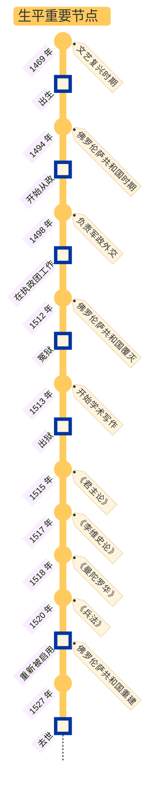
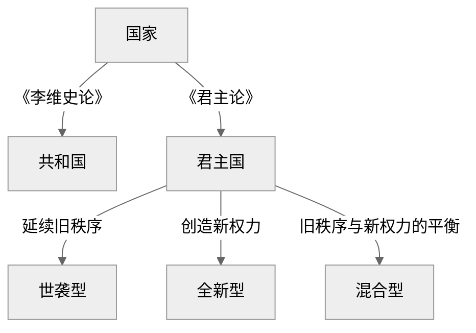

## 马基雅维利生平

### a) 时代/家庭/仕途

大背景：成长于和平的文艺复兴全盛时期

家庭：祖辈是佛罗伦萨贵族

学识：拉丁文、意大利古典文学、史学、罗马共和制度

政治主张：

- 由于经历了佛罗伦萨共和国的覆灭，深感雇佣军是意大利一切灾难的来源，因此主张：
  - 建立自己的政治秩序必须以自己的武装作为后盾 → 建立国民军
  - 军队与法律是立国之本
- 由于任职外交官，可以深入了解各国领袖：
  - 深感弱国无外交，富国必须强兵
  - 认可博尔贾为了努力建立一个强大统一的国家而不择手段的行事风格

潘光典（译者）评价马基雅维利：

> 除了时代的局限性和固有的阶级性之外，马基雅维利的思想往往趋于极端，带着某种片面性、夸张性，受着他个人的主观经验束缚与强烈的政治激情影响。但是他的建设国民军的基本目的，是为了建立一个统一的国家，排除外国的干涉与侵略，维护独立。这些主张是符合新兴阶级和人民的利益的，因此在历史上具有进步意义。

### b) 著作

马基雅维利的本意是希望撰写一本小册子，论述君主国是什么，有什么种类，怎样获得，怎样维持，以及为什么会丧失，据此献给[朱利亚诺](https://zh.wikipedia.org/wiki/%E6%9C%B1%E5%88%A9%E4%BA%9A%E8%AF%BA%C2%B7%E5%BE%B7%C2%B7%E7%BE%8E%E7%AC%AC%E5%A5%87)。然而他的愿望最终石沉大海，在失望中他仍然撰写了《李维史论》。本书围绕有关意大利兴亡的国家政治、军事、历史和宗教等方面的问题展开论述。《君主论》是《李维史论》的一个分支：

- 《君主论》讨论的是由于意大利腐败，内忧外患混乱状态不得不采取的**君主政体制**
- 《李维史论》则阐述以古罗马共和国制度为楷模的**共和制**

而《兵法》阐述军事与政治的密切关系，强调建立国民军的必要性，批判了城堡化的保守策略。

戏剧《曼陀罗华》是对腐朽社会道德的讽刺，也反映了作者对道德伦理和教会的态度，算是戏剧版的《君主论》。

## 君主和人民的关系

从人民群众中来，到人民群众中去：

> - 深深地认识人民的性质的人应该是君主
>
> - 深深地认识君主的性质的人应属于人民

## 政体篇：君主国的种类与治理理念

作者在第一章先提出了国家的分类：

### a) 世袭型

对于世袭型，作者认为统治者要做到两点[^1]：

- 不触犯祖制
- 对于随机事件要做到随机应变

统治者的统治方式分为两种[^2]：

| 统治方式        | 示例                        | 征服难度 | 统治难度 |
| --------------- | --------------------------- | -------- | -------- |
| 君主 + 一群臣仆 | 土耳其皇帝 + 波斯国王大流士 | 难       | 易       |
| 君主 + 诸侯     | 法兰西国王                  | 易       | 难       |

[^1]: 对应第二章内容
[^2]: 对应第四章内容

### b) 混合型

所谓“混合型”君主国，指的是**原有世袭领土兼并新领土形成的国家**，本质是“部分新、部分旧”的复合体。统治混合型国家的困难在于，如何平衡旧盟友与新臣民的利益。

按照被征服领土的性质，作者提出的对策如下：

| 被征服地区           | 特点                                                         | 对策                                                         |
| -------------------- | ------------------------------------------------------------ | ------------------------------------------------------------ |
| 非完全异质的君主国   | 存在部分文化差异                                             | - 灭绝旧统治家族 - 保留原有法律和税收 - 建立低成本殖民地（而非驻军）[^3] |
| 完全异质的世袭君主国 | - 文化、制度完全割裂 - 民众长期习惯集权统治，反抗弱但同化难 | - 由于无法温和过渡，需彻底摧毁旧体系 - 君主亲自驻守 - 依赖少数代理人，分化地方贵族 |
| 自由城邦             | - 民众强烈认同自由价值，反抗意识顽固 - 旧贵族势力持续煽动复辟 | - 低成本：彻底毁灭其社会结构（如屠城、驱逐公民） - 中成本：君主亲自驻军统治 - 高成本：保留自治 + 进贡 + 扶植傀儡政府（需持续镇压叛乱）[^4] |

此外，无论想要征服哪种国家，都要警惕外部势力介入统治管理

[^3]: 为什么殖民比驻军更能有效控制成本？作者认为，驻军意味着提高旧盟友的投入，而殖民意味着只需要得罪少数新势力的利益，见第三章内容
[^4]: 对应第五章内容

### c) 全新型

对于从平民上位成为君主的情况，作者从君主上位路径展开论述，介绍了六种途径：

| **对应章节** | **上位方式**               | **权力来源**  | **统治难点**               | **案例**      |
| :----------- | :------------------------- | :------------ | :------------------------- | :------------ |
| 第六章       | 自身能力                   | 军事/政治才能 | 维持创新成果               | 摩西、居鲁士  |
| 第七章       | - 他人武力 - 自主转型 | 命运 → 能力   | - 恩主反噬 - 旧部背叛 | 切萨雷·博吉亚 |
| 第八章       | 邪恶手段                   | 暴力/欺诈[^5] | - 民众仇恨 - 道德反噬 | 阿加托克勒斯  |
| 第九章       | 市民拥戴                   | 贵族/平民支持 | 派系制衡失效               | 罗马市民君主  |
| 第十一章     | 宗教制度                   | 神权合法性    | 世俗权力缺失               | 教宗国[^6]    |

[^5]: 损害行为要一次性干完，这样百姓可以少受一些损害；而恩惠要一点一点地赐予，以便让百姓能够更好地品尝恩惠的滋味
[^6]: 作者表面称赞宗教国稳定且幸福，实则讽刺现实，指出宗教国是意大利分裂的祸根，因为它阻挠强权君主实现统一

对于第九章，作者还提出了执政的三种情况：

- 贵族支持的君主权
- 平民支持的自主权
- 二者都不是的无政府状态

对于贵族，作者认为要分三种情况处理：

- 约束自己且不贪婪的贵族：给予荣誉并加以爱护
- 胆怯或天生缺乏勇气的贵族：利用他们，特别时那些能够提出有益意见的人，因为即使君主逆境也无需畏惧他们
- 为了野心故意不依靠的贵族：防范，把他们当作公开的敌人那样警惕，因为他们会在君主不利的时期，率先出来把君主灭掉

对于人民，作者认为：

- 若通过人民上位，则继续同人民保持友好关系，因为人民的需求时免于压迫
  - 要说服人民，更要让他们对说服的意见坚定不移，形成信仰
  - 当人民不再有信仰时，还要使用武力迫使人民就范
- 若通过贵族上位，则要想方设法争取人民，把人民置于自己的保护之下
- 如果脱离人民，从平民政制转向专制政制，君主的统治地位会处于危险状态

第十章是第六至九章的补充，回答了“若通过上述方式上位后遭遇外敌入侵（如法国进攻意大利），如何临时保权？”的问题——使用最低成本防御原则：

- 加固首都——首都象征着权力的合法性
- 绑定人民利益——民众和君主利益趋同
  - 让臣民感到有希望，相信霍乱不会长久下去
  - 让臣民对敌人的残酷感到恐惧
  - 控制过于莽撞的人民

## 军事篇

在作者看来，法律和军队是一个稳固政权的基础，而良好的军队一定会带来良好的法律。因此，军事是权力延续的终极保障[^7]。这一部分对应原文第十二至十四章[^8]：

| 军队类型 | 可靠程度 | 军队特点                       | 案例                   |
| -------- | -------- | ------------------------------ | ---------------------- |
| 外国援军 | 0        | 骁勇善战 + 团结一致 + 效忠外主 | 教宗国借西班牙军反噬   |
| 雇佣军   | 1        | 唯利是图 + 怯战叛变            | 意大利佣兵队长斯福尔扎 |
| 混合军   | 3        | 警惕雇佣兵反噬国民军           | 15 世纪威尼斯征服内陆  |
| 国民军   | 5        | 为国而战 + 团结一致 + 效忠君主 | 罗马共和国 + 瑞士民兵  |

[^7]: 联想到“枪杆子里出政权”，以及吴思提出的血酬定律：暴力最强者说了算

[^8]: 简而言之，雇佣军 = 慢性自杀；外国援军 = 加速自杀；只有国民军才是唯一解，同时作者还指出，正是城邦雇佣军制度导致意大利的分裂

### a) 与政体篇的逻辑关系

- 作者在第十章已经提出了被动防御/构筑城堡是缓兵之计，构建国民军 + 君主过硬的军事素养才是主动出击的根本

- 具化解释第六章：依靠自身能力上位需要的军事素养
- 揭露第七章：单纯依靠他人武力无法使统治持久
- 否定第八章：使用邪恶建立政权的君主，会忽略军队建设的重要性

### b) 如何构建国民军

- 兵源政治化：军队从**本国公民**（非流民）招募，使其战斗与家国利益关联
- 分权制衡防止叛乱：
  - 军官由君主直接任命（防军阀化）
  - 训练权/指挥权分离（如瑞士模式
- 成本平民化
  - 国民军平时务农，战时集结（低维持成本）；
  - 避免重税养雇佣军引发民怨

### c) 君主自身的军事素养要求

作者认为，作为君主，其军事能力一定要强：

> 和平时期比战争时期更需备战

终极目的是：

- 威慑贵族/反对派叛乱
- 预防外地入侵

**君主要具备怎样的用兵才能？**

- 用兵时，君主必须身临前敌，亲自挂帅
- 必须使用国民军，对于被委派的将领：
  - 能力不足 → 必须撤换
  - 能胜任 → 必须用法律加以约束，确保不越出指示范围

**君主要具备怎样的军事训练才能？**

| **维度**     | **要求**                                                    |
| :----------- | :---------------------------------------------------------- |
| **知识积累** | 研究地形（山地/沼泽战法）、历史战役（如汉尼拔越阿尔卑斯山） |
| **实践训练** | 狩猎模拟战争（锻炼体能、地形分析力）                        |
| **制度设计** | 建立军事档案库（地图、军备记录）、定期巡视边境              |

## 品德篇

关于品德篇的内部逻辑链关系：

1. 破：第十五章是总纲领，提出“道德相对主义”概念，否定传统道德标准
2. 立：第十六至十八章分别批判三大传统美德（慷慨/仁慈/守信），提出替代性“现实品德”
3. 防：第十九章转向正面建构“敬畏统治术”，规避道德反噬风险

### a) 道德相对主义

理想状态下，道德存在明显的善恶二元对立。然而在现实中，作者认为君主则要遵循“道德相对主义[^9]”——没有绝对的善恶之分，一切根据情景必要切换：

> - 避免那些使自己亡国的恶行
> - 保留那些不会使自己亡国的恶行
> - 如果没有恶行就会难以拯救自己的国家，君主也不必对恶行的责备感到不安

[^9]: 即主张以结果有效性为道德判断标准，例如政权稳固等

### b) 现实道德

#### i.) 慷慨 vs. 吝啬

- 何时慷慨，何时吝啬？
  - 对自己的财富要吝啬，否则：慷慨 → 逐渐奢侈 → 为保住慷慨名声而增税敛财 → 民众仇恨 → 灭亡
  - 对他人/掠夺的财富慷慨
- 终极目的：保证慷慨的受益者是大多数，而吝啬的受害者是少数

#### ii.) 仁慈 vs. 残酷

君主要警惕过度仁慈，被人畏惧好过受人爱戴，只要避免被人憎恨即可[^10]：

> 人民爱戴君主，是基于他们自己的意志，而感到畏惧则是基于君主的意志，因此以为明智的君主应当立足在自己的意志之上，而不是他人的意志之上。他只是必须努力避免招惹仇恨。

[^10]: 需要指出的是，这里作者的预置假设是人性本恶

#### iii.) 守信 vs. 欺诈

作者认为世间的斗争分为两种：

- 以人性为出发点的法律

- 以兽性为出发点的武力

关于兽性，作者结合动物进行说明：

> 君主必须是人也是兽——狮子御敌，狐狸识陷阱

因此，作者提出了狐狸法则：

- 何时守信——当约定符合自身利益时
- 何时欺诈——当约定损害生存时
- 如何平衡——假装歌颂所有美德以获得民众支持

### c) 防止道德反噬

- 不要让民众憎恨：不侵财产、妻女
- 不要让贵族蔑视：展现军事和执政能力
- 结论：**把担待责任的事情交给他人处理，把布施恩德的事情掌管在自己手中**

## 执政篇

## 动机篇

