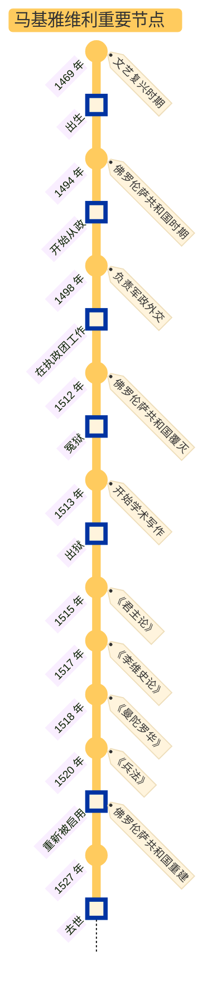

## 马基雅维利生平

### a) 时代/家庭/仕途

大背景：成长于和平的文艺复兴全盛时期

家庭：祖辈是佛罗伦萨贵族

学识：拉丁文、意大利古典文学、史学、罗马共和制度

政治主张：

- 由于经历了佛罗伦萨共和国的覆灭，深感雇佣军是意大利一切灾难的来源，因此主张：
  - 建立自己的政治秩序必须以自己的武装作为后盾 → 建立国民军
  - 军队与法律是立国之本
- 由于任职外交官，可以深入了解各国领袖：
  - 深感弱国无外交，富国必须强兵
  - 认可博尔贾为了努力建立一个强大统一的国家而不择手段的行事风格

潘光典（译者）评价马基雅维利：

> 除了时代的局限性和固有的阶级性之外，马基雅维利的思想往往趋于极端，带着某种片面性、夸张性，受着他个人的主观经验束缚与强烈的政治激情影响。但是他的建设国民军的基本目的，是为了建立一个统一的国家，排除外国的干涉与侵略，维护独立。这些主张是符合新兴阶级和人民的利益的，因此在历史上具有进步意义。

### b) 著作

马基雅维利的本意是希望撰写一本小册子，论述君主国是什么，有什么种类，怎样获得，怎样维持，以及为什么会丧失，据此献给朱利亚诺。然而他的愿望最终石沉大海，在失望中他仍然撰写了《李维史论》。本书围绕有关意大利兴亡的国家政治、军事、历史和宗教等方面的问题展开论述。《君主论》是《李维史论》的一个分支：

- 《君主论》讨论的是由于意大利腐败，内忧外患混乱状态不得不采取的**君主政体制**
- 《李维史论》则阐述以古罗马共和国制度为楷模的**共和制**

而《兵法》阐述军事与政治的密切关系，强调建立国民军的必要性，批判了城堡化的保守策略。

戏剧《曼陀罗华》是对腐朽社会道德的讽刺，也反映了作者对道德伦理和教会的态度，算是戏剧版的《君主论》。