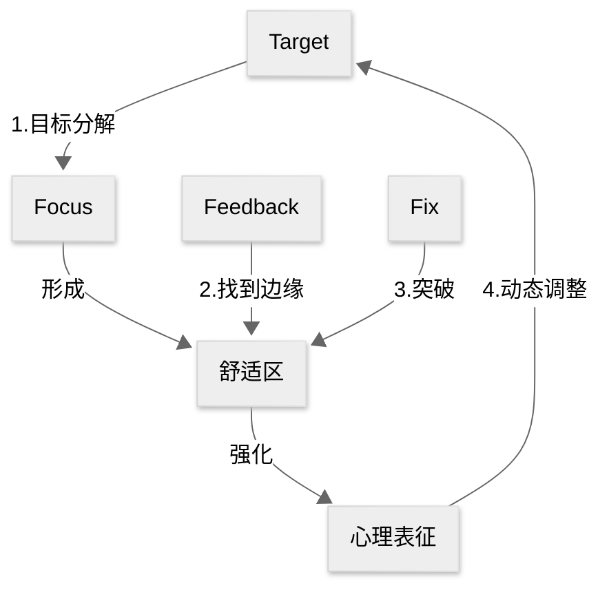

## 0. AI 导读

### i) 核心章节

本书的核心方法论是 **“获得幸福的 6 个技巧”**，它们构成了将冲突转化为亲密关系的完整流程。建议您将 80% 的阅读精力投入到详细阐述这六个技巧的 **第二部分 (第 4 章至第 9 章)** 中

| 章节    | 核心主题                               | 对应“获得幸福的 6 个技巧” | 核心价值（与锚点连接）                                       |
| ------- | -------------------------------------- | ------------------------- | ------------------------------------------------------------ |
| 第 4 章 | 唤醒渴望：发现需求，遵从本心           | 技巧 1：唤醒渴望          | 寻找根源： 引导读者穿透表象的“想要”（谬望），找到争吵背后未被满足的终身渴望（如被重视、被影响）。这与 NVC 的核心——“感受的根源源于自身需要”——高度契合 |
| 第 5 章 | 紧密互动：公平争吵、积极相处的七条规则 | 技巧 2：紧密互动          | 规则实践： 设定建设性争吵的规则（如 5:1 的积极/消极互动比例、各自承担 50% 责任）。指导如何进行创造性的紧密互动，避免“天启四骑士”式的破坏性行为 |
| 第 6 章 | 揭露问题：限制观念与未解心结           | 技巧 3：揭露问题          | 心理深潜： 揭示冲突根源：信念矩阵、内隐记忆和移情/投射。这是对《学会倾听》中移情和次人格概念的深度应用，指导读者识别谁在与你同床共枕——过去的父母或创伤 |
| 第 7 章 | 解放自我：摆脱思维与行为定式           | 技巧 4：解放自我          | 打破旧规： 采取行动挑战在第 6 章中发现的限制观念，通过“任务型生活方式”打破旧模式。强调解放自我需要勇气、冒险，而非仅仅是心理建设 |
| 第 8 章 | 重建矩阵：重塑思想，改造关系           | 技巧 5：重建矩阵          | 持久化： 利用大脑的神经可塑性，通过重复和有意识的练习（如执行意向）建立新的赋能观念和神经通路。争吵成为转变观念和修复裂痕的催化剂 |
| 第 9 章 | 坚持行动：致力于变成更好的我们         | 技巧 6：坚持行动          | 长期承诺： 强调终身致力于改变和成长。关键在于 “切断退路”（消除骑驴找马的幻想）和 “深度刻意练习”。这与您内向者 4P 法则中的“练习（Practice）”阶段相辅相成 |

### ii) 逻辑链

第一部分：亲密关系的真相——破解谜团和重建认知 (Ch. 1–3)

| 章节        | 逻辑功能                                                     | 关键概念                                                     |
| ----------- | ------------------------------------------------------------ | ------------------------------------------------------------ |
| **第 1 章** | **引入冲突的积极性**                                         | 争吵是值得的；介绍 **15 种基本争吵类型**。                   |
| **第 2 章** | **冲突的必然性**                                             | **爱情中的不和谐音**；冲突是为了生存；关系是持续的“分裂”和“重组”；引入家庭系统理论中的**差异化**（独立个性）。 |
| **第 3 章** | **打破童话迷思**                                             | **爱情迷思**（如“灵魂伴侣”/“相容性”）；只有爱是不够的；鼓励读者**抛开童话，进入森林**（冒险和面对未知）。 |
| **联系：**  | **认知重建：** 奠定基础——良性的冲突是必然的，且是成长的必需品，但必须摒弃传统的错误观念。 |                                                              |

第二部分：争吵的艺术——将冲突转变为幸福的 6 个技巧 (Ch. 4–9)

| 章节    | 逻辑功能                                                     | 关键概念                                                     |
| ------- | ------------------------------------------------------------ | ------------------------------------------------------------ |
| 第 4 章 | 找到争吵的动机                                               | 唤醒渴望：区分渴望（深层需求，如被爱、被重视）与谬望（表面需求，如让对方扣上牙膏盖）；渴望的位置（大脑满足中枢） |
| 第 5 章 | 建立行为规则                                                 | 紧密互动；建设性与破坏性互动比例（5:1）；天启四骑士（批评、轻蔑、防御、退缩）；50% 责任原则 |
| 第 6 章 | 挖掘心理根源                                                 | 揭露问题；信念矩阵（早期经验的程序）；移情和投射；互补法则；杏仁核劫持 |
| 第 7 章 | 开始行动转变                                                 | 解放自我；打破旧规则；通过采取与限制观念相反的行动来挑战旧矩阵；强调新鲜感和刺激 |
| 第 8 章 | 巩固和深化转变                                               | 重建矩阵；神经可塑性；情绪调谐（Attunement，互相理解内在状态）；修复裂痕（争吵后重建联系）；执行意向（“如果……就……”策略） |
| 第 9 章 | 持续与承诺                                                   | 坚持行动；切断退路；深度刻意练习；致力于变成最好的我们       |
| 联系：  | 方法论（核心）： 通过识别真正的渴望，设定公平争吵的规则，挖掘潜意识障碍，然后系统地、反复地重建大脑和行为模式，实现持久的个人和关系转变。 |                                                              |

第三部分：开放心胸，拓宽视野 (Ch. 10–12)

| 章节     | 逻辑功能                                                     | 关键概念                                                     |
| -------- | ------------------------------------------------------------ | ------------------------------------------------------------ |
| 第 10 章 | 独立与亲密                                                   | 情绪成熟；独立人格（从原生家庭脱离）；自主获取的亲密感；自我成长是亲密关系的前提 |
| 第 11 章 | 情绪管理与神经学                                             | 掌控情绪；情绪能力的四个方向（向内、向外、向上、向下）；表达而非压抑情绪；催产素（信任激素）在亲密接触中的作用 |
| 第 12 章 | 整体升华与愿景                                               | 好好吵架吧；争吵是追求浪漫的英雄征程；心灵战士（为目标和原则而战）；为关系构想远大愿景 |
| 联系：   | 应用与升华： 技巧的最终目的是培养成熟、独立的个体，他们能够在高层次的情感能力上进行互动，最终获得“深度生活”和“完美之爱”（Ultimate Love） |                                                              |

### iii) 重点概念

 **15 种基本争吵类型：** 作者总结了伴侣间常见的冲突表象，如“推卸责任”、“家务琐事”、“你总是/你从不”等。书中强调这些只是表面问题，核心在于潜藏的内在矛盾。

• **冲突是为了生存：** 进化科学和神经学表明，人类对失去关系（依恋）的恐惧会触发大脑中的痛觉区域，因此回避争吵是一种原始的生存恐惧。

• **爱情迷思：** 那些由童话、影视剧和文化灌输的错误观念，如“找到灵魂伴侣就能解决一切问题”、“化学反应很重要”或“真爱应该无往不利”。这些迷思是阻碍有效争吵和关系深化的主要障碍。

第二部分：争吵的艺术（核心技巧）

• **唤醒渴望（Awaken Desire）：** 引导我们发现藏在争吵表象（谬望）下的深层、普遍的**人类渴望**（如被重视、安全感、被理解）。争吵的目的是为了满足这些渴望。

• **5:1 比例：** 幸福伴侣在分歧时，积极互动与消极互动的比例约为 5:1。这表明冲突本身不可怕，关键在于**积极的联结要远远多于破坏性的互动**。

• **天启四骑士（Four Horsemen）：** 最具破坏性的四种互动方式：**批评、轻蔑、防御、退缩**。它们的出现预示着婚姻的破裂。

• **信念矩阵（Belief Matrix）与内隐记忆：** 构成我们潜意识观念、感受和行为模式的神经通路，形成于生命早期（缺乏语言能力前）。当下的争吵常常触发这些**内隐记忆**（储存在意识之外的感觉），使我们对伴侣的反应与当下事实不符。

• **移情与投射（Transference & Projection）：** 我们无意识地将童年时期重要关系中未解的情感和期待，投射到伴侣身上。被吸引是因为伴侣能激活我们的矩阵，他们是**“完美的冤家”**，能刺痛我们未解的心结。

• **杏仁核劫持（Amygdala Hijack）：** 失去理智的状态。当依恋关系受到威胁（依恋破裂）时，大脑杏仁核会分泌皮质醇和肾上腺素，触发“对抗—逃跑—呆滞”模式，使我们丧失逻辑推理能力。

• **执行意向（Implementation Intention）：** 一种重建矩阵的策略，通过使用 **“如果……就……”** 的句式，提前预想并在特定情境下采取新的、赋予力量的观念和行为。

• **切断退路：** 致力于改善的承诺要求伴侣不能再考虑“也许还有更好的人”或“如果我就这么走开”的模糊期望，必须全身心地投入到现有关系中。

第三部分：开放心胸，拓宽视野

• **情绪成熟与独立人格（Differentiation）：** 真正的亲密需要双方成为成熟、完整的独立个体，能够在保持独立性的同时，与伴侣在情感上保持联结。

• **情绪能力的四个方向：** 发展情绪的能力需要从四个维度着手：**向内**（感知和识别感受）、**向外**（负责任地表达）、**向上**（提升积极情绪和动力）、**向下**（自我安抚和调节紧张感）。

• **情绪调谐（Emotional Attunement）：** 深入地了解彼此的内在状态和情绪，并通过眼神、语调、身体接触等表达理解、关心和同情，从而促进彼此大脑神经通路重组。

• **英雄征程（Hero's Journey）：** 将良性争吵视为一场冒险。通过勇敢面对内心的阴影（怪物），才能发现亲密关系中的巨大财富（如勇气、力量、亲密感），最终实现自我发展和关系的蜕变

## 1. 刻意练习框架下的正确争吵

### Target

激发最好的自己，成为合适的伴侣，而非让伴侣做出改变

### Focus: 唤醒渴望

- 什么引发了争吵？
- 我在逃避什么？
- 争吵时爆发了什么？
- 争吵前后我的感受如何？
- 隐藏在争吵背后的渴望是什么？

### Feedback: 与伴侣分享渴望

对应紧密互动，具体做法有：

- 避免批评、轻蔑、防御、退缩（天启四骑士）
- 5:1 的积极/消极互动比例
- 双方各自承担 50% 责任

### Fix: 揭露问题 + 解放自我

我以前有这样的感受吗？哪些限制信念与之对应？它引发了我哪些未接心结？

- 移情/投射
- 内隐记忆/信念矩阵
- 判断此刻是否出现杏仁核劫持现象

我在做出改变之前，应该遵循哪些原则？

- 及时并经常争吵：不要谨言慎行，要把冲突展现出来，这样才能对其进行处理
- 每天谈论心情/渴望/恐惧/梦想
- 有话立刻说：人们常常在成功表达感受之后才知道自己在烦什么
- 给自己设置高标准
- 强调伴侣双方共同合作的重要性

### 心理表征

对应书中提到的信念矩阵 (Belief Matrix), 是关系的心理表征，而神经可塑性是这种表征的生物学基础

我们的信念矩阵是基于早期经历（内隐记忆）形成的神经通路，它支撑着我们潜意识中的观念和行为模式，这就是我们看待世界和关系、进行争吵的程序/心理模板

### 强化心理表征/动态调整：重建矩阵

我怎么做才能有不一样的表现？

- 执行意向
- 切断后路

### 价值预设

双方致力于自我成长，并对这段关系进行长期投入

这个预设并非要求伴侣一开始就必须是成熟的人，而是要求他们对成为最好的自己抱有坚定的**意愿和承诺**

成熟（情绪成熟、独立人格）是伴侣通过“为幸福而战”而获得的结果，而不是开始这段旅程的先决条件。但愿意承诺（Commitment）和勇于投入（Engagement）是启动这套系统的前提条件