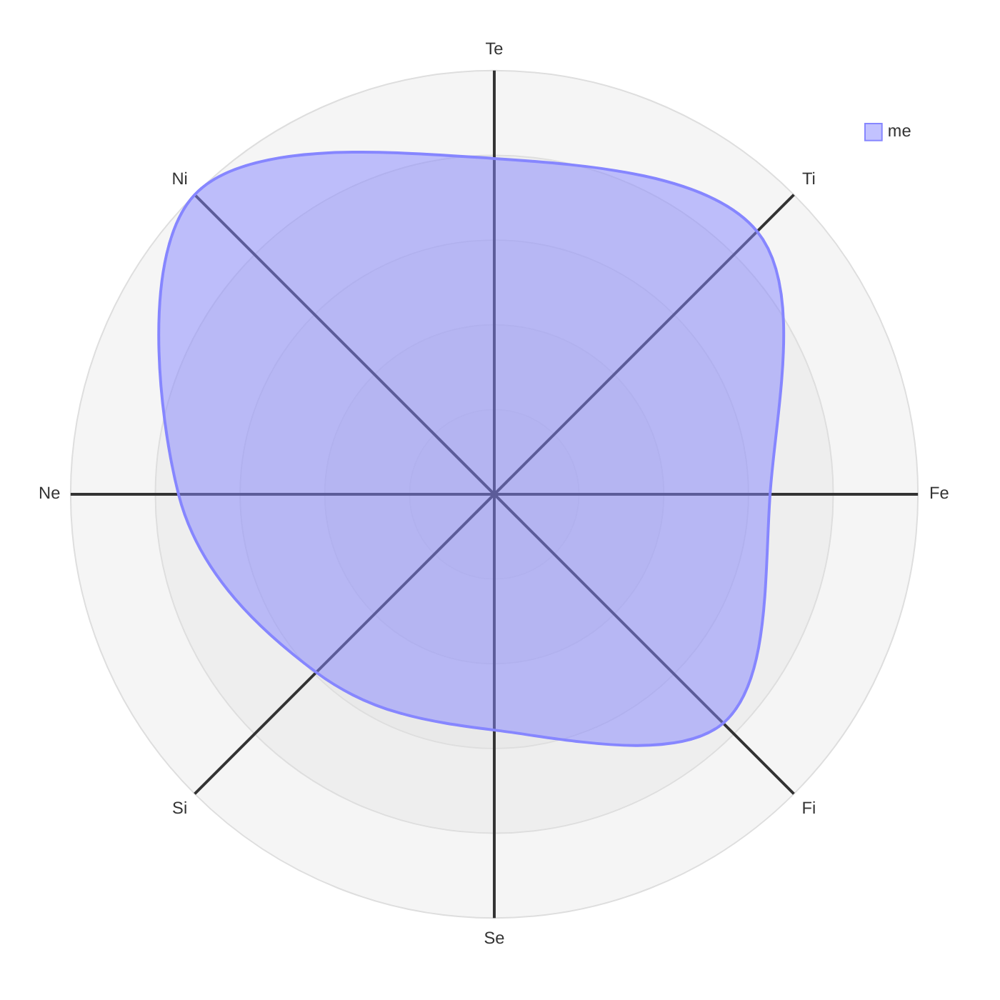

总结自 B 站 up 主 `小白价值投资` 的系列视频：INTJ 生活指南

鉴于我就是典型的 INTJ 人格，希望总结完这个系列可以对我的生活起到指导意义 

---

## INTJ 四个功能总览

|      | 全称     | 优先级   | 功能                       | 比喻          |
| ---- | -------- | -------- | -------------------------- | ------------- |
| NI   | 内倾直觉 | 主导     | 构建模型                   | 地图导航      |
| TE   | 外倾思维 | 主要辅助 | 执行力 + 行动力            | 油门 / 变速箱 |
| FI   | 内倾情感 | 次要辅助 | 自我审视 / 价值观          | 方向盘        |
| SE   | 外倾感觉 | 劣势     | 环境反馈 / 感官体验 / 休息 | 底盘 / 车轮   |

NI 的特点是预见性与洞察力——在头脑中构建一些东西，并将一些点奇妙的串联起来，构建一个模型，然后用这个模型预测未来

NI 更多的像是一个被动技能，很难靠主动练习提升，需要其他功能协同发展，从而实现积累

TE 决定了 INTJ 的下限——INTJ 常常因为眼高手低而缺乏行动力

## 我的八维测试结果（2026 年 3 月 13 日）

## INTJ 人生四大阶段

INTJ 的人生进阶过程大概如下所示：

- 阶段 1: NI-TI 循环 → 沉迷理论/抽象/计划而缺少行动/实践，眼高手低
- 阶段 2: NI-TE 循环 → 有所小成，例如高考取得满意分数/找到合适的工作环境
- 阶段 3: NI-TE 循环 + FI 筛选→ 明确三观，明确自己不追求什么，更知道自己追求什么，从而聚焦真正热爱、愿意长期投入的事情
- 阶段 4: NI-TE 循环 + FI 筛选 + SE → 懂得劳逸结合

**从阶段 1 到阶段 2：**

为了实现 NI-TE 循环，通常需要半年到一年的时间周期

up 给出的几条建议：

- 从整理房间这类不需要依赖 NI 的小事做起
- 从最简单的事情做起，可以得到实际成果和收获成就感
- 不要一次性做出一个完美的版本，可以先做一个 60 分的版本，在做的过程中，NI 会不断产生新的灵感

**从阶段 2 到阶段 3：**

在达成 1-2 个这样的目标后，可能会陷入瓶颈，通常表现为，自认为自己的行动力不足，从而行动过度

此时需要加入 FI 筛选机制，明确自己内心的价值目标，然后对比当前行动是否和自己的目标匹配，同时明确自己的兴趣爱好和天赋在哪里

这里的天赋并非绝对天赋，可以用经济学中的比较优势来理解——相比于其他领域，在这个方向上能有更高的投入产出比

另外，不要和别人比，更不要嫉妒别人，要和自己比

**从阶段 3 到阶段 4：**

up 主以足球比赛为例，20 岁的年轻球员踢 50 分钟就抽筋，而 30 岁老将可以踢完全场，靠的是阅读比赛节奏，该放松时就放松肌肉

同理，学会放松休息是 INTJ 从中阶迈向高阶的分水岭

遇到瓶颈不仅要明确方向，还要学会养精蓄锐，蓄势待发

## Fi 筛选方法论

方法论如下：

- 选择方向

  1. 明确自己不喜欢什么 + 不适合什么，接受自己的不完美和缺点 / 短板

  2. 使用 5/25 法则[^1]筛选方向，聚焦核心领域长期深耕
  3. 由于遵循内心选择，在行动初期可能与外界现实的反馈截然不同，为此可以使用内部积分卡[^2]

- 选择人：不要把时间和精力均分给所有人，不同的优先级应该赋予不同的权重

  1. 核心家人 + 高度同频者（伴侣 / 挚友）：他们往往可以接纳你真实的想法，在你钻牛角尖时指出来，是你的情感依靠
  2. 关系不错的朋友：有相同爱好/观点交集，或者在某一时间段内有深厚友谊，不一定要三观完全相符，可以做到求同存异
  3. 萍水相逢的点头之交：普通同事 / 一面之缘的人 / 社交场合偶然认识的人：维持表面和谐礼貌，顾全社交体面即可，不必投入较多情感，必要时保持适度互动
  4. 需要远离的人：蠢 / 坏 / 又蠢又坏[^3]

- 短期的安排：使用艾森豪威尔矩阵法

  - 容易忽视的是第三象限（重要不紧急），包括：维护伴侣/家人的情感关系、身体健康、核心技能储备。这类事情通常反馈机制比较弱，为此可以使用内部积分卡强化自己的反馈；如果近期反馈较强，可以奖励自己买一些东西等等，建立自己的奖励机制
  - 第二象限（紧急不重要）和第三象限（重要不紧急）是时间分配的关键，也最容易产生分类错误

- 自我

  - 了解自己的优点
  - 接纳自己的不完美

[^1]:  来自沃伦巴菲特：找到人生中最重要的 25 个目标，然后抛弃其中的 20 个目标，集中处理最重要的 5 个（符合二八关键少数法则）
[^2]:  来自沃伦巴菲特父亲：用内部的自我评分替代别人打分，衡量自己的行为是否符合内在价值观，而非迎合他人的期待
[^3]: 来自查理芒格：不要同一头猪在泥里摔跤，因为这样你会把全身弄脏，而猪会乐此不疲

## Se 篇

Ni 和 Se 是天然的对立面，INTJ 的 Ni 功能让其大脑一直处于工作状态

长时间的 Ni-Te 循环会让大脑宕机

此时需要建立 Ni-Se 循环，实现 work-life balance

up 主从两个方面来说明 INTJ 应该如何休息，分别是：

- 能量
  - 开源
    - 锻炼（让身体休息）：两个原则——适当锻炼 + 多元运动尝试
    - 冥想（让大脑休息）：尝试不要思考，专注十次呼吸；可以在工作间隙和碎片化时间进行呼吸训练
  - 节流[^4]
    - 躺平类：睡觉/休息
    - 娱乐类：旅游/看剧/看比赛
    - 信息类：利用 Ne 做非工作相关的额外信息补充
- 反馈：Se 弱导致 INTJ 在处理紧急情况时显得迟钝，甚至会产生畏惧心理
  - 建立 checklist[^5]
  - 接受不确定性[^6]

[^4]: 原则是要多元化进行节流，把边际效应递减原则应用于多巴胺分泌，刺激越单一，产生的多巴胺越少
[^5]:查理芒格
[^6]:斯多葛主义？

终极问题：我们应该如何度过一生？

up 主的答案是：为学日益，为道日损

我深以为然