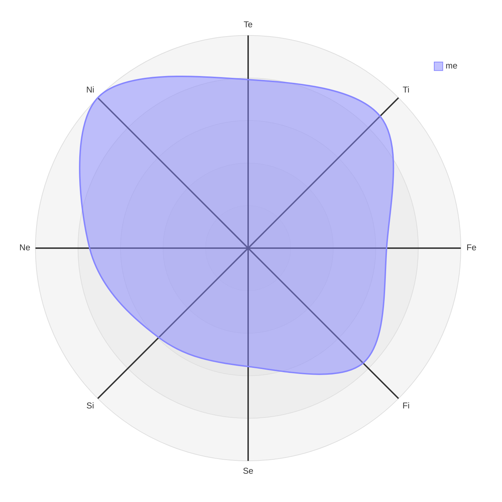

总结自 B 站 up 主 `小白价值投资` 的系列视频：INTJ 生活指南

鉴于我就是典型的 INTJ 人格，希望总结完这个系列可以对我的生活起到指导意义 

---

## INTJ 四个阳面功能总览

|      | 全称     | 优先级   | 功能                       | 比喻          |
| ---- | -------- | -------- | -------------------------- | ------------- |
| NI   | 内倾直觉 | 主导     | 构建模型                   | 地图导航      |
| TE   | 外倾思维 | 主要辅助 | 执行力 + 行动力            | 油门 / 变速箱 |
| FI   | 内倾情感 | 次要辅助 | 自我审视 / 价值观          | 方向盘        |
| SE   | 外倾感觉 | 劣势     | 环境反馈 / 感官体验 / 休息 | 底盘 / 车轮   |

NI 的特点是预见性与洞察力——在头脑中构建一些东西，并将一些点奇妙的串联起来，构建一个模型，然后用这个模型预测未来

NI 更多的像是一个被动技能，很难靠主动练习提升，需要其他功能协同发展，从而实现积累

TE 决定了 INTJ 的下限——INTJ 常常因为眼高手低而缺乏行动力

## 我的八维测试结果（2026 年 3 月 13 日）

## INTJ 人生四大阶段

INTJ 的人生进阶过程大概如下所示：

- 阶段 1: NI-TI 循环 → 沉迷理论/抽象/计划而缺少行动/实践，眼高手低
- 阶段 2: NI-TE 循环 → 有所小成，例如高考取得满意分数/找到合适的工作环境
- 阶段 3: NI-TE 循环 + FI 筛选→ 明确三观，明确自己不追求什么，更知道自己追求什么，从而聚焦真正热爱、愿意长期投入的事情
- 阶段 4: NI-TE 循环 + FI 筛选 + SE → 懂得劳逸结合

**从阶段 1 到阶段 2：**

为了实现 NI-TE 循环，通常需要半年到一年的时间周期

up 给出的几条建议：

- 从整理房间这类不需要依赖 NI 的小事做起
- 从最简单的事情做起，可以得到实际成果和收获成就感
- 不要一次性做出一个完美的版本，可以先做一个 60 分的版本，在做的过程中，NI 会不断产生新的灵感

**从阶段 2 到阶段 3：**

在达成 1-2 个这样的目标后，可能会陷入瓶颈，通常表现为，自认为自己的行动力不足，从而行动过度

此时需要加入 FI 筛选机制，明确自己内心的价值目标，然后对比当前行动是否和自己的目标匹配，同时明确自己的兴趣爱好和天赋在哪里

这里的天赋并非绝对天赋，可以用经济学中的比较优势来理解——相比于其他领域，在这个方向上能有更高的投入产出比

另外，不要和别人比，更不要嫉妒别人，要和自己比

**从阶段 3 到阶段 4：**

up 主以足球比赛为例，20 岁的年轻球员踢 50 分钟就抽筋，而 30 岁老将可以踢完全场，靠的是阅读比赛节奏，该放松时就放松肌肉

同理，学会放松休息是 INTJ 从中阶迈向高阶的分水岭

遇到瓶颈不仅要明确方向，还要学会养精蓄锐，蓄势待发

## Fi 篇

使用 Fi 筛选的方法论如下：

- 选择方向

  1. 明确自己不喜欢什么 + 不适合什么，接受自己的不完美和缺点 / 短板

  2. 使用 5/25 法则[^1]筛选方向，聚焦核心领域长期深耕
  3. 由于遵循内心选择，在行动初期可能与外界现实的反馈截然不同，为此可以使用内部积分卡[^2]

- 选择人：不要把时间和精力均分给所有人，不同的优先级应该赋予不同的权重

  1. 核心家人 + 高度同频者（伴侣 / 挚友）：他们往往可以接纳你真实的想法，在你钻牛角尖时指出来，是你的情感依靠
  2. 关系不错的朋友：有相同爱好/观点交集，或者在某一时间段内有深厚友谊，不一定要三观完全相符，可以做到求同存异
  3. 萍水相逢的点头之交：普通同事 / 一面之缘的人 / 社交场合偶然认识的人：维持表面和谐礼貌，顾全社交体面即可，不必投入较多情感，必要时保持适度互动
  4. 需要远离的人：蠢 / 坏 / 又蠢又坏[^3]

- 短期的安排：使用艾森豪威尔矩阵法

  - 容易忽视的是第三象限（重要不紧急），包括：维护伴侣/家人的情感关系、身体健康、核心技能储备。这类事情通常反馈机制比较弱，为此可以使用内部积分卡强化自己的反馈；如果近期反馈较强，可以奖励自己买一些东西等等，建立自己的奖励机制
  - 第二象限（紧急不重要）和第三象限（重要不紧急）是时间分配的关键，也最容易产生分类错误

- 自我

  - 了解自己的优点
  - 接纳自己的不完美

[^1]:  来自沃伦巴菲特：找到人生中最重要的 25 个目标，然后抛弃其中的 20 个目标，集中处理最重要的 5 个（符合二八关键少数法则）
[^2]:  来自沃伦巴菲特父亲：用内部的自我评分替代别人打分，衡量自己的行为是否符合内在价值观，而非迎合他人的期待
[^3]: 来自查理芒格：不要同一头猪在泥里摔跤，因为这样你会把全身弄脏，而猪会乐此不疲

## Se 篇

Ni 和 Se 是天然的对立面，INTJ 的 Ni 功能让其大脑一直处于工作状态

长时间的 Ni-Te 循环会让大脑宕机

此时需要建立 Ni-Se 循环，实现 work-life balance

up 主从两个方面来说明 INTJ 应该如何休息，分别是：

- 能量
  - 开源
    - 锻炼（让身体休息）：两个原则——适当锻炼 + 多元运动尝试
    - 冥想（让大脑休息）：尝试不要思考，专注十次呼吸；可以在工作间隙和碎片化时间进行呼吸训练
  - 节流[^4]
    - 躺平类：睡觉/休息
    - 娱乐类：旅游/看剧/看比赛
    - 信息类：利用 Ne 做非工作相关的额外信息补充
- 反馈：Se 弱导致 INTJ 在处理紧急情况时显得迟钝，甚至会产生畏惧心理
  - 建立 checklist[^5]
  - 接受不确定性[^6]

[^4]: 原则是要多元化进行节流，把边际效应递减原则应用于多巴胺分泌，刺激越单一，产生的多巴胺越少 → 我的批注：这里似乎可以形成一个 !q-多巴胺分泌和边际效应递减原则之间的关系
[^5]:我的批注：查理芒格在他的多元思维模型中也提到过
[^6]:我的批注：这似乎和斯多葛主义很像？

终极问题：我们应该如何度过一生？

up 主的答案是：为学日益，为道日损

我深以为然

## Ni 篇

Ni 是 INTJ 的主导功能，意味着 INTJ 的特点是弱化表象，擅长构建模型

up 主主要分享了一些工作和学习方面的内容

**在工作的初级阶段：**

- 先行动，等达到一个中等/基础水平后，再学习抽象理论

- 避免先想后做

**如何利用 Ni 收集灵感：**[^7]

1. 日常积累 
2. 收集 Ni 灵感碎片
3. 记录整理
4. 完成作品
5. 新的日常积累

[^7]: 我的批注：建立这个知识库也许就是我利用 Ni 收集灵感的一个具体体现

关于如何制作计划，up 主分为长期/中期/短期计划

**对于长期计划（大于 5 年的人生目标）：**

- Fi 功能实现人生愿景
- Ni 模拟可行性

**对于中期计划（3 个月左右）：**

- 通过 Te 把拆解愿景拆解成可落地的阶段性目标与步骤
- 长期目标通常不会改变，但是中期目标要根据实际情况不断优化调整

**对于短期计划：**

- 要聚焦当下可解决的具体问题，进行 Ni-Te 循环
  - Ni 调用资源/方法论/经验/模型
  - Te 拆解问题
- 引入 Ti 功能，用 Ti 进一步细化 Te
  - 优化逻辑
  - 提高执行效率
  - 明确优先级

**对于人际关系**，INTJ 容易只讲抽象概念/理论，从而让人觉得枯燥无聊

up 主给出的建议是，先讲实例/案例，再抽象成理论

对于不可避免的社交，可以从旁观者的角度，用 Ni 抓细节，然后使用 Fi 进行价值判断

此外，up 主提到了 Ni 的一个陷阱——跳过 Te, **陷入 Ni-Fi 循环**

所谓 Ni-Te 循环，又称为 13-loop

Ni 模拟过后直接与 Fi 做价值判断，从而导致内耗而不行动的恶行循环

出现这种循环的原因有两种：

1. Te 尚未形成
2. 当前不需要 Te 行动，例如睡前看书/视频，进而激发思考，最后失眠

针对第一点，up 主说，培养行动力的同时，也要避免矫枉过正，变成过度控制

因为有两种情况仅靠个人行动是无法改变的：

- 小概率事件
- 他人/群体

对此，up 主给出的建议[^8]有：

- 降低对自己和他人的期待
- 及时止损
- 接纳包容

[^8]: 我的批注：这里的第一点和第三点，似乎又对应上了斯多葛主义

最后，up 主提到了如何使用 Ni 不断进化——本质即**查理芒格的多元思维模型/能力圈**

所谓能力圈，就是你可以确定的东西

而能力圈之外，就是不确定的事物，例如投资

那么多元思维模型就是一套消除（或者至少是减少）不确定性的方法论/checklist

具体怎么实现？

1. 使用 Ti 从能力圈的圈内到达能力圈的边界，具体指的是梳理、整合知识，形成逻辑自洽的思维工具（checklist/模型/可复用的经验）
2. 使用 Ne 搜集各学科的核心知识，拓展认知/边缘
3. 使用 Te 突破边界
4. 不断逼近 Ni 锚定的长期目标

##  Ne 篇

Ni 和 Ne 的关系是：

- 共同点：跳过逻辑，直觉优先
- 不同点[^9]：
  - Ni 向内收束，聚焦长期趋势
  - Ne 向外拓展，捕捉不同事物的潜在关联

[^9]: 我的批注：这里似乎很像二八法则（对应 Ni）和长尾理论（对应 Ne）的关系

Ne 对于 INTJ 而言有两个帮助：

- 搜集信息，具体方法论为：
  1. 先关掉 Ni, 再开启 Ne
  2. 放下 Fi 执念，先接收信息，即使它当前是无用的：
     - 利用碎片化时间听播客/看微信公众号/看书[^10]
     - 找 ENTP/ENTJ 主动获取信息

- 人际交往，具体方法论为：
  1. 调用 Ne + Fe, 关闭 Ni + Fi
  2. 用 Ne 积累的话题多和他人闲聊，拉近和别人的距离，从而让自己工作时人际关系变好[^11]

[^10]: 我的批注：说起来大部分书都是我利用碎片时间看完的，尤其是文学类的书籍；然后利用整段的时间（例如周末/5-am project 提到的早起一小时）和 AI 对线，整理笔记
[^11]: 我的批注：这也算是一种潜在的复利效应吧

## Ti 篇

Ni 与 Ti 的区别在于：

- Ni 是 mont carlo 式的直觉
- Ti 是逻辑、科学

Te 与 Ti 的区别在于：

- Te 是粗线条、结果导向
- Ti 是细线条、逻辑导向

Ti 可能存在的陷阱有：

- 跳过 Te 出现 Ni-Ti 循环，即空想没有行动
- Ti 在批评位，多数情况下在他人用逻辑质疑自己时使用

使用 Ti 的方法论：

1. Ni - Te - Ti 三步走：
   - Ni 确定方向，Te 给框架，Ti 抓细节
   - 使用边界：工作和学习
2. Ne - Ti 循环（INTP 和 ENTP）：
   - Ne 收集零散信息（不同角度、方向），Ti 串联逻辑

如果把要做的事情分为三大类：

- A 类：不需要与人打交道的事情
- B 类：需要与人打交道的事情
- C 类：需要与人打交道且十份复杂的事情

对于 A 类，使用 Te + Ti 处理

对于 B 类，在沟通上使用 Ne - Ti 循环

对于 C 类，还是以 Ni - Te 循环为主，Ti 为辅

## Fe 篇

Fi 与 Fe 的关系：

- Fi 是 INTJ 的价值内核
- 在这一层内核之外，Fe 是实现和他人有效沟通的一种方式（ENFJ 社交面具）

Fe 主要作用于人际关系方面：

- 是敏锐感知他人和群体的情绪需求

- 用贴合环境和对方的方式表达情感

作用是：

- 维系人际和谐

- 凝聚群体力量

缺少 Fe 会导致：

- 初期和他人 磨合时间较长，从而导致做事效率降低
- 合作发展上限降低

使用 Fe 的方法论：

1. 关闭 Fi:
   - 个人喜好
   - 价值判断
   - 主观标准
2. 倾听，不用一直想着去指导别人什么
3. 使用 Ne - Fe 循环，闲聊八卦，了解不一样的视角
4. 对于过年聚会/公司大会，把自己当成人类观察员，去看各类人的人际关系，而非关注他们讲话的内容

## Si 篇

Si 是 INTJ 的第八功能（魔鬼功能），其定义/功能是：

- 记住细节，吸收经验 → 上次是怎么做的？细节如何？
- 处理具体而琐碎的现实信息

up 主对此的态度是，不要试图改进它，而应该被谨慎对待，隔绝管理

Si 与 Ni 的关系：

- 不是互补，而是对立
- Ni 与 Se 可以互补，但 Si 会和 Ni 竞争脑力资源

Si 容易造成的困境有：

- 忽视身体信号，进而导致慢性病
- 无法大量记忆无规律、无类别的东西（死记硬背）
- 容易后向解释：过度使用 Ni, 把过去的某件小事抽象化、概念化，但没有行动，从而内耗

如何弥补 Si 的不足：

- 用 Ni + Te + Ti + Se 战略性地取代 Si
  - 细节问题
  - 记忆问题
  - 健康问题
- 零碎的时间处理零碎的事情，整块的时间留给 Ni
- 制作 checklist

## INTJ 微生活指南