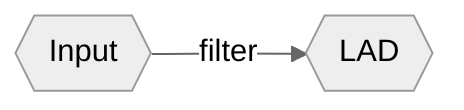

## 1. 观点梳理

Stephen Krashen 认为，习得语言的唯一途径，是在**低焦虑**环境中，获取**可理解性输入**（comprehensible input）。

>We acquire language in one way and only one way, when we get comprehensible input in a low anxiety environment.

首先，作者提出了可理解性输入的假设：只有理解了谈话内容（message），才能学习语言。可理解性输入的形式可以是：

- 实物教具
- 图片
- 知识/常识

借着这个假设，作者给出了一个重要推论（corollary）：

> Talking is not practicing.

作者以自己在纽约开设第二语言学习班的经历，告诉我们：

- 开口说话不是语言学习的第一步，而是所有可理解性输入积累的结果
- 说话的关键不在于你说了什么，而是对方回应了你什么

这两点的学术化表达是：交谈中真正有价值的是你从他人哪里获得的可理解性输入。

第二个重要推论是情感过滤假设（affective filter hypothesis）。

作者提出了限制语言学习的三个因素：

- 动机（Motivation）
- 自尊（Self-Esteem）
- 焦虑（Anxiety）

这三者的状态较低（尤其以焦虑为主）时，产生情感过滤：输入可以被从外界获得，但是无法传达到大脑中负责语言习得的那些区域——language acquisition device (LAD). 用图形表示为：

## 2. 批判性思考

### a) 同意

我们通常认为语言的学习要从四个维度进行：

- 听
- 说
- 读
- 写

而 Stephen Krashen 认为，从系统性的角度看待，有输入、学习和输出三部分内容。[Optimal Input](https://www.bilibili.com/video/BV1Hh411W7Bs/?spm_id_from=333.788.recommend_more_video.0&vd_source=bfb2e50dad8e670124c382656b85473e) 来自听和读，而说和写是语言学习的结果。

学习语言的最佳途径，是大量的阅读，尤其先从最简单的书籍开始。

### b) 质疑

