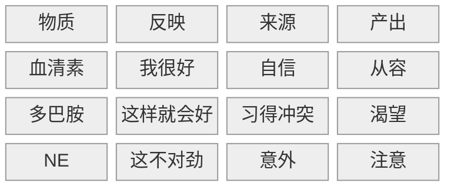

## 1. 观点梳理

> 一个注定失败，但是可能有用的尝试，系统化理解人性 →  Decode the Matrix

情绪受到三个单胺类物质影响：

- 血清素
  - 受四个维度影响，即[马斯洛需求层次理论](https://zh.wikipedia.org/zh-cn/%E9%A9%AC%E6%96%AF%E6%B4%9B%E9%9C%80%E6%B1%82%E5%B1%82%E6%AC%A1%E7%90%86%E8%AE%BA)
    - 阳光、饮食、睡眠、运动
    - 杏仁核：安全感
    - 催产素：亲密、归属
    - 睾酮：胜利、权位

- 多巴胺
  - 内啡肽是快感本身，而多巴胺是对快感的期待[^1]
  - 多巴胺是我们建立习惯的核心物质，也是造成上瘾行为的罪魁祸首[^2]

- 去甲肾上腺素 (NE)
  - 人在高度注意或者意外出现时产生 NE [^3]

[^1]: 即习得的过程
[^2]: 即贪、嗔、痴
[^3]: 其作用和肾上腺素相同，不同在于 NE 作用于大脑，肾上腺素作用于身体

这三种物质可以如下总结：

这三种物质组成了八种情绪，称为“三胺八情”：

| 情绪 | 血清素 | 多巴胺 |  NE  |
| :--: | :----: | :----: | :--: |
|  乐  |   高   |   高   |  高  |
|  安  |   高   |   低   |  低  |
|  怡  |   高   |   高   |  低  |
|  惊  |   高   |   低   |  高  |
|  怒  |   低   |   高   |  高  |
|  怯  |   低   |   高   |  低  |
|  惧  |   低   |   低   |  高  |
|  悲  |   低   |   低   |  低  |

然而这个模型过于理想化，原因有三：

1. 只给出了基础情绪，而忽略了认知系统（例如内疚、羞耻、后悔）
2. 二元化：每种神经递质只有高和低两种状态
3. 匹配方式分歧：
   1. 语言的模糊性：情绪无法用单一词汇描述
   2. 观测手段局限：目前无法有效测量不同情绪下对应的神经递质浓度

于是，作者给出了修正模型：

| 情绪   | 精神疾病 | 血清素 | 多巴胺 | NE   |
| :----: | :------: | :----: | :----: | :--: |
| 乐     |          | 高     | 高     | 高   |
| 安     |          | 高     | **中** | 低   |
| 怡 |          | 高     | 高     | 低   |
| （理想化的）惊 |          | 高     | **中** | 高   |
| 怒/慌     |  狂躁症  | 低     | 高     | 高   |
| 怯     |  拖延症  | 低     | 高     | 低   |
| 深层恐惧     |  焦虑症  | 低     | 低     | 高   |
| 悲     |  抑郁症  | 低     | 低     | 低   |

其中，准确度较高的情绪有：

- 乐
- 安
- 怡

由此可见，只要血清素高，对应的情绪就不可能是负面的。三胺都低会产生抑郁症已经是主流看法，而焦虑症和狂躁症也有较多理论支持。有论文认为，三胺并非互相独立，高血清素会抑制多巴胺与 NE. 因此，怯是否存在尚且存疑。但是作者出于工整性的考虑还是给出了这个情绪，对应拖延症。

作者还以创作喜剧的底层逻辑为例，解释了喜剧让人发笑的原因：

- 血清素对应优越论
- 多巴胺对应不协调论
- NE 对应反转

最后，作者认为，当你无法意识到三胺的存在时，你正在被它们控制；当你能意识到它们的存在时，你就可以控制它们，利用三胺成为更好的自己。

## 2. 批判性思考

### a) 同意

### b) 质疑