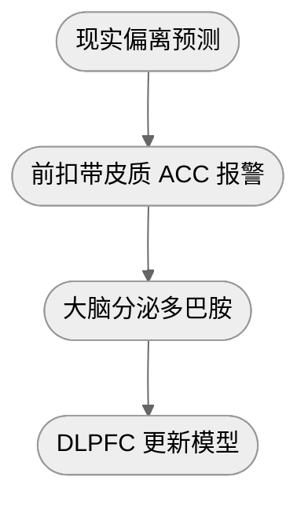
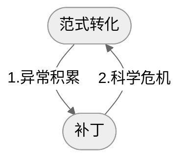

## 1. 观点梳理

### a) 智商 ≠ 认知

- 智商 = 特定模型下的运算能力
- 认知 = 建立模型的过程，从而理解、预测这个世界

### b) 认知系统的构成

- 符号：最底层元素
  - 是专有名词
  - 其意义由它所嵌入的整个意义网络决定
- 概念：多个符号类比形成
  - 学习任何一门学科，本质就是掌握这门学科的核心概念，以及他们之间的组织结构
- 命题：多个概念类比、扩张
- 认知：多个关联命题构成的模型

### c) 类比

可以看到，从符号到模型，类比作用于每一个层面

然而，类比仅仅是思维的起点，我们还需要现实的反馈：

- 概念生成 → 定义
- 命题推演 → 逻辑
- 模型适用 → 验证

### d) 范式转化

在[自由能](ref-人性矩阵系列-05-大脑.md)公式中，复杂度这一项可以拆分为两项：
$$
\begin{align}
自由能 &= 预测误差 + 复杂度 
    \\&= 预测误差 + 后验熵 - 先验损失
    \\&= 准确性 + 简洁性 - 保守性
\end{align}
$$
大脑具有保守性，其生物基础为：

放到整个社会发展的进程[^1]中，可以理解为：

[^1]: 来自《科学革命的结构》

### e) 思维偏误[^2]产生的原因

- 两个思想钢印：
  - 我很好 → 和血清素相关
  - 世界很公平 → 和杏仁核（道德公平）相关
- 元认知长期由系统一[^3]主导
  - 系统一：
    - 包括以下三点：
      - 思维惯性：来自于此前的环境和观念
      - 潜意识：来自于激素（多巴胺、睾酮、催产素 etc.）和思想钢印
      - 态度系统：高度简化的行动指南，来自于 VMPFC
    - 特点是快捷、节能、高效
    - 极致状态是心流，此时负责认知的 DLPFC 关闭
    - 缺点：一旦环境发生变化就会无法适应
  - 系统二：认知模型
- 安抚机制
  - 通过抱怨/自怜的形式短暂安抚 ACC, 从而逃避xian'shi

[^3]: 来自《思考，快与慢》
[^2]: 来自《清晰思考的艺术》

## 2. 批判性思考

### a) 同意

### b) 质疑

