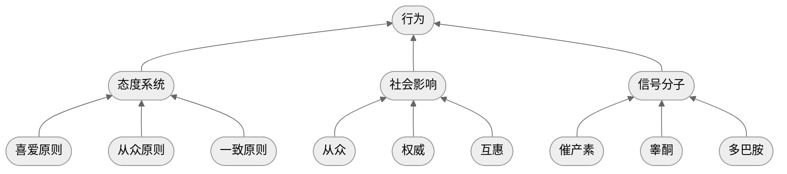

## 1.观点梳理

### a) 什么是态度？

根据上一期提到的认知系统中的最小单位——符号，我们可以说，态度系统是映射在符号上的好坏判断

由此，可以引出符号在态度系统和认知系统中的生物学基础：

| 符号     | 一致性依据         | 大脑信号 |
| -------- | ------------------ | -------- |
| 态度系统 | （无逻辑的）一致性 | VMPFC    |
| 认知系统 | 逻辑一致性         | DLPFC    |

### b) 态度系统的规律

根据《影响力》一书，态度系统符合三个原则：

- 喜爱原则：与临近符号保持一致
  - 行为表现：选择/逃避
  - 功能：反应模式
- 从众原则：与群体保持一致[^1]
  - 行为表现：支持/反对
  - 功能：敌我识别器
- 一致原则：与过往行为保持一致
  - 表现为行为和态度互相影响，见津巴多：《态度改变与社会影响》

[^1]: 根本性的思想改变总是伴随着群体归属感的转变，改变态度 = 改变群体认同

### c) 如何说服他人？

- 能不说服，就不说服[^2]
- 先同步，再影响[^3]
- 先行为，再归因[^4]

[^2]: 最好的说服是：你说出了我想说的话
[^3]: 同步的意思就是尽量先和他人的保持一致，避免他人触发敌对识别器
[^4]: 绕开态度，直接影响他人的行为。行为发生后，让他人自己找到与行为一致的态度理由

### d) 影响行为的因素

根据津巴多：《态度改变与社会影响》一书，人总是先行为再归因，那么哪些因素在潜意识中会影响行为呢？

当行为被追问理由，归因系统被激活，反过来调整态度系统，进而塑造自我认知

### e) 总结

在原始采集社会，态度系统可以很好的给出反应，识别敌我，强化群体边界；

在现代社会，由于态度系统和认知系统经常混杂在一起，会导致很多冲突与荒谬：

- 观点碰撞 → 立场对轰
- 路线之争 → 派系之争

因此，我们要实事求是，回到问题和现实本身，弱化态度系统的干扰，这样才能：

- 减少对立 → 通向团结
- 深化认知系统，从而产生更深刻的理解

佛家所谓“不二”，即消除分别心，指的是在认知上理解差异的同时，不执着于它们带来的好与坏：

- 把所有词汇当作中性词
- 不要想着赢得争论，而去考虑如何获得成长

## 2. 批判性思维

