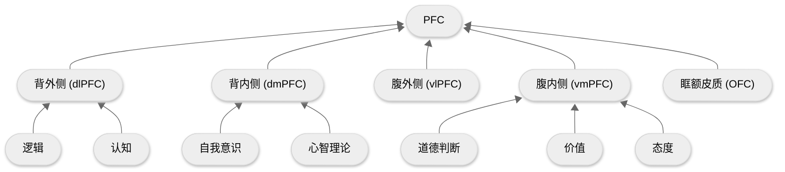

## 1.观点梳理

### a) 什么是公共知识 (Common Knowledge)?

- 公共知识[^1] ≠ 每个人知识的总和
- 公共知识 = 无限递归[^2]的知识状态
- 公共知识独立于每个人内心存在

[^1]: 注意与另一种公共基础知识做区分：包括政治、法律、经济、管理、历史、地理、科技等在内的综合性知识考试科目
[^2]: 群体中的每个人不仅知道某个事实，而且知道其他人也知道这个事实，并且其他人知道其他人也知道……以此类推到无限层级

### b) 大脑是如何处理公共知识的？

首先要了解前额叶皮质 (Prefrontal Cortex), 简称 PFC

PFC 位于大脑皮层，负责理性认识与决策

PFC 的主要组成如下：

其中，和公共知识相关的部分是心智理论 (Theory of Mind), 又称为他心理论，即一个人理解他人内心状态的能力，这是社会认知的基础，由此诞生了同情、合作、欺骗、道德判断等复杂行为

可以说，为了简化他人的内心世界， dmPFC 在大脑中单开了一个模拟器进行模拟：

| 心智理论维度          |      | 模拟他人的 |
| --------------------- | ---- | ---------- |
| 理解他人知道什么      | →    | 信念       |
| 理解他人喜欢/厌恶什么 | →    | 态度       |
| 理解他人想要什么      | →    | 意图       |
| 理解他人认同什么      | →    | 道德       |

公共知识可以被视为一种高阶的心智理论，是模拟器中的模拟器，在这个公共的舞台上，存放着：

- 公共的信念
- 公共的态度
- 公共的道德
- 公共的欲望

在[态度](ref-人性矩阵系列-07-态度.md)中提到过：

> 自我的态度与群体态度保持一致

这里的群体即公共知识范畴下的态度，由此可以推而广之：

| 心智理论（自我） |      | 公共知识（群体） |
| ---------------- | ---- | ---------------- |
| 态度             | →    | 意识形态         |
| 欲望             | →    | 货币             |
| 道德             | →    | 法律             |

### c) 为何群体总是不理性？

了解了公共知识的概念之后，作者进而试图解释勒庞提出的问题：为何群体总是不理性？

在《乌合之众》一书中，勒庞提出：

> 群体总是情绪化的，只能接受简单鲜明的观念，几乎没有能力容纳复杂而细腻的理解

由于认知的提升很困难，但态度的同步极快

这就导致**在群体中大多缺乏必要的公共知识，而符号/态度系统会迅速成为主导**

更进一步，勒庞定义了异质群体：

> 越是临时构成且成分复杂的群体，越容易极端化和情绪化

一个很好的例子就是热搜话题广场，大多成为二极管思维的互撕现场

相反，同质共同体[^3]的一个例子就是学术共同体：只要在论文中给出引用，便可以将理解的义务甩给读者

[^3]: 所以说，义务教育是很必要的，它保证了公共知识的下限

### d) 公共知识是如何存在以及改变的？

公共知识通过语言公之于众，输入到公共符号的秩序之中

而媒体（广播、报纸、电视、网络）是语言的重要传播形式

只有改变在公共场域的信息，才能影响公共知识[^4]的运行

[^4]: 作者类比拉康的他者，称其为大他者

### e) 共同体

不论是国家、公司还是组织，这些共同体的背后是依靠想象而构建的公共知识，是隐形的秩序

共同体依靠义务教育和媒介发展，具有同时性[^5]

[^5]: 即使人与人互相陌生，但由于媒介的发展，让不同地区的人们身处同一个公共广场，从而产生同步的信息体验

智人与其它生物最大的不同在于，智人会讲故事并相信那些不存在的东西

正是这些想象，构成了各种各样的共同体

## 2. 批判性思维
