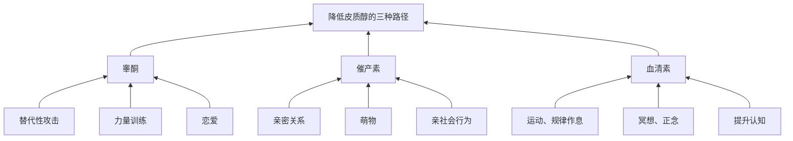

## 1. 观点梳理

### a) 皮质醇的基本概念 

按照时间维度，可以列出下面的矩阵：

| 时间 | 来源 | 感受 | 三胺  |
|----|----|----|-----|
| 短期 | 危险 | 恐慌 | 低高高 |
| 长期 | 压力 | 压力 | 低低高 |

### b) 皮质醇的直接影响

- 免疫系统抑制
- 代谢下降，肥胖上升
- 心血管损伤
- 消化系统损害

### c) 皮质醇的间接影响

性腺压制：

- 肌肉流失、骨质酥松
- 皮肤老化
- 生殖系统障碍[^1]

[^1]: 男性精子质量下降；女性月经失调

大脑改变：

- 记忆力下降 → 记忆中枢
- 难以专注、拖延 → 理性中枢
- 降低动力 → 奖励系统
- 激活杏仁核 → 更加焦虑

### d) 皮质醇的作用

短期：

- 提高警觉：NE 上升
- 保证功能：升高血压和血糖
- 节能：抑制耗能系统[^2]

[^2]: 包括免疫系统、消化系统、生殖系统、肌肉合成、记忆合成等

长期：造成焦虑

社会影响：是社会地位的生理映射，约等于反向睾酮

### e) 如何降低皮质醇？

三种路径可以降低皮质醇：

### f) 如何迈出提升认知的第一步？

把内心中焦虑的对象明确地拆解出来 → 具体化

| 是什么 | 怎么做  | 为什么     |
|-----|------|---------|
| 勇气  | 具体化  | 改变可以改变的 |
| 从容  | 冥想正念 | 接受无法改变的 |
| 智慧  | 提升认知 | 分辨以上两者  |

## 2. 批判性思维
