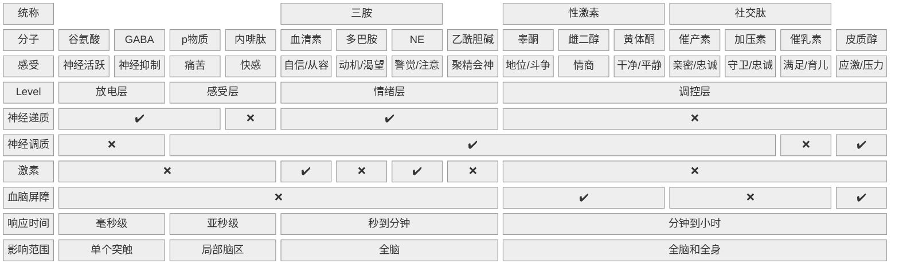

## 1. 观点梳理

### a) 神经递质、神经调质、激素和血脑屏障分别是什么？

|      | 神经递质              | 神经调制           | 激素      |
| ---- | ----------------- | -------------- | ------- |
|      | Neurotransmitters | Neuromodulator | Hormone |
| 传播途径 | 神经元               | 神经系统           | 血液      |
| 传播位置 | 大脑                | 大脑             | 身体      |
| 传播范围 | 小                 | 大              | 大       |
血脑屏障，顾名思义，就是血液和大脑之间的一道屏障

屏障之内，只能在大脑内传播；屏障之外，可以在血液流动

大多数激素、抗体无法通过血脑屏障

咖啡、酒精等小分子可以通过

### b) 谷氨酸和 GABA

谷氨酸对应神经活跃，影响因素有：

- 睡眠
- 外部刺激
- 兴奋剂

GABA 对应神经抑制，影响因素有：

- 放松活动
	- 瑜伽
	- 冥想
- 睡眠
- 有氧运动
- 酒精
- 碳水化合物 （胰岛素升高会促进 GABA）
- 安定、麻醉剂

谷氨酸和 GABA 互相拮抗

### c) p 物质和内啡肽

p 物质对应痛苦，影响因素有：

- 损伤、炎症
- 精神创伤

内啡肽对应快感，影响因素有：

- 性
- 食物
- 巅峰情绪体验
	- 心流
	- 大笑
	- 深度共鸣
- 外部镇痛
	- Runner's high
	- 辣椒素
	- 分娩

p 物质和内啡肽互相拮抗
## 2. 批判性思维

笔记链接如下：

- [加压素 + 催产素](ref-人性矩阵系列-02-催产素.md)
- [催乳素 + 睾酮](ref-人性矩阵系列-03-睾酮.md)
- [雌二醇 + 黄体酮](ref-人性矩阵系列-矩阵之外-02-雌激素和孕激素.md)
- [皮质醇](ref-人性矩阵系列-矩阵之外-01-皮质醇.md)
- [血清素 + 多巴胺 + NE](ref-人性矩阵系列-04-情绪.md)
- [内啡肽 + p 物质 + 乙酰胆碱](ref-人性矩阵系列-05-大脑.md)