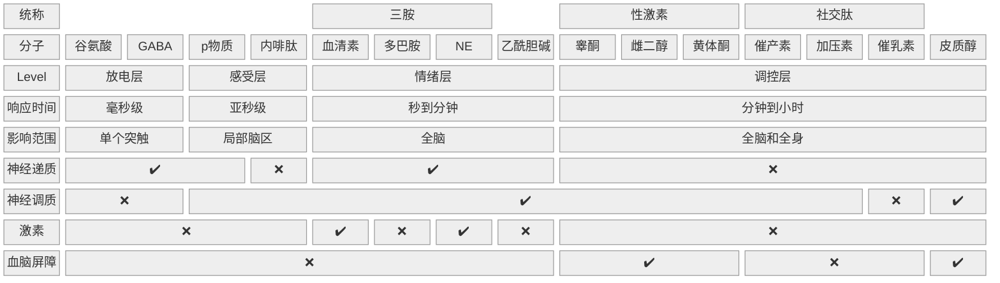

---
date:
source: https://www.youtube.com/watch?v=sgCZlmhMhE0
---

```mermaid
---
config:
  theme: neutral
  look: 
---

block-beta
columns 16

统称 space:2 space:2 三胺:3 space 性激素:3 社交肽:3 space

分子 谷氨酸 GABA p物质 内啡肽 血清素 多巴胺 NE 乙酰胆碱 睾酮 雌二醇 黄体酮 催产素 加压素 催乳素 皮质醇

Level 放电层:2 感受层:2 情绪层:4 调控层:7

响应时间 毫秒级:2 亚秒级:2 秒到分钟:4 分钟到小时:7

影响范围 单个突触:2 局部脑区:2 全脑:4 全脑和全身:7

神经递质 ✔️:3 ❌ a["✔️"]:4 b["❌"]:7 

神经调质 c["❌"]:2 d["✔️"]:11 e["❌"] f["✔️"]

激素 g["❌"]:4 h["✔️"] i["❌"] j["✔️"] k["❌"] l["❌"]:7 

血脑屏障 m["❌"]:8 o["✔️"]:3 p["❌"]:3 q["✔️"]

```

## 1. 观点梳理

### a) 神经递质、神经调质、激素和血脑屏障分别是什么？

### b) 谷氨酸和 GABA

### c) p 物质和内啡肽

## 2. 批判性思维
