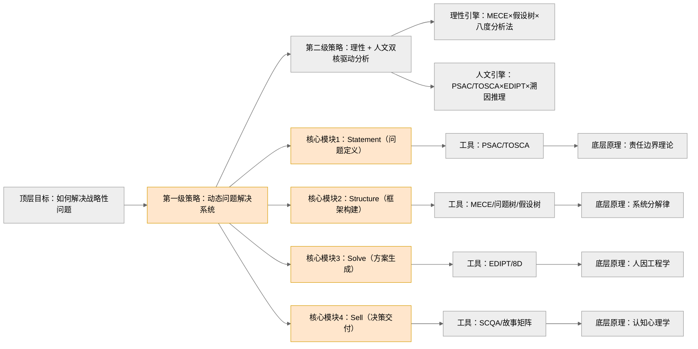

# ref
## 1. 核心思想

通过**结构化工具**（MECE/假设树）和动态迭代机制（4S模型），将复杂问题拆解为**可验证的子问题**，结合**设计思维**解决**战略性问题**。

## 2. 核心概念

### PSAC

- Why?
  - 解决咨询问题类的战略问题

- How?
  - 以假设为驱动，对假设进行测试和验证
    - 方法：假设金字塔
    - 缺点：先入为主，存在证实性偏差 (confirmation bias)

  - 以问题为驱动，以系统化的角度审视问题的不同方面，对解决方案不带任何预设的想法拆解问题
    - 方法：问题树
    - 缺点：无法保证拆解后的问题能够得到解决

  - 设计思维
    - 方法：观察产品对客户的体验，然后把观察转变为洞察 (insight)，将洞察转变为能改变人生的产品和服务
    - 缺点：未提及

- What?
  - Problem-Solving Approach of Consulting
  - 源自于麦肯锡公司 (McKinsey & Company) 开发并完善形成，其基础建立在笛卡尔的《方法论》原则之上的一套方法论

### 溯因推理

- Why?
  - 如何设计出满足用户需求的产品？
- How?
  - 设计思维
- What?
  - 利用有限的观察结果为数据生成最合理、最简洁的解释
  - 这种解释可能并不正确，必须经过检验和论证
  - 验证形式为原型迭代

### 设计思维

- Why?

  - 满足溯因推理的前提
  - 问题较为复杂，需要从多个维度考虑
  - 很难对问题进行精准陈述

- How? 

  - 发散与收敛
    - 发散思维可以在每个阶段创造大量可供选择的选项
    - 收敛则要求设计人员在大量选项中做出选择
  - 具体与抽象
    - 定量收集信息
    - 定性分析信息
  - 迭代与协作
    - 解决方案的形成是非线性的，需要不断迭代更新
    - 解决方案的形成需要跨学科协作
  - 创造力与包容度
    - 解决问题需要创造力
    - 面对失败需要拥有包容度

- What? (EDIPT)

  设计思维不是线性的，要**时刻准备迭代**！

  1. 设计思维是对人的需求进行观察和挖掘，最终形成共情 (**Empathize**)：
     - 观察
       - 了解用户的实际行为
     - 互动：与用户交互，从而捕捉用户的行为方式、想法和感受
       - 在用户遇到问题的实际环境中观察
       - 倾听用户意见
       - 体验用户用以解决问题的产品
     - 沉浸
       - 让自己成为一名用户，亲自体验并使用产品
       - 与极端用户共情：
         - 目标产品的专家级用户和从未使用该产品的人群
         - 因约束条件而在使用产品时受阻的人
         - 产品的狂热爱好者与批评者
         - 每天高强度使用产品的人和拒绝使用的人
  2. 并将这种观察和挖掘置于问题解决过程的核心 (**Define**):
     - 使用**共情地图（用户画像） / 行程地图 / 洞察卡**等工具，对单独的数据进行处理
     - 对定量的数据进行定性分析，从而将结构化的数据提炼成关于用户问题的一致理解  
       a. 归纳用户的**需求**：情感/实体上的需要与欲望，用动词形式表达出用户需要帮助的地方  
       b. 找到需求背后的**洞察**：关于用户行为、思考或感受的深度认知  
       c. 总结所有的需求和洞察，形成**设计规则**
     - 定义**视角陈述**：「用户」需要「需求」，因为「洞察」。
     - 对视角陈述进行「怎样才能」的提问，形成问题陈述
  3. 设计思维提倡设计人员对解决方案进行迭代测试，将他们对遇到问题的人（即用户）的了解转化成为解决方案中对用户喜好的明确判断，进而开发出潜在的解决方案 (**Ideate**)：
     - 生成不同解决方案概念，注重数量和多样性，不用考虑质量：
       1.  类比思维
       2.  头脑风暴
       3.  形态分析
       4.  SCAPER 问题清单
     - 利用结构化评估过程进行收敛
       1.  指标：设计标准/可落实性/可行性
       2.  请同行发表看法
  4. 然后将其转换为原型 (**Prototype**)
  5. 这套原型要能够利用来自解决方案实施者的反馈进行**迭代**测试 (**Test**)：
     - 明确测试内容
     - 选择正确的测试环境和测试对象
     - 收集反馈
     - 反思结果

### TOSCA 框架

- Why?
  - 如何使用演绎推理做出假设并拆分问题？
- How?
  - 假设金字塔
  - 问题树
- What?
  - Trouble: 期望与结果/愿望与现实之间的差距
    - 不接受我们无法解决的抱怨
    - 不要先入为主地让自己个人的想法/理解渗入对麻烦的定义中
    - 提问“为什么是现在出现”
  - Owner: 找出谁应该对 Trouble 负责（参考 [RACI](https://www.atlassian.com/zh/work-management/project-management/raci-chart "RACI") 矩阵中的负责人）），其意义在于
    - 其身份塑造了解决方案的空间
    - 指明了问题定义的方向
    - 在不断的迭代中不断评判解决方案的好坏
  - Success Criteria: 
    - 描述出成功应有的样子
    - 成功发生在什么时候（例如项目管理中的 SMART 原则）
    - 成功是否包含明确的可量化目标
  - Constraints: 找出 Owner 面临的约束是什么，又该如何权衡，主要分为三类
    - 对 Success Criteria 的约束，即该问题与其他问题/目标/承诺/KPI 的冲突
    - Owner 资源和能力的约束
    - 时间/预算/技能/保密的约束
  - Actors: 参考 [RACI](https://www.atlassian.com/zh/work-management/project-management/raci-chart "RACI") 矩阵中的知情人/咨询者/执行者
    - 按照支持态度，Actors 可分为支持者/中立者/反对者
    - 我们要特别留意潜在的反对者

### MECE 拆分问题

将一个问题拆分成若干个必要条件的子问题，每一个子问题要满足：

- 相互独立 (Mutual Exclusivity)：即相互之间不能有重叠
- 完全穷尽 (Collective Exhaustiveness)：加总为一体即为充分条件

### SCQA 表达结构

- What?
  - 情景 (Situation)
  - 冲突 (Complication)
  - 疑问 (Question)
  - 解答(Answer)
- How?
  - 设计小故事：
    - 带入背景
    - 引出矛盾
  - 表达小启发：
    - 点出问题
    - 表达核心
- Why?
  - 在使用金字塔原理展示战略问题的解决方案是，如何做到开门见山地引出核心论点点题，提高表达质量？

## 3. 主题归档

类型：

- 设计思维
- 问题解决

关联领域：

- 系统思维
- 认知心理学
- 博弈论

## 4. 全书框架梳理

见 6.观点提炼

## 5. 写作动机

问题意识：如何解决战略性问题

现实意义：企业 90% 战略失败源于错误问题定义

## 6. 观点提炼

## 7. 批判性思考

### a) 作者背景

- 伯克利哈斯商学院教授 
- 麦肯锡前合伙人

### b) 政治倾向

### c) 价值预设

1. 工程化思维：所有问题均可结构化
2. 批判经验主义：理性分析优于直觉判断
3. 弱化行业特异性：强调工具普适性

# note
## PSAC

解决咨询问题的思路思路：Problem-Solving Approach of Consulting

适用于解决**战略问题**，由麦肯锡公司 (McKinsey & Company) 开发并完善形成，其基础建立在笛卡尔的《方法论》原则之上。

问题解决方法的形式：

- 以假设为驱动
- 以问题为驱动
- 设计思维

以假设为驱动的思路，是从关于解决方案可能是什么的一个假设起步，对其进行测试和验证的过程。为此，我们使用假设树来实现。其缺点是先入为主，难免让我们掉入采用潜在的解决方案陷阱，学名叫做**证实性偏差** (confirmation bias)，即一旦找到能证实假设的证据，便更有可能会相信它们，而非寻找与假设相悖的证据。

以问题为驱动的思路，是将问题拆分成由小元素（即模块：关于典型重复性商业问题的一套已拆分出来的元素，并已预先包装完成）组成的**问题树**，从而对问题进行全面建构，以系统化的角度来审视问题的不同方面，对解决方案不带任何预设的想法，从而避免掉进采用潜在解决方案的陷阱。其局限性是，使用问题树尽管能拆分问题，但无法保证所有拆分后的问题能够得到解决。同时，使用问题树所需要的分析工作比假设金字塔更多。

设计思维关注的是人们对人工制造出来的物品所产生的体验，因为这些物品代表的是问题解决方案。从最基本的层面来看，问题的存在表面人们的需求和欲望并没有得到满足，表明现有解决方案没能满足人们的需要。设计思维的使命，是将观察转变为洞察 (insight)，将洞察转变为能改变人生的产品和服务。

## 溯因推理

溯因推理就是我们利用有限的观察结果为数据生成最合理、最简洁的解释。这种解释可能并不正确，必须经过检验和论证。运用设计思维的人们，会压制它们自身对问题的假设，利用在观察用户的过程中产生的理解，来提出有关解决方案的假设。随后，人们会以原型的形式对这些假设进行迭代测试，使其收敛为最合适的解决方案。

设计的关注点在于事物应该是怎样的，如何设计出人工制品来满足需求。设计人员构思出一套行动方案，刻意创造出全新的人工制品作为解决方案，将现有的情景转变为理想之中的情境。对于每一个需要解决的问题，都存在一个需要设计出来的解决方案。

## 设计思维 (Design Thinking)

### #1 什么是设计思维

[哔哩哔哩：一个案例看懂什么是设计思维（Design Thinking）](https://www.bilibili.com/video/BV1vu41127dR/?spm_id_from=333.337.search-card.all.click&vd_source=bfb2e50dad8e670124c382656b85473e "哔哩哔哩：一个案例看懂什么是设计思维（Design Thinking）")

设计思维是对人的需求进行观察和挖掘 (**Empathize**)，并将这种观察和挖掘置于问题解决过程的核心 (**Define**)。设计思维提倡设计人员对解决方案进行迭代测试，将他们对遇到问题的人（即用户）的了解转化成为解决方案中对用户喜好的明确判断，进而开发出潜在的解决方案 (**Ideate**)，然后将其转换为原型 (**Prototype**)。这套原型要能够利用来自解决方案实施者的反馈进行迭代测试 (**Test**)。

设计思维不是线性的，要时刻准备迭代！

#### 阶段 1：共情

共情的方法

- 观察
  - 了解用户的实际行为
- 互动：与用户交互，从而捕捉用户的行为方式、想法和感受
  - 在用户遇到问题的实际环境中观察
  - 倾听用户意见
  - 体验用户用以解决问题的产品
- 沉浸
  - 让自己成为一名用户，亲自体验并使用产品
  - 与极端用户共情：
    - 目标产品的专家级用户和从未使用该产品的人群
    - 因约束条件而在使用产品时受阻的人
    - 产品的狂热爱好者与批评者
    - 每天高强度使用产品的人和拒绝使用的人

#### 阶段 2：定义

定义阶段要求设计人员：

1.  使用**共情地图（用户画像） / 行程地图 / 洞察卡**等工具，对单独的数据进行处理
2.  对定量的数据进行定性分析，从而将结构化的数据提炼成关于用户问题的一致理解  
    a. 归纳用户的**需求**：情感/实体上的需要与欲望，用动词形式表达出用户需要帮助的地方  
    b. 找到需求背后的**洞察**：关于用户行为、思考或感受的深度认知  
    c. 总结所有的需求和洞察，形成**设计规则**
3.  定义**视角陈述**：「用户」需要「需求」，因为「洞察」。
4.  对视角陈述进行「怎样才能」的提问，形成问题陈述

#### 阶段 3：构思

构思的步骤：

1.  生成不同解决方案概念，注重数量和多样性，不用考虑质量：
    1.  类比思维
    2.  头脑风暴
    3.  形态分析
    4.  SCAPER 问题清单
2.  利用结构化评估过程进行收敛
    1.  指标：设计标准/可落实性/可行性
    2.  请同行发表看法

指导方针：

- 团队多样化
- 延迟判断
- 追求数量

#### 阶段 4：原型

将构思转化为实体，为用户创建解决方案的近似物，从而达到学习、管理风险和沟通的目的。

#### 阶段 5：测试

- 明确测试内容
- 如何测试
  - 选择正确的测试环境和测试对象
  - 收集反馈
  - 反思结果

### #2 什么时候适合使用设计思维

- 解决方案是为人而设计并供人使用的
- 问题较为复杂，需要从多个维度考虑
- 很难精准地进行问题陈述

### #3 设计思维的核心特征

- 发散与收敛
  - 发散思维可以在每个阶段创造大量可供选择的选项
  - 收敛则要求设计人员在大量选项中做出选择
- 具体与抽象
  - 定量收集信息
  - 定性分析信息
- 迭代与协作
  - 解决方案的形成是非线性的，需要不断迭代更新
  - 解决方案的形成需要跨学科协作
- 创造力与包容度
  - 解决问题需要创造力
  - 面对失败需要拥有包容度

## TOSCA 框架

TOSCA 是以下单词的首字母缩写：

- Trouble
- Owner
- Success Criteria
- Constraints
- Actors

在问题陈述阶段，我们需要考虑以上几点，从而使核心问题呈现出来。

**Trouble** 是期望与结果/愿望与现实之间的差距。为了能够阐述明白 Trouble，可以从以下三点考虑：

- 不接受我们无法解决的抱怨
- 不要先入为主地让自己个人的想法/理解渗入对麻烦的定义中
- 提问“为什么是现在”

**Owner** 是找出谁应该对 Trouble 负责，参考 [RACI](https://www.atlassian.com/zh/work-management/project-management/raci-chart "RACI") 矩阵中的负责人，比如公司中的股东/CEO。问题所有者的意义在于：

- 其身份塑造了解决方案的空间
- 指明了问题定义的方向
- 在不断的迭代中不断评判解决方案的好坏

**Success Criteria** 是要描述出成功应有的样子，会发生在什么时候（例如项目管理中的 SMART 原则）。注意在描述达到的目标是什么时，要避免复述 Trouble。在思考成功标准的过程中，一个重要关注点就是要看到其中是否包括明确的可量化目标。

**Constraints** 是要找出 Owner 面临的约束是什么，应该如何权衡。为此，要考虑以下三种类型的约束：

- 对 Success Criteria 的约束，即该问题与其他问题/目标/承诺/KPI 的冲突
- Owner 资源和能力的约束
- 时间/预算/技能/保密的约束

**Actors** 可参考 RACI 矩阵中的知情人/咨询者/执行者。按照支持态度，Actors 可分为支持者/中立者/反对者。我们要特别留意潜在的反对者。

## Statement

问题陈述是发现核心问题，并不断塑造问句的迭代过程。

核心问题应该是问句，而非陈述句。问题的范围应该符合 TOSCA 框架：

- 该问句可以应对 Trouble
- 从 Owner 视角造句
- 阐明 Success Criteria
- 列出存在的 Constraints
- 识别出利益相关的 Actors

核心问题的迭代过程，要求 Owner 具备从多个角度/不同利益相关者的视角看待同一个问题的能力。这种能力被称作**共情**。共情有两种方法：

- 展开问题定义访谈：与不同利益相关者建立联系，询问他们如何看待手头的问题
- 沉浸 (immersion)：观察 Actors 的举动，让自己沉浸在对方面临的情境之中

## MECE 拆分原则

将一个问题拆分成若干个必要条件的子问题，每一个子问题要满足：

- 相互独立 (Mutual Exclusivity)：即相互之间不能有重叠
- 完全穷尽 (Collective Exhaustiveness)：加总为一体即为充分条件

## Structure

### #1 建构原则

在问题建构阶段，使用 MECE 原则，对假设/问题进行拆分，即所谓的假设树和问题树。一般而言，除非我们相信自己的假设，否则应该使用问题树对核心问题进行建构。

如果使用假设树，则需要考虑：

- 必要条件和充分条件
- 逻辑和因果关系
- 因果关系和相关性

以问题为驱动的建构形式以笛卡尔《谈谈方法》中提到的四个原则为基础，可以总结为：

- 批判性思维
  - 避免先入为主
- MECE 原则
  - 不断拆分问题，直到子问题可以被处理
  - 从简单的问题着手分析，由简至难，同时保持对顺序和优先级的关注
  - 复盘，确保毫无遗漏
- 80/20 原则
  - 在绝大多数问题中，少部分关键因素发挥着重大作用
  - 20% 的 Problem 产出 80% 的 Insight

### #2 建构方法

确定了原则之后，我们就可以使用一些预先定制好的、通用的分析框架，或者说是模型，来切分问题。框架可以分为四类：

- 子目录
- 流程
- 公式
- 逻辑拆分（无框架）

面对复杂的问题，单一的框架是远远不够的。我们要集思广益，多维度地征求专业人士的建议，然后综合所有人的框架，形成可以解决某个问题的独一无二的框架。

## Sell

### #1 使用金字塔原理推销解决方案

[哔哩哔哩-金字塔原理](https://www.bilibili.com/video/BV1Vg411Q7FN/?spm_id_from=333.337.search-card.all.click&vd_source=bfb2e50dad8e670124c382656b85473e "哔哩哔哩-金字塔原理")  
[哔哩哔哩-SCQA](https://www.bilibili.com/video/BV1Re411g7Ze?spm_id_from=333.788.videopod.sections&vd_source=bfb2e50dad8e670124c382656b85473e "哔哩哔哩-SCQA")

不要在材料报告中展示解决问题的过程  
要像问题所有者解释和论证给出的建议

文本架构：

1.  使用 SCQA 引出核心论点
2.  使用归类/论述模式构建主线
    1.  归类：所有论点都是对中心论点的支撑 （MECE 原则）
    2.  论述：前后论点之间按照逻辑顺序相关联，最终指向中心论点 （问题树）