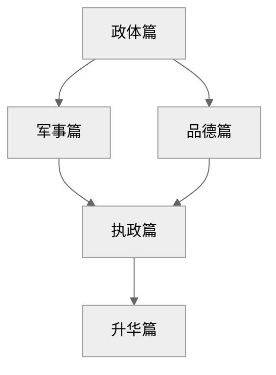

## 1. 核心思想

政治应基于现实而非道德理想，君主需以权力巩固与国家生存为首要目标，必要时可摒弃道德约束。

## 2. 核心概念

### 政治现实主义

- What: 以“有效真理”（verità effettuale）替代空想模型，聚焦权力运作的真实逻辑
- How: 道德中立——慷慨/吝啬、仁慈/残酷、守信/欺骗的取舍依情境而定
- Why: 人性本恶且趋利避害，道德理想在动荡政局中易致失败

### Lion-Fox Duality[^1]

- What: 君主必须是一头狐狸以识陷阱，又是一头狮子以惊豺狼

- How: 武力震慑（狮子）与欺诈伪装（狐狸）结合，掩饰权谋本质

- Why: 单一策略易被制衡（狮子落陷阱，狐狸惧豺狼）

[^1]: Lion-Fox Duality 是我类比波粒二象性提出的概念：面对不同的生存场景，我们要同时具备直面困难（狮子）的勇气和识破陷阱的智慧（狐狸）

### 命运（Fortuna）与能力（Virtù）

- Why：命运主宰半数行动，但可控部分需君主主动掌控
- How：顺应时势调整策略（如改革制度）、预判危机并储备军事力量
- What：

## 3. 主题归档

类型：政治哲学 / 现实主义政治理论

关联领域：国际关系现实主义、领导力心理学、专制政体研究

## 4. 全书框架梳理

全书一共 26 个章节，我把它们分为五部分：

| 板块   | 对应章节 |
| ------ | -------- |
| 政体篇 | 1-11     |
| 军事篇 | 12-14    |
| 品德篇 | 15-19    |
| 执政篇 | 20-23    |
| 动机篇 | 24-26    |

五大篇章之间的关系为：

作者在政体篇提出君主统治的三种国家状态：

- 已有领土，不需扩张 → 世袭
- 已有领土，需要扩张 → 混合
- 没有领土，需要扩张 → 全新

在混合型政体中，作者重点阐述了如何征服他国领土；在全新型政体中，作者介绍了六种上位方式。作者认为，要实现领土的扩张或者上位，君主需要从军事和品德两个方面进行培养：

- 军事篇中作者介绍了四种军队类型，提出了构建国民军的重要性，并提出了君主要具备的军事素质
- 品德篇中作者按照破立防的顺序，首先否定了道德的善恶二元对立，提出道德相对主义，然后分别列举了三种现实道德，最后给出了如何防止道德反噬的解决方案

执政篇给出日常理政的一些建议，是君主军事和品德的微观体现：

- 对外如何分化强敌、提升声望
- 对内如何筛选大臣、巩固统治

最后，作者在动机篇提出写这本书的目的：把高度上升到民族统一，希望新君采纳他的建议。

## 5. 写作动机

问题意识：意大利城邦分裂遭外敌侵凌（如法国、西班牙），需强权君主统一

个人诉求：向美第奇家族自荐复职（献书朱利亚诺二世），以实践其理论

现实意义：

- 现代军事理论先驱：
  - 国民军原则 → 演化为主权国家义务兵役制（如法国大革命后的“全民皆兵”）；
  - 君主责任论 → 发展为文官控军原则（如美国宪法规定总统为三军统帅）；

## 6. 观点提炼

### a) Why

### b) How

### c) What

## 7. 批判性思考

### a) 作者背景

马基雅维利是意大利佛罗伦萨的政治家、外交家和政治思想家。马克思对他的评价是：

> 已经用人的眼光来观察国家了，它们都是从理性和经验中而不是从神学中引出国家的自然规律……权力都是作为法的基础。由此，政治的理论观念摆脱了道德，所剩下的是独立地研究政治的主张……马基雅维利是第一个使政治学独立，同伦理家彻底分家的人，有资产阶级政治学奠基人之称。

更多背景介绍见[note-君主论](note-君主论.md)

### b) 政治倾向

第 23 章（防谄媚）实际是为进谏铺路——暗示“我才是敢讲真话的顾问”，而 26 章引用但丁诗句更是将美第奇家族比作救世主，献媚技巧登峰造极。这种写作策略证明《君主论》既是技术手册，更是一份精心包装的政治求职信。

### c) 价值预设

- 人性本恶
- 结果正义论：国家利益高于个人利益
