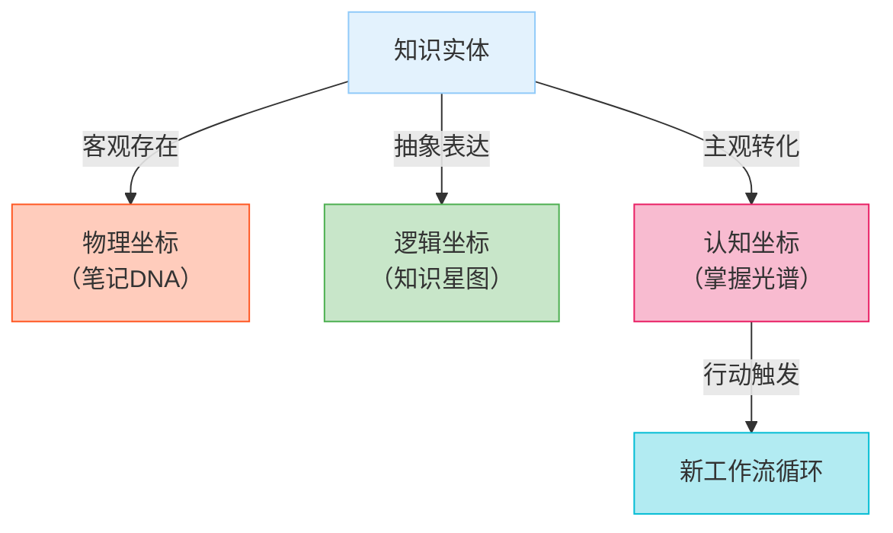
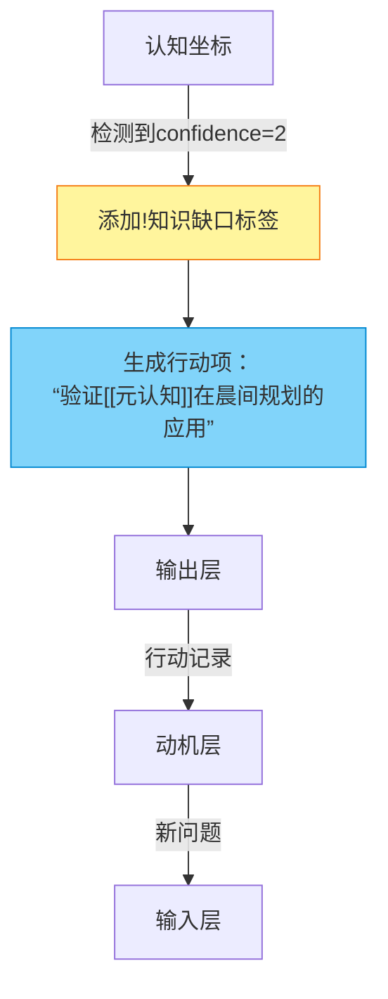
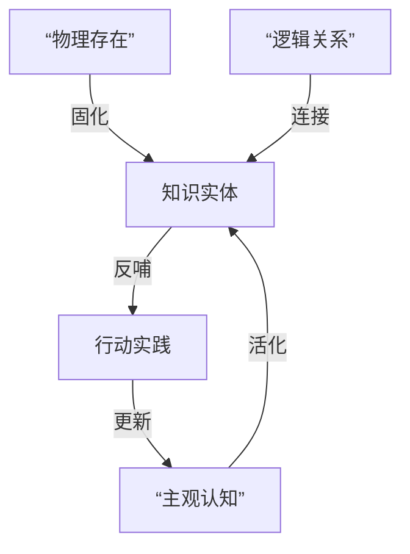
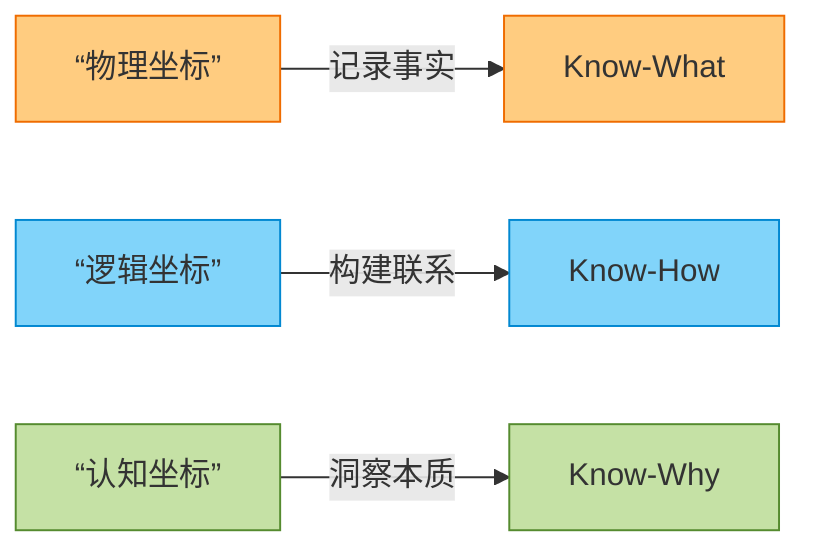

### 0. 引言

在 [blog-我的知识管理-再谈笔记构建](blog-我的知识管理-再谈笔记构建)中提到，今后要使用 obsidian 作为知识管理工具。在 obsidian 中可以给 markdown 文件添加 YAML 属性，其本质是给文档添加一系列的元数据，方便后面使用 dataview 插件进行知识图谱的制作和文档关联的可视化。由此，引出问题：

- 按照 MECE 法则，应该从哪几个维度添加元数据？
- 每一个维度又应该对应哪些内容？
- 如何建立标签系统？

DeepSeek 为我分了五个维度，分别是：

- 来源维度 (Source Dimension)：知识从哪来？
- 内容维度 (Content Dimension)：如何（在知识网络中）快速识别知识？
- 认知维度 (Cognitive Dimension)：我与知识是什么关系？
- 关系维度 (Relation Dimension)：当前知识位于知识网络的什么位置？
- 管理维度 (Management Dimension)：如何管理知识？

知识管理的精髓，根据客观存在和主观意识，分为三类：

- 物理存在
- 逻辑本质
- 认知映射

按照这个原则，分别对应这五个维度：

- 物理坐标：来源维度 + 管理维度 **→ 笔记实体**
- 逻辑坐标：内容维度（面 → 点） + 关系维度（点 → 面） **→ 知识本质**
- 认知坐标：**产生输出/创造行动**，为下一个工作流创造灵感/动机/问题，最终形成闭环



对于认知坐标，DeepSeek 用一个例子说明：



最后，DeepSeek 总结了元数据是如何在“法-术-器”层面起作用的：



引用 DeeSeek 的一段话：

>当您打开Obsidian时：
>
>- 您看到的是**物理坐标**（笔记元数据）
>- 您思考的是**逻辑坐标**（知识网络）
>- 您创造的是**认知坐标**（个人理解）


### 1. 来源维度 

| 字段              | 说明         | 示例                                      | 必要性   |
| :---------------- | :----------- | :---------------------------------------- | :------- |
| `sourceType`      | 载体类型     | `book`/`podcast`/`video`/`paper`/`course` | 必填     |
| `sourceTitle`     | 来源完整名称 | 《认知觉醒》/《Lex Fridman Podcast》      | 必填     |
| `sourceCreator`   | 创作者       | 周岭/Lex Fridman                          | 必填     |
| `sourcePublisher` | 出版方/平台  | 中信出版社/YouTube                        | 选填     |
| `sourceDate`      | 来源发布时间 | `2020-03`                                 | 选填     |
| `sourceLink`      | 来源链接     | [URL]                                     | 强推     |
| `sourceISBN`      | 书籍唯一标识 | `9787508660752`                           | 书籍必填 |
| `sourceDOI`       | 论文标识     | `10.1016/j.tics.2021.06.001`              | 论文必填 |

### 2. 内容维度 

| 字段            | 说明            | 示例                                                         | 必要性 |
| :-------------- | :-------------- | :----------------------------------------------------------- | :----- |
| `coreConcept`   | 核心概念/模型名 | 艾宾浩斯遗忘曲线/二八法则                                    | 必填   |
| `knowledgeType` | 知识分类        | `concept`/`model`/`method`/`principle`/`case`/`quote`/`data` | 必填   |
| `domain`        | 所属领域        | `认知科学`/`经济学`/`AI`                                     | 必填   |
| `abstract`      | 一句话摘要      | 描述遗忘规律的记忆模型                                       | 强推   |
| `keyDiagram`    | 核心图表代码    | ````mermaid graph LR...`                                     | 强推   |
| `complexity`    | 理解难度        | `1-5`分                                                      | 选填   |

### 3. 认知维度

在认知维度，存在知识管理中最大的挑战——**如何将主观认知客观化**？

我真正需要的是既能反映认知状态、又能指导行动的关键指标。特别是对于终身学习者来说，**评估工具本身不应该成为学习的负担**。

| 字段            | 说明         | 示例                                                 | 必要性 |
| :-------------- | :----------- | :--------------------------------------------------- | :----- |
| `maturity`      | 笔记成熟度   | `seedling`(初稿)/`budding`(发展中)/`evergreen`(完善) | 必填   |
| `lastReviewed`  | 最后复习时间 | `2023-08-20`                                         | 必填   |
| `confidence`    | 掌握置信度   | `1-5`分                                              | 强推   |
| `knowledgeGaps` | 知识缺口     | ["神经机制不明","缺少案例"]                          | 选填   |
| `actionItems`   | 行动项       | ["实践费曼技巧","验证模型"]                          | 强推   |

其实，三维坐标的设计正好对应了 know-what/know-how/know-why 的**三阶认知模型**：



三阶认知模型和不同层面的对应关系为：

| 认知 | know what      | know how     | know why                          |
| ---- | -------------- | ------------ | --------------------------------- |
| 维度 | 理论层面       | 行动层面     | 思想层面                          |
| 方法 | 费曼学习法     | MVP          | 批判写作（正反观点）+知识图谱扩展 |
| 工具 | Typora         | Logseq       | Obsidian                          |
| 说明 | 抽象概念具体化 | 实践检验原理 | 洞察底层逻辑                      |

那么，置信度和成熟的区别是什么？

| **维度**     | 成熟度 (Maturity)                      | 置信度 (Confidence)                      |
| :----------- | :------------------------------------- | :--------------------------------------- |
| **定位**     | 知识的**客观完成度**                   | 您对知识的**主观掌握度**                 |
| **评估对象** | 笔记内容本身                           | 您与该笔记的关系                         |
| **进化动力** | 知识结构的完善                         | 应用验证的积累                           |
| **衡量标准** | Know-What/How/Why 的完整性             | Know-What/How/Why 的掌握证据             |
| **上限制约** | 置信度≤成熟度 （无法掌握不存在的内容） | 成熟度≥置信度 （知识可能比您理解的更深） |

> **置信度与成熟度的关系**如同**剑与剑法**：
>
> - 成熟度是剑的锻造品质（客观存在）
> - 置信度是您的剑术水平（主观能力）
> - 三维训练法就是您的《独孤九剑》秘籍

对于笔记成熟度，DeepSeek 给出了评判标准：

| 等级          | 评估标准（可验证证据）                | 认知维度  |
| :------------ | :------------------------------------ | :-------- |
| **Seedling**  | • 核心概念正确定义 • 来源信息完整记录 | Know-What |
| **Budding**   | • 建立1+应用场景 • 连接3+相关概念     | Know-How  |
| **Evergreen** | • 能解释底层原理 • 经跨领域验证       | Know-Why  |

和掌握置信度，DeepSeek 给出了评判标准：

| 等级  | 验证方式            | 通过标准                    | 认知维度  |
| :---- | :------------------ | :-------------------------- | :-------- |
| **1** | 概念复述            | 能说出基础定义              | Know-What |
| **2** | 单场景应用          | 在典型场景成功实践1次       | Know-How  |
| **3** | 多场景迁移+原理阐释 | 在2个不同领域应用并解释机制 | Know-Why  |

### 4. 关系维度

| `parentNote`      | 关联原始笔记 | `[[note-认知科学]]`           | 必填 |
| ----------------- | ------------ | ----------------------------- | ---- |
| `childCards`      | 衍生知识卡片 | `[[card-工作记忆]]`           | 选填 |
| `relatedConcepts` | 相关概念     | `[[刻意练习]]`,`[[心流]]`     | 强推 |
| `opposingViews`   | 对立观点     | `[[行为主义学习论]]`          | 强推 |
| `appliedIn`       | 应用场景     | `[[写作技巧]]`,`[[项目管理]]` | 强推 |

### 5. 管理维度

| 字段          | 说明       | 示例               | 必要性 |
| :------------ | :--------- | :----------------- | :----- |
| `cardID`      | 卡片唯一ID | `CRD-2023-B001`    | 必填   |
| `createdTime` | 创建时间   | `2023-08-20T14:30` | 必填   |
| `updatedTime` | 更新时间   | `2023-09-15T10:22` | 必填   |
| `curator`     | 整理者     | 您的姓名           | 选填   |
| `version`     | 版本号     | `v1.2`             | 强推   |

### 6. 标签系统

- 使用三级层级标签
- 特殊标签前缀：
  - `!`
  - `$`
  - `@`
