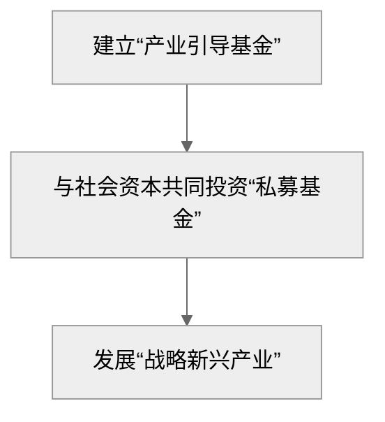

## 核心问题

- 在中国，政府和经济发展的关系是什么？
- 为什么是这样的关系？

## 自我整理

中国政府分为中央政府和地方政府。中央政府负责制定宏观经济目标/计划，地方政府负责因地制宜，执行计划。

在计划经济和改革开放初期，我国经济发展失衡。具体体现在两个方面：

- 横向：地区/省份间发发展不平衡
- 纵向：在中央 --> 省--> 市 --> 县的行政划分下，财权层层上收，事权层层下压

为了增加中央财政收入，增强宏观调度能力，政府在 1994 年开始实施分税制改革。分税制改革后，国税和地税互相分立，税收向中央集中，便于中央实施财政转移。地方政府则从两个方面增加税收：

- 城市化：大兴土地财政和土地金融，主要表现为房地产财政
- 工业化：招商引资，发展乡镇企业

城市化和工业化的本质都是让农民的身份发生改变：农民分别变为工人和市民。这样做虽然能让经济快速发展，但也会导致一系列债务问题：

- 过度工业化
  - 国企效率不高，从而导致资源浪费
  - 产能过剩，从而引发国际贸易战
- 过度城市化
  - 重生产、轻消费，忽略了城市建设应该以人为本（即提高公共服务），从而导致人们的贫富差距过大

政府在经济发展中的角色是调控经济发展的速度。随着时代的发展，中国政府的角色也要进行改变：从生产型政府转变为服务型政府。

## 摘抄

本书分为两大部分：微观机制和宏观现象。

### 微观机制

微观机制部分，分别对应第一至四章。在微观机制中，作者介绍了地方政府推动经济发展的模式。

>不能脱离政府来谈经济，是理解中国经济的基本出发点。
>
>只有理解了地方政府的事权划分，才能清楚地方政府能干哪些事，以及用哪些资源去做这些事。

**中国政府体系的特点：**

- 政治集中：中央政府确保地方官员拥有统一的意识形态
- 行政分权：充分发挥地方的主动性和积极性
- 上下分治：中央负责制定计划，地方负责「因地制宜」地落实

**政府的权力受到哪些约束？**

- 做事的能力：取决于掌握的资源
- 做事的意愿：取决于各方的积极性和主动性

**政府间事权划分的基本逻辑是什么？**

- 公共服务的规模经济与行政/地理/文化边界
- 信息复杂性：上有政策，下有对策
- （上下级官员的）激励相容

>要想把握政府的真实意图和动向，不能光读文件，还要看政府资金的流向和数量。科学的财税体制是优化资源配置、维护市场统一、促进社会公平的制度保障。政府的事权必然要求相应的财力支持。
>
>1994 年开始实施分税制。此后地方政府的支出一直高于收入，入不敷出的部分要通过中央转移支付来填补。

**分税制的背景和过程是什么？**

我国一开始使用承包制。财政承包制下，交完了中央的，剩下的都是地方自己的。改革开放后，「两个比重」（中央财政预算收入占全国财政预算总收入的比重 + 全国财政预算总收入占 GDP 的比重）越来越低。在这种背景下，国家开始分税制改革。

税收分为三类：

- 中央税：关税
- 地方税：营业税/个人所得税/房产税
- 共享税：增值税

**改革对地方经济发展方式的影响？**

分税制减少了地方政府手头可支配的财政资源。为此，以下措施可以填补预算内收支缺口：

1. 土地财政
2. 中央转移支付
3. 增加税收规模
4. 税收返还

本书重点介绍土地财政。地方政府重视制造业，因为增值税在生产环节征收，且制造业可以带动三产发展，增加相关税收。这样做的后果是，地方政府重视企业而轻视民生，重视生产而轻视消费。

我国实行土地公有制：

- 城市土地归国家所有
- 农村土地归集体所有
- 农地先经过征地变为国有土地，然后才可以用于发展工商业或建造住宅

与人力相比，土地更容易被资本化。土地的资本化运作，本质是把未来的收益抵押到今天去借钱。随着工业化的发展，这样做的风险也暴露出来：

- 如果借来的钱投资质量高，转化成了有价值的资产和未来更高的收入，那债务就不是大问题；如果地方官员在任期内搞面子工程，过度借债搞大项目，则会引发债务问题
- 人力和土地资源的使用效率不高
- 经济发展开始进入中期阶段，市场竞争越来越激烈，技术要求越来越高

**基层财政困难**

地区间（东西/南北）经济发展不平衡

>“东亚经济奇迹”一个很重要的特点，就是政府帮助本土企业进入复杂度很高的行业，充分利用其中的学习效应、规模效应和技术外溢效应，迅速提升本土制造业的技术能力和国际竞争力。

**政府在工业化中的角色是什么？**

### 宏观现象

在宏观现象中，作者从三个维度总结了地方政府推动经济发展模式的特点，分别对应三个章节：

>- 城市化建设 --> 重土地轻人 --> 贫富差距加大 --> 第五章
>- 招商引资 --> 重规模、扩张 --> 负债加重 --> 第六章
>- 发展战略 --> 重生产轻消费 --> 产能过剩、贸易冲突 --> 第七章

第五章开篇，作者描述了城市化建设的链条关系：

>通过出让城市土地使用权，可以累积以土地为信用基础的原始资本，推动工业化和城市化快速发展。中国特有的城市土地国有制度，为政府垄断土地一级市场创造了条件，将这笔隐匿的财富变成了启动城市化的巨大资本，但也让地方财源高度依赖土地价值、房地产和房价。房价连着地价，地价连着财政，财政连着基础设施投资，于是经济增长、地方财政、银行、房地产之间就形成了“一荣俱荣，一损俱损”的复杂关系。

**房价和土地供需的关系是什么？**

>房价中长期主要由供求决定，房屋供需与人口结构密切相关，因为年轻人是买房主力。年轻人大都流入经济发达城市，但这些城市的土地供应又受政策限制，因此房屋供需矛盾突出，房价居高不下。

**地区间发展不平衡的根源之一在于土地和人口等生产要素流动受限：**

>城市化的核心不应该是土地，应该是人。要实现地区间人均收入均衡、缩小贫富差距，关键也在人。要真正帮助低收入群体，就要增加他们的流动性和选择权，帮他们离开穷地方，去往能为他的劳动提供更高报酬的地方，让他的人力资本更有价值。同时也要允许农民所拥有的土地流动，这些土地资产才会变得更有价值。

**贫富差距和房价以及要素市场改革有关：**

>- 经济增速高时，虽然收入差距在拉大，但低收入人群的收入水平也在快速上升，人们更看重自己的劳动收入（即工作能力），社会对贫富差距的敏感度在一段时间内没有那么高
>- 经济增速慢时，人们更看重自己的资产收入（如房产），社会对不平等的容忍度减弱，贫富差距更容易引发社会矛盾
>
>我国的城市化分为三个阶段：
>
>- 1994 年前，乡镇企业崛起，农民离土不离乡，城市化速度不快
>- 1994 年分税制改革之后，农民工进城大潮形成，土地的城市化速度远大于人的城市化速度：地方政府以土地为杠杆撬动城市建设，但是城市的新移民并没有得到相应的公共服务（教育、医疗、养老等）
>十八大之后，城市化重心逐步从“土地”向“人”转移

城市化建设过程中产生了大量负债，第六章介绍以下三点：

- 债务的一般经济学原理
- 我国债务的成因、风险、后果
- 如何偿还已有债务和遏制新增债务

**债务是什么？**
>借来的钱，是（未来需要偿还的）本金+（额外需要支付的）利息

**为什么会有债务？**
>债务源于人性：总想尽早满足欲望，又对未来盲目乐观，借钱时总觉得将来能还上。

**债务的特点是什么？**
>债务常常把风险集中到承受能力最弱的穷人身上。

**我国债务的成因是什么？**

>我国债务迅速上涨始于 2008 年。当年在金融危机的大背景下，我国出口打击很大。为防止经济下滑，中央出台财政刺激计划，同时放宽金融管制以及对地方政府的投融资限制，带动基础设施投资大潮，也推动大量资金涌入房地产。

**我国债务累积分为哪些阶段/债务问题的起因？**

>- 2008 - 2009: 4 万亿计划，载体为基建和房地产
>- 2010 - 2011: 通货膨胀抬头，货币政策收紧
>- 2012 - 2015: 欧债危机导致影子银行（例如信托贷款）开始扩张
>- 2015 - 2016: 股灾+资本外逃
>- 2017 - 2018: 中美贸易战+中央政策：去产能，不炒房

**我国企业债务的特点是什么？**

>- 地方政府融资平台企业的债务占 GDP 较高，资金主要投向基础设施，项目回报率低
>- “国进民退”现象凸显：国企规模迅速扩张，但其多占用低资金没有转化为同比例低新增收入，推升了整体债务负担
>- 房地产是支柱型产业，不仅本身规模巨大，而且直接带动钢铁、玻璃、家具、家电等众多行业。在购置土地环节，发达国家一般要求企业使用自由资本金，而我国允许房企借钱买地，这就刺激了放弃竞相抬高地价和储备土地

**我国银行债务的特点是什么？**

>- 银行不仅发放贷款，也持有大多数债券
>- 银行偏爱以土地和房产为抵押物的贷款，因为这些抵押物让银行的风险降低
>- 银行投资有风险，因此银行会和信托公司/券商合作，成立“影子银行”（功能类似银行，但不受银行监管）

**银行信贷的保障有哪些？**

>- 优良抵押物
>   - 土地
>   - 房子
> - 政府担保

**如何化解债务风险？**

偿还已有债务：

- 压缩支出：国企混改
- 增发货币：
  - 金融危机前：降低利率。前提是投入货币之后，经济能够增长，实际收入能增加
  - 金融危机后：“量化宽松”，即央行增发货币来买入各类资产，把货币注入经济。问题是，央行购买的各种金融资产会推高资产价格，受益的是相对富裕的人，增发的货币难以转到穷人手中
  - 把债务货币化：用无利率的货币替代有利率的债务，以政府预算收支的数量代替金融市场的价格（即利率）来调节经济资源配置

遏制新增债务：

- 限制房价上涨
- 限制土地财政和土地金融
- 限制政府担保和国有企业过度借贷
- 改革资本市场，用股权代替债权

>总体来说，我国债务风险的本质不是金融投机的风险，而是财政和资源分配机制的风险。在中国，政府和国企主导投资，国有银行主导融资。这一体系在过去的经济增长中发挥过很大的作用，但如果投资主体不变，权力不下放给市场，那想要构建政府和银行风险的直接融资体系、想让分散的投资者去承担风险，就不符合“谁决策谁担风险”的逻辑。

第七章将展开讨论我国对国际经济体系的冲击，并且从国际冲突的角度出发，由外向内再度审视国内经济结构的失衡问题。

**从三个角度理解产能过剩？**

1. 生产效率下降
   1. 宏观：GDP 增速放缓，低于债务增速
   2. 微观：地方政府过度投资，为“僵尸企业”输血，扭曲了资源配置，且土地财政和土地金融过度依赖地价和房地产
2. 国际失衡：由于重生产轻消费，中国必须向国外输出剩余产能，对国际经济体系冲击巨大，从而导致贸易战
3. 产业升级：由于产能过剩，我国制造业竞争激烈，价格和成本不断降低。要想在国内市场上存活和保持优势，头部企业必须提高质量和技术，这进一步冲击了发达国家的国际分工体系

**国内经济结构为何失衡？**

作者认为，我国经济结构失衡的最突出特征是消费不足。这存在两方面的可能性：

1. GDP 中老百姓可供支配的收入份额下降
2. 老百姓把更大一部分收入存了起来，储蓄率上升

对于第二点，作者认为是三点共同作用的结果：

- 计划生育导致老年人储蓄率偏高
- 政府民生支出不足：教育/医疗/养老
- 房价上涨导致老百姓消费不足

对于第一点，作者认为，如果百姓的收入份额下降，一定对应着政府/企业份额的提升。经济发展初期，将更多资源从居民消费转为资本积累，变成基础设施和工程，可以有效推动经济起飞和产业转型，提高生产率和收入。并且起步时百废待兴，绝大多数投资都有用，都有回报，关键在于加大投资，加速资本积累。但当经济发展到一定阶段后，这种方式就不可持续了，原因有四点：

- 基础设施和工业体系趋于完善，投资难度加大
- 居民消费不足，无法消化投资形成的产能
- 贫富差距拉大
- 过剩产能导致的国际冲突

**以中美贸易战为例，中国经济如何对外国形成冲击和反弹？**

作者认为，落后的工业国在崛起过程中与先进国之间的种种冲突，历史上是常态。因为落后国家的崛起，必然带有两大特征：

- 对先进国的高效模仿和学习
- 结合本土实际，带有本国特色，发展路径与先进国有诸多不同之处

作为对中国经济的观察者，作者认为要培养出一种发展的观念：

- 理解发展目的不等于发展过程，发达国家目前的做法不一定能解决我们发展中面临的问题
- 我国过去的一些成果经验和发展模式也不可能一直有效，因为时代在不断发展

中国：出口大于进口，贸易顺差
美国：进口大于出口，贸易逆差

作者认为，中国对美国的就业冲击并不重要。相比之下，对美国的技术冲击和挑战更加实在，者也是中美贸易冲突和美国技术遏制可能会长期化的根本原因。

>对站在科技前沿的国家来说，新技术的发明和应用一般从科学研究和实验开始，再到技术应用和专利阶段，然后再到大规模工业量产。但对一个后起的发展中国家来说，很多时候顺序是反过来的：先从制造环节入手，边干边学，累积技术和经验，然后再慢慢根据自身需要改进技术，创造一些专利产品销量逐步扩大、技术逐步向前沿靠拢之后，就有了更多资源投入研发，推进更基础、应用范围更广的科研项目。

作者认为，美国的科技技术依然领先，但是全球最大的市场在中国。如果市场和科技渐行渐远，对双方都是巨大损失：

>我国在基础科研质量、科技成果转化效率等方面，还有很长的路要走；而美国要想在全球再找一个巨大的市场，也是天方夜谭。没有了市场，美国公司持续不断的高额研发支出很难持续，也就难以长久维持技术优势。

技术高压虽然可能让我国企业在短期内受挫，但很多相对落后的国产技术也因此获得了市场机会，可能提高市场份额和收入，进而增大研发力度，进入“市场-研发-迭代-更大市场”的良性循环，最终实现国产替代。但是这一切的前提，是我国国内市场确实能继续壮大，国民消费能继续提升，能真正支撑起“国内大循环为主体，国内国际双循环”的模式。

作者认为，实现这一战略转型的关键是提高居民收入和消费。

要提高居民收入，就要继续推进城市化，让人口向城市尤其是大城市集聚：

>虽然制造业是生产率和科技进步的主要载体，但从目前的技术发展和发达国家的经验看，制造业的进一步发展吸纳不了更多就业。产业链全球化之后，标准化程度越来越高，大多数操作工序都由机器完成。比较高端的制造业，资本密集度极高，自动化车间里没有几个工人。所以解决就业和提高收入必须依靠服务业的大力发展，而这只能发生在人口密集的城市中。

此外，还要让地方政府做出角色改变：遏制其投资冲动，降低其生产性支出，加大民生支出。

最后，要提高居民收入，还要扩宽居民的财产性收入，改革金融体系和资本市场：

>市场从建立到完善，其规模和效率都需要逐步提升，完善的市场本就是经济发展的结果，而不是前提。

### 总结

中国政府，尤其是市县一级的地方政府，通过政策、财政、金融等手段深度参与经济发展，最终让政府置身于市场之中，把竞争机制引入政府：

- 中央政府设定经济发展目标，然后放权给地方政府，让地方政府互相竞争，优化资源配置。这种中央协调 + 地方地方分权竞争的模式，属于中国特色。
  - 优点
    - 把官员的晋升和地区经济表现挂钩
    - 以市场竞争约束地方官员
    - 当地的经济表现能力为地方官员和政府工作提供及时的反馈
  - 缺点
    - 官员缺乏淘汰机制
    - 地方保护主义
    - 市场的长周期与官员任期短周期之间的矛盾
- 政府角色的转变：从生产型到服务型，加大人力资本的投资，比如教育、医疗等民生支出
- 区分经济发展过程和发展目标

>对处于技术前沿的发达国家来说，提高生产率的关键是不断探索和创新。其相对完善的市场经济是一套分散化的决策体系，其中的竞争和价格机制有利于不断“试错”和筛选胜者。但对发展中国家来说，提高生产率的关键不是探索未知和创新，而是学习已知的技术和管理模式，将更多资源尽快组织和投入到学习过程中，以提高学习效率。
>
>后进国家虽然有模仿和学习先进国家技术的“后发优势”，但其“组织学习模式”不可能一直持续下去。当技术和生产率提高到一定水平之后，旧有的模式若不能成功转型为“探索创新模式”，就可能会阻碍经济进一步发展，“后发优势”可能变成“后发劣势”。
>
>行政区域决定了可行的经济发展政策的边界。经济发展的关键在于工业化和城市化。表面上看，这是个工业生产技术和基础设施建设的问题。但看深一层，这是个农民转变为工人和市民的问题。在我国，可行的政策空间和演变路径受三大制度约束：
>
>- 农村集体所有制
>- 城市土地公有制
>- 户籍制度

经济发展必然要改变旧有的生活方式，重新分配利益，所以必然伴随着矛盾和冲突。政府的关键作用之一，就是调控改变速度的快慢。社会变化过程快慢之间，对身处其中的人而言，感受天差地别。对于环境的变化，人们需要时间去适应。人不是机器部件，不可能瞬间调整，也没有人能一直紧跟时代，所以稳定的改革过程要留下足够的时间和资源去缓冲。
