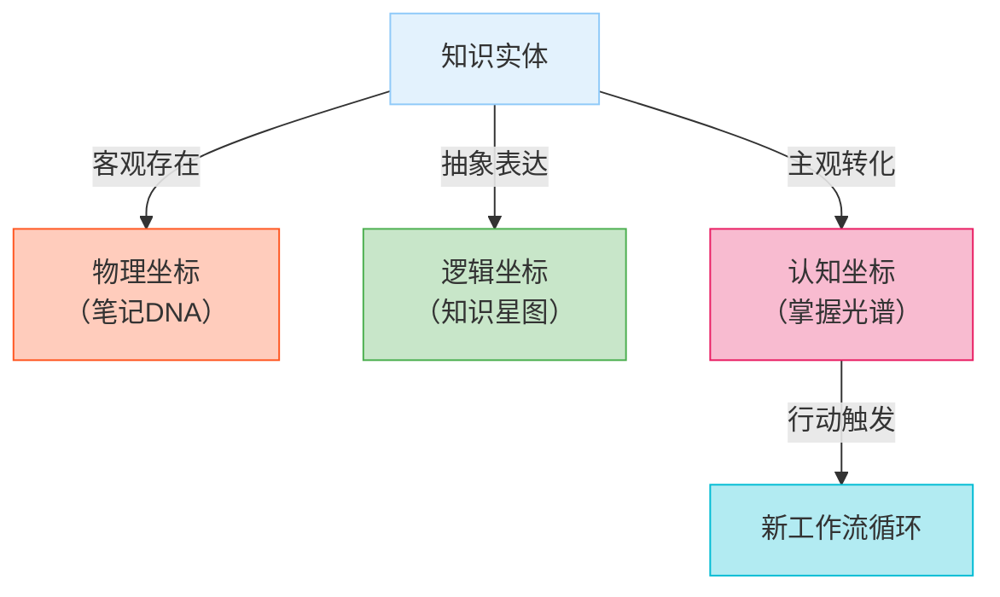
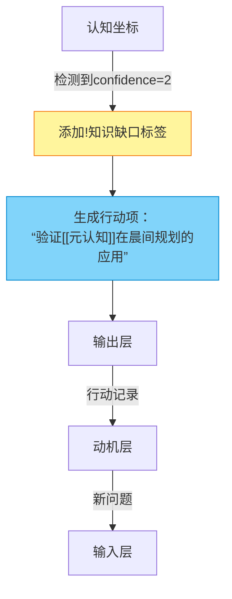
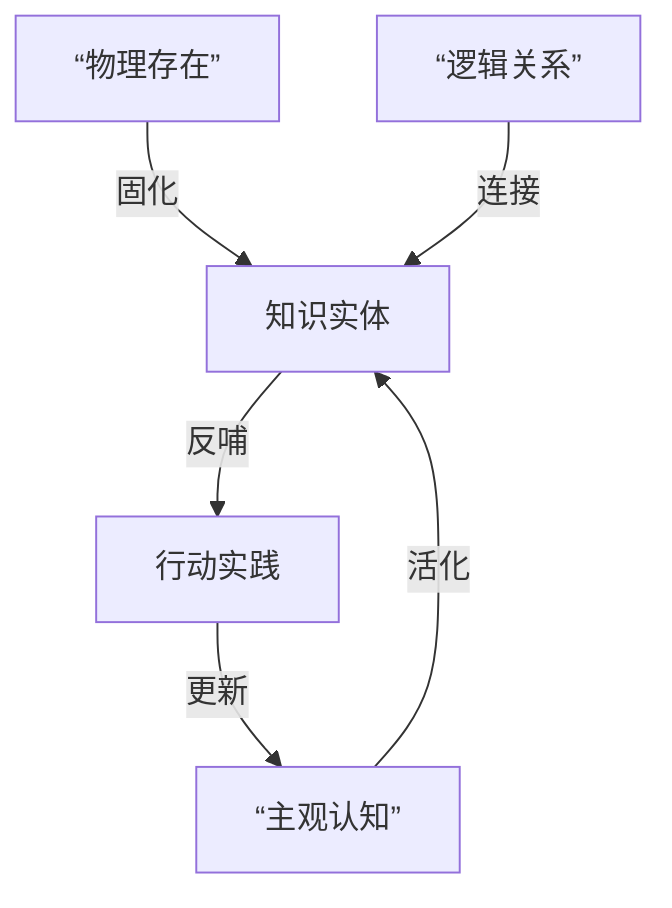
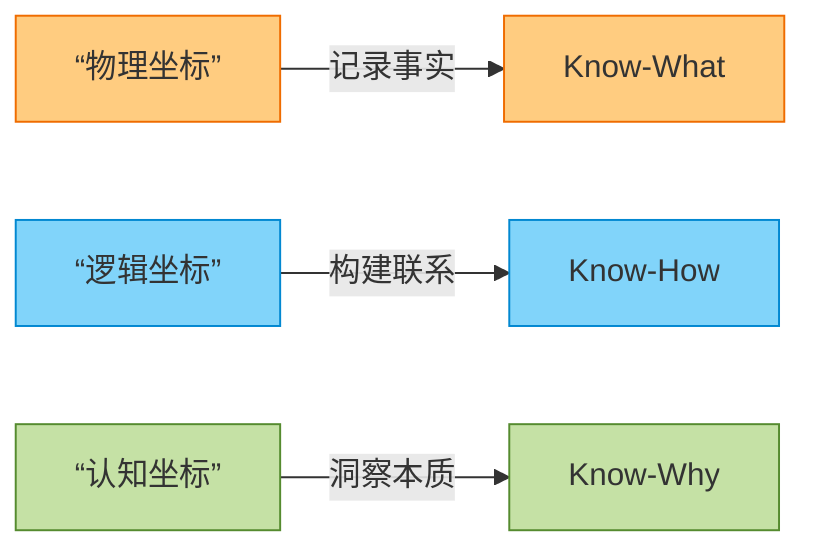

## See also

- [blog-工具篇](/docs/blog-我的知识管理-工具篇.md)
- [blog-笔记篇](/docs/blog-我的知识管理-笔记篇.md)
- [blog-认知篇](/docs/blog-我的知识管理-认知篇.md)

## 2024-11-26

近年来，随着 notion/obsidian 等一众新型笔记软件井喷式的出现，让知识管理变得丰富了起来。在[[ref-打造个人工作流-认知篇]]中，作者认为笔记软件属于特殊的一类工具软件，因为它们往往自带一套方法论。例如，如果使用 OneNote 就必须接受它提供的自上而下式的层级结构。随着层级结构越来越深，笔记也越记越乱。因此，当「双链」这个功能伴随着「卡片盒笔记法」这个概念横空出世，看着那一团知识网图，没有人会不为之心动。

然而，正如[[ref-请不要神化双链笔记-少数派]]所说，双链并不能反映链接之间的主次关系。如果不按照一定的结构去管理，知识体系绝不会自己生长出来。

而我在实践之后，也不禁要提出以下几个疑问：

- 卢曼搞学术研究是否能和我们的日常生活划等号？
- 卢曼的社科研究是否也可以用于其他领域？
- 卢曼生活的年代是否有其科技发展的局限性？
- 网上吹捧的卡片盒笔记法是否全部反映了卢曼的笔记思路？

同样地，在以下三篇中，作者也没有完全参照卢曼的卡片盒笔记法，而分别根据自己的需求进行了适当的简化：

- [ref-极简三步-我的个人知识管理工作流-少数派](ref-极简三步-我的个人知识管理工作流-少数派.md)
- [ref-巧用分类法解决使用卡片笔记时遇到的困境-少数派](ref-巧用分类法解决使用卡片笔记时遇到的困境-少数派.md)
- [ref-三种卡片类型](ref-三种卡片类型.md)

不可否认，卡片盒笔记法提供了一种全新的「自下而上」的知识体系管理思路。然而，我们不应该一股脑的就把这种方法奉为圭臬。更理性的做法，是根据自身的需求，<mark>在「自上而下」和「自下而上」之间找到平衡点</mark>。

---

## 2024-11-30

在 [blog-我的知识管理-笔记篇](/docs/blog-我的知识管理-笔记篇.md)中可以总结以下论点：

1. 使用主动输入过滤信息源
2. 使用渐进式阅读让来自第三方信息源的临时笔记变为长青笔记
3. 大纲笔记是实现层级结构和网状结构知识体系的平衡点
4. 使用主动输出让新知识归入现有知识体系之中

由此，可以提取六个知识点：

- 长青笔记
- 大纲笔记
- 渐进式阅读
- 知识体系
- 主动输入
- 主动输出

我使用长篇幅去论述的，是前四个点；然而今天我突然意识到一个问题：我们总是妄想把所有看到/听到的内容记录下来放在一处，然后在需要的时候拿出来。可事实上，大部分表象的问题都可以通过网络搜索解决。没有自己的思考，把信息放在笔记中（即使它已经被总结/归纳/对比/验证，可是它并没有为我所用）和放在网络中是没有区别的。从一定程度上来讲，只要知识能够为我所用，那么有没有笔记也是无所谓的。因此，<mark>笔记只是知识体系的一种形式，要杜绝形式上的完美主义</mark>。我们不应该期望通过输入和加工得到输出。相反，是输出决定了输入，进而决定了在加工过程中笔记的形式。

鉴于此，应该再写一篇博客，来论述主动输入和主动输出的关系，以及什么是主动输出，见 [blog-我的知识管理-认知篇](/docs/blog-我的知识管理-认知篇.md)。

---

## 2025-05-15

上述体系已经实施半年有余，最近再回顾一下。

这些方面做的不错：

- 主动输入：阅读书籍为主，中长视频和 AI 为辅
- 主动输出：使用快捷指令复制读书笔记模版，使用 vscode 的 markdown 功能填写模版内容
- 既保证了数据的本地化，又可以同步到 iCloud 和 GitHub

这些方面不尽如人意：

1. 单纯的 markdown 文件只能记录文字，目前记录的文件大多为很有框架/条理的读书笔记，缺少一些灵感/想法/思路/工作/生活的记录
2. 缺少像 notion/obsidian 等笔记软件的 dataview （管理/追踪/回顾）功能
3. ios 备忘录在大部分情况下仅作为备忘录使用
4. flomo 的使用频率逐渐减少，也许是因为其使用场景大多为手机端

**如何解决第一个痛点**？

出于以上动机，选择 logseq 作为补充。logseq 的定位是 outliner，即大纲，是一条串起思路的线。logseq 的优势在于不需要考虑把笔记放到哪里，可以做到打开软件无压力记录。当然，后面还是要定期对日志中的内容进行分类。结构化/体系化的文字表达形式应该依然由 vscode 完成。因此，可以把 logseq 作为 review 类文档的「碎片」。事实上，这篇文档也正是我在 logseq 中记录的 PKM 相关内容的集合。

那么 logseq 的使用场景为：

- 记录：使用日志记录每天的所思所想
- 回顾：利用双链/图谱定期回顾想法
- PKM 的输出应该从工作和生活两个方面展现。因此，一旦 PKM 中的知识被应用，应该使用一款软件进行记录

目前 logseq 的 Pages 分为以下几类：

- 行动类的 TODO/DOING/DONE
- 书籍类：关联主题，列出行动
- 主题类：关联书籍，形成树状知识体系

**如何解决第二个痛点？**

尝试使用了以下几款软件：

- 无边记
- notion
- anytype
- calibre
- zotero

然而效果都不尽如人意。主要是目前的管理项目成本太高。创造书籍条目，添加元数据，再分组查看，这些更多的是形式主义。后来想想，其实就目前而言，logseq 的主题目录就已经足够。当然，对于 anytype 或者 notion 的探索不应该就此打住。关于个人生活的项目管理，使用 anytype/notion 是完全可行的，只是不在本次的 scope 中罢了。

.md 文件优点是可靠且容量小，缺点是不容易浏览。思维导图刚好可以弥补这一缺憾。今天刚好发现了一个在 vscode 中很不错的插件，可以把 .md 文件在线预览为思维导图！可惜仍然存在不足：

- 链接无法跳转
- 无法渲染 mermaid

不过这样也倒逼我做一些改变（当然现在想想也很值得）：

- 对于读书笔记的文档，建立两种标签：
  - note: 记录高亮/笔记
  - ref: 系统化地总结全书
- 对于这两类标签，尽量不用图表/mermaid, 每一行的字不要太多，多使用子标题
- 对于 card 类文档，尽量使用 mermaid 进行可视化，这样便于查看和理解
- 定义 review 类文档的作用：搜集 topic, 有点类似于 blog 但是以日期为子标题，更多的是为了记录一个思考的过程。另外，一些在视频或者其他地方看到的信息，如果值得记录，也会加入到 review 中

**关于第三点...**

其实现在我也不那么 care 备忘录具体记录什么东西了。我把它简单的分了四个文件夹：

- Fleeting
- prog. Reading
- Distill
- Archive

其实就是对应了 GTD/CODE/PARA 的原理。任何我想到的东西，都可以迅速记录在备忘录中。Archive 的标志是，它的内容被记录到 docs 的文档中。

**总结：**

目前的常用工具有：

- iOS 图书：电脑/移动端（手机+平板）阅读书籍+导出高亮文字和笔记
- iOS 备忘录：移动端的灵感记录+碎片化捕捉
- vs code：电脑端编写读书笔记 (ref)+发布博客 (blog)
- logseq：电脑端记录日志+碎片化信息整理+为博客提供大纲 (review)

做读书笔记应该是把新知识纳入自己知识库的第一步。用王阳明的话说，叫做要做到「知行合一」。这里的行指是批判性的思想，也可以是行动，或者一次写作。

## 2025-05-18

最近看到了两篇不错的文章：

- [透过信息架构 看各笔记软件](https://sspai.com/post/76736)
- [笔记的策略：文件夹、标签、链接、冗余和可靠性](https://sspai.com/post/98086)

与其他视频/文章不同，这两篇文章并没有从具体的软件出发，而是从更高的一个维度去看待笔记/知识库。以下是一些总结：

**记笔记/知识库的原则是什么？**

- 记笔记只是第一步，你的最终目标还是要完成工作/生活中的具体任务/项目，实现你的目标
- 笔记系统的原则：简单/易维护
- 知识库的作用是为了帮助我们完成记忆的工作

**《信息架构：超越 web 设计》是如何对信息结构进行分类的？**

信息结构分为三大类：

- 层级结构（即文件夹）
- 数据库（元数据管理）
- 超文本/网状结构（单链/双链/反链）

通常在知识库中，这三种结构要结合使用：

- 先设计层级结构，但其深度和广度不宜太多
- 多用数据库
- 超文本用作层级结构或数据库的补充

另外，以下系统可以用作补充：

- 标签：信息环境中更大的信息块，用于粗颗粒度的检索+快速分类
- 导航：引导用户在网络中访问的系统
- 搜索：信息检索

**如何设计标签系统？**

- 避免过多使用标签，定期 review/简化你的标签系统
- 避免在正文中使用标签
- 少使用嵌套标签
- 标签的命名要简短且准确
- 把标签作为数据库中的一种元数据（logseq 目前使用双括号[[]]作为标签）

## 2025-05-26

最近似乎终于找到了 GitHub project 以及 issues 的正确用法：

- 为每一本书建立一个 issue, 加入主题/作者/进度/类别等标签和元数据，实现图书管理和总览
- 然后再使用 vscode 打开相应的 note/ref 文档，预览思维导图模式进行查阅

一言以蔽之，文档的记录使用 vscode + logseq, 书籍/主题的管理使用 GitHub.

## 2025-06-13

对 DeepSeek 的使用场景愈发和我对于文档的分类清晰：

- note 是阅读完书籍后形成的渐进式总结
- ref 是根据 note 的内容，辅以 DeepSeek 形成的系统化总结
- card 分为两种，通常以 mermaid 语句呈现：
  - 一种是根据 note 和 ref 的内容，精炼而成的原子笔记，记载了书籍中最核心的观点/内容
  - 另一种是在 B 站看到的值得三连的视频/公开课，由于其本身已经高度结构化，只需要提炼其最核心的观点即可

以同心圆描述三者的关系：card 是最核心的内容，由内至外分别为 card-ref-note.

**如何使用 card?**

- 每个 card 拥有若干主题，主题使用标签来描述
- 若干 card 描述同一主题，该主题可以汇总为 review
- 同样地，在 review 中也许会发现某些 card 之间的联系，形成新的 card 或者体系
- 若干 card 可以作为 blog 写作的大纲，使用 AI 辅助写作。备选 AI 有：
  - Refly
  - NotebookLM
  - DeepSeek

## 2025-06-21

在和 DeepSeek 讨论关于笔记软件的对话中产生了一些灵感，遂把这些想法记录下来：

刚才说的算是打造个人知识库的一个方面：工具篇。按照黄金圈法则，这算是 How 层面的东西，或者按照道法术器的角度，这算是术/器的层面。刚才所有的提问，归根结底是在问：**为了打造知识库，我需要记笔记，那么应该用什么样的笔记软件来实现这一功能？**

至于 Why/道层面，我的目标是很明确的：成为一名终身学习者，通过不断的主动学习去认知这个世界，也认知自己，然后始终以开放的心态迎接生活。打造个人知识库是我实践主动学习的表现，记录的笔记是学习的结果。而我打造知识库的目的则是使用个人知识库辅助我更好地思考问题。

此外，我还有自己一套法/术层面的东西：如何打造个人知识库？按照 MECE 拆分法则，可以把这个问题拆解为：如何通过以下维度处理笔记？
- 用得着：记录的东西应该是有价值的，现在和未来能够用得到的东西
- 想得起：遇到新知识/输入可以做到和已有知识体系产生联想
- 找得到：能够通过一套体系化的设计，在用到笔记是相对迅速的找到笔记
- 记得住：这里并不是在过分强调记忆力。事实上随着年纪的增大，记忆力显然会衰退；而这正应该是打造知识库的一个原因。所谓记得住，我更多的是强调要做到融会贯通，也就是用最基本的描述去**理解**概念（费曼学习法）

为此，我的知识库工作流分为三个阶段：
- 输入
- 处理
- 输出

关于输入...
在 VUCA 时代更要严格限制输入。实际上，尽管网络上的信息越来越花哨，我认为书依然是最好的信息源，因为它显然经受住了时间的考验。基本上每看完一本书，这本书中提到的一些参考书籍就是我下一本要看的书了。慢慢地，横向类比和纵向延申，我相信可以形成一张大的知识网络。此外，主动寻找信息源：也就是要带着问题去检索。看完书以后，对哪些知识点/观点有疑问，主动搜索谷歌/B站，然后把它们的观点收纳进来。
以上，可以解决**用得着**的问题

关于处理...
这里就涉及到如何处理笔记了。我的原则是：把书读厚，然后再把书读薄。要做到这点，我会为每本书创建三个 markdown 文件：
- note 记录在读的过程中画出的高亮部分
- ref 是系统化的总结全书（核心观点/重要概念/全书架构/写书的现实意义/作者背景）
- card 是结合 note 以及 ref 形成的最核心的部分，大多使用 mermaid 语法，用一张图表示出来
三个文档代表了对书籍的三种程度的理解，我把 note/ref/card 称为三种读书笔记的 type. 以上，通过 typora 的沉浸式写作体验，可以解决**找得到**的问题
此外，Obsidian 支持 yaml 语法。利用这一特点，我为每个 card 文档添加元数据（标签/作者/日期...）。此外，它还具有强大的 dataview 和双链功能，可以形成知识图谱，可视化笔记之间的联系，这就解决了**记得住**的问题
最后，虽然 note/ref/card 都是对一本书记的笔记，我只选择给 card 文档添加元数据，但是三个文档统一使用type+书名命名，可以让我在还没有打开文档之前就大概知道这些笔记是关于什么的。而我回顾时，会先看 card 类型，然后再看 ref，如果哪里不太清楚，再返回 note 中寻找。这样就完成了note/ref/card 之间的双向循环。
以上，可以解决**找得到**的问题。 

关于输出...
- 每读完一本书，记录采取的行动 (logseq/obsidian)
- 当 card 积攒到一定数量，发现 card 之间的 insight，融会贯通，对某一特定主题进行写作，并加入 type: review (logseq/obsidian/typora)
- 对于纯文学类书籍，可以写观后感/读后感，加入 type: blog (logseq/obsidian/typora)
此外，灵感的来源是基于现有的认知，这既是输出，也是下一次写作/行动的输入(logseq/flomo/iOS 备忘录)

最终，我可以形成输入→处理→输出→再输入的循环体系。

## 2025-06-22

### 0. 引言

在 [[blog-我的知识管理-再谈笔记构建]]中提到，今后要使用 obsidian 作为知识管理工具。在 obsidian 中可以给 markdown 文件添加 YAML 属性，其本质是给文档添加一系列的元数据，方便后面使用 dataview 插件进行知识图谱的制作和文档关联的可视化。由此，引出问题：

- 按照 MECE 法则，应该从哪几个维度添加元数据？
- 每一个维度又应该对应哪些内容？
- 如何建立标签系统？

DeepSeek 为我分了五个维度，分别是：

- 来源维度 (Source Dimension)：知识从哪来？
- 内容维度 (Content Dimension)：如何（在知识网络中）快速识别知识？
- 认知维度 (Cognitive Dimension)：我与知识是什么关系？
- 关系维度 (Relation Dimension)：当前知识位于知识网络的什么位置？
- 管理维度 (Management Dimension)：如何管理知识？

知识管理的精髓，根据客观存在和主观意识，分为三类：

- 物理存在
- 逻辑本质
- 认知映射

按照这个原则，分别对应这五个维度：

- 物理坐标：来源维度 + 管理维度 **→ 笔记实体**
- 逻辑坐标：内容维度（面 → 点） + 关系维度（点 → 面） **→ 知识本质**
- 认知坐标：关联行动，为下一个工作流创造灵感/动机/问题，最终形成闭环



对于认知坐标，DeepSeek 用一个例子说明：



最后，DeepSeek 总结了元数据是如何在“法-术-器”层面起作用的：



引用 DeeSeek 的一段话：

>当您打开Obsidian时：
>
>- 您看到的是**物理坐标**（笔记元数据）
>- 您思考的是**逻辑坐标**（知识网络）
>- 您创造的是**认知坐标**（个人理解）


### 1. 来源维度 

| 字段              | 说明         | 示例                                      | 必要性   |
| :---------------- | :----------- | :---------------------------------------- | :------- |
| `sourceType`      | 载体类型     | `book`/`podcast`/`video`/`paper`/`course` | 必填     |
| `sourceTitle`     | 来源完整名称 | 《认知觉醒》/《Lex Fridman Podcast》      | 必填     |
| `sourceCreator`   | 创作者       | 周岭/Lex Fridman                          | 必填     |
| `sourcePublisher` | 出版方/平台  | 中信出版社/YouTube                        | 选填     |
| `sourceDate`      | 来源发布时间 | `2020-03`                                 | 选填     |
| `sourceLink`      | 来源链接     | [URL]                                     | 强推     |
| `sourceISBN`      | 书籍唯一标识 | `9787508660752`                           | 书籍必填 |
| `sourceDOI`       | 论文标识     | `10.1016/j.tics.2021.06.001`              | 论文必填 |

### 2. 内容维度 

| 字段            | 说明            | 示例                                                         | 必要性 |
| :-------------- | :-------------- | :----------------------------------------------------------- | :----- |
| `coreConcept`   | 核心概念/模型名 | 艾宾浩斯遗忘曲线/二八法则                                    | 必填   |
| `knowledgeType` | 知识分类        | `concept`/`model`/`method`/`principle`/`case`/`quote`/`data` | 必填   |
| `domain`        | 所属领域        | `认知科学`/`经济学`/`AI`                                     | 必填   |
| `abstract`      | 一句话摘要      | 描述遗忘规律的记忆模型                                       | 强推   |
| `keyDiagram`    | 核心图表代码    | ````mermaid graph LR...`                                     | 强推   |
| `complexity`    | 理解难度        | `1-5`分                                                      | 选填   |

### 3. 认知维度

在认知维度，存在知识管理中最大的挑战——**如何将主观认知客观化**？

我真正需要的是既能反映认知状态、又能指导行动的关键指标。特别是对于终身学习者来说，**评估工具本身不应该成为学习的负担**。

| 字段            | 说明         | 示例                                                 | 必要性 |
| :-------------- | :----------- | :--------------------------------------------------- | :----- |
| `maturity`      | 笔记成熟度   | `seedling`(初稿)/`budding`(发展中)/`evergreen`(完善) | 必填   |
| `lastReviewed`  | 最后复习时间 | `2023-08-20`                                         | 必填   |
| `confidence`    | 掌握置信度   | `1-5`分                                              | 强推   |
| `knowledgeGaps` | 知识缺口     | ["神经机制不明","缺少案例"]                          | 选填   |
| `actionItems`   | 行动项       | ["实践费曼技巧","验证模型"]                          | 强推   |

其实，三维坐标的设计正好对应了 know-what/know-how/know-why 的**三阶认知模型**：



三阶认知模型和不同层面的对应关系为：

| 认知 | know what      | know how     | know why                          |
| ---- | -------------- | ------------ | --------------------------------- |
| 维度 | 理论层面       | 行动层面     | 思想层面                          |
| 方法 | 费曼学习法     | MVP          | 批判写作（正反观点）+知识图谱扩展 |
| 工具 | Typora         | Logseq       | Obsidian                          |
| 说明 | 抽象概念具体化 | 实践检验原理 | 洞察底层逻辑                      |

那么，置信度和成熟的区别是什么？

| **维度**     | 成熟度 (Maturity)                      | 置信度 (Confidence)                      |
| :----------- | :------------------------------------- | :--------------------------------------- |
| **定位**     | 知识的**客观完成度**                   | 您对知识的**主观掌握度**                 |
| **评估对象** | 笔记内容本身                           | 您与该笔记的关系                         |
| **进化动力** | 知识结构的完善                         | 应用验证的积累                           |
| **衡量标准** | Know-What/How/Why 的完整性             | Know-What/How/Why 的掌握证据             |
| **上限制约** | 置信度≤成熟度 （无法掌握不存在的内容） | 成熟度≥置信度 （知识可能比您理解的更深） |

> **置信度与成熟度的关系**如同**剑与剑法**：
>
> - 成熟度是剑的锻造品质（客观存在）
> - 置信度是您的剑术水平（主观能力）
> - 三维训练法就是您的《独孤九剑》秘籍

对于笔记成熟度，DeepSeek 给出了评判标准：

| 等级          | 评估标准（可验证证据）                | 认知维度  |
| :------------ | :------------------------------------ | :-------- |
| **Seedling**  | • 核心概念正确定义 • 来源信息完整记录 | Know-What |
| **Budding**   | • 建立1+应用场景 • 连接3+相关概念     | Know-How  |
| **Evergreen** | • 能解释底层原理 • 经跨领域验证       | Know-Why  |

和掌握置信度，DeepSeek 给出了评判标准：

| 等级  | 验证方式            | 通过标准                    | 认知维度  |
| :---- | :------------------ | :-------------------------- | :-------- |
| **1** | 概念复述            | 能说出基础定义              | Know-What |
| **2** | 单场景应用          | 在典型场景成功实践1次       | Know-How  |
| **3** | 多场景迁移+原理阐释 | 在2个不同领域应用并解释机制 | Know-Why  |

### 4. 关系维度

| `parentNote`      | 关联原始笔记 | `[[note-认知科学]]`           | 必填 |
| ----------------- | ------------ | ----------------------------- | ---- |
| `childCards`      | 衍生知识卡片 | `[[card-工作记忆]]`           | 选填 |
| `relatedConcepts` | 相关概念     | `[[刻意练习]]`,`[[心流]]`     | 强推 |
| `opposingViews`   | 对立观点     | `[[行为主义学习论]]`          | 强推 |
| `appliedIn`       | 应用场景     | `[[写作技巧]]`,`[[项目管理]]` | 强推 |

### 5. 管理维度

| 字段          | 说明       | 示例               | 必要性 |
| :------------ | :--------- | :----------------- | :----- |
| `cardID`      | 卡片唯一ID | `CRD-2023-B001`    | 必填   |
| `createdTime` | 创建时间   | `2023-08-20T14:30` | 必填   |
| `updatedTime` | 更新时间   | `2023-09-15T10:22` | 必填   |
| `curator`     | 整理者     | 您的姓名           | 选填   |
| `version`     | 版本号     | `v1.2`             | 强推   |

### 6. 标签系统

- 使用三级层级标签
- 特殊标签前缀：
  - `!`
  - `$`
  - `@`
