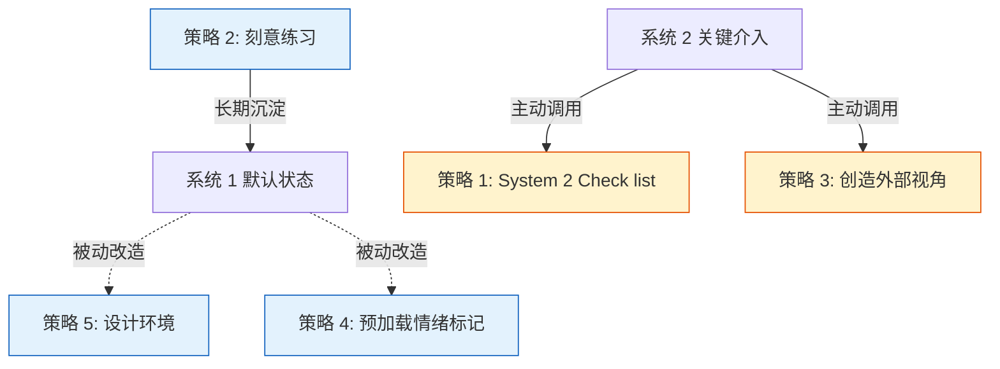

> **来源声明**：本文由 Claude 代写，基于 2026-05-04 与作者关于 inbox §思考快与慢 #3 的对话整理。原素材是作者从《思考，快与慢》读后凝结出的 5 大策略。Claude 负责合成结构与跨模型链接，作者负责 review 与最终判断。

# 工具概述

把 [card-@系统1系统2](card-@系统1系统2.md) 这个**描述性 card**（系统 1 是直觉/快速、系统 2 是理性/缓慢）转成**可用的改造流程**。

核心命题：

> 《刻意练习》本质上是一套**驯化和优化系统 1** 的方法论——它提供了将系统 2 的 deliberate 努力，转化为系统 1 的 automatic 能力的标准化流程。

但仅靠刻意练习还不够——日常决策中还需要 4 类辅助手段，让系统 2 在关键时刻**及时介入**，且让系统 1 的默认走向**经过设计**。本 toolkit 把 5 类手段合成为一个完整的"系统 2 改造系统 1"的流程。

---

# 触发条件

当你处于以下任一情境，调用本 toolkit：

- 想让某个领域的判断从"靠思考"转为"靠直觉"（构建专家直觉）
- 发现自己反复在某个认知偏差上栽跟头（锚定 / 可得性 / 过度自信 / 损失厌恶）
- 发现意志力反复失败（应该用环境设计替代）
- 想让某个习惯自动化（情绪标记 / 默认值设计）

---

# 5 大策略

## 1. 建立 System 2 的 Check list

**目的**：让系统 2 在做判断前**强制扫描自己**，识别系统 1 已经埋下的偏差。

调用清单：

- **锚定效应**：我的第一印象是否受到了某个**无关数字**（初始报价、对比对象）的过度影响？
- **可得性启发**：这个判断是否仅仅因为**最近看到了类似案例**，而忽略了统计基率？
- **过度自信**：我对这个判断的信心是否**远超我所掌握证据的实际支持度**？
- **损失厌恶**：我是否因为害怕**失去**已有的东西或机会，而拒绝了明显更优的选择？

> 详细模型对照见 [card-@认知偏差清单](card-@认知偏差清单.md)。

## 2. 通过刻意练习构建专家直觉

**目的**：把系统 2 的努力沉淀为系统 1 的模式库。

- **专家直觉**：象棋大师能瞬间看出棋局关键，是因为通过大量练习，在脑中存储了数万个棋局模式。想在哪个领域拥有"专业直觉"——就在那个领域进行**大量、有反馈的刻意练习**
- **读书 / 案例学习**：广泛阅读历史、传记、商业案例，等于是在为系统 1 输入丰富的"故事模式"

> 关于刻意练习的完整方法论见 [card-@刻意练习](card-@刻意练习.md) 与 [book-@刻意练习](book-@刻意练习.md)。

## 3. 创造外部视角

**目的**：对抗系统 1 偏爱"具体、生动的内部视角"的天性。

- **基率思维**：在做预测或计划时，刻意问："**类似的项目，通常的基准成功率是多少？**"
- **外部顾问视角**：问自己"如果一个外部顾问来看这件事，他会怎么说？"

## 4. 预加载情绪标记

**目的**：利用系统 1 对**情绪和联想**的高效处理能力，为关键判断点预先绑定情绪锚点。

实施方法：

- 把希望养成的习惯或警惕的错误，与一个**强烈、具体的情感或形象**绑定
- 例：想到"匆忙下结论"时，立刻联想到一次因此导致的尴尬失败场景——这会让系统 1 在下次遇到类似情境时**自动产生警觉**

## 5. 设计环境，而非依赖意志力

**目的**：认知负荷会削弱系统 2，所以**优化环境**比依赖意志力更可持续。

让正确选择变得"自动"：

- **健康饮食**：把水果放在手边，把零食收进柜子（让系统 1 的"顺手"指向健康选择）
- **专注工作**：使用"专注模式"软件屏蔽干扰网站
- **早起阅读**：前一晚把书放在床头，闹钟设在书旁

详细原则见 [ref-战略性懒惰](ref-战略性懒惰.md)。

---

# 5 策略的执行顺序

- **被动改造**（策略 4 + 5）：通过环境与情绪标记**预先**改造系统 1 的默认行为，不需要 in-the-moment 调用系统 2
- **主动介入**（策略 1 + 3）：在系统 2 上线时，强制调用 check list / 外部视角，**当下纠偏**
- **长期沉淀**（策略 2）：刻意练习把系统 2 的努力**沉淀**为系统 1 的能力——这是终极方向

---

# 使用边界

**适用**：

- 个人决策、习惯养成、技能学习、认知偏差对抗
- 中长期改造（环境设计 + 刻意练习需要数周至数年）
- 即时纠偏（Check list 可秒级调用）

**不适用**：

- 极度紧急决策（来不及跑 Check list）→ 靠预先训练好的系统 1 直觉
- 完全陌生领域（系统 2 没有 baseline 知识）→ 先补 book / ref 再回来用本 toolkit
- 集体决策（涉及他人，需要博弈论 / 沟通 toolkit 配合）

---

# 与现有 toolkit 的关系

- **[toolkit-@认知链路](toolkit-@认知链路.md)**：底层认知机制（贝叶斯 → 自由能 → 系统 1/2 → 多巴胺 → 刻意练习）。本 toolkit 是**上层应用**——把那条链路的最后一环（"如何用刻意练习改造系统 1"）展开为可执行的 5 策略。
- **[toolkit-@贝叶斯式批判性思维](toolkit-@贝叶斯式批判性思维.md)**：偏**信念检验**（每次决策前重构假设空间）。本 toolkit 偏**默认改造**（让系统 1 在没被检验时也已经在合理路径上）。
- **[toolkit-@行动三阶段框架](toolkit-@行动三阶段框架.md)**：行动前/中/后的心理框架。和本 toolkit 正交——可以同时使用：行动三阶段管"心态"，本 toolkit 管"系统 1 的能力建设"。

---

# 复现案例

待补充。本 toolkit 刚建立，第一次实战触发后回填。

候选触发场景：

- 工作中下一次重大决策前跑一遍 Check list（策略 1）
- 选一个长期习惯（如早起阅读）做环境设计 + 情绪标记（策略 4 + 5）实验
- 选一个目标领域（如沟通 / 数据分析）做 90 天刻意练习（策略 2）
