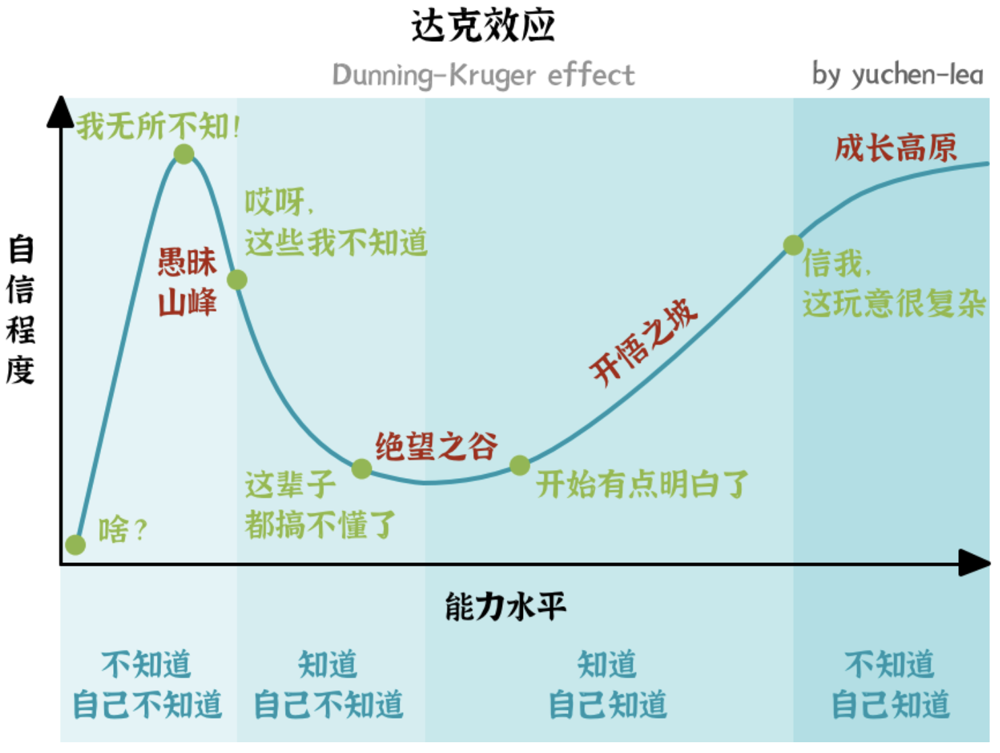

# 2026-04-11：与《思考的框架-I》中提到的 9 个模型之间的关联

今天在整理完 tracking-@思考的框架-I 之后，有以下感悟：

1. 《思考的框架-I》中提到的 9 个模型与芒格的 11 篇演讲之间存在映射关系

2. 查理芒格的所谓“多元维度思考模型”涵盖了多个学科，大体可以分为硬科学和软科学两类 其中硬科学是数学/会计学/物理学/化学/生物学等自然科学；软科学是心理学和微观经济学

3. 所谓的双轨分析，就是一面用理性去分析事实，一面用潜意识分析心理 

4. 最后一篇提到的 25 个认知偏差模型，也许就是地图 ≠ 疆域的具象体现 

于是和 DeepSeek 对话后产生以下洞见：

**关于感悟 1:**

芒格的确在反复强调能力圈、二阶思维、逆向思维、可证伪性、概率思维、第一性原理这些概念

**关于感悟 2:**

我的理解基本正确，但需要补充两点：

- 芒格特别推崇**生物学**（进化论、复利、生态位）和**物理学**（临界点、惯性、均衡），这些在9个模型中没有直接对应，但可以在“二阶思维”“概率思维”中延伸，这些模型在《思考的框架-II/III》中有提及

- 芒格认为硬科学更可靠，而软科学应该谨慎使用

**关于感悟 3:** 

我：理性分析 + 潜意识分析

更贴合的说法应该改为：理性分析事实 + 避免心理误判

DeepSeek 原文如下：

> 他并不完全信任“潜意识”作为积极力量，而是强调要**主动识别并规避**认知偏误（如激励机制造成的偏见、从众、过度自信等）。所以更准确的表述是：**双轨分析 = 理性的事实/逻辑分析 + 心理/情绪倾向的识别与控制**。你的理解方向是对的，只是“潜意识”容易让人联想到弗洛伊德，而芒格更接近行为经济学。

**关于感悟 4：**

DeepSeek 原文如下：

> 芒格列出的误判心理学（奖励/惩罚、喜欢/热爱倾向、避免不一致、确认偏误、可得性启发等），全部都是“地图（大脑的自动认知模板）与疆域（真实世界）”之间的系统性偏差

它们其实可以归类到这 9 个模型中的一个或者多个

这也再次证明，这 9 个模型并非独立存在，而是相互影响的，进而对应感悟 1: 合奏效应

---

除此之外，DeepSeek 认为还可以做以下补充：

1. 考虑 lollapalooza （合奏）效应
2. 制作 checklist
3. 明确能力圈：明确边界比扩大范围更重要
4. 加入复利思维
5. 双轨思维的新理解

**关于补充 1:**

在《思考的框架》中，作者只考虑了单个模型的作用与影响

而芒格认为，在现实世界中，多个模型/多种心理倾向会非线性的叠加在一个人/一个事件上

这种合奏效应会放大极端效应

这也是现实世界如此复杂的原因

**关于补充 2:**

芒格极力推崇制作 checklist 来避免遗漏重要模型

这不是一个思维模型，而是一种元认知流程管理

也就是说，对于我的迁移三维度中的行动维度而言，在行动之前需要制作 checklist 不断追问自己：“有没有考虑二阶思维？/我是否用模型替代了现实？”

**关于补充 3:**

用达克效应可以很好的解释：

也就是说，“知道自己不知道”远比“不知道自己不知道”要重要！！！

**关于补充 4:**

芒格反复强调复利思维的重要性

DeepSeek 认为，复利思维可以看作是在时间维度上的概率思维 + 二阶思维

但它仍然是独立的模型

**关于补充 5:**

芒格建议在任何重要决策中，同时进行两轨分析：

- 第一轨：理性分析事实、概率、利益
- 第二轨：问自己“有哪些心理倾向正在误导我或他人？”

