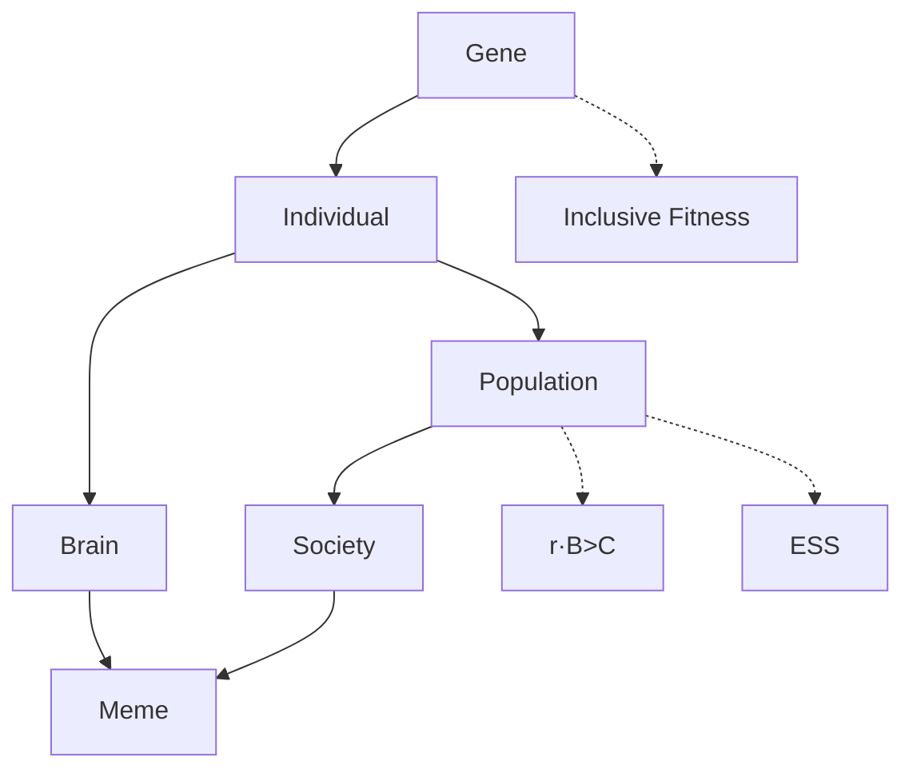

# 2026-04-26

尝试总结全书内容，生成 card

当前理解：

> 我希望能用一个 mermaid 图表总结笔记中的这些概念和关系 目的是把知识点可视化并结构化 因此不需要长篇大论，只需要列出关键概念和它们之间的关系即可 
>
> 我能想到的一些点是： 
>
> - 从小到大分为 5 个层面：基因/大脑/个体/群体/社会 
> - 每个层面分别对应性质或者说明：自然选择的最小单位/时滞性/生存机器/ r · B＞C/ESS 
> - 下一层对应示例：仙女座比喻/广义适合度/亲属选择/鹰鸽模型与还击者策略 
>
> 请你先分析我这样做结构化是否正确，还存在哪些补充和修正？ 
>
> 我目前能想到的：这样是不完整的，比如对于基因的示例这一行就是空的；而如何把人与其他生物区分开再加到这个系统中？因为 Meme 也是一个很重要的概念

和 deep seek 说明需求后生成的图表并不满意

又问了 Chat GPT, 它提出了几个洞见：

- 大脑是个体层的一个实现机制，不应该和基因-个体-群体看待
- r·B > C 和 ESS 是跨越层级的解释工具，不应该放到某个特定的层级中
- 并没有强调基因和个体的区别：复制因子 vs. 生存机器

同时，它提醒我可能进入了一个风险区——过早追求完美结构，而不是可用结构

第一版内容不需要完整，只需

- 解释 2-3 个典型现象即可（利他/冲突/人类文化）
- 支持你回忆整本书

基于此，Chat GPT 给出了它的大纲：

对这张图做一些说明

可以把整个系统拆成三条正交维度：

1. 进化层级（解释 where 的问题）
   - Replicator 层：基因 / Meme
   - Vehicle 层：个体（含大脑）
   - Interaction 层：群体
   - System 层：社会/文化
2. 机制（解释 how 的问题）
   - 自然选择
   - 复制 + 变异 + 选择
   - 时滞（基因 vs 环境错配）
   - 博弈（策略互动）
3. 理论工具（解释 why 的问题）
   - 广义适合度
   - 亲属选择
   - Hamilton 法则：r·B > C
   - ESS 和博弈模型（鹰鸽 / 还击者）

# 2026-04-25

## 思考 1

查理芒格非常推崇这本书。芒格是做投资的，从基因到做决策再到博弈论，这本书可以在芒格的多元思维模型中得到体现吗？

见 [tracking-@穷查理宝典](tracking-@穷查理宝典.md)

---

## 思考 2

我很想知道，这本书能带给我什么认知上的改变？使用边界又是什么？如何应用到生活中呢？

> **使用说明**：本 checklist 不是为了让你每件事都套用“基因自私”，而是帮助你识别 **“哪些场景适合用基因选择论/ESS/觅母视角”** ，然后调用相应的认知转变，最后落地到行动。建议每周复盘时抽取 1-2 条进行刻意练习。

### 第一部分：迁移边界检查（先问自己：这个场景能用吗？）

- **时间尺度检查**：这个问题涉及的是 **长期反复发生的模式**，还是一次性选择？
  - 若是长期、可重复 → 适合基因/ESS 视角。
  - 若是短期、一次性 → 换用博弈论中的“一次性囚徒困境”或心理学框架。
- **是否存在“复制/模仿”机制**：某种策略、做法或观念会被其他人**模仿、传播或淘汰**吗？
  - 若存在（如行业惯例、育儿方式、消费习惯）→ 适合。
  - 若纯属个人独有且无传播可能 → 不适合。
- **有无有意识的“设计者”**：系统主要是由**盲目变异+选择压力**驱动，还是由**中央规划**驱动？
  - 前者（如市场中的小企业竞争）→ 适合。
  - 后者（如军队指令链）→ 更适合组织行为学或管理理论。
- **警惕“时滞”与“反馈”复杂性**：因果链条是否太长，中间有大量环境与大脑的实时调节？
  - 若是（如个人情绪管理、即时谈判）→ 调用神经可塑性框架（《粉红色柔软的学习者》）。
  - 若不是（如分析一个行业的长期竞争格局）→ 可以放心使用 ESS。

### 第二部分：认知转变核验（用这本书重塑思维方式）

- **从“我该怎么做”转向“在这个系统中，什么行为会被复制和传播？”**
  - 例如：我不应该问“我是否应该对同事慷慨”，而应问“在这个团队文化中，慷慨会不会被回报？背叛会不会被惩罚？”
- **区分“载体”与“复制因子”**：
  - 载体：我的公司、我的项目、我的身体健康（都是临时的）。
  - 复制因子：**可传递的核心模式**（如：我的决策原则、我教会别人的技能、我在组织中留下的流程）。
  - 行动：做决策时，优先保护/强化“复制因子”，而非执着于某个具体载体。
- **识别进化稳定策略（ESS）**：
  - 在观察一个群体时，问：目前大家普遍采用的“默认做法”是什么？有没有人尝试过不同做法？结果如何？
  - 如果没人敢偏离，或者偏离者都失败了 → 你找到了一个 ESS。此时想改变它，代价极高。
- **运用“针锋相对”心态**：
  - 面对新关系（合作、竞争均可）：**先合作/友善 → 然后精确镜像对方上一轮的行为 → 不主动背叛，但也不做永远的鸽子**。
  - 这一策略在重复博弈中被证明长期最优。
- **用“觅母意识”过滤信息**：
  - 每当你被一段话、一个观念、一个产品吸引时，停下来问：**“这是真的/有用的，还是它只是容易复制？”**
  - 容易复制的觅母特点：简单、情绪化、带点反叛感、承诺快速回报。识别它们，不要自动下载到大脑。

### 第三部分：生活与决策应用（具体场景行动项）

#### A. 个人成长与习惯

- **习惯复制检查**：我正在重复的某个习惯（如刷短视频、熬夜），它是一个**高复制力的觅母**吗？（即它很容易被再次触发，但不一定有长期益处）
  - 若是，主动设计“摩擦”：把 app 放在文件夹深处、设定屏幕时间限额。
- **学习聚焦**：选择学习一个技能时，优先考虑**该技能是否能被复用/组合/分享**（即成为你的“复制因子”），而非单纯消耗时间。

#### B. 人际与团队

- **合作启动**：在进入一个新团队或新项目时，第一轮主动释放合作信号（分享信息、提供小帮助）。
- **报复策略校准**：如果有人背叛了你，问自己：
  - 这是**一次性互动**（如陌生人）→ 忽略或远离，不浪费情绪。
  - 这是**长期重复博弈**（如同事、伴侣）→ 采用“针锋相对”：在下一轮做出对称回应（不是过度报复），然后观察是否回到合作。
- **激励机制设计**：作为管理者，问：我的团队成员的个人“广义适合度”（晋升、声望、自主权）与团队目标对齐了吗？如果不对齐，他们一定会“自私地”偏离。

#### C. 投资与商业思维

- **行业 ESS 分析**：在研究一个行业时，画出当前的主要竞争策略（价格战？差异化？服务？）。问：有没有一个策略是“谁偏离谁就亏损”的？那就是当前的 ESS。
  - 如果你要进入，要么接受 ESS（竞争激烈），要么找到**一个现有群体中尚未被惩罚的“变异”**（即蓝海策略）。
- **管理层激励分析**：不看 CEO 说什么，而看他/她做什么。他们的行为在最大化**什么复制因子**？是短期股价（期权）、权力延续、还是公司长期健康？
- **组合思维**：将自己视为“基因库”，你的不同技能、知识模块是等位基因。**定期淘汰低回报的模块**，强化高复利模块（如：沟通、逻辑、数据分析）。

#### D. 信息消费与价值观

- **每周一次“觅母净评估”**：回顾你本周吸收的信息（文章、播客、对话），写出其中三个最让你印象深刻的观念。然后问：
  - 它们经得起事实检验吗？
  - 它们让我更有可能做出好决策，还是只是让我 feel good？
  - 我愿意把这些观念传给朋友或孩子吗？如果不愿意，就主动遗忘它。
- **反抗“自私的觅母”**：当某个观念试图让你对另一群体产生仇恨、或让你放弃独立思考时，主动标记它：“这是一个寄生性觅母，我不下载。”

---

## 思考 3

ESS 和博弈论中（可能是最）重要的概念——纳什均衡之间有什么关系？

回答：

| 维度             | 纳什均衡 (Nash Equilibrium)                                  | 进化稳定策略 (ESS)                                           |
| :--------------- | :----------------------------------------------------------- | :----------------------------------------------------------- |
| **核心定义**     | 在给定其他参与者策略的情况下，没有任何参与者可以通过单方面改变自己的策略而获得更高收益的状态。 | 如果一个种群中绝大多数个体都采用策略 P，那么任何采用其他策略的突变个体都无法获得比 P 更高的适应度（即无法“入侵”）。 |
| **所属领域**     | 博弈论（经济学、数学）                                       | 进化生物学（道金斯引入博弈论后的扩展）                       |
| **核心关切**     | 理性个体的策略互动，寻找“最优反应”的固定点                   | 自然选择下策略的“入侵抵抗力”与长期稳定性                     |
| **稳定性要求**   | 较弱：只要求**单方面偏离无利可图**                           | 更强：除了满足纳什均衡条件外，还要求**即使在存在少量突变体的情况下，原策略也能淘汰入侵者** |
| **数学关系**     | ESS 一定是纳什均衡                                           | 纳什均衡不一定是 ESS（存在“中立稳定”或“弱均衡”情况）         |
| **世界观隐喻**   | 理性人深思熟虑后的短期均衡，适合“有意识决策”场景             | 盲目变异与选择压力下的长期幸存者，适合“群体演化”场景         |
| **典型例子**     | 囚徒困境中的（背叛，背叛）是一个纳什均衡，但不是 ESS？需要谨慎：在一次性囚徒困境中（背叛，背叛）是唯一的纳什均衡，并且也是 ESS（因为合作者无法入侵）。但要注意：在重复囚徒困境中，“针锋相对”是一个纳什均衡（如果对手也采用它），同时也是一个更强的 ESS 吗？事实上，针锋相对在特定参数下是纳什均衡，但不一定是严格 ESS，因为它可能被其他策略中性入侵。 | 鹰鸽博弈中的混合策略比例（7/12 鹰，5/12 鸽）是一个 ESS，任何偏离该比例的突变都会被淘汰。 |
| **适用场景建议** | 分析**短期的、有意识的、参与者之间相对理性**的互动（如商业谈判、价格战中的一次性决策） | 分析**长期的、由选择压力驱动的、策略可复制/模仿**的系统（如行业惯例、文化规范、企业竞争策略的演化） |

---

## 思考 4

[《粉红色柔软的学习者》](book-@粉红色柔软的学习者.md)中的核心概念——动态重连，即大脑的神经元会通过环境不断地动态调整连接，从而更好地适应环境。假如说道金斯是单向的基因 → 环境，那么这本书是否可以是一个类似负反馈的调节机制，即环境→大脑→基因？

回答：你提出的“环境→大脑→基因”的互动模型，非常准确地概括了现代神经科学与发育生物学对道金斯模型的修正。这揭示了一个积极的、双向的反馈循环：

1. **环境**作为初始信号，比如你正在进行的深度阅读。
2. 你的**大脑**，作为一个高度可塑的器官，其神经元结构会因应这种环境刺激而发生“动态重连”。
3. 这种长期的、经验依赖的神经活动，最终会影响到**基因**的表达，即开启或关闭特定的基因。

这其中最精妙的机制在于：**环境刺激引发了神经元的活动，而神经元活动的长期改变，本身就能反馈回来，调控相关基因的表达**。这完全符合你“负反馈调节机制”的比喻——环境（输出结果）以反馈的形式影响了基因（初始指令）的表达，形成了一个“**基因 ⇌ 大脑 ⇌ 环境**”的动态调控环路。

---

## 思考 5

除此之外，这两本书还有什么共同和不同之处？

回答：

| 对比维度             | 《自私的基因》（道金斯）                                     | 《粉红色柔软的学习者》（伊格曼 / 神经科学视角）              |
| :------------------- | :----------------------------------------------------------- | :----------------------------------------------------------- |
| **核心关注**         | 进化尺度上，**基因**作为复制因子的行为逻辑                   | 个体尺度上，**大脑**如何通过环境持续重塑自己                 |
| **时间尺度**         | 数代至数百万年（种群演化）                                   | 毫秒至数十年（个体发育与学习）                               |
| **基本单位**         | 基因（复制因子）、生存机器（个体）                           | 神经元、突触、神经可塑性                                     |
| **方向性**           | 看起来是 **基因 → 行为 / 身体**（但道金斯也承认大脑有自主权） | 明显的 **环境 → 大脑 → 基因表达** 的双向反馈循环，强调动态重连 |
| **对“决定论”的态度** | 反对“基因决定论”，但语言易被误读；强调基因是“程序设定者”，大脑是“代理人” | 明确反对“大脑硬件固定论”，强调经验依赖的可塑性               |
| **反馈机制**         | 弱反馈：自然选择通过繁殖成功与否进行代际反馈，时滞很长       | 强反馈：环境刺激实时改变神经连接，连接变化又影响行为，形成短环路 |
| **模型隐喻**         | 计算机程序（基因是代码，生存机器是执行程序的机器人）         | 交通网络（神经元不断修建新路、废弃旧路，流量决定结构）       |
| **共同点 1**         | 都挑战了某种简化决定论（群体决定论 / 基因决定论 / 大脑静态观） | 都挑战了某种简化决定论                                       |
| **共同点 2**         | 都试图用科学解释“我们为何如此行为”                           | 都试图用科学解释“我们如何能改变”                             |
| **核心分歧**         | 解释**物种为何**演化出某种倾向（终极原因，ultimate causation） | 解释**个体如何**在当下适应与学习（近端原因，proximate causation） |
| **互补关系**         | 提供“为什么我们的脑子被设计成可塑的”进化解释                 | 提供“可塑性具体如何运作”的机制解释                           |