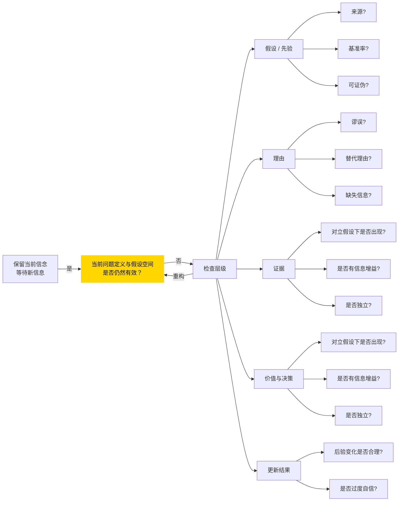

# 认知更新

2026-04-08 更新：

把四篇短文整合在了一起，重新阅读后的新理解如下：

- 大数定律并未考虑系统性偏差 → #1
- 贝叶斯定理只能反映相关性，无法反映因果性 → #1
- 尽人事听天命的学术化表达：贝叶斯定理 + 斯多葛哲学 → #2
- 结合贝叶斯定理与批判性思维，对问题进行不同层面的检验 → #4

2026 年读完《贝叶斯定理》一书后产生了若干思考，以下是正文

[toc]

## #1 对大数定律、贝叶斯与因果论的一些思考

在阅读 [book-@贝叶斯定理](book-@贝叶斯定理.md)时，作者提到了频率派的大数定律：

> 如果在测量工程中只有随机误差，不存在系统误差，那么如果对某个时间进行大量观测，其结果会趋向分布于真值附近

我认为这个假设过于理想化，因为通过[《思考，快与慢》](book-@思考，快与慢.md)我们已经知道，系统 1 对应先验概率，那么系统性的偏见是必然存在的。此外，它还会影响我们后续的判断，即似然比的大小

当先验偏见过于严重，即使似然数据很有说服力，后验也无法得到改观，而贝叶斯思想正是为了防止此类情况发生的有力工具

AI 补充道：

> - 如果说系统 1 是偏见横行的先验，那么贝叶斯公式的作用不是消除偏见，而是强制要求系统 2 介入。当你发现证据（似然）与先验严重冲突时，贝叶斯逻辑会逼你审视：是我的证据错了，还是我的“系统 1 先验”本身就带了严重的系统性偏差？
> - 认知偏差确实会污染“似然比”的判断（即证真偏差）。一个贝叶斯主义者必须具备元认知，即：把“我的判断标准可能已经偏了”也作为一个概率变量放进公式里

此外，我还想到了贝叶斯思想和因果论之间的一些不同

如何衡量假设和现实数据的准确性？是通过相关性还是因果性？用相关性衡量是否比因果性更好？

AI 的回答如下：

> - 视角： 贝叶斯公式本质上是概率关联（相关性），而非因果驱动
> - 批判点： Judea Pearl（贝叶斯网络之父）曾在《致新科学》中批判过度依赖概率而忽视因果。他认为：贝叶斯能告诉你“如果看到烟，火存在的概率”，但不能自动告诉你“如果我点火，是否会产生烟”
> - 你的结论： 假设不一定非要基于因果论，但基于因果论的假设通常具有更强的解释力和先验稳定性

## #2 贝叶斯思想、斯多葛哲学与弗洛伊德

在阅读[book-@贝叶斯定理](book-@贝叶斯定理.md)导论中我读到：

> - 行动前：以贝叶斯定理评估可能性，现在能做什么来改善情况
> - 行动中：以斯多葛哲学心态执行，坦然接受结果
> - 行动后：建立数据反馈—认知升级的闭环系统

那么，什么是斯多葛哲学？是否可以这样理解：

- 斯多葛哲学是超我的心理建设
- 贝叶斯思想的先验判断对应本我
- 客观世界的似然数据对应自我

AI 回答如下：

> ## 1. 贝叶斯思想与“本我/自我”的博弈
>
> - **先验判断（Prior）对应“本我”或“既有经验”：**
>   贝叶斯中的“先验”是我们对世界初始的认知。在某种程度上，这可以类比为**“广义的本我”**——它包含了我们的直觉、本能、过去的习得性偏见以及最初的欲望期待。比如，本我渴望成功（预期概率高），或者基于恐惧对失败有过高的预判。
> - **似然数据（Likelihood）对应“自我”的现实检验：**
>   在弗洛伊德理论中，“自我”遵循**现实原则**。这恰恰是贝叶斯更新的过程：通过观察现实世界不断涌现的证据（似然数据），来修正我们的先验偏见。
> - **行动前的意义：** 你提到的“改善情况”本质上是**自我的理性调节**——通过主动获取信息或改变环境变量，来提高成功（后验概率）的可能性。
>
> ## 2. 斯多葛哲学与“超我”的建设
>
> - **超我（Superego）的升华：**
>   传统的“超我”往往涉及道德批判和完美主义。但斯多葛主义对超我进行了一种**升级**：它不是让你去苛责自己，而是建立一套高维度的**价值观准则**。
> - **行动中的心态：**
>   斯多葛的核心是“控制二分法”。当你进入行动阶段，外界的反馈（结果）是不受控的。此时，斯多葛哲学像一个**理想化的超我**，它告诉自我：“你已经按照理性完成了职责，至于结果好坏，不影响你作为一个德行完备的人的价值。”
> - **心理防御机制：**
>   这种“坦然接受”实际上是防止“自我”因为现实的打击（失败）而陷入崩溃或抑郁。它用理性的力量构建了一道防火墙，将个人价值与外界成败隔离开。
>
> ## 3. 一个可能的微调建议
>
> 虽然你的类比很精彩，但有一点微小的区别：
>
> - **斯多葛不仅仅是超我：** 它其实是**更高阶的“自我”训练**。斯多葛派强调“理性”是人的神圣本性，他们试图通过理性让“自我”变得无比强大，强大到不再需要依赖“超我”的赞赏或“本我”的满足。

AI 给出的总结为：

> 1. **准备阶段（贝叶斯+自我）：** 承认“本我”的预期，但运用“自我”去收集数据，计算概率，通过**科学的计算**去优化行动策略。这是**“尽人事”**
> 2. **执行阶段（斯多葛+超我）：** 屏蔽焦虑，只关注当下的动作（ Virtue）。将目标从“赢得结果”转化为“做出正确的反应”。这是**“听天命”**
> 3. **反馈阶段（再回贝叶斯）：** 无论结果好坏，将其视为新的“似然数据”，输入系统，作为下一次行动的“先验”

## #3 基于贝叶斯思想与斯多葛哲学的复盘计划

结合贝叶斯思想和斯多葛哲学，提出问题：如何更好地复盘？具体为：

- 从这次成功/失败中学到了什么，用职场的话说就是，有哪些 lessons learned?
- 如何在下一次行动中实现复利？

为此，使用工作日志进行复盘是很有必要的

但是，要避免把日志记成流水账

所以，应该记录的内容是认知预测偏差：开始是怎么想的？最后的结果是什么？偏差在哪里？又是怎么修正偏差的？

AI 给出的复盘记录模板为：

> ## 第一部分：决策快照（行动前 - 贝叶斯先验）
>
> *这部分必须在行动前或刚开始时写，哪怕只有一句话*
>
> - **初始假设：** 我认为做 A 能够达成 B 效果（预期胜率：X%）
> - **关键依据：** 基于过去的经验 C 和目前的资源 D
> - **控制边界：** 我能控制的是 E，不能控制的是 F（他人反馈/市场波动）
>
> ## 第二部分：结果记录（行动后 - 斯多葛式客观描述）
>
> *这里使用**第三人称视角**，像写实验报告或法庭笔录一样，严禁使用“我感到、我真笨、太可惜了”等词汇
>
> - **事件还原：** 2026年X月X日，执行了方案 A。过程中发生了变量 G（未预料到的）
> - **最终结果：** 达成率为 Y%，与预期偏差为 Z
> - **情绪标记（仅记录，不沉溺）：** 观察到个体（自己）出现了焦虑/挫败感，持续时长 X 分钟，现已恢复理性状态
>
> ## 第三部分：偏差校准（核心 - 复利点）
>
> *这是最重要的一步，分析“为什么我的贝叶斯模型失效了”*
>
> - **信息差：** 我漏掉了哪个关键信息？（例如：高估了同事的配合度）
> - **逻辑差：** 我的推理逻辑中是否存在“幸存者偏差”或“过度自信”？
> - **环境变动：** 现实世界的规则是否发生了变化？
> - **下一次迭代：** 如果再次遇到类似情况，我的**先验概率**应调整为多少？我的**检查清单**要增加哪一条？

## #4 贝叶斯思想与批判性思维

### 0. 初始问题

[book-@学会提问](book-@学会提问.md)这本书的核心概念是批判性思考，这与贝叶斯思想[book-@贝叶斯定理](book-@贝叶斯定理.md)不谋而合

我们总说，提出一个好的问题远比得到答案重要

贝叶斯定理不是为了证明某个假设正确的可能性，而是通过不断增加信息修正假设

所谓的批判性思考，就是不断通过更新的信息，完善问题描述的过程

那么，批判性思考/提出正确问题与贝叶斯的关系是什么？

### 1. 初始理解

我的理解如下：

首先，贝叶斯理论的局限性在于，只能在已有的假设集合上进行更新，而批判性思考则允许接受“论题尚未定义清晰”这样的观念，即重构假设空间本身

其次，批判性思考通过以下几点，为贝叶斯理论创造了使用的前置条件：

- 问自己假设/猜想（assumption）是什么？以及为什么我会形成这样的 assumption？
- 问自己议题（issue）的论证过程中，理由（reason）是否存在谬误/替代理由/缺失信息/模糊，从而明确假设空间是否完整

接着，问自己议题的论述过程中，证据（evidence）的精度如何：

- 如果论题的对立面成立，该证据是否依然出现？如果出现，说明其和论题的相关性不高
- 这个证据在区分假设时，是否存在信息增益？是否属于噪声？

还有，批判性思维还要考虑现实中价值体系对权重分配的影响：

- 不可能有 100% 的正确或者错误，我们能做的只是在这二者之间不断地调整自己的概率权重
- 相同的后验概率，对应不同的价值体系，会导向完全不同的行动方案

最后，不断地重构假设，更新先验，实现动态迭代

### 2. 认知差距

在和 AI 多次对话后，发现贝叶斯思想其实是批判性思维中的一部分，于是更新问题：

从贝叶斯思想到批判性思考中间的差距有哪些？

> - 批判性思考不是一套步骤，而是一种持续检查“问题—信息—信念”是否对齐的机制
> - 贝叶斯更新只是其中一个局部工具，用于在**问题尚且成立时**调整信念强度
> - 一旦任何环节显示失配，理性行为不是继续更新，而是退回去重构问题本身 

### 3. Checklist

AI 回答如下：

> **A. 问题定义层**
>
> - 这个议题是否被过早二分？
> - 是否存在未被提出的第三种解释？
> - 这个问题是否值得当前投入的认知成本？
>
> **B. 假设 / 先验层**
>
> - 我的核心假设是什么？
> - 这个假设来源于经验、统计，还是情绪与身份？
> - 是否考虑了基准率？
> - 假设是否可被证伪？
>
> **C. 论证结构层**
>
> - 理由是否存在逻辑谬误？
> - 是否存在被忽略的替代理由？
> - 假设空间是否被人为收窄？
>
> **D. 证据评估层**
>
> - 在对立假设下，该证据是否仍常出现？
> - 是否真的提供信息增益？
> - 多条证据是否信息独立？
>
> **E. 更新与决策层**
>
> - 后验变化是否与证据强度匹配？
> - 行动是否受价值权重影响？
> - 错误代价是否对称？
>
> **F. 迭代与停止**
>
> - 是否需要重构问题本身？
> - 是否继续更新，还是暂时搁置？
> - 当前不确定性是否被诚实保留？

AI 为我补充了五点内容：

> 1. 基准率（base rate）是多少——防止罕见事件被情绪放大，问自己“如果我完全不知道这个具体案例，仅仅基于历史频率，我会给它多大的概率？”
> 2. 证据是否独立——问自己“这些证据在信息源上是否真正独立？如果不是，我是不是在重复更新？”
> 3. 假设是否被设计成不可证伪——“在什么情况下，我会明确降低对这个假设的信任？”
> 4. 要区分“信念更新”与“行动阈值”——“如果我错了，代价有多大？这种代价是否对称？”
> 5. 信念更新不是无休止的——“我现在是在获得新信息，还是只是在反复加固已有立场？”

### 4. mermaid 图表

最后，整个思考过程用图表可以表示为：

这个图表始终围绕一个核心问题——当前信念是否仍然配得上现有信息？

换句话说就是：

我是不是在用一个已经过期、过窄、或带偏见的问题框架看事情？

为此，结合批判性思考的内容，可以从 5 个层面检查

同时，设置了 idle 状态，如果没有新信息，就保持当前信念

AI 总结道：

> 如果把这整套系统翻译成人话，它其实是在不断问一句话：
>
> **我现在看到的不适感，是因为信息更新，
> 还是因为我一开始问错了问题？**
>
> - 如果是前者 → 留在检查层级里更新
> - 如果是后者 → 回到核心，推倒重来
> - 如果两者都没有 → 安静地等待新信息

